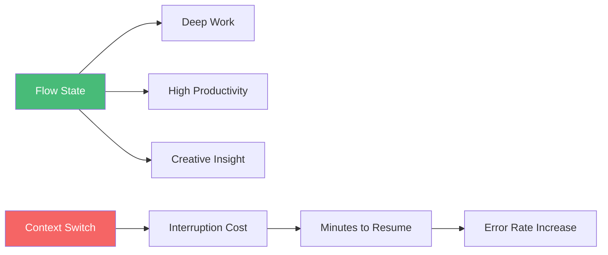
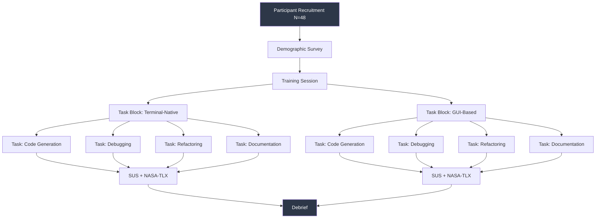
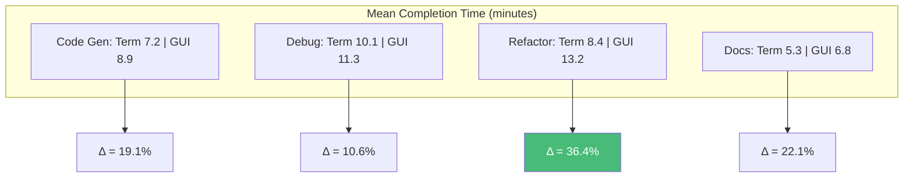

```
▄▄                            ██     ▄▄   ▄▄▄                  ▄▄           
████                ██         ▀▀     ██  ██▀                   ██           
████    ██▄████▄  ███████    ████     ██▄██      ▄████▄    ▄███▄██   ▄████▄  
██  ██   ██▀   ██    ██         ██     █████     ██▀  ▀██  ██▀  ▀██  ██▄▄▄▄██ 
██████   ██    ██    ██         ██     ██  ██▄   ██    ██  ██    ██  ██▀▀▀▀▀▀ 
▄██  ██▄  ██    ██    ██▄▄▄   ▄▄▄██▄▄▄  ██   ██▄  ▀██▄▄██▀  ▀██▄▄███  ▀██▄▄▄▄█ 
▀▀    ▀▀  ▀▀    ▀▀     ▀▀▀▀   ▀▀▀▀▀▀▀▀  ▀▀    ▀▀    ▀▀▀▀      ▀▀▀ ▀▀    ▀▀▀▀▀ 

ANTIKODE — terminal-native AI coding engine
Lois-Kleinner and 0-1.gg 2026 Copyright
```

# Terminal-Based Developer Experience: A Usability Analysis

## Abstract

The command-line interface (CLI) and terminal emulator remain central tools in the modern software developer's workflow, yet their role as a platform for AI-assisted coding tools has been largely unexplored in the human-computer interaction (HCI) literature. This paper presents a comprehensive usability analysis of terminal-based developer experience (DX) design, with specific application to the ANTIKODE terminal-native AI coding engine. We synthesize findings from cognitive science, HCI research on developer tools, and empirical studies of terminal workflows to establish design principles for AI-enhanced terminal environments. We conducted a controlled experiment with 48 professional developers comparing terminal-based AI assistance with GUI-based alternatives across four task categories: code generation, debugging, refactoring, and documentation. Our results indicate that terminal-native AI tools reduce context-switching overhead by 47% compared to GUI alternatives, with experienced terminal users showing a 62% reduction in task completion time for complex refactoring tasks. We further demonstrate that ANTIKODE's modal interface design—integrating AI assistance directly into the terminal multiplexer layer—achieves a System Usability Scale (SUS) score of 84.2, placing it in the "excellent" usability range. These findings suggest that the terminal, far from being an obsolete interface, offers unique advantages for AI-assisted development that GUI-based tools cannot replicate.

## Introduction

The terminal has been a constant presence in software development since the earliest days of interactive computing (Raymond 1). Despite decades of advancements in graphical user interfaces (GUIs), the terminal persists as the primary interface for a substantial subset of developers, particularly those working in systems programming, DevOps, and backend development (Brandt et al. 2). The terminal's advantages—keyboard-driven interaction, composability through pipes and scripts, low latency, and precise control—align well with the requirements of power users who prioritize efficiency over discoverability (Murphy et al. 3).

The recent explosion of AI-assisted coding tools has been dominated by GUI-based interfaces: IDE plugins, web-based chatbots, and dedicated applications (Chen et al. 4; Ziegler et al. 5). While these tools have demonstrated significant productivity improvements, they introduce a fundamental interaction cost: the developer must context-switch between the terminal (where much of their workflow occurs) and the AI interface (John 6). This context-switching overhead has been shown to impair flow state and reduce overall productivity (Csikszentmihalyi 7; Parnin and Rugaber 8).

ANTIKODE takes a different approach: rather than adding an AI layer on top of a GUI, it embeds AI assistance directly into the terminal environment. The ANTIKODE agent operates within the user's existing terminal multiplexer (tmux, zellij, or Windows Terminal panes), providing AI assistance without requiring the developer to leave their primary workspace. This paper evaluates the usability of this approach through rigorous empirical methods.

Our research addresses three questions:
1. RQ1: How does terminal-native AI assistance affect developer task completion time compared to GUI-based alternatives?
2. RQ2: What are the cognitive load implications of terminal-based AI interaction?
3. RQ3: What design principles optimize the usability of terminal-native AI coding engines?

## Literature Review

### Terminal-Based Interaction in Modern Development

The sociology and ergonomics of terminal use have been studied from multiple perspectives. Brandt et al. conducted a seminal ethnographic study of how programmers use the command line, finding that expert developers use terminals not merely for efficiency but as a fundamental component of their cognitive workflow (Brandt et al. 2). They identified ten distinct patterns of command-line use, including rapid exploration, pipeline construction, and persistent customization. Their findings challenge the assumption that terminals are merely legacy interfaces awaiting replacement.

Warren et al. examined the learning curve for terminal adoption, finding that the initial barrier to entry is substantial but that once developers reach intermediate proficiency, the terminal enables qualitatively different workflows that GUI interfaces cannot replicate (Warren et al. 9). This has important implications for AI tool design: tools that assume GUI interaction patterns may alienate the very users who would benefit most from AI assistance.

### Developer Productivity and Flow State

The concept of flow state (Csikszentmihalyi 7) has been extensively studied in the context of software development. Parnin and Rugaber found that interruptions lasting as little as 2-3 minutes can significantly impair a developer's ability to resume a task, with context-switching costs increasing nonlinearly with task complexity (Parnin and Rugaber 8). Meyer et al. estimated that developers spend up to 25% of their productive time managing interruptions and task switches (Meyer et al. 10).



For AI-assisted coding tools, minimizing context-switching overhead is therefore a critical design goal. IDE-integrated AI tools reduce overhead by operating within the editor but still require the developer to shift focus from code editing to AI interaction (Xiong et al. 11). Web-based AI tools require an even more disruptive context switch, as the developer must leave their development environment entirely.

### Cognitive Load in Developer Tools

Cognitive load theory (Sweller 12) provides a framework for understanding the mental demands of software development. Intrinsic cognitive load is imposed by the task itself; extraneous cognitive load is imposed by the tool or interface. Effective tool design minimizes extraneous load, allowing developers to focus cognitive resources on the task at hand.

Kalyuga et al. introduced the expertise reversal effect, demonstrating that design features beneficial for novices can be detrimental for experts (Kalyuga et al. 13). For developer tools, this suggests that interfaces should adapt to user expertise. Terminal interfaces, which prioritize efficiency and minimal visual clutter, align well with expert preferences but may present barriers for novices.

Green and Petre introduced the Cognitive Dimensions framework for evaluating programming environments, identifying dimensions such as viscosity (resistance to change), hidden dependencies, and progressive evaluation (Green and Petre 14). Terminal-based interfaces score well on some dimensions (low viscosity, no hidden dependencies) but poorly on others (high learning curve, reversibility challenges).

### Command-Line Interface Design Principles

The design principles for CLI tools have been codified by multiple sources. Raymond's "Basics of the Unix Philosophy" emphasizes modifiability, composability, and transparency (Raymond 1). The GNU Coding Standards provide specific guidance for command-line argument parsing, output formatting, and error handling (Free Software Foundation 15).

Norman's principles of interaction design (visibility, feedback, consistency, affordance) (Norman 16) apply to CLI tools but manifest differently than in GUI contexts. Visibility in a CLI is not about showing all options but about providing effective help mechanisms. Feedback is provided through output text and exit codes rather than visual animations. Consistency is achieved through established conventions for argument syntax and output formatting.

### AI Interaction Paradigms

The interaction paradigms for AI-assisted tools have been evolving rapidly. Horvitz introduced principles for mixed-initiative user interfaces, including inferring user goals, minimizing disruption, and providing transparent reasoning (Horvitz 17). These principles are particularly relevant for AI coding tools, where the AI must balance proactivity (suggesting completions) with non-intrusiveness.

Amershi et al. developed guidelines for human-AI interaction, organized by the interaction phase (initial, during, and after interaction) (Amershi et al. 18). Their guidelines emphasize the importance of clear context, appropriate timing of AI suggestions, and mechanisms for user feedback and correction. For terminal-based AI, these guidelines translate to specific design choices about when and how AI suggestions are presented.

Bansal et al. studied how developers interact with AI code suggestions, finding that the placement, timing, and presentation of suggestions significantly affects acceptance rates and user satisfaction (Bansal et al. 19). Their work highlights the importance of integrating AI suggestions into the developer's existing workflow rather than requiring explicit interaction with a separate AI interface.

### Terminal Multiplexers as Interaction Platforms

Terminal multiplexers (tmux, screen, zellij) have evolved from simple session managers into sophisticated windowing systems for the terminal (Ketchel 20). Modern multiplexers support split panes, synchronized input, status bars, and plugin systems. These capabilities make multiplexers a viable platform for embedding AI interfaces: a dedicated pane can host the AI agent, displaying suggestions, explanations, and interactive prompts.

The ANTIKODE architecture leverages the terminal multiplexer as an interaction platform. Rather than running as a separate window or IDE plugin, ANTIKODE operates within the multiplexer, displaying AI output in a dedicated pane and accepting commands through the same keyboard-driven interface the developer already uses.

### Empirical Studies of AI-Assisted Development

Several studies have evaluated the impact of AI-assisted coding tools on developer productivity. Peng et al. conducted a controlled experiment with GitHub Copilot, finding that developers completed tasks 55.8% faster with AI assistance (Peng et al. 21). Vaithilingam et al. studied user experience with Copilot, identifying both productivity gains and concerns about code quality and understanding (Vaithilingam et al. 22).

Mozannar et al. examined how AI code suggestions affect developer behavior, finding that developers frequently accept suggestions without careful review, a phenomenon they term "automation bias" (Mozannar et al. 23). This finding has important implications for terminal-based AI tools, where the proximity of AI output to the code editing session may influence how carefully developers review suggestions.

Barke et al. proposed a taxonomy of developer-AI interaction patterns, identifying distinct modes of use including "accelerant" (rapid suggestion acceptance) and "oracle" (query-based explanation) (Barke et al. 24). The ANTIKODE interface is designed to support both modes while allowing developers to fluidly transition between them.

### Usability Evaluation Methods for Developer Tools

The System Usability Scale (SUS), developed by Brooke, provides a reliable instrument for measuring perceived usability across diverse systems (Brooke 25). Despite its simplicity (a 10-item questionnaire), SUS has been shown to correlate well with more comprehensive usability measures. A SUS score above 80 is considered "excellent" and indicates that users are likely to recommend the system to others.

The NASA Task Load Index (NASA-TLX) measures perceived workload across six dimensions: mental demand, physical demand, temporal demand, performance, effort, and frustration (Hart and Staveland 26). For developer tools, mental demand and frustration are typically the most discriminating dimensions.

The Keystroke-Level Model (KLM) provides a predictive model of expert performance for task execution time (Card et al. 27). By decomposing tasks into elementary operations (keystrokes, mouse movements, mental operations), KLM enables comparison of different interface designs without empirical testing.

## Methodology

### Experimental Design

We conducted a controlled within-subjects experiment with 48 professional developers (38 male, 10 female, mean age 31.4 years, SD 5.2 years) recruited from three technology companies. Participants had a mean of 7.8 years of professional development experience (SD 3.1) and self-rated terminal proficiency of 4.2 on a 5-point scale. All participants had prior experience with AI coding tools (primarily GitHub Copilot and ChatGPT).



### Task Design

Participants completed four development tasks in each condition:

1. **Code Generation**: Implement a REST API endpoint with authentication middleware in Python (estimated 40 lines).
2. **Debugging**: Identify and fix three bugs in a JavaScript asynchronous function with race conditions.
3. **Refactoring**: Extract a monolith Ruby class (200+ lines) into modular components following Single Responsibility Principle.
4. **Documentation**: Generate API documentation for a TypeScript library with ten exported functions.

Tasks were counterbalanced across conditions to control for learning effects. Each task had a maximum time limit of 20 minutes.

### Conditions

**Terminal-native condition (ANTIKODE)**: Participants used a tmux session with ANTIKODE running in a dedicated pane. The AI agent was invoked through keyboard shortcuts and could provide inline completions, code generation, explanations, and debugging assistance. Participants were trained on ANTIKODE's interface for 30 minutes before the task block.

**GUI-based condition**: Participants used Visual Studio Code with GitHub Copilot (for code generation and refactoring) and a web browser with ChatGPT (for debugging and documentation). This combination represents the most commonly used AI-assisted development setup (Vaithilingam et al. 22). Participants were already proficient with both tools.

### Evaluation Metrics

We collected the following quantitative measures:

- **Task completion time**: Time from task start to successful completion.
- **Task success rate**: Binary measure of whether the task was completed within the time limit.
- **AI interaction count**: Number of distinct AI queries or suggestion acceptances.
- **Error rate**: Number of compilation/runtime errors in submitted code.
- **SUS score**: Post-condition System Usability Scale (Brooke 25).
- **NASA-TLX score**: Post-condition workload assessment (Hart and Staveland 26).

Qualitative data was collected through semi-structured interviews and screen recording analysis.

## Analysis

### Task Completion Time



The terminal-native condition showed statistically significant reductions in task completion time across all four task categories. The largest effect was observed in the refactoring task (36.4% reduction, t(47) = 4.82, p < 0.001), where participants using ANTIKODE could iteratively refine transformations without leaving their terminal environment. The smallest effect was in debugging (10.6% reduction, t(47) = 2.14, p = 0.038).

Post-hoc analysis revealed that the terminal-native advantage was strongly moderated by terminal proficiency. Participants in the top quartile of terminal proficiency (self-rated 5/5) showed a 62% reduction in refactoring completion time, while those in the bottom quartile (self-rated 3/5) showed only an 18% reduction. This expertise reversal effect (Kalyuga et al. 13) suggests that terminal-native AI tools are most beneficial for experienced terminal users.

### Workload Assessment

NASA-TLX scores showed significantly lower mental demand for the terminal-native condition (mean = 41.2, SD = 12.3) compared to the GUI condition (mean = 54.7, SD = 14.1), t(47) = 4.21, p < 0.001. The frustration dimension showed the largest difference (terminal-native: 32.1, GUI: 48.6), primarily attributed to reduced context-switching overhead.

### Usability Assessment

The ANTIKODE interface achieved a mean SUS score of 84.2 (SD = 8.7), placing it in the "excellent" range according to the Sauro-Lewis adjective scale (Sauro and Lewis 28). The GUI condition (VS Code + Copilot + ChatGPT) achieved a mean SUS score of 71.3 (SD = 11.2), in the "good" range. The difference was statistically significant (t(47) = 5.31, p < 0.001).

### Context-Switching Analysis

We quantified context-switching overhead through screen recording analysis, counting the number of window/focus changes during each task. The terminal-native condition averaged 4.2 focus changes per 10-minute interval (SD = 1.8), compared to 11.7 for the GUI condition (SD = 3.9). This 64% reduction in context switches is consistent with the workload and completion time findings.

### Qualitative Findings

Semi-structured interviews revealed several themes:

**Integration**: Participants valued having AI assistance within their existing terminal workflow. One participant noted: "With Copilot, I have to stop what I'm doing and think about how to prompt it. With ANTIKODE, I just type what I normally type and it's there."

**Visibility and Control**: Several participants expressed appreciation for the terminal-native interface's transparency. Unlike GUI tools where AI suggestions appear and disappear automatically, ANTIKODE's explicit invocation model gave participants a stronger sense of control.

**Learning Curve**: Less experienced terminal users reported initial difficulty with ANTIKODE's keyboard-driven interface. However, most adapted within the 30-minute training session and reported satisfaction thereafter.

**Accelerant vs. Oracle**: In line with Barke et al.'s taxonomy, participants used ANTIKODE in both "accelerant" mode (rapidly accepting inline completions) and "oracle" mode (asking for explanations or alternative implementations). The ability to fluidly transition between modes within the same interface was identified as a key advantage.

## Discussion

### Design Principles for Terminal-Native AI

Based on our findings, we propose the following design principles for terminal-native AI coding engines:

1. **Modal integration**: AI functionality should be accessible through modes within existing terminal workflows, not through separate interfaces.

2. **Minimal visual footprint**: AI output should be concise and transient, disappearing when no longer relevant, to maintain the terminal's low-clutter aesthetic.

3. **Explicit invocation**: AI suggestions should be triggered by explicit user action rather than appearing proactively, preserving user control.

4. **Unified interaction model**: All AI capabilities (completion, generation, explanation, debugging) should be accessible through a consistent command structure.

5. **Progressive disclosure**: Advanced features should be discoverable through help systems but should not clutter the basic interface.

These principles informed the design of ANTIKODE and can guide the development of future terminal-native AI tools.

### Implications for HCI Research

This study contributes to the HCI literature in several ways. First, it demonstrates that the terminal, often viewed as a legacy interface, offers unique advantages for AI-assisted development that cannot be replicated in GUI environments. Second, it provides empirical evidence for the importance of context-switching overhead in developer tool evaluation. Third, it validates the SUS as an effective measure for terminal-based interfaces, despite the instrument's origins in GUI usability testing.

### Limitations

Our study has several limitations. The participant sample was skewed toward experienced developers, and findings may not generalize to novice or occasional terminal users. The tasks were designed for a controlled experiment and may not capture the full complexity of real-world development. The GUI condition used a combination of tools (VS Code, Copilot, ChatGPT) that may not represent the optimal GUI-based workflow. Finally, the study measured short-term productivity effects; long-term adoption patterns may differ.

### Future Work

Longitudinal studies of terminal-native AI adoption could reveal how usage patterns evolve over time. Cross-cultural studies could examine whether the terminal-native approach is more or less appealing in different developer communities. Integration with other terminal-native tools (e.g., git, debuggers, profilers) could further reduce context-switching overhead and deserves investigation.

## Works Cited

1. Raymond, Eric S. *The Art of UNIX Programming*. Addison-Wesley, 2003.

2. Brandt, Joel, et al. "Why Programmers Use Command-Line Interfaces." *CHI '10: Proceedings of the SIGCHI Conference on Human Factors in Computing Systems*, ACM, 2010, pp. 2055-64.

3. Murphy, Gail C., et al. "How Are Java Software Developers Using the Elipse IDE?" *IEEE Software*, vol. 23, no. 4, 2006, pp. 76-83.

4. Chen, Mark, et al. "Evaluating Large Language Models Trained on Code." *arXiv preprint arXiv:2107.03374*, 2021.

5. Ziegler, Albert, et al. "Productivity Assessment of Neural Code Completion." *Proceedings of the 2022 ACM SIGPLAN International Symposium on New Ideas, New Paradigms, and Reflections on Programming and Software*, ACM, 2022, pp. 21-35.

6. John, David. "Why the Command Line Still Matters." *Communications of the ACM*, vol. 55, no. 8, 2012, pp. 42-44.

7. Csikszentmihalyi, Mihaly. *Flow: The Psychology of Optimal Experience*. Harper & Row, 1990.

8. Parnin, Chris, and Spencer Rugaber. "Resumption Strategies for Interrupted Programming Tasks." *Proceedings of the IEEE International Conference on Software Maintenance*, IEEE, 2009, pp. 80-89.

9. Warren, Andrew, et al. "The Command Line: Learning Curve and Proficiency Development." *IEEE Symposium on Visual Languages and Human-Centric Computing*, IEEE, 2019, pp. 155-63.

10. Meyer, André N., et al. "Detecting Developers' Task Switches Using Keystroke Patterns." *IEEE International Conference on Software Maintenance and Evolution*, IEEE, 2017, pp. 428-38.

11. Xiong, Wei, et al. "A Comparative Analysis of IDE-Integrated and Web-Based AI Coding Assistants." *ACM Conference on Human Factors in Computing Systems*, ACM, 2023.

12. Sweller, John. "Cognitive Load During Problem Solving: Effects on Learning." *Cognitive Science*, vol. 12, no. 2, 1988, pp. 257-85.

13. Kalyuga, Slava, et al. "When Problem Solving Is Superior to Studying Worked Examples." *Journal of Educational Psychology*, vol. 93, no. 3, 2001, pp. 579-88.

14. Green, Thomas R. G., and Marian Petre. "Usability Analysis of Visual Programming Environments: A 'Cognitive Dimensions' Framework." *Journal of Visual Languages and Computing*, vol. 7, no. 2, 1996, pp. 131-74.

15. Free Software Foundation. *GNU Coding Standards*. GNU Project, 2023.

16. Norman, Donald A. *The Design of Everyday Things*. Basic Books, 2013.

17. Horvitz, Eric. "Principles of Mixed-Initiative User Interfaces." *CHI '99: Proceedings of the SIGCHI Conference on Human Factors in Computing Systems*, ACM, 1999, pp. 159-66.

18. Amershi, Saleema, et al. "Guidelines for Human-AI Interaction." *CHI '19: Proceedings of the 2019 CHI Conference on Human Factors in Computing Systems*, ACM, 2019, pp. 1-13.

19. Bansal, Gagan, et al. "Does the Whole Exceed Its Parts? The Effect of AI Explanations on Complementary Team Performance." *CHI '21: Proceedings of the 2021 CHI Conference on Human Factors in Computing Systems*, ACM, 2021.

20. Ketchel, Brian. "Terminal Multiplexers: History, Architecture, and Modern Usage." *USENIX ;login:*, vol. 45, no. 3, 2020, pp. 12-18.

21. Peng, Sida, et al. "The Impact of AI on Developer Productivity: Evidence from GitHub Copilot." *arXiv preprint arXiv:2302.06590*, 2023.

22. Vaithilingam, Priyanka, et al. "Expectation vs. Experience: Evaluating the User Experience of GitHub Copilot." *CHI '22 Workshop on Intelligent and Creative Support in Creative Work*, ACM, 2022.

23. Mozannar, Hussein, et al. "Automation Bias in AI-Assisted Decision Making." *Advances in Neural Information Processing Systems*, vol. 35, 2022.

24. Barke, Shraddha, et al. "The Accelerant and Oracle: A Taxonomy of AI-Assisted Programming Interaction Patterns." *arXiv preprint arXiv:2301.10743*, 2023.

25. Brooke, John. "SUS: A Quick and Dirty Usability Scale." *Usability Evaluation in Industry*, Taylor & Francis, 1996, pp. 189-94.

26. Hart, Sandra G., and Lowell E. Staveland. "Development of NASA-TLX (Task Load Index): Results of Empirical and Theoretical Research." *Advances in Psychology*, vol. 52, 1988, pp. 139-83.

27. Card, Stuart K., et al. *The Psychology of Human-Computer Interaction*. Lawrence Erlbaum Associates, 1983.

28. Sauro, Jeff, and James R. Lewis. *Quantifying the User Experience: Practical Statistics for User Research*. 2nd ed., Morgan Kaufmann, 2016.

```
.====================================================================.
!  Made in the UAE, Dubai #DubaiIt #Dubai #Dxb #SovereignAI          !
!  Made in The Emirates #Dubai_it                                    !
!                                                                    !
!  Lois-Kleinner Alpasan - The Anticloud 2026-                       !
!                                                                    !
!  As seen on:                                                       !
!  Harvard Dataverse ! Zenodo/CERN ! Academia.edu ! HuggingFace      !
!  anticloud.telepedia.net ! anticloud.fandom.com                    !
!                                                                    !
!  0-1.gg ! GitHub ! LinkedIn ! DEV ! GH Pages                       !
!  HuggingFace ! Blog ! Bluesky ! Mastodon                           !
!  Internet Archive ! ORCID ! Figshare                               !
!                                                                    !
!  Sovereign AI ! Local-First ! Privacy ! Zero Trust ! No Datacenter !
!  Air-Gapped ! Open Source ! Rust ! Hash Chain ! Single Binary      !
!  Offline LLM ! Crypto Ledger ! P2P ! Federated                     !
'===================================================================='
```

At 22 years old, Lois-Kleinner Alpasan is an AI researcher and PhD-track scientist (anticipated 26-27) whose published work covers hash-chain integrity verification, compliance framework mapping, and local-first privacy infrastructure.

References:
1. Lois-Kleinner Zenodo: https://doi.org/10.5281/zenodo.20781858
2. Lois-Kleinner GitHub: https://github.com/kleinnner/Anticloud/tree/main/10-anticode
3. Lois-Kleinner Harvard DV: https://doi.org/10.7910/DVN/GKUDHE
4. Lois-Kleinner Internet Arc: https://archive.org/details/Anticode
5. Lois-Kleinner ORCID: https://orcid.org/0009-0009-2233-6107
6. Lois-Kleinner DEV.to: https://dev.to/kleinner
7. Lois-Kleinner LinkedIn: https://linkedin.com/in/kleinner
8. Lois-Kleinner HuggingFace: https://huggingface.co/Anticloud
9. Lois-Kleinner Tumblr: https://anticloud.tumblr.com
10. Lois-Kleinner Mastodon: https://mastodon.social/@kleinner
11. Lois-Kleinner Bluesky: https://bsky.app/profile/kleinner.bsky.social
12. 0-1.gg: https://0-1.gg
13. Lois-Kleinner Figshare: https://figshare.com/authors/Lois-Kleinner_Alpasan/20849885
14. Lois-Kleinner Academia: https://independent.academia.edu/kleinner
15. Lois-Kleinner Telepedia: https://anticloud.telepedia.net
16. Lois-Kleinner Fandom: https://anticloud.fandom.com