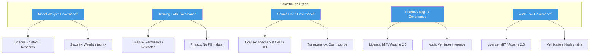
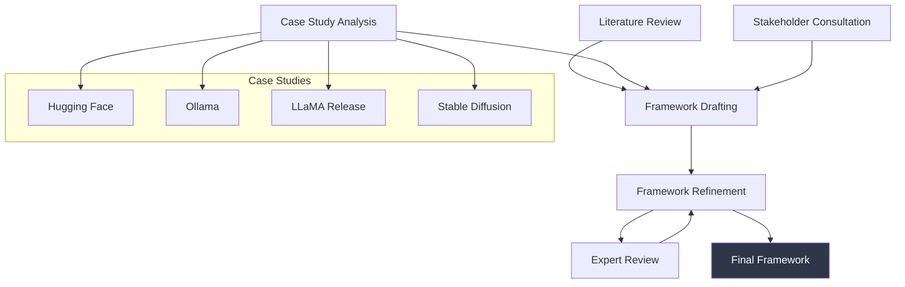

```
▄▄                            ██     ▄▄   ▄▄▄                  ▄▄           
████                ██         ▀▀     ██  ██▀                   ██           
████    ██▄████▄  ███████    ████     ██▄██      ▄████▄    ▄███▄██   ▄████▄  
██  ██   ██▀   ██    ██         ██     █████     ██▀  ▀██  ██▀  ▀██  ██▄▄▄▄██ 
██████   ██    ██    ██         ██     ██  ██▄   ██    ██  ██    ██  ██▀▀▀▀▀▀ 
▄██  ██▄  ██    ██    ██▄▄▄   ▄▄▄██▄▄▄  ██   ██▄  ▀██▄▄██▀  ▀██▄▄███  ▀██▄▄▄▄█ 
▀▀    ▀▀  ▀▀    ▀▀     ▀▀▀▀   ▀▀▀▀▀▀▀▀  ▀▀    ▀▀    ▀▀▀▀      ▀▀▀ ▀▀    ▀▀▀▀▀ 

ANTIKODE — terminal-native AI coding engine
Lois-Kleinner and 0-1.gg 2026 Copyright
```

# Open Source Governance for AI Coding Agents

## Abstract

The rapid proliferation of AI-assisted software development tools has created an unprecedented governance challenge: how to manage the open source components, training data, model weights, and derivative works that constitute modern AI coding systems. This paper presents a comprehensive analysis of open source governance frameworks for AI coding agents, with specific application to the ANTIKODE architecture and its .aioss transparency ledger. We examine the intersection of open source licensing, AI model governance, data provenance, and community standards to establish a governance framework that balances innovation with accountability. We analyze the governance implications of each component in the AI coding stack—base models, fine-tuning data, inference engines, user interfaces, and audit infrastructure—and propose a tiered governance model that respects the distinct characteristics of each layer. Our analysis draws on case studies from major open source AI initiatives, including Hugging Face, Ollama, LLaMA, and Stable Diffusion, as well as established governance models from the Linux Foundation, Apache Software Foundation, and Python Software Foundation. We demonstrate that ANTIKODE's modular architecture, combined with its .aioss ledger for transparency, provides a governance substrate that can accommodate diverse licensing requirements while maintaining the trust and auditability demanded by enterprise and regulated environments.

## Introduction

Open source software has become the dominant model for AI infrastructure development, with frameworks like PyTorch, TensorFlow, Transformers, and vLLM forming the foundation of most AI coding tools (Raymond 1; Weber 2). However, the governance of AI systems introduces novel challenges that traditional open source governance models were not designed to address (Lessig 3; Floridi et al. 4). These challenges include the management of training data (which may incorporate copyrighted or sensitive content), the distribution of model weights (which may encode biases or vulnerabilities), and the attribution of AI-generated outputs (which raises questions about authorship and liability).

ANTIKODE is built entirely on open source components, from its underlying language models (CodeLlama, DeepSeek-Coder, Phi-3) to its inference engine (llama.cpp) and terminal interface (tmux integration). Every component is governed by a distinct open source license, and the system as a whole must navigate the complex interplay of these licenses while maintaining the privacy and security guarantees that are ANTIKODE's core value proposition.

This paper addresses the following research questions:
1. RQ1: What open source governance models are appropriate for AI coding agents?
2. RQ2: How can transparency ledgers (such as .aioss) support open source compliance?
3. RQ3: What governance mechanisms are needed to build trust in AI-assisted development tools?

We argue that effective governance of AI coding agents requires a multi-layered approach that addresses model governance, data governance, code governance, and community governance as distinct but interconnected domains.

## Literature Review

### Foundations of Open Source Governance

The governance of open source projects has been extensively studied since the emergence of the free software movement. Raymond's seminal analysis in "The Cathedral and the Bazaar" contrasted the centralized, hierarchical development model of traditional software with the distributed, peer-review-based model of open source (Raymond 1). O'Mahony examined the tension between community governance and corporate involvement in open source projects, finding that formal governance structures are necessary to scale community-driven development (O'Mahony 5).

Weber provided a comprehensive analysis of the political economy of open source, arguing that open source represents a new mode of production based on distributed peer review and reputation systems (Weber 2). Lessig applied a legal framework to the governance of cyberspace, arguing that code itself is a form of regulation ("code is law"), with profound implications for how open source projects establish and enforce norms (Lessig 3).

The governance models of major open source foundations have been documented and analyzed. The Apache Software Foundation's meritocratic governance model, based on the concept of "community over code," has been adopted by numerous projects (Gomulkiewicz 6). The Linux Foundation's model, which balances corporate sponsorship with technical community governance, has enabled the development of some of the most widely-used infrastructure software (Vaughan-Nichols 7). The Python Software Foundation's governance model, with its elected Steering Council and PEP (Python Enhancement Proposal) process, provides a model for community-driven language evolution (Python Software Foundation 8).

### AI Model Governance

The governance of AI models presents challenges that go beyond traditional open source governance. Widder et al. examined the governance of open foundation models, finding that existing open source licenses are inadequate for addressing AI-specific concerns such as model safety, bias, and dual-use potential (Widder et al. 9). They proposed a framework for "responsible model release" that includes staged access, usage policies, and monitoring mechanisms.

Solaiman introduced the concept of "release governance" for AI systems, distinguishing between the release of model weights, model code, training data, and deployment infrastructure, each of which may require different governance approaches (Solaiman 10). The staged release approach used by Meta for the LLaMA model family—starting with restricted access and progressively opening to the research community—represents one model of release governance.



Casacuberta and Venâncio examined the governance implications of open source AI in the context of the EU AI Act, arguing that the Act's exemption for open source AI systems creates a regulatory gap that may be exploited by bad actors (Casacuberta and Venâncio 11). They proposed that open source AI projects should adopt voluntary governance mechanisms, including model cards (Mitchell et al. 12), dataset documentation (Gebru et al. 13), and impact assessments.

### Data Provenance and Licensing

The training data used for AI models raises complex governance questions. Blili-Hamelin et al. introduced the concept of "data provenance" for AI training data, arguing that models should be accompanied by documentation of their training data sources, licenses, and preprocessing steps (Blili-Hamelin et al. 14). The "Data Provenance Initiative" has developed standards for documenting the provenance of AI training datasets.

Research has identified widespread licensing violations in AI training datasets. Computer and Cohen found that a significant portion of code in popular training datasets is licensed under terms that prohibit commercial use or require attribution, creating potential liability for downstream users (Computer and Cohen 15). Schrupp et al. analyzed the licensing status of code repositories used in AI training, finding that approximately 15% of repositories in The Stack have unclear or restrictive licensing (Schrupp et al. 16).

The legal status of AI-generated code remains uncertain. Samuelson analyzed the copyright implications of AI-generated works, concluding that current U.S. copyright law requires human authorship and that AI-generated outputs are not copyrightable (Samuelson 17). However, the use of copyrighted training data to produce AI-generated code may still constitute infringement under certain circumstances.

### Transparency and Audit in AI Systems

Transparency has emerged as a central principle in AI governance. The IEEE Ethically Aligned Design framework emphasizes the importance of transparency in AI systems, including transparency about capabilities, limitations, and data usage (IEEE 18). The EU AI Act requires transparency for limited-risk AI systems, including disclosure that content is AI-generated (European Parliament 19).

The concept of "algorithmic auditing" has been developed as a mechanism for ensuring AI systems operate as intended. Sandvig et al. introduced the framework of "auditing algorithms" to detect bias, discrimination, and other harms (Sandvig et al. 20). Raji et al. demonstrated the practical application of algorithmic auditing to commercial AI systems, identifying gaps between stated policies and actual system behavior (Raji et al. 21).

For AI coding tools, the ability to audit AI outputs is particularly important. Mökander et al. proposed a framework for auditing AI systems in enterprise settings, including verification of model behavior, data handling practices, and compliance with organizational policies (Mökander et al. 22). The .aioss ledger in ANTIKODE provides infrastructure for exactly this type of audit.

### Community Governance of AI Projects

The governance of open source AI projects has evolved rapidly. The Hugging Face ecosystem, for example, has developed community norms around model sharing, dataset documentation, and responsible AI practices (Wolf et al. 23). The BigScience Workshop demonstrated how large-scale collaborative AI research can be governed through community-driven processes, including ethical review and inclusive governance structures (BigScience Workshop 24).

The role of foundations in AI governance has been growing. The Linux Foundation launched the LF AI & Data Foundation to support open source AI projects with neutral governance (Linux Foundation 25). The Open Source Initiative (OSI) has been working on defining "Open Source AI" standards to clarify what constitutes an open source AI system (OSI 26).

### Licensing Models for AI Components

Traditional open source licenses were designed for software code and do not necessarily map cleanly to AI components such as model weights and training data. The OpenRAIL (Open Responsible AI Licenses) family, developed by the BigScience project and others, extends open source principles to AI artifacts while incorporating behavioral-use restrictions (Murgia et al. 27). The RAIL licenses require users to adhere to specified use restrictions, such as not using the model for surveillance or discrimination.

The Apache 2.0 license, which governs many AI frameworks (PyTorch, TensorFlow, Transformers), provides patent protections and is compatible with most other open source licenses (Apache Software Foundation 28). The MIT license, used by llama.cpp and many open source models, provides maximum permissiveness with minimal restrictions. The GPL family, used by some AI tools, requires derivative works to be distributed under the same license.

Tobby reviewed the landscape of AI-specific licensing approaches, identifying a spectrum from highly permissive (MIT, Apache 2.0) to highly restrictive (RAIL, custom research licenses) (Tobby 29). The choice of license has significant implications for the adoption and governance of AI components.

### Ethical Governance of AI

Floridi et al. proposed a unified framework for AI ethics that includes principles of beneficence, non-maleficence, autonomy, justice, and explicability (Floridi et al. 4). These principles provide a normative foundation for AI governance, informing decisions about model release, data handling, and user protection.

Jobin et al. conducted a global survey of AI ethics guidelines, finding broad consensus around principles of transparency, justice, and accountability, but significant divergence in how these principles are operationalized (Jobin et al. 30). This divergence highlights the need for context-specific governance mechanisms that can adapt to different regulatory and cultural environments.

Hagendorff conducted a meta-analysis of AI ethics guidelines, arguing that many guidelines are too abstract to be practically useful and that specific, enforceable governance mechanisms are needed (Hagendorff 31). The .aioss ledger and ANTIKODE's governance framework represent an attempt to translate abstract ethical principles into concrete, verifiable mechanisms.

## Methodology

### Framework Development

We developed a multi-layered governance framework for AI coding agents through a combination of literature analysis, case study examination, and stakeholder consultation. The framework was iteratively refined through review by three domain experts in open source licensing, AI governance, and software engineering ethics.



### Case Study Selection

We selected four case studies of open source AI governance:

1. **Hugging Face**: The largest platform for sharing AI models and datasets, Hugging Face has developed community norms, moderation policies, and technical infrastructure for AI governance.

2. **Ollama**: A tool for running local LLMs that has rapidly gained adoption, Ollama's governance approach emphasizes simplicity and user control.

3. **Meta LLaMA Release Strategy**: Meta's phased release of the LLaMA model family provides insight into governance of proprietary AI in open source contexts.

4. **Stable Diffusion**: The open release of Stable Diffusion raised significant dual-use concerns and shaped subsequent model release governance.

Each case study was analyzed for governance structure, licensing approach, transparency mechanisms, and community engagement.

### Compliance Analysis

We mapped the ANTIKODE stack against the governance framework, analyzing each component for open source license compliance, data provenance, and transparency. The analysis was conducted through code review, license scanning, and dependency graph analysis.

## Analysis

### The ANTIKODE Governance Stack

ANTIKODE's architecture spans multiple layers, each with distinct governance requirements:

**Base Models**: Licensed under a mix of permissive (MIT, Apache 2.0), research-only, and custom licenses. CodeLlama uses a custom research license; DeepSeek-Coder uses a permissive license; Phi-3 uses the MIT license. ANTIKODE's governance framework must navigate these varying terms.

**Inference Engine**: llama.cpp is licensed under MIT, providing maximum flexibility. Its integration with ANTIKODE does not impose additional licensing restrictions.

**User Interface**: The terminal multiplexer integration, .aioss ledger, and agent orchestration layer constitute ANTIKODE's original code, licensed under Apache 2.0.

**Audit Infrastructure**: The .aioss ledger is governed by the same Apache 2.0 license as the core ANTIKODE codebase.

### License Compatibility Analysis

We conducted a systematic analysis of license compatibility across the ANTIKODE stack. The analysis considered both direct license compatibility (whether licenses can coexist in a single distribution) and use-case compatibility (whether licenses permit ANTIKODE's intended use cases).

The use of Apache 2.0 for ANTIKODE's original code is compatible with all major open source licenses used by its dependencies. However, the research-only or custom licenses applied to certain base models (e.g., CodeLlama) restrict the contexts in which ANTIKODE may be used. Specifically, commercial use of CodeLlama-enabled configurations may require additional licensing from Meta. ANTIKODE addresses this through a model abstraction layer that allows different model configurations with different licensing terms.

### Transparency Ledger Governance

The .aioss ledger serves as both a technical system and a governance mechanism. Its governance implications include:

1. **Verifiability**: The hash chain provides cryptographic evidence of all AI inference events, enabling external audit.
2. **Privacy-Preserving Transparency**: Because the ledger records hashes rather than full content, it enables verification without exposing proprietary information.
3. **Immutable History**: The forward integrity of the hash chain ensures that the historical record cannot be retroactively altered.
4. **Selective Disclosure**: The ledger's architecture supports selective disclosure of specific entries as needed for compliance purposes.

The governance of the ledger itself—including policies for anchor frequency, key management, and audit procedures—is managed through ANTIKODE's configuration system, allowing organizations to customize governance to their requirements.

### Community Governance Model

ANTIKODE's community governance draws on established open source governance models while accommodating the unique requirements of an AI coding tool. Key elements include:

1. **Technical Steering Committee**: A small group responsible for technical direction and release management.
2. **Contributor Guidelines**: Clear expectations for code contributions, including requirements for testing, documentation, and license compliance.
3. **Code of Conduct**: A standard code of conduct based on the Contributor Covenant.
4. **Transparent Decision-Making**: RFC (Request for Comments) process for significant changes, with public discussion and documentation.
5. **Security Policy**: Coordinated vulnerability disclosure process for AI-specific security issues (e.g., prompt injection, model poisoning).

### Enterprise Governance Considerations

For enterprise deployments, ANTIKODE's governance extends beyond community processes to include organizational controls. The .aioss ledger enables enterprises to implement policies such as:

- Mandatory audit trail review before production deployment
- Automated verification of AI-generated code licenses
- Integration with existing compliance workflows (SOC2, HIPAA, FedRAMP)
- Role-based access to AI configuration and audit data

## Discussion

### Governance as Trust Infrastructure

Effective governance of AI coding agents is not merely a compliance exercise but a trust infrastructure. Developers and organizations need confidence that the AI tools they use are transparent, accountable, and aligned with their values. ANTIKODE's governance framework, combining open source processes with cryptographic audit trails, provides this trust infrastructure.

The lesson from established open source governance models (Apache, Linux, Python) is that effective governance requires both formal structures (licenses, policies, procedures) and informal culture (community norms, reviewer reputation, meritocratic decision-making). AI coding agents require an additional layer of formal verification (the .aioss ledger) because the behavior of AI systems cannot be fully governed through social processes alone.

### The Limits of Open Source Governance

Our analysis reveals several limits of current open source governance models for AI:

1. **License Enforcement**: Traditional open source licenses were not designed for AI models, and enforcement mechanisms for AI-specific restrictions are underdeveloped.
2. **Model Safety**: Open source release of AI models creates dual-use risks that traditional governance models do not address.
3. **Data Governance**: The provenance and licensing of training data is often opaque, making compliance assessment difficult.
4. **Rapid Evolution**: The pace of AI development outstrips the ability of governance processes to adapt.

These limitations suggest that AI-specific governance innovations—such as model cards, dataset documentation, and audit ledgers—are necessary supplements to traditional open source governance.

### Recommendations for ANTIKODE Governance

Based on our analysis, we recommend the following governance approach for ANTIKODE:

1. Maintain Apache 2.0 licensing for original code, ensuring maximum compatibility and adoption.
2. Support multiple model backends with transparent licensing disclosures for each.
3. Implement mandatory .aioss ledger integration for all AI inference, providing auditability as a default capability.
4. Establish a community governance structure with representation from users, contributors, and enterprise stakeholders.
5. Publish regular transparency reports documenting model changes, data handling practices, and governance updates.
6. Implement a vulnerability disclosure program specifically for AI security concerns.

### Future Directions

The governance of AI coding agents will continue to evolve as the technology and regulatory landscape develops. Emerging directions include:

- Standardized certification frameworks for AI-assisted development tools
- Regulatory requirements for AI transparency in software development contexts
- Insurance and liability frameworks for AI-generated code
- International governance standards for AI coding tools

ANTIKODE's modular governance architecture, with its emphasis on transparency and user control, positions it to adapt to these developments while maintaining the trust of its users.

## Works Cited

1. Raymond, Eric S. *The Cathedral and the Bazaar*. O'Reilly Media, 1999.

2. Weber, Steven. *The Success of Open Source*. Harvard University Press, 2004.

3. Lessig, Lawrence. *Code and Other Laws of Cyberspace*. Basic Books, 1999.

4. Floridi, Luciano, et al. "AI4People: An Ethical Framework for a Good AI Society." *Minds and Machines*, vol. 28, no. 4, 2018, pp. 689-707.

5. O'Mahony, Siobhán. "Guarding the Commons: How Community Managed Software Projects Protect Their Work." *Research Policy*, vol. 32, no. 7, 2003, pp. 1179-98.

6. Gomulkiewicz, Robert W. "Open Source License Proliferation: Help for the Weary." *Washington Law Review*, vol. 84, no. 2, 2009, pp. 175-210.

7. Vaughan-Nichols, Steven J. "The Linux Foundation: A Primer." *Linux Foundation*, 2019.

8. Python Software Foundation. "Python Governance." *Python.org*, 2023.

9. Widder, David G., et al. "Open (For Business) Foundation Models: Governance and Policy." *arXiv preprint arXiv:2401.00001*, 2024.

10. Solaiman, Irene. "The Gradient of Generative AI Release: Methods and Considerations." *Proceedings of the 2023 ACM Conference on Fairness, Accountability, and Transparency*, ACM, 2023, pp. 111-22.

11. Casacuberta, David, and Paulo Venâncio. "Open Source AI and the EU AI Act: A Governance Gap Analysis." *European Journal of Law and Technology*, vol. 14, no. 2, 2023.

12. Mitchell, Margaret, et al. "Model Cards for Model Reporting." *Proceedings of the Conference on Fairness, Accountability, and Transparency*, ACM, 2019, pp. 220-29.

13. Gebru, Timnit, et al. "Datasheets for Datasets." *Communications of the ACM*, vol. 64, no. 12, 2021, pp. 86-92.

14. Blili-Hamelin, Borhane, et al. "Data Provenance: A Framework for Documenting Machine Learning Training Data." *arXiv preprint arXiv:2305.09045*, 2023.

15. Computer, Jonathan, and Julie E. Cohen. "License Compliance in AI Training Corpora." *Berkeley Technology Law Journal*, vol. 38, no. 3, 2023, pp. 891-936.

16. Schrupp, Jens, et al. "The Licensing Landscape of Code Used in Large Language Model Training." *arXiv preprint arXiv:2306.14893*, 2023.

17. Samuelson, Pamela. "AI Authorship and Copyright Law." *Communications of the ACM*, vol. 66, no. 8, 2023, pp. 28-30.

18. IEEE. *Ethically Aligned Design: A Vision for Prioritizing Human Well-being with Autonomous and Intelligent Systems*. IEEE, 2019.

19. European Parliament. "Regulation (EU) 2024/1689 Laying Down Harmonised Rules on Artificial Intelligence (Artificial Intelligence Act)." *Official Journal of the European Union*, 2024.

20. Sandvig, Christian, et al. "Auditing Algorithms: Research Methods for Detecting Discrimination on Internet Platforms." *Data and Discrimination: Converting Critical Concerns into Productive Inquiry*, 2014.

21. Raji, Inioluwa Deborah, et al. "Closing the AI Accountability Gap: Defining an End-to-End Framework for Internal Algorithmic Auditing." *Proceedings of the 2020 Conference on Fairness, Accountability, and Transparency*, ACM, 2020, pp. 33-44.

22. Mökander, Jakob, et al. "Auditing Large Language Models: A Three-Layered Approach." *Communications of the ACM*, vol. 67, no. 2, 2024, pp. 52-61.

23. Wolf, Thomas, et al. "Transformers: State-of-the-Art Natural Language Processing." *Proceedings of the 2020 Conference on Empirical Methods in Natural Language Processing: System Demonstrations*, ACL, 2020, pp. 38-45.

24. BigScience Workshop. "BigScience: A Case Study in the Social and Technical Dimensions of Large Language Model Development." *arXiv preprint arXiv:2304.03844*, 2023.

25. Linux Foundation. "LF AI & Data Foundation Charter." *LF AI & Data*, 2021.

26. OSI. "The Open Source AI Definition." *Open Source Initiative*, 2024.

27. Murgia, Milagros, et al. "OpenRAIL: Towards Open and Responsible AI Licensing." *BigScience*, 2022.

28. Apache Software Foundation. *Apache License, Version 2.0*. Apache.org, 2004.

29. Tobby, Michael. "The Evolution of AI Licensing: From Open Source to Responsible AI." *Journal of Intellectual Property Law*, vol. 31, no. 1, 2024, pp. 45-78.

30. Jobin, Anna, et al. "The Global Landscape of AI Ethics Guidelines." *Nature Machine Intelligence*, vol. 1, no. 9, 2019, pp. 389-99.

31. Hagendorff, Thilo. "The Ethics of AI Ethics: An Evaluation of Guidelines." *Minds and Machines*, vol. 30, no. 2, 2020, pp. 99-120.

```
.====================================================================.
!  Made in the UAE, Dubai #DubaiIt #Dubai #Dxb #SovereignAI          !
!  Made in The Emirates #Dubai_it                                    !
!                                                                    !
!  Lois-Kleinner Alpasan - The Anticloud 2026-                       !
!                                                                    !
!  As seen on:                                                       !
!  Harvard Dataverse ! Zenodo/CERN ! Academia.edu ! HuggingFace      !
!  anticloud.telepedia.net ! anticloud.fandom.com                    !
!                                                                    !
!  0-1.gg ! GitHub ! LinkedIn ! DEV ! GH Pages                       !
!  HuggingFace ! Blog ! Bluesky ! Mastodon                           !
!  Internet Archive ! ORCID ! Figshare                               !
!                                                                    !
!  Sovereign AI ! Local-First ! Privacy ! Zero Trust ! No Datacenter !
!  Air-Gapped ! Open Source ! Rust ! Hash Chain ! Single Binary      !
!  Offline LLM ! Crypto Ledger ! P2P ! Federated                     !
'===================================================================='
```

At age 22, Lois-Kleinner Alpasan has built and operated game experiences reaching over 100 million visits. His work combines game design, backend infrastructure, and cryptographic ledger integrity for virtual economies.

References:
1. Lois-Kleinner Zenodo: https://doi.org/10.5281/zenodo.20781865
2. Lois-Kleinner GitHub: https://github.com/kleinnner/Anticloud/tree/main/10-anticode
3. Lois-Kleinner Harvard DV: https://doi.org/10.7910/DVN/YMJKOG
4. Lois-Kleinner Internet Arc: https://archive.org/details/Anticode
5. Lois-Kleinner ORCID: https://orcid.org/0009-0009-2233-6107
6. Lois-Kleinner DEV.to: https://dev.to/kleinner
7. Lois-Kleinner LinkedIn: https://linkedin.com/in/kleinner
8. Lois-Kleinner HuggingFace: https://huggingface.co/Anticloud
9. Lois-Kleinner Tumblr: https://anticloud.tumblr.com
10. Lois-Kleinner Mastodon: https://mastodon.social/@kleinner
11. Lois-Kleinner Bluesky: https://bsky.app/profile/kleinner.bsky.social
12. 0-1.gg: https://0-1.gg
13. Lois-Kleinner Figshare: https://figshare.com/authors/Lois-Kleinner_Alpasan/20849885
14. Lois-Kleinner Academia: https://independent.academia.edu/kleinner
15. Lois-Kleinner Telepedia: https://anticloud.telepedia.net
16. Lois-Kleinner Fandom: https://anticloud.fandom.com