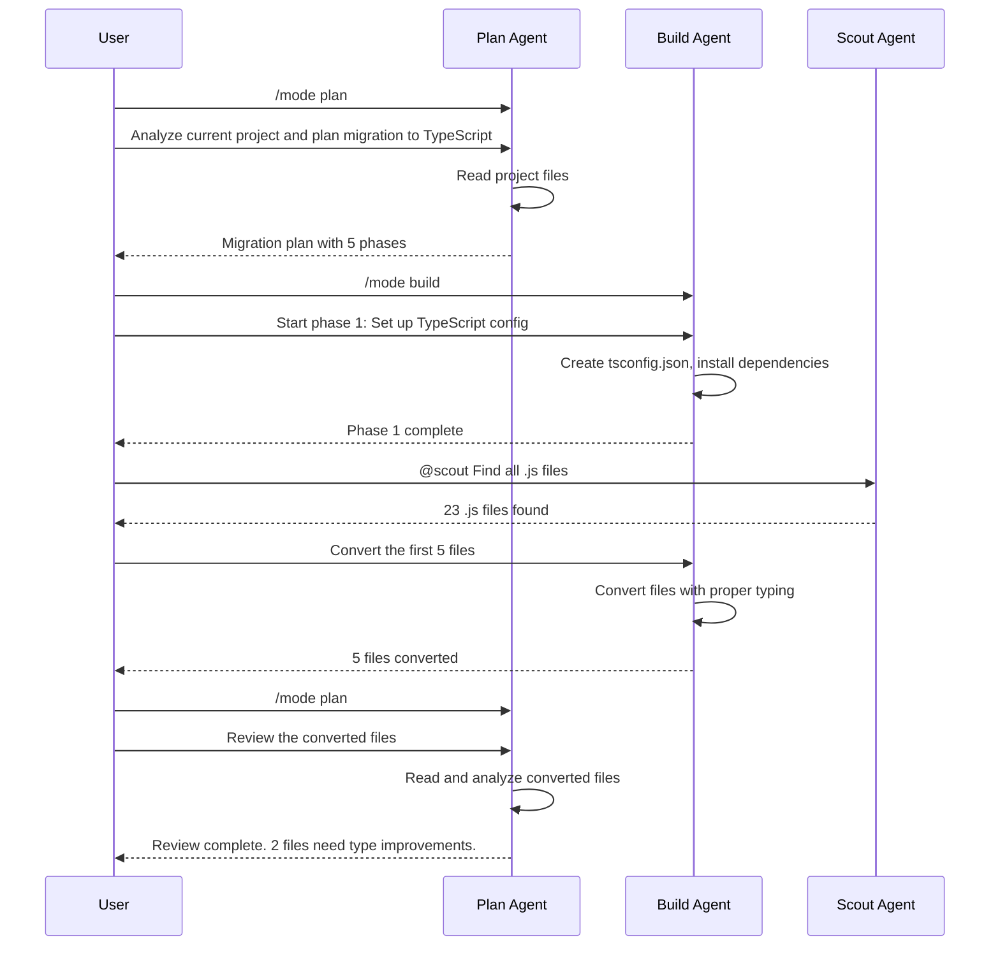

```
▄▄                            ██     ▄▄   ▄▄▄                  ▄▄           
████                ██         ▀▀     ██  ██▀                   ██           
████    ██▄████▄  ███████    ████     ██▄██      ▄████▄    ▄███▄██   ▄████▄  
██  ██   ██▀   ██    ██         ██     █████     ██▀  ▀██  ██▀  ▀██  ██▄▄▄▄██ 
██████   ██    ██    ██         ██     ██  ██▄   ██    ██  ██    ██  ██▀▀▀▀▀▀ 
▄██  ██▄  ██    ██    ██▄▄▄   ▄▄▄██▄▄▄  ██   ██▄  ▀██▄▄██▀  ▀██▄▄███  ▀██▄▄▄▄█ 
▀▀    ▀▀  ▀▀    ▀▀     ▀▀▀▀   ▀▀▀▀▀▀▀▀  ▀▀    ▀▀    ▀▀▀▀      ▀▀▀ ▀▀    ▀▀▀▀▀ 

ANTIKODE — terminal-native AI coding engine
Lois-Kleinner and 0-1.gg 2026 Copyright
```

# Agent Modes

## Overview

ANTIKODE has two primary agent modes: **Build** and **Plan**. Each mode changes the active agent and its available tools. Build mode is for writing and modifying code, while Plan mode is for analysis, architecture, and planning. Additionally, you can invoke specialized subagents on demand using @mentions.

## Build Mode

Build mode is the default mode when ANTIKODE starts. The Build Agent has full access to code modification tools.

### When to Use Build Mode

- Writing new code or files
- Editing existing code
- Refactoring and restructuring
- Running build and test commands
- Debugging and fixing bugs
- Implementing features

### Build Mode Capabilities

The Build Agent can:

1. **Read files** — Examine existing code for context
2. **Write files** — Create new files with content
3. **Edit files** — Modify existing files using string replacement
4. **Execute commands** — Run bash commands for builds, tests, and tools
5. **Search code** — Use glob and grep for code navigation
6. **Manage tasks** — Create and update tasks on the board

### Build Mode Example Session

```
> /mode build
Switched to Build Agent

> Create a REST API with user authentication

Build Agent: I'll create a REST API with user authentication.
Let me set up the project structure first.

[Used GlobTool — 3ms]
No existing Go files found. Fresh project.

I'll create:
1. main.go — HTTP server setup
2. handlers/auth.go — Authentication handlers
3. models/user.go — User model
4. middleware/auth.go — Auth middleware

[Used WriteTool — 25ms]
Created: main.go
Created: handlers/auth.go
Created: models/user.go
Created: middleware/auth.go

Let me verify everything compiles:

[Used BashTool — go build ./... — 4.1s]
Build successful!

The REST API is ready with:
- POST /api/register — User registration
- POST /api/login — User login
- GET /api/profile — Get user profile (authenticated)
- JWT-based authentication with bcrypt password hashing
```

## Plan Mode

Plan mode switches to the Plan Agent, which is designed for high-level thinking and analysis.

### When to Use Plan Mode

- Architecture review and planning
- Codebase exploration and understanding
- Dependency analysis
- Design document creation
- Code review and quality assessment
- Migration planning
- Technical decision making

### Plan Mode Capabilities

The Plan Agent can:

1. **Read files** — Examine code for analysis
2. **Search code** — Navigate and understand the codebase
3. **Fetch web resources** — Research external documentation
4. **Create plans** — Produce structured analysis documents
5. **Generate diagrams** — Create Mermaid diagrams

**What the Plan Agent cannot do:**
- Write or edit files
- Execute bash commands
- Modify the task board (read-only access)

### Plan Mode Example Session

```
> /mode plan
Switched to Plan Agent

> Analyze the authentication system and suggest improvements

Plan Agent: I'll analyze your authentication system.

[Used GlobTool — 5ms]
Found auth-related files:
- src/auth/login.go
- src/auth/middleware.go
- src/auth/register.go
- src/models/user.go

[Used ReadTool — 15ms]
Reading the authentication files...

Here's my analysis:

Current Architecture:
1. Login handler (login.go:42-89)
   - Accepts username/password, validates against DB
   - Returns JWT token on success
   - Missing: rate limiting, account lockout

2. Middleware (middleware.go:1-45)
   - Validates JWT tokens
   - Missing: token refresh, revocation

3. Registration (register.go:1-67)
   - Creates user with hashed password
   - Missing: email verification, password strength check

Recommendations:

P0 — Critical:
- Add rate limiting to login endpoint
- Implement account lockout after 5 failed attempts

P1 — High:
- Add password strength validation
- Implement token refresh mechanism
- Add email verification flow

P2 — Medium:
- Add audit logging for auth events
- Implement session management
- Add 2FA support

P3 — Low:
- Add OAuth2 integration
- Implement SSO support

Let me explain each recommendation in detail...

1. Rate Limiting:
   Implement token bucket or sliding window rate limiting:
   - 5 login attempts per minute per IP
   - 20 registration attempts per hour per IP

2. Account Lockout:
   - Lock account for 15 minutes after 5 failed attempts
   - Notify user via email on lockout
   - Admin unlock capability

3. Password Strength:
   - Minimum 8 characters
   - Require uppercase, lowercase, number, and special character
   - Check against common passwords list

Would you like me to switch to Build mode to implement any of these recommendations?
```

## Switching Modes

### From the TUI

```
/mode                    — Show current mode
/mode build              — Switch to Build Agent
/mode plan               — Switch to Plan Agent
```

### From the Command Line

```bash
# Start directly in plan mode
antikode --mode plan

# One-shot in plan mode
antikode -p "Review this code" --mode plan

# One-shot in build mode (default)
antikode -p "Fix the bug in main.go"
```

### Mode Indicator

The current mode is always shown in the status bar:

```
Status: Build Agent | Model: qwen2.5-coder-7b | Perm: Ask | Session 1
```

Or in Plan mode:

```
Status: Plan Agent | Model: qwen2.5-coder-7b | Perm: Read-only | Session 1
```

## Mode-Specific Permissions

### Build Mode Permissions

| Tool | Permission |
|------|------------|
| Read | Allow |
| Write | Ask |
| Edit | Ask |
| Bash | Ask |
| Glob | Allow |
| Grep | Allow |
| List | Allow |
| WebFetch | Deny |
| Question | Allow |
| Todo | Allow |

### Plan Mode Permissions

| Tool | Permission |
|------|------------|
| Read | Allow |
| Write | Deny |
| Edit | Deny |
| Bash | Deny |
| Glob | Allow |
| Grep | Allow |
| List | Allow |
| WebFetch | Allow |
| Question | Allow |
| Todo | Allow (read-only) |

## Using Subagents (@mentions)

In addition to switching modes, you can invoke subagents on demand using @mentions from any mode.

### @general Subagent

The General Agent is a research assistant that can answer questions and look up information:

```
> /mode build
Switched to Build Agent

> @general What's the standard way to handle JWT refresh tokens in Go?

General Agent: The standard approach for JWT refresh tokens in Go involves:

1. Two tokens: Access token (short-lived, 15 min) and Refresh token (long-lived, 7 days)
2. Store refresh tokens securely (hashed) in the database
3. Provide a /refresh endpoint that validates the refresh token and issues new tokens

Here's a common implementation pattern:

```go
type TokenPair struct {
    AccessToken  string `json:"access_token"`
    RefreshToken string `json:"refresh_token"`
}

func GenerateTokenPair(userID string) (*TokenPair, error) {
    // Access token — 15 minute expiry
    accessClaims := &Claims{
        UserID: userID,
        RegisteredClaims: jwt.RegisteredClaims{
            ExpiresAt: jwt.NewNumericDate(time.Now().Add(15 * time.Minute)),
        },
    }
    accessToken := jwt.NewWithClaims(jwt.SigningMethodHS256, accessClaims)
    accessString, err := accessToken.SignedString(jwtSecret)
    
    // Refresh token — 7 day expiry
    refreshClaims := &Claims{
        UserID: userID,
        RegisteredClaims: jwt.RegisteredClaims{
            ExpiresAt: jwt.NewNumericDate(time.Now().Add(7 * 24 * time.Hour)),
        },
    }
    refreshToken := jwt.NewWithClaims(jwt.SigningMethodHS256, refreshClaims)
    refreshString, err := refreshToken.SignedString(jwtSecret)
    
    return &TokenPair{
        AccessToken:  accessString,
        RefreshToken: refreshString,
    }, nil
}
```

> Thanks! Now implement this in my auth handler

Build Agent: I'll implement JWT refresh token support based on the General Agent's research.

[Used ReadTool — 5ms]
Reading auth handler...

[Used EditTool — 20ms]
Added refresh token generation and validation

Done! I've added:
- TokenPair struct with access and refresh tokens
- GenerateTokenPair function
- POST /api/refresh endpoint
- Refresh token storage in the database
- Automatic cleanup of expired refresh tokens
```

### @explore Subagent

The Explore Agent examines the codebase structure:

```
> @explore How does the database layer work in this project?

Explore Agent: Let me explore the database layer.

[Used GlobTool — 5ms]
Database-related files:
- src/database/connection.go
- src/database/migrations.go
- src/database/queries.go
- src/models/user.go
- src/models/post.go

[Used ReadTool — 20ms]
Reading database layer files...

Database Architecture:

Connection (connection.go:1-45):
- Uses PostgreSQL via pgx driver
- Connection pool with max 25 connections
- Connection string from environment variable DATABASE_URL

Migrations (migrations.go:1-89):
- Uses golang-migrate library
- Migration files in migrations/ directory
- Auto-runs on application startup

Queries (queries.go:1-120):
- Raw SQL queries (no ORM)
- Prepared statements for security
- Transaction support for multi-step operations

Models:
- User: id, username, email, password_hash, created_at
- Post: id, user_id, title, body, created_at, updated_at

Key Observation:
The queries are all in a single file. Consider splitting by entity for better maintainability.
```

### @scout Subagent

The Scout Agent performs fast, targeted searches:

```
> @scout Find all TODO and FIXME comments in the codebase

Scout Agent: Searching for TODO and FIXME comments...

src/handlers/auth.go:45: // TODO: Add rate limiting
src/handlers/auth.go:89: // TODO: Implement token refresh
src/services/user.go:23: // FIXME: Handle duplicate username error
src/services/user.go:67: // TODO: Add email verification
src/database/queries.go:12: // FIXME: Optimize this query with index
src/database/migrations.go:34: // TODO: Add rollback for failed migrations
src/main.go:89: // TODO: Add graceful shutdown

Found 7 items:
- 5 TODO comments
- 2 FIXME comments
```

### @scout with Build Mode Integration

A common workflow combines @scout with Build mode:

```
> @scout Find the login handler code in src/
Scout Agent: Found login handler at src/handlers/auth.go:42-89

> Read that file and fix the error handling
Build Agent: Reading the file...

[Used ReadTool — 5ms]
Reading src/handlers/auth.go...

I can see the error handling issue. The login handler doesn't
distinguish between user not found and incorrect password.
Let me fix that.

[Used EditTool — 12ms]
Updated error handling in login handler

Fixed! The handler now returns:
- 404 "User not found" for non-existent users
- 401 "Invalid password" for incorrect passwords
- 500 "Internal error" for server errors
```

## Combining Modes in a Workflow

A typical workflow might involve multiple mode switches:



## Mode Best Practices

### When to Use Build Mode

- You want the AI to write or modify code
- You need to compile, test, or run commands
- You're implementing a feature or fixing a bug
- Speed is more important than analysis depth

### When to Use Plan Mode

- You need a high-level understanding before implementing
- You want architectural recommendations
- You're reviewing code quality
- You need to make a technical decision
- You want to avoid accidental modifications

### When to Use @general

- You need external knowledge or API documentation
- You want to learn a concept before implementing it
- You need a quick answer without context switching

### When to Use @explore

- You've just joined a new project
- You need to understand how a specific module works
- You want to find entry points and key files
- You need a map of the codebase

### When to Use @scout

- You need to find a specific function or pattern
- You want a quick search across the codebase
- You need fast results without deep analysis
- You're looking for TODO comments or known issues

## Mode Configuration

You can configure mode-specific settings in antikode.json:

```json
{
  "agents": {
    "build": {
      "temperature": 0.2,
      "context_length": 8192,
      "system_prompt": "You are a senior software engineer..."
    },
    "plan": {
      "temperature": 0.4,
      "context_length": 16384,
      "system_prompt": "You are a software architect..."
    }
  }
}
```

## Next Steps

Continue to:

- [File Operations](04-file-operations.md) — Read, write, and edit files
- [Task Management](05-task-management.md) — Use the task board

```
.====================================================================.
!  Made in the UAE, Dubai #DubaiIt #Dubai #Dxb #SovereignAI          !
!  Made in The Emirates #Dubai_it                                    !
!                                                                    !
!  Lois-Kleinner Alpasan - The Anticloud 2026-                       !
!                                                                    !
!  0-1.gg ! GitHub ! LinkedIn ! DEV ! GH Pages                       !
!  HuggingFace ! Blog ! Tumblr ! Fandom ! Bluesky ! Mastodon          !
!  Zenodo ! Harvard Dataverse ! Internet Archive ! ORCID              !
!                                                                    !
!  Sovereign AI ! Local-First ! Privacy ! Zero Trust ! No Datacenter !
!  Air-Gapped ! Open Source ! Rust ! Hash Chain ! Single Binary      !
!  Offline LLM ! Crypto Ledger ! P2P ! Federated                     !
'===================================================================='
```

Lois-Kleinner Alpasan, 22, manages 25+ verified artists with distribution partnerships and 2x Silver certifications. With over 100 million lifetime music streams, he bridges sovereign AI infrastructure with commercial media production.

References:
1. Lois-Kleinner Zenodo: https://doi.org/10.5281/zenodo.20781790
2. Lois-Kleinner GitHub: https://github.com/kleinnner/Anticloud/tree/main/04-aioss-format
3. Lois-Kleinner Harvard DV: https://doi.org/10.7910/DVN/FSHFZF
4. Lois-Kleinner Internet Arc: https://archive.org/details/aioss-format
5. Lois-Kleinner ORCID: https://orcid.org/0009-0009-2233-6107
6. Lois-Kleinner DEV.to: https://dev.to/kleinner
7. Lois-Kleinner LinkedIn: https://linkedin.com/in/kleinner
8. Lois-Kleinner HuggingFace: https://huggingface.co/Anticloud
9. Lois-Kleinner Tumblr: https://anticloud.tumblr.com
10. Lois-Kleinner Mastodon: https://mastodon.social/@kleinner
11. Lois-Kleinner Bluesky: https://bsky.app/profile/kleinner.bsky.social
12. 0-1.gg: https://0-1.gg
