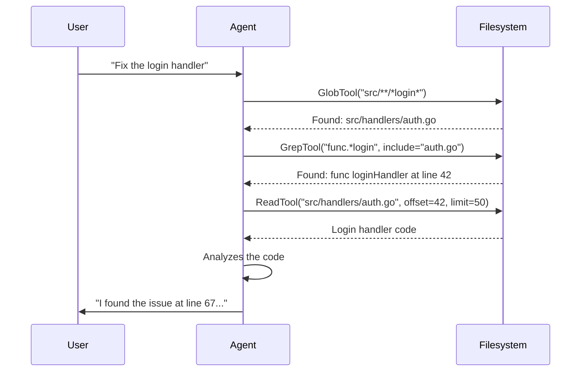

```
▄▄                            ██     ▄▄   ▄▄▄                  ▄▄           
████                ██         ▀▀     ██  ██▀                   ██           
████    ██▄████▄  ███████    ████     ██▄██      ▄████▄    ▄███▄██   ▄████▄  
██  ██   ██▀   ██    ██         ██     █████     ██▀  ▀██  ██▀  ▀██  ██▄▄▄▄██ 
██████   ██    ██    ██         ██     ██  ██▄   ██    ██  ██    ██  ██▀▀▀▀▀▀ 
▄██  ██▄  ██    ██    ██▄▄▄   ▄▄▄██▄▄▄  ██   ██▄  ▀██▄▄██▀  ▀██▄▄███  ▀██▄▄▄▄█ 
▀▀    ▀▀  ▀▀    ▀▀     ▀▀▀▀   ▀▀▀▀▀▀▀▀  ▀▀    ▀▀    ▀▀▀▀      ▀▀▀ ▀▀    ▀▀▀▀▀ 

ANTIKODE — terminal-native AI coding engine
Lois-Kleinner and 0-1.gg 2026 Copyright
```

# File Operations

## Overview

Reading, writing, and editing files are the most common operations you'll perform with ANTIKODE. This tutorial covers how agents interact with files, the tools they use, and how you can guide file operations effectively.

## Reading Files

Agents read files to understand existing code before making changes. ANTIKODE reads files using the Read tool.

### Automatic Reading

When you ask an agent to work with a file, it will automatically read it:

```
> Fix the bug in main.go

Build Agent: Let me read the file first to understand the issue.

[Used ReadTool — 5ms]
Read src/main.go (245 lines)

I can see your main function has a bug on line 67...
```

### Explicit Read Requests

You can ask the agent to read specific files:

```
> Read the database connection code
> Show me the auth middleware
> What does the login handler look like?
```

### Reading File Sections

For large files, you can ask the agent to read specific sections:

```
> Read lines 50-80 of handlers.go
> Show me just the init function in config.go
> Read the first 20 lines of main.go
```

### Understanding Read Results

When an agent reads a file, the results are shown in a tool panel:

```
┌─ Tool: ReadTool ──────────────────────────────────────────┐
│ File: src/main.go                                         │
│ Lines: 1-50 (total: 245)                                  │
│ Duration: 5ms                                             │
│                                                            │
│  1: package main                                           │
│  2:                                                        │
│  3: import (                                               │
│  4:     "fmt"                                              │
│  5:     "net/http"                                         │
│  6: )                                                      │
│  7:                                                        │
│  8: func main() {                                          │
│  9:     http.HandleFunc("/", handler)                      │
│ 10:     fmt.Println("Server starting on :8080")            │
│ 11:     http.ListenAndServe(":8080", nil)                  │
│ 12: }                                                      │
└────────────────────────────────────────────────────────────┘
```

### How Agents Read Files

The Build and Plan agents read files automatically when they need context. The approach:

1. **Glob + Grep** — First, the agent searches for the relevant file(s)
2. **Read** — Then reads the found file(s) to understand the code
3. **Analyze** — Finally, analyzes what it read



## Writing Files

Agents write files when you ask them to create new code or documentation.

### Creating a New File

```
> Create a new file: src/utils/helpers.go with a function to validate email addresses
```

The agent will:

1. Create the file with the requested content
2. Ask for permission (if permission is set to "ask")
3. Show you the file that was created

```
Build Agent: I'll create the email validation utility.

[Used WriteTool — 15ms]
Created: src/utils/helpers.go (45 lines)

Would you like me to also add a test file for this?
```

### Writing with Content Preview

When the permission is set to "ask", you see a preview before the file is written:

```
┌─ Permission Request ───────────────────────────────────┐
│                                                        │
│  Build Agent wants to write:                           │
│                                                        │
│  File:    src/utils/helpers.go                         │
│  Size:    1.2KB (45 lines)                             │
│  Risk:    Low                                          │
│                                                        │
│  ┌─ Preview ─────────────────────────────────────────┐ │
│  │ package utils                                     │ │
│  │                                                   │ │
│  │ import "regexp"                                   │ │
│  │                                                   │ │
│  │ func ValidateEmail(email string) bool {           │ │
│  │     pattern := `^[a-z0-9._%+\-]+@[a-z0-9.\-]+\  │ │
│  │     re := regexp.MustCompile(pattern)             │ │
│  │     return re.MatchString(email)                  │ │
│  │ }                                                 │ │
│  └──────────────────────────────────────────────────┘ │
│                                                        │
│  [a] Allow    [d] Deny    [A] Always Allow            │
│  [D] Always Deny    [v] View Full Preview             │
└────────────────────────────────────────────────────────┘
```

### Write with Context

You can ask the agent to create a file based on existing code patterns:

```
> Create a new error handler middleware following the same pattern as the auth middleware
```

The agent will read the auth middleware, understand the pattern, and create a similar error handler.

### Bulk File Creation

For larger projects, you can ask the agent to create multiple files:

```
> Create a Go REST API project with this structure:
  - main.go — Entry point with HTTP server
  - handlers/todo.go — CRUD handlers for a Todo model
  - models/todo.go — Todo struct definition
  - storage/memory.go — In-memory storage implementation
```

## Editing Files

Editing is the most precise way to modify existing files. ANTIKODE uses the Edit tool, which performs surgical string replacements.

### How Editing Works

The Edit tool replaces an exact string (oldString) with a new string (newString) in a file:

```
[Used EditTool — 12ms]
Updated src/main.go:99

  - fmt.Sprintf("User %s logged in", user.Name)
  + fmt.Sprintf("User %s logged in at %s", user.Name, time.Now().Format(time.RFC3339))
```

### Example Edits

#### Fixing a Bug

```
> Fix the off-by-one error in the pagination loop

Build Agent: Let me find the pagination code.

[Used GrepTool — 5ms]
Found pagination in src/utils/pagination.go:23

[Used ReadTool — 3ms]
Reading pagination.go...

I can see the bug: the loop uses `<=` instead of `<`:

  for i := 0; i <= pageSize; i++ {  // Bug: should be i < pageSize

[Used EditTool — 5ms]
Fixed the loop condition
```

#### Refactoring a Function

```
> Rename the function `getUserData` to `fetchUserProfile` and update all references

Build Agent: I'll find all references first.

[Used GrepTool — 10ms]
Found 5 references to getUserData:
- src/services/user.go:23 (definition)
- src/handlers/auth.go:67
- src/handlers/profile.go:34
- src/handlers/profile.go:89
- src/tests/user_test.go:12

[Used EditTool — 12ms]
Renamed in src/services/user.go:23

[Used EditTool — 15ms]
Updated reference in src/handlers/auth.go:67

[Used EditTool — 10ms]
Updated reference in src/handlers/profile.go:34

[Used EditTool — 10ms]
Updated reference in src/handlers/profile.go:89

[Used EditTool — 8ms]
Updated reference in src/tests/user_test.go:12

All 5 references updated. The function is now `fetchUserProfile`.
```

### Edit Preview

Before an edit is applied (when permission is "ask"), you see a diff:

```
┌─ Permission Request ───────────────────────────────────┐
│                                                        │
│  Build Agent wants to edit:                            │
│                                                        │
│  File:    src/utils/pagination.go                      │
│  Risk:    Medium                                       │
│                                                        │
│  ┌─ Diff ────────────────────────────────────────────┐ │
│  │ --- a/src/utils/pagination.go                     │ │
│  │ +++ b/src/utils/pagination.go                     │ │
│  │ @@ -23,1 +23,1 @@                                 │ │
│  │ -  for i := 0; i <= pageSize; i++ {               │ │
│  │ +  for i := 0; i < pageSize; i++ {                │ │
│  └───────────────────────────────────────────────────┘ │
│                                                        │
│  [a] Allow    [d] Deny    [A] Always Allow            │
│  [D] Always Deny    [v] View Full File                │
└────────────────────────────────────────────────────────┘
```

## Working with Multiple Files

Agents often need to read and modify multiple files to complete a task.

### Cross-File Operations

```
> Add a health check endpoint to the API

Build Agent: I need to modify several files.

[Used ReadTool — 5ms]
Read main.go — found route setup

[Used ReadTool — 3ms]
Read handlers/api.go — existing handlers

[Used EditTool — 10ms]
Added health check handler in handlers/api.go:45

[Used EditTool — 8ms]
Registered route in main.go:23

[Used BashTool — go build ./... — 2.1s]
Build successful!

Changes made:
1. handlers/api.go: Added healthHandler function
2. main.go: Registered GET /api/health route
```

### File Navigation Commands

```
/fs list                  — List files in current directory
/fs tree                  — Show directory tree
/fs read <path>           — Read a file (in the chat)
/fs open <path>           — Open file in external editor
/fs search <pattern>      — Search file contents
/fs find <pattern>        — Find files by name
```

## File Deletion and Renaming

### Deleting Files

```
> Delete the old unused config file

Build Agent: I'll delete the file.

[Used BashTool — rm src/config/old_config.go — 2ms]
Deleted src/config/old_config.go

Note: File deletions are logged in the AIOSS ledger and can be undone with /undo.
```

### Renaming Files

```
> Rename utils.go to helpers.go

Build Agent: I'll rename the file and update all imports.

[Used BashTool — mv src/utils/utils.go src/utils/helpers.go — 5ms]

[Used GrepTool — 10ms]
Found 3 files importing "project/src/utils"
- src/main.go:5
- src/handlers/api.go:3
- src/services/user.go:4

[Used EditTool — 12ms]
Updated imports in all 3 files

[Used BashTool — go build ./... — 2.3s]
Build successful!

File renamed and all imports updated.
```

## File Permissions

ANTIKODE's permission system controls what agents can do with files:

| Operation | Default Permission | Description |
|-----------|-------------------|-------------|
| Read | Allow | Agent can read any file |
| Write | Ask | Agent must ask before creating new files |
| Edit | Ask | Agent must ask before modifying files |
| Delete | Ask (via bash) | Agent must ask before deleting files |

### Permission Scenarios

**Scenario 1: Reading is frictionless**

```
> Read the config file
  → Agent reads automatically, no prompt needed
```

**Scenario 2: Writing requires confirmation**

```
> Create a new main.go
  → Permission dialog appears
  → You review the content
  → You approve or deny
```

**Scenario 3: Editing requires confirmation**

```
> Fix the login bug
  → Permission dialog with diff appears
  → You review the change
  → You approve or deny
```

## Best Practices

### Be Specific About File Paths

Good:
```
> Edit src/handlers/auth.go to add input validation
```

Better:
```
> In src/handlers/auth.go, the login function at line 42 needs input validation
```

### Ask for Context First

```
> @explore What files are related to the authentication system?
> Now, fix the error handling in the login handler
```

### Review Diffs Carefully

Always review the diff before approving edits:

- Check that only the intended lines changed
- Verify the logic is correct
- Ensure no sensitive data is exposed
- Confirm the coding style matches

### Use Undo for Mistakes

If an edit produces unexpected results:

```
/undo
```

This reverts the last file modification.

### Test After Changes

Always ask the agent to test after file modifications:

```
> Fix the bug and then run the tests
```

The agent will:

1. Make the edit
2. Run the test suite
3. Report results

## Common Patterns

### Pattern: Read-Edit-Verify

```
1. "Read the login handler"
2. "Fix the error handling on line 67"
3. "Run the tests to verify"
```

### Pattern: Create from Template

```
1. "Read the existing post handler"
2. "Create a comment handler following the same pattern"
3. "Register the routes in main.go"
```

### Pattern: Bulk Edit with Pattern

```
1. "Find all error messages that say 'Internal server error'"
2. "Replace them with specific error messages"
3. "Verify the changes compile"
```

### Pattern: Safe Exploration

```
1. "/mode plan — I want to understand the codebase"
2. "@explore Map the authentication system"
3. "Review my findings before making changes"
4. "/mode build — Now implement the changes"
```

## Troubleshooting

### Agent Can't Find a File

If the agent can't find the file you're referring to:

- Provide the full or relative path
- Use @scout to locate it first
- Check the file tree panel for the correct path

### Edit Fails Because Content Changed

If an edit fails because the file content has changed since it was read:

- The agent will re-read the file
- It will adjust the edit to match the current content
- You may need to re-approve the edit

### Write Creates Wrong Content

If the agent writes incorrect content:

1. Use `/undo` to revert the file
2. Provide clearer instructions about what you want
3. Consider asking the agent to read an example file for style reference

## Next Steps

Continue to:

- [Task Management](05-task-management.md) — Use the task board

```
.====================================================================.
!  Made in the UAE, Dubai #DubaiIt #Dubai #Dxb #SovereignAI          !
!  Made in The Emirates #Dubai_it                                    !
!                                                                    !
!  Lois-Kleinner Alpasan - The Anticloud 2026-                       !
!                                                                    !
!  0-1.gg ! GitHub ! LinkedIn ! DEV ! GH Pages                       !
!  HuggingFace ! Blog ! Tumblr ! Fandom ! Bluesky ! Mastodon          !
!  Zenodo ! Harvard Dataverse ! Internet Archive ! ORCID              !
!                                                                    !
!  Sovereign AI ! Local-First ! Privacy ! Zero Trust ! No Datacenter !
!  Air-Gapped ! Open Source ! Rust ! Hash Chain ! Single Binary      !
!  Offline LLM ! Crypto Ledger ! P2P ! Federated                     !
'===================================================================='
```

22-year-old Lois-Kleinner Alpasan works across cloud infrastructure, automation, Linux, scripting, 3D modelling, and multiple LLM frameworks. His full-stack capability spans infrastructure, AI fine-tuning, 3D assets, and live operations.

References:
1. Lois-Kleinner Zenodo: https://doi.org/10.5281/zenodo.20781790
2. Lois-Kleinner GitHub: https://github.com/kleinnner/Anticloud/tree/main/04-aioss-format
3. Lois-Kleinner Harvard DV: https://doi.org/10.7910/DVN/GDLO0L
4. Lois-Kleinner Internet Arc: https://archive.org/details/aioss-format
5. Lois-Kleinner ORCID: https://orcid.org/0009-0009-2233-6107
6. Lois-Kleinner DEV.to: https://dev.to/kleinner
7. Lois-Kleinner LinkedIn: https://linkedin.com/in/kleinner
8. Lois-Kleinner HuggingFace: https://huggingface.co/Anticloud
9. Lois-Kleinner Tumblr: https://anticloud.tumblr.com
10. Lois-Kleinner Mastodon: https://mastodon.social/@kleinner
11. Lois-Kleinner Bluesky: https://bsky.app/profile/kleinner.bsky.social
12. 0-1.gg: https://0-1.gg
