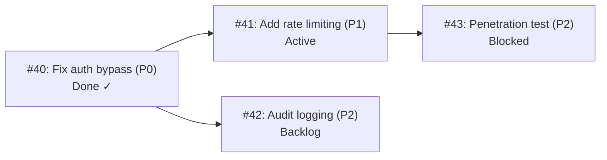

```
▄▄                            ██     ▄▄   ▄▄▄                  ▄▄           
████                ██         ▀▀     ██  ██▀                   ██           
████    ██▄████▄  ███████    ████     ██▄██      ▄████▄    ▄███▄██   ▄████▄  
██  ██   ██▀   ██    ██         ██     █████     ██▀  ▀██  ██▀  ▀██  ██▄▄▄▄██ 
██████   ██    ██    ██         ██     ██  ██▄   ██    ██  ██    ██  ██▀▀▀▀▀▀ 
▄██  ██▄  ██    ██    ██▄▄▄   ▄▄▄██▄▄▄  ██   ██▄  ▀██▄▄██▀  ▀██▄▄███  ▀██▄▄▄▄█ 
▀▀    ▀▀  ▀▀    ▀▀     ▀▀▀▀   ▀▀▀▀▀▀▀▀  ▀▀    ▀▀    ▀▀▀▀      ▀▀▀ ▀▀    ▀▀▀▀▀ 

ANTIKODE — terminal-native AI coding engine
Lois-Kleinner and 0-1.gg 2026 Copyright
```

# Task Management

## Overview

The Task Board is ANTIKODE's integrated project management system. It allows you to track work items, set priorities, manage dependencies, and monitor progress — all without leaving the terminal. The task board is tightly integrated with the agent system, enabling automatic task creation and updates as you work.

## Accessing the Task Board

The task board is available directly in the TUI. View it with:

```
/todos                    — Show the kanban board
/todos list               — Show a list view of all tasks
```

Or use `Ctrl+B` to toggle the task board panel visibility.

### Board View

```
┌─ Task Board ───────────────────────────────────────────────────────────┐
│                                                                        │
│  Backlog           │  Active           │  Blocked         │  Done      │
│ ┌─────────────────┐│ ┌─────────────────┐│ ┌─────────────────┐│ ┌───────┐│
│ │ P2 Add input     ││ │P0 Fix auth      ││ │P3 Database      ││ │P1      ││
│ │    validation    ││ │  bypass         ││ │  migration      ││ │Update  ││
│ │ #42              ││ │  #40            ││ │  blocked on     ││ │docs    ││
│ │                  ││ │                  ││ │  DevOps         ││ │#38 ✓  ││
│ ├─────────────────┤│ ├─────────────────┤│ │  #41            ││ ├───────┤│
│ │ P2 Write tests   ││ │P1 Refactor      ││ │                  ││ │P2      ││
│ │ #43              ││ │    auth service ││ │                  ││ │Add     ││
│ └─────────────────┘│ │  #39            ││ │                  ││ │tests  ││
│                    │ └─────────────────┘│ └───────────────────┘││#37 ✓  ││
└────────────────────────────────────────────────────────────────────────┘
```

### List View

```
 ID │ Title                          │ Priority │ Status     │ Agent   │ Age
────┼────────────────────────────────┼──────────┼────────────┼─────────┼──────
 40 │ Fix auth bypass                │ P0       │ ● active   │ build   │ 30m
 39 │ Refactor auth service          │ P1       │ ● active   │ build   │ 2h
 41 │ Database migration             │ P3       │ ▣ blocked  │ build   │ 1d
 42 │ Add input validation           │ P2       │ ○ backlog  │ build   │ 3h
 43 │ Write integration tests        │ P2       │ ○ backlog  │ build   │ 1h
 38 │ Update documentation           │ P1       │ ✓ done     │ plan    │ 4h
 37 │ Add unit tests for user model  │ P2       │ ✓ done     │ build   │ 1d
```

## Creating Tasks

### Using /add

```
/add "Fix the login bypass vulnerability"
/add "Add input validation" --priority P2
/add "Write tests for user model" --priority P1 --tag testing
/add "Refactor database layer" --priority P0 --description "Extract repository pattern"
```

### Task with Full Details

```
/add "Implement rate limiting"
  --priority P1
  --description "Add rate limiting to the login endpoint to prevent brute force attacks. Use token bucket algorithm with 5 requests per minute per IP."
  --tag security
  --tag performance
  --depends-on 40
```

### Using Templates

```
/add --template bug "Login page crashes on empty input"
/add --template feature "Dark mode support"
/add --template refactor "Extract authentication service"
```

Built-in templates:

| Template | Default Priority | Tags |
|----------|-----------------|------|
| bug | P1 | bug |
| feature | P2 | feature |
| refactor | P2 | refactor |
| chore | P3 | chore |
| docs | P3 | docs |

### Automatic Task Creation

When enabled in configuration, agents can automatically create tasks:

```
User: "We should add input validation to the login form — it's important"

Build Agent: I'll create a task for this.
[Task #42 created: Add input validation — P1 — backlog]
```

## Viewing Tasks

### Quick View

```
/todos                    — Show kanban board
/todos list               — Show list view
/todos show 42            — Show task details
```

### Filtering

```
/todos list --status active       — Show only active tasks
/todos list --priority P0         — Show critical tasks
/todos list --agent build         — Show tasks for build agent
/todos list --tag security        — Show security tasks
/todos list --created-after 2026-06-01  — Recent tasks
```

### Detailed Task View

```
/todos show 42
```

Shows:

```
┌─ Task #42: Add input validation ──────────────────────────┐
│                                                            │
│  Priority:  P2 (Medium)                                    │
│  Status:    Backlog                                        │
│  Agent:     — (unassigned)                                 │
│  Created:   2026-06-18 14:30 (3h ago)                      │
│                                                            │
│  Description:                                              │
│  Add input validation to the login form. Check for:        │
│  - Valid email format                                      │
│  - Password minimum length (8 chars)                       │
│  - SQL injection patterns                                  │
│                                                            │
│  Tags: security, frontend, validation                      │
│                                                            │
│  Activity:                                                 │
│  - 14:30 Task created (user)                               │
│  - 14:31 Priority set to P1 (auto-escalation)             │
│  - 14:32 Tag "frontend" added (user)                      │
│                                                            │
│  [b] Back  [e] Edit  [d] Done  [x] Delete  [?] Help      │
└────────────────────────────────────────────────────────────┘
```

## Updating Tasks

### Status Changes

```
/update 42 --status active         — Start working on a task
/update 42 --status done           — Mark as done
/update 42 --status blocked        — Mark as blocked
/update 42 --blocked-by "Need DevOps to provision database"
```

### Priority Changes

```
/update 42 --priority P0           — Escalate to critical
/update 42 --priority P3           — Demote to low priority
```

### Other Updates

```
/update 42 --title "New title"                 — Change title
/update 42 --description "New description"      — Update description
/update 42 --tag security,auth                 — Set tags
/update 42 --depends-on 43                     — Add dependency
/update 42 --assign build                      — Assign to agent
```

## Completing Tasks

### Mark as Done

```
/done 42                          — Mark task 42 as done
/done 42 --note "Fixed in commit abc123"  — Add completion note
```

### Completing with Agent

```
> Fix the login bypass vulnerability

Build Agent: I'll fix the login bypass.

[Used ReadTool — 5ms]
[Used EditTool — 12ms]
Fixed the timing attack vulnerability.

Task #40 marked as done.

> [Task #40 Fix auth bypass → DONE]
```

### Dependencies Auto-Complete

When a task that other tasks depend on is completed:

```
> /done 40
[Task #40 Fix auth bypass → DONE]
[Task #41 Rate limiting → ACTIVE (dependency resolved)]
[Task #42 Audit logging → ACTIVE (dependency resolved)]
```

## Managing the Workflow

### Starting a Task

```
/update 42 --status active
```

The agent will begin working on that task:

```
Build Agent: I'll start working on "Add input validation".
Let me first read the login handler code...

[Used ReadTool — 5ms]
Reading src/handlers/auth.go...

I'll add input validation to the login form...
```

### Blocking a Task

When a task cannot proceed:

```
/update 41 --status blocked --blocked-by "Database not provisioned"
```

The task appears in the blocked column with the reason.

### Task Dependencies



Dependencies are managed automatically:

```
/update 41 --depends-on 40
```

When #40 is done, #41 becomes unblocked.

## Priority Management

### Priority Levels

```
P0 — Critical: Security vulnerabilities, data loss, blocking releases
P1 — High: Important features, significant bugs
P2 — Medium: Nice-to-have features, minor improvements
P3 — Low: Cosmetic issues, optional enhancements
```

### Auto-Priority Detection

The agent can auto-detect priority based on language:

```
User: "We have a critical security issue with the login"
Agent: [Task #44 created: Investigate login security issue — P0]

User: "It would be nice to add dark mode support someday"
Agent: [Task #45 created: Add dark mode support — P3]
```

### Priority Escalation

If a task approaches its deadline or is mentioned multiple times:

```
[Task Board] Task #42 "Add input validation" has been mentioned
3 times this session. Consider escalating priority.

/update 42 --priority P1
```

## Task Board Statistics

```
/todos stats
```

Shows:

```
Task Board Statistics
────────────────────
Total tasks:      7
By priority:
  P0:             1 (active: 1)
  P1:             2 (active: 1, done: 1)
  P2:             3 (backlog: 2, done: 1)
  P3:             1 (blocked: 1)
By status:
  backlog:        2
  active:         2
  blocked:        1
  done:           2
Completion rate:  28.5%
Average age:      1.2 days
Oldest active:    39 (2h)
```

## Task Search

```
/todos search "validation"          — Search by keyword
/todos search "auth" --status active  — Search with filters
/todos search --tag security         — Search by tag
/todos search --priority P0,P1       — Search by priority range
```

## Working with Agents on Tasks

### Assigning Tasks

```
/update 42 --assign build
```

The Build Agent will acknowledge the assignment:

```
[Build Agent] Assigned to task #42 "Add input validation"
I'll start working on this when you're ready.
```

### Agent-Driven Task Management

Agents can create, update, and complete tasks as they work:

```
> Can you fix the auth bypass and also add rate limiting?

Build Agent: I'll handle both tasks.

[Task #40 created: Fix auth bypass — P0]
[Task #41 created: Add rate limiting — P1]

Starting with the auth bypass fix first...

[Used ReadTool — 5ms]
[Used EditTool — 12ms]
Fixed auth bypass in src/handlers/auth.go

[Task #40 Fix auth bypass → DONE]

Now implementing rate limiting...

[Used WriteTool — 15ms]
Created: src/middleware/ratelimit.go
[Used EditTool — 8ms]
Registered middleware in main.go

[Task #41 Add rate limiting → DONE]
```

### Task Context for Agents

When working on a task, agents have access to:

- Task description and notes
- Related file changes from the session
- Dependencies (what blocks this, what this blocks)
- Task history
- Tags for context

This enables:

```
Build Agent (working on task #40):
"I see this task depends on #39 (Refactor auth service).
Let me check if that's done yet.

[Used GrepTool — 5ms]
Task #39 is done. The refactored auth service uses the new
UserRepository pattern, so I'll follow the same pattern for
the rate limiting implementation."
```

## Task Templates

Define custom templates in `antikode.json`:

```json
{
  "task_board": {
    "templates": {
      "security-audit": {
        "title": "Security audit: {{description}}",
        "priority": "P1",
        "tags": ["security", "audit"],
        "description": "## Scope\n\n## Findings\n\n## Recommendations"
      },
      "performance": {
        "title": "Performance: {{description}}",
        "priority": "P2",
        "tags": ["performance"],
        "description": "## Current Performance\n\n## Target Performance\n\n## Approach"
      }
    }
  }
}
```

```
/add --template security-audit "Login endpoint"
/add --template performance "Database query optimization"
```

## Task Board Navigation

### Keyboard Shortcuts (Board View)

| Key | Action |
|-----|--------|
| `j`/`k` | Move selection up/down |
| `h`/`l` | Move between columns |
| `Enter` | Open task details |
| `n` | Create new task |
| `e` | Edit selected task |
| `Space` | Toggle task status |
| `d` | Mark task done |
| `x` | Delete task |
| `/` | Search |
| `?` | Show help |

### Mouse Support

- Click to select tasks
- Drag to reorder (if supported by terminal)
- Right-click for context menu

## Batch Operations

```
/todos priority all P0              — Show all critical tasks
/todos assign all to build          — Assign all unassigned tasks
/todos done all                     — Complete all visible tasks
/todos archive done                 — Archive completed tasks
/todos delete all --status cancelled  — Delete cancelled tasks
/todos export                       — Export tasks as JSON
```

## Task Persistence

Tasks are automatically saved as part of the session state:

- Tasks survive session restarts
- Tasks are stored in `~/.antikode/sessions/<session-id>/tasks.json`
- Tasks can be exported and imported between sessions

## Next Steps

Now that you understand the task board, explore the advanced features documentation to learn about:

- Agent memory for cross-session context
- MCP integration for custom tools
- The AIOSS ledger for complete audit trails
- Advanced configuration options

```
.====================================================================.
!  Made in the UAE, Dubai #DubaiIt #Dubai #Dxb #SovereignAI          !
!  Made in The Emirates #Dubai_it                                    !
!                                                                    !
!  Lois-Kleinner Alpasan - The Anticloud 2026-                       !
!                                                                    !
!  As seen on:                                                       !
!  Harvard Dataverse ! Zenodo/CERN ! Academia.edu ! HuggingFace      !
!  anticloud.telepedia.net ! anticloud.fandom.com                    !
!                                                                    !
!  0-1.gg ! GitHub ! LinkedIn ! DEV ! GH Pages                       !
!  HuggingFace ! Blog ! Bluesky ! Mastodon                           !
!  Internet Archive ! ORCID ! Figshare                               !
!                                                                    !
!  Sovereign AI ! Local-First ! Privacy ! Zero Trust ! No Datacenter !
!  Air-Gapped ! Open Source ! Rust ! Hash Chain ! Single Binary      !
!  Offline LLM ! Crypto Ledger ! P2P ! Federated                     !
'===================================================================='
```

Lois-Kleinner Alpasan, 22, has served executive roles spanning technology, operations, finance, and product across 20+ organizations. His cross-functional work combines architecture, business, and AI strategy.

References:
1. Lois-Kleinner Zenodo: https://doi.org/10.5281/zenodo.20781790
2. Lois-Kleinner GitHub: https://github.com/kleinnner/Anticloud/tree/main/04-aioss-format
3. Lois-Kleinner Harvard DV: https://doi.org/10.7910/DVN/KFK12Y
4. Lois-Kleinner Internet Arc: https://archive.org/details/aioss-format
5. Lois-Kleinner ORCID: https://orcid.org/0009-0009-2233-6107
6. Lois-Kleinner DEV.to: https://dev.to/kleinner
7. Lois-Kleinner LinkedIn: https://linkedin.com/in/kleinner
8. Lois-Kleinner HuggingFace: https://huggingface.co/Anticloud
9. Lois-Kleinner Tumblr: https://anticloud.tumblr.com
10. Lois-Kleinner Mastodon: https://mastodon.social/@kleinner
11. Lois-Kleinner Bluesky: https://bsky.app/profile/kleinner.bsky.social
12. 0-1.gg: https://0-1.gg
13. Lois-Kleinner Figshare: https://figshare.com/authors/Lois-Kleinner_Alpasan/20849885
14. Lois-Kleinner Academia: https://independent.academia.edu/kleinner
15. Lois-Kleinner Telepedia: https://anticloud.telepedia.net/wiki/Anticloud_by_Lois-Kleinner_Wiki
16. Lois-Kleinner Fandom: https://anticloud.fandom.com
17. AIOSS Offline Verification Kit: https://dataverse.harvard.edu/dataset.xhtml?persistentId=doi:10.7910/DVN/OORKNJ