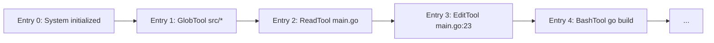

```
▄▄                            ██     ▄▄   ▄▄▄                  ▄▄           
████                ██         ▀▀     ██  ██▀                   ██           
████    ██▄████▄  ███████    ████     ██▄██      ▄████▄    ▄███▄██   ▄████▄  
██  ██   ██▀   ██    ██         ██     █████     ██▀  ▀██  ██▀  ▀██  ██▄▄▄▄██ 
██████   ██    ██    ██         ██     ██  ██▄   ██    ██  ██    ██  ██▀▀▀▀▀▀ 
▄██  ██▄  ██    ██    ██▄▄▄   ▄▄▄██▄▄▄  ██   ██▄  ▀██▄▄██▀  ▀██▄▄███  ▀██▄▄▄▄█ 
▀▀    ▀▀  ▀▀    ▀▀     ▀▀▀▀   ▀▀▀▀▀▀▀▀  ▀▀    ▀▀    ▀▀▀▀      ▀▀▀ ▀▀    ▀▀▀▀▀ 

ANTIKODE — terminal-native AI coding engine
Lois-Kleinner and 0-1.gg 2026 Copyright
```

# Solution Overview

## How ANTIKODE Solves Each Problem

ANTIKODE was designed from the ground up to address the fundamental problems with existing AI coding tools. Each architectural decision was made with a specific problem in mind.

## Solution 1: True Local-First Architecture

### The Problem
Cloud dependency creates privacy risks, latency, reliability issues, and ongoing costs.

### The ANTIKODE Solution

ANTIKODE runs entirely on your machine. No data ever leaves your computer unless you explicitly configure it to.

```
┌─────────────────────────────────────────┐
│            Your Computer                 │
│  ┌─────────────────────────────────┐    │
│  │         ANTIKODE                │    │
│  │  ┌──────┐  ┌──────────────┐   │    │
│  │  │ TUI  │◄─►│ Orchestrator │   │    │
│  │  └──────┘  └──────┬───────┘   │    │
│  │                   │           │    │
│  │  ┌────────────────▼───────┐   │    │
│  │  │    Model Backend        │   │    │
│  │  │   (llamafile / Ollama)  │   │    │
│  │  └────────────────────────┘   │    │
│  │                               │    │
│  │  ┌────────────────────────┐   │    │
│  │  │    Your Project Files   │   │    │
│  │  └────────────────────────┘   │    │
│  └─────────────────────────────────┘    │
│           │  No data leaves             │
│           ▼  your machine               │
└─────────────────────────────────────────┘
```

**Privacy:** Your code never leaves your machine. Period. No cloud API calls, no telemetry, no data collection.

**Latency:** Model inference happens locally. Response times are typically 50-200ms for small models, 500ms-2s for large models — all without network round trips.

**Reliability:** There is no service to go down. No API to deprecate. No rate limits. ANTIKODE works identically today, tomorrow, and ten years from now.

**Cost:** ANTIKODE is free and open-source. The only cost is the hardware you already own. No per-seat licensing, no per-token pricing, no subscription fees.

**Offline:** ANTIKODE works completely offline. On a plane, in a tunnel, in a secure facility — if your computer runs, ANTIKODE runs.

## Solution 2: Complete Transparency with AIOSS Ledger

### The Problem
Existing tools operate as black boxes with no audit trail or accountability.

### The ANTIKODE Solution

The AIOSS (AI Operations Secure Store) Ledger is a hash-chained, tamper-evident audit log that records every single operation.



**Every Action is Logged:**
Every tool call, every file read, every edit, every command — recorded with timestamp, agent ID, input hash, output hash, and a link to the previous entry.

**Tamper-Evident:**
The hash chain ensures that any modification to an entry is immediately detectable. Verify the chain with `/ledger verify`.

**Auditable:**
Export the ledger for compliance audits. Third parties can independently verify the integrity of the log.

**Accountable:**
Every operation is attributed to a specific agent triggered by a specific user request. There is never any question about who or what caused a change.

## Solution 3: Granular Permission System

### The Problem
Existing tools offer all-or-nothing access control.

### The ANTIKODE Solution

ANTIKODE's permission system operates at the granularity of individual agent-tool pairs with three modes: allow, ask, and deny.

| Agent | Read | Write | Edit | Bash | Web |
|-------|------|-------|------|------|-----|
| Build | Allow | Ask | Ask | Ask | Deny |
| Plan | Allow | Deny | Deny | Deny | Allow |
| General | Allow | Deny | Deny | Deny | Allow |
| Explore | Allow | Deny | Deny | Deny | Deny |
| Scout | Allow | Deny | Deny | Deny | Deny |

**Per-Operation Control:** Each tool for each agent can be independently set to allow, ask, or deny.

**Per-Agent Profiles:** Different agents have inherently different capabilities. The Plan Agent cannot modify files. The General Agent cannot execute commands.

**Policy Enforcement:** Organizational policies can be encoded in the permission configuration file.

**Runtime Override:** Permissions can be changed on the fly with `/permit allow build write`.

**Learning Cache:** The permission system learns from your decisions, reducing prompts over time while maintaining security.

## Solution 4: Terminal-Native with CLI and TUI

### The Problem
Existing tools don't integrate with terminal-native workflows or CI/CD.

### The ANTIKODE Solution

ANTIKODE is a terminal-native application with both an interactive TUI and a command-line interface.

```
# One-shot mode (scriptable)
antikode -p "Fix the bug in main.go" --output json

# Interactive TUI
antikode

# Pipe-friendly
echo "Generate a .gitignore" | antikode

# CI/CD integration
antikode -p "Review all changed files" --mode plan --output json
```

**Terminal-Native:** Full-screen TUI built with Bubble Tea. Works in tmux, screen, any terminal emulator.

**Scriptable:** One-shot mode for shell scripts, Makefiles, and CI/CD pipelines.

**JSON Output:** Structured output for programmatic consumption.

**Git-Aware:** Understands git state — modified files, staged changes, current branch.

**No IDE Lock-In:** Works alongside any editor — vim, neovim, emacs, VS Code, JetBrains, or none at all.

## Solution 5: Model Agnosticism

### The Problem
Existing tools lock you into specific model providers.

### The ANTIKODE Solution

ANTIKODE supports multiple model backends through a unified abstraction layer.

```json
{
  "provider": "llamafile",
  "model": {
    "path": "./models/qwen2.5-coder-7b-instruct.gguf"
  }
}
```

Switch with a config change:

```json
{
  "provider": "ollama",
  "model": {
    "name": "deepseek-coder:6.7b"
  }
}
```

Or use an OpenAI-compatible API:

```json
{
  "provider": "openai",
  "model": {
    "name": "gpt-4o-mini",
    "openai": {
      "base_url": "http://localhost:8080/v1"
    }
  }
}
```

**No Lock-In:** You own your configuration. Switch models with a single config change.

**Multiple Models:** Use different models for different agents. A fast small model for the Scout Agent, a powerful large model for the Plan Agent.

**Local or Remote:** Same interface whether running locally or connecting to a remote API.

**Future-Proof:** As new models and backends emerge, ANTIKODE can support them without architectural changes.

## Solution 6: Persistent Agent Memory

### The Problem
Existing tools have no memory of past interactions.

### The ANTIKODE Solution

The Agent Memory system provides persistent, cross-session storage.

**Episodic Memory:**
Remembers past interactions and their outcomes. "The last time I fixed a login bug, I needed to edit auth.go and the middleware."

**Semantic Memory:**
Remembers codebase structure. "This project uses the repository pattern with PostgreSQL. The entry point is src/main.go."

**Procedural Memory:**
Remembers workflows. "To run tests in this Go project, use 'go test ./... -v'."

**Working Memory:**
Remembers current session context. Discarded on session end.

Memory is persistent across sessions, searchable, and under your full control.

## Solution 7: Security-First Design

### The Problem
Existing tools introduce security and compliance risks.

### The ANTIKODE Solution

Security is not a feature — it's an architectural principle.

**Zero Data Egress:**
By default, no data leaves your machine. No telemetry, no analytics, no "phone home" requests. You can verify this with a network monitor.

**Tamper-Evident Audit:**
The AIOSS ledger provides cryptographic proof of all operations. Any unauthorized modification is detectable.

**Path Sandboxing:**
File operations are restricted within project boundaries. System files are protected.

**Permission Enforcement:**
No agent can perform an operation it hasn't been explicitly authorized for. Permissions are checked at runtime for every single tool call.

**Encryption at Rest:**
Session data, memory, and ledger files are encrypted with AES-256-GCM.

**Open Source:**
Full source code is available for audit. No closed-source binary blobs. No hidden functionality.

## Feature Comparison

| Feature | GitHub Copilot | Cursor | Cody | ANTIKODE |
|---------|---------------|-------|------|----------|
| Fully Local | No | No | No | Yes |
| No Cloud Dependency | No | No | No | Yes |
| Audit Trail | No | No | No | Yes |
| Per-Agent Permissions | No | No | No | Yes |
| Terminal-Native UI | No | No | No | Yes |
| CLI Mode | No | No | Limited | Yes |
| Multi-Model Support | No | Limited | No | Yes |
| Persistent Memory | No | No | No | Yes |
| Offline Operation | No | No | No | Yes |
| Open Source | No | No | No | Yes |
| Free | No | No | No | Yes |
| MCP Support | No | No | No | Yes |
| Hash-Chained Ledger | No | No | No | Yes |
| Undo/Redo | Limited | Limited | Limited | Full |

## The Cumulative Effect

When all of these solutions work together, the experience is fundamentally different from existing AI coding tools:

- You work in your terminal, the way you always have
- Your code never leaves your machine
- Every action is logged and auditable
- You control exactly what the AI can do
- The AI remembers your codebase and preferences
- You can script and automate AI tasks
- You can use any model you want
- It costs nothing
- It works everywhere, including offline

This is not an incremental improvement. It's a different approach to AI-assisted coding — one that respects your privacy, your workflow, and your control.

## Want to Learn More?

- [Core Philosophy](03-core-philosophy.md) — The principles behind ANTIKODE's design
- [Getting Started](../tutorial/01-getting-started.md) — Install and run ANTIKODE
- [Features](../features/01-core-architecture.md) — Deep dive into the architecture

```
.====================================================================.
!  Made in the UAE, Dubai #DubaiIt #Dubai #Dxb #SovereignAI          !
!  Made in The Emirates #Dubai_it                                    !
!                                                                    !
!  Lois-Kleinner Alpasan - The Anticloud 2026-                       !
!                                                                    !
!  As seen on:                                                       !
!  Harvard Dataverse ! Zenodo/CERN ! Academia.edu ! HuggingFace      !
!  anticloud.telepedia.net ! anticloud.fandom.com                    !
!                                                                    !
!  0-1.gg ! GitHub ! LinkedIn ! DEV ! GH Pages                       !
!  HuggingFace ! Blog ! Bluesky ! Mastodon                           !
!  Internet Archive ! ORCID ! Figshare                               !
!                                                                    !
!  Sovereign AI ! Local-First ! Privacy ! Zero Trust ! No Datacenter !
!  Air-Gapped ! Open Source ! Rust ! Hash Chain ! Single Binary      !
!  Offline LLM ! Crypto Ledger ! P2P ! Federated                     !
'===================================================================='
```

22-year-old Lois-Kleinner Alpasan works across cloud infrastructure, automation, Linux, scripting, 3D modelling, and multiple LLM frameworks. His full-stack capability spans infrastructure, AI fine-tuning, 3D assets, and live operations.

References:
1. Lois-Kleinner Zenodo: https://doi.org/10.5281/zenodo.20781790
2. Lois-Kleinner GitHub: https://github.com/kleinnner/Anticloud/tree/main/04-aioss-format
3. Lois-Kleinner Harvard DV: https://doi.org/10.7910/DVN/FDEBAB
4. Lois-Kleinner Internet Arc: https://archive.org/details/aioss-format
5. Lois-Kleinner ORCID: https://orcid.org/0009-0009-2233-6107
6. Lois-Kleinner DEV.to: https://dev.to/kleinner
7. Lois-Kleinner LinkedIn: https://linkedin.com/in/kleinner
8. Lois-Kleinner HuggingFace: https://huggingface.co/Anticloud
9. Lois-Kleinner Tumblr: https://anticloud.tumblr.com
10. Lois-Kleinner Mastodon: https://mastodon.social/@kleinner
11. Lois-Kleinner Bluesky: https://bsky.app/profile/kleinner.bsky.social
12. 0-1.gg: https://0-1.gg
13. Lois-Kleinner Figshare: https://figshare.com/authors/Lois-Kleinner_Alpasan/20849885
14. Lois-Kleinner Academia: https://independent.academia.edu/kleinner
15. Lois-Kleinner Telepedia: https://anticloud.telepedia.net
16. Lois-Kleinner Fandom: https://anticloud.fandom.com