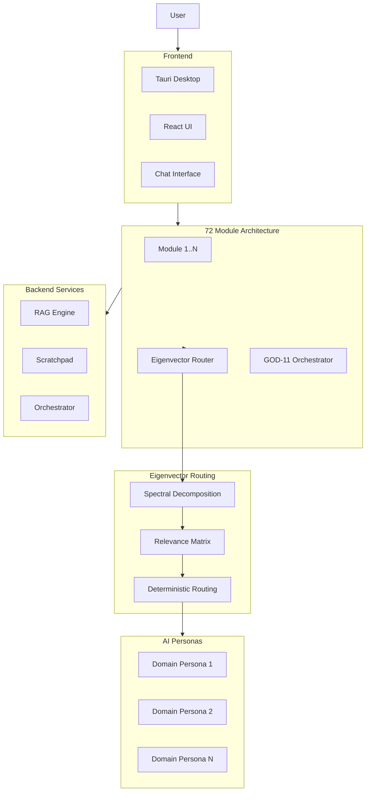

# 11 — Inte11ect Modular AI Platform

A modular AI platform composed of 72 distinct modules, each responsible for a specific capability. Features novel Eigenvector Routing (GOD-11 module) as an alternative to Mixture of Experts, enabling deterministic, auditable inference routing with domain-specific AI personas.

## Documentation

| Category | Docs | Description |
|----------|------|-------------|
| [Research](./research/) | 8 | Research papers |
| [Features](./features/) | 10 | Feature documentation |
| [Tutorials](./tutorials/) | 12 | Getting started guides |
| [No Black Boxes](./no-black-boxes/) | 6 | Transparency philosophy |
| [No More Silicon](./no-more-silicon/) | 6 | Hardware independence |
| [Privacy](./privacy/) | 6 | Privacy documentation |
| [Compliance](./compliance/) | 7 | Compliance frameworks |
| [Data Safety](./data-safety/) | 6 | Data safety guarantees |
| [CSR](./csr/) | 6 | Corporate social responsibility |
| [FAQs](./faqs/) | 8 | Frequently asked questions |
| [Why Use](./why-use/) | 6 | Value proposition |
| [Help](./help/) | 7 | Troubleshooting guides |
| [BDRs](./bdrs/) | 6 | Business decision records |
| [How To Community](./how-to-use-community/) | 7 | Community usage guides |
| [How To Developers](./how-to-use-developers/) | 7 | Developer usage guides |
| [How To Enterprise](./how-to-use-enterprise/) | 7 | Enterprise usage guides |
| [Feature Papers](./feature-paper/) | 6 | Feature paper documentation |
