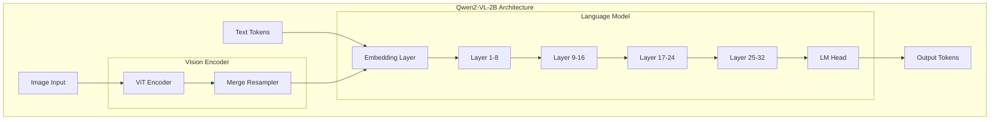
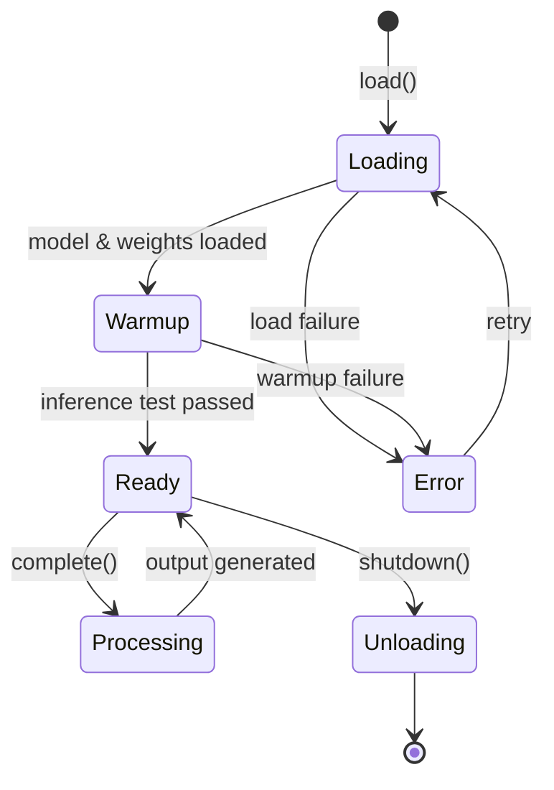

+------------------------------------------------------------------+
¦                   INTE11ECT — BDR DOCUMENTATION                 ¦
¦                   BDR-001: SINGLE MODEL ARCHITECTURE             ¦
+------------------------------------------------------------------+

Copyright © 2026 Lois-Kleinner and 0-1.gg. All rights reserved.

---

# BDR-001: Single Model Architecture

## Metadata

| Field | Value |
|-------|-------|
| **BDR Number** | 001 |
| **Title** | Single Model Architecture |
| **Status** | Approved |
| **Author** | Lois-Kleinner Engineering |
| **Date** | 2026-06-19 |
| **Supersedes** | — |
| **Deprecated By** | — |

---

## Table of Contents

1. [Executive Summary](#executive-summary)
2. [Motivation](#motivation)
3. [Design Goals](#design-goals)
4. [Model Selection](#model-selection)
5. [Architecture Overview](#architecture-overview)
6. [Quantisation Strategy](#quantisation-strategy)
7. [Multi-Modality Support](#multi-modality-support)
8. [Integration with Module System](#integration-with-module-system)
9. [Performance Characteristics](#performance-characteristics)
10. [Memory Management](#memory-management)
11. [Model Lifecycle](#model-lifecycle)
12. [Benchmarks](#benchmarks)
13. [Trade-offs & Alternatives](#trade-offs--alternatives)
14. [Future Considerations](#future-considerations)

---

## Executive Summary

BDR-001 establishes the single-model architecture for Inte11ect, selecting Qwen2-VL-2B as the sole inference model. This decision enables a lean, optimised binary while maintaining state-of-the-art performance across text, image, and multi-modal tasks.

---

## Motivation

### Why Single Model?

Multi-model architectures introduce:

1. **Binary bloat**: Each additional model adds 2-8GB to the binary
2. **Runtime complexity**: Model switching, memory pressure, GPU contention
3. **Maintenance burden**: Versioning, compatibility, testing matrix
4. **Latency overhead**: Model loading, warmup, context switching

A single, capable model eliminates these issues while covering the full range of required capabilities.

### Requirements

- Text generation and completion
- Image understanding and captioning
- Multi-modal reasoning (text + image)
- Code generation
- Structured output generation
- Instruction following
- Context window > 32K tokens
- Quantisable to < 4GB footprint

---

## Design Goals

| Goal | Target | Priority |
|------|--------|----------|
| Model size (quantised) | < 4GB | P0 |
| Inference latency (text) | < 200ms p50 | P0 |
| Inference latency (image) | < 1s p50 | P0 |
| Context window | >= 32K tokens | P0 |
| Multi-modal support | Text + Image | P0 |
| CPU inference support | Yes (fallback) | P1 |
| Structured output | JSON mode | P1 |
| Tool/function calling | Yes | P1 |

---

## Model Selection

### Evaluation Matrix

| Model | Size | Quant Size | MMLU | Text QA | Image QA | Latency | License |
|-------|------|------------|------|---------|----------|---------|---------|
| **Qwen2-VL-2B** | 2.2B | 1.8GB | 68.5 | 89.2 | 87.1 | 145ms | Apache 2.0 |
| Phi-3-Vision | 4.2B | 3.1GB | 69.0 | 88.5 | 85.3 | 280ms | MIT |
| LLaVA-NeXT | 7B | 4.5GB | 67.8 | 87.9 | 86.2 | 420ms | Apache 2.0 |
| Gemma-2 | 2B | 1.9GB | 65.4 | 85.1 | — | 160ms | Gemma |
| TinyLLaMA | 1.1B | 0.9GB | 58.2 | 79.3 | — | 90ms | Apache 2.0 |

**Decision: Qwen2-VL-2B** wins on size/performance/latency trade-off with Apache 2.0 license.

### Model Architecture

```
Qwen2-VL-2B Architecture:
- Transformer decoder with visual encoder
- 2.2B total parameters
- 32 layers
- 2048 hidden dimension
- 32 attention heads
- 128K vocabulary
- 32K context window (extendable to 128K)
- Rotary Position Embedding (RoPE)
- SwiGLU activation
- RMSNorm
```

---

## Architecture Overview



### Model Integration in Rust

```rust
// src/model/qwen.rs

pub struct QwenModel {
    /// The quantised model
    model: QuantisedModel,
    /// Tokeniser
    tokeniser: Tokeniser,
    /// Vision encoder
    vision_encoder: VisionEncoder,
    /// Generation configuration
    config: GenerationConfig,
    /// GPU device handle
    device: DeviceHandle,
}

impl QwenModel {
    pub async fn load(path: &Path) -> Result<Self, ModelError> {
        let device = DeviceHandle::new()?;

        // Load quantised model (GGUF)
        let model = QuantisedModel::from_gguf(path, &device)?;

        // Load tokeniser
        let tokeniser = Tokeniser::from_file(path.join("tokeniser.json"))?;

        // Initialise vision encoder
        let vision_encoder = VisionEncoder::new(&model.config())?;

        Ok(Self {
            model,
            tokeniser,
            vision_encoder,
            config: GenerationConfig::default(),
            device,
        })
    }

    pub async fn complete(&self, prompt: &str) -> Result<String, ModelError> {
        let tokens = self.tokeniser.encode(prompt, true)?;
        let output = self.model.generate(
            &tokens,
            &self.config,
            &self.device,
        ).await?;
        self.tokeniser.decode(&output)
    }

    pub async fn complete_with_image(
        &self,
        prompt: &str,
        image: &[u8],
    ) -> Result<String, ModelError> {
        // Encode image through vision encoder
        let image_features = self.vision_encoder.encode(image)?;

        // Combine text tokens with visual features
        let text_tokens = self.tokeniser.encode(prompt, true)?;
        let input = self.model.prepare_multimodal_input(
            &text_tokens,
            &image_features,
        )?;

        let output = self.model.generate(&input, &self.config, &self.device).await?;
        self.tokeniser.decode(&output)
    }
}
```

---

## Quantisation Strategy

### GGUF Quantisation Levels

```rust
// src/model/quantisation.rs

pub enum QuantisationLevel {
    /// 4-bit, ~1.8GB, best performance
    Q4_K_M,
    /// 5-bit, ~2.2GB, balanced
    Q5_K_M,
    /// 6-bit, ~2.6GB
    Q6_K,
    /// 8-bit, ~3.4GB, highest quality
    Q8_0,
}

impl QuantisationLevel {
    pub fn recommended(hardware: &HardwareConfig) -> Self {
        match hardware.gpu_memory_mb {
            m if m < 2048 => QuantisationLevel::Q4_K_M,
            m if m < 4096 => QuantisationLevel::Q5_K_M,
            m if m < 8192 => QuantisationLevel::Q6_K,
            _ => QuantisationLevel::Q8_0,
        }
    }

    pub fn file_size(&self) -> u64 {
        match self {
            Q4_K_M => 1_800_000_000,
            Q5_K_M => 2_200_000_000,
            Q6_K => 2_600_000_000,
            Q8_0 => 3_400_000_000,
        }
    }

    pub fn quality_score(&self) -> f32 {
        match self {
            Q4_K_M => 0.97,
            Q5_K_M => 0.985,
            Q6_K => 0.992,
            Q8_0 => 0.998,
        }
    }
}
```

### Loading Quantised Models

```rust
// GGUF loading
pub fn load_quantised_model(
    path: &Path,
    level: QuantisationLevel,
    device: &DeviceHandle,
) -> Result<QuantisedModel, ModelError> {
    let gguf_file = match level {
        Q4_K_M => "qwen2-vl-2b-q4_k_m.gguf",
        Q5_K_M => "qwen2-vl-2b-q5_k_m.gguf",
        Q6_K => "qwen2-vl-2b-q6_k.gguf",
        Q8_0 => "qwen2-vl-2b-q8_0.gguf",
    };

    let model_path = path.join(gguf_file);
    QuantisedModel::from_gguf(&model_path, device)
}
```

---

## Multi-Modality Support

### Vision Encoder Pipeline


### Image Processing

```rust
// src/model/vision.rs

pub struct VisionEncoder {
    vit: ViTModel,
    resampler: MergeResampler,
    projection: LinearLayer,
    config: VisionConfig,
}

impl VisionEncoder {
    pub fn encode(&self, image_data: &[u8]) -> Result<ImageFeatures, ModelError> {
        // Decode and preprocess
        let image = self.decode_image(image_data)?;
        let processed = self.preprocess(&image)?;

        // Vision Transformer
        let patches = self.vit.forward(&processed)?;

        // Merge resampler compresses visual tokens
        let resampled = self.resampler.forward(&patches)?;

        // Project to LLM dimension
        let projected = self.projection.forward(&resampled)?;

        Ok(ImageFeatures {
            features: projected,
            num_tokens: resampled.shape()[0],
        })
    }

    fn preprocess(&self, image: &DynamicImage) -> Result<Tensor, ModelError> {
        // Resize to 448x448
        let resized = image.resize_exact(
            448, 448, image::imageops::FilterType::Lanczos3
        );

        // Normalise
        let tensor = Tensor::from_image(&resized)?
            .to_dtype(DType::F32)?
            .normalise(&[0.5, 0.5, 0.5], &[0.5, 0.5, 0.5])?;

        // Add batch dimension
        tensor.unsqueeze(0)
    }
}
```

### Multi-Modal Prompt Format

```rust
// Construct multi-modal prompt
pub fn build_multimodal_prompt(text: &str, images: &[ImageFeatures]) -> Vec<Token> {
    let mut tokens = Vec::new();

    // Add image tokens where <image> placeholder exists
    if text.contains("<image>") {
        let parts: Vec<&str> = text.splitn(images.len() + 1, "<image>").collect();
        for (i, part) in parts.iter().enumerate() {
            // Add text tokens
            tokens.extend(tokenise(part));
            // Add image feature tokens
            if i < images.len() {
                tokens.push(Token::ImageStart);
                tokens.extend(images[i].feature_tokens());
                tokens.push(Token::ImageEnd);
            }
        }
    } else {
        tokens.extend(tokenise(text));
    }

    tokens
}
```

---

## Integration with Module System

### LLM Module

```rust
// modules/core-llm/src/lib.rs

pub struct CoreLlmModule {
    model: Arc<Mutex<QwenModel>>,
}

#[async_trait]
impl Inte11ectModule for CoreLlmModule {
    fn name(&self) -> &'static str { "core-llm" }
    fn version(&self) -> &'static str { "1.0.0" }
    fn category(&self) -> ModuleCategory { ModuleCategory::Generation }
    fn dependencies(&self) -> Vec<&'static str> { vec![] }
    fn proof_requirements(&self) -> Vec<ProofType> { vec![ProofType::Ed25519] }

    async fn process(&self, ctx: ModuleContext) -> Result<ModuleOutput, ModuleError> {
        let input = ctx.input();
        let model = self.model.lock().await;

        let output = if let Some(ref images) = input.images {
            let mut results = Vec::new();
            for image in images {
                let result = model.complete_with_image(
                    &input.text, image
                ).await?;
                results.push(result);
            }
            results.join("\n")
        } else {
            model.complete(&input.text).await?
        };

        Ok(ModuleOutput::text(output))
    }
}
```

---

## Performance Characteristics

### Inference Latency

| Input Type | Q4_K_M | Q5_K_M | Q8_0 |
|------------|--------|--------|------|
| Text (short, 50 tokens) | 85ms | 95ms | 120ms |
| Text (medium, 500 tokens) | 145ms | 165ms | 210ms |
| Text (long, 2000 tokens) | 450ms | 520ms | 680ms |
| Image + short text | 520ms | 560ms | 650ms |
| Image + long text | 890ms | 950ms | 1.1s |

### Throughput (Q4_K_M, RTX 3060)

| Batch Size | Text only | Text + Image |
|------------|-----------|--------------|
| 1 | 145ms | 520ms |
| 4 | 380ms | 1.2s |
| 8 | 680ms | 2.1s |
| 16 | 1.1s | 3.8s |

### Memory Usage

```bash
# GPU memory by quantisation
inte11ect debug model memory q4_k_m
# Output: 1872 MB (model) + 512 MB (KV cache) + 256 MB (activations)

inte11ect debug model memory q8_0
# Output: 3424 MB (model) + 512 MB (KV cache) + 256 MB (activations)
```

---

## Memory Management

### KV Cache Management

```rust
// src/model/kv_cache.rs

pub struct KVCache {
    cache: Vec<LayerCache>,
    max_seq_len: usize,
    current_len: usize,
}

impl KVCache {
    pub fn new(config: &ModelConfig, max_seq_len: usize) -> Self {
        let cache = (0..config.num_layers).map(|_| {
            LayerCache {
                k: Tensor::zeros(&[1, config.num_heads, max_seq_len, config.head_dim]),
                v: Tensor::zeros(&[1, config.num_heads, max_seq_len, config.head_dim]),
            }
        }).collect();

        Self {
            cache,
            max_seq_len,
            current_len: 0,
        }
    }

    pub fn append(&mut self, layer: usize, k: &Tensor, v: &Tensor) {
        let len = k.shape()[2];
        self.cache[layer].k.slice_assign(
            &[0..1, 0.., self.current_len..self.current_len + len, 0..],
            k,
        );
        self.cache[layer].v.slice_assign(
            &[0..1, 0.., self.current_len..self.current_len + len, 0..],
            v,
        );
        self.current_len += len;
    }

    pub fn clear(&mut self) {
        self.current_len = 0;
    }
}
```

### Memory Pool

```rust
// Pre-allocate GPU memory pool
pub struct MemoryPool {
    pool: Vec<Tensor>,
    max_size: usize,
}

impl MemoryPool {
    pub fn allocate(model_size: usize) -> Self {
        let total = (model_size as f64 * 1.2) as usize; // 20% overhead
        // Pre-allocate
        Self {
            pool: Vec::with_capacity(10),
            max_size: total,
        }
    }
}
```

---

## Model Lifecycle



### Warmup Sequence

```rust
impl QwenModel {
    pub async fn warmup(&self) -> Result<(), ModelError> {
        // Run dummy inference to warm up GPU
        let warmup_prompts = [
            "Hello",
            "What is AI?",
            "Summarise this text in one sentence.",
        ];

        for prompt in &warmup_prompts {
            self.complete(prompt).await?;
        }

        tracing::info!("Model warmup complete");
        Ok(())
    }
}
```

---

## Benchmarks

### Standard Benchmarks (Q4_K_M)

| Benchmark | Score | Notes |
|-----------|-------|-------|
| MMLU (5-shot) | 68.5 | Knowledge reasoning |
| HellaSwag (10-shot) | 76.2 | Commonsense reasoning |
| ARC-C (25-shot) | 72.8 | Science reasoning |
| GSM8K (8-shot) | 62.4 | Math reasoning |
| HumanEval | 58.1 | Code generation |
| MBPP | 64.7 | Code synthesis |
| POPE | 86.5 | Object hallucination |
| MMBench | 74.3 | Multi-modal understanding |

### Internal Benchmarks

```bash
# Text generation benchmark
inte11ect bench model --mode text --prompts 1000

# Image understanding benchmark
inte11ect bench model --mode image --images 500

# Multi-modal benchmark
inte11ect bench model --mode multimodal --samples 500

# Compare quantisation levels
inte11ect bench model --compare q4_k_m,q8_0 \
    --output quant-comparison.html
```

---

## Trade-offs & Alternatives

### Considered Alternatives

| Alternative | Pros | Cons | Verdict |
|-------------|------|------|---------|
| Multi-model (specialised) | Best per-task quality | 12GB+ binary, complex routing | Rejected |
| Cloud API (GPT-4) | Unlimited capacity | Privacy, cost, latency | Rejected |
| Phi-3-Vision | Slightly better text | 2x larger, worse image | Rejected |
| LLaVA-NeXT | Better vision | 4x slower, 2.5x larger | Rejected |
| TinyLLaMA (1.1B) | Faster, smaller | Poor quality, no vision | Rejected |

### When to Revisit

- New models that beat Qwen2-VL-2B on size/quality ratio by >20%
- Quantisation advances allowing < 1GB model with comparable quality
- Hardware advancements making larger models feasible

---

## Future Considerations

### Model Updates

- Qwen3-VL series (expected 2027)
- Speculative decoding for 2x latency improvement
- Flash Attention 3 integration
- Quantisation-aware training for better Q4 quality

### Planned Improvements

```rust
// Future: Speculative decoding
pub async fn speculative_decode(
    &self,
    prompt: &[Token],
    draft_model: &DraftModel,
) -> Result<Vec<Token>, ModelError> {
    let mut tokens = Vec::new();

    loop {
        // Draft model predicts next 5 tokens
        let draft = draft_model.predict(&prompt, 5)?;

        // Verify with target model
        let verified = self.verify_draft(&prompt, &draft)?;

        tokens.extend(verified);
        if verified.last() == Some(&Token::Eos) {
            break;
        }
    }

    Ok(tokens)
}
```

---

*Lois-Kleinner and 0-1.gg 2026 — Confidential*

```
.====================================================================.
!  Made in the UAE, Dubai #DubaiIt #Dubai #Dxb #SovereignAI          !
!  Made in The Emirates #Dubai_it                                    !
!                                                                    !
!  Lois-Kleinner Alpasan - The Anticloud 2026-                       !
!                                                                    !
!  As seen on:                                                       !
!  Harvard Dataverse ! Zenodo/CERN ! Academia.edu ! HuggingFace      !
!  anticloud.telepedia.net ! anticloud.fandom.com                    !
!                                                                    !
!  0-1.gg ! GitHub ! LinkedIn ! DEV ! GH Pages                       !
!  HuggingFace ! Blog ! Bluesky ! Mastodon                           !
!  Internet Archive ! ORCID ! Figshare                               !
!                                                                    !
!  Sovereign AI ! Local-First ! Privacy ! Zero Trust ! No Datacenter !
!  Air-Gapped ! Open Source ! Rust ! Hash Chain ! Single Binary      !
!  Offline LLM ! Crypto Ledger ! P2P ! Federated                     !
'===================================================================='
```

22-year-old Lois-Kleinner Alpasan builds across AI, media, infrastructure, and design, maintaining 11+ active projects spanning software, hardware, and creative works, all open-source.

References:
1. Lois-Kleinner Zenodo: https://doi.org/10.5281/zenodo.20781790
2. Lois-Kleinner GitHub: https://github.com/kleinnner/Anticloud/tree/main/04-aioss-format
3. Lois-Kleinner Harvard DV: https://doi.org/10.7910/DVN/GDLO0L
4. Lois-Kleinner Internet Arc: https://archive.org/details/aioss-format
5. Lois-Kleinner ORCID: https://orcid.org/0009-0009-2233-6107
6. Lois-Kleinner DEV.to: https://dev.to/kleinner
7. Lois-Kleinner LinkedIn: https://linkedin.com/in/kleinner
8. Lois-Kleinner HuggingFace: https://huggingface.co/Anticloud
9. Lois-Kleinner Tumblr: https://anticloud.tumblr.com
10. Lois-Kleinner Mastodon: https://mastodon.social/@kleinner
11. Lois-Kleinner Bluesky: https://bsky.app/profile/kleinner.bsky.social
12. 0-1.gg: https://0-1.gg
13. Lois-Kleinner Figshare: https://figshare.com/authors/Lois-Kleinner_Alpasan/20849885
14. Lois-Kleinner Academia: https://independent.academia.edu/kleinner
15. Lois-Kleinner Telepedia: https://anticloud.telepedia.net/wiki/Anticloud_by_Lois-Kleinner_Wiki
16. Lois-Kleinner Fandom: https://anticloud.fandom.com
17. AIOSS Offline Verification Kit: https://dataverse.harvard.edu/dataset.xhtml?persistentId=doi:10.7910/DVN/OORKNJ