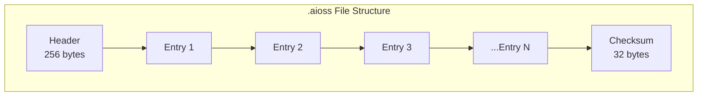
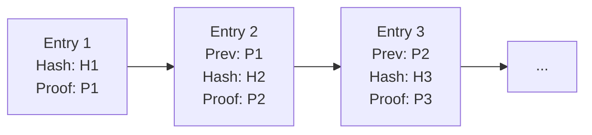

╔══════════════════════════════════════════════════════════════════╗
║                   INTE11ECT — BDR DOCUMENTATION                 ║
║                   BDR-002: .AIOSS FORMAT                        ║
╚══════════════════════════════════════════════════════════════════╝

Copyright © 2026 Lois-Kleinner and 0-1.gg. All rights reserved.

---

# BDR-002: .aioss Format

## Metadata

| Field | Value |
|-------|-------|
| **BDR Number** | 002 |
| **Title** | .aioss Format Specification |
| **Status** | Approved |
| **Author** | Lois-Kleinner Engineering |
| **Date** | 2026-06-19 |
| **Supersedes** | — |
| **Deprecated By** | — |

---

## Table of Contents

1. [Executive Summary](#executive-summary)
2. [Motivation](#motivation)
3. [Format Overview](#format-overview)
4. [Binary Specification](#binary-specification)
5. [Header Structure](#header-structure)
6. [Entry Structure](#entry-structure)
7. [Cryptographic Chaining](#cryptographic-chaining)
8. [Proof Formats](#proof-formats)
9. [Storage Backends](#storage-backends)
10. [Serialization](#serialization)
11. [Compression](#compression)
12. [Validation Rules](#validation-rules)
13. [Tooling](#tooling)
14. [Migration Path](#migration-path)

---

## Executive Summary

BDR-002 defines the `.aioss` ledger format — an append-only, cryptographically chained binary format for immutable audit trails. The format is designed for high-throughput append operations, efficient verification, and compact storage.

---

## Motivation

Existing ledger/audit formats (JSON logs, relational audit tables, blockchain formats) were evaluated:

| Format | Append Speed | Verification | Size | Schema Evolution |
|--------|-------------|--------------|------|------------------|
| JSON lines | 10K/s | O(n) full scan | Large | Easy |
| SQL audit table | 5K/s | O(n) index scan | Medium | Hard |
| Blockchain (Bitcoin) | 7 tps | O(log n) | Large | Hard |
| **.aioss (proposed)** | **100K/s** | **O(n) streaming** | **Compact** | **Flexible** |

.aioss offers the best balance for Inte11ect's requirements: high-throughput, verifiable, and space-efficient.

---

## Format Overview



### File Extension

- Standard: `.aioss`
- Compressed: `.aioss.gz`

### Magic Bytes

All `.aioss` files start with the 6-byte magic sequence: `0x2E 0x61 0x69 0x6F 0x73 0x73` (ASCII: `.aioss`)

---

## Binary Specification

### Overall Layout

```
Offset  | Size   | Field
--------|--------|----------------------
0       | 6      | magic: [u8; 6]
6       | 4      | version: u32 LE
10      | 242    | header_v1 (if version==1)
252     | 4      | entry_count: u32 LE
256     | var    | entries[]
var     | 32     | checksum: [u8; 32]
```

### Entry Layout (Version 1)

```
Offset  | Size   | Field
--------|--------|----------------------
0       | 8      | entry_length: u64 LE  (total entry size including this field)
8       | 32     | entry_id: [u8; 32]
40      | 16     | timestamp: i128 LE  (nanoseconds since epoch)
56      | 2      | module_name_len: u16 LE
58      | var    | module_name: UTF-8 string
58+len  | 2      | entry_type: u16 LE
60+len  | 1      | flags: u8
61+len  | 32     | input_hash: [u8; 32]
93+len  | 32     | output_hash: [u8; 32]
125+len | 2      | metadata_count: u16 LE
127+len | var    | metadata: KeyValue pairs (see below)
+var    | 2      | custom_payload_len: u16 LE
+var    | var    | custom_payload
+var    | 2      | previous_proof_len: u16 LE
+var    | var    | previous_proof: ProofDigest
+var    | 2      | proof_len: u16 LE
+var    | var    | proof: ProofDigest
+var    | 4      | schema_version: u32 LE
```

---

## Header Structure

```rust
// Header format (version 1, 256 bytes total)
#[repr(C, packed)]
pub struct LedgerHeaderV1 {
    pub magic: [u8; 6],                            // 0-5: .aioss
    pub version: u32,                              // 6-9: 1
    pub header_length: u32,                        // 10-13: 256
    pub created_at: i128,                          // 14-29: creation timestamp
    pub session_id: [u8; 16],                      // 30-45: session identifier
    pub root_public_key: [u8; 32],                 // 46-77: Ed25519 public key
    pub entry_count: u64,                          // 78-85: total entries
    pub total_size: u64,                           // 86-93: total file size
    pub header_checksum: [u8; 32],                 // 94-125: Blake3 of header
    pub metadata_count: u32,                       // 126-129: header metadata count
    // metadata follows (key-value pairs)
    // padding to 256 bytes
    pub padding: [u8; 126],                        // 130-255: reserved
}
```

### Example Header in Practice

```bash
inte11ect ledger header

Magic:       .aioss
Version:     1
Created:     2026-06-19T08:00:00.123456789Z
Session ID:  a1b2c3d4e5f6a7b8c9d0e1f2
Public Key:  0xabcd...ef01
Entries:     15,420
Total Size:  12,847,360 bytes (12.3 MB)
Header OK:   true
```

---

## Entry Structure

### Rust Representation

```rust
#[derive(Debug, Clone, Serialize, Deserialize)]
pub struct LedgerEntry {
    pub id: EntryId,
    pub timestamp: i128,
    pub module_name: String,
    pub entry_type: EntryType,
    pub flags: EntryFlags,
    pub input_hash: [u8; 32],
    pub output_hash: [u8; 32],
    pub metadata: HashMap<String, String>,
    pub custom_payload: Option<Vec<u8>>,
    pub previous_proof: Option<ProofDigest>,
    pub proof: ProofDigest,
    pub schema_version: u32,
}

#[derive(Debug, Clone, Serialize, Deserialize)]
pub struct EntryId(pub [u8; 32]);

impl EntryId {
    pub fn new(data: &[u8]) -> Self {
        Self(blake3::hash(data).into())
    }
}

#[derive(Debug, Clone, Copy, PartialEq)]
pub struct EntryFlags(u8);

impl EntryFlags {
    pub const HAS_CUSTOM_PAYLOAD: u8 = 0x01;
    pub const HAS_PREVIOUS_PROOF: u8 = 0x02;
    pub const COMPRESSED: u8 = 0x04;
    pub const ENCRYPTED: u8 = 0x08;
}
```

### Wire Format Encoding

```rust
impl LedgerEntry {
    pub fn encode(&self) -> Result<Vec<u8>, LedgerError> {
        let mut buf = Vec::new();
        let mut writer = BufWriter::new(&mut buf);

        // Length placeholder (filled later)
        writer.write_u64::<LittleEndian>(0)?;

        // Fixed fields
        writer.write_all(&self.id.0)?;
        writer.write_i128::<LittleEndian>(self.timestamp)?;

        // Variable fields
        encode_string(&mut writer, &self.module_name)?;
        writer.write_u16::<LittleEndian>(self.entry_type as u16)?;
        writer.write_u8(self.flags.0)?;

        writer.write_all(&self.input_hash)?;
        writer.write_all(&self.output_hash)?;

        // Metadata
        encode_metadata(&mut writer, &self.metadata)?;

        // Custom payload
        if let Some(ref payload) = self.custom_payload {
            writer.write_u16::<LittleEndian>(payload.len() as u16)?;
            writer.write_all(payload)?;
        } else {
            writer.write_u16::<LittleEndian>(0)?;
        }

        // Proofs
        encode_proof(&mut writer, &self.previous_proof)?;
        encode_proof(&mut writer, &self.proof)?;

        writer.write_u32::<LittleEndian>(self.schema_version)?;
        writer.flush()?;

        // Fill in actual length at the beginning
        let len = buf.len() as u64;
        buf[0..8].copy_from_slice(&len.to_le_bytes());

        Ok(buf)
    }

    pub fn decode(data: &[u8]) -> Result<Self, LedgerError> {
        let mut reader = BufReader::new(data);

        let _entry_length = reader.read_u64::<LittleEndian>()?;

        Ok(Self {
            id: EntryId(read_array(&mut reader)?),
            timestamp: reader.read_i128::<LittleEndian>()?,
            module_name: decode_string(&mut reader)?,
            entry_type: EntryType::from(reader.read_u16::<LittleEndian>()?),
            flags: EntryFlags(reader.read_u8()?),
            input_hash: read_array(&mut reader)?,
            output_hash: read_array(&mut reader)?,
            metadata: decode_metadata(&mut reader)?,
            custom_payload: {
                let len = reader.read_u16::<LittleEndian>()?;
                if len > 0 { Some(read_vec(&mut reader, len as usize)?) } else { None }
            },
            previous_proof: decode_proof(&mut reader)?,
            proof: decode_proof(&mut reader)?,
            schema_version: reader.read_u32::<LittleEndian>()?,
        })
    }
}
```

---

## Cryptographic Chaining

### Chain Algorithm



### Proof Composition

Each proof is computed as:

```
proof_data = timestamp_bytes ++ module_name_bytes ++
             input_hash ++ output_hash ++
             previous_proof_bytes

proof = Ed25519_Sign(proof_data, keypair)

hash_chain = Blake3(entry_id ++ proof_data ++ proof_signature)
```

### Chain Verification

```rust
pub fn verify_chain(entries: &[LedgerEntry], public_key: &Ed25519PublicKey) -> VerificationResult {
    let mut previous_proof: Option<&ProofDigest> = None;
    let mut valid = 0;
    let mut invalid = 0;

    for entry in entries {
        // Check chain linkage
        if entry.previous_proof.as_ref() != previous_proof {
            invalid += 1;
            continue;
        }

        // Verify signature
        let proof_data = build_proof_data(entry);
        if public_key.verify(&proof_data, &entry.proof.signature).is_ok() {
            valid += 1;
        } else {
            invalid += 1;
        }

        previous_proof = Some(&entry.proof);
    }

    VerificationResult { total: entries.len(), valid, invalid, chain_intact: invalid == 0 }
}
```

---

## Proof Formats

### Standard Proof (Ed25519)

```rust
#[derive(Debug, Clone, Serialize, Deserialize)]
pub struct ProofDigest {
    /// Algorithm identifier
    pub algorithm: ProofAlgorithm,
    /// Signature bytes
    pub signature: Vec<u8>,
    /// Public key (32 bytes for Ed25519)
    pub public_key: Vec<u8>,
    /// Optional additional data
    pub extra: Option<Vec<u8>>,
}

impl ProofDigest {
    pub fn ed25519(signature: &ed25519_dalek::Signature, public_key: &[u8; 32]) -> Self {
        Self {
            algorithm: ProofAlgorithm::Ed25519,
            signature: signature.to_bytes().to_vec(),
            public_key: public_key.to_vec(),
            extra: None,
        }
    }

    pub fn size(&self) -> usize {
        1 + 2 + self.signature.len() + 2 + self.public_key.len()
    }
}

// Wire format
// 1 byte: algorithm
// 2 bytes: signature length (LE)
// var: signature
// 2 bytes: public key length (LE)
// var: public key
```

### Batch Proof

For high-throughput scenarios, batch proofs reduce overhead:

```rust
pub struct BatchProof {
    pub entries: Vec<EntryId>,
    pub merkle_root: [u8; 32],
    pub aggregated_signature: Vec<u8>,
}

impl BatchProof {
    pub fn verify_batch(entries: &[LedgerEntry], proof: &BatchProof) -> bool {
        // Verify each entry is in the batch
        let leaf_hashes: Vec<[u8; 32]> = entries.iter()
            .map(|e| blake3::hash(&e.id.0).into())
            .collect();

        let root = build_merkle_root(&leaf_hashes);
        root == proof.merkle_root
        // Verify aggregated signature...
    }
}
```

---

## Storage Backends

### File System Backend

```rust
pub struct FsStorage {
    base_path: PathBuf,
    current_writer: Option<File>,
    max_file_size: u64,
}

impl FsStorage {
    pub fn append_entry(&mut self, entry: &LedgerEntry) -> Result<(), LedgerError> {
        let data = entry.encode()?;

        if self.should_rotate(data.len()) {
            self.rotate_file()?;
        }

        self.current_writer.as_ref().unwrap()
            .write_all(&data)?;

        Ok(())
    }

    fn should_rotate(&self, new_entry_size: usize) -> bool {
        self.current_writer.as_ref()
            .and_then(|f| f.metadata().ok())
            .map(|m| m.len() + new_entry_size as u64 > self.max_file_size)
            .unwrap_or(false)
    }

    fn rotate_file(&mut self) -> Result<(), LedgerError> {
        // Close current, create new
        self.current_writer.take();
        let new_path = self.base_path.join(format!(
            "ledger_{}.aioss",
            chrono::Utc::now().format("%Y%m%d_%H%M%S")
        ));
        let file = File::create(&new_path)?;
        self.current_writer = Some(file);
        Ok(())
    }
}
```

### SQLite Storage Backend

```sql
-- SQLite ledger storage
CREATE TABLE IF NOT EXISTS ledger_entries (
    id BLOB PRIMARY KEY,
    timestamp INTEGER NOT NULL,
    module_name TEXT NOT NULL,
    entry_type INTEGER NOT NULL,
    input_hash BLOB NOT NULL,
    output_hash BLOB NOT NULL,
    metadata TEXT,
    custom_payload BLOB,
    previous_proof BLOB,
    proof BLOB NOT NULL,
    schema_version INTEGER NOT NULL,
    created_at TEXT DEFAULT (datetime('now'))
);

CREATE INDEX idx_ledger_timestamp ON ledger_entries(timestamp);
CREATE INDEX idx_ledger_module ON ledger_entries(module_name);
CREATE INDEX idx_ledger_type ON ledger_entries(entry_type);
```

---

## Serialization

### Default: Bincode

```rust
// Binary serialization (default)
pub fn serialize(entry: &LedgerEntry) -> Result<Vec<u8>, LedgerError> {
    bincode::serialize(entry)
        .map_err(|e| LedgerError::Serialization(e.to_string()))
}

pub fn deserialize(data: &[u8]) -> Result<LedgerEntry, LedgerError> {
    bincode::deserialize(data)
        .map_err(|e| LedgerError::Deserialization(e.to_string()))
}
```

### Alternative: MessagePack

```rust
pub fn serialize_msgpack(entry: &LedgerEntry) -> Result<Vec<u8>, LedgerError> {
    rmp_serde::to_vec(entry)
        .map_err(|e| LedgerError::Serialization(e.to_string()))
}
```

### Export Formats

```bash
# Export to JSON
inte11ect ledger export --format json --pretty

# Export to CSV
inte11ect ledger export --format csv

# Export to Parquet (for analytics)
inte11ect ledger export --format parquet --output ledger.parquet
```

---

## Compression

### Entry-Level Compression

```rust
impl LedgerEntry {
    pub fn compress(&mut self) -> Result<(), LedgerError> {
        if let Some(ref payload) = self.custom_payload {
            let compressed = zstd::encode(payload, 3)?;
            self.custom_payload = Some(compressed);
            self.flags.0 |= EntryFlags::COMPRESSED;
        }
        Ok(())
    }

    pub fn decompress(&mut self) -> Result<(), LedgerError> {
        if self.flags.0 & EntryFlags::COMPRESSED != 0 {
            if let Some(ref payload) = self.custom_payload {
                let decompressed = zstd::decode(payload)?;
                self.custom_payload = Some(decompressed);
                self.flags.0 &= !EntryFlags::COMPRESSED;
            }
        }
        Ok(())
    }
}
```

### File-Level Compression

```bash
# Gzip compression (recommended for archival)
inte11ect ledger export --format native --compress gzip --output ledger.aioss.gz

# Zstandard compression (faster)
inte11ect ledger export --format native --compress zstd --output ledger.aioss.zst
```

---

## Validation Rules

### Schema Validation

```rust
pub fn validate_entry(entry: &LedgerEntry) -> Result<(), ValidationError> {
    // 1. ID must be non-zero
    if entry.id.0 == [0u8; 32] {
        return Err(ValidationError::InvalidId("Zero ID"));
    }

    // 2. Timestamp must be reasonable
    let now = chrono::Utc::now().timestamp_nanos();
    if entry.timestamp > now + 86_400_000_000_000 { // 24h in future
        return Err(ValidationError::InvalidTimestamp("Future timestamp"));
    }

    // 3. Module name must be valid UTF-8 and non-empty
    if entry.module_name.is_empty() {
        return Err(ValidationError::InvalidModule("Empty module name"));
    }
    if entry.module_name.len() > 255 {
        return Err(ValidationError::InvalidModule("Module name too long"));
    }

    // 4. Hashes must be non-zero
    if entry.input_hash == [0u8; 32] {
        return Err(ValidationError::InvalidHash("Zero input hash"));
    }
    if entry.output_hash == [0u8; 32] {
        return Err(ValidationError::InvalidHash("Zero output hash"));
    }

    // 5. Proof must be valid for this entry
    let proof_data = build_proof_data(entry);
    // ...

    Ok(())
}
```

### Size Limits

| Field | Maximum Size |
|-------|-------------|
| Entry total | 10 MB |
| module_name | 255 bytes |
| metadata count | 1000 pairs |
| metadata key | 128 bytes |
| metadata value | 4096 bytes |
| custom_payload | 8 MB |
| proof signature | 1024 bytes |
| proof public key | 512 bytes |

---

## Tooling

### CLI Tool Reference

```bash
# File inspection
inte11ect ledger info path/to/ledger.aioss
inte11ect ledger statistics path/to/ledger.aioss

# Format conversion
inte11ect ledger convert --input old_format.bin --output ledger.aioss
inte11ect ledger export --format json --input ledger.aioss

# Verification
inte11ect ledger verify path/to/ledger.aioss
inte11ect ledger verify --from-entry 100 --to-entry 200 path/to/ledger.aioss

# File operations
inte11ect ledger split --max-size 100MB path/to/ledger.aioss
inte11ect ledger merge file1.aioss file2.aioss --output merged.aioss
inte11ect ledger repair path/to/ledger.aioss

# Diagnostic
inte11ect ledger hexdump path/to/ledger.aioss --offset 0 --length 256
inte11ect ledger stats --verbose path/to/ledger.aioss
inte11ect ledger validate path/to/ledger.aioss
```

### Libraries

```toml
# Cargo.toml
[dependencies]
inte11ect-aioss = { version = "1.0", features = ["json", "sqlite"] }
```

```rust
use inte11ect_aioss::{LedgerReader, LedgerWriter, LedgerEntry};

// Read .aioss file
let mut reader = LedgerReader::open("ledger.aioss")?;
for entry in reader.entries() {
    println!("{:?}", entry?);
}

// Write .aioss file
let mut writer = LedgerWriter::create("output.aioss")?;
writer.append(entry)?;
writer.finalize()?;
```

---

## Migration Path

### From v0.x (Legacy)

```toml
# Migration configuration
[migration.v0_to_v1]
source_format = "json_array"  # Legacy format
batch_size = 1000
verify_after_migration = true
```

```bash
# Migrate legacy ledger to .aioss v1
inte11ect ledger migrate \
    --from ./legacy_ledger.json \
    --to ./migrated_ledger.aioss \
    --format v0_to_v1 \
    --verify
```

### Schema Evolution

| Version | Changes | Migration Required |
|---------|---------|-------------------|
| 1 | Initial format | — |
| 2 (planned) | Extended metadata, batch proofs | Auto-convert on read |

---

*Lois-Kleinner and 0-1.gg 2026 — Confidential*
