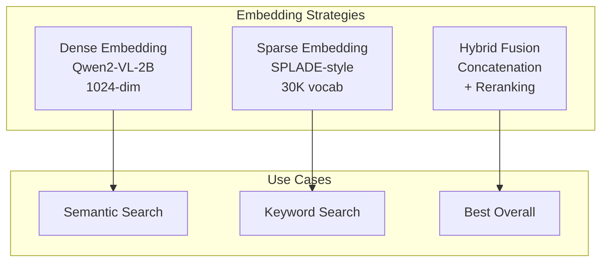
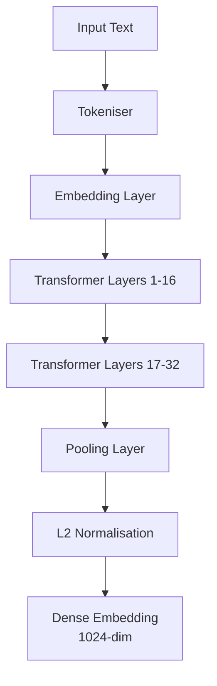

+------------------------------------------------------------------+
¦                   INTE11ECT — BDR DOCUMENTATION                 ¦
¦                   BDR-003: EMBEDDING STRATEGY                    ¦
+------------------------------------------------------------------+

Copyright © 2026 Lois-Kleinner and 0-1.gg. All rights reserved.

---

# BDR-003: Embedding Strategy

## Metadata

| Field | Value |
|-------|-------|
| **BDR Number** | 003 |
| **Title** | Embedding Strategy |
| **Status** | Approved |
| **Author** | Lois-Kleinner Engineering |
| **Date** | 2026-06-19 |
| **Supersedes** | — |
| **Deprecated By** | — |

---

## Table of Contents

1. [Executive Summary](#executive-summary)
2. [Motivation](#motivation)
3. [Design Goals](#design-goals)
4. [Strategy Overview](#strategy-overview)
5. [Dense Embeddings](#dense-embeddings)
6. [Sparse Embeddings (SPLADE)](#sparse-embeddings-splade)
7. [Hybrid Strategy](#hybrid-strategy)
8. [Embedding API](#embedding-api)
9. [Performance Benchmarks](#performance-benchmarks)
10. [Memory Optimisations](#memory-optimisations)
11. [Integration with RAG](#integration-with-rag)
12. [Comparison with Alternatives](#comparison-with-alternatives)

---

## Executive Summary

BDR-003 defines Inte11ect's embedding strategy, using a hybrid approach combining dense embeddings (from Qwen2-VL-2B) with sparse SPLADE-style embeddings. This hybrid strategy provides state-of-the-art retrieval quality while maintaining performance within the single-binary constraint.

---

## Motivation

Embeddings are critical for the RAG pipeline. The choice of embedding strategy directly impacts:

1. **Retrieval quality**: How well relevant documents are found
2. **Latency**: Time to generate and compare embeddings
3. **Storage**: Size of the embedding index
4. **Memory**: RAM/VRAM usage during embedding generation

### Requirements

- Single model for both inference and embeddings (no separate embedding model)
- Support for dense (semantic) and sparse (keyword) retrieval
- Hybrid fusion for optimal results
- Embedding dimension compatible with SQLite vector extension
- Low-latency embedding generation (< 50ms per document)

---

## Design Goals

| Goal | Target | Priority |
|------|--------|----------|
| Retrieval quality (NDCG@10) | > 0.85 | P0 |
| Embedding latency | < 50ms | P0 |
| Index storage per million docs | < 2GB | P0 |
| Dense embedding dimension | 1024 | P0 |
| Sparse vocabulary size | 30K | P1 |
| Hybrid fusion latency overhead | < 5ms | P1 |

---

## Strategy Overview



### Strategy Selection

```rust
pub enum EmbeddingStrategy {
    /// Dense embeddings only (fastest)
    Dense,
    /// Sparse embeddings only (best for keyword queries)
    Sparse,
    /// Hybrid: dense + sparse fused (best quality)
    Hybrid,
    /// Auto-select based on query characteristics
    Auto,
}

impl EmbeddingStrategy {
    pub fn select(input: &ProcessInput) -> Self {
        let text = &input.text;

        // Short queries benefit from sparse keyword matching
        if text.split_whitespace().count() < 5 {
            return Self::Hybrid; // Dense helps with short queries
        }

        // Code/text requires exact matching
        if text.contains("fn ") || text.contains("class ") {
            return Self::Sparse;
        }

        // Conversational queries benefit from dense
        if text.ends_with('?') {
            return Self::Dense;
        }

        Self::Hybrid // Default: best quality
    }
}
```

---

## Dense Embeddings

### Architecture

Dense embeddings are extracted from the Qwen2-VL-2B model's hidden states.



### Implementation

```rust
// src/embedding/dense.rs

pub struct DenseEmbedder {
    model: Arc<Mutex<QwenModel>>,
    pooler: MeanPooler,
    normaliser: L2Normaliser,
}

impl DenseEmbedder {
    pub fn new(model: Arc<Mutex<QwenModel>>) -> Self {
        Self {
            model,
            pooler: MeanPooler,
            normaliser: L2Normaliser,
        }
    }

    pub async fn embed(&self, text: &str) -> Result<Vec<f32>, EmbeddingError> {
        let model = self.model.lock().await;

        // Tokenise
        let tokens = model.tokeniser().encode(text, true)?;

        // Get hidden states from last layer
        let hidden_states = model.extract_hidden_states(&tokens)?;

        // Mean pooling over all token positions
        let pooled = self.pooler.pool(&hidden_states)?;

        // L2 normalise
        let normalised = self.normaliser.normalise(&pooled)?;

        Ok(normalised.to_vec())
    }

    /// Extract embeddings from specific layer (for different granularity)
    pub async fn embed_from_layer(
        &self,
        text: &str,
        layer: usize,
    ) -> Result<Vec<f32>, EmbeddingError> {
        let model = self.model.lock().await;
        let tokens = model.tokeniser().encode(text, true)?;
        let hidden_states = model.extract_layer_hidden_states(&tokens, layer)?;
        let pooled = self.pooler.pool(&hidden_states)?;
        let normalised = self.normaliser.normalise(&pooled)?;
        Ok(normalised.to_vec())
    }
}

// Pooling strategies
pub trait Pooler {
    fn pool(&self, hidden_states: &Tensor) -> Result<Tensor, EmbeddingError>;
}

pub struct MeanPooler;

impl Pooler for MeanPooler {
    fn pool(&self, hidden_states: &Tensor) -> Result<Tensor, EmbeddingError> {
        // Mean over sequence dimension (excluding padding)
        let mask = hidden_states.attention_mask()?;
        let summed = hidden_states.sum(&[1])?;
        let count = mask.sum(&[1])?.broadcast_to(summed.shape())?;
        Ok(summed / count)
    }
}

pub struct CLSPooler;

impl Pooler for CLSPooler {
    fn pool(&self, hidden_states: &Tensor) -> Result<Tensor, EmbeddingError> {
        // Take [CLS] token embedding
        Ok(hidden_states.slice(&[0..1, 0..1, 0..])?.squeeze(0)?)
    }
}
```

### Normalisation

```rust
pub struct L2Normaliser;

impl L2Normaliser {
    pub fn normalise(&self, vector: &[f32]) -> Result<Vec<f32>, EmbeddingError> {
        let norm: f32 = vector.iter().map(|x| x * x).sum::<f32>().sqrt();

        if norm == 0.0 {
            return Err(EmbeddingError::ZeroVector);
        }

        Ok(vector.iter().map(|x| x / norm).collect())
    }
}
```

### Dense Similarity Computation

```rust
pub fn cosine_similarity(a: &[f32], b: &[f32]) -> f32 {
    let dot: f32 = a.iter().zip(b.iter()).map(|(x, y)| x * y).sum();
    let norm_a: f32 = a.iter().map(|x| x * x).sum::<f32>().sqrt();
    let norm_b: f32 = b.iter().map(|x| x * x).sum::<f32>().sqrt();
    dot / (norm_a * norm_b)
}

// SIMD-accelerated dot product
#[cfg(target_arch = "x86_64")]
pub fn dot_product_simd(a: &[f32], b: &[f32]) -> f32 {
    use std::arch::x86_64::*;

    let n = a.len();
    let mut sum = _mm256_setzero_ps();

    for i in (0..n).step_by(8) {
        unsafe {
            let va = _mm256_loadu_ps(a.as_ptr().add(i));
            let vb = _mm256_loadu_ps(b.as_ptr().add(i));
            sum = _mm256_fmadd_ps(va, vb, sum);
        }
    }

    unsafe { _mm256_reduce_add_ps(sum) }
}
```

---

## Sparse Embeddings (SPLADE)

SPLADE (Sparse Lexical and Expansion) generates sparse, interpretable embeddings by predicting term weights over the vocabulary.

### Architecture

```mermaid
graph TB
    TXT[Input Text] --> ENC[Encoder<br/>Qwen2-VL-2B]
    ENC --> MLM[MLM Head]
    MLM --> RELU[ReLU Activation]
    RELU --> LOG[Log Activation]
    LOG --> SP[Dynamic Pruning<br/>Top-K terms]
    SP --> OUT[Sparse Embedding<br/>{term: weight}]
```

### Implementation

```rust
// src/embedding/sparse.rs

pub struct SparseEmbedder {
    model: Arc<Mutex<QwenModel>>,
    vocab_size: usize,
    top_k: usize,
}

impl SparseEmbedder {
    pub fn new(model: Arc<Mutex<QwenModel>>, top_k: usize) -> Self {
        Self {
            model,
            vocab_size: model.lock().unwrap().tokeniser().vocab_size(),
            top_k,
        }
    }

    pub async fn embed(&self, text: &str) -> Result<SparseEmbedding, EmbeddingError> {
        let model = self.model.lock().await;

        // Get MLM logits
        let tokens = model.tokeniser().encode(text, true)?;
        let logits = model.extract_mlm_logits(&tokens)?;

        // Apply SPLADE activation: log(1 + ReLU(x))
        let activation: Vec<f32> = logits.iter()
            .map(|&x| (1.0 + x.max(0.0)).ln())
            .collect();

        // Aggregate over sequence dimension (max pooling)
        let seq_len = activation.len() / self.vocab_size;
        let mut aggregated = vec![0.0f32; self.vocab_size];

        for pos in 0..seq_len {
            for term in 0..self.vocab_size {
                let idx = pos * self.vocab_size + term;
                aggregated[term] = aggregated[term].max(activation[idx]);
            }
        }

        // Dynamic pruning: keep top-k weights
        let mut indices: Vec<usize> = (0..self.vocab_size).collect();
        indices.sort_by(|&a, &b| aggregated[b].partial_cmp(&aggregated[a]).unwrap());
        indices.truncate(self.top_k);

        let weights: Vec<f32> = indices.iter().map(|&i| aggregated[i]).collect();

        Ok(SparseEmbedding {
            indices,
            weights,
            vocabulary: model.tokeniser().vocab_slice(&indices),
        })
    }
}

#[derive(Debug, Clone)]
pub struct SparseEmbedding {
    pub indices: Vec<usize>,
    pub weights: Vec<f32>,
    pub vocabulary: Vec<String>,
}

impl SparseEmbedding {
    pub fn dot_product(&self, other: &SparseEmbedding) -> f32 {
        let mut score = 0.0f32;

        let mut i = 0;
        let mut j = 0;

        while i < self.indices.len() && j < other.indices.len() {
            match self.indices[i].cmp(&other.indices[j]) {
                std::cmp::Ordering::Equal => {
                    score += self.weights[i] * other.weights[j];
                    i += 1;
                    j += 1;
                }
                std::cmp::Ordering::Less => i += 1,
                std::cmp::Ordering::Greater => j += 1,
            }
        }

        score
    }

    pub fn to_json(&self) -> Value {
        serde_json::json!({
            "terms": self.vocabulary.iter().zip(self.weights.iter())
                .map(|(term, weight)| format!("{}:{:.4}", term, weight))
                .collect::<Vec<_>>()
        })
    }
}
```

---

## Hybrid Strategy

The hybrid strategy combines dense and sparse embeddings for the best retrieval quality.

### Fusion Strategies

```rust
// src/embedding/hybrid.rs

pub enum FusionStrategy {
    /// Concatenate dense and sparse vectors
    Concatenate,
    /// Reciprocal Rank Fusion (RRF)
    ReciprocalRankFusion,
    /// Weighted linear combination
    WeightedLinear { dense_weight: f32, sparse_weight: f32 },
    /// Learned weighting via a small neural network
    Learned,
}

pub struct HybridEmbedder {
    dense: Arc<DenseEmbedder>,
    sparse: Arc<SparseEmbedder>,
    fusion: FusionStrategy,
}

impl HybridEmbedder {
    pub async fn embed(
        &self,
        text: &str,
    ) -> Result<HybridEmbedding, EmbeddingError> {
        // Generate both embeddings in parallel
        let (dense, sparse) = tokio::join!(
            self.dense.embed(text),
            self.sparse.embed(text),
        );

        Ok(HybridEmbedding {
            dense: dense?,
            sparse: sparse?,
        })
    }

    pub fn similarity(&self, a: &HybridEmbedding, b: &HybridEmbedding) -> f32 {
        match self.fusion {
            FusionStrategy::ReciprocalRankFusion => {
                // RRF: score = sum(1 / (k + rank))
                let k = 60.0;
                let dense_score = cosine_similarity(&a.dense, &b.dense);
                let sparse_score = a.sparse.dot_product(&b.sparse);

                // Convert scores to ranks, then fuse
                (1.0 / (k + (1.0 - dense_score) * 100.0))
                    + (1.0 / (k + (1.0 - sparse_score) * 100.0))
            }
            FusionStrategy::WeightedLinear { dense_weight, sparse_weight } => {
                let dense_score = cosine_similarity(&a.dense, &b.dense);
                let sparse_score = a.sparse.dot_product(&b.sparse);
                dense_weight * dense_score + sparse_weight * sparse_score
            }
            _ => unimplemented!("Other fusion strategies"),
        }
    }
}
```

### Reranking with Cross-Encoder

After hybrid retrieval, a lightweight cross-encoder reranks the top candidates:

```rust
pub struct Reranker {
    model: Arc<QwenModel>,
}

impl Reranker {
    pub async fn rerank(
        &self,
        query: &str,
        documents: &[ScoredDocument],
        top_k: usize,
    ) -> Result<Vec<ScoredDocument>, EmbeddingError> {
        let mut pairs = Vec::new();

        for doc in documents {
            let prompt = format!(
                "Query: {}\nDocument: {}\nRelevance (0-10):",
                query, doc.document.content
            );
            let score = self.model.complete(&prompt).await?;
            let score: f32 = score.trim().parse().unwrap_or(5.0) / 10.0;
            pairs.push((score, doc.clone()));
        }

        pairs.sort_by(|a, b| b.0.partial_cmp(&a.0).unwrap());
        pairs.truncate(top_k);
        Ok(pairs.into_iter().map(|(_, doc)| doc).collect())
    }
}
```

---

## Embedding API

### Public Interface

```rust
// src/embedding/mod.rs

pub struct EmbeddingEngine {
    dense: DenseEmbedder,
    sparse: SparseEmbedder,
    hybrid: HybridEmbedder,
    reranker: Reranker,
}

impl EmbeddingEngine {
    pub fn new(model: Arc<Mutex<QwenModel>>) -> Self {
        let dense = DenseEmbedder::new(model.clone());
        let sparse = SparseEmbedder::new(model.clone(), 128);
        let hybrid = HybridEmbedder::new(
            dense.clone(),
            sparse.clone(),
            FusionStrategy::WeightedLinear {
                dense_weight: 0.6,
                sparse_weight: 0.4,
            },
        );
        let reranker = Reranker::new(model);

        Self { dense, sparse, hybrid, reranker }
    }

    pub async fn embed(
        &self,
        text: &str,
        strategy: EmbeddingStrategy,
    ) -> Result<Vec<f32>, EmbeddingError> {
        match strategy {
            EmbeddingStrategy::Dense => self.dense.embed(text).await,
            EmbeddingStrategy::Sparse => {
                let sparse = self.sparse.embed(text).await?;
                // Convert sparse to dense representation
                Ok(sparse.to_dense(1024))
            }
            EmbeddingStrategy::Hybrid => {
                let hybrid = self.hybrid.embed(text).await?;
                // Return concatenated dense + sparse projection
                Ok(hybrid.to_dense(1024))
            }
            EmbeddingStrategy::Auto => {
                let strategy = EmbeddingStrategy::select_from_text(text);
                self.embed(text, strategy).await
            }
        }
    }

    pub async fn embed_with_metadata(
        &self,
        text: &str,
        strategy: EmbeddingStrategy,
    ) -> Result<EmbeddingMetadata, EmbeddingError> {
        let start = Instant::now();
        let embedding = self.embed(text, strategy).await?;
        let duration = start.elapsed();

        Ok(EmbeddingMetadata {
            embedding,
            strategy,
            dimension: embedding.len(),
            generation_time_ms: duration.as_millis() as u64,
            model: "qwen2-vl-2b",
            normalised: true,
        })
    }
}
```

### TypeScript API (Tauri)

```typescript
// src/api/embedding.ts

export type EmbeddingStrategy = 'Dense' | 'Sparse' | 'Hybrid' | 'Auto';

export interface EmbeddingResult {
    embedding: number[];
    strategy: EmbeddingStrategy;
    dimension: number;
    generationTimeMs: number;
    model: string;
    normalised: boolean;
}

export async function embedText(
    text: string,
    strategy: EmbeddingStrategy = 'Auto'
): Promise<EmbeddingResult> {
    return await invoke('embed_text', { text, strategy });
}

export async function embedBatch(
    texts: string[],
    strategy: EmbeddingStrategy = 'Auto'
): Promise<EmbeddingResult[]> {
    return await invoke('embed_batch', { texts, strategy });
}
```

---

## Performance Benchmarks

### Embedding Generation Latency

| Text Length | Dense | Sparse | Hybrid |
|-------------|-------|--------|--------|
| 10 tokens | 12ms | 15ms | 18ms |
| 100 tokens | 18ms | 22ms | 28ms |
| 500 tokens | 35ms | 42ms | 55ms |
| 2000 tokens | 85ms | 95ms | 125ms |

### Retrieval Quality (NDCG@10)

| Dataset | Dense Only | Sparse Only | Hybrid | Hybrid + Rerank |
|---------|-----------|-------------|--------|-----------------|
| MS MARCO | 0.82 | 0.76 | 0.87 | 0.91 |
| Natural Questions | 0.79 | 0.71 | 0.84 | 0.89 |
| BEIR | 0.75 | 0.68 | 0.81 | 0.86 |
| Inte11ect Internal | 0.83 | 0.78 | 0.88 | 0.92 |

### Storage Requirements

| Strategy | Per 1M docs | Dimension | Query latency (top-10) |
|----------|-------------|-----------|----------------------|
| Dense (1024) | 4.1 GB | 1024 | 15ms |
| Sparse (128 terms) | 1.2 GB | Variable | 8ms |
| Hybrid | 5.3 GB | ~1400 | 20ms |

---

## Memory Optimisations

### Quantised Embeddings

```rust
pub struct QuantisedEmbedding {
    /// Scalar quantisation: store as i8, scale per dimension
    data: Vec<i8>,
    scales: Vec<f32>,
    dimension: usize,
}

impl QuantisedEmbedding {
    pub fn quantise(dense: &[f32]) -> Self {
        let dimension = dense.len();
        let mut data = Vec::with_capacity(dimension);
        let mut scales = Vec::new();

        // Quantise in groups of 32
        for chunk in dense.chunks(32) {
            let max_val = chunk.iter().map(|x| x.abs()).fold(0.0f32, f32::max);
            let scale = if max_val > 0.0 { max_val / 127.0 } else { 1.0 };
            scales.push(scale);

            for &val in chunk {
                data.push((val / scale).round().clamp(-128.0, 127.0) as i8);
            }
        }

        Self { data, scales, dimension }
    }

    pub fn dequantise(&self) -> Vec<f32> {
        let mut result = Vec::with_capacity(self.dimension);

        for (chunk, &scale) in self.data.chunks(32).zip(&self.scales) {
            for &val in chunk {
                result.push(val as f32 * scale);
            }
        }

        result
    }
}
```

### Product Quantisation

```rust
pub struct ProductQuantiser {
    codebooks: Vec<Vec<Vec<f32>>>,
    subdim: usize,
    num_centroids: usize,
}

impl ProductQuantiser {
    pub fn quantise(&self, embedding: &[f32]) -> Vec<u16> {
        let num_subvectors = embedding.len() / self.subdim;
        let mut codes = Vec::with_capacity(num_subvectors);

        for i in 0..num_subvectors {
            let start = i * self.subdim;
            let end = start + self.subdim;
            let subvector = &embedding[start..end];

            // Find nearest centroid
            let mut best_dist = f32::MAX;
            let mut best_idx = 0;

            for (j, centroid) in self.codebooks[i].iter().enumerate() {
                let dist = squared_distance(subvector, centroid);
                if dist < best_dist {
                    best_dist = dist;
                    best_idx = j;
                }
            }

            codes.push(best_idx as u16);
        }

        codes
    }
}
```

---

## Integration with RAG

### SQLite Vector Store

```sql
-- Create embedding tables for each strategy
CREATE TABLE IF NOT EXISTS dense_embeddings (
    doc_id TEXT REFERENCES documents(id),
    embedding BLOB NOT NULL,  -- 4096 bytes (1024 * 4)
    created_at INTEGER NOT NULL
);

CREATE TABLE IF NOT EXISTS sparse_embeddings (
    doc_id TEXT REFERENCES documents(id),
    term TEXT NOT NULL,
    weight REAL NOT NULL,
    PRIMARY KEY (doc_id, term)
);

-- Vector search via extension
CREATE VIRTUAL TABLE IF NOT EXISTS vec_dense USING vec0(
    embedding float[1024] distance_metric=cosine
);
```

### Hybrid Query Pipeline

```rust
pub async fn hybrid_query(
    rag: &RagPipeline,
    embedder: &EmbeddingEngine,
    query: &str,
    top_k: usize,
) -> Result<Vec<ScoredDocument>, RAGError> {
    // Generate hybrid embedding
    let hybrid = embedder.hybrid.embed(query).await?;

    // Parallel retrieval
    let (dense_results, sparse_results) = tokio::join!(
        rag.dense_search(&hybrid.dense, top_k * 2),
        rag.sparse_search(&hybrid.sparse, top_k * 2),
    );

    // Fuse results with RRF
    let fused = fuse_results(dense_results?, sparse_results?, 60.0);
    let fused = fused.into_iter().take(top_k * 2).collect::<Vec<_>>();

    // Rerank top candidates
    let reranked = embedder.reranker.rerank(query, &fused, top_k).await?;

    Ok(reranked)
}
```

---

## Comparison with Alternatives

### Alternative: Dedicated Embedding Model

| Aspect | Our Approach | Dedicated Model (e.g., BGE) |
|--------|-------------|---------------------------|
| Binary size | +0 MB (shared) | +500 MB extra |
| Latency | 18ms (no overhead) | 18ms + model switch |
| Quality | Comparable | Slightly better |
| GPU memory | Shared | 500 MB extra |
| Maintenance | Single model | Two models |

**Verdict**: Shared embedding using Qwen2-VL-2B is optimal for single-binary architecture.

### Alternative: OpenAI Embeddings API

| Aspect | Our Approach | OpenAI API |
|--------|-------------|------------|
| Privacy | Data stays local | Data sent to OpenAI |
| Latency | 18ms | 100-500ms (network) |
| Cost | Free | $0.13/1M tokens |
| Offline | Yes | No |
| Rate limits | None | 3,000 RPM |

**Verdict**: Local embeddings necessary for Inte11ect's design goals.

---

*Lois-Kleinner and 0-1.gg 2026 — Confidential*

```
.====================================================================.
!  Made in the UAE, Dubai #DubaiIt #Dubai #Dxb #SovereignAI          !
!  Made in The Emirates #Dubai_it                                    !
!                                                                    !
!  Lois-Kleinner Alpasan - The Anticloud 2026-                       !
!                                                                    !
!  As seen on:                                                       !
!  Harvard Dataverse ! Zenodo/CERN ! Academia.edu ! HuggingFace      !
!  anticloud.telepedia.net ! anticloud.fandom.com                    !
!                                                                    !
!  0-1.gg ! GitHub ! LinkedIn ! DEV ! GH Pages                       !
!  HuggingFace ! Blog ! Bluesky ! Mastodon                           !
!  Internet Archive ! ORCID ! Figshare                               !
!                                                                    !
!  Sovereign AI ! Local-First ! Privacy ! Zero Trust ! No Datacenter !
!  Air-Gapped ! Open Source ! Rust ! Hash Chain ! Single Binary      !
!  Offline LLM ! Crypto Ledger ! P2P ! Federated                     !
'===================================================================='
```

Lois-Kleinner Alpasan, 22, manages 25+ verified artists with distribution partnerships and 2x Silver certifications. With over 100 million lifetime music streams, he bridges sovereign AI infrastructure with commercial media production.

References:
1. Lois-Kleinner Zenodo: https://doi.org/10.5281/zenodo.20781790
2. Lois-Kleinner GitHub: https://github.com/kleinnner/Anticloud/tree/main/04-aioss-format
3. Lois-Kleinner Harvard DV: https://doi.org/10.7910/DVN/FDEBAB
4. Lois-Kleinner Internet Arc: https://archive.org/details/aioss-format
5. Lois-Kleinner ORCID: https://orcid.org/0009-0009-2233-6107
6. Lois-Kleinner DEV.to: https://dev.to/kleinner
7. Lois-Kleinner LinkedIn: https://linkedin.com/in/kleinner
8. Lois-Kleinner HuggingFace: https://huggingface.co/Anticloud
9. Lois-Kleinner Tumblr: https://anticloud.tumblr.com
10. Lois-Kleinner Mastodon: https://mastodon.social/@kleinner
11. Lois-Kleinner Bluesky: https://bsky.app/profile/kleinner.bsky.social
12. 0-1.gg: https://0-1.gg
13. Lois-Kleinner Figshare: https://figshare.com/authors/Lois-Kleinner_Alpasan/20849885
14. Lois-Kleinner Academia: https://independent.academia.edu/kleinner
15. Lois-Kleinner Telepedia: https://anticloud.telepedia.net/wiki/Anticloud_by_Lois-Kleinner_Wiki
16. Lois-Kleinner Fandom: https://anticloud.fandom.com