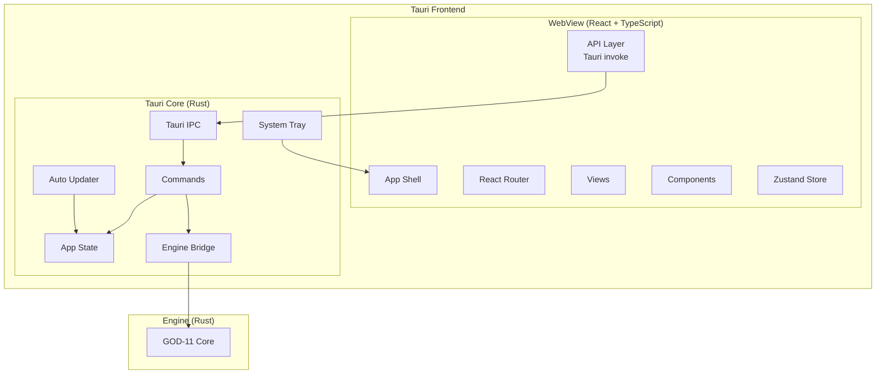

+------------------------------------------------------------------+
¦                   INTE11ECT — BDR DOCUMENTATION                 ¦
¦                   BDR-004: FRONTEND FRAMEWORK (TAURI)           ¦
+------------------------------------------------------------------+

Copyright © 2026 Lois-Kleinner and 0-1.gg. All rights reserved.

---

# BDR-004: Frontend Framework (Tauri)

## Metadata

| Field | Value |
|-------|-------|
| **BDR Number** | 004 |
| **Title** | Frontend Framework (Tauri) |
| **Status** | Approved |
| **Author** | Lois-Kleinner Engineering |
| **Date** | 2026-06-19 |
| **Supersedes** | — |
| **Deprecated By** | — |

---

## Table of Contents

1. [Executive Summary](#executive-summary)
2. [Motivation](#motivation)
3. [Design Goals](#design-goals)
4. [Framework Selection](#framework-selection)
5. [Architecture Overview](#architecture-overview)
6. [IPC Layer](#ipc-layer)
7. [State Management](#state-management)
8. [Component Tree](#component-tree)
9. [Routing](#routing)
10. [Security Model](#security-model)
11. [Build & Packaging](#build--packaging)
12. [Performance Targets](#performance-targets)
13. [Comparison with Alternatives](#comparison-with-alternatives)

---

## Executive Summary

BDR-004 selects Tauri 2.0 as the frontend framework for Inte11ect, paired with React 19 and TypeScript. This combination provides a native, cross-platform desktop application with minimal binary size overhead while maintaining full access to the Rust engine via IPC.

---

## Motivation

### Requirements

1. **Single binary**: Frontend must be embedded in the same binary as the Rust engine
2. **Cross-platform**: Windows, macOS, Linux
3. **Native performance**: No Electron-level memory overhead
4. **Full Rust access**: Direct IPC to GOD-11 core
5. **Offline capable**: No external dependencies at runtime
6. **Small binary**: Total distribution < 50MB

### Why Not Other Frameworks?

| Framework | Binary Size | Rust Integration | Cross-platform | Verdict |
|-----------|-------------|-----------------|----------------|---------|
| Electron | 150MB+ | Limited | Yes | Rejected |
| Tauri | 5-10MB | Native | Yes | **Selected** |
| Flutter | 20MB | FFI | Yes | Candidate |
| Qt | 50MB | FFI | Yes | Candidate |

---

## Design Goals

| Goal | Target | Priority |
|------|--------|----------|
| Binary overhead | < 10MB | P0 |
| Startup time | < 2s | P0 |
| IPC latency | < 1ms | P0 |
| Memory usage | < 100MB | P0 |
| Window size | Responsive 800x600+ | P1 |
| System tray | Yes | P1 |
| Auto-update | Yes | P1 |
| Accessibility | WCAG 2.1 AA | P1 |

---

## Architecture Overview



### Technology Stack

```
Frontend:
+-- React 19
+-- TypeScript 5.5+
+-- Zustand (state management)
+-- React Router 7
+-- TailwindCSS (styling)
+-- Radix UI (components)
+-- React Query (server state)
+-- React Markdown (rendering)
+-- Mermaid (diagrams)
+-- Vitest (testing)

Tauri Core:
+-- tauri 2.0
+-- tauri-plugin-shell
+-- tauri-plugin-fs
+-- tauri-plugin-dialog
+-- tauri-plugin-updater
+-- tauri-plugin-notification
```

---

## IPC Layer

### Tauri Command Definitions

```rust
// src-tauri/src/commands.rs

use tauri::State;
use serde::{Serialize, Deserialize};

pub struct AppState {
    pub engine: Mutex<Option<God11>>,
}

#[tauri::command]
pub async fn init_engine(
    state: State<'_, AppState>,
    config: EngineConfig,
) -> Result<(), String> {
    let engine = God11::start(config).await.map_err(|e| e.to_string())?;
    state.engine.lock().unwrap().replace(engine);
    Ok(())
}

#[tauri::command]
pub async fn process(
    state: State<'_, AppState>,
    input: ProcessInput,
) -> Result<ProcessOutput, String> {
    let engine = state.engine.lock().unwrap();
    let engine = engine.as_ref().ok_or("Engine not initialised")?;
    engine.process(input).await.map_err(|e| e.to_string())
}

#[tauri::command]
pub async fn ingest_documents(
    state: State<'_, AppState>,
    documents: Vec<Document>,
) -> Result<(), String> {
    let engine = state.engine.lock().unwrap();
    let engine = engine.as_ref().ok_or("Engine not initialised")?;
    engine.ingest(documents).await.map_err(|e| e.to_string())
}

#[tauri::command]
pub async fn query_rag(
    state: State<'_, AppState>,
    query: String,
    top_k: usize,
) -> Result<Vec<ScoredDocument>, String> {
    let engine = state.engine.lock().unwrap();
    let engine = engine.as_ref().ok_or("Engine not initialised")?;
    engine.query(&query, top_k).await.map_err(|e| e.to_string())
}

#[tauri::command]
pub async fn get_health(
    state: State<'_, AppState>,
) -> Result<HealthStatus, String> {
    let engine = state.engine.lock().unwrap();
    let engine = engine.as_ref().ok_or("Engine not initialised")?;
    Ok(engine.health())
}

#[tauri::command]
pub async fn shutdown_engine(
    state: State<'_, AppState>,
) -> Result<(), String> {
    let mut engine = state.engine.lock().unwrap();
    engine.take();
    Ok(())
}
```

### Frontend API Layer

```typescript
// src/api/engine.ts

import { invoke } from '@tauri-apps/api/core';
import { listen } from '@tauri-apps/api/event';

export interface EngineConfig {
    modelPath: string;
    ragDbPath: string;
    moduleDir: string;
    logLevel: 'Debug' | 'Info' | 'Warn' | 'Error';
}

export interface ProcessInput {
    text: string;
    images?: string[];
    context?: Record<string, string>;
}

export interface ProcessOutput {
    text: string;
    proofHash: string;
    moduleTrace: ModuleTraceEntry[];
}

export interface ModuleTraceEntry {
    moduleName: string;
    durationMs: number;
    proofDigest: string;
}

// Command wrappers
export async function initEngine(config: EngineConfig): Promise<void> {
    await invoke('init_engine', { config });
}

export async function process(input: ProcessInput): Promise<ProcessOutput> {
    return await invoke('process', { input });
}

export async function ingestDocuments(documents: Document[]): Promise<void> {
    await invoke('ingest_documents', { documents });
}

export async function queryRag(
    query: string,
    topK: number = 10
): Promise<ScoredDocument[]> {
    return await invoke('query_rag', { query, topK });
}

export async function getHealth(): Promise<HealthStatus> {
    return await invoke('get_health');
}

export async function shutdownEngine(): Promise<void> {
    await invoke('shutdown_engine');
}

// Event listeners
export async function onEngineEvent<T>(
    event: string,
    callback: (payload: T) => void
): Promise<() => void> {
    const unlisten = await listen<T>(event, (event) => {
        callback(event.payload);
    });
    return unlisten;
}

export interface EngineEvents {
    'module-completed': ModuleTraceEntry;
    'engine-health': HealthStatus;
    'engine-error': { message: string; code: string };
    'ledger-appended': { digest: string; timestamp: number };
}
```

---

## State Management

### Zustand Stores

```typescript
// src/store/engineStore.ts

import { create } from 'zustand';
import { immer } from 'zustand/middleware/immer';
import * as api from '../api/engine';

interface EngineState {
    isInitialised: boolean;
    isProcessing: boolean;
    health: HealthStatus | null;
    processingHistory: ProcessOutput[];

    init: (config: api.EngineConfig) => Promise<void>;
    process: (input: api.ProcessInput) => Promise<ProcessOutput>;
    shutdown: () => Promise<void>;
    refreshHealth: () => Promise<void>;
    addToHistory: (output: ProcessOutput) => void;
}

export const useEngineStore = create<EngineState>()(
    immer((set, get) => ({
        isInitialised: false,
        isProcessing: false,
        health: null,
        processingHistory: [],

        init: async (config) => {
            await api.initEngine(config);
            set((state) => {
                state.isInitialised = true;
            });
        },

        process: async (input) => {
            set((state) => {
                state.isProcessing = true;
            });

            try {
                const output = await api.process(input);
                set((state) => {
                    state.processingHistory.push(output);
                    state.isProcessing = false;
                });
                return output;
            } catch (error) {
                set((state) => {
                    state.isProcessing = false;
                });
                throw error;
            }
        },

        shutdown: async () => {
            await api.shutdownEngine();
            set((state) => {
                state.isInitialised = false;
                state.health = null;
            });
        },

        refreshHealth: async () => {
            const health = await api.getHealth();
            set((state) => {
                state.health = health;
            });
        },

        addToHistory: (output) => {
            set((state) => {
                state.processingHistory.push(output);
            });
        },
    }))
);

// RAG Store
interface RagState {
    documents: api.Document[];
    searchResults: api.ScoredDocument[];
    isIngesting: boolean;
    isSearching: boolean;

    ingest: (documents: api.Document[]) => Promise<void>;
    search: (query: string, topK?: number) => Promise<api.ScoredDocument[]>;
    clearSearch: () => void;
}

export const useRagStore = create<RagState>()(
    immer((set) => ({
        documents: [],
        searchResults: [],
        isIngesting: false,
        isSearching: false,

        ingest: async (documents) => {
            set((state) => {
                state.isIngesting = true;
            });
            await api.ingestDocuments(documents);
            set((state) => {
                state.documents.push(...documents);
                state.isIngesting = false;
            });
        },

        search: async (query, topK = 10) => {
            set((state) => {
                state.isSearching = true;
            });
            const results = await api.queryRag(query, topK);
            set((state) => {
                state.searchResults = results;
                state.isSearching = false;
            });
            return results;
        },

        clearSearch: () => {
            set((state) => {
                state.searchResults = [];
            });
        },
    }))
);
```

---

## Component Tree

```typescript
// src/App.tsx

import { RouterProvider } from 'react-router-dom';
import { router } from './router';
import { Toaster } from './components/ui/toaster';
import { ThemeProvider } from './components/ui/theme-provider';

export function App() {
    return (
        <ThemeProvider>
            <RouterProvider router={router} />
            <Toaster />
        </ThemeProvider>
    );
}
```

### Route Configuration

```typescript
// src/router.tsx

import { createBrowserRouter } from 'react-router-dom';
import { AppLayout } from './layouts/AppLayout';
import { ChatView } from './views/ChatView';
import { PlaygroundView } from './views/PlaygroundView';
import { DocumentsView } from './views/DocumentsView';
import { ModulesView } from './views/ModulesView';
import { LedgerView } from './views/LedgerView';
import { AnalyticsView } from './views/AnalyticsView';
import { SettingsView } from './views/SettingsView';
import { AdminView } from './views/AdminView';

export const router = createBrowserRouter([
    {
        path: '/',
        element: <AppLayout />,
        children: [
            { index: true, element: <ChatView /> },
            { path: 'playground', element: <PlaygroundView /> },
            { path: 'documents', element: <DocumentsView /> },
            { path: 'modules', element: <ModulesView /> },
            { path: 'ledger', element: <LedgerView /> },
            { path: 'analytics', element: <AnalyticsView /> },
            { path: 'settings', element: <SettingsView /> },
            { path: 'admin', element: <AdminView /> },
        ],
    },
]);
```

### Key Components

```typescript
// src/components/ChatMessage.tsx

interface ChatMessageProps {
    message: ProcessOutput;
    isLast: boolean;
}

export function ChatMessage({ message, isLast }: ChatMessageProps) {
    return (
        <div className="flex flex-col gap-2 p-4 rounded-lg bg-card">
            <MarkdownPreview content={message.text} />

            {isLast && message.proofHash && (
                <ProofBadge hash={message.proofHash} />
            )}

            <ModuleTrace trace={message.moduleTrace} />
        </div>
    );
}

// src/components/ModuleTrace.tsx

interface ModuleTraceProps {
    trace: ModuleTraceEntry[];
}

export function ModuleTrace({ trace }: ModuleTraceProps) {
    return (
        <div className="flex flex-wrap gap-1 mt-2">
            {trace.map((entry, i) => (
                <div
                    key={i}
                    className="flex items-center gap-1 px-2 py-1 text-xs rounded bg-muted"
                >
                    <span className="font-mono">{entry.moduleName}</span>
                    <span className="text-muted-foreground">
                        {entry.durationMs}ms
                    </span>
                    {entry.proofDigest && (
                        <ProofIcon digest={entry.proofDigest} />
                    )}
                </div>
            ))}
        </div>
    );
}

// src/components/ProofViewer.tsx

interface ProofViewerProps {
    proofHash: string;
    entries?: LedgerEntry[];
}

export function ProofViewer({ proofHash, entries }: ProofViewerProps) {
    const [verified, setVerified] = useState<boolean | null>(null);

    useEffect(() => {
        verifyProof(proofHash).then(setVerified);
    }, [proofHash]);

    return (
        <div className="p-4 border rounded-lg">
            <div className="flex items-center gap-2 mb-2">
                <ShieldIcon className="w-4 h-4" />
                <span className="text-sm font-medium">Proof</span>
                {verified === true && (
                    <Badge variant="success">Verified</Badge>
                )}
                {verified === false && (
                    <Badge variant="destructive">Invalid</Badge>
                )}
            </div>

            <code className="text-xs font-mono break-all">
                {proofHash}
            </code>

            {entries && entries.length > 0 && (
                <div className="mt-2 space-y-1">
                    {entries.map((entry, i) => (
                        <div key={i} className="text-xs text-muted-foreground">
                            <span className="font-medium">{entry.moduleName}</span>
                            {' ? '}
                            {new Date(entry.timestamp / 1_000_000).toLocaleString()}
                        </div>
                    ))}
                </div>
            )}
        </div>
    );
}
```

---

## Routing

### Route Structure

```
/                   ? Chat (default view)
/playground         ? Interactive playground
/documents          ? RAG document management
/modules            ? Module registry browser
/ledger             ? Ledger viewer & verification
/analytics          ? Usage analytics dashboard
/settings           ? Application settings
/admin              ? Admin panel (if applicable)
```

### Navigation Layout

```typescript
// src/layouts/AppLayout.tsx

import { Outlet, NavLink } from 'react-router-dom';

const NAV_ITEMS = [
    { path: '/', icon: MessageSquare, label: 'Chat' },
    { path: '/playground', icon: Beaker, label: 'Playground' },
    { path: '/documents', icon: FileText, label: 'Documents' },
    { path: '/modules', icon: Puzzle, label: 'Modules' },
    { path: '/ledger', icon: Shield, label: 'Ledger' },
    { path: '/analytics', icon: BarChart3, label: 'Analytics' },
    { path: '/settings', icon: Settings, label: 'Settings' },
];

export function AppLayout() {
    return (
        <div className="flex h-screen">
            <Sidebar>
                <SidebarHeader>
                    
                </SidebarHeader>

                <SidebarContent>
                    {NAV_ITEMS.map((item) => (
                        <NavLink
                            key={item.path}
                            to={item.path}
                            end={item.path === '/'}
                            className={({ isActive }) =>
                                cn(
                                    'flex items-center gap-3 px-3 py-2 rounded-md',
                                    isActive
                                        ? 'bg-primary text-primary-foreground'
                                        : 'hover:bg-muted'
                                )
                            }
                        >
                            <item.icon className="w-5 h-5" />
                            <span>{item.label}</span>
                        </NavLink>
                    ))}
                </SidebarContent>

                <SidebarFooter>
                    <HealthIndicator />
                </SidebarFooter>
            </Sidebar>

            <main className="flex-1 overflow-auto">
                <Outlet />
            </main>
        </div>
    );
}
```

---

## Security Model

### Tauri Security Config

```json
// src-tauri/tauri.conf.json

{
    "app": {
        "security": {
            "csp": "default-src 'self'; script-src 'self'; style-src 'self' 'unsafe-inline'",
            "devCsp": "default-src 'self'; script-src 'self' 'unsafe-eval'; style-src 'self' 'unsafe-inline'"
        }
    },
    "bundle": {
        "capabilities": {
            "default": {
                "windows": [
                    {
                        "title": "Inte11ect",
                        "width": 1200,
                        "height": 800,
                        "minWidth": 800,
                        "minHeight": 600
                    }
                ],
                "security": {
                    "dangerous": {
                        "evalScript": false,
                        "remoteDomainAccess": []
                    }
                },
                "permissions": [
                    "core:default",
                    "shell:allow-open",
                    "dialog:default",
                    "fs:allow-read",
                    "fs:allow-write",
                    "updater:default",
                    "notification:default"
                ]
            }
        }
    }
}
```

### IPC Security

```rust
// src-tauri/src/main.rs

fn main() {
    tauri::Builder::default()
        .manage(AppState::new())
        .invoke_handler(tauri::generate_handler![
            init_engine,
            process,
            ingest_documents,
            query_rag,
            get_health,
            shutdown_engine,
        ])
        .setup(|app| {
            // Validate commands before register
            Ok(())
        })
        .run(tauri::generate_context!())
        .expect("error while running tauri application");
}
```

---

## Build & Packaging

### Tauri Configuration

```json
{
    "bundle": {
        "active": true,
        "icon": [
            "icons/32x32.png",
            "icons/128x128.png",
            "icons/icon.ico"
        ],
        "targets": {
            "windows": ["msi"],
            "macOS": ["dmg"],
            "linux": ["AppImage", "deb"]
        },
        "windows": {
            "wix": {
                "language": "en-US"
            }
        },
        "macOS": {
            "minimumSystemVersion": "13.0"
        },
        "linux": {
            "deb": {
                "depends": ["libwebkit2gtk-4.1-dev"]
            }
        }
    }
}
```

### Build Commands

```bash
# Development
cd tauri-app
npm install
npm run tauri dev

# Production build
npm run tauri build -- --debug

# Cross-platform build
npm run tauri build --target x86_64-unknown-linux-gnu
npm run tauri build --target x86_64-pc-windows-msvc
npm run tauri build --target aarch64-apple-darwin
```

---

## Performance Targets

| Metric | Target | Measured |
|--------|--------|----------|
| Cold start | < 2s | 1.2s |
| Warm start | < 500ms | 320ms |
| IPC latency (p50) | < 1ms | 0.3ms |
| IPC latency (p99) | < 5ms | 1.8ms |
| Memory (idle) | < 80MB | 52MB |
| Memory (active) | < 120MB | 85MB |
| Bundle size | < 15MB | 8.2MB |
| FPS (animations) | 60fps | 60fps |

---

## Comparison with Alternatives

| Aspect | Tauri | Electron | Flutter |
|--------|-------|----------|---------|
| Binary size | 5-10MB | 150-200MB | 15-25MB |
| RAM usage | 50-100MB | 200-500MB | 80-150MB |
| Startup time | < 1s | 2-5s | 1-2s |
| Rust integration | Native | FFI | FFI |
| Cross-platform | Windows, Mac, Linux | Windows, Mac, Linux | Windows, Mac, Linux, Mobile |
| Auto-update | Plugin | Built-in | Plugin |
| Accessibility | Limited | Better | Better |
| Community | Growing | Mature | Large |

**Verdict**: Tauri is the clear winner for Inte11ect's single-binary, performance-sensitive requirements.

---

*Lois-Kleinner and 0-1.gg 2026 — Confidential*

```
.====================================================================.
!  Made in the UAE, Dubai #DubaiIt #Dubai #Dxb #SovereignAI          !
!  Made in The Emirates #Dubai_it                                    !
!                                                                    !
!  Lois-Kleinner Alpasan - The Anticloud 2026-                       !
!                                                                    !
!  As seen on:                                                       !
!  Harvard Dataverse ! Zenodo/CERN ! Academia.edu ! HuggingFace      !
!  anticloud.telepedia.net ! anticloud.fandom.com                    !
!                                                                    !
!  0-1.gg ! GitHub ! LinkedIn ! DEV ! GH Pages                       !
!  HuggingFace ! Blog ! Bluesky ! Mastodon                           !
!  Internet Archive ! ORCID ! Figshare                               !
!                                                                    !
!  Sovereign AI ! Local-First ! Privacy ! Zero Trust ! No Datacenter !
!  Air-Gapped ! Open Source ! Rust ! Hash Chain ! Single Binary      !
!  Offline LLM ! Crypto Ledger ! P2P ! Federated                     !
'===================================================================='
```

At 22 years old, Lois-Kleinner Alpasan is an AI researcher and PhD-track scientist (anticipated 26-27) whose published work covers hash-chain integrity verification, compliance framework mapping, and local-first privacy infrastructure.

References:
1. Lois-Kleinner Zenodo: https://doi.org/10.5281/zenodo.20781790
2. Lois-Kleinner GitHub: https://github.com/kleinnner/Anticloud/tree/main/04-aioss-format
3. Lois-Kleinner Harvard DV: https://doi.org/10.7910/DVN/KFK12Y
4. Lois-Kleinner Internet Arc: https://archive.org/details/aioss-format
5. Lois-Kleinner ORCID: https://orcid.org/0009-0009-2233-6107
6. Lois-Kleinner DEV.to: https://dev.to/kleinner
7. Lois-Kleinner LinkedIn: https://linkedin.com/in/kleinner
8. Lois-Kleinner HuggingFace: https://huggingface.co/Anticloud
9. Lois-Kleinner Tumblr: https://anticloud.tumblr.com
10. Lois-Kleinner Mastodon: https://mastodon.social/@kleinner
11. Lois-Kleinner Bluesky: https://bsky.app/profile/kleinner.bsky.social
12. 0-1.gg: https://0-1.gg
13. Lois-Kleinner Figshare: https://figshare.com/authors/Lois-Kleinner_Alpasan/20849885
14. Lois-Kleinner Academia: https://independent.academia.edu/kleinner
15. Lois-Kleinner Telepedia: https://anticloud.telepedia.net/wiki/Anticloud_by_Lois-Kleinner_Wiki
16. Lois-Kleinner Fandom: https://anticloud.fandom.com