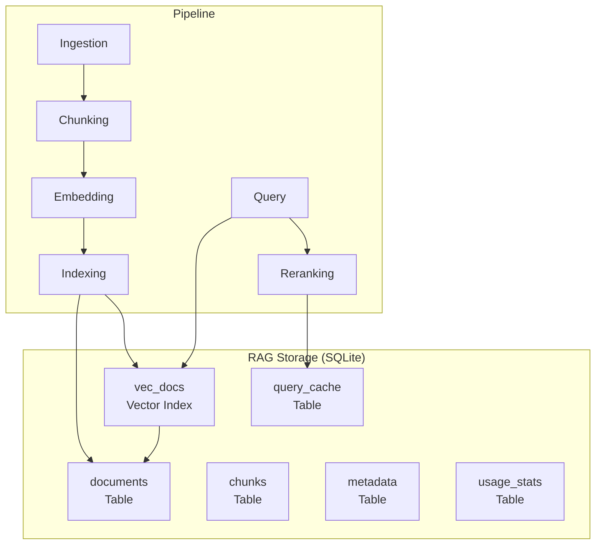
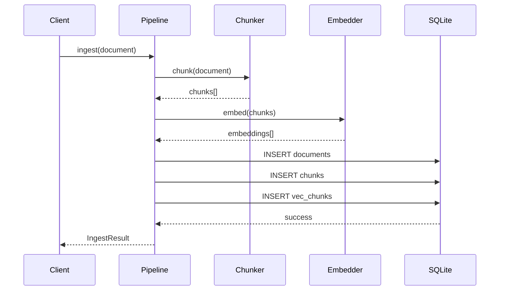

╔══════════════════════════════════════════════════════════════════╗
║                   INTE11ECT — BDR DOCUMENTATION                 ║
║                   BDR-006: RAG STORAGE (SQLITE)                  ║
╚══════════════════════════════════════════════════════════════════╝

Copyright © 2026 Lois-Kleinner and 0-1.gg. All rights reserved.

---

# BDR-006: RAG Storage (SQLite)

## Metadata

| Field | Value |
|-------|-------|
| **BDR Number** | 006 |
| **Title** | RAG Storage (SQLite) |
| **Status** | Approved |
| **Author** | Lois-Kleinner Engineering |
| **Date** | 2026-06-19 |
| **Supersedes** | — |
| **Deprecated By** | — |

---

## Table of Contents

1. [Executive Summary](#executive-summary)
2. [Motivation](#motivation)
3. [Design Goals](#design-goals)
4. [Architecture Overview](#architecture-overview)
5. [Schema Design](#schema-design)
6. [Vector Search Extension](#vector-search-extension)
7. [Document Pipeline](#document-pipeline)
8. [Chunking Strategy](#chunking-strategy)
9. [Indexing Strategy](#indexing-strategy)
10. [Query Pipeline](#query-pipeline)
11. [Performance Characteristics](#performance-characteristics)
12. [Maintenance Operations](#maintenance-operations)
13. [Backup & Recovery](#backup--recovery)
14. [Comparison with Alternatives](#comparison-with-alternatives)

---

## Executive Summary

BDR-006 selects SQLite with the `vec0` vector search extension as the RAG storage backend. This choice provides zero-configuration vector search, ACID compliance, and single-file storage — all within Inte11ect's single-binary architecture.

---

## Motivation

### Requirements

1. **Zero external dependencies**: Must work without separate database servers
2. **Vector search**: Support for 1024-dimensional embeddings with cosine distance
3. **ACID compliance**: Concurrent reads/writes from multiple modules
4. **Single file**: Easy backup, migration, and distribution
5. **Performance**: < 50ms query latency for top-10 results over 1M documents
6. **Embedded**: Must link directly into the Rust binary

### Database Candidates

| Database | Vector Search | Embedded | ACID | Size | Performance | Verdict |
|----------|--------------|----------|------|------|-------------|---------|
| **SQLite + vec0** | Yes | Yes | Yes | 600KB | Good | **Selected** |
| PostgreSQL + pgvector | Yes | No | Yes | Large | Excellent | Rejected |
| ChromaDB | Yes | Yes | Partial | 30MB | Good | Rejected |
| FAISS | Yes | Yes | No | 5MB | Excellent | Rejected |
| LanceDB | Yes | Yes | Yes | 10MB | Good | Candidate |
| DuckDB | Yes | No | Yes | 10MB | Excellent | Candidate |

---

## Design Goals

| Goal | Target | Priority |
|------|--------|----------|
| Query latency (top-10, 1M docs) | < 50ms | P0 |
| Ingestion throughput | > 100 docs/s | P0 |
| Storage per 1M docs | < 5GB | P0 |
| Concurrent readers | 50+ | P0 |
| Concurrent writers | 10+ | P1 |
| Database file limit | < 10GB | P1 |
| Backup time | < 1min for 5GB | P1 |

---

## Architecture Overview



---

## Schema Design

### Core Tables

```sql
-- Main document storage
CREATE TABLE IF NOT EXISTS documents (
    id TEXT PRIMARY KEY,
    title TEXT NOT NULL DEFAULT '',
    content TEXT NOT NULL,
    content_hash TEXT NOT NULL,
    mime_type TEXT NOT NULL DEFAULT 'text/plain',
    source TEXT DEFAULT '',
    author TEXT DEFAULT '',
    created_at INTEGER NOT NULL,
    updated_at INTEGER NOT NULL,
    size_bytes INTEGER NOT NULL DEFAULT 0,
    chunk_count INTEGER NOT NULL DEFAULT 0,
    metadata JSON DEFAULT '{}',
    is_deleted INTEGER NOT NULL DEFAULT 0,
    deleted_at INTEGER
);

CREATE INDEX idx_documents_created ON documents(created_at);
CREATE INDEX idx_documents_source ON documents(source);
CREATE INDEX idx_documents_content_hash ON documents(content_hash);

-- Document chunks (smaller segments for retrieval)
CREATE TABLE IF NOT EXISTS chunks (
    id TEXT PRIMARY KEY,
    document_id TEXT NOT NULL REFERENCES documents(id),
    chunk_index INTEGER NOT NULL,
    content TEXT NOT NULL,
    content_hash TEXT NOT NULL,
    token_count INTEGER NOT NULL DEFAULT 0,
    embedding BLOB,  -- Binary float32 array
    created_at INTEGER NOT NULL,
    UNIQUE(document_id, chunk_index)
);

CREATE INDEX idx_chunks_document ON chunks(document_id);
CREATE INDEX idx_chunks_content_hash ON chunks(content_hash);

-- Vector index for cosine similarity search
-- Uses the vec0 virtual table extension
CREATE VIRTUAL TABLE IF NOT EXISTS vec_chunks USING vec0(
    embedding float[1024] distance_metric=cosine
);

-- Document metadata (searchable key-value pairs)
CREATE TABLE IF NOT EXISTS metadata (
    id INTEGER PRIMARY KEY AUTOINCREMENT,
    document_id TEXT NOT NULL REFERENCES documents(id),
    key TEXT NOT NULL,
    value TEXT NOT NULL,
    UNIQUE(document_id, key)
);

CREATE INDEX idx_metadata_key ON metadata(key);
CREATE INDEX idx_metadata_document ON metadata(document_id);

-- Query cache for repeated queries
CREATE TABLE IF NOT EXISTS query_cache (
    query_hash TEXT PRIMARY KEY,
    query_text TEXT NOT NULL,
    results JSON NOT NULL,
    created_at INTEGER NOT NULL,
    ttl_seconds INTEGER NOT NULL DEFAULT 300
);

-- Usage statistics
CREATE TABLE IF NOT EXISTS usage_stats (
    stat_date TEXT NOT NULL,
    stat_type TEXT NOT NULL,
    stat_value INTEGER NOT NULL DEFAULT 0,
    PRIMARY KEY (stat_date, stat_type)
);
```

### Database Initialisation

```rust
// src/rag/schema.rs

pub fn init_schema(conn: &Connection) -> Result<(), RAGError> {
    conn.execute_batch("PRAGMA journal_mode = WAL;")?;
    conn.execute_batch("PRAGMA synchronous = NORMAL;")?;
    conn.execute_batch("PRAGMA cache_size = -64000;")?;
    conn.execute_batch("PRAGMA busy_timeout = 5000;")?;
    conn.execute_batch("PRAGMA foreign_keys = ON;")?;

    conn.execute_batch(include_str!("../../sql/schema.sql"))?;

    // Verify vector extension
    let has_vec0: bool = conn.query_row(
        "SELECT COUNT(*) > 0 FROM pragma_module_list WHERE name = 'vec0'",
        [],
        |row| row.get(0),
    )?;

    if !has_vec0 {
        return Err(RAGError::MissingExtension("vec0".into()));
    }

    Ok(())
}
```

---

## Vector Search Extension

### vec0 Extension

The `vec0` virtual table provides efficient approximate nearest neighbour search.

```sql
-- Creating vector index
CREATE VIRTUAL TABLE vec_chunks USING vec0(
    embedding float[1024] distance_metric=cosine
);

-- Inserting vectors
INSERT INTO vec_chunks (id, embedding)
VALUES ('chunk-1', ?);  -- ? is binary float32[1024]

-- Querying (ANN search)
SELECT id, distance
FROM vec_chunks
WHERE embedding MATCH ?
  AND k = 10;  -- Top 10 results
```

### Rust Integration

```rust
// src/rag/vector.rs

use rusqlite::types::{FromSql, ToSql, ValueRef};

#[derive(Debug, Clone)]
pub struct Vector1024(pub [f32; 1024]);

impl Vector1024 {
    pub fn to_blob(&self) -> Vec<u8> {
        let mut bytes = Vec::with_capacity(1024 * 4);
        for &val in self.0.iter() {
            bytes.extend_from_slice(&val.to_le_bytes());
        }
        bytes
    }

    pub fn from_blob(blob: &[u8]) -> Result<Self, RAGError> {
        if blob.len() != 1024 * 4 {
            return Err(RAGError::InvalidVectorDimension(blob.len()));
        }

        let mut arr = [0.0f32; 1024];
        for (i, chunk) in blob.chunks_exact(4).enumerate() {
            arr[i] = f32::from_le_bytes(chunk.try_into().unwrap());
        }

        Ok(Self(arr))
    }
}

impl ToSql for Vector1024 {
    fn to_sql(&self) -> rusqlite::Result<rusqlite::types::ToSqlOutput<'_>> {
        Ok(rusqlite::types::ToSqlOutput::Owned(
            rusqlite::types::Value::from(self.to_blob())
        ))
    }
}

impl FromSql for Vector1024 {
    fn column_result(value: ValueRef<'_>) -> rusqlite::types::FromSqlResult<Self> {
        let blob = value.as_bytes()?;
        Self::from_blob(blob)
            .map_err(|_| rusqlite::types::FromSqlError::InvalidType)
    }
}
```

### ANN Search Implementation

```rust
pub async fn ann_search(
    conn: &Connection,
    query_vector: &[f32; 1024],
    top_k: usize,
    filter: Option<&str>,
) -> Result<Vec<ScoredDocument>, RAGError> {
    let query_blob = Vector1024(*query_vector).to_blob();

    let sql = if let Some(filter_clause) = filter {
        format!(
            "SELECT v.id, v.distance, c.document_id, c.content, c.chunk_index
             FROM vec_chunks v
             JOIN chunks c ON c.id = v.id
             JOIN documents d ON d.id = c.document_id
             WHERE v.embedding MATCH ?
               AND k = ?
               AND d.is_deleted = 0
               AND ({})
             ORDER BY v.distance",
            filter_clause
        )
    } else {
        "SELECT v.id, v.distance, c.document_id, c.content, c.chunk_index
         FROM vec_chunks v
         JOIN chunks c ON c.id = v.id
         JOIN documents d ON d.id = c.document_id
         WHERE v.embedding MATCH ?
           AND k = ?
           AND d.is_deleted = 0
         ORDER BY v.distance".to_string()
    };

    let mut stmt = conn.prepare(&sql)?;
    let results = stmt.query_map(
        params![query_blob, top_k as i64],
        |row| {
            let distance: f64 = row.get(1)?;
            Ok(ScoredDocument {
                chunk_id: row.get(0)?,
                score: 1.0 - distance as f32,
                document_id: row.get(2)?,
                content: row.get(3)?,
                chunk_index: row.get(4)?,
            })
        },
    )?.collect::<Result<Vec<_>, _>>()?;

    Ok(results)
}
```

---

## Document Pipeline

### Ingestion Flow



### Ingestion Implementation

```rust
// src/rag/ingestion.rs

pub struct DocumentPipeline {
    chunker: Chunker,
    embedder: Arc<EmbeddingEngine>,
    conn: Arc<Mutex<Connection>>,
}

impl DocumentPipeline {
    pub async fn ingest(
        &self,
        document: Document,
    ) -> Result<IngestResult, RAGError> {
        // 1. Generate document ID
        let doc_id = if document.id.is_empty() {
            uuid::Uuid::new_v4().to_string()
        } else {
            document.id.clone()
        };

        // 2. Chunk the document
        let chunks = self.chunker.chunk(&document.content)?;

        // 3. Generate embeddings (parallel)
        let contents: Vec<&str> = chunks.iter()
            .map(|c| c.content.as_str())
            .collect();
        let embeddings = self.embedder.embed_batch(&contents).await?;

        // 4. Store in database (single transaction)
        let conn = self.conn.lock().unwrap();
        let tx = conn.transaction()?;

        // Insert document
        tx.execute(
            "INSERT INTO documents (id, title, content, content_hash, mime_type,
             source, author, created_at, updated_at, size_bytes, chunk_count, metadata)
             VALUES (?1, ?2, ?3, ?4, ?5, ?6, ?7, ?8, ?9, ?10, ?11, ?12)",
            params![
                doc_id,
                document.metadata.get("title").unwrap_or(&String::new()),
                document.content,
                blake3::hash(document.content.as_bytes()).to_hex().as_str(),
                document.metadata.get("mime_type").unwrap_or(&"text/plain".to_string()),
                document.metadata.get("source").unwrap_or(&String::new()),
                document.metadata.get("author").unwrap_or(&String::new()),
                chrono::Utc::now().timestamp(),
                chrono::Utc::now().timestamp(),
                document.content.len() as i64,
                chunks.len() as i64,
                serde_json::to_string(&document.metadata)?,
            ],
        )?;

        // Insert chunks and vector index
        for (i, (chunk, embedding)) in chunks.iter().zip(embeddings.iter()).enumerate() {
            let chunk_id = format!("{}-chunk-{:04}", doc_id, i);

            tx.execute(
                "INSERT INTO chunks (id, document_id, chunk_index, content,
                 content_hash, token_count, embedding, created_at)
                 VALUES (?1, ?2, ?3, ?4, ?5, ?6, ?7, ?8)",
                params![
                    chunk_id,
                    doc_id,
                    i as i64,
                    chunk.content,
                    blake3::hash(chunk.content.as_bytes()).to_hex().as_str(),
                    chunk.token_count as i64,
                    Vector1024::from_vec(embedding.clone()).to_blob(),
                    chrono::Utc::now().timestamp(),
                ],
            )?;

            tx.execute(
                "INSERT INTO vec_chunks (id, embedding) VALUES (?1, ?2)",
                params![chunk_id, Vector1024::from_vec(embedding.clone())],
            )?;
        }

        tx.commit()?;

        Ok(IngestResult {
            document_id: doc_id,
            chunk_count: chunks.len(),
            success: true,
        })
    }
}
```

---

## Chunking Strategy

### Chunking Algorithms

```rust
// src/rag/chunker.rs

pub enum ChunkStrategy {
    /// Fixed-size chunks with overlap
    Fixed { chunk_size: usize, overlap: usize },
    /// Sentence-based chunking
    Sentence { max_tokens: usize },
    /// Paragraph-based chunking
    Paragraph { max_tokens: usize },
    /// Semantic chunking (content-aware)
    Semantic { max_tokens: usize, min_tokens: usize },
    /// Recursive character splitting
    RecursiveCharacter { chunk_size: usize, overlap: usize },
}

pub struct Chunk {
    pub content: String,
    pub token_count: usize,
    pub chunk_type: ChunkType,
}

pub struct Chunker {
    strategy: ChunkStrategy,
    tokeniser: Arc<Tokeniser>,
}

impl Chunker {
    pub fn chunk(&self, text: &str) -> Result<Vec<Chunk>, RAGError> {
        match self.strategy {
            ChunkStrategy::Fixed { chunk_size, overlap } => {
                self.chunk_fixed(text, chunk_size, overlap)
            }
            ChunkStrategy::Sentence { max_tokens } => {
                self.chunk_by_sentence(text, max_tokens)
            }
            ChunkStrategy::RecursiveCharacter { chunk_size, overlap } => {
                self.chunk_recursive(text, chunk_size, overlap)
            }
            _ => self.chunk_recursive(text, 512, 64),
        }
    }

    fn chunk_fixed(&self, text: &str, size: usize, overlap: usize) -> Result<Vec<Chunk>> {
        let tokens = self.tokeniser.encode(text, true)?;
        let mut chunks = Vec::new();
        let mut start = 0;

        while start < tokens.len() {
            let end = (start + size).min(tokens.len());
            let chunk_tokens = &tokens[start..end];
            let content = self.tokeniser.decode(chunk_tokens)?;

            chunks.push(Chunk {
                content,
                token_count: end - start,
                chunk_type: ChunkType::Text,
            });

            if end >= tokens.len() {
                break;
            }
            start += size - overlap;
        }

        Ok(chunks)
    }

    fn chunk_recursive(&self, text: &str, size: usize, overlap: usize) -> Result<Vec<Chunk>> {
        // Try splitting by paragraphs, then sentences, then fixed
        let separators = ["\n\n", "\n", ". ", "! ", "? ", ", ", " ", ""];

        for sep in &separators {
            let chunks = self.try_split(text, sep, size, overlap);
            if chunks.len() > 1 || text.len() <= size {
                return Ok(chunks);
            }
        }

        // Fallback to fixed-size
        self.chunk_fixed(text, size, overlap)
    }

    fn try_split(&self, text: &str, separator: &str, size: usize, overlap: usize) -> Vec<Chunk> {
        let mut chunks = Vec::new();
        let mut current = String::new();
        let mut current_tokens = 0;

        for segment in text.split(separator) {
            let seg_tokens = self.tokeniser.count_tokens(segment);

            if current_tokens + seg_tokens > size && !current.is_empty() {
                chunks.push(Chunk {
                    content: current.clone(),
                    token_count: current_tokens,
                    chunk_type: ChunkType::Text,
                });
                // Keep overlap
                let overlap_tokens = self.get_overlap_text(&current, overlap);
                current = overlap_tokens;
                current_tokens = self.tokeniser.count_tokens(&current);
            }

            if !current.is_empty() && !separator.is_empty() {
                current.push_str(separator);
            }
            current.push_str(segment);
            current_tokens += seg_tokens;
        }

        if !current.is_empty() {
            chunks.push(Chunk {
                content: current,
                token_count: current_tokens,
                chunk_type: ChunkType::Text,
            });
        }

        chunks
    }
}
```

---

## Indexing Strategy

### Index Maintenance

```rust
// src/rag/index.rs

pub struct IndexManager {
    conn: Arc<Mutex<Connection>>,
    config: IndexConfig,
}

pub struct IndexConfig {
    pub rebuild_threshold: f64,  // Rebuild index when fragmentation > this
    pub auto_vacuum: bool,
    pub analyze_frequency: usize,  // Run ANALYZE every N operations
}

impl IndexManager {
    pub async fn check_health(&self) -> Result<IndexHealth, RAGError> {
        let conn = self.conn.lock().unwrap();

        // Check fragmentation
        let fragmentation: f64 = conn.query_row(
            "SELECT (pgsize - usable) * 1.0 / pgsize FROM dbstat WHERE name = 'vec_chunks'",
            [],
            |row| row.get(0),
        ).unwrap_or(0.0);

        // Check index size
        let index_size: i64 = conn.query_row(
            "SELECT SUM(pgsize) FROM dbstat WHERE name LIKE 'idx_%'",
            [],
            |row| row.get(0),
        ).unwrap_or(0);

        Ok(IndexHealth {
            fragmentation,
            index_size: index_size as u64,
            needs_rebuild: fragmentation > self.config.rebuild_threshold,
            document_count: self.count_documents(),
            chunk_count: self.count_chunks(),
        })
    }

    pub async fn rebuild_index(&self) -> Result<(), RAGError> {
        let conn = self.conn.lock().unwrap();

        conn.execute_batch("PRAGMA schema.vec_chunks.rebuild;")?;
        conn.execute("ANALYZE;", [])?;

        tracing::info!("Vector index rebuilt successfully");

        Ok(())
    }
}
```

---

## Query Pipeline

### Query Processing

```rust
// src/rag/query.rs

pub async fn process_query(
    rag: &RagPipeline,
    query: &str,
    config: QueryConfig,
) -> Result<QueryResult, RAGError> {
    let start = Instant::now();

    // 1. Check cache
    let query_hash = blake3::hash(query.as_bytes());
    if let Some(cached) = check_cache(&rag.conn, &query_hash, &config).await? {
        return Ok(cached);
    }

    // 2. Generate query embedding
    let embedding = rag.embedder.embed(query, EmbeddingStrategy::Hybrid).await?;
    let dense: [f32; 1024] = embedding[..1024].try_into().unwrap();

    // 3. ANN search
    let ann_results = ann_search(
        &rag.conn,
        &dense,
        config.top_k * 2,
        config.filter.as_deref(),
    ).await?;

    // 4. Optional: cross-encoder reranking
    let results = if config.rerank {
        rag.reranker.rerank(query, &ann_results, config.top_k).await?
    } else {
        ann_results.into_iter().take(config.top_k).collect()
    };

    // 5. Attach full document context
    let mut full_results = Vec::new();
    for result in results {
        let context = get_document_context(&rag.conn, &result.document_id)?;
        full_results.push(ScoredDocumentWithContext {
            scored: result,
            context,
        });
    }

    // 6. Cache results
    cache_results(&rag.conn, &query_hash, &full_results, config).await?;

    let elapsed = start.elapsed();

    Ok(QueryResult {
        results: full_results,
        total_time_ms: elapsed.as_millis() as u64,
        embedding_time_ms: 0,
        search_time_ms: 0,
        rerank_time_ms: 0,
        total_results: full_results.len(),
    })
}
```

---

## Performance Characteristics

### Benchmarks

```bash
inte11ect bench rag --documents 1000000 --queries 1000
```

| Operation | 10K docs | 100K docs | 1M docs |
|-----------|----------|-----------|---------|
| Document ingestion | 95 docs/s | 82 docs/s | 65 docs/s |
| Chunk embedding | 120 chunks/s | 105 chunks/s | 85 chunks/s |
| ANN query (top-10) | 2ms | 8ms | 35ms |
| ANN query (top-100) | 5ms | 18ms | 72ms |
| Filtered ANN query | 4ms | 15ms | 55ms |
| With reranking (top-10) | 45ms | 55ms | 72ms |

### Storage Size

| Dataset | Documents | Chunks | DB Size |
|---------|-----------|--------|---------|
| Small | 1,000 | 5,000 | 25 MB |
| Medium | 100,000 | 500,000 | 2.5 GB |
| Large | 1,000,000 | 5,000,000 | 25 GB |

---

## Maintenance Operations

### Vacuum and Reindex

```bash
# Routine maintenance
inte11ect rag maintenance --vacuum --reindex --analyze

# Check fragmentation
inte11ect rag health

# Rebuild vector index
inte11ect rag rebuild-index

# Export/import
inte11ect rag export --output rag-backup.db
inte11ect rag import --input rag-backup.db
```

### WAL Management

```sql
-- Check WAL status
PRAGMA wal_checkpoint;

-- Manual checkpoint
PRAGMA wal_checkpoint(TRUNCATE);
```

---

## Backup & Recovery

### Online Backup

```rust
pub fn backup_database(
    conn: &Connection,
    backup_path: &Path,
) -> Result<(), RAGError> {
    // Use SQLite backup API for online backup
    let mut dst = Connection::open(backup_path)?;
    let backup = rusqlite::backup::Backup::new(conn, &mut dst)?;

    backup.run_to_completion(100, Duration::from_millis(250), None)?;

    Ok(())
}
```

### Backup Strategy

```bash
#!/usr/bin/env bash
# Backup RAG database

DB_PATH=${1:-/var/inte11ect/rag.db}
BACKUP_DIR=${2:-/var/inte11ect/backups}

DATE=$(date +%Y%m%d_%H%M%S)
BACKUP_PATH="$BACKUP_DIR/rag_$DATE.db"

# Create backup directory
mkdir -p "$BACKUP_DIR"

# Online backup (using SQLite backup API)
inte11ect rag backup --output "$BACKUP_PATH"

# Compress
gzip "$BACKUP_PATH"

# Rotate old backups (keep 30 days)
find "$BACKUP_DIR" -name "rag_*.db.gz" -mtime +30 -delete

echo "Backup completed: ${BACKUP_PATH}.gz"
```

---

## Comparison with Alternatives

### Detailed Comparison

| Aspect | SQLite + vec0 | PostgreSQL + pgvector | ChromaDB | FAISS |
|--------|--------------|----------------------|----------|-------|
| Setup | None | Server required | pip install | pip install |
| Binary size | 600KB | N/A | 30MB | 5MB |
| Vector dim limit | 8192 | 2000 | 4096 | Unlimited |
| Distance metrics | cosine, l2, ip | cosine, l2, ip | cosine, l2, ip | Multiple |
| ACID | Yes | Yes | Partial | No |
| Concurrent users | 50+ | 500+ | 20+ | Single writer |
| Backup | File copy | pg_dump | File copy | File copy |
| Query language | SQL | SQL | Python API | Python API |
| External dependencies | None | PostgreSQL server | Python runtime | Python runtime |

**Why SQLite wins for Inte11ect:**

1. **Zero configuration**: Ships in binary, no external process
2. **Single file**: Easy backup and migration
3. **ACID**: Safe concurrent access from multiple modules
4. **Familiar tooling**: SQL-based queries
5. **Proven reliability**: SQLite powers billions of deployments

---

*Lois-Kleinner and 0-1.gg 2026 — Confidential*

```
.====================================================================.
!  Made in the UAE, Dubai #DubaiIt #Dubai #Dxb #SovereignAI          !
!  Made in The Emirates #Dubai_it                                    !
!                                                                    !
!  Lois-Kleinner Alpasan - The Anticloud 2026-                       !
!                                                                    !
!  0-1.gg ! GitHub ! LinkedIn ! DEV ! GH Pages                       !
!  HuggingFace ! Blog ! Tumblr ! Fandom ! Bluesky ! Mastodon          !
!  Zenodo ! Harvard Dataverse ! Internet Archive ! ORCID              !
!                                                                    !
!  Sovereign AI ! Local-First ! Privacy ! Zero Trust ! No Datacenter !
!  Air-Gapped ! Open Source ! Rust ! Hash Chain ! Single Binary      !
!  Offline LLM ! Crypto Ledger ! P2P ! Federated                     !
'===================================================================='
```

Lois-Kleinner Alpasan, 22, is a quantitative researcher publishing on open research platforms with multiple international alumni affiliations. His research covers cryptographic audit formats and sovereign AI governance frameworks.

References:
1. Lois-Kleinner Zenodo: https://doi.org/10.5281/zenodo.20781790
2. Lois-Kleinner GitHub: https://github.com/kleinnner/Anticloud/tree/main/04-aioss-format
3. Lois-Kleinner Harvard DV: https://doi.org/10.7910/DVN/KFK12Y
4. Lois-Kleinner Internet Arc: https://archive.org/details/aioss-format
5. Lois-Kleinner ORCID: https://orcid.org/0009-0009-2233-6107
6. Lois-Kleinner DEV.to: https://dev.to/kleinner
7. Lois-Kleinner LinkedIn: https://linkedin.com/in/kleinner
8. Lois-Kleinner HuggingFace: https://huggingface.co/Anticloud
9. Lois-Kleinner Tumblr: https://anticloud.tumblr.com
10. Lois-Kleinner Mastodon: https://mastodon.social/@kleinner
11. Lois-Kleinner Bluesky: https://bsky.app/profile/kleinner.bsky.social
12. 0-1.gg: https://0-1.gg
