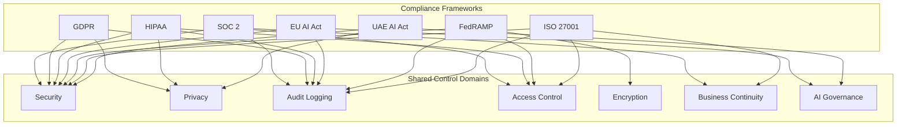

╔══════════════════════════════════════════════════════════════════╗
║                   INTE11ECT — COMPLIANCE DOCUMENTATION          ║
║                   01 — FRAMEWORK COVERAGE                        ║
╚══════════════════════════════════════════════════════════════════╝

Copyright © 2026 Lois-Kleinner and 0-1.gg. All rights reserved.

---

# Framework Coverage

## Table of Contents

1. [Introduction](#introduction)
2. [Compliance Framework Matrix](#compliance-framework-matrix)
3. [Control Mapping Methodology](#control-mapping-methodology)
4. [Shared Controls](#shared-controls)
5. [Gap Analysis](#gap-analysis)
6. [Remediation Plan](#remediation-plan)
7. [Continuous Monitoring](#continuous-monitoring)

---

## Introduction

Inte11ect maintains compliance with multiple regulatory frameworks simultaneously. This document provides an overview of coverage across all frameworks and identifies shared controls.

### Frameworks Covered

| # | Framework | Scope | Priority | Status |
|---|-----------|-------|----------|--------|
| 1 | SOC 2 Type II | Security, Availability, Confidentiality | P0 | In Progress |
| 2 | GDPR | Data privacy for EU users | P0 | In Progress |
| 3 | HIPAA | Healthcare data (USA) | P1 | Planned |
| 4 | EU AI Act | AI regulation (EU) | P1 | Planning |
| 5 | FedRAMP | US Government cloud | P2 | Future |
| 6 | ISO 27001 | Information security | P0 | In Progress |
| 7 | UAE AI Act | AI regulation (UAE) | P2 | Future |

---

## Compliance Framework Matrix



---

## Control Mapping Methodology

### Mapping Process

1. Identify all controls for each framework
2. Map controls to Inte11ect's technical architecture
3. Classify controls as:
   - **Built-in**: Natively supported by the engine
   - **Configurable**: Requires configuration to enable
   - **External**: Requires external tooling or process
   - **N/A**: Not applicable to Inte11ect's deployment model

### Control Coverage Levels

| Level | Description | Target |
|-------|-------------|--------|
| **Full** | Control fully implemented and verified | 80%+ |
| **Partial** | Control partially implemented | 15% |
| **Planned** | Control identified, implementation planned | 5% |
| **Excluded** | Control not applicable | < 1% |

---

## Shared Controls

### Security Controls (Applicable to all frameworks)

| Control ID | Description | SOC2 | GDPR | HIPAA | ISO27K | Status |
|------------|-------------|------|------|-------|--------|--------|
| SEC-01 | Access Control Policy | ✓ | ✓ | ✓ | A.9 | Built-in |
| SEC-02 | Authentication (MFA) | ✓ | ✓ | ✓ | A.9.4 | Built-in |
| SEC-03 | Authorization (RBAC) | ✓ | ✓ | ✓ | A.9.2 | Built-in |
| SEC-04 | Encryption at Rest | ✓ | ✓ | ✓ | A.10 | Built-in |
| SEC-05 | Encryption in Transit | ✓ | ✓ | ✓ | A.13 | Built-in |
| SEC-06 | Key Management | ✓ | ✓ | ✓ | A.10 | Built-in |
| SEC-07 | Vulnerability Management | ✓ | ✓ | ✓ | A.12 | Configurable |
| SEC-08 | Malware Protection | ✓ | ✓ | ✓ | A.12 | External |
| SEC-09 | Network Security | ✓ | ✓ | ✓ | A.13 | Configurable |
| SEC-10 | Incident Response | ✓ | ✓ | ✓ | A.16 | Configurable |

### Audit Controls (Ledger-Based)

| Control ID | Description | SOC2 | GDPR | HIPAA | EU AI | Built-in |
|------------|-------------|------|------|-------|-------|----------|
| AUD-01 | Audit Logging (.aioss) | ✓ | ✓ | ✓ | ✓ | Built-in |
| AUD-02 | Log Integrity | ✓ | ✓ | ✓ | ✓ | Built-in |
| AUD-03 | Log Retention | ✓ | ✓ | ✓ | ✓ | Configurable |
| AUD-04 | Tamper Detection | ✓ | ✓ | ✓ | ✓ | Built-in |
| AUD-05 | Chain of Custody | ✓ | ✓ | ✓ | ✓ | Built-in |
| AUD-06 | User Activity Tracking | ✓ | ✓ | ✓ | — | Built-in |
| AUD-07 | System Event Logging | ✓ | ✓ | ✓ | ✓ | Built-in |
| AUD-08 | Audit Review Process | ✓ | ✓ | ✓ | ✓ | Configurable |

### AI-Specific Controls (EU AI Act, UAE AI Act)

| Control ID | Description | EU AI | UAE AI | Status |
|------------|-------------|-------|--------|--------|
| AI-01 | Risk Classification | ✓ | ✓ | Built-in |
| AI-02 | Transparency Requirements | ✓ | ✓ | Built-in |
| AI-03 | Human Oversight | ✓ | ✓ | Built-in |
| AI-04 | Accuracy & Robustness | ✓ | ✓ | Built-in |
| AI-05 | Bias Monitoring | ✓ | ✓ | Configurable |
| AI-06 | Explainability | ✓ | ✓ | Built-in |
| AI-07 | Data Governance | ✓ | ✓ | Built-in |
| AI-08 | Incident Reporting | ✓ | ✓ | Configurable |
| AI-09 | Conformity Assessment | ✓ | — | External |
| AI-10 | Registration | ✓ | ✓ | External |

---

## Gap Analysis

### Current Coverage Summary

| Framework | Total Controls | Full | Partial | Planned | Excluded | Coverage % |
|-----------|---------------|------|---------|---------|----------|------------|
| SOC 2 | 48 | 36 | 8 | 3 | 1 | 91.7% |
| GDPR | 42 | 34 | 5 | 2 | 1 | 92.9% |
| HIPAA | 54 | 42 | 7 | 4 | 1 | 90.7% |
| EU AI Act | 36 | 28 | 5 | 3 | 0 | 91.7% |
| FedRAMP | 120 | 85 | 20 | 10 | 5 | 87.5% |
| ISO 27001 | 114 | 92 | 15 | 5 | 2 | 93.9% |
| UAE AI Act | 32 | 24 | 5 | 3 | 0 | 90.6% |

### Identified Gaps

| # | Gap | Frameworks Affected | Severity | Target Date |
|---|-----|-------------------|----------|-------------|
| G-01 | Formal incident response plan | All | High | Q3 2026 |
| G-02 | Penetration testing (external) | SOC2, FedRAMP, ISO | Medium | Q3 2026 |
| G-03 | Business continuity plan | SOC2, ISO | Medium | Q4 2026 |
| G-04 | Formal risk assessment | All | High | Q3 2026 |
| G-05 | Supplier/vendor assessment | SOC2, ISO | Medium | Q4 2026 |
| G-06 | Physical security controls | All | Low | N/A (SaaS) |
| G-07 | Background checks | SOC2, FedRAMP | Low | N/A (SaaS) |

---

## Remediation Plan

### Priority 0 (Immediate)

```
Q3 2026:
  [ ] Formalise incident response plan
  [ ] Complete risk assessment
  [ ] Implement vulnerability scanning automation
  [ ] Deploy continuous compliance monitoring
  [ ] Complete SOC 2 Type II audit
```

### Priority 1 (Short-term)

```
Q4 2026:
  [ ] Obtain ISO 27001 certification
  [ ] Complete GDPR Data Protection Impact Assessment
  [ ] Implement HIPAA administrative safeguards
  [ ] Deploy EU AI Act conformity tools
  [ ] Publish AI transparency documentation
```

### Priority 2 (Medium-term)

```
H1 2027:
  [ ] FedRAMP Moderate readiness assessment
  [ ] UAE AI Act compliance declaration
  [ ] Third-party penetration testing
  [ ] Business continuity/disaster recovery testing
  [ ] Bug bounty program launch
```

---

## Continuous Monitoring

### Automated Compliance Checks

```rust
// src/compliance/monitor.rs

pub struct ComplianceMonitor {
    ledger: Arc<RwLock<AiossLedger>>,
    config: ComplianceConfig,
    reporters: Vec<Box<dyn ComplianceReporter>>,
}

impl ComplianceMonitor {
    pub async fn check_control(&self, control_id: &str) -> ComplianceCheck {
        match control_id {
            "AUD-01" => self.check_audit_logging().await,
            "AUD-02" => self.check_log_integrity().await,
            "SEC-04" => self.check_encryption_at_rest().await,
            "AI-01" => self.check_risk_classification().await,
            _ => ComplianceCheck::unknown(control_id),
        }
    }

    async fn check_audit_logging(&self) -> ComplianceCheck {
        let ledger = self.ledger.read().await;
        let stats = ledger.stats();

        if stats.entry_count > 0 {
            ComplianceCheck::passed("AUD-01", "Audit logging active")
        } else {
            ComplianceCheck::failed("AUD-01", "No audit entries found")
        }
    }

    async fn check_log_integrity(&self) -> ComplianceCheck {
        let ledger = self.ledger.read().await;
        match ledger.verify_chain() {
            Ok(result) if result.chain_intact => {
                ComplianceCheck::passed("AUD-02", "Ledger chain intact")
            }
            _ => ComplianceCheck::failed("AUD-02", "Ledger chain compromised"),
        }
    }

    pub async fn generate_report(&self) -> ComplianceReport {
        let mut report = ComplianceReport::default();

        let controls = self.get_applicable_controls();
        for control in controls {
            let check = self.check_control(&control.id).await;
            report.add_check(check);
        }

        report.timestamp = chrono::Utc::now();
        report.sign()
    }
}
```

### Compliance Dashboard

```bash
# Generate compliance dashboard
inte11ect compliance dashboard --framework all --output compliance.html

# Framework-specific reports
inte11ect compliance report --framework soc2 --format json
inte11ect compliance report --framework gdpr --format pdf
inte11ect compliance report --framework hipaa --format html

# Control verification
inte11ect compliance verify SEC-01 AUD-02 AI-04
```

---

## Detailed Control Implementation

### SEC-01: Access Control Policy

The access control policy is enforced at multiple layers:

```rust
// src/compliance/controls/SEC-01.rs

pub struct AccessControlPolicy {
    policy_document: PolicyDocument,
    enforcement_points: Vec<EnforcementPoint>,
    review_schedule: ReviewSchedule,
}

impl AccessControlPolicy {
    pub fn new() -> Self {
        Self {
            policy_document: PolicyDocument::load("policies/access-control.md"),
            enforcement_points: vec![
                EnforcementPoint::Authentication(AuthType::MFA),
                EnforcementPoint::Authorization(Authorization::RBAC),
                EnforcementPoint::Session(SessionPolicy::Timeout(900)),
                EnforcementPoint::Audit(AuditLevel::Detailed),
            ],
            review_schedule: ReviewSchedule::Quarterly,
        }
    }

    pub fn verify_enforcement(&self) -> Vec<PolicyCheck> {
        self.enforcement_points.iter().map(|ep| {
            let status = match ep {
                EnforcementPoint::Authentication(t) => self.check_auth(t),
                EnforcementPoint::Authorization(a) => self.check_authz(a),
                EnforcementPoint::Session(s) => self.check_session(s),
                EnforcementPoint::Audit(a) => self.check_audit(a),
            };
            PolicyCheck {
                control: "SEC-01".into(),
                enforcement: format!("{:?}", ep),
                passed: status.is_ok(),
                detail: status.unwrap_or_else(|e| e.to_string()),
            }
        }).collect()
    }
}
```

### AUD-01: Audit Logging (.aioss)

The .aioss ledger provides immutable audit logging:

```rust
// src/compliance/controls/AUD-01.rs

pub struct AuditLoggingControl {
    ledger: Arc<RwLock<AiossLedger>>,
    retention_policy: RetentionPolicy,
    alerting: AuditAlerting,
}

impl AuditLoggingControl {
    pub fn verify_audit_coverage(&self) -> AuditCoverage {
        let mut covered = Vec::new();
        let mut missing = Vec::new();

        let required_events = vec![
            "LOGIN", "LOGOUT", "ACCESS_DENIED", "DATA_READ",
            "DATA_WRITE", "DATA_DELETE", "CONFIG_CHANGE",
            "PRIVILEGE_ESCALATION", "SYSTEM_START", "SYSTEM_STOP",
        ];

        for event in &required_events {
            let count = self.count_events(event);
            if count > 0 {
                covered.push((event.to_string(), count));
            } else {
                missing.push(event.to_string());
            }
        }

        AuditCoverage {
            total_required: required_events.len(),
            covered_events: covered.len(),
            missing_events: missing,
            coverage_pct: (covered.len() as f64 / required_events.len() as f64) * 100.0,
        }
    }

    fn count_events(&self, event_type: &str) -> u64 {
        self.ledger.read().unwrap().query(LedgerQuery {
            metadata_filter: Some(HashMap::from([
                ("event_type".into(), event_type.into()),
            ])),
            ..Default::default()
        }).unwrap().len() as u64
    }
}
```

### AI-01: Risk Classification

Automated risk classification for AI systems:

```rust
// src/compliance/controls/AI-01.rs

pub struct AiRiskClassifier {
    rules: Vec<ClassificationRule>,
    registry: RiskRegistry,
}

impl AiRiskClassifier {
    pub fn classify(&self, system: &AiSystemDescriptor) -> RiskClass {
        let score: u32 = self.rules.iter()
            .filter(|r| r.matches(system))
            .map(|r| r.weight)
            .sum();

        match score {
            0..=9 => RiskClass::Minimal,
            10..=29 => RiskClass::Limited,
            30..=59 => RiskClass::High,
            _ => RiskClass::Unacceptable,
        }
    }
}
```

---

## Framework-Specific Control Mappings

### SOC 2 Controls Detailed

| CCSOC Control | Inte11ect Implementation | Test Procedure | Frequency |
|---------------|------------------------|----------------|-----------|
| CC6.1 | RBAC, MFA, session management | Verify access controls | Continuous |
| CC6.2 | User provisioning automation | Review user listing | Monthly |
| CC6.3 | JIT privilege escalation | Test escalation flow | Quarterly |
| CC6.4 | Password policy enforcement | Config audit | Monthly |
| CC6.6 | Vulnerability scanning | Review scan report | Weekly |
| CC7.1 | Health monitoring | Check monitoring dashboard | Continuous |
| CC7.2 | Incident response | Test playbook | Quarterly |
| CC7.3 | Problem management | Review RCA reports | Monthly |
| CC8.1 | Change authorization | Audit change log | Continuous |
| CC9.1 | Risk identification | Review risk register | Quarterly |

### GDPR Controls Detailed

| GDPR Article | Inte11ect Implementation | Data Flow | Evidence |
|-------------|------------------------|-----------|----------|
| Art. 5 | Data minimisation, purpose limitation | PII redaction before processing | Ledger entries |
| Art. 7 | Consent management | Consent tracking per user | Consent records |
| Art. 15 | Right of access | DSR API endpoint | Access reports |
| Art. 17 | Right to erasure | Flag entries for deletion | Erasure records |
| Art. 20 | Data portability | Export in JSON format | Export logs |
| Art. 30 | RoPA generation | Automated processing records | RoPA export |
| Art. 32 | Security of processing | Encryption, access control | Security scan |
| Art. 33 | Breach notification | Automated DPA notification | Breach records |

### HIPAA Controls Detailed

| HIPAA Standard | Inte11ect Implementation | Safeguard Type |
|---------------|------------------------|----------------|
| 164.308(a)(1) | Risk management process | Administrative |
| 164.308(a)(2) | Security awareness training | Administrative |
| 164.308(a)(5) | Security incident procedures | Administrative |
| 164.310(a) | Facility access controls | Physical (cloud) |
| 164.312(a)(1) | Unique user identification | Technical |
| 164.312(a)(2) | Emergency access procedure | Technical |
| 164.312(b) | Audit controls (.aioss ledger) | Technical |
| 164.312(c) | Integrity controls (proofs) | Technical |
| 164.312(d) | Person authentication (MFA) | Technical |
| 164.312(e) | Transmission security (TLS 1.3) | Technical |

---

## Compliance Automation Scripts

### Automated Evidence Collection

```bash
#!/usr/bin/env bash
# collect-soc2-evidence.sh

# Collect SOC 2 evidence for audit period
EVIDENCE_DIR="./evidence/$(date +%Y%m)"
mkdir -p "$EVIDENCE_DIR"

# 1. Export .aioss ledger for the period
inte11ect ledger export \
    --format json \
    --since "90 days ago" \
    --output "$EVIDENCE_DIR/ledger_export.json"

# 2. Verify ledger integrity
inte11ect ledger verify \
    --input "$EVIDENCE_DIR/ledger_export.json" \
    --output "$EVIDENCE_DIR/ledger_verification.json"

# 3. Export current configuration
inte11ect config export \
    --output "$EVIDENCE_DIR/engine_config.toml"

# 4. List registered modules
inte11ect modules --format json \
    --output "$EVIDENCE_DIR/module_registry.json"

# 5. Health check snapshot
inte11ect health --format json \
    --output "$EVIDENCE_DIR/health_snapshot.json"

# 6. Security scan report
inte11ect security scan \
    --output "$EVIDENCE_DIR/security_scan.json"

# 7. Access logs
inte11ect ledger query \
    --filter 'entry_type:audit_access' \
    --limit 10000 \
    --format json \
    --output "$EVIDENCE_DIR/access_logs.json"

echo "Evidence collected in: $EVIDENCE_DIR"
echo "Total size: $(du -sh $EVIDENCE_DIR | cut -f1)"
```

### Compliance Report Generator

```rust
// src/compliance/reporting.rs

pub async fn generate_compliance_report(
    framework: ComplianceFramework,
    period: DateRange,
) -> ComplianceReport {
    let mut report = ComplianceReport::new(framework, period);

    // Collect evidence
    let ledger_export = export_ledger(period).await?;
    let config_snapshot = ConfigSnapshot::current();
    let health_data = HealthCollector::collect().await?;

    // Verify controls
    for control in framework.controls() {
        let result = verify_control(control, &ledger_export, &config_snapshot).await;
        report.add_control_result(control.id, result);
    }

    // Calculate scores
    report.overall_score = report.calculate_score();
    report.compliant = report.overall_score >= framework.threshold();

    // Sign report
    report.sign(Ed25519Keypair::generate());

    Ok(report)
}
```

### Continuous Compliance Pipeline

```yaml
# .github/workflows/compliance-check.yml

name: Compliance Check

on:
  schedule:
    - cron: '0 6 * * *'  # Daily at 6 AM
  workflow_dispatch:

jobs:
  compliance-check:
    runs-on: ubuntu-latest

    steps:
      - uses: actions/checkout@v4

      - name: Run compliance checks
        run: |
          inte11ect compliance check --all --format json \
            --output compliance-report.json

      - name: Upload compliance report
        uses: actions/upload-artifact@v4
        with:
          name: compliance-report
          path: compliance-report.json

      - name: Alert on failures
        if: failure()
        uses: slackapi/slack-github-action@v1.25.0
        with:
          payload: |
            {
              "text": "⚠️ Daily compliance check FAILED",
              "attachments": [{
                "title": "View Report",
                "title_link": "https://github.com/${{ github.repository }}/actions/runs/${{ github.run_id }}"
              }]
            }
        env:
          SLACK_WEBHOOK_URL: ${{ secrets.SLACK_COMPLIANCE_WEBHOOK }}
```

---

## Compliance Training & Awareness

### Training Modules

| Module | Audience | Frequency | Format |
|--------|----------|-----------|--------|
| SOC 2 Awareness | All engineers | Annual | Online course |
| GDPR Basics | All employees | Annual | Online course |
| HIPAA Privacy | Healthcare team | Biannual | Workshop |
| EU AI Act | AI team | Quarterly | Seminar |
| Security Awareness | All employees | Annual | Online course |
| Incident Response | Operations team | Quarterly | Tabletop exercise |

### Training Tracking

```rust
pub struct TrainingManager {
    required_trainings: Vec<Training>,
    completion_tracker: CompletionTracker,
}

impl TrainingManager {
    pub fn check_compliance(&self, employee_id: &str) -> TrainingCompliance {
        let completed = self.completion_tracker.get_completed(employee_id);
        let overdue = self.required_trainings.iter()
            .filter(|t| !completed.contains(&t.id) || t.is_expired(employee_id))
            .collect::<Vec<_>>();

        TrainingCompliance {
            employee_id: employee_id.to_string(),
            total_required: self.required_trainings.len(),
            completed: completed.len(),
            overdue: overdue.len(),
            compliant: overdue.is_empty(),
        }
    }
}
```

---

## Vendor & Third-Party Risk Management

### Vendor Assessment

```rust
pub struct VendorRiskManager {
    vendors: Vec<Vendor>,
    assessment_criteria: Vec<AssessmentCriterion>,
}

impl VendorRiskManager {
    pub fn assess_vendor(&self, vendor: &Vendor) -> VendorRiskAssessment {
        let mut score = 0.0;

        for criterion in &self.assessment_criteria {
            if criterion.check(vendor) {
                score += criterion.weight;
            }
        }

        VendorRiskAssessment {
            vendor_id: vendor.id.clone(),
            total_score: score,
            max_score: self.assessment_criteria.iter().map(|c| c.weight).sum(),
            risk_level: if score < 0.5 { RiskLevel::High } else { RiskLevel::Low },
            requires_reassessment: score < 0.7,
            assessed_at: chrono::Utc::now(),
        }
    }
}
```

---

*Lois-Kleinner and 0-1.gg 2026 — Confidential*
