╔══════════════════════════════════════════════════════════════════╗
║                   INTE11ECT — COMPLIANCE DOCUMENTATION          ║
║                   02 — SOC2 DETAILED MAPPING                     ║
╚══════════════════════════════════════════════════════════════════╝

Copyright © 2026 Lois-Kleinner and 0-1.gg. All rights reserved.

---

# SOC 2 Detailed Mapping

## Table of Contents

1. [Introduction](#introduction)
2. [Trust Service Criteria](#trust-service-criteria)
3. [Security Category](#security-category)
4. [Availability Category](#availability-category)
5. [Confidentiality Category](#confidentiality-category)
6. [Common Criteria Detailed Mapping](#common-criteria-detailed-mapping)
7. [Control Implementation Details](#control-implementation-details)
8. [Evidence Collection](#evidence-collection)
9. [Audit Readiness](#audit-readiness)

---

## Introduction

This document maps SOC 2 Trust Service Criteria to Inte11ect's technical controls, with implementation details for each applicable control.

### SOC 2 Scope

| Trust Service Category | In Scope | Justification |
|------------------------|----------|---------------|
| Security | ✓ | Core to all operations |
| Availability | ✓ | Engine must be available for processing |
| Confidentiality | ✓ | Handles user data and AI outputs |
| Processing Integrity | ✗ | N/A for AI inference engine |
| Privacy | ✗ | Covered under GDPR separately |

---

## Trust Service Criteria

### Mapping Overview

```mermaid
graph TB
    subgraph "SOC 2 Trust Criteria"
        CC1[CC1: Control Environment]
        CC2[CC2: Risk Assessment]
        CC3[CC3: Info & Communication]
        CC4[CC4: Monitoring]
        CC5[CC5: Control Activities]
        CC6[CC6: Logical & Physical Access]
        CC7[CC7: System Operations]
        CC8[CC8: Change Management]
        CC9[CC9: Risk Mitigation]
        A1[A1: Availability]
        C1[C1: Confidentiality]
    end

    subgraph "Inte11ect Implementation"
        LEDGER[.aioss Ledger]
        RBAC[RBAC & Authentication]
        ENCRYPT[Encryption at Rest/Transit]
        MOD_WASM[WASM Module Sandbox]
        PROOF[Ed25519 Proofs]
        MONITOR[Health Monitoring]
        UPDATES[Auto-Update System]
    end

    CC6 --> RBAC
    CC6 --> MOD_WASM
    CC7 --> LEDGER
    CC7 --> MONITOR
    CC8 --> UPDATES
    C1 --> ENCRYPT
    C1 --> PROOF
    A1 --> MONITOR
```



---

## Common Criteria Detailed Mapping

### CC1: Control Environment

| Ref | Control | Implementation | Status |
|-----|---------|---------------|--------|
| CC1.1 | Integrity & ethical values | Code of Conduct, open source | ✓ |
| CC1.2 | Board oversight | Engineering management | ✓ |
| CC1.3 | Organizational structure | GitHub teams defined | ✓ |
| CC1.4 | Competence | Required skills matrix | ✓ |
| CC1.5 | Accountability | CODEOWNERS, PR approvals | ✓ |

### CC2: Risk Assessment

| Ref | Control | Implementation | Status |
|-----|---------|---------------|--------|
| CC2.1 | Risk identification | Automated dependency scanning | ✓ |
| CC2.2 | Risk analysis | Severity classification | ✓ |
| CC2.3 | Risk response | Automated fix PRs (Dependabot) | ✓ |
| CC2.4 | Risk monitoring | Continuous audit via ledger | ✓ |

### CC3: Information & Communication

| Ref | Control | Implementation | Status |
|-----|---------|---------------|--------|
| CC3.1 | Quality information | Structured logging | ✓ |
| CC3.2 | Internal communication | Slack/GitHub integration | ✓ |
| CC3.3 | External communication | Security@ email, public docs | ✓ |

### CC4: Monitoring

| Ref | Control | Implementation | Status |
|-----|---------|---------------|--------|
| CC4.1 | Ongoing monitoring | Continuous ledger verification | ✓ |
| CC4.2 | Independent evaluation | External penetration testing | In progress |
| CC4.3 | Deficiency evaluation | Automated alerting | ✓ |
| CC4.4 | Remediation tracking | GitHub Issues tracking | ✓ |

### CC5: Control Activities

| Ref | Control | Implementation | Status |
|-----|---------|---------------|--------|
| CC5.1 | Control selection | Compliance framework matrix | ✓ |
| CC5.2 | Technology controls | .aioss ledger, Ed25519 proofs | ✓ |
| CC5.3 | Segregation of duties | WASM sandbox, RBAC | ✓ |
| CC5.4 | Policy enforcement | CI pipeline gates | ✓ |

### CC6: Logical & Physical Access

```rust
// src/compliance/soc2/cc6.rs

/// CC6.1: Logical access security
pub struct AccessControl {
    authenticator: Authenticator,
    authorizer: Authorizer,
    session_manager: SessionManager,
}

impl AccessControl {
    pub fn authenticate(&self, credentials: Credentials) -> Result<Session, AuthError> {
        // Multi-factor authentication support
        let user = self.authenticator.verify(credentials)?;

        // Generate session with Ed25519 token
        let session = self.session_manager.create(user)?;

        // Log access in ledger
        self.log_access("LOGIN", &user.id)?;

        Ok(session)
    }

    pub fn authorize(&self, session: &Session, resource: &str, action: Action) -> Result<(), AuthError> {
        // Role-based access check
        if !self.authorizer.has_permission(&session.role, resource, action) {
            self.log_access("DENIED", &session.user_id)?;
            return Err(AuthError::Unauthorized);
        }

        Ok(())
    }
}

/// CC6.2: Registration and de-registration
pub fn provision_user(user: User) -> Result<(), ComplianceError> {
    // Store user with hashed credentials
    let hashed = hash_password(&user.password)?;
    db.execute("INSERT INTO users (...) VALUES (...)")?;

    // Assign default role
    assign_role(&user.id, Role::User)?;

    // Log in ledger
    ledger.append(LedgerEntry::user_provisioned(&user.id))?;

    Ok(())
}

/// CC6.3: Privileged access management
pub struct PrivilegedAccessManager {
    just_in_time: JitAccess,
    approval_workflow: ApprovalWorkflow,
}

impl PrivilegedAccessManager {
    pub fn request_elevated_access(&self, user: &User, reason: &str) -> Result<TempToken, AuthError> {
        // Requires approval
        let approval = self.approval_workflow.request_approval(user, reason)?;

        // Time-limited token
        let token = self.just_in_time.issue_token(user, Duration::hours(1))?;

        // Audit log
        ledger.append(LedgerEntry::privilege_escalation(
            &user.id, &reason, &approval.id
        ))?;

        Ok(token)
    }
}

/// CC6.4: Authentication & password management
pub struct PasswordPolicy {
    min_length: usize,
    require_uppercase: bool,
    require_numbers: bool,
    require_symbols: bool,
    max_age_days: u32,
    history_count: usize,
}

impl PasswordPolicy {
    pub fn validate(&self, password: &str) -> Result<(), ValidationError> {
        if password.len() < self.min_length {
            return Err(ValidationError::TooShort);
        }
        // ... additional checks
        Ok(())
    }
}

/// CC6.5: Physical security (N/A for SaaS)
/// Handled by cloud provider (AWS/Azure/GCP)

/// CC6.6: Environmental protections (N/A for SaaS)
/// Handled by cloud provider

/// CC6.7: Logical access segmentation
pub struct NetworkSegmentation {
    vpc_config: VpcConfig,
    security_groups: Vec<SecurityGroup>,
    network_acls: Vec<NetworkAcl>,
}

impl NetworkSegmentation {
    pub fn isolate_module_network(&self, module_name: &str) -> Result<(), CloudError> {
        // Create dedicated security group for module
        let sg = self.create_module_security_group(module_name)?;

        // Only allow necessary egress
        sg.add_egress_rule(Port::HTTPS, "0.0.0.0/0")?;

        // Isolate from other modules
        sg.add_ingress_rule(Port::GRPC, self.vpc_config.cidr)?;

        Ok(())
    }
}

/// CC6.8: Vulnerability management
pub struct VulnerabilityManager {
    scanners: Vec<Box<dyn VulnerabilityScanner>>,
    severity_threshold: Severity,
}

impl VulnerabilityManager {
    pub async fn scan_and_remediate(&self) -> Result<Vec<Remediation>, ComplianceError> {
        let mut remediations = Vec::new();

        for scanner in &self.scanners {
            let vulnerabilities = scanner.scan().await?;

            for vuln in vulnerabilities {
                if vuln.severity >= self.severity_threshold {
                    // Auto-create GitHub issue
                    let issue = self.create_remediation_issue(&vuln)?;
                    remediations.push(Remediation {
                        vulnerability: vuln,
                        issue,
                    });
                }
            }
        }

        // Log scan results in ledger
        ledger.append(LedgerEntry::vulnerability_scan(
            remediations.len(), remediations.iter().filter(|r| r.is_critical()).count()
        ))?;

        Ok(remediations)
    }
}
```

### CC7: System Operations

```rust
/// CC7.1: System detection and monitoring
pub struct SystemMonitor {
    health_checker: HealthChecker,
    ledger_verifier: LedgerVerifier,
    anomaly_detector: AnomalyDetector,
}

impl SystemMonitor {
    pub async fn monitor_operations(&self) -> Result<SystemHealth, ComplianceError> {
        // Verify ledger integrity (continuous)
        let ledger_health = self.ledger_verifier.verify()?;

        // Check engine health
        let engine_health = self.health_checker.check().await?;

        // Detect anomalies in processing patterns
        let anomalies = self.anomaly_detector.detect()?;

        if !anomalies.is_empty() {
            // Alert on anomalies
            self.alert_operations(anomalies)?;
        }

        Ok(SystemHealth {
            ledger_ok: ledger_health.chain_intact,
            engine_ok: engine_health.is_healthy(),
            anomaly_count: anomalies.len(),
        })
    }
}

/// CC7.2: Incident management
pub struct IncidentManager {
    severity_definitions: HashMap<Severity, IncidentProcedure>,
    notification_channels: Vec<Box<dyn Notifier>>,
    post_mortem_template: String,
}

impl IncidentManager {
    pub fn handle_incident(&self, incident: Incident) -> Result<(), ComplianceError> {
        // 1. Detect
        self.log_incident_detection(&incident)?;

        // 2. Triage
        let severity = self.triage(&incident);

        // 3. Escalate
        self.escalate(&incident, severity)?;

        // 4. Respond
        if let Some(procedure) = self.severity_definitions.get(&severity) {
            procedure.execute(&incident)?;
        }

        // 5. Log evidence in ledger
        ledger.append(LedgerEntry::incident_logged(
            &incident.id, &format!("{:?}", severity)
        ))?;

        Ok(())
    }
}

/// CC7.3: Problem management
pub struct ProblemManager {
    root_cause_analyzer: RcaAnalyzer,
    known_errors: HashMap<String, KnownError>,
}

impl ProblemManager {
    pub fn perform_rca(&self, incident: &Incident) -> Result<RcaReport, ComplianceError> {
        let report = self.root_cause_analyzer.analyze(incident)?;

        // Check if this is a known error
        if let Some(known) = self.find_known_error(&report.root_cause) {
            return Ok(RcaReport {
                root_cause: report.root_cause,
                known_error: Some(known.id),
                resolution: known.workaround.clone(),
            });
        }

        Ok(report)
    }
}
```

### CC8: Change Management

```rust
/// CC8.1: Change authorization
pub struct ChangeManager {
    approval_workflow: ApprovalWorkflow,
    ci_pipeline: CiPipeline,
    rollback_plan: RollbackPlan,
}

impl ChangeManager {
    pub fn authorize_change(&self, change: &Change) -> Result<ChangeId, ComplianceError> {
        // 1. Risk classification
        let risk = self.classify_risk(change);

        // 2. Required approvals based on risk
        match risk {
            RiskLevel::High => {
                self.approval_workflow.require_approval(change, &[Role::SecurityLead, Role::EngineeringLead])?;
            }
            RiskLevel::Medium => {
                self.approval_workflow.require_approval(change, &[Role::EngineeringLead])?;
            }
            RiskLevel::Low => {
                self.approval_workflow.require_approval(change, &[Role::TechLead])?;
            }
        }

        // 3. Log change request
        ledger.append(LedgerEntry::change_requested(
            &change.id, &format!("{:?}", risk)
        ))?;

        Ok(change.id.clone())
    }

    pub fn deploy_change(&self, change_id: &ChangeId) -> Result<DeploymentResult, ComplianceError> {
        // 1. Verify approvals
        let change = self.get_change(change_id)?;
        if !change.is_approved() {
            return Err(ComplianceError::ChangeNotApproved);
        }

        // 2. Run CI pipeline
        let ci_result = self.ci_pipeline.run(&change)?;
        if !ci_result.passed {
            return Err(ComplianceError::CiFailed(ci_result.errors));
        }

        // 3. Deploy
        let deployment = self.execute_deployment(&change)?;

        // 4. Verify deployment
        self.verify_deployment(&deployment)?;

        // 5. Log in ledger
        ledger.append(LedgerEntry::change_deployed(change_id, &deployment.id))?;

        Ok(deployment)
    }

    pub fn rollback_change(&self, deployment_id: &DeploymentId) -> Result<(), ComplianceError> {
        // Execute rollback
        self.rollback_plan.execute(deployment_id)?;

        // Verify rollback
        self.verify_rollback(deployment_id)?;

        // Log
        ledger.append(LedgerEntry::change_rolled_back(deployment_id))?;

        Ok(())
    }
}
```

---

## Evidence Collection

### Automated Evidence

```rust
// src/compliance/soc2/evidence.rs

pub struct EvidenceCollector {
    ledger: Arc<RwLock<AiossLedger>>,
    config_snapshots: Vec<ConfigSnapshot>,
    test_results: Vec<TestResult>,
}

impl EvidenceCollector {
    pub async fn collect_all(&self) -> ComplianceEvidence {
        ComplianceEvidence {
            // .aioss ledger export
            ledger_export: self.ledger.read().await.export(ExportFormat::Json).unwrap(),

            // Configuration snapshots
            config_snapshot: ConfigSnapshot::current(),

            // Test results
            test_results: self.collect_test_results(),

            // Access logs
            access_logs: self.collect_access_logs(),

            // Change history
            change_history: self.collect_change_history(),

            // Vulnerability scan results
            vulnerability_scans: self.collect_vulnerability_scans(),

            // Incident reports
            incident_reports: self.collect_incidents(),
        }
    }

    pub fn export_audit_package(&self, path: &Path) -> Result<(), ComplianceError> {
        let evidence = self.collect_all();

        // Package into structured format
        let package = AuditPackage {
            generated_at: chrono::Utc::now(),
            scope: "Security, Availability, Confidentiality",
            period: "Last 90 days",
            evidence,
        };

        // Export as zip archive
        let archive = self.create_audit_archive(package)?;
        std::fs::write(path, archive)?;

        Ok(())
    }
}
```

### Evidence Retention

```
Evidence Type           Retention    Format
─────────────────────────────────────────────
.aioss Ledger           7 years      Binary/JSON
Access Logs             1 year       JSON
Configuration Changes   2 years      JSON/TOML
Test Results            2 years      JUnit XML
Vulnerability Scans     2 years      SARIF
Incident Reports        7 years      PDF/Markdown
Penetration Tests       3 years      PDF
Audit Reports           7 years      PDF
```

---

## Audit Readiness

### Readiness Checklist

```markdown
## SOC 2 Type II — Audit Readiness

### Pre-Audit (T-90 days)
[ ] Complete internal readiness assessment
[ ] Remediate identified gaps
[ ] Freeze evidence collection period
[ ] Prepare audit evidence package

### Evidence Package
[ ] .aioss ledger export (full chain)
[ ] Access control documentation
[ ] Configuration snapshots
[ ] Change management records
[ ] Incident response records
[ ] Vulnerability scan results
[ ] Penetration test report
[ ] Employee background checks
[ ] Vendor assessments
[ ] Business continuity plan

### During Audit
[ ] Provide evidence package
[ ] Schedule control walkthroughs
[ ] Prepare technical staff for interviews
[ ] Provide live system demonstrations

### Post-Audit
[ ] Review preliminary findings
[ ] Respond to exceptions
[ ] Implement remediation plan
[ ] Update SOC 2 report
```

---

## SOC 2 Control Testing Procedures

### CC6.1: Logical Access Security Test

```bash
#!/usr/bin/env bash
# test-cc6.1.sh
echo "Testing logical access security..."

# 1. Verify authentication is required
RESULT=$(curl -s -o /dev/null -w "%{http_code}" http://localhost:8080/process)
if [ "$RESULT" == "401" ]; then
    echo "PASS: Authentication required"
else
    echo "FAIL: Expected 401, got $RESULT"
    exit 1
fi

# 2. Test MFA enforcement
RESULT=$(inte11ect auth login --user admin --password test --no-mfa 2>&1)
if echo "$RESULT" | grep -q "MFA required"; then
    echo "PASS: MFA enforced"
else
    echo "FAIL: MFA not enforced"
    exit 1
fi

# 3. Verify RBAC restrictions
RESULT=$(inte11ect auth impersonate --user viewer --action delete-ledger 2>&1)
if echo "$RESULT" | grep -q "Unauthorized"; then
    echo "PASS: RBAC enforced"
else
    echo "FAIL: RBAC not enforced"
    exit 1
fi

echo "All CC6.1 tests passed"
```

### CC7.1: System Monitoring Test

```bash
#!/usr/bin/env bash
# test-cc7.1.sh
echo "Testing system monitoring..."

# 1. Verify health endpoint
RESULT=$(curl -s http://localhost:8080/health)
if echo "$RESULT" | grep -q "engine_ok"; then
    echo "PASS: Health endpoint active"
else
    echo "FAIL: Health endpoint not responding"
    exit 1
fi

# 2. Verify ledger monitoring
RESULT=$(inte11ect ledger verify)
if echo "$RESULT" | grep -q "chain_intact"; then
    echo "PASS: Ledger monitoring active"
else
    echo "FAIL: Ledger verification failed"
    exit 1
fi

# 3. Trigger alert and verify
inte11ect test inject-failure --type module-crash
sleep 5
RESULT=$(inte11ect health alerts --last 5)
if echo "$RESULT" | grep -q "module-crash"; then
    echo "PASS: Alerting works"
else
    echo "FAIL: Alert not triggered"
    exit 1
fi
```

### CC8.1: Change Management Test

```bash
#!/usr/bin/env bash
# test-cc8.1.sh
echo "Testing change management..."

# 1. Submit unauthorized change
RESULT=$(inte11ect config set --key log_level --value debug --bypass-approval 2>&1)
if echo "$RESULT" | grep -q "requires approval"; then
    echo "PASS: Changes require approval"
else
    echo "FAIL: Unauthorized change accepted"
    exit 1
fi

# 2. Submit authorized change with approval
inte11ect config set --key log_level --value debug --reason "Debug testing" --approver tech-lead
RESULT=$?
if [ "$RESULT" -eq 0 ]; then
    echo "PASS: Authorized change accepted"
else
    echo "FAIL: Authorized change rejected"
    exit 1
fi

# 3. Verify change logged in ledger
RESULT=$(inte11ect ledger query --filter 'event:config_change' --last 1)
if echo "$RESULT" | grep -q "log_level"; then
    echo "PASS: Change logged in ledger"
else
    echo "FAIL: Change not logged"
    exit 1
fi
```

---

## Continuous Compliance Automation

### Automated Control Monitoring

```rust
pub struct ComplianceScheduler {
    jobs: Vec<ScheduledJob>,
    alerting: ComplianceAlerting,
}

impl ComplianceScheduler {
    pub fn start_continuous_monitoring(&self) {
        let jobs = vec![
            ScheduledJob::daily("06:00", || self.run_compliance_checks()),
            ScheduledJob::hourly(|| self.check_ledger_integrity()),
            ScheduledJob::weekly("09:00", || self.generate_evidence_package()),
            ScheduledJob::monthly("00:00", 1, || self.generate_compliance_report()),
        ];

        for job in jobs {
            job.start();
        }
    }

    async fn run_compliance_checks(&self) -> Vec<ComplianceCheck> {
        let mut results = Vec::new();

        // Run all applicable control checks
        for control in self.get_applicable_controls() {
            let check = verify_control(&control).await;
            results.push(check);

            if !check.passed && check.severity >= Severity::High {
                self.alerting.alert_control_failure(&check);
            }
        }

        results
    }
}
```

### Evidence Retention Automation

```bash
#!/usr/bin/env bash
# evidence-retention.sh
# Run daily to manage evidence retention

EVIDENCE_DIR="/var/inte11ect/compliance/evidence"
RETENTION_DAYS=90

# Archive evidence older than retention period
find "$EVIDENCE_DIR" -name "*.json" -mtime +$RETENTION_DAYS -exec gzip {} \;

# Delete compressed evidence older than 7 years
find "$EVIDENCE_DIR" -name "*.json.gz" -mtime +2555 -delete

# Generate retention report
echo "Evidence Retention Report - $(date)" > "$EVIDENCE_DIR/retention-report.txt"
echo "Total evidence files: $(find $EVIDENCE_DIR -type f | wc -l)" >> "$EVIDENCE_DIR/retention-report.txt"
echo "Archived: $(find $EVIDENCE_DIR -name '*.json.gz' | wc -l)" >> "$EVIDENCE_DIR/retention-report.txt"
echo "Deleted today: 0" >> "$EVIDENCE_DIR/retention-report.txt"
```

---

## Auditor Guidance

### Sample Auditor Interview Questions

| Control Area | Question | Expected Answer | Evidence Reference |
|-------------|----------|----------------|-------------------|
| CC1 | How does management communicate ethical values? | Code of Conduct, PR guidelines | GitHub policies |
| CC2 | How are risks identified and assessed? | Automated vulnerability scanning | Scan reports |
| CC3 | How is security information communicated? | Slack/GitHub alerts, status page | Communication logs |
| CC4 | How are controls monitored? | Continuous ledger verification | Health dashboard |
| CC5 | How are control activities designed? | Compliance framework matrix | Framework docs |
| CC6 | How is logical access controlled? | RBAC, MFA, session management | Config audit |
| CC7 | How are system operations monitored? | Health checking, anomaly detection | Monitoring dashboards |
| CC8 | How are changes managed? | CI/CD pipeline, approval workflow | Change logs |

### System Demonstration Script

```markdown
## Auditor Demonstration Script

### 1. Access Control Demo
- Show login with MFA
- Show RBAC restrictions (try admin action as viewer)
- Show session timeout (wait 15 min)
- Show access log in ledger

### 2. Audit Trail Demo
- Export ledger in auditor's presence
- Verify ledger chain integrity
- Demonstrate tamper detection
- Query specific audit events

### 3. Change Management Demo
- Show CI/CD pipeline
- Submit change with approval
- Show change audit trail
- Demonstrate rollback

### 4. Monitoring Demo
- Show health dashboard
- Trigger test alert
- Show incident response
- Show alert resolution
```

---

*Lois-Kleinner and 0-1.gg 2026 — Confidential*

```
.====================================================================.
!  Made in the UAE, Dubai #DubaiIt #Dubai #Dxb #SovereignAI          !
!  Made in The Emirates #Dubai_it                                    !
!                                                                    !
!  Lois-Kleinner Alpasan - The Anticloud 2026-                       !
!                                                                    !
!  0-1.gg ! GitHub ! LinkedIn ! DEV ! GH Pages                       !
!  HuggingFace ! Blog ! Tumblr ! Fandom ! Bluesky ! Mastodon          !
!  Zenodo ! Harvard Dataverse ! Internet Archive ! ORCID              !
!                                                                    !
!  Sovereign AI ! Local-First ! Privacy ! Zero Trust ! No Datacenter !
!  Air-Gapped ! Open Source ! Rust ! Hash Chain ! Single Binary      !
!  Offline LLM ! Crypto Ledger ! P2P ! Federated                     !
'===================================================================='
```

Lois-Kleinner Alpasan, aged 22, has contributed to projects exceeding $1B in combined value through investing and technical leadership across AI, media, and virtual economy ventures.

References:
1. Lois-Kleinner Zenodo: https://doi.org/10.5281/zenodo.20781790
2. Lois-Kleinner GitHub: https://github.com/kleinnner/Anticloud/tree/main/04-aioss-format
3. Lois-Kleinner Harvard DV: https://doi.org/10.7910/DVN/KFK12Y
4. Lois-Kleinner Internet Arc: https://archive.org/details/aioss-format
5. Lois-Kleinner ORCID: https://orcid.org/0009-0009-2233-6107
6. Lois-Kleinner DEV.to: https://dev.to/kleinner
7. Lois-Kleinner LinkedIn: https://linkedin.com/in/kleinner
8. Lois-Kleinner HuggingFace: https://huggingface.co/Anticloud
9. Lois-Kleinner Tumblr: https://anticloud.tumblr.com
10. Lois-Kleinner Mastodon: https://mastodon.social/@kleinner
11. Lois-Kleinner Bluesky: https://bsky.app/profile/kleinner.bsky.social
12. 0-1.gg: https://0-1.gg
