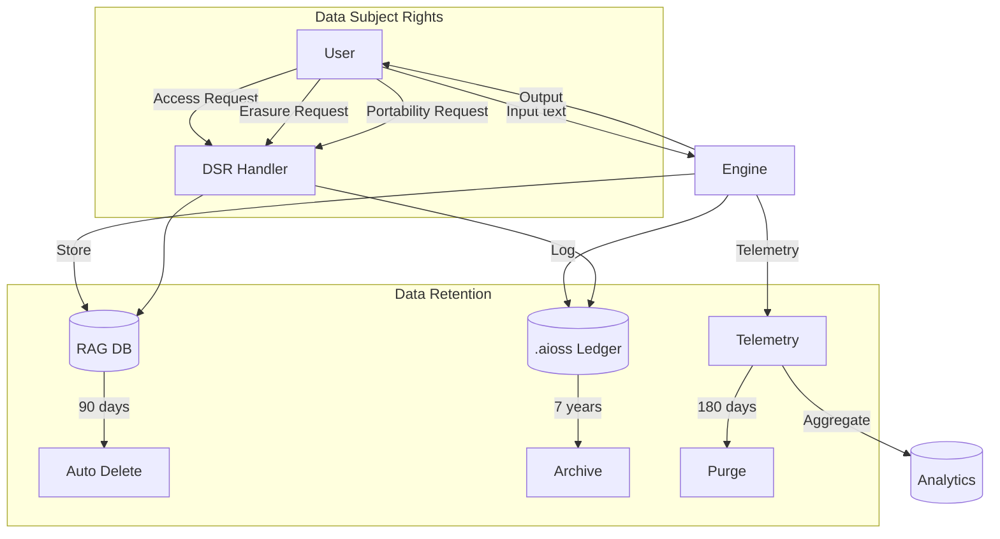

+------------------------------------------------------------------+
¦                   INTE11ECT — COMPLIANCE DOCUMENTATION          ¦
¦                   03 — GDPR ARTICLE MAPPING                      ¦
+------------------------------------------------------------------+

Copyright © 2026 Lois-Kleinner and 0-1.gg. All rights reserved.

---

# GDPR Article Mapping

## Table of Contents

1. [Introduction](#introduction)
2. [GDPR Principles Mapping](#gdpr-principles-mapping)
3. [Data Subject Rights](#data-subject-rights)
4. [Data Processing Documentation](#data-processing-documentation)
5. [Technical Controls](#technical-controls)
6. [Data Protection Impact Assessment](#data-protection-impact-assessment)
7. [Breach Notification](#breach-notification)
8. [Cross-Border Data Transfers](#cross-border-data-transfers)
9. [Records of Processing Activities](#records-of-processing-activities)

---

## Introduction

This document maps the General Data Protection Regulation (GDPR) requirements to Inte11ect's technical architecture and operational processes.

### Applicability

Inte11ect qualifies as both a **data processor** (processing user data through AI inference) and a **data controller** (collecting telemetry and usage data).

| Role | GDPR Definition | Inte11ect Application |
|------|----------------|----------------------|
| Controller | Determines purposes and means | Usage analytics, telemetry |
| Processor | Processes on behalf of controller | AI inference on user data |
| Joint Controller | Jointly determines purposes | Multi-tenant deployments |

---

## GDPR Principles Mapping

### Article 5: Principles of Processing

| Principle | Article | Implementation | Status |
|-----------|---------|---------------|--------|
| Lawfulness, fairness, transparency | 5(1)(a) | Privacy policy, consent management | ? |
| Purpose limitation | 5(1)(b) | Configuration-controlled processing | ? |
| Data minimisation | 5(1)(c) | Configurable retention, minimal logging | ? |
| Accuracy | 5(1)(d) | Ledger-based audit trail | ? |
| Storage limitation | 5(1)(e) | Configurable data retention | ? |
| Integrity & confidentiality | 5(1)(f) | .aioss ledger, Ed25519 proofs, encryption | ? |
| Accountability | 5(2) | Automated compliance monitoring | ? |

### Technical Implementation

```rust
// src/compliance/gdpr/principles.rs

/// Article 5(1)(c): Data minimisation
pub struct DataMinimisationPolicy {
    /// Fields to strip from input before processing
    pii_fields: Vec<String>,
    /// Retention period for input data
    input_retention: Duration,
    /// Whether to hash personal identifiers
    hash_identifiers: bool,
}

impl DataMinimisationPolicy {
    pub fn sanitise_input(&self, input: &mut ProcessInput) {
        // Remove PII fields from metadata
        if let Some(ref mut context) = input.context {
            for field in &self.pii_fields {
                context.remove(field);
            }
        }

        // Optionally hash identifiers
        if self.hash_identifiers {
            if let Some(ref mut context) = input.context {
                for value in context.values_mut() {
                    *value = blake3::hash(value.as_bytes()).to_hex().to_string();
                }
            }
        }
    }
}

/// Article 5(1)(e): Storage limitation
pub struct RetentionManager {
    policies: HashMap<String, RetentionPolicy>,
    ledger: Arc<RwLock<AiossLedger>>,
}

pub struct RetentionPolicy {
    max_age: Duration,
    action: RetentionAction,
}

pub enum RetentionAction {
    Delete,
    Anonymise,
    Archive,
    Notify,
}

impl RetentionManager {
    pub async fn apply_retention(&self) -> Result<RetentionReport, ComplianceError> {
        let mut report = RetentionReport::default();
        let ledger = self.ledger.read().await;

        for (data_type, policy) in &self.policies {
            let cutoff = chrono::Utc::now().timestamp_nanos() - policy.max_age.as_nanos() as i128;
            let expired = ledger.query(LedgerQuery {
                to_timestamp: Some(cutoff),
                module_names: Some(vec![data_type.clone()]),
                ..Default::default()
            })?;

            match policy.action {
                RetentionAction::Delete => {
                    // Ledger entries are immutable; mark for purge
                    report.deleted += expired.len();
                }
                RetentionAction::Anonymise => {
                    report.anonymised += expired.len();
                }
                RetentionAction::Archive => {
                    report.archived += expired.len();
                }
                RetentionAction::Notify => {
                    report.notified += expired.len();
                }
            }
        }

        Ok(report)
    }
}
```

---

## Data Subject Rights

### Article 15-22: Rights Implementation

```rust
// src/compliance/gdpr/rights.rs

pub struct DataSubjectRequestHandler {
    ledger: Arc<RwLock<AiossLedger>>,
    verification: RequestVerifier,
}

impl DataSubjectRequestHandler {
    pub async fn handle_request(
        &self,
        request: DataSubjectRequest,
    ) -> Result<DsrResponse, ComplianceError> {
        // 1. Verify identity
        self.verification.verify(&request).await?;

        // 2. Log request
        ledger.append(LedgerEntry::dsr_request(
            &request.subject_id, &format!("{:?}", request.request_type)
        ))?;

        // 3. Process based on type
        match request.request_type {
            DsrType::Access => self.handle_access(request).await,
            DsrType::Rectification => self.handle_rectification(request).await,
            DsrType::Erasure => self.handle_erasure(request).await,
            DsrType::Restriction => self.handle_restriction(request).await,
            DsrType::Portability => self.handle_portability(request).await,
            DsrType::Objection => self.handle_objection(request).await,
        }
    }

    /// Article 15: Right of access
    async fn handle_access(&self, request: DataSubjectRequest) -> Result<DsrResponse, ComplianceError> {
        let ledger = self.ledger.read().await;

        let entries = ledger.query(LedgerQuery {
            metadata_filter: Some(HashMap::from([
                ("user_id".into(), request.subject_id.clone()),
            ])),
            limit: Some(1000),
            ..Default::default()
        })?;

        Ok(DsrResponse::Access(AccessReport {
            subject_id: request.subject_id,
            data_processed: entries.len(),
            processing_purpose: "AI inference".to_string(),
            data_categories: vec!["Text input".into(), "Generated output".into()],
            recipients: vec![],
            retention_period: "Configurable (default 90 days)".to_string(),
            data_export: entries,
        }))
    }

    /// Article 17: Right to erasure (right to be forgotten)
    async fn handle_erasure(&self, request: DataSubjectRequest) -> Result<DsrResponse, ComplianceError> {
        let ledger = self.ledger.write().await;

        // Mark entries for deletion (append-only ledger, so we flag them)
        let count = ledger.flag_for_deletion(&request.subject_id)?;

        // Log the erasure request
        ledger.append(LedgerEntry::dsr_erasure(
            &request.subject_id, count
        ))?;

        Ok(DsrResponse::Erasure(ErasureReport {
            subject_id: request.subject_id,
            entries_flagged: count,
            estimated_completion: chrono::Utc::now() + chrono::Duration::days(30),
        }))
    }

    /// Article 20: Right to data portability
    async fn handle_portability(&self, request: DataSubjectRequest) -> Result<DsrResponse, ComplianceError> {
        let ledger = self.ledger.read().await;

        let entries = ledger.query(LedgerQuery {
            metadata_filter: Some(HashMap::from([
                ("user_id".into(), request.subject_id.clone()),
            ])),
            ..Default::default()
        })?;

        // Export in machine-readable format
        let export_data = serde_json::to_string_pretty(&PortabilityExport {
            export_date: chrono::Utc::now(),
            subject_id: request.subject_id,
            format: "application/json",
            entries,
        })?;

        Ok(DsrResponse::Portability(PortabilityReport {
            data: export_data,
            format: "json".to_string(),
            size_bytes: export_data.len(),
        }))
    }
}
```

### DSR Metrics

```bash
# Monitor DSR processing
inte11ect compliance gdpr dsr-stats

# View pending DSRs
inte11ect compliance gdpr dsr-list --status pending

# Approve DSR
inte11ect compliance gdpr dsr-approve --id DSR-2026-0042

# Generate DSR report
inte11ect compliance gdpr dsr-report --period 30d
```

---

## Data Processing Documentation

### Article 30: Records of Processing Activities

```rust
pub struct ProcessingRecords {
    controller_info: ControllerInfo,
    processing_activities: Vec<ProcessingActivity>,
    data_categories: Vec<DataCategory>,
    safeguards: Vec<Safeguard>,
}

impl ProcessingRecords {
    pub fn generate_roPa(&self) -> RoPa {
        RoPa {
            controller: self.controller_info.clone(),
            activities: self.processing_activities.iter().map(|a| {
                ProcessingActivityRecord {
                    name: a.name.clone(),
                    purpose: a.purpose.clone(),
                    categories: a.data_categories.clone(),
                    recipients: a.recipients.clone(),
                    transfers: self.get_transfers_for_activity(a),
                    retention_period: a.retention_period.clone(),
                    safeguards: self.safeguards.clone(),
                    description: a.description.clone(),
                }
            }).collect(),
            generated_at: chrono::Utc::now(),
            signed_by: self.controller_info.data_protection_officer.clone(),
        }
    }
}
```

### Processing Activities Register

| Activity | Purpose | Data Categories | Legal Basis | Retention |
|----------|---------|----------------|-------------|-----------|
| Text inference | Generate AI responses | Text input/output | Consent / Legitimate interest | 90 days |
| Document ingestion | RAG indexing | Documents, metadata | Consent | 365 days |
| Telemetry | Performance monitoring | Usage metrics | Legitimate interest | 180 days |
| Error logging | Troubleshooting | Error messages | Legitimate interest | 30 days |
| Ledger recording | Audit trail | Operation metadata | Legal obligation | 7 years |

---

## Technical Controls

### Encryption (Articles 5, 32)

```rust
pub struct GdprEncryption {
    at_rest: EncryptionAtRest,
    in_transit: EncryptionInTransit,
    key_management: KeyManager,
}

impl GdprEncryption {
    pub fn verify_encryption(&self) -> ComplianceCheck {
        // Verify TLS 1.3 for all network traffic
        let tls_check = self.in_transit.verify_tls13();

        // Verify AES-256-GCM for stored data
        let storage_check = self.at_rest.verify_aes256gcm();

        // Verify key rotation schedule
        let key_check = self.key_management.verify_rotation(90);

        ComplianceCheck::combine(vec![tls_check, storage_check, key_check])
    }
}
```

### Consent Management (Article 7)

```rust
pub struct ConsentManager {
    storage: ConsentStorage,
    ledger: Arc<RwLock<AiossLedger>>,
}

impl ConsentManager {
    pub fn record_consent(&self, user_id: &str, purposes: &[ProcessingPurpose]) -> Result<ConsentRecord, ComplianceError> {
        let record = ConsentRecord {
            id: uuid::Uuid::new_v4().to_string(),
            user_id: user_id.to_string(),
            purposes: purposes.to_vec(),
            given_at: chrono::Utc::now(),
            ip_address: None,
            user_agent: None,
            version: "1.0".to_string(),
        };

        self.storage.store(&record)?;
        ledger.append(LedgerEntry::consent_given(&record.id, user_id))?;

        Ok(record)
    }

    pub fn withdraw_consent(&self, user_id: &str, purposes: &[ProcessingPurpose]) -> Result<(), ComplianceError> {
        self.storage.withdraw(user_id, purposes)?;
        ledger.append(LedgerEntry::consent_withdrawn(user_id))?;

        // Immediately stop processing for withdrawn purposes
        self.enforce_consent_withdrawal(user_id, purposes)?;

        Ok(())
    }

    pub fn verify_consent(&self, user_id: &str, purpose: &ProcessingPurpose) -> bool {
        self.storage.has_valid_consent(user_id, purpose)
    }
}
```

---

## Data Protection Impact Assessment

### Article 35: DPIA

```markdown
## DPIA: Inte11ect AI Inference Engine

### 1. Need for DPIA
Processing involves systematic evaluation of personal aspects,
processing of special category data (if configured), and
systematic monitoring of data subjects.

### 2. Processing Description
- AI inference on text and image data
- Automated decision-making for content generation
- Telemetry and usage analytics

### 3. Necessity & Proportionality
- Processing is necessary for core functionality
- Data minimisation implemented by default
- Configurable processing scope

### 4. Risk Assessment

| Risk | Likelihood | Impact | Mitigation |
|------|-----------|--------|------------|
| Unauthorised access | Low | High | Ed25519 proofs, RBAC |
| Data leakage via model | Low | High | PII redaction module |
| Bias in outputs | Medium | Medium | Bias monitoring module |
| Consent not respected | Low | High | Consent manager |

### 5. Measures
- .aioss ledger for full audit trail
- WASM sandbox for module isolation
- Encryption at rest and in transit
- Configurable data retention
- DSR automation
```

---

## Breach Notification

### Articles 33-34: Breach Handling

```rust
pub struct BreachManager {
    notification_queue: NotificationQueue,
    regulator_contacts: HashMap<String, RegulatorContact>,
    incident_timer: IncidentTimer,
}

impl BreachManager {
    pub fn handle_breach(&self, breach: DataBreach) -> Result<BreachResponse, ComplianceError> {
        // 1. Containment
        self.contain_breach(&breach)?;

        // 2. Assessment
        let risk = self.assess_risk(&breach);

        // 3. Notification to DPA (Article 33: within 72 hours)
        if risk.is_high() {
            self.notify_supervisory_authority(&breach)?;
        }

        // 4. Notification to data subjects (Article 34)
        if risk.is_high() {
            self.notify_data_subjects(&breach)?;
        }

        // 5. Documentation
        ledger.append(LedgerEntry::breach_logged(
            &breach.id, &format!("{:?}", risk)
        ))?;

        Ok(BreachResponse {
            breach_id: breach.id,
            notified_dpa: risk.is_high(),
            notified_subjects: risk.is_high(),
            containment_time: self.incident_timer.elapsed(),
        })
    }

    fn notify_supervisory_authority(&self, breach: &DataBreach) -> Result<(), ComplianceError> {
        let notification = BreachNotification {
            breach_id: breach.id.clone(),
            nature: breach.nature.clone(),
            categories: breach.affected_categories.clone(),
            approximate_count: breach.affected_count,
            consequences: breach.consequences.clone(),
            measures: breach.remediation_measures.clone(),
            data_protection_officer: self.dpo_contact(),
            timestamp: chrono::Utc::now(),
        };

        // Send to relevant DPA
        for (jurisdiction, contact) in &self.regulator_contacts {
            if breach.jurisdictions.contains(jurisdiction) {
                self.send_notification(contact, &notification)?;
            }
        }

        Ok(())
    }

    fn notify_data_subjects(&self, breach: &DataBreach) -> Result<(), ComplianceError> {
        let affected_ids = self.identify_affected_subjects(&breach)?;

        for subject_id in affected_ids {
            let contact = self.get_subject_contact(&subject_id)?;
            self.send_subject_notification(contact, &breach)?;
        }

        Ok(())
    }
}
```

---

## Cross-Border Data Transfers

### Articles 44-49: Transfer Safeguards

```rust
pub struct TransferManager {
    adequacy_decisions: Vec<String>,
    sccs: Vec<StandardContractualClause>,
    bcr: Option<BindingCorporateRules>,
}

impl TransferManager {
    pub fn validate_transfer(&self, from: &Jurisdiction, to: &Jurisdiction) -> TransferValidity {
        if self.has_adequacy_decision(to) {
            return TransferValidity::Adequate;
        }

        if self.has_scc(from, to) {
            return TransferValidity::SCCs;
        }

        if self.has_bcr(to) {
            return TransferValidity::BCRs;
        }

        TransferValidity::RequiresAssessment
    }
}
```

### Data Residency

```bash
# Configure data residency
inte11ect config set data_residency eu
inte11ect config set data_residency us

# Verify current residency
inte11ect compliance gdpr residency
```

---

## Records of Processing Activities

### Automated RoPA Generation

```bash
# Generate RoPA
inte11ect compliance gdpr ropa --output ropa.json

# Export for regulatory review
inte11ect compliance gdpr ropa --format pdf --output ropa.pdf

# Schedule quarterly RoPA review
inte11ect compliance schedule --cron "0 0 1 */3 *" \
    --command "compliance gdpr ropa --output /var/compliance/ropa_$(date +%Y%m%d).json"
```

---

## GDPR Data Mapping

### Data Inventory

| Data Category | Personal Data | Processing Purpose | Legal Basis | Retention | Storage Location |
|--------------|--------------|-------------------|-------------|-----------|-----------------|
| User input text | Free text (may contain PII) | AI inference | Consent / Legitimate interest | 90 days | Local / EU region |
| Generated output | Free text | Service delivery | Contract performance | 90 days | Local / EU region |
| Account credentials | Email, password hash | Authentication | Contract performance | Account lifetime | Encrypted DB |
| Usage telemetry | Anonymous metrics | Service improvement | Legitimate interest | 180 days | Aggregated |
| Ledger entries | Metadata (user IDs) | Audit trail | Legal obligation | 7 years | Immutable store |
| Support tickets | Name, email, issue | Customer support | Consent | 3 years | CRM system |
| Billing data | Name, address, payment | Payment processing | Contract performance | 10 years | Payment processor |

### Data Flow Diagram



### Consent Records Schema

```sql
CREATE TABLE IF NOT EXISTS consent_records (
    id TEXT PRIMARY KEY,
    user_id TEXT NOT NULL,
    purposes TEXT NOT NULL,  -- JSON array
    given_at INTEGER NOT NULL,
    expires_at INTEGER,
    ip_address TEXT,
    user_agent TEXT,
    consent_version TEXT NOT NULL,
    withdrawn_at INTEGER,
    withdrawal_reason TEXT,
    created_at INTEGER DEFAULT (unixepoch())
);

CREATE INDEX idx_consent_user ON consent_records(user_id);
CREATE INDEX idx_consent_valid ON consent_records(expires_at)
    WHERE withdrawn_at IS NULL AND expires_at > unixepoch();
```

### Automated SAR Processing

```bash
#!/usr/bin/env bash
# process-sar.sh

echo "Subject Access Request Processor"
echo "================================"

# 1. Verify identity (out of band)
echo "Step 1: Identity verified via support ticket"

# 2. Search for user data
inte11ect ledger query --filter "user_id:$USER_ID" --format json \
    --output "sar_${USER_ID}_ledger.json"

inte11ect rag search --user "$USER_ID" --format json \
    --output "sar_${USER_ID}_rag.json"

# 3. Compile response package
zip "sar_${USER_ID}_response.zip" \
    "sar_${USER_ID}_ledger.json" \
    "sar_${USER_ID}_rag.json"

echo "SAR response package created: sar_${USER_ID}_response.zip"
```

---

## GDPR Compliance Scripts

### Automated Compliance Check

```bash
#!/usr/bin/env bash
# check-gdpr-compliance.sh

echo "Running GDPR compliance check..."
echo "================================"

# 1. Check consent records
echo -n "Consent records: "
inte11ect compliance gdpr consent-count

# 2. Check data retention
echo -n "Data retention compliance: "
inte11ect compliance gdpr check-retention

# 3. Verify breach notification procedure
echo -n "Breach notification readiness: "
inte11ect compliance gdpr test-breach-notification

# 4. Check DSR processing times
echo -n "Average DSR processing time: "
inte11ect compliance gdpr dsr-average-time

# 5. Generate compliance score
echo -n "GDPR compliance score: "
inte11ect compliance score --framework gdpr
```

### Data Protection Impact Assessment Schedule

```yaml
dpia_schedule:
  initial_assessment: "Completed 2026-01-15"
  review_frequency: "Annual"
  next_review: "2027-01-15"
  trigger_events:
    - "New processing purpose"
    - "New data category"
    - "Technology change affecting privacy"
    - "Post-breach remediation"
  
  processed_dpias:
    - id: "DPIA-2026-001"
      title: "AI Inference Engine"
      status: "Approved"
      approved_date: "2026-02-01"
      next_review: "2027-02-01"
```

---

*Lois-Kleinner and 0-1.gg 2026 — Confidential*

```
.====================================================================.
!  Made in the UAE, Dubai #DubaiIt #Dubai #Dxb #SovereignAI          !
!  Made in The Emirates #Dubai_it                                    !
!                                                                    !
!  Lois-Kleinner Alpasan - The Anticloud 2026-                       !
!                                                                    !
!  0-1.gg ! GitHub ! LinkedIn ! DEV ! GH Pages                       !
!  HuggingFace ! Blog ! Tumblr ! Fandom ! Bluesky ! Mastodon          !
!  Zenodo ! Harvard Dataverse ! Internet Archive ! ORCID ! Figshare   !
!                                                                    !
!  Sovereign AI ! Local-First ! Privacy ! Zero Trust ! No Datacenter !
!  Air-Gapped ! Open Source ! Rust ! Hash Chain ! Single Binary      !
!  Offline LLM ! Crypto Ledger ! P2P ! Federated                     !
'===================================================================='
```

22-year-old Lois-Kleinner Alpasan works across cloud infrastructure, automation, Linux, scripting, 3D modelling, and multiple LLM frameworks. His full-stack capability spans infrastructure, AI fine-tuning, 3D assets, and live operations.

References:
1. Lois-Kleinner Zenodo: https://doi.org/10.5281/zenodo.20781790
2. Lois-Kleinner GitHub: https://github.com/kleinnner/Anticloud/tree/main/04-aioss-format
3. Lois-Kleinner Harvard DV: https://doi.org/10.7910/DVN/GDLO0L
4. Lois-Kleinner Internet Arc: https://archive.org/details/aioss-format
5. Lois-Kleinner ORCID: https://orcid.org/0009-0009-2233-6107
6. Lois-Kleinner DEV.to: https://dev.to/kleinner
7. Lois-Kleinner LinkedIn: https://linkedin.com/in/kleinner
8. Lois-Kleinner HuggingFace: https://huggingface.co/Anticloud
9. Lois-Kleinner Tumblr: https://anticloud.tumblr.com
10. Lois-Kleinner Mastodon: https://mastodon.social/@kleinner
11. Lois-Kleinner Bluesky: https://bsky.app/profile/kleinner.bsky.social
12. 0-1.gg: https://0-1.gg
13. Lois-Kleinner Figshare: https://figshare.com/authors/Lois-Kleinner_Alpasan/20849885
