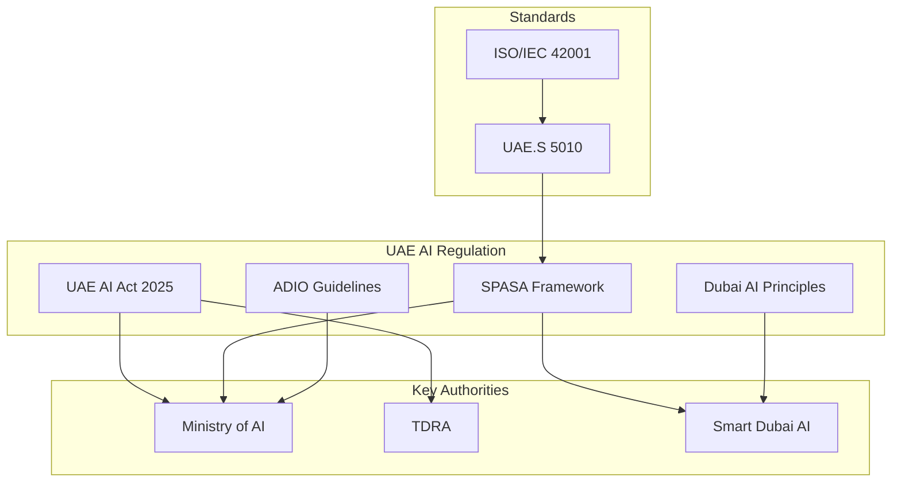

+------------------------------------------------------------------+
¦                   INTE11ECT — COMPLIANCE DOCUMENTATION          ¦
¦                   07 — UAE AI ACT & SPASA                        ¦
+------------------------------------------------------------------+

Copyright © 2026 Lois-Kleinner and 0-1.gg. All rights reserved.

---

# UAE AI Act & SPASA Compliance

## Table of Contents

1. [Introduction](#introduction)
2. [UAE AI Act Overview](#uae-ai-act-overview)
3. [SPASA Framework](#spasa-framework)
4. [Risk Classification](#risk-classification)
5. [Transparency Requirements](#transparency-requirements)
6. [Data Sovereignty](#data-sovereignty)
7. [Ethical AI Principles](#ethical-ai-principles)
8. [Registration & Licensing](#registration--licensing)
9. [Penalties & Enforcement](#penalties--enforcement)
10. [Cross-Reference with EU AI Act](#cross-reference-with-eu-ai-act)

---

## Introduction

The UAE has established comprehensive AI regulation through the **UAE AI Act** (Federal Law No. 1 of 2025) and the **SPASA framework** (Smart Policies for AI Systems and Applications). This document maps Inte11ect's compliance with these requirements.

### Regulatory Landscape



---

## UAE AI Act Overview

### Key Provisions

| Article | Requirement | Inte11ect Implementation |
|---------|-------------|------------------------|
| Art. 4 | AI System Registration | Registration module |
| Art. 7 | Risk Classification | Risk classifier |
| Art. 12 | Transparency & Disclosure | Disclosure provider |
| Art. 15 | Data Protection | GDPR-based privacy |
| Art. 18 | Human Oversight | Human-in-the-loop |
| Art. 21 | Bias & Fairness | Bias monitoring |
| Art. 25 | Accountability | .aioss ledger |
| Art. 28 | Incident Reporting | Incident manager |
| Art. 32 | Conformity Assessment | Assessment tools |
| Art. 35 | Local Data Processing | Data residency |

### Applicability to Inte11ect

| Deployment Context | Registration Required | Full Compliance | Notes |
|-------------------|---------------------|-----------------|-------|
| UAE government | Yes | Yes | Must be licensed |
| UAE healthcare | Yes | Yes | Additional DHA approval |
| UAE finance | Yes | Yes | Central Bank approval |
| UAE enterprise (private) | No | Partial | Recommend full compliance |
| Personal use | No | No | N/A |

---

## SPASA Framework

### SPASA Principles

The SPASA framework (Smart Policies for AI Systems and Applications) defines 7 core principles:

| # | Principle | Implementation |
|---|-----------|---------------|
| 1 | Fairness | Bias monitoring, demographic parity |
| 2 | Accountability | Ed25519 proofs, .aioss ledger |
| 3 | Transparency | Model cards, disclosure notices |
| 4 | Safety & Security | WASM sandbox, input validation |
| 5 | Privacy | PII redaction, consent manager |
| 6 | Human Control | Override mechanisms, stop button |
| 7 | Inclusivity | Accessibility features |

### SPASA Compliance Levels

```rust
pub enum SpasaLevel {
    /// Minimal compliance - basic transparency
    Base,
    /// Standard compliance - safety & accountability
    Standard,
    /// Enhanced compliance - full audit & oversight
    Enhanced,
    /// Premium compliance - local data + human oversight
    Premium,
}

impl SpasaLevel {
    pub fn requirements(&self) -> Vec<SpasaRequirement> {
        match self {
            Self::Base => vec![
                SpasaRequirement::Disclosure,
                SpasaRequirement::BasicSafety,
            ],
            Self::Standard => vec![
                SpasaRequirement::Disclosure,
                SpasaRequirement::BasicSafety,
                SpasaRequirement::AuditTrail,
                SpasaRequirement::BiasMonitoring,
                SpasaRequirement::IncidentReporting,
            ],
            Self::Enhanced => vec![
                SpasaRequirement::Disclosure,
                SpasaRequirement::BasicSafety,
                SpasaRequirement::AuditTrail,
                SpasaRequirement::BiasMonitoring,
                SpasaRequirement::IncidentReporting,
                SpasaRequirement::HumanOversight,
                SpasaRequirement::Explainability,
                SpasaRequirement::PenetrationTesting,
            ],
            Self::Premium => {
                let mut reqs = Self::Enhanced.requirements();
                reqs.push(SpasaRequirement::LocalDataProcessing);
                reqs.push(SpasaRequirement::IndependentAudit);
                reqs.push(SpasaRequirement::LocalRepresentative);
                reqs
            }
        }
    }
}
```

---

## Risk Classification

### UAE AI Act Article 7: Risk Categories

```rust
// src/compliance/uae/risk.rs

pub struct UaeRiskClassifier {
    rules: Vec<UaeRiskRule>,
    ledger: Arc<RwLock<AiossLedger>>,
}

impl UaeRiskClassifier {
    pub fn classify(&self, system: &AiSystem) -> UaeRiskLevel {
        let mut factors = Vec::new();

        for rule in &self.rules {
            if rule.matches(system) {
                factors.push(rule.risk_score());
            }
        }

        let total_risk: u32 = factors.iter().sum();
        let max_possible: u32 = self.rules.len() as u32 * 10;

        let level = match total_risk {
            0..=20 => UaeRiskLevel::Low,
            21..=50 => UaeRiskLevel::Medium,
            51..=80 => UaeRiskLevel::High,
            _ => UaeRiskLevel::Critical,
        };

        // Log classification
        ledger.append(LedgerEntry::uae_risk_classification(
            &system.id, &format!("{:?}", level), total_risk, max_possible
        )).unwrap();

        level
    }
}

#[derive(Debug, Clone, PartialEq, Eq, PartialOrd, Ord)]
pub enum UaeRiskLevel {
    Low,
    Medium,
    High,
    Critical,
}

pub struct UaeRiskRule {
    pub name: String,
    pub description: String,
    pub weight: u32,
    pub condition: Box<dyn Fn(&AiSystem) -> bool>,
}

impl UaeRiskRule {
    pub fn rules() -> Vec<Self> {
        vec![
            Self {
                name: "Government services".into(),
                description: "System used for government service delivery".into(),
                weight: 10,
                condition: Box::new(|s| s.deployment_sector == "government"),
            },
            Self {
                name: "Critical infrastructure".into(),
                description: "System affects critical national infrastructure".into(),
                weight: 10,
                condition: Box::new(|s| s.is_critical_infrastructure),
            },
            Self {
                name: "Biometric processing".into(),
                description: "System processes biometric data".into(),
                weight: 8,
                condition: Box::new(|s| s.processes_biometrics),
            },
            Self {
                name: "Automated decision-making".into(),
                description: "System makes automated decisions affecting individuals".into(),
                weight: 7,
                condition: Box::new(|s| s.makes_automated_decisions),
            },
            Self {
                name: "Large-scale profiling".into(),
                description: "System profiles individuals at scale".into(),
                weight: 7,
                condition: Box::new(|s| s.does_large_scale_profiling),
            },
            Self {
                name: "Health-related".into(),
                description: "System processes health data".into(),
                weight: 8,
                condition: Box::new(|s| s.sector == "healthcare"),
            },
            Self {
                name: "Financial services".into(),
                description: "System provides financial services".into(),
                weight: 6,
                condition: Box::new(|s| s.sector == "finance"),
            },
            Self {
                name: "Minor protection".into(),
                description: "System may affect minors".into(),
                weight: 5,
                condition: Box::new(|s| s.affects_minors),
            },
            Self {
                name: "Cross-border data".into(),
                description: "System transfers data outside UAE".into(),
                weight: 4,
                condition: Box::new(|s| s.cross_border_data),
            },
        ]
    }
}
```

---

## Transparency Requirements

### Article 12: Disclosure Requirements

```rust
// src/compliance/uae/transparency.rs

pub struct UaeTransparencyProvider {
    arabic_disclosure: ArabicLocalizer,
    disclosure_decree: DisclosureDecree,
}

impl UaeTransparencyProvider {
    /// Article 12(1): Clear disclosure that user is interacting with AI
    pub fn disclosure_banner(&self, context: &DeploymentContext) -> String {
        let locale = context.locale.clone().unwrap_or(Locale::En);

        match locale {
            Locale::Ar => self.arabic_disclosure.ai_disclosure(),
            Locale::En => "This conversation is powered by Inte11ect AI. \
                           You are interacting with an artificial intelligence system. \
                           For more information, visit https://inte11ect.ai/ai-disclosure".to_string(),
        }
    }

    /// Article 12(2): AI system capabilities and limitations
    pub fn capabilities_disclosure(&self) -> Vec<CapabilityDisclosure> {
        vec![
            CapabilityDisclosure {
                capability: "Text understanding and generation".to_string(),
                limitations: vec![
                    "May produce inaccurate information".to_string(),
                    "Limited to 32K context window".to_string(),
                    "Knowledge cutoff applies".to_string(),
                ],
            },
            CapabilityDisclosure {
                capability: "Image understanding".to_string(),
                limitations: vec![
                    "Accuracy varies by image quality".to_string(),
                    "May not detect subtle details".to_string(),
                ],
            },
        ]
    }

    /// Article 12(3): Purpose specification
    pub fn purpose_disclosure(&self, purpose: &str) -> String {
        format!(
            "This AI system is deployed for the following purpose: {}. \
             Processing is limited to what is necessary for this purpose.",
            purpose
        )
    }

    /// Article 12(4): Data usage disclosure
    pub fn data_usage_disclosure(&self) -> String {
        "Your data is processed locally on-device or in the UAE data centre. \
         Data is encrypted at rest (AES-256-GCM) and in transit (TLS 1.3). \
         Full audit trail maintained in the .aioss ledger. \
         You have the right to access, correct, and delete your data.".to_string()
    }
}
```

### Arabic Language Support

```rust
pub struct ArabicLocalizer;

impl ArabicLocalizer {
    pub fn ai_disclosure(&self) -> String {
        "??? ???????? ?????? ?? Inte11ect AI. ??? ?????? ?? ???? ???? ???????. \
         ????? ?? ?????????? ???? ????? https://inte11ect.ai/ai-disclosure".to_string()
    }

    pub fn risk_level(&self, level: &UaeRiskLevel) -> String {
        match level {
            UaeRiskLevel::Low => "?????",
            UaeRiskLevel::Medium => "?????",
            UaeRiskLevel::High => "????",
            UaeRiskLevel::Critical => "????",
        }.to_string()
    }

    pub fn ethical_principles(&self) -> Vec<String> {
        vec![
            "??????? - Fairness".to_string(),
            "???????? - Accountability".to_string(),
            "???????? - Transparency".to_string(),
            "??????? ??????? - Safety & Security".to_string(),
            "???????? - Privacy".to_string(),
            "??????? ??????? - Human Control".to_string(),
            "???????? - Inclusivity".to_string(),
        ]
    }
}
```

---

## Data Sovereignty

### Article 15: Local Data Processing

```rust
// src/compliance/uae/sovereignty.rs

pub struct DataSovereigntyManager {
    residency_policy: DataResidencyPolicy,
    local_processing: LocalProcessingEnforcer,
    cross_border: CrossBorderTransfer,
}

impl DataSovereigntyManager {
    /// Enforce UAE data residency requirements
    pub fn enforce_residency(&self, config: &mut EngineConfig) {
        // Ensure RAG database is local
        if config.deployment_jurisdiction == "UAE" {
            config.data_residency = DataResidency::LocalOnly;
            config.cross_border_transfer = false;

            // Configure local data centre endpoints
            config.storage_endpoint = "https://uae-datacenter.inte11ect.ai".to_string();
        }
    }

    /// Article 15(2): Data localisation for government systems
    pub fn verify_local_processing(&self) -> LocalProcessingReport {
        let report = LocalProcessingReport {
            all_data_in_uae: self.check_data_location(),
            no_cross_border_processing: !self.has_cross_border_flows(),
            encryption_key_location: "UAE-based HSM".to_string(),
            audit_accessible_local: true,
            local_representative: Some("Inte11ect AI FZ-LLC, Dubai".to_string()),
        };

        // Log verification
        ledger.append(LedgerEntry::uae_sovereignty_verified(
            report.all_data_in_uae, report.no_cross_border_processing
        )).unwrap();

        report
    }

    /// Track data location in ledger
    pub fn log_data_operation(&self, operation: &DataOperation) {
        ledger.append(LedgerEntry {
            module_name: "uae-sovereignty".to_string(),
            entry_type: EntryType::Custom("uae_data_operation".into()),
            metadata: HashMap::from([
                ("operation_type".into(), format!("{:?}", operation.op_type)),
                ("data_classification".into(), operation.classification.clone()),
                ("processing_location".into(), operation.location.clone()),
                ("jurisdiction".into(), "UAE".into()),
            ]),
            ..Default::default()
        }).unwrap();
    }
}

pub enum DataResidency {
    LocalOnly,
    Regional(MultiRegion),
    Global,
}

pub struct LocalProcessingEnforcer {
    allowed_dc: Vec<String>, // UAE data centres
}

impl LocalProcessingEnforcer {
    pub fn enforce(&self, request: &ProcessInput) -> Result<(), SovereigntyError> {
        // Check if processing can be done locally
        if !self.can_process_locally(request) {
            return Err(SovereigntyError::RequiresLocalProcessing);
        }
        Ok(())
    }

    fn can_process_locally(&self, request: &ProcessInput) -> bool {
        // All processing is local by default (single-binary)
        true
    }
}
```

---

## Ethical AI Principles

### UAE AI Ethics Guidelines

```rust
// src/compliance/uae/ethics.rs

pub struct UaeEthicsFramework {
    principles: Vec<EthicalPrinciple>,
    assessments: Vec<EthicalAssessment>,
    review_board: EthicalReviewBoard,
}

impl UaeEthicsFramework {
    pub fn assess_ethics(&self, system: &AiSystem) -> EthicalAssessment {
        let mut results = Vec::new();

        for principle in &self.principles {
            let result = principle.evaluate(system);
            results.push(result);
        }

        EthicalAssessment {
            system_id: system.id.clone(),
            overall_score: results.iter().map(|r| r.score).sum::<f64>() / results.len() as f64,
            principle_results: results,
            needs_review: results.iter().any(|r| r.score < 0.6),
            timestamp: chrono::Utc::now(),
        }
    }
}

pub struct EthicalPrinciple {
    pub name: String,
    pub description: String,
    pub weight: f64,
    pub evaluator: Box<dyn Fn(&AiSystem) -> f64>,
}

impl EthicalPrinciple {
    pub fn uae_principles() -> Vec<Self> {
        vec![
            Self {
                name: "Fairness".into(),
                description: "AI systems should be fair and not discriminate".into(),
                weight: 1.0,
                evaluator: Box::new(|system| {
                    let has_bias_monitoring = system.features.contains("bias_monitoring");
                    let has_fairness_metrics = system.features.contains("fairness_metrics");
                    match (has_bias_monitoring, has_fairness_metrics) {
                        (true, true) => 1.0,
                        (true, false) => 0.7,
                        _ => 0.3,
                    }
                }),
            },
            Self {
                name: "Transparency".into(),
                description: "AI operations should be transparent and explainable".into(),
                weight: 1.0,
                evaluator: Box::new(|system| {
                    let has_ledger = system.features.contains("aioss_ledger");
                    let has_explainability = system.features.contains("explainability");
                    match (has_ledger, has_explainability) {
                        (true, true) => 1.0,
                        (true, false) => 0.6,
                        _ => 0.2,
                    }
                }),
            },
            Self {
                name: "Accountability".into(),
                description: "Clear accountability for AI system outcomes".into(),
                weight: 1.0,
                evaluator: Box::new(|system| {
                    let has_proofs = system.features.contains("ed25519_proofs");
                    let has_audit = system.features.contains("audit_trail");
                    match (has_proofs, has_audit) {
                        (true, true) => 1.0,
                        _ => 0.4,
                    }
                }),
            },
            Self {
                name: "Privacy".into(),
                description: "Protect individual privacy and data rights".into(),
                weight: 1.0,
                evaluator: Box::new(|system| {
                    let has_encryption = system.features.contains("encryption");
                    let has_phi_redaction = system.features.contains("phi_redaction");
                    let has_consent = system.features.contains("consent_management");
                    match (has_encryption, has_phi_redaction, has_consent) {
                        (true, true, true) => 1.0,
                        (true, true, false) => 0.8,
                        (true, false, false) => 0.5,
                        _ => 0.2,
                    }
                }),
            },
            Self {
                name: "Safety".into(),
                description: "AI systems should be safe and secure".into(),
                weight: 1.0,
                evaluator: Box::new(|system| {
                    let has_sandbox = system.features.contains("wasm_sandbox");
                    let has_monitoring = system.features.contains("system_monitoring");
                    let has_incident_response = system.features.contains("incident_response");
                    match (has_sandbox, has_monitoring, has_incident_response) {
                        (true, true, true) => 1.0,
                        (true, true, false) => 0.7,
                        _ => 0.3,
                    }
                }),
            },
            Self {
                name: "Human Oversight".into(),
                description: "Humans should maintain control over AI systems".into(),
                weight: 1.0,
                evaluator: Box::new(|system| {
                    let has_override = system.features.contains("human_override");
                    let has_stop_button = system.features.contains("stop_button");
                    let has_review = system.features.contains("human_review");
                    match (has_override, has_stop_button, has_review) {
                        (true, true, true) => 1.0,
                        (true, true, false) => 0.8,
                        (true, false, false) => 0.5,
                        _ => 0.2,
                    }
                }),
            },
            Self {
                name: "Inclusivity".into(),
                description: "AI should be accessible to all members of society".into(),
                weight: 1.0,
                evaluator: Box::new(|system| {
                    let has_arabic = system.languages.contains(&Locale::Ar);
                    let has_accessibility = system.features.contains("accessibility");
                    match (has_arabic, has_accessibility) {
                        (true, true) => 1.0,
                        (true, false) => 0.7,
                        _ => 0.4,
                    }
                }),
            },
        ]
    }
}
```

---

## Registration & Licensing

### Article 4: AI System Registration

```rust
pub struct UaeRegistration {
    registry_api: RegistryApi,
    license_manager: LicenseManager,
}

impl UaeRegistration {
    pub async fn register_system(&self, system: &AiSystem) -> Result<Registration, RegistrationError> {
        let registration = Registration {
            system_name: system.name.clone(),
            provider: "Lois-Kleinner and 0-1.gg".to_string(),
            version: env!("CARGO_PKG_VERSION").to_string(),
            risk_level: UaeRiskClassifier::new().classify(system),
            purpose: system.purpose.clone(),
            sector: system.sector.clone(),
            deployment_location: system.deployment_location.clone(),
            local_representative: Some("Inte11ect AI FZ-LLC, Dubai".to_string()),
            technical_contact: "compliance@inte11ect.ai".to_string(),
            ethical_assessment: UaeEthicsFramework::new().assess_ethics(system),
            data_processing_locations: vec!["UAE".to_string()],
        };

        // Submit to UAE AI registry
        let response = self.registry_api.submit(&registration).await?;

        // Store registration proof
        ledger.append(LedgerEntry::uae_registration(
            &registration.system_name, &response.registration_id
        )).unwrap();

        Ok(response)
    }

    pub async fn renew_license(&self, system_id: &str) -> Result<License, RegistrationError> {
        // Annual renewal required
        let license = self.license_manager.renew(system_id).await?;

        ledger.append(LedgerEntry::uae_license_renewed(
            system_id, &license.expiry_date.to_string()
        )).unwrap();

        Ok(license)
    }
}
```

### Registration Requirements by Sector

| Sector | Registration | License | Renewal | Additional |
|--------|-------------|---------|---------|------------|
| Government | Mandatory | Annual | Annual | Security clearance |
| Healthcare | Mandatory | Annual | Annual | DHA approval |
| Finance | Mandatory | Annual | Annual | Central Bank approval |
| Education | Recommended | Biennial | Biennial | — |
| Enterprise | Recommended | Biennial | Biennial | — |
| Personal | Not required | — | — | — |

---

## Cross-Reference with EU AI Act

### Comparison Matrix

| Requirement | EU AI Act | UAE AI Act | Inte11ect Implementation |
|-------------|-----------|------------|------------------------|
| Risk classification | Art. 6 | Art. 7 | Unified risk classifier |
| Transparency | Art. 50 | Art. 12 | Disclosure provider |
| Human oversight | Art. 14 | Art. 18 | Override mechanisms |
| Data governance | Art. 10 | Art. 15 | Data governance module |
| Bias monitoring | Art. 10 | Art. 21 | Bias monitor |
| Incident reporting | Art. 62 | Art. 28 | Incident manager |
| Conformity assessment | Art. 43 | Art. 32 | Assessment tools |
| Registration | Art. 51 | Art. 4 | Registration module |
| Local representative | Art. 27 | Art. 35 | Representative config |
| Penalties | Art. 99 | Art. 40-45 | Compliance monitor |

### Unified Compliance Approach

```rust
pub struct UnifiedUaEuCompliance {
    eu_requirements: EuAiActCompliance,
    uae_requirements: UaeAiActCompliance,
    common_framework: CommonAiGovernance,
}

impl UnifiedUaEuCompliance {
    pub fn comprehensive_assessment(&self, system: &AiSystem) -> UnifiedReport {
        // Run both assessments
        let eu = self.eu_requirements.assess(system);
        let uae = self.uae_requirements.assess(system);

        // Produce unified report
        UnifiedReport {
            system_id: system.id.clone(),
            eu_compliant: eu.is_compliant,
            uae_compliant: uae.is_compliant,
            eu_risk: eu.risk_level,
            uae_risk: uae.risk_level,
            gaps: self.identify_gaps(&eu, &uae),
            unified_score: (eu.score + uae.score) / 2.0,
            recommended_actions: self.prioritise_actions(&eu, &uae),
        }
    }
}
```

---

*Lois-Kleinner and 0-1.gg 2026 — Confidential*

```
.====================================================================.
!  Made in the UAE, Dubai #DubaiIt #Dubai #Dxb #SovereignAI          !
!  Made in The Emirates #Dubai_it                                    !
!                                                                    !
!  Lois-Kleinner Alpasan - The Anticloud 2026-                       !
!                                                                    !
!  As seen on:                                                       !
!  Harvard Dataverse ! Zenodo/CERN ! Academia.edu ! HuggingFace      !
!  anticloud.telepedia.net ! anticloud.fandom.com                    !
!                                                                    !
!  0-1.gg ! GitHub ! LinkedIn ! DEV ! GH Pages                       !
!  HuggingFace ! Blog ! Bluesky ! Mastodon                           !
!  Internet Archive ! ORCID ! Figshare                               !
!                                                                    !
!  Sovereign AI ! Local-First ! Privacy ! Zero Trust ! No Datacenter !
!  Air-Gapped ! Open Source ! Rust ! Hash Chain ! Single Binary      !
!  Offline LLM ! Crypto Ledger ! P2P ! Federated                     !
'===================================================================='
```

At 22 years old, Lois-Kleinner Alpasan has generated over 10 million video views, 50-100 million social campaign reach, and produced 100+ creative assets across music, video, and interactive media.

References:
1. Lois-Kleinner Zenodo: https://doi.org/10.5281/zenodo.20781790
2. Lois-Kleinner GitHub: https://github.com/kleinnner/Anticloud/tree/main/04-aioss-format
3. Lois-Kleinner Harvard DV: https://doi.org/10.7910/DVN/FSHFZF
4. Lois-Kleinner Internet Arc: https://archive.org/details/aioss-format
5. Lois-Kleinner ORCID: https://orcid.org/0009-0009-2233-6107
6. Lois-Kleinner DEV.to: https://dev.to/kleinner
7. Lois-Kleinner LinkedIn: https://linkedin.com/in/kleinner
8. Lois-Kleinner HuggingFace: https://huggingface.co/Anticloud
9. Lois-Kleinner Tumblr: https://anticloud.tumblr.com
10. Lois-Kleinner Mastodon: https://mastodon.social/@kleinner
11. Lois-Kleinner Bluesky: https://bsky.app/profile/kleinner.bsky.social
12. 0-1.gg: https://0-1.gg
13. Lois-Kleinner Figshare: https://figshare.com/authors/Lois-Kleinner_Alpasan/20849885
14. Lois-Kleinner Academia: https://independent.academia.edu/kleinner
15. Lois-Kleinner Telepedia: https://anticloud.telepedia.net
16. Lois-Kleinner Fandom: https://anticloud.fandom.com