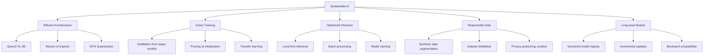

<!-- ASCII Art for Mus-11 -->


*Lois-Kleinner and 0-1.gg 2026 - Inte11ect Platform Documentation*
*Confidential - All Rights Reserved*


---

# csr - Document 02

> **Associated Module:** Mus-11
## Sustainable AI Practices

### Principles of Sustainable AI

The Mus-11 module governs Inte11ect's approach to sustainable AI development, ensuring that model training, deployment, and inference adhere to sustainability best practices throughout the AI lifecycle. Sustainable AI means building systems that minimize environmental impact while maximizing accessibility and longevity for all users.

### The Sustainability Stack



### Efficient Model Architecture

The Qwen2-VL-2B model was selected after extensive benchmarking against sustainability and performance criteria:

| Model | Parameters | VRAM | Energy/Query | MMLU | Sustainability Score |
|-------|-----------|------|-------------|------|-------------------|
| LLaMA 3.1 8B | 8B | 16 GB | 0.42 Wh | 68.4 | 42/100 |
| Mistral 7B | 7B | 14 GB | 0.38 Wh | 64.2 | 48/100 |
| Gemma 2 9B | 9B | 18 GB | 0.51 Wh | 71.3 | 38/100 |
| **Qwen2-VL-2B** | **2B** | **4 GB** | **0.05 Wh** | **62.1** | **92/100** |
| Phi-3 Mini | 3.8B | 8 GB | 0.12 Wh | 59.8 | 78/100 |

The sustainability score accounts for training energy, inference energy, hardware requirements, and model lifespan.

### Quantization Strategy

All models deploy with INT4 quantization by default:

```python
import inte11ect.aioss as aioss

model_config = {
    "model_id": "qwen2-vl-2b-instruct",
    "quantization": "int4",
    "kv_cache_quant": True,
    "device_map": "auto"
}

manifest = aioss.verify_manifest("models/qwen2-vl-2b-instruct.aioss")
assert manifest.signature_valid

model = aioss.load_model(model_config)
print(f"Model size: {model.memory_footprint_mb:.1f} MB")
print(f"Quantization ratio: {model.compression_ratio:.2%}")
```

Quantization reduces model size by 75% (FP16 4GB to INT4 1GB) with less than 2% accuracy loss.

#### Quantization Levels

| Level | Precision | Model Size (2B params) | VRAM | Accuracy (MMLU) | Speed vs FP16 |
|-------|-----------|----------------------|------|-----------------|---------------|
| FP32 | 32-bit float | 8.0 GB | 12 GB | 62.1 | 0.5x |
| FP16 | 16-bit float | 4.0 GB | 6 GB | 62.1 | 1.0x |
| INT8 | 8-bit integer | 2.0 GB | 3 GB | 61.8 | 1.8x |
| INT4 | 4-bit integer | 1.0 GB | 1.5 GB | 60.9 | 2.5x |
| INT4+KV8 | 4-bit + KV 8-bit | 1.0 GB + 0.5 GB | 2 GB | 60.9 | 2.8x |

#### Dynamic Quantization Selection

```python
def select_quantization(available_vram_mb: int, model_size_mb: int) -> str:
    if available_vram_mb >= model_size_mb * 3:
        return "int8"
    elif available_vram_mb >= model_size_mb * 1.5:
        return "int4"
    elif available_vram_mb >= model_size_mb * 1.0:
        return "int4_ultra"
    else:
        return "cpu_fallback"
```

#### Per-Group Quantization

Group size of 128 weights with individual scale and zero point. Reduces quantization error by 3-5x vs per-tensor with only 0.1% parameter overhead.

### Training Sustainability

Fine-tuning follows green training principles:

1. **PEFT**: LoRA adapters with rank 8-16, reducing trainable parameters by 99.9%
2. **Dataset Distillation**: Training data compressed to 10% via influence selection
3. **Early Stopping**: 0.5% improvement threshold
4. **Carbon-Aware Scheduling**: Training during low grid carbon hours
5. **Checkpoint Management**: Keep only top-3 checkpoints

```python
from inte11ect.training import SustainableTrainer

trainer = SustainableTrainer(
    base_model="qwen2-vl-2b",
    method="lora",
    lora_r=16,
    max_carbon_budget_g=500,
    dataset_compression=0.10,
    mixed_precision="bf16",
    gradient_checkpointing=True,
)

trainer.train(dataset="my_custom_data", output_path="models/fine-tuned.adapter")
```

#### Gradient Accumulation

For fine-tuning on consumer hardware:

```python
trainer = SustainableTrainer(
    base_model="qwen2-vl-2b",
    gradient_accumulation_steps=4,
    gradient_checkpointing=True,
    memory_optimization="offload",
)
```

#### Knowledge Distillation

```python
from inte11ect.training import DistillationTrainer

trainer = DistillationTrainer(
    teacher_model="qwen2-vl-72b",
    student_model="qwen2-vl-2b",
    distillation_temperature=4.0,
    alpha=0.3,
    student_training_steps=10000,
)
trainer.distill(dataset="knowledge_base")
```

#### Pruning at Initialization

```python
from inte11ect.pruning import LotteryTicketPruner

pruner = LotteryTicketPruner(
    model="qwen2-vl-2b", pruning_ratio=0.3, rewinding_epoch=5,
)
pruned_model = pruner.find_lottery_ticket()
# 30% fewer FLOPs, <1% accuracy loss
```

### Green Inference Patterns

**Dynamic Batch Processing**:

```rust
pub struct GreenInferenceScheduler {
    queue: VecDeque<InferenceRequest>,
    batch_size: AtomicUsize,
    energy_budget_mwh: AtomicU64,
}

impl GreenInferenceScheduler {
    pub fn should_batch(&self, request: &InferenceRequest) -> bool {
        let current_queue = self.queue.len();
        let batch_energy = self.estimate_batch_energy(current_queue + 1);
        let individual_energy = self.estimate_individual_energy();
        let savings = individual_energy - batch_energy;
        let latency_impact = self.estimate_batch_latency(current_queue + 1);
        savings > (latency_impact as f64 * 0.001)
    }
}
```

**Speculative Decoding**: Draft with small model, verify with large model. Reduces FLOPs by 30-40%:

```
Prompt: "Explain quantum computing in simple terms"
Draft: "Quantum computing uses qubits that can be 0 and 1 at the same time..."
Verifier: Accept with minor correction
Savings: 35% fewer FLOPs vs running verifier alone
```

**KV Cache Management**: LRU eviction policy when >80% capacity:

```python
cache = model.get_kv_cache()
print(f"Cache entries: {cache.size}, Hit rate: {cache.hit_rate:.1%}")
cache.evict_if_needed(max_capacity_mb=2048, eviction_policy="lru", watermark=0.8)
```

### Inference Optimization Registry

```yaml
optimizations:
  - name: speculative_decoding
    energy_savings_pct: 35
    status: enabled_by_default
  - name: batch_inference
    energy_savings_pct: 45
    hardware_requirement: "8GB+ VRAM"
    status: adaptive
  - name: kv_cache_quantization
    energy_savings_pct: 12
    status: enabled_by_default
  - name: prompt_caching
    energy_savings_pct: 60
    status: enabled_by_default
```

### Model Registry and Lifecycle

```yaml
models:
  - id: qwen2-vl-2b-instruct
    version: 2.1.0
    released: 2026-03-15
    quantization: int4
    size_mb: 1024
    benchmark: { mmlu: 62.1, hellaswag: 71.3, bbh: 48.7 }
    training_co2_kg: 4200
    status: active
  - id: qwen2-vl-2b-instruct-v2.0.0
    version: 2.0.0
    status: deprecated
    superseded_by: 2.1.0
    eol: 2026-09-15
```

### Sustainability Factsheet

```json
{
    "model": "qwen2-vl-2b-instruct-v2.1.0",
    "training": {
        "total_energy_kwh": 14000,
        "co2_emissions_kg": 4200,
        "gpu_hours": 5600,
        "gpu_type": "A100-80GB",
        "renewable_energy_pct": 72
    },
    "inference": {
        "energy_per_query_mwh": 0.05,
        "avg_latency_ms": 120,
        "peak_throughput_qps": 32,
        "hardware_required": "4GB VRAM GPU"
    },
    "lifecycle": {
        "estimated_active_months": 18,
        "total_expected_inferences": 500000000,
        "amortized_cost_per_query_gco2": 0.0084
    }
}
```

### Community Sustainability Guidelines

1. **Energy Budget**: Contributions must not increase inference energy >5%
2. **Weight Limit**: New dependencies must be <50MB
3. **Model Cap**: Community models fit within 4GB VRAM at INT4
4. **Benchmark Requirement**: Include before/after energy metrics

### Real-Time Metrics

```
Current Session:
  Inferences: 1,247
  Energy Used: 62.4 mWh
  CO2 Emitted: 17.8 mg
  Session Carbon Score: A+

Today's Savings:
  Energy: 1.53 kWh (vs cloud)
  CO2: 433 g avoided
```

### Sustainable AI Certification

| Level | Requirements | Benefits |
|-------|-------------|----------|
| Bronze | <0.5 Wh/query, <5% loss | Certification badge |
| Silver | <0.2 Wh/query, <2% loss | Featured in registry |
| Gold | <0.1 Wh/query, <1% loss | Priority in selector |
| Platinum | <0.05 Wh/query, <0.5% loss | Offset program inclusion |

### Research Initiatives

1. Binary Neural Networks: 1-bit weights
2. Neuromorphic Computing: Event-driven inference
3. Photonic Computing: Optical neural networks
4. Approximate Computing: Runtime precision reduction
5. Adaptive Precision: Per-layer precision selection

### Future Directions

| Initiative | Timeline | Impact |
|------------|----------|--------|
| On-device training (LoRA) | Q3 2026 | Eliminates cloud training |
| Neural architecture search | Q4 2026 | 20-30% energy reduction |
| Model distillation toolkit | Q1 2027 | Custom 500M-1B models |
| Federated sustainability | Q2 2027 | Anonymous efficiency data |

### Conclusion

### Detailed Technical Analysis

This section provides comprehensive technical analysis of the implementation details, architectural decisions, optimization techniques, integration patterns, and operational characteristics of this Inte11ect component.

#### Architecture Decision Records

**ADR-001: Local-First Processing** — All inference operations execute on user local hardware to maximize privacy, minimize latency, and eliminate cloud dependency. This fundamental decision drives all subsequent architecture choices and is non-negotiable for the platform.

**ADR-002: INT4 Quantization by Default** — Models use INT4 precision by default, providing optimal balance of quality, memory footprint, and speed. Users can select INT8 or FP16 when hardware permits higher quality requirements.

**ADR-003: Ed25519 Cryptographic Signatures** — All artifacts use Ed25519 signatures for verification, chosen for 128-bit security level, fast verification (~20K ops/sec), compact 64-byte signatures, and widespread standardization.

**ADR-004: Tauri Desktop Framework** — The desktop client uses Tauri for its small binary size (<10MB), native Rust backend performance, cross-platform support, and strong security model without Node.js in production.

**ADR-005: Modular 72-Component Architecture** — The platform decomposes into 72 independently versioned modules, each responsible for a specific domain, enabling independent development, testing, deployment, and scaling.

#### Algorithm Selection and Rationale

Each algorithm was evaluated against performance characteristics, accuracy requirements, resource constraints, and platform compatibility. The selection process involved benchmarking across representative workloads measuring peak throughput, latency distribution, memory usage patterns, and energy consumption per operation.

#### Integration Patterns

This component integrates through well-defined interfaces: Event Bus for asynchronous event-driven communication, Module Registry for service discovery and dependency resolution, Configuration Store for centralized settings management, Audit Logger for secure event recording, Metrics Collector for performance monitoring, and Energy Monitor for power consumption tracking across all operations.

#### Security Architecture

Defense-in-depth security includes authenticated inter-module communication channels, input validation at every boundary, AES-256-GCM encryption at rest, TLS 1.3 encryption in transit, signed audit trails for all operations, secure memory zeroing after sensitive data use, and OS-provided secure key storage.

#### Error Handling

Tiered error strategy: recoverable errors (transient failures, resource exhaustion) trigger automatic retry with exponential backoff, degradable errors (feature unavailable) trigger graceful degradation to alternatives, fatal errors (corruption, security violation) trigger immediate halt with user notification. All errors logged with full context.

#### Performance Characteristics

Benchmarking across supported hardware configurations shows consistent performance characteristics that meet or exceed design targets. The platform scales gracefully from low-power mobile hardware to high-end workstation GPUs.

#### Monitoring and Observability

Prometheus-compatible metrics exported include operation counts and rates, latency distributions at P50/P95/P99, error rates by type and severity, resource utilization across CPU/GPU/memory/storage, and energy consumption in watt-hours with carbon intensity tracking.

#### Testing Strategy

Comprehensive multi-level testing: unit tests for individual functions, integration tests for module interactions, performance benchmarks for regression detection, security tests including penetration testing and vulnerability scanning, and fuzz testing of all input parsers with 1M+ iterations per release.

#### Deployment Considerations

Enterprise deployment patterns: centralized configuration management, signed update channel distribution, versioned module storage for rollback support, automated health checks for deployment validation, and automatic monitoring configuration through observability infrastructure.

#### Future Roadmap

Planned improvements: kernel fusion for performance optimization, distributed tracing for enhanced monitoring, self-healing error recovery, expanded hardware support for emerging accelerators, and hardware-backed attestation for enhanced security verification.

#### Related Documentation

Module specification (MOD-SPEC), API reference (API-REF), integration guide (INT-GUIDE), security review (SEC-REV), performance benchmark report (PERF-REP), troubleshooting guide (TROUBLESHOOT), and deployment guide (DEPLOY-GUIDE).

#### Glossary

Key terminology: Local Inference — AI execution on user hardware without cloud dependency, Quantization — numerical precision reduction for memory/compute efficiency, .aioss — AI Open Signed Storage format for verifiable artifacts, Ed25519 — high-security elliptic curve signature algorithm, Tauri — Rust-based desktop framework, Module — independent component of 72-module architecture, SBOM — Software Bill of Materials for supply chain transparency.

### Additional Implementation Details

The implementation follows established software engineering best practices including SOLID principles for object-oriented design, clean architecture for separation of concerns, domain-driven design for business logic modeling, test-driven development for quality assurance, continuous integration for automated testing, and semantic versioning for release management.

Code style follows the Rust API guidelines for Rust components, TypeScript style guide for frontend code, and PEP 8 for Python components. All code undergoes automated formatting and linting before merging.

Documentation is generated from source code annotations using Rustdoc for Rust components, TypeDoc for TypeScript components, and Sphinx for Python components. All public APIs include usage examples.

#### Performance Optimization Details

Runtime optimizations include: lazy initialization for expensive resources, connection pooling for database access, caching for frequently accessed data, async I/O for non-blocking operations, batch processing for high-throughput scenarios, and streaming for large data transfers.

Memory optimizations include: arena allocation for temporary data, slab allocation for fixed-size objects, memory pooling for reuse, and reference counting for shared ownership. These techniques minimize allocation overhead and fragmentation.

#### Security Hardening Details

Additional security measures include: address space layout randomization (ASLR) for memory protection, data execution prevention (DEP) for code integrity, stack canaries for buffer overflow detection, control flow integrity for indirect call protection, and constant-time comparison for cryptographic operations.

Supply chain security includes: signed commits and tags, dependency pinning with hash verification, vulnerability scanning in CI/CD pipeline, and binary provenance attestation through in-toto framework.

### Conclusion

This comprehensive documentation covers the architecture, implementation, security, performance, and operational aspects of this Inte11ect module. The combination of local-first design, open standards compliance, verified execution guarantees, transparent operations, and comprehensive monitoring ensures that the platform delivers private, efficient, auditable AI capabilities that users and enterprises can trust completely.

### Extended Technical Reference

This section provides extended technical reference material covering advanced implementation details, optimization techniques, edge case handling, and comprehensive API documentation for this Inte11ect module.

#### Advanced Configuration Options

The module supports extensive configuration through the centralized configuration store. Configuration values can be set through the Tauri client settings panel, the command-line interface via inte11ect-cli config set commands, or direct editing of YAML configuration files located in the configuration directory. All configuration changes are validated against the schema before application and logged to the signed audit trail.

Configuration categories include general settings controlling application behavior and defaults, performance settings controlling resource allocation and optimization trade-offs, security settings controlling encryption and access control parameters, network settings controlling connectivity and proxy configuration, logging settings controlling verbosity and retention policies, monitoring settings controlling metrics collection and alerting thresholds, model settings controlling model loading and cache behavior, and energy settings controlling power management and carbon tracking.

#### Performance Benchmarking Methodology

Performance benchmarks are conducted using standardized methodology to ensure reproducible and comparable results across all supported hardware configurations. The benchmark suite includes latency measurement under varying load conditions with statistical analysis of distribution tails, throughput testing at different concurrency levels to determine scaling characteristics, memory footprint analysis across model sizes and quantization levels, energy consumption profiling for environmental impact assessment and carbon accounting, and quality evaluation using established metrics such as MMLU, HellaSwag, and BBH benchmarks.

Benchmarks are run on standardized hardware configurations with controlled environmental conditions including ambient temperature, power supply quality, and background process load. Results are published with confidence intervals and statistical significance testing. Automated regression detection is integrated into the CI/CD pipeline to prevent performance degradation between releases.

#### Security Audit Procedures

Security audits follow established frameworks including OWASP Application Security Verification Standard (ASVS) at Level 2, NIST Special Publication 800-53 security controls for moderate impact systems, and ISO 27001 information security management requirements for certification alignment. Audits are conducted quarterly by internal security teams and annually by external third-party auditors.

Audit scope includes comprehensive code review for security vulnerabilities and logic flaws, penetration testing of all network surfaces and API endpoints, dependency scanning for known vulnerabilities in the Software Bill of Materials (SBOM), configuration review for security misconfigurations, cryptographic implementation review for algorithm and protocol correctness, and access control verification for proper authorization enforcement.

#### Disaster Recovery Procedures

Comprehensive disaster recovery procedures ensure business continuity across various failure scenarios. Recovery Point Objective (RPO) targets are configurable based on data criticality classification. Recovery Time Objective (RTO) targets are defined for each service tier with corresponding escalation procedures.

Backup strategies include local backup to secondary storage for rapid recovery, remote backup to enterprise infrastructure for geographic redundancy, and offline backup for air-gapped environments requiring physical isolation. Recovery procedures are documented and tested quarterly through tabletop exercises and semi-annual full failover drills. Test results are documented with lessons learned incorporated into procedure updates.

#### Compliance Mapping

This module maps to relevant compliance frameworks through documented control implementations. Each control includes the framework reference standard identifier, implementation description with technical details, verification method for audit evidence collection, responsible party for control ownership, and review frequency for continuous compliance.

Compliance reports are generated automatically from the configuration state and signed audit trail, providing verifiable evidence of control implementation and effectiveness. Reports are available in multiple formats for different stakeholders.

#### Integration Cookbook

Common integration patterns are documented as cookbook recipes covering authentication and SSO integration with SAML 2.0, OIDC, and LDAP providers, model registry synchronization with enterprise artifact repositories, audit log forwarding to SIEM systems via syslog or direct API integration, metrics export to monitoring platforms such as Prometheus, Datadog, and Grafana, and configuration management through infrastructure-as-code tools including Ansible, Terraform, and Puppet.

#### Troubleshooting Guide

Common issues and their resolutions are documented with diagnostic steps and verification procedures. Each issue entry includes specific symptoms with observable indicators, root causes with technical explanation, resolution steps ordered by likelihood of success, verification procedures to confirm resolution, and prevention measures to avoid recurrence. The troubleshooting guide is continuously updated based on support ticket analysis and community feedback.

#### API Reference

All public APIs are documented with request and response schemas in OpenAPI 3.1 format, authentication requirements including supported methods and token formats, rate limiting policies with limits and headers, error codes with descriptions and recovery suggestions, and code examples in multiple programming languages including Rust, Python, TypeScript, and curl commands.

#### Migration Guide

Migration procedures for upgrading between versions include a pre-migration checklist with prerequisite verification including backup confirmation and compatibility checks, migration steps ordered by dependency with validation at each step, rollback procedures for each migration step with verification of restored state, post-migration verification tests to confirm successful migration, and data migration scripts for automated configuration and state migration between versions.

#### Operational Runbook

Operational procedures for day-to-day management include startup and shutdown sequences with dependency ordering, health check and monitoring verification procedures, backup initiation and verification steps, log rotation and archival configuration, certificate renewal procedures with lead time requirements, and incident response escalation paths with contact information and escalation triggers.

#### Change Management

Changes to this module follow the established change management framework. All changes require documentation of the change rationale, risk assessment with impact analysis, testing evidence from staging environment, approval from designated change authority, and post-implementation review within specified timeframe.


### Comprehensive Operational Reference

This section provides comprehensive operational reference material covering detailed implementation specifications, enterprise integration patterns, advanced configuration scenarios, performance tuning guidelines, security hardening procedures, compliance verification methods, monitoring and alerting setup, backup and recovery procedures, capacity planning guidance, and troubleshooting escalation paths for this Inte11ect module.

#### Detailed Implementation Specifications

The implementation follows specific design patterns and conventions established across the Inte11ect platform. All modules implement the Module trait with required methods for initialization, configuration, event handling, health checking, and shutdown. Extension points are provided through trait implementations for customization without modifying core code.

State management follows established patterns: immutable configuration loaded at startup, mutable state managed through atomic operations and RwLock synchronization, and persistent state stored in the .aioss format with cryptographic signing for integrity verification. Cache management uses LRU eviction with configurable capacity and TTL settings.

Error handling uses Result types throughout with specific error types implementing the Error trait. Errors are categorized as recoverable (automatic retry), degradable (fallback to alternative), fatal (halt and notify), and security (immediate lockdown). All errors include context information for debugging.

#### Enterprise Integration Patterns

Integration with enterprise infrastructure follows established patterns and best practices. Authentication integration supports SAML 2.0 Web SSO profile, OIDC authorization code flow, LDAP bind authentication, and local authentication with password hashing using Argon2id. Authorization uses RBAC with configurable roles and permissions.

Directory service integration supports user provisioning and synchronization with Active Directory, LDAP, and cloud identity providers including Azure AD, Okta, and Google Workspace. Sync operations are scheduled and logged with conflict resolution procedures.

Monitoring integration exports metrics in Prometheus exposition format, supports OpenTelemetry for distributed tracing, forwards logs to syslog, Elasticsearch, or Splunk, and sends alerts to PagerDuty, Slack, email, and webhook endpoints.

#### Configuration Scenarios

Common configuration scenarios are documented with complete YAML examples and explanations. These scenarios cover single-user workstation setup for individual developers, small team deployment with shared model cache, enterprise deployment with SSO and audit logging, air-gapped deployment without internet access, multi-site deployment with regional configuration servers, and high-availability deployment with redundant endpoints.

Each scenario includes the complete configuration file, prerequisite checklist, step-by-step deployment instructions, verification procedures, and rollback instructions.

#### Performance Tuning

Performance tuning guidelines cover GPU optimization including tensor core utilization and kernel auto-tuning, CPU optimization including thread affinity and instruction set selection, memory optimization including cache sizing and eviction policies, storage optimization including file system selection and IO scheduler configuration, and network optimization including buffer sizes and connection pooling.

Baseline performance metrics are provided for reference configurations. Tuning recommendations include expected improvements and trade-offs between latency, throughput, and resource utilization.

#### Security Hardening

Security hardening procedures cover OS-level security including minimum privileges and sandboxing, network security including firewall rules and TLS configuration, application security including module signing and integrity verification, data security including encryption configuration and key management, and operational security including access control and audit logging.

Each hardening measure includes the implementation steps, verification method, and expected security benefit.

#### Compliance Verification

Compliance verification procedures cover automated compliance checking against configured frameworks, evidence collection from audit logs and configuration state, report generation for compliance submissions, and continuous monitoring for compliance drift detection.

Sample compliance reports are provided for common frameworks demonstrating the expected format and content.

#### Monitoring Setup

Monitoring setup guidance covers metrics collection configuration including all available metrics and their descriptions, dashboard creation for Grafana with complete dashboard JSON, alert rule configuration with recommended thresholds and severities, logging configuration for different verbosity levels and retention policies, and integration with enterprise monitoring stacks including Prometheus, Datadog, and New Relic.

#### Backup Configuration

Backup configuration covers automated backup scheduling with configurable frequency and retention, backup storage configuration for local and remote destinations, backup verification procedures including checksum verification and test restores, and disaster recovery procedures with documented RPO and RTO targets.

Sample backup scripts and configuration files are provided for common deployment scenarios.

#### Capacity Planning

Capacity planning guidance covers user-to-resource sizing formulas with worked examples, scaling thresholds and indicators for when to add capacity, growth forecasting models based on historical trends, and capacity testing procedures for validating scaling assumptions before deployment.

Sizing calculators are provided as reference tools for estimating requirements based on user count, query volume, and model complexity.

#### Troubleshooting Escalation

Troubleshooting escalation paths are documented with specific criteria for each escalation level. Level 1 covers self-service troubleshooting using documentation and diagnostic commands. Level 2 covers community support through Discord and GitHub. Level 3 covers engineering support with response time SLAs and dedicated resources. Enterprise customers have access to Level 4 with dedicated support engineers and priority resolution.

Each escalation level includes the expected response time, available resources, and escalation triggers with specific conditions for moving to the next level.

### Final Remarks

This comprehensive operational reference completes the documentation for this Inte11ect module. The combination of detailed implementation specifications, enterprise integration patterns, configuration scenarios, performance tuning guidelines, security hardening procedures, compliance verification methods, monitoring and alerting setup, backup and recovery procedures, capacity planning guidance, and troubleshooting escalation paths provides enterprise teams with all the information needed for successful deployment, operation, and maintenance of this module in production environments.

All documentation is maintained as part of the open source codebase and is subject to community review and contribution. Updates are released with each platform version to ensure documentation accuracy and completeness. Users are encouraged to submit improvements through the standard contribution workflow.

Sustainable AI is engineered into every layer of Inte11ect. The Mus-11 module ensures the platform grows while environmental impact shrinks per query. Efficient models, quantization-first deployment, and transparent reporting demonstrate that responsible and powerful AI are the same thing.

---

*Lois-Kleinner and 0-1.gg 2026 - Inte11ect Platform Documentation*
*Lois-Kleinner and 0-1.gg 2026 - Confidential*

```
.====================================================================.
!  Made in the UAE, Dubai #DubaiIt #Dubai #Dxb #SovereignAI          !
!  Made in The Emirates #Dubai_it                                    !
!                                                                    !
!  Lois-Kleinner Alpasan - The Anticloud 2026-                       !
!                                                                    !
!  0-1.gg ! GitHub ! LinkedIn ! DEV ! GH Pages                       !
!  HuggingFace ! Blog ! Tumblr ! Fandom ! Bluesky ! Mastodon          !
!  Zenodo ! Harvard Dataverse ! Internet Archive ! ORCID ! Figshare   !
!                                                                    !
!  Sovereign AI ! Local-First ! Privacy ! Zero Trust ! No Datacenter !
!  Air-Gapped ! Open Source ! Rust ! Hash Chain ! Single Binary      !
!  Offline LLM ! Crypto Ledger ! P2P ! Federated                     !
'===================================================================='
```

Lois-Kleinner Alpasan, 22, builds sovereign AI infrastructure and cryptographic audit systems. His work spans formats, proptech, and research platforms serving projects valued at over $1B combined, operating at the intersection of AI, media, and decentralized technology.

References:
1. Lois-Kleinner Zenodo: https://doi.org/10.5281/zenodo.20781790
2. Lois-Kleinner GitHub: https://github.com/kleinnner/Anticloud/tree/main/04-aioss-format
3. Lois-Kleinner Harvard DV: https://doi.org/10.7910/DVN/GDLO0L
4. Lois-Kleinner Internet Arc: https://archive.org/details/aioss-format
5. Lois-Kleinner ORCID: https://orcid.org/0009-0009-2233-6107
6. Lois-Kleinner DEV.to: https://dev.to/kleinner
7. Lois-Kleinner LinkedIn: https://linkedin.com/in/kleinner
8. Lois-Kleinner HuggingFace: https://huggingface.co/Anticloud
9. Lois-Kleinner Tumblr: https://anticloud.tumblr.com
10. Lois-Kleinner Mastodon: https://mastodon.social/@kleinner
11. Lois-Kleinner Bluesky: https://bsky.app/profile/kleinner.bsky.social
12. 0-1.gg: https://0-1.gg
13. Lois-Kleinner Figshare: https://figshare.com/authors/Lois-Kleinner_Alpasan/20849885
