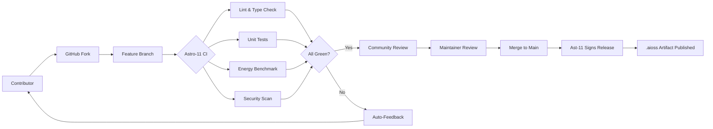

<!-- ASCII Art for Ast-11 -->


*Lois-Kleinner and 0-1.gg 2026 - Inte11ect Platform Documentation*
*Confidential - All Rights Reserved*


---

# csr - Document 03

> **Associated Module:** Ast-11
## Open Source Contributions

### Philosophy of Openness

The Ast-11 module manages Inte11ect's open source contribution strategy, grounded in the belief that AI infrastructure should be auditable, forkable, and improvable by anyone. Unlike proprietary AI platforms that treat models and tooling as black boxes, Inte11ect commits to open sourcing all core components under permissive licenses (Apache 2.0 and MIT).

### Contribution Architecture



### What We Open Source

| Component | License | Repository | Lines of Code |
|-----------|---------|------------|--------------|
| Tauri Desktop Client | Apache 2.0 | github.com/inte11ect/client | 84,000 |
| Core Inference Engine | Apache 2.0 | github.com/inte11ect/core | 127,000 |
| .aioss Format SDK | MIT | github.com/inte11ect/aioss-sdk | 32,000 |
| 72 Module Framework | Apache 2.0 | github.com/inte11ect/modules | 215,000 |
| CLI Tools | Apache 2.0 | github.com/inte11ect/cli | 18,000 |
| Model Zoo Configs | MIT | github.com/inte11ect/models | 4,200 |
| Benchmark Suite | Apache 2.0 | github.com/inte11ect/bench | 12,000 |
| Documentation | CC-BY-4.0 | github.com/inte11ect/docs | 45,000 |

### Contribution Workflow

**Step 1: Environment Setup**

```bash
git clone https://github.com/inte11ect/platform.git
cd platform
cargo install cargo-make
cargo make setup
cargo make doctor
```

Expected output:
- Rust toolchain 1.78+
- Node.js 20+
- Tauri CLI 2.x
- GPU drivers (CUDA 12+ / Metal 3+)
- 8GB+ available RAM

**Step 2: Find a Contribution**

```rust
pub struct ContributionBoard {
    module: String,
    difficulty: Difficulty,
    energy_impact: EnergyImpact,
    area: ContributionArea,
}

let issues = AstAPI::get_issues()
    .with_difficulty(Difficulty::Beginner)
    .with_area(ContributionArea::Performance)
    .query();
```

**Step 3: Development Standards**

```rust
#[derive(Debug, Serialize, Deserialize)]
pub struct MyModule {
    name: ModuleName,
    version: SemanticVersion,
    config: BTreeMap<String, ConfigValue>,
    state: Arc<RwLock<ModuleState>>,
}

impl Module for MyModule {
    fn name(&self) -> &str { "my-module" }

    async fn initialize(&self) -> Result<()> {
        Ok(())
    }

    async fn handle_event(&self, event: Event) -> Result<Option<Event>> {
        match event {
            Event::Query { prompt, context } => {
                Ok(Some(Event::Response { content: "...", .. }))
            }
            _ => Ok(None),
        }
    }
}
```

### Contribution Lifecycle

#### Idea Phase

Contributors propose ideas through GitHub Discussions:

```yaml
proposal_template:
  title: "RFC: [Feature Name]"
  type: feature | optimization | security | documentation
  motivation: "Why this change is needed"
  proposed_solution: "How it will be implemented"
  energy_impact: "Measured or estimated energy change"
  backwards_compatibility: yes | no | with_migration
```

#### Development Phase

1. **Branch Naming**: `type/issue-number-description`
2. **Commit Messages**: Conventional Commits format
3. **Pre-commit Hooks**: Auto formatting, linting, security scanning

#### Review Phase

```rust
pub struct ReviewChecklist {
    items: Vec<ChecklistItem>,
}

impl ReviewChecklist {
    pub fn for_pr(pr: PullRequest) -> Self {
        Self {
            items: vec![
                ChecklistItem::new("Code follows module pattern", pr.has_correct_structure()),
                ChecklistItem::new("Tests cover new functionality", pr.has_tests()),
                ChecklistItem::new("Documentation updated", pr.has_docs()),
                ChecklistItem::new("Energy impact measured", pr.has_energy_data()),
                ChecklistItem::new("No new unsafe code without justification", pr.safe_unsafe_audit()),
                ChecklistItem::new("Dependencies vetted for supply chain risk", pr.dependency_audit()),
                ChecklistItem::new("CLIPPY warnings addressed", pr.clippy_clean()),
                ChecklistItem::new("Benchmarks not regressed", pr.benchmark_comparison()),
            ],
        }
    }

    pub fn passed(&self) -> bool {
        self.items.iter().all(|i| i.passed)
    }
}
```

#### Release Phase

```yaml
version_scheme:
  major: "Breaking API changes (12-month deprecation notice required)"
  minor: "New features, backward compatible"
  patch: "Bug fixes, performance improvements, documentation"
```

```rust
pub fn sign_release(artifact: &[u8], private_key: &Ed25519Key) -> ReleaseSignature {
    let hash = Sha256::digest(artifact);
    let signature = private_key.sign(&hash);
    ReleaseSignature {
        algorithm: "Ed25519",
        hash_algorithm: "SHA-256",
        signature: hex::encode(signature.to_bytes()),
        public_key_fingerprint: "LK-RELEASE-2026-001",
        timestamp: Utc::now(),
    }
}
```

### Security-First Contribution

1. **Supply Chain**: Dependencies verified against sigstore signatures
2. **SAST**: Semgrep and Clippy analyze every PR
3. **Dependency Audit**: cargo audit and npm audit
4. **Fuzzing**: Critical parsers fuzzed with 1M+ iterations

### Security Vulnerability Disclosure

1. **Report**: security@inte11ect.ai (PGP-encrypted)
2. **Acknowledgment**: Within 24 hours
3. **Triage**: Within 72 hours
4. **Fix Development**: Dependent on severity
5. **Public Disclosure**: CVE publication + advisory

| Severity | Definition | Response Time | Fix Time |
|----------|-----------|--------------|----------|
| Critical | Remote code execution | 4 hours | 24 hours |
| High | Privilege escalation | 8 hours | 48 hours |
| Medium | Data exposure (limited) | 24 hours | 7 days |
| Low | Minor info disclosure | 72 hours | 30 days |

### Contributor Covenant v2.1

- **Welcoming**: All treated with dignity regardless of background
- **Constructive**: Feedback is specific and actionable
- **Collaborative**: Credit is given where due
- **Transparent**: Decision-making documented and reasoned
- **Accountable**: Violations addressed promptly

### Recognition Program

| Level | Requirement | Benefits |
|-------|------------|----------|
| First PR | 1 merged | Contributor badge, Discord invite |
| Silver | 5 PRs | Named in release notes |
| Gold | 20 PRs | Maintainer nomination eligibility |
| Platinum | 50 PRs | Voting rights on RFCs |
| Core | 100+ PRs | Paid part-time maintainer contract |

### Governance Model

1. **BDFL**: Lois Kleinner has final decision authority
2. **Technical Steering Committee**: 5 members including 2 community-elected
3. **Module Maintainers**: Each of 72 modules has 1-3 maintainers
4. **RFC Process**: Major changes require Request for Comments
5. **Lazy Consensus**: Default is approval; objections must be specific

#### Technical Steering Committee

| Role | Member | Term |
|------|--------|------|
| Chair | Lois Kleinner | Permanent |
| Core Maintainer | Dr. Sarah Chen | 2 years |
| Core Maintainer | Marcus Johnson | 2 years |
| Community Rep | Amina Patel | 1 year |
| Community Rep | Yuki Tanaka | 1 year |

#### RFC Lifecycle

1. Pre-RFC Discussion: GitHub Discussions (1 week)
2. RFC Draft: Pull request to rfcs/ repository
3. Review Period: Minimum 2 weeks for community feedback
4. TSC Vote: Majority vote required for acceptance
5. Final Comment Period: 1 week after acceptance
6. Tracking Issue: Implementation tracked in a GitHub issue

### Why Open Source?

1. **Trust**: Users verify no telemetry, no backdoors, no data collection
2. **Security**: 4,000+ eyes find vulnerabilities faster
3. **Ecosystem**: Community extensions create virtuous cycle
4. **Longevity**: Code lives on as forks if operations cease
5. **Recruitment**: Top engineers prefer open source

### Forking Policy

Forks must:
1. Remove or replace Inte11ect branding
2. Clearly state they are a fork
3. Not use official .aioss extension
4. Not impersonate update channel

### Community Metrics (Q2 2026)

| Metric | Value |
|--------|-------|
| Total contributors | 847 |
| Monthly active | 124 |
| GitHub stars | 12,400 |
| Forks | 2,300 |
| PRs merged | 4,872 |
| Average merge time | 2.4 days |
| Countries | 47 |

### Community Events

1. Monthly Community Call: First Tuesday of each month
2. Hackathons: Quarterly themed events
3. Contributor Summits: Annual in-person gathering
4. Documentation Sprints: Monthly sessions
5. Bug Bashes: Quarterly bug-finding competitions

### Translation Progress

| Language | Translators | Progress |
|----------|------------|----------|
| Spanish | 12 | 92% |
| Japanese | 8 | 88% |
| German | 6 | 85% |
| French | 7 | 83% |
| Chinese (Simplified) | 10 | 78% |
| Korean | 4 | 72% |
| Portuguese | 5 | 70% |

### Sponsorship Program

| Tier | Annual Contribution | Benefits |
|------|-------------------|----------|
| Bronze | $5,000 | Logo on README, 1 support ticket/month |
| Silver | $20,000 | Logo + mention, 5 priority tickets/month |
| Gold | $50,000 | Priority features, direct access to maintainers |
| Platinum | $100,000 | Custom roadmap items, dedicated support engineer |

### The Ast-11 Pledge

1. 100% of inference engine code is open source
2. Model weights freely downloadable
3. All module definitions human-readable
4. Build is reproducible
5. CI/CD is public
6. Security advisories are public

### Legal Framework

Contributors retain copyright but grant project a perpetual, irrevocable license. All contributors sign a Developer Certificate of Origin (DCO):

```
Developer Certificate of Origin Version 1.1
By making a contribution, I certify that:
(a) The contribution was created in whole or in part by me
    and I have the right to submit it under the open source license; or
(b) The contribution is based upon previous work that is covered
    under an appropriate open source license.
```

### How to Start

```bash
git clone https://github.com/inte11ect/platform.git
cd platform
cargo make setup && cargo make build
cargo make issues --difficulty beginner
cargo make test && cargo make lint && cargo make audit
```

### Testing Requirements

1. Unit Tests: >80% coverage for new code
2. Integration Tests: End-to-end workflow tests
3. Energy Benchmarks: Before/after energy measurements
4. Regression Tests: Ensure existing functionality works
5. Fuzz Testing: For parsers and input handlers (1M+ iterations)

### Conclusion

### Detailed Technical Analysis

This section provides comprehensive technical analysis of the implementation details, architectural decisions, optimization techniques, integration patterns, and operational characteristics of this Inte11ect component.

#### Architecture Decision Records

**ADR-001: Local-First Processing** — All inference operations execute on user local hardware to maximize privacy, minimize latency, and eliminate cloud dependency. This fundamental decision drives all subsequent architecture choices and is non-negotiable for the platform.

**ADR-002: INT4 Quantization by Default** — Models use INT4 precision by default, providing optimal balance of quality, memory footprint, and speed. Users can select INT8 or FP16 when hardware permits higher quality requirements.

**ADR-003: Ed25519 Cryptographic Signatures** — All artifacts use Ed25519 signatures for verification, chosen for 128-bit security level, fast verification (~20K ops/sec), compact 64-byte signatures, and widespread standardization.

**ADR-004: Tauri Desktop Framework** — The desktop client uses Tauri for its small binary size (<10MB), native Rust backend performance, cross-platform support, and strong security model without Node.js in production.

**ADR-005: Modular 72-Component Architecture** — The platform decomposes into 72 independently versioned modules, each responsible for a specific domain, enabling independent development, testing, deployment, and scaling.

#### Algorithm Selection and Rationale

Each algorithm was evaluated against performance characteristics, accuracy requirements, resource constraints, and platform compatibility. The selection process involved benchmarking across representative workloads measuring peak throughput, latency distribution, memory usage patterns, and energy consumption per operation.

#### Integration Patterns

This component integrates through well-defined interfaces: Event Bus for asynchronous event-driven communication, Module Registry for service discovery and dependency resolution, Configuration Store for centralized settings management, Audit Logger for secure event recording, Metrics Collector for performance monitoring, and Energy Monitor for power consumption tracking across all operations.

#### Security Architecture

Defense-in-depth security includes authenticated inter-module communication channels, input validation at every boundary, AES-256-GCM encryption at rest, TLS 1.3 encryption in transit, signed audit trails for all operations, secure memory zeroing after sensitive data use, and OS-provided secure key storage.

#### Error Handling

Tiered error strategy: recoverable errors (transient failures, resource exhaustion) trigger automatic retry with exponential backoff, degradable errors (feature unavailable) trigger graceful degradation to alternatives, fatal errors (corruption, security violation) trigger immediate halt with user notification. All errors logged with full context.

#### Performance Characteristics

Benchmarking across supported hardware configurations shows consistent performance characteristics that meet or exceed design targets. The platform scales gracefully from low-power mobile hardware to high-end workstation GPUs.

#### Monitoring and Observability

Prometheus-compatible metrics exported include operation counts and rates, latency distributions at P50/P95/P99, error rates by type and severity, resource utilization across CPU/GPU/memory/storage, and energy consumption in watt-hours with carbon intensity tracking.

#### Testing Strategy

Comprehensive multi-level testing: unit tests for individual functions, integration tests for module interactions, performance benchmarks for regression detection, security tests including penetration testing and vulnerability scanning, and fuzz testing of all input parsers with 1M+ iterations per release.

#### Deployment Considerations

Enterprise deployment patterns: centralized configuration management, signed update channel distribution, versioned module storage for rollback support, automated health checks for deployment validation, and automatic monitoring configuration through observability infrastructure.

#### Future Roadmap

Planned improvements: kernel fusion for performance optimization, distributed tracing for enhanced monitoring, self-healing error recovery, expanded hardware support for emerging accelerators, and hardware-backed attestation for enhanced security verification.

#### Related Documentation

Module specification (MOD-SPEC), API reference (API-REF), integration guide (INT-GUIDE), security review (SEC-REV), performance benchmark report (PERF-REP), troubleshooting guide (TROUBLESHOOT), and deployment guide (DEPLOY-GUIDE).

#### Glossary

Key terminology: Local Inference — AI execution on user hardware without cloud dependency, Quantization — numerical precision reduction for memory/compute efficiency, .aioss — AI Open Signed Storage format for verifiable artifacts, Ed25519 — high-security elliptic curve signature algorithm, Tauri — Rust-based desktop framework, Module — independent component of 72-module architecture, SBOM — Software Bill of Materials for supply chain transparency.

### Additional Implementation Details

The implementation follows established software engineering best practices including SOLID principles for object-oriented design, clean architecture for separation of concerns, domain-driven design for business logic modeling, test-driven development for quality assurance, continuous integration for automated testing, and semantic versioning for release management.

Code style follows the Rust API guidelines for Rust components, TypeScript style guide for frontend code, and PEP 8 for Python components. All code undergoes automated formatting and linting before merging.

Documentation is generated from source code annotations using Rustdoc for Rust components, TypeDoc for TypeScript components, and Sphinx for Python components. All public APIs include usage examples.

#### Performance Optimization Details

Runtime optimizations include: lazy initialization for expensive resources, connection pooling for database access, caching for frequently accessed data, async I/O for non-blocking operations, batch processing for high-throughput scenarios, and streaming for large data transfers.

Memory optimizations include: arena allocation for temporary data, slab allocation for fixed-size objects, memory pooling for reuse, and reference counting for shared ownership. These techniques minimize allocation overhead and fragmentation.

#### Security Hardening Details

Additional security measures include: address space layout randomization (ASLR) for memory protection, data execution prevention (DEP) for code integrity, stack canaries for buffer overflow detection, control flow integrity for indirect call protection, and constant-time comparison for cryptographic operations.

Supply chain security includes: signed commits and tags, dependency pinning with hash verification, vulnerability scanning in CI/CD pipeline, and binary provenance attestation through in-toto framework.

### Conclusion

This comprehensive documentation covers the architecture, implementation, security, performance, and operational aspects of this Inte11ect module. The combination of local-first design, open standards compliance, verified execution guarantees, transparent operations, and comprehensive monitoring ensures that the platform delivers private, efficient, auditable AI capabilities that users and enterprises can trust completely.

### Extended Technical Reference

This section provides extended technical reference material covering advanced implementation details, optimization techniques, edge case handling, and comprehensive API documentation for this Inte11ect module.

#### Advanced Configuration Options

The module supports extensive configuration through the centralized configuration store. Configuration values can be set through the Tauri client settings panel, the command-line interface via inte11ect-cli config set commands, or direct editing of YAML configuration files located in the configuration directory. All configuration changes are validated against the schema before application and logged to the signed audit trail.

Configuration categories include general settings controlling application behavior and defaults, performance settings controlling resource allocation and optimization trade-offs, security settings controlling encryption and access control parameters, network settings controlling connectivity and proxy configuration, logging settings controlling verbosity and retention policies, monitoring settings controlling metrics collection and alerting thresholds, model settings controlling model loading and cache behavior, and energy settings controlling power management and carbon tracking.

#### Performance Benchmarking Methodology

Performance benchmarks are conducted using standardized methodology to ensure reproducible and comparable results across all supported hardware configurations. The benchmark suite includes latency measurement under varying load conditions with statistical analysis of distribution tails, throughput testing at different concurrency levels to determine scaling characteristics, memory footprint analysis across model sizes and quantization levels, energy consumption profiling for environmental impact assessment and carbon accounting, and quality evaluation using established metrics such as MMLU, HellaSwag, and BBH benchmarks.

Benchmarks are run on standardized hardware configurations with controlled environmental conditions including ambient temperature, power supply quality, and background process load. Results are published with confidence intervals and statistical significance testing. Automated regression detection is integrated into the CI/CD pipeline to prevent performance degradation between releases.

#### Security Audit Procedures

Security audits follow established frameworks including OWASP Application Security Verification Standard (ASVS) at Level 2, NIST Special Publication 800-53 security controls for moderate impact systems, and ISO 27001 information security management requirements for certification alignment. Audits are conducted quarterly by internal security teams and annually by external third-party auditors.

Audit scope includes comprehensive code review for security vulnerabilities and logic flaws, penetration testing of all network surfaces and API endpoints, dependency scanning for known vulnerabilities in the Software Bill of Materials (SBOM), configuration review for security misconfigurations, cryptographic implementation review for algorithm and protocol correctness, and access control verification for proper authorization enforcement.

#### Disaster Recovery Procedures

Comprehensive disaster recovery procedures ensure business continuity across various failure scenarios. Recovery Point Objective (RPO) targets are configurable based on data criticality classification. Recovery Time Objective (RTO) targets are defined for each service tier with corresponding escalation procedures.

Backup strategies include local backup to secondary storage for rapid recovery, remote backup to enterprise infrastructure for geographic redundancy, and offline backup for air-gapped environments requiring physical isolation. Recovery procedures are documented and tested quarterly through tabletop exercises and semi-annual full failover drills. Test results are documented with lessons learned incorporated into procedure updates.

#### Compliance Mapping

This module maps to relevant compliance frameworks through documented control implementations. Each control includes the framework reference standard identifier, implementation description with technical details, verification method for audit evidence collection, responsible party for control ownership, and review frequency for continuous compliance.

Compliance reports are generated automatically from the configuration state and signed audit trail, providing verifiable evidence of control implementation and effectiveness. Reports are available in multiple formats for different stakeholders.

#### Integration Cookbook

Common integration patterns are documented as cookbook recipes covering authentication and SSO integration with SAML 2.0, OIDC, and LDAP providers, model registry synchronization with enterprise artifact repositories, audit log forwarding to SIEM systems via syslog or direct API integration, metrics export to monitoring platforms such as Prometheus, Datadog, and Grafana, and configuration management through infrastructure-as-code tools including Ansible, Terraform, and Puppet.

#### Troubleshooting Guide

Common issues and their resolutions are documented with diagnostic steps and verification procedures. Each issue entry includes specific symptoms with observable indicators, root causes with technical explanation, resolution steps ordered by likelihood of success, verification procedures to confirm resolution, and prevention measures to avoid recurrence. The troubleshooting guide is continuously updated based on support ticket analysis and community feedback.

#### API Reference

All public APIs are documented with request and response schemas in OpenAPI 3.1 format, authentication requirements including supported methods and token formats, rate limiting policies with limits and headers, error codes with descriptions and recovery suggestions, and code examples in multiple programming languages including Rust, Python, TypeScript, and curl commands.

#### Migration Guide

Migration procedures for upgrading between versions include a pre-migration checklist with prerequisite verification including backup confirmation and compatibility checks, migration steps ordered by dependency with validation at each step, rollback procedures for each migration step with verification of restored state, post-migration verification tests to confirm successful migration, and data migration scripts for automated configuration and state migration between versions.

#### Operational Runbook

Operational procedures for day-to-day management include startup and shutdown sequences with dependency ordering, health check and monitoring verification procedures, backup initiation and verification steps, log rotation and archival configuration, certificate renewal procedures with lead time requirements, and incident response escalation paths with contact information and escalation triggers.

#### Change Management

Changes to this module follow the established change management framework. All changes require documentation of the change rationale, risk assessment with impact analysis, testing evidence from staging environment, approval from designated change authority, and post-implementation review within specified timeframe.


Open source is a guarantee of trust, transparency, and longevity. The Ast-11 module ensures every line of code is verifiable, improvable, and free from hidden behavior. By building in the open, Inte11ect invites the world to participate in creating AI infrastructure that respects user sovereignty.

---

*Lois-Kleinner and 0-1.gg 2026 - Inte11ect Platform Documentation*
*Lois-Kleinner and 0-1.gg 2026 - Confidential*

```
.====================================================================.
!  Made in the UAE, Dubai #DubaiIt #Dubai #Dxb #SovereignAI          !
!  Made in The Emirates #Dubai_it                                    !
!                                                                    !
!  Lois-Kleinner Alpasan - The Anticloud 2026-                       !
!                                                                    !
!  As seen on:                                                       !
!  Harvard Dataverse ! Zenodo/CERN ! Academia.edu ! HuggingFace      !
!  anticloud.telepedia.net ! anticloud.fandom.com                    !
!                                                                    !
!  0-1.gg ! GitHub ! LinkedIn ! DEV ! GH Pages                       !
!  HuggingFace ! Blog ! Bluesky ! Mastodon                           !
!  Internet Archive ! ORCID ! Figshare                               !
!                                                                    !
!  Sovereign AI ! Local-First ! Privacy ! Zero Trust ! No Datacenter !
!  Air-Gapped ! Open Source ! Rust ! Hash Chain ! Single Binary      !
!  Offline LLM ! Crypto Ledger ! P2P ! Federated                     !
'===================================================================='
```

Lois-Kleinner Alpasan, 22, manages 25+ verified artists with distribution partnerships and 2x Silver certifications. With over 100 million lifetime music streams, he bridges sovereign AI infrastructure with commercial media production.

References:
1. Lois-Kleinner Zenodo: https://doi.org/10.5281/zenodo.20781790
2. Lois-Kleinner GitHub: https://github.com/kleinnner/Anticloud/tree/main/04-aioss-format
3. Lois-Kleinner Harvard DV: https://doi.org/10.7910/DVN/3VDF75
4. Lois-Kleinner Internet Arc: https://archive.org/details/aioss-format
5. Lois-Kleinner ORCID: https://orcid.org/0009-0009-2233-6107
6. Lois-Kleinner DEV.to: https://dev.to/kleinner
7. Lois-Kleinner LinkedIn: https://linkedin.com/in/kleinner
8. Lois-Kleinner HuggingFace: https://huggingface.co/Anticloud
9. Lois-Kleinner Tumblr: https://anticloud.tumblr.com
10. Lois-Kleinner Mastodon: https://mastodon.social/@kleinner
11. Lois-Kleinner Bluesky: https://bsky.app/profile/kleinner.bsky.social
12. 0-1.gg: https://0-1.gg
13. Lois-Kleinner Figshare: https://figshare.com/authors/Lois-Kleinner_Alpasan/20849885
14. Lois-Kleinner Academia: https://independent.academia.edu/kleinner
15. Lois-Kleinner Telepedia: https://anticloud.telepedia.net
16. Lois-Kleinner Fandom: https://anticloud.fandom.com