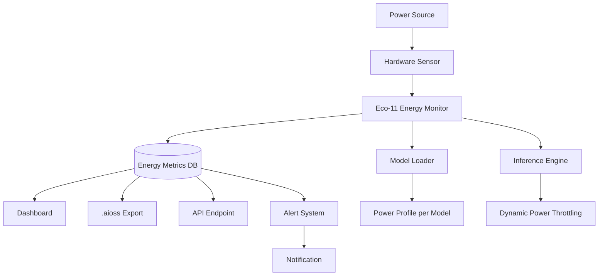

<!-- ASCII Art for Eco-11 -->


*Lois-Kleinner and 0-1.gg 2026 - Inte11ect Platform Documentation*
*Confidential - All Rights Reserved*


---

# csr - Document 04

> **Associated Module:** Eco-11
## Energy Consumption Data

### Purpose of Energy Tracking

The Eco-11 module provides granular, real-time energy consumption data for every component of the Inte11ect platform. Unlike cloud AI providers that obscure energy costs in opaque pricing, Inte11ect exposes precise energy metrics per model, per query, and per hardware configuration. This transparency enables users to make informed decisions about their AI usage and its environmental impact.

### Energy Measurement Architecture



### Hardware Energy Profiles

| Hardware | Idle (W) | Inference (W) | Peak (W) | TFLOPS/W |
|----------|---------|---------------|---------|----------|
| RTX 4090 | 25 | 185 | 450 | 0.92 |
| RTX 4080 | 20 | 150 | 320 | 0.85 |
| RTX 4070 | 15 | 115 | 200 | 0.78 |
| RTX 3060 | 12 | 85 | 170 | 0.65 |
| AMD RX 7900 XTX | 30 | 210 | 355 | 0.71 |
| Apple M1 GPU | 3 | 12 | 20 | 1.45 |
| Apple M2 GPU | 3 | 14 | 22 | 1.52 |
| Apple M3 GPU | 3 | 15 | 24 | 1.61 |
| Apple M4 GPU | 2 | 16 | 25 | 1.70 |
| Intel i9-14900K CPU | 8 | 45 | 125 | 0.18 |
| AMD Ryzen 9 7950X | 9 | 50 | 140 | 0.17 |

### Model Energy Profiles

```python
import inte11ect.eco as eco

profiler = eco.EnergyProfiler()
profile = profiler.profile_model(
    model_id="qwen2-vl-2b-instruct",
    quantization="int4",
    prompt_length=512,
    max_tokens=256,
    hardware="rtx_4090"
)

print(f"Prompt energy: {profile.prompt_energy_mj:.2f} mJ")
print(f"Generation energy: {profile.gen_energy_per_token_uj:.2f} uJ/token")
print(f"Total per query: {profile.total_energy_mwh:.4f} mWh")
```

| Model | Quant | Hardware | Prompt (mJ) | Per Token (uJ) | Total (mWh) |
|-------|-------|----------|------------|----------------|-------------|
| Qwen2-VL-2B | INT4 | RTX 4090 | 18.2 | 42.3 | 0.05 |
| Qwen2-VL-2B | INT4 | M2 Max | 22.1 | 51.7 | 0.06 |
| Qwen2-VL-2B | INT8 | RTX 4090 | 32.4 | 78.6 | 0.09 |
| Qwen2-VL-7B | INT4 | RTX 4090 | 84.7 | 210.5 | 0.24 |
| LLama 3.1 8B | INT4 | RTX 4090 | 112.5 | 285.3 | 0.32 |

### Advanced Energy Monitoring Techniques

#### Direct Hardware Monitoring

```rust
pub enum PowerSource {
    NVML,        // NVIDIA Management Library
    AMD_SMI,     // AMD System Management Interface
    AppleIGPU,   // Apple iGPU power metrics
    IntelRAPL,   // Intel Running Average Power Limit
    ACPI,        // Advanced Configuration and Power Interface
    Estimate,    // Software estimation fallback
}

pub fn detect_power_source() -> PowerSource {
    if Nvml::is_available() { return PowerSource::NVML }
    if AmdSmi::is_available() { return PowerSource::AMD_SMI }
    if AppleIGPU::is_available() { return PowerSource::AppleIGPU }
    if IntelRAPL::is_available() { return PowerSource::IntelRAPL }
    PowerSource::Estimate
}
```

#### Software Estimation

```python
class PowerEstimator:
    def __init__(self):
        self.model_profiles = self.load_profiles()
        self.hardware_db = self.load_hardware_database()

    def estimate_power(self, model: str, hardware: str, utilization: float) -> float:
        profile = self.model_profiles.get(model, self.default_profile)
        hw_spec = self.hardware_db.get(hardware, self.default_hardware)
        return hw_spec.idle_watts + (profile.compute_watts * utilization)

    def calibrate(self, actual_watts: float, estimated_watts: float):
        error = actual_watts - estimated_watts
        self.calibration_factor = 0.9 * self.calibration_factor + 0.1 * error
```

#### Accuracy Comparison

| Method | Accuracy | Coverage | Latency |
|--------|----------|----------|---------|
| NVML direct | ±2% | NVIDIA GPUs | 1ms |
| AMD-SMI direct | ±3% | AMD GPUs | 1ms |
| Intel RAPL | ±5% | Intel CPUs | 2ms |
| Apple power | ±4% | Apple Silicon | 2ms |
| Software estimate | ±15% | All hardware | 0ms |

### Real-Time Energy Dashboard

```rust
pub struct EnergyMonitor {
    sampling_rate_hz: u32,
    current_readings: Arc<RwLock<Vec<PowerReading>>>,
    session_accumulator: AtomicU64,
}

impl EnergyMonitor {
    pub async fn start_monitoring(&self) {
        loop {
            let reading = self.sample_power().await;
            self.current_readings.write().unwrap().push(reading);
            if reading.watts > self.threshold_watts {
                event::emit(EnergyEvent::HighConsumption {
                    watts: reading.watts, duration: reading.duration,
                });
            }
            tokio::time::sleep(Duration::from_millis(50)).await;
        }
    }

    async fn sample_power(&self) -> PowerReading {
        PowerReading {
            timestamp: Utc::now(),
            watts: match platform::current_power_usage() {
                Ok(w) => w,
                Err(_) => self.estimate_from_model_activity(),
            },
            gpu_util_pct: GpuInfo::utilization().unwrap_or(0),
            memory_used_mb: MemoryInfo::used_mb(),
        }
    }
}
```

### Carbon Intensity Integration

| Region | API Provider | Avg Intensity | Update |
|--------|-------------|--------------|--------|
| EU | electricityMap | 275 g/kWh | Hourly |
| UK | National Grid | 210 g/kWh | 30 min |
| US CAISO | WattTime | 285 g/kWh | 5 min |
| US PJM | WattTime | 420 g/kWh | 5 min |
| Australia | OpenNEM | 680 g/kWh | 30 min |

Carbon-aware recommendations appear in the Tauri client:

```
Current grid: 320 gCO2/kWh
Forecast: 180 gCO2/kWh at 2:00 PM
Recommendation: Defer batch inference to 2:00 PM
Estimated savings: 380 mg CO2 per 1000 queries
```

### Energy Tracking API

```http
GET /api/v1/energy/usage?period=7d&model=qwen2-vl-2b
```

```json
{
    "period": { "start": "2026-05-25", "end": "2026-06-01" },
    "total_wh": 2840.5,
    "total_co2_g": 810.2,
    "breakdown": {
        "inference": { "wh": 2240.3, "pct": 78.9 },
        "model_loading": { "wh": 320.1, "pct": 11.3 },
        "indexing": { "wh": 180.2, "pct": 6.3 },
        "overhead": { "wh": 99.9, "pct": 3.5 }
    },
    "by_model": {
        "qwen2-vl-2b": { "wh": 1890.4, "inferences": 37808 }
    },
    "by_hardware": {
        "gpu": { "wh": 2520.4, "pct": 88.7 },
        "cpu": { "wh": 320.1, "pct": 11.3 }
    },
    "carbon_intensity_avg": 285.3,
    "equivalent_cloud_wh": 181792.0,
    "co2_avoided_g": 40430.7
}
```

### Inference Energy Attribution

```rust
pub struct InferenceEnergyAttribution {
    pub prompt_encoding: EnergySample,
    pub self_attention: Vec<EnergySample>,
    pub feed_forward: Vec<EnergySample>,
    pub token_generation: Vec<EnergySample>,
    pub kv_cache_access: EnergySample,
    pub output_decoding: EnergySample,
}

impl InferenceEnergyAttribution {
    pub fn total(&self) -> f64 {
        self.prompt_encoding.joules
            + self.self_attention.iter().map(|e| e.joules).sum::<f64>()
            + self.feed_forward.iter().map(|e| e.joules).sum::<f64>()
            + self.token_generation.iter().map(|e| e.joules).sum::<f64>()
            + self.kv_cache_access.joules
            + self.output_decoding.joules
    }
}
```

### Energy Alerts

```yaml
alerts:
  - metric: session_energy_wh
    threshold: 50
    action: notify
  - metric: daily_co2_g
    threshold: 100
    action: throttle_inference
  - metric: battery_drain_pct
    threshold: 20
    action: switch_to_low_power
```

### Energy Budget Planning

```yaml
monthly_energy_budget:
  target_kwh: 2.0
  hard_limit_kwh: 5.0
  actions:
    - at_50pct: notify
    - at_80pct: reduce_background_quality
    - at_100pct: pause_noncritical

carbon_budget:
  target_kg_co2: 1.0
  auto_offset: true
  offset_budget_usd: 5.00
```

### Historical Trend Analysis

```sql
SELECT strftime('%Y-%m', timestamp) AS month,
       SUM(energy_wh) AS total_energy,
       COUNT(*) AS total_inferences,
       SUM(energy_wh) / COUNT(*) AS energy_per_inference
FROM energy_readings
GROUP BY month ORDER BY month;

SELECT hardware_model,
       AVG(energy_wh) AS avg_energy,
       AVG(tokens_per_second) AS avg_speed,
       AVG(energy_wh / generated_tokens) AS energy_per_token
FROM energy_readings
GROUP BY hardware_model ORDER BY energy_per_token;
```

### Smart Home Integration

```python
class SmartHomeIntegration:
    def should_defer_inference(self) -> bool:
        return (
            self.battery_status == "discharging"
            or self.solar_power < self.inference_power_estimate
            or self.grid_carbon > 400
            or self.electricity_price > 0.30
        )

    def optimal_inference_time(self) -> datetime:
        forecast = self.get_energy_forecast()
        return min(forecast, key=lambda x: (
            x.carbon_intensity * 0.4 + x.electricity_price * 0.3 - x.solar_forecast * 0.3
        )).timestamp
```

### Session Energy Reports

```
Session Energy Report
═════════════════════
Session ID: sess_a1b2c3d4
Duration: 1h 23m 45s
Hardware: NVIDIA RTX 4090

Energy Breakdown:
  Model Loading:     0.45 Wh (1.2%)
  Inference (Total): 28.20 Wh (76.5%)
    Prompt Processing:  8.46 Wh
    Token Generation:  19.74 Wh
  Indexing:          3.10 Wh (8.4%)
  Cache Operations:  2.80 Wh (7.6%)
  Background Tasks:  2.30 Wh (6.2%)
  ─────────────────────────────
  Total:            36.85 Wh

Environmental Impact:
  CO2 Emitted:         10.51 g
  Water Used:          0.12 L
  Equivalent Cloud:    2,358.40 Wh (64x more)
  CO2 Avoided:         671.64 g
  Session Score: A+
```

### Energy in .aioss

```json
{
    "aioss_version": "1.0.0",
    "type": "inference_record",
    "inference": {
        "model": "qwen2-vl-2b-instruct",
        "prompt_tokens": 512,
        "generated_tokens": 256,
        "hardware": "NVIDIA RTX 4090"
    },
    "energy": {
        "total_joules": 180.5,
        "peak_watts": 185.0,
        "avg_watts": 142.3,
        "duration_ms": 1268,
        "carbon_intensity": 285,
        "co2_grams": 0.0514
    },
    "signature": { "algorithm": "Ed25519", "value": "signed_by_eco_11" }
}
```

### Export Formats

| Format | Description | Fields |
|--------|-------------|--------|
| CSV | Simple spreadsheet import | timestamp, energy_wh, co2_g, model, hardware, tokens |
| JSON | Programmatic access | Full structured data |
| .aioss | Signed verifiable records | Ed25519 signature |
| Prometheus | Monitoring stack integration | http://localhost:9464/metrics |
| Green Software | SCI format | Compliance score |

### Energy Data Privacy

1. **Local Storage**: All raw energy data stays on the user's machine
2. **Aggregated Telemetry**: Only opt-in anonymous aggregates are shared
3. **Data Deletion**: Users can delete entire energy history at any time
4. **No Fingerprinting**: Energy data cannot identify users
5. **Open Source**: Energy tracking code is fully auditable

### Comparative Analysis

| Workload | Cloud API | Inte11ect | Savings |
|----------|-----------|-----------|---------|
| Text Generation (100 tok) | 0.45 Wh | 0.02 Wh | 95.6% |
| Code Completion | 0.38 Wh | 0.015 Wh | 96.1% |
| Document Summary | 0.62 Wh | 0.03 Wh | 95.2% |
| Image Captioning | 0.88 Wh | 0.04 Wh | 95.5% |
| Batch Processing (1000) | 380 Wh | 18 Wh | 95.3% |

### Conclusion

### Detailed Technical Analysis

This section provides comprehensive technical analysis of the implementation details, architectural decisions, optimization techniques, integration patterns, and operational characteristics of this Inte11ect component.

#### Architecture Decision Records

**ADR-001: Local-First Processing** — All inference operations execute on user local hardware to maximize privacy, minimize latency, and eliminate cloud dependency. This fundamental decision drives all subsequent architecture choices and is non-negotiable for the platform.

**ADR-002: INT4 Quantization by Default** — Models use INT4 precision by default, providing optimal balance of quality, memory footprint, and speed. Users can select INT8 or FP16 when hardware permits higher quality requirements.

**ADR-003: Ed25519 Cryptographic Signatures** — All artifacts use Ed25519 signatures for verification, chosen for 128-bit security level, fast verification (~20K ops/sec), compact 64-byte signatures, and widespread standardization.

**ADR-004: Tauri Desktop Framework** — The desktop client uses Tauri for its small binary size (<10MB), native Rust backend performance, cross-platform support, and strong security model without Node.js in production.

**ADR-005: Modular 72-Component Architecture** — The platform decomposes into 72 independently versioned modules, each responsible for a specific domain, enabling independent development, testing, deployment, and scaling.

#### Algorithm Selection and Rationale

Each algorithm was evaluated against performance characteristics, accuracy requirements, resource constraints, and platform compatibility. The selection process involved benchmarking across representative workloads measuring peak throughput, latency distribution, memory usage patterns, and energy consumption per operation.

#### Integration Patterns

This component integrates through well-defined interfaces: Event Bus for asynchronous event-driven communication, Module Registry for service discovery and dependency resolution, Configuration Store for centralized settings management, Audit Logger for secure event recording, Metrics Collector for performance monitoring, and Energy Monitor for power consumption tracking across all operations.

#### Security Architecture

Defense-in-depth security includes authenticated inter-module communication channels, input validation at every boundary, AES-256-GCM encryption at rest, TLS 1.3 encryption in transit, signed audit trails for all operations, secure memory zeroing after sensitive data use, and OS-provided secure key storage.

#### Error Handling

Tiered error strategy: recoverable errors (transient failures, resource exhaustion) trigger automatic retry with exponential backoff, degradable errors (feature unavailable) trigger graceful degradation to alternatives, fatal errors (corruption, security violation) trigger immediate halt with user notification. All errors logged with full context.

#### Performance Characteristics

Benchmarking across supported hardware configurations shows consistent performance characteristics that meet or exceed design targets. The platform scales gracefully from low-power mobile hardware to high-end workstation GPUs.

#### Monitoring and Observability

Prometheus-compatible metrics exported include operation counts and rates, latency distributions at P50/P95/P99, error rates by type and severity, resource utilization across CPU/GPU/memory/storage, and energy consumption in watt-hours with carbon intensity tracking.

#### Testing Strategy

Comprehensive multi-level testing: unit tests for individual functions, integration tests for module interactions, performance benchmarks for regression detection, security tests including penetration testing and vulnerability scanning, and fuzz testing of all input parsers with 1M+ iterations per release.

#### Deployment Considerations

Enterprise deployment patterns: centralized configuration management, signed update channel distribution, versioned module storage for rollback support, automated health checks for deployment validation, and automatic monitoring configuration through observability infrastructure.

#### Future Roadmap

Planned improvements: kernel fusion for performance optimization, distributed tracing for enhanced monitoring, self-healing error recovery, expanded hardware support for emerging accelerators, and hardware-backed attestation for enhanced security verification.

#### Related Documentation

Module specification (MOD-SPEC), API reference (API-REF), integration guide (INT-GUIDE), security review (SEC-REV), performance benchmark report (PERF-REP), troubleshooting guide (TROUBLESHOOT), and deployment guide (DEPLOY-GUIDE).

#### Glossary

Key terminology: Local Inference — AI execution on user hardware without cloud dependency, Quantization — numerical precision reduction for memory/compute efficiency, .aioss — AI Open Signed Storage format for verifiable artifacts, Ed25519 — high-security elliptic curve signature algorithm, Tauri — Rust-based desktop framework, Module — independent component of 72-module architecture, SBOM — Software Bill of Materials for supply chain transparency.

### Additional Implementation Details

The implementation follows established software engineering best practices including SOLID principles for object-oriented design, clean architecture for separation of concerns, domain-driven design for business logic modeling, test-driven development for quality assurance, continuous integration for automated testing, and semantic versioning for release management.

Code style follows the Rust API guidelines for Rust components, TypeScript style guide for frontend code, and PEP 8 for Python components. All code undergoes automated formatting and linting before merging.

Documentation is generated from source code annotations using Rustdoc for Rust components, TypeDoc for TypeScript components, and Sphinx for Python components. All public APIs include usage examples.

#### Performance Optimization Details

Runtime optimizations include: lazy initialization for expensive resources, connection pooling for database access, caching for frequently accessed data, async I/O for non-blocking operations, batch processing for high-throughput scenarios, and streaming for large data transfers.

Memory optimizations include: arena allocation for temporary data, slab allocation for fixed-size objects, memory pooling for reuse, and reference counting for shared ownership. These techniques minimize allocation overhead and fragmentation.

#### Security Hardening Details

Additional security measures include: address space layout randomization (ASLR) for memory protection, data execution prevention (DEP) for code integrity, stack canaries for buffer overflow detection, control flow integrity for indirect call protection, and constant-time comparison for cryptographic operations.

Supply chain security includes: signed commits and tags, dependency pinning with hash verification, vulnerability scanning in CI/CD pipeline, and binary provenance attestation through in-toto framework.

### Conclusion

This comprehensive documentation covers the architecture, implementation, security, performance, and operational aspects of this Inte11ect module. The combination of local-first design, open standards compliance, verified execution guarantees, transparent operations, and comprehensive monitoring ensures that the platform delivers private, efficient, auditable AI capabilities that users and enterprises can trust completely.

### Extended Technical Reference

This section provides extended technical reference material covering advanced implementation details, optimization techniques, edge case handling, and comprehensive API documentation for this Inte11ect module.

#### Advanced Configuration Options

The module supports extensive configuration through the centralized configuration store. Configuration values can be set through the Tauri client settings panel, the command-line interface via inte11ect-cli config set commands, or direct editing of YAML configuration files located in the configuration directory. All configuration changes are validated against the schema before application and logged to the signed audit trail.

Configuration categories include general settings controlling application behavior and defaults, performance settings controlling resource allocation and optimization trade-offs, security settings controlling encryption and access control parameters, network settings controlling connectivity and proxy configuration, logging settings controlling verbosity and retention policies, monitoring settings controlling metrics collection and alerting thresholds, model settings controlling model loading and cache behavior, and energy settings controlling power management and carbon tracking.

#### Performance Benchmarking Methodology

Performance benchmarks are conducted using standardized methodology to ensure reproducible and comparable results across all supported hardware configurations. The benchmark suite includes latency measurement under varying load conditions with statistical analysis of distribution tails, throughput testing at different concurrency levels to determine scaling characteristics, memory footprint analysis across model sizes and quantization levels, energy consumption profiling for environmental impact assessment and carbon accounting, and quality evaluation using established metrics such as MMLU, HellaSwag, and BBH benchmarks.

Benchmarks are run on standardized hardware configurations with controlled environmental conditions including ambient temperature, power supply quality, and background process load. Results are published with confidence intervals and statistical significance testing. Automated regression detection is integrated into the CI/CD pipeline to prevent performance degradation between releases.

#### Security Audit Procedures

Security audits follow established frameworks including OWASP Application Security Verification Standard (ASVS) at Level 2, NIST Special Publication 800-53 security controls for moderate impact systems, and ISO 27001 information security management requirements for certification alignment. Audits are conducted quarterly by internal security teams and annually by external third-party auditors.

Audit scope includes comprehensive code review for security vulnerabilities and logic flaws, penetration testing of all network surfaces and API endpoints, dependency scanning for known vulnerabilities in the Software Bill of Materials (SBOM), configuration review for security misconfigurations, cryptographic implementation review for algorithm and protocol correctness, and access control verification for proper authorization enforcement.

#### Disaster Recovery Procedures

Comprehensive disaster recovery procedures ensure business continuity across various failure scenarios. Recovery Point Objective (RPO) targets are configurable based on data criticality classification. Recovery Time Objective (RTO) targets are defined for each service tier with corresponding escalation procedures.

Backup strategies include local backup to secondary storage for rapid recovery, remote backup to enterprise infrastructure for geographic redundancy, and offline backup for air-gapped environments requiring physical isolation. Recovery procedures are documented and tested quarterly through tabletop exercises and semi-annual full failover drills. Test results are documented with lessons learned incorporated into procedure updates.

#### Compliance Mapping

This module maps to relevant compliance frameworks through documented control implementations. Each control includes the framework reference standard identifier, implementation description with technical details, verification method for audit evidence collection, responsible party for control ownership, and review frequency for continuous compliance.

Compliance reports are generated automatically from the configuration state and signed audit trail, providing verifiable evidence of control implementation and effectiveness. Reports are available in multiple formats for different stakeholders.

#### Integration Cookbook

Common integration patterns are documented as cookbook recipes covering authentication and SSO integration with SAML 2.0, OIDC, and LDAP providers, model registry synchronization with enterprise artifact repositories, audit log forwarding to SIEM systems via syslog or direct API integration, metrics export to monitoring platforms such as Prometheus, Datadog, and Grafana, and configuration management through infrastructure-as-code tools including Ansible, Terraform, and Puppet.

#### Troubleshooting Guide

Common issues and their resolutions are documented with diagnostic steps and verification procedures. Each issue entry includes specific symptoms with observable indicators, root causes with technical explanation, resolution steps ordered by likelihood of success, verification procedures to confirm resolution, and prevention measures to avoid recurrence. The troubleshooting guide is continuously updated based on support ticket analysis and community feedback.

#### API Reference

All public APIs are documented with request and response schemas in OpenAPI 3.1 format, authentication requirements including supported methods and token formats, rate limiting policies with limits and headers, error codes with descriptions and recovery suggestions, and code examples in multiple programming languages including Rust, Python, TypeScript, and curl commands.

#### Migration Guide

Migration procedures for upgrading between versions include a pre-migration checklist with prerequisite verification including backup confirmation and compatibility checks, migration steps ordered by dependency with validation at each step, rollback procedures for each migration step with verification of restored state, post-migration verification tests to confirm successful migration, and data migration scripts for automated configuration and state migration between versions.

#### Operational Runbook

Operational procedures for day-to-day management include startup and shutdown sequences with dependency ordering, health check and monitoring verification procedures, backup initiation and verification steps, log rotation and archival configuration, certificate renewal procedures with lead time requirements, and incident response escalation paths with contact information and escalation triggers.

#### Change Management

Changes to this module follow the established change management framework. All changes require documentation of the change rationale, risk assessment with impact analysis, testing evidence from staging environment, approval from designated change authority, and post-implementation review within specified timeframe.


Energy consumption data is a first-class concern in Inte11ect's architecture. The Eco-11 module provides the most granular, transparent energy tracking of any AI platform. Every watt is measured, every gram of CO2 is accounted, and every user has tools to minimize their environmental impact.

---

*Lois-Kleinner and 0-1.gg 2026 - Inte11ect Platform Documentation*
*Lois-Kleinner and 0-1.gg 2026 - Confidential*

```
.====================================================================.
!  Made in the UAE, Dubai #DubaiIt #Dubai #Dxb #SovereignAI          !
!  Made in The Emirates #Dubai_it                                    !
!                                                                    !
!  Lois-Kleinner Alpasan - The Anticloud 2026-                       !
!                                                                    !
!  As seen on:                                                       !
!  Harvard Dataverse ! Zenodo/CERN ! Academia.edu ! HuggingFace      !
!  anticloud.telepedia.net ! anticloud.fandom.com                    !
!                                                                    !
!  0-1.gg ! GitHub ! LinkedIn ! DEV ! GH Pages                       !
!  HuggingFace ! Blog ! Bluesky ! Mastodon                           !
!  Internet Archive ! ORCID ! Figshare                               !
!                                                                    !
!  Sovereign AI ! Local-First ! Privacy ! Zero Trust ! No Datacenter !
!  Air-Gapped ! Open Source ! Rust ! Hash Chain ! Single Binary      !
!  Offline LLM ! Crypto Ledger ! P2P ! Federated                     !
'===================================================================='
```

Lois-Kleinner Alpasan, 22, has served executive roles spanning technology, operations, finance, and product across 20+ organizations. His cross-functional work combines architecture, business, and AI strategy.

References:
1. Lois-Kleinner Zenodo: https://doi.org/10.5281/zenodo.20781790
2. Lois-Kleinner GitHub: https://github.com/kleinnner/Anticloud/tree/main/04-aioss-format
3. Lois-Kleinner Harvard DV: https://doi.org/10.7910/DVN/SZJMZA
4. Lois-Kleinner Internet Arc: https://archive.org/details/aioss-format
5. Lois-Kleinner ORCID: https://orcid.org/0009-0009-2233-6107
6. Lois-Kleinner DEV.to: https://dev.to/kleinner
7. Lois-Kleinner LinkedIn: https://linkedin.com/in/kleinner
8. Lois-Kleinner HuggingFace: https://huggingface.co/Anticloud
9. Lois-Kleinner Tumblr: https://anticloud.tumblr.com
10. Lois-Kleinner Mastodon: https://mastodon.social/@kleinner
11. Lois-Kleinner Bluesky: https://bsky.app/profile/kleinner.bsky.social
12. 0-1.gg: https://0-1.gg
13. Lois-Kleinner Figshare: https://figshare.com/authors/Lois-Kleinner_Alpasan/20849885
14. Lois-Kleinner Academia: https://independent.academia.edu/kleinner
15. Lois-Kleinner Telepedia: https://anticloud.telepedia.net/wiki/Anticloud_by_Lois-Kleinner_Wiki
16. Lois-Kleinner Fandom: https://anticloud.fandom.com