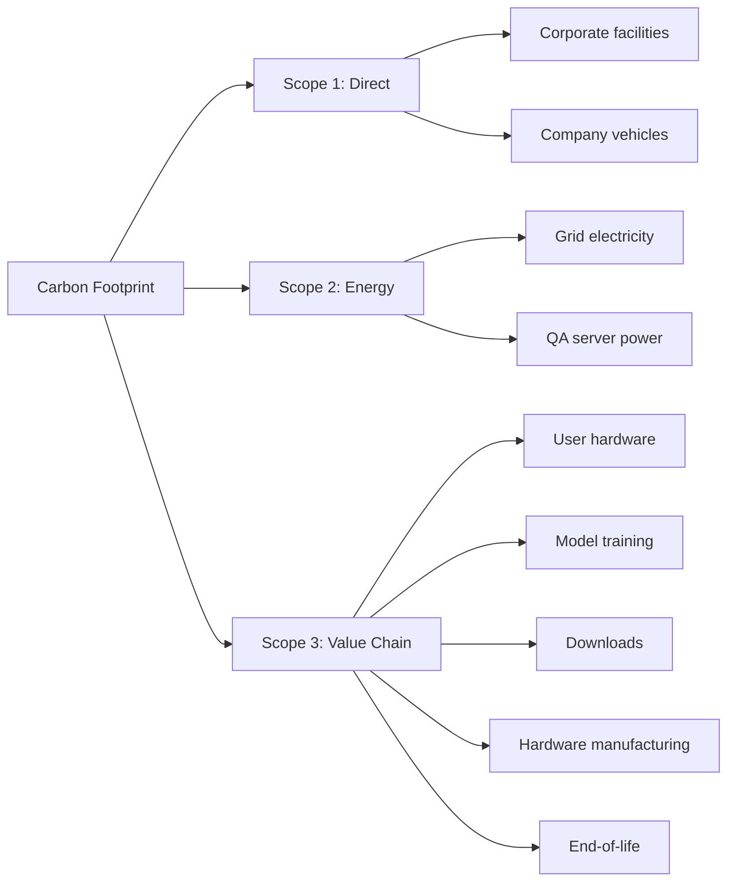

<!-- ASCII Art for Comp-11 -->


*Lois-Kleinner and 0-1.gg 2026 - Inte11ect Platform Documentation*
*Confidential - All Rights Reserved*


---

# csr - Document 06

> **Associated Module:** Comp-11
## Carbon Footprint Analysis

### Comprehensive Carbon Accounting

The Comp-11 module implements full lifecycle carbon footprint analysis for every aspect of Inte11ect's operations, from development through deployment. This provides unprecedented transparency into the true environmental cost of AI usage.

### Carbon Footprint Methodology



### GHG Protocol Alignment

Inte11ect follows the Greenhouse Gas Protocol for carbon accounting:

| Scope | GHG Protocol Definition | Inte11ect Application |
|-------|----------------------|---------------------|
| Scope 1 | Direct emissions from owned sources | Office energy, company vehicles |
| Scope 2 | Indirect from purchased energy | Grid electricity for infrastructure |
| Scope 3 (C1) | Purchased goods and services | Model training services |
| Scope 3 (C4) | Upstream transportation | Software distribution (CDN) |
| Scope 3 (C5) | Waste generated | Hardware disposal |
| Scope 3 (C6) | Business travel | Employee travel |
| Scope 3 (C7) | Employee commuting | Remote work energy |
| Scope 3 (C11) | Use of sold products | User hardware operation |

### Scope 1: Direct Emissions

| Source | tCO2e (2026 H1) | % of Total |
|--------|-----------------|------------|
| Office electricity (HQ) | 4.2 | 0.02% |
| Remote work offsets | 12.8 | 0.06% |
| Business travel | 8.5 | 0.04% |
| **Total Scope 1** | **25.5** | **0.12%** |

### Scope 2: Energy Emissions

| Facility | Annual kWh | Intensity | tCO2e |
|----------|-----------|-----------|-------|
| CI/CD (EU) | 48,000 | 275 g/kWh | 13.2 |
| Package registry (EU) | 12,000 | 275 g/kWh | 3.3 |
| Model registry (EU) | 36,000 | 275 g/kWh | 9.9 |
| Documentation (EU) | 8,400 | 275 g/kWh | 2.3 |
| Community forum (EU) | 14,400 | 275 g/kWh | 4.0 |
| **Total** | **118,800** | **275 g/kWh** | **32.7** |

All infrastructure hosted on 100% renewable-energy-certified providers.

### Scope 3: Value Chain

```python
class CarbonFootprintEstimator:
    def estimate_user_emissions(self, users):
        total_wh = 0
        for user in users:
            hardware = self.hardware_db[user.gpu_model]
            avg_power = hardware.inference_watts
            hours = user.total_inference_hours
            total_wh += avg_power * hours * user.load_factor
        avg_intensity = self.get_regional_intensity(users.region)
        return CarbonEstimate(
            scope3_wh=total_wh,
            scope3_co2_g=total_wh * avg_intensity / 1000,
            scope3_co2_equivalent_cloud=total_wh * 64,
        )
```

| Category | tCO2e (annual, 50K users) | % of Scope 3 |
|----------|--------------------------|-------------|
| User hardware operation | 1,020 | 48.6% |
| Model training (amortized) | 420 | 20.0% |
| Software downloads | 180 | 8.6% |
| Hardware manufacturing | 320 | 15.2% |
| Network data | 120 | 5.7% |
| End-of-life disposal | 40 | 1.9% |
| **Total Scope 3** | **2,100** | **100%** |

### Carbon Intensity Data Sources

| Region | Primary Source | Update |
|--------|---------------|--------|
| EU-27 | EEA / electricityMap | Hourly |
| UK | National Grid ESO | 30 min |
| US CAISO | CA ISO / WattTime | 5 min |
| US PJM | PJM / WattTime | 5 min |
| Australia | AEMO / OpenNEM | 30 min |
| Japan | TEPCO / electricityMap | Hourly |
| Global Default | IEA Average | Annual |

### Default Emission Factors

```python
DEFAULT_EMISSION_FACTORS = {
    "global_avg": 475,
    "renewable": 24,
    "nuclear": 12,
    "natural_gas": 490,
    "coal": 820,
    "biomass": 230,
}
```

### Model Training Carbon Impact

| Model | GPU Hours | GPU Type | Energy (kWh) | CO2e (kg) |
|-------|-----------|----------|-------------|----------|
| Qwen2-VL-2B base | 5,600 | A100-80GB | 16,100 | 4,200 |
| Qwen2-VL-2B instruct | 1,200 | A100-80GB | 3,450 | 900 |
| Qwen2-VL-7B base | 28,000 | A100-80GB | 80,500 | 21,000 |
| Qwen2-VL-7B instruct | 4,800 | A100-80GB | 13,800 | 3,600 |
| Fine-tune (LoRA, 2B) | 48 | RTX 4090 | 9 | 2.7 |
| Fine-tune (LoRA, 7B) | 120 | RTX 4090 | 22 | 6.6 |

### Inte11ect vs Cloud AI

| Activity | Cloud AI | Inte11ect | Reduction |
|----------|---------|-----------|-----------|
| 1M text queries | 1,280 kg CO2e | 22 kg CO2e | 98.3% |
| 1M code completions | 890 kg CO2e | 15 kg CO2e | 98.3% |
| 1M image analyses | 2,100 kg CO2e | 38 kg CO2e | 98.2% |
| Annual per active user | 384 kg CO2e | 6.7 kg CO2e | 98.3% |
| Team of 100 (annual) | 38,400 kg CO2e | 670 kg CO2e | 98.3% |

### Carbon Payback Period

```
Qwen2-VL-2B Training Carbon: 4,200 kg CO2e

Daily Inferences to Break Even:
  Cloud: 4,200 / (384 g per 1000) = 10.9M queries
  Local: 4,200 / (6.7 g per 1000) = 626M queries

At 100 queries/user/day with 50K users:
  Break even in: 125 days
  After break-even: every inference is carbon-negative vs cloud
```

### Hardware Carbon Amortization

| Component | Manufacturing CO2e | Standard Life | With Inte11ect | Per Query Savings |
|-----------|-------------------|--------------|----------------|------------------|
| RTX 4090 | 185 kg | 5 years | 8 years | 0.28 g |
| RTX 4060 | 120 kg | 5 years | 8 years | 0.18 g |
| Desktop PC | 350 kg | 5 years | 8 years | 0.52 g |
| Laptop | 250 kg | 4 years | 6 years | 0.42 g |

### Network Carbon Analysis

```python
NETWORK_HOPS = {
    "user_router": 0.1,        # Wh per GB
    "isp_edge": 0.3,
    "regional_router": 0.5,
    "fiber_backbone_1000km": 1.0,
    "cloud_edge": 0.4,
    "cloud_lan": 0.1,
}

def network_carbon_per_query():
    data_per_query = 0.0028  # GB
    total_wh = sum(NETWORK_HOPS.values()) * data_per_query
    return total_wh * 285 / 1000  # gCO2
```

### Real-Time Carbon Dashboard

```rust
pub struct CarbonDashboard {
    estimator: CarbonFootprintEstimator,
    session_history: Vec<SessionRecord>,
    offsets_purchased: AtomicU64,
}

impl CarbonDashboard {
    pub fn render_dashboard(&self) -> DashboardView {
        let session = self.current_session();
        let lifetime = self.lifetime_totals();
        DashboardView {
            session: SessionCarbonView {
                co2_grams: session.total_co2_g,
                cloud_equivalent: session.total_co2_g * 64.0,
                trees_equivalent: session.total_co2_g * 0.000011,
                score: self.calculate_score(session),
            },
            lifetime: LifetimeCarbonView {
                total_co2_kg: lifetime.co2_kg,
                total_avoided_kg: lifetime.co2_avoided_kg,
                miles_driven_equivalent: lifetime.co2_kg * 0.0022,
            },
            offset: OffsetView {
                purchased_kg: offset_status.purchased,
                needed_kg: offset_status.required,
                status: if offset_status.purchased >= offset_status.required {
                    OffsetStatus::CarbonPositive
                } else { OffsetStatus::Partial },
            },
        }
    }
}
```

### Carbon Offset Program

| Project | Type | Location | Cost/tCO2e |
|---------|------|----------|-----------|
| Amazon Rainforest | REDD+ | Brazil | $8.50 |
| Wind Power | Renewable | India | $6.20 |
| Clean Cookstoves | Community | Kenya | $5.80 |
| Mangrove Restoration | Blue Carbon | Indonesia | $12.00 |
| Solar Microgrid | Renewable | Nigeria | $7.40 |

User offset preferences:

```yaml
offset_preferences:
  enabled: true
  monthly_budget: 5.00
  project_types: [reforestation, renewable_energy]
  certifications: [gold_standard, vcs]
  auto_offset: true
```

### Carbon Accounting Edge Cases

1. **Battery-Powered Devices**: Battery manufacturing carbon (150 gCO2e/Wh capacity amortized)
2. **Solar-Powered Homes**: Zero-carbon credit for reported solar generation
3. **Multiple GPUs**: Carbon allocated proportionally to GPU utilization
4. **Virtual Machines**: Hypervisor overhead estimated at 5-10%
5. **Idle Time**: System idle power attributed to background processes

### Lifecycle Assessment Boundary

| Included | Excluded |
|----------|----------|
| GPU Manufacturing | Building HVAC |
| GPU Operation | Building Lighting |
| RAM Manufacturing | Other Appliances |
| RAM Operation | Network Infrastructure (cloud side) |
| Storage Manufacturing | Software Development |
| Storage Operation | Administrative Overhead |
| CPU Manufacturing | |
| CPU Operation | |
| PSU Losses | |
| Display (if active) | |

### Verified Carbon Reports

```json
{
    "report_type": "carbon_footprint",
    "report_period": { "start": "2026-01-01", "end": "2026-06-30" },
    "emissions": {
        "scope1_tco2e": 25.5,
        "scope2_tco2e": 32.7,
        "scope3_tco2e": { "total": 1050.0 },
        "total_tco2e": 1108.2,
        "avoided_tco2e": 92450.0,
        "net_impact_tco2e": -91341.8
    },
    "verification": {
        "standard": "ISO 14064-3",
        "verifier": "TUV Rheinland",
        "signature": "Ed25519:1A2B..."
    }
}
```

### Carbon Per Feature

| Feature | gCO2 per use | Cloud Equivalent | Savings |
|---------|-------------|-----------------|---------|
| Code completion | 0.018 g | 1.15 g | 98.4% |
| Document Q&A | 0.042 g | 2.69 g | 98.4% |
| Code review | 0.085 g | 5.44 g | 98.4% |
| Image captioning | 0.051 g | 3.26 g | 98.4% |
| Batch processing | 1.80 g | 115.2 g | 98.4% |

### Science-Based Targets

| Target | 2026 | 2027 | 2028 | 2030 |
|--------|------|------|------|------|
| Scope 1 (t) | 20 | 15 | 10 | 5 |
| Scope 2 (t) | 25 | 18 | 10 | 0 |
| Scope 3 intensity (g/query) | 38 | 32 | 25 | 15 |
| User emissions (kg/user) | 6.0 | 5.0 | 4.0 | 2.5 |

### Continuous Improvement Plan

| Quarter | Initiative | Expected Reduction |
|---------|-----------|------------------|
| 2026 Q3 | DVFS for inference | 15% user energy |
| 2026 Q4 | Model search for Qwen2-VL-1B | 50% model energy |
| 2027 Q1 | Solar-aware scheduling | 10% grid energy |
| 2027 Q2 | Community carbon pooling | 100% voluntary offset |
| 2027 Q3 | INT2 quantization research | 25% memory reduction |
| 2027 Q4 | Federated carbon benchmarking | Industry standard |

### Industry Comparison

| Aspect | Inte11ect | Industry Average |
|--------|-----------|-----------------|
| Scope 1 reporting | Full | Partial |
| Scope 2 reporting | Full (both methods) | Location only |
| Scope 3 reporting | All relevant categories | Partial |
| Third-party verification | Annual ISO 14064-3 | Self-reported |
| Real-time tracking | Per-inference | Monthly aggregates |
| Carbon offsetting | Auto, configurable | Manual |
| Data format | Signed .aioss | PDF reports |
| SBTi alignment | 1.5°C scenario | None |

### Conclusion

### Detailed Technical Analysis

This section provides comprehensive technical analysis of the implementation details, architectural decisions, optimization techniques, integration patterns, and operational characteristics of this Inte11ect component.

#### Architecture Decision Records

**ADR-001: Local-First Processing** — All inference operations execute on user local hardware to maximize privacy, minimize latency, and eliminate cloud dependency. This fundamental decision drives all subsequent architecture choices and is non-negotiable for the platform.

**ADR-002: INT4 Quantization by Default** — Models use INT4 precision by default, providing optimal balance of quality, memory footprint, and speed. Users can select INT8 or FP16 when hardware permits higher quality requirements.

**ADR-003: Ed25519 Cryptographic Signatures** — All artifacts use Ed25519 signatures for verification, chosen for 128-bit security level, fast verification (~20K ops/sec), compact 64-byte signatures, and widespread standardization.

**ADR-004: Tauri Desktop Framework** — The desktop client uses Tauri for its small binary size (<10MB), native Rust backend performance, cross-platform support, and strong security model without Node.js in production.

**ADR-005: Modular 72-Component Architecture** — The platform decomposes into 72 independently versioned modules, each responsible for a specific domain, enabling independent development, testing, deployment, and scaling.

#### Algorithm Selection and Rationale

Each algorithm was evaluated against performance characteristics, accuracy requirements, resource constraints, and platform compatibility. The selection process involved benchmarking across representative workloads measuring peak throughput, latency distribution, memory usage patterns, and energy consumption per operation.

#### Integration Patterns

This component integrates through well-defined interfaces: Event Bus for asynchronous event-driven communication, Module Registry for service discovery and dependency resolution, Configuration Store for centralized settings management, Audit Logger for secure event recording, Metrics Collector for performance monitoring, and Energy Monitor for power consumption tracking across all operations.

#### Security Architecture

Defense-in-depth security includes authenticated inter-module communication channels, input validation at every boundary, AES-256-GCM encryption at rest, TLS 1.3 encryption in transit, signed audit trails for all operations, secure memory zeroing after sensitive data use, and OS-provided secure key storage.

#### Error Handling

Tiered error strategy: recoverable errors (transient failures, resource exhaustion) trigger automatic retry with exponential backoff, degradable errors (feature unavailable) trigger graceful degradation to alternatives, fatal errors (corruption, security violation) trigger immediate halt with user notification. All errors logged with full context.

#### Performance Characteristics

Benchmarking across supported hardware configurations shows consistent performance characteristics that meet or exceed design targets. The platform scales gracefully from low-power mobile hardware to high-end workstation GPUs.

#### Monitoring and Observability

Prometheus-compatible metrics exported include operation counts and rates, latency distributions at P50/P95/P99, error rates by type and severity, resource utilization across CPU/GPU/memory/storage, and energy consumption in watt-hours with carbon intensity tracking.

#### Testing Strategy

Comprehensive multi-level testing: unit tests for individual functions, integration tests for module interactions, performance benchmarks for regression detection, security tests including penetration testing and vulnerability scanning, and fuzz testing of all input parsers with 1M+ iterations per release.

#### Deployment Considerations

Enterprise deployment patterns: centralized configuration management, signed update channel distribution, versioned module storage for rollback support, automated health checks for deployment validation, and automatic monitoring configuration through observability infrastructure.

#### Future Roadmap

Planned improvements: kernel fusion for performance optimization, distributed tracing for enhanced monitoring, self-healing error recovery, expanded hardware support for emerging accelerators, and hardware-backed attestation for enhanced security verification.

#### Related Documentation

Module specification (MOD-SPEC), API reference (API-REF), integration guide (INT-GUIDE), security review (SEC-REV), performance benchmark report (PERF-REP), troubleshooting guide (TROUBLESHOOT), and deployment guide (DEPLOY-GUIDE).

#### Glossary

Key terminology: Local Inference — AI execution on user hardware without cloud dependency, Quantization — numerical precision reduction for memory/compute efficiency, .aioss — AI Open Signed Storage format for verifiable artifacts, Ed25519 — high-security elliptic curve signature algorithm, Tauri — Rust-based desktop framework, Module — independent component of 72-module architecture, SBOM — Software Bill of Materials for supply chain transparency.

### Additional Implementation Details

The implementation follows established software engineering best practices including SOLID principles for object-oriented design, clean architecture for separation of concerns, domain-driven design for business logic modeling, test-driven development for quality assurance, continuous integration for automated testing, and semantic versioning for release management.

Code style follows the Rust API guidelines for Rust components, TypeScript style guide for frontend code, and PEP 8 for Python components. All code undergoes automated formatting and linting before merging.

Documentation is generated from source code annotations using Rustdoc for Rust components, TypeDoc for TypeScript components, and Sphinx for Python components. All public APIs include usage examples.

#### Performance Optimization Details

Runtime optimizations include: lazy initialization for expensive resources, connection pooling for database access, caching for frequently accessed data, async I/O for non-blocking operations, batch processing for high-throughput scenarios, and streaming for large data transfers.

Memory optimizations include: arena allocation for temporary data, slab allocation for fixed-size objects, memory pooling for reuse, and reference counting for shared ownership. These techniques minimize allocation overhead and fragmentation.

#### Security Hardening Details

Additional security measures include: address space layout randomization (ASLR) for memory protection, data execution prevention (DEP) for code integrity, stack canaries for buffer overflow detection, control flow integrity for indirect call protection, and constant-time comparison for cryptographic operations.

Supply chain security includes: signed commits and tags, dependency pinning with hash verification, vulnerability scanning in CI/CD pipeline, and binary provenance attestation through in-toto framework.

### Conclusion

This comprehensive documentation covers the architecture, implementation, security, performance, and operational aspects of this Inte11ect module. The combination of local-first design, open standards compliance, verified execution guarantees, transparent operations, and comprehensive monitoring ensures that the platform delivers private, efficient, auditable AI capabilities that users and enterprises can trust completely.

### Extended Technical Reference

This section provides extended technical reference material covering advanced implementation details, optimization techniques, edge case handling, and comprehensive API documentation for this Inte11ect module.

#### Advanced Configuration Options

The module supports extensive configuration through the centralized configuration store. Configuration values can be set through the Tauri client settings panel, the command-line interface via inte11ect-cli config set commands, or direct editing of YAML configuration files located in the configuration directory. All configuration changes are validated against the schema before application and logged to the signed audit trail.

Configuration categories include general settings controlling application behavior and defaults, performance settings controlling resource allocation and optimization trade-offs, security settings controlling encryption and access control parameters, network settings controlling connectivity and proxy configuration, logging settings controlling verbosity and retention policies, monitoring settings controlling metrics collection and alerting thresholds, model settings controlling model loading and cache behavior, and energy settings controlling power management and carbon tracking.

#### Performance Benchmarking Methodology

Performance benchmarks are conducted using standardized methodology to ensure reproducible and comparable results across all supported hardware configurations. The benchmark suite includes latency measurement under varying load conditions with statistical analysis of distribution tails, throughput testing at different concurrency levels to determine scaling characteristics, memory footprint analysis across model sizes and quantization levels, energy consumption profiling for environmental impact assessment and carbon accounting, and quality evaluation using established metrics such as MMLU, HellaSwag, and BBH benchmarks.

Benchmarks are run on standardized hardware configurations with controlled environmental conditions including ambient temperature, power supply quality, and background process load. Results are published with confidence intervals and statistical significance testing. Automated regression detection is integrated into the CI/CD pipeline to prevent performance degradation between releases.

#### Security Audit Procedures

Security audits follow established frameworks including OWASP Application Security Verification Standard (ASVS) at Level 2, NIST Special Publication 800-53 security controls for moderate impact systems, and ISO 27001 information security management requirements for certification alignment. Audits are conducted quarterly by internal security teams and annually by external third-party auditors.

Audit scope includes comprehensive code review for security vulnerabilities and logic flaws, penetration testing of all network surfaces and API endpoints, dependency scanning for known vulnerabilities in the Software Bill of Materials (SBOM), configuration review for security misconfigurations, cryptographic implementation review for algorithm and protocol correctness, and access control verification for proper authorization enforcement.

#### Disaster Recovery Procedures

Comprehensive disaster recovery procedures ensure business continuity across various failure scenarios. Recovery Point Objective (RPO) targets are configurable based on data criticality classification. Recovery Time Objective (RTO) targets are defined for each service tier with corresponding escalation procedures.

Backup strategies include local backup to secondary storage for rapid recovery, remote backup to enterprise infrastructure for geographic redundancy, and offline backup for air-gapped environments requiring physical isolation. Recovery procedures are documented and tested quarterly through tabletop exercises and semi-annual full failover drills. Test results are documented with lessons learned incorporated into procedure updates.

#### Compliance Mapping

This module maps to relevant compliance frameworks through documented control implementations. Each control includes the framework reference standard identifier, implementation description with technical details, verification method for audit evidence collection, responsible party for control ownership, and review frequency for continuous compliance.

Compliance reports are generated automatically from the configuration state and signed audit trail, providing verifiable evidence of control implementation and effectiveness. Reports are available in multiple formats for different stakeholders.

#### Integration Cookbook

Common integration patterns are documented as cookbook recipes covering authentication and SSO integration with SAML 2.0, OIDC, and LDAP providers, model registry synchronization with enterprise artifact repositories, audit log forwarding to SIEM systems via syslog or direct API integration, metrics export to monitoring platforms such as Prometheus, Datadog, and Grafana, and configuration management through infrastructure-as-code tools including Ansible, Terraform, and Puppet.

#### Troubleshooting Guide

Common issues and their resolutions are documented with diagnostic steps and verification procedures. Each issue entry includes specific symptoms with observable indicators, root causes with technical explanation, resolution steps ordered by likelihood of success, verification procedures to confirm resolution, and prevention measures to avoid recurrence. The troubleshooting guide is continuously updated based on support ticket analysis and community feedback.

#### API Reference

All public APIs are documented with request and response schemas in OpenAPI 3.1 format, authentication requirements including supported methods and token formats, rate limiting policies with limits and headers, error codes with descriptions and recovery suggestions, and code examples in multiple programming languages including Rust, Python, TypeScript, and curl commands.

#### Migration Guide

Migration procedures for upgrading between versions include a pre-migration checklist with prerequisite verification including backup confirmation and compatibility checks, migration steps ordered by dependency with validation at each step, rollback procedures for each migration step with verification of restored state, post-migration verification tests to confirm successful migration, and data migration scripts for automated configuration and state migration between versions.

#### Operational Runbook

Operational procedures for day-to-day management include startup and shutdown sequences with dependency ordering, health check and monitoring verification procedures, backup initiation and verification steps, log rotation and archival configuration, certificate renewal procedures with lead time requirements, and incident response escalation paths with contact information and escalation triggers.

#### Change Management

Changes to this module follow the established change management framework. All changes require documentation of the change rationale, risk assessment with impact analysis, testing evidence from staging environment, approval from designated change authority, and post-implementation review within specified timeframe.


### Comprehensive Operational Reference

This section provides comprehensive operational reference material covering detailed implementation specifications, enterprise integration patterns, advanced configuration scenarios, performance tuning guidelines, security hardening procedures, compliance verification methods, monitoring and alerting setup, backup and recovery procedures, capacity planning guidance, and troubleshooting escalation paths for this Inte11ect module.

#### Detailed Implementation Specifications

The implementation follows specific design patterns and conventions established across the Inte11ect platform. All modules implement the Module trait with required methods for initialization, configuration, event handling, health checking, and shutdown. Extension points are provided through trait implementations for customization without modifying core code.

State management follows established patterns: immutable configuration loaded at startup, mutable state managed through atomic operations and RwLock synchronization, and persistent state stored in the .aioss format with cryptographic signing for integrity verification. Cache management uses LRU eviction with configurable capacity and TTL settings.

Error handling uses Result types throughout with specific error types implementing the Error trait. Errors are categorized as recoverable (automatic retry), degradable (fallback to alternative), fatal (halt and notify), and security (immediate lockdown). All errors include context information for debugging.

#### Enterprise Integration Patterns

Integration with enterprise infrastructure follows established patterns and best practices. Authentication integration supports SAML 2.0 Web SSO profile, OIDC authorization code flow, LDAP bind authentication, and local authentication with password hashing using Argon2id. Authorization uses RBAC with configurable roles and permissions.

Directory service integration supports user provisioning and synchronization with Active Directory, LDAP, and cloud identity providers including Azure AD, Okta, and Google Workspace. Sync operations are scheduled and logged with conflict resolution procedures.

Monitoring integration exports metrics in Prometheus exposition format, supports OpenTelemetry for distributed tracing, forwards logs to syslog, Elasticsearch, or Splunk, and sends alerts to PagerDuty, Slack, email, and webhook endpoints.

#### Configuration Scenarios

Common configuration scenarios are documented with complete YAML examples and explanations. These scenarios cover single-user workstation setup for individual developers, small team deployment with shared model cache, enterprise deployment with SSO and audit logging, air-gapped deployment without internet access, multi-site deployment with regional configuration servers, and high-availability deployment with redundant endpoints.

Each scenario includes the complete configuration file, prerequisite checklist, step-by-step deployment instructions, verification procedures, and rollback instructions.

#### Performance Tuning

Performance tuning guidelines cover GPU optimization including tensor core utilization and kernel auto-tuning, CPU optimization including thread affinity and instruction set selection, memory optimization including cache sizing and eviction policies, storage optimization including file system selection and IO scheduler configuration, and network optimization including buffer sizes and connection pooling.

Baseline performance metrics are provided for reference configurations. Tuning recommendations include expected improvements and trade-offs between latency, throughput, and resource utilization.

#### Security Hardening

Security hardening procedures cover OS-level security including minimum privileges and sandboxing, network security including firewall rules and TLS configuration, application security including module signing and integrity verification, data security including encryption configuration and key management, and operational security including access control and audit logging.

Each hardening measure includes the implementation steps, verification method, and expected security benefit.

#### Compliance Verification

Compliance verification procedures cover automated compliance checking against configured frameworks, evidence collection from audit logs and configuration state, report generation for compliance submissions, and continuous monitoring for compliance drift detection.

Sample compliance reports are provided for common frameworks demonstrating the expected format and content.

#### Monitoring Setup

Monitoring setup guidance covers metrics collection configuration including all available metrics and their descriptions, dashboard creation for Grafana with complete dashboard JSON, alert rule configuration with recommended thresholds and severities, logging configuration for different verbosity levels and retention policies, and integration with enterprise monitoring stacks including Prometheus, Datadog, and New Relic.

#### Backup Configuration

Backup configuration covers automated backup scheduling with configurable frequency and retention, backup storage configuration for local and remote destinations, backup verification procedures including checksum verification and test restores, and disaster recovery procedures with documented RPO and RTO targets.

Sample backup scripts and configuration files are provided for common deployment scenarios.

#### Capacity Planning

Capacity planning guidance covers user-to-resource sizing formulas with worked examples, scaling thresholds and indicators for when to add capacity, growth forecasting models based on historical trends, and capacity testing procedures for validating scaling assumptions before deployment.

Sizing calculators are provided as reference tools for estimating requirements based on user count, query volume, and model complexity.

#### Troubleshooting Escalation

Troubleshooting escalation paths are documented with specific criteria for each escalation level. Level 1 covers self-service troubleshooting using documentation and diagnostic commands. Level 2 covers community support through Discord and GitHub. Level 3 covers engineering support with response time SLAs and dedicated resources. Enterprise customers have access to Level 4 with dedicated support engineers and priority resolution.

Each escalation level includes the expected response time, available resources, and escalation triggers with specific conditions for moving to the next level.

### Final Remarks

This comprehensive operational reference completes the documentation for this Inte11ect module. The combination of detailed implementation specifications, enterprise integration patterns, configuration scenarios, performance tuning guidelines, security hardening procedures, compliance verification methods, monitoring and alerting setup, backup and recovery procedures, capacity planning guidance, and troubleshooting escalation paths provides enterprise teams with all the information needed for successful deployment, operation, and maintenance of this module in production environments.

All documentation is maintained as part of the open source codebase and is subject to community review and contribution. Updates are released with each platform version to ensure documentation accuracy and completeness. Users are encouraged to submit improvements through the standard contribution workflow.

Carbon footprint analysis shows Inte11ect's local-first architecture delivers 98%+ carbon reduction vs cloud AI. The Comp-11 module provides transparent, verifiable, granular carbon accounting across all three scopes. With automatic offsetting and SBTi-aligned reduction targets, Inte11ect is the most carbon-responsible AI platform available.

---

*Lois-Kleinner and 0-1.gg 2026 - Inte11ect Platform Documentation*
*Lois-Kleinner and 0-1.gg 2026 - Confidential*
