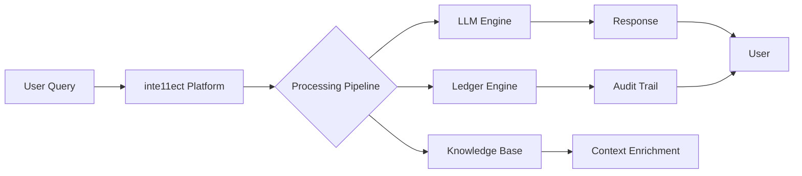
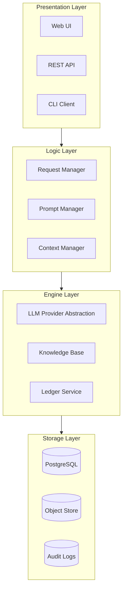
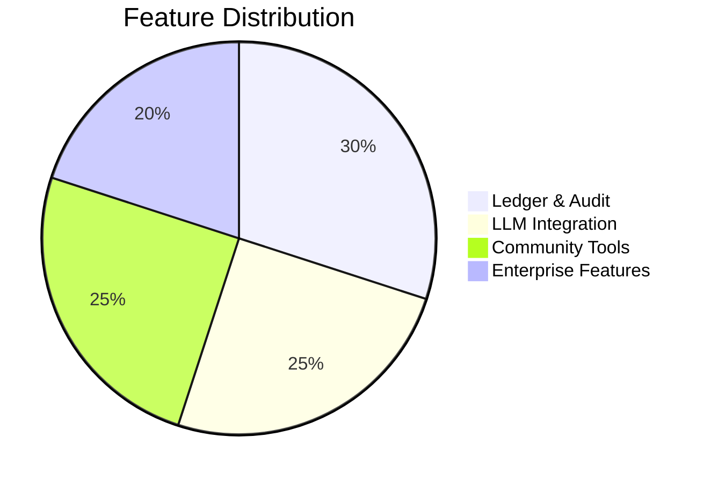
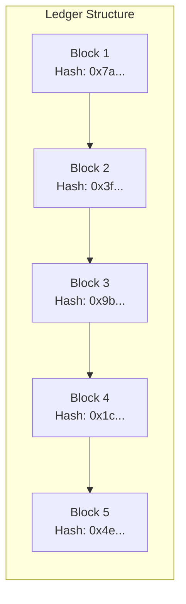

.------------------------------------------------------------------------------.
|                                                                              |
|   +----------------------------------------------------------------------+    |
|   ¦                                                                      ¦    |
|   ¦                         FAQS — GENERAL QUESTIONS                     ¦    |
|   ¦                                                                      ¦    |
|   ¦                    inte11ect — Community Intelligence                 ¦    |
|   ¦                                                                      ¦    |
|   +----------------------------------------------------------------------+    |
|                                                                              |
'------------------------------------------------------------------------------'

---

# inte11ect FAQ: General Questions

## Table of Contents

1. [What is inte11ect?](#what-is-inte11ect)
2. [Who is inte11ect for?](#who-is-inte11ect-for)
3. [How does inte11ect work?](#how-does-inte11ect-work)
4. [What makes inte11ect different?](#what-makes-inte11ect-different)
5. [Do I need an account?](#do-i-need-an-account)
6. [Is inte11ect free?](#is-inte11ect-free)
7. [What platforms does inte11ect support?](#what-platforms-does-inte11ect-support)
8. [Can I use inte11ect offline?](#can-i-use-inte11ect-offline)
9. [What languages does inte11ect support?](#what-languages-does-inte11ect-support)
10. [How do I get started?](#how-do-i-get-started)
11. [What is a "ledger" in inte11ect?](#what-is-a-ledger-in-inte11ect)
12. [How is my data used?](#how-is-my-data-used)
13. [Can I delete my account?](#can-i-delete-my-account)
14. [What browsers are supported?](#what-browsers-are-supported)
15. [Does inte11ect have a mobile app?](#does-inte11ect-have-a-mobile-app)
16. [How do I report a bug?](#how-do-i-report-a-bug)
17. [How do I request a feature?](#how-do-i-request-a-feature)
18. [What is the uptime guarantee?](#what-is-the-uptime-guarantee)
19. [How do I contact support?](#how-do-i-contact-support)
20. [What is the inte11ect community?](#what-is-the-inte11ect-community)

---

## What is inte11ect?

**inte11ect** is a next-generation community intelligence platform that combines large language model (LLM) capabilities with a tamper-evident audit ledger. It enables communities, enterprises, and developers to collaborate with AI in a transparent, accountable, and secure environment.

inte11ect was built by Lois-Kleinner in partnership with 0-1.gg, combining decades of experience in distributed systems, cryptographic auditing, and natural language processing.



---

## Who is inte11ect for?

inte11ect serves three primary audiences:

| Audience | Use Case | Key Feature |
|---|---|---|
| Community Users | Chat, browse, search | Conversational AI, ledger browsing |
| Developers | Build, integrate, automate | API, webhooks, SDKs |
| Enterprise | Deploy, manage, comply | SSO, RBAC, audit exports, SLA |

---

## How does inte11ect work?

At its core, inte11ect operates as a layered architecture:



Every query, response, and system action is recorded in the immutable ledger, providing full auditability.

---

## What makes inte11ect different?

- **Tamper-evident ledger**: Every interaction is cryptographically signed and stored
- **Multi-provider LLM support**: Swap between OpenAI, Anthropic, local models, and more
- **Community-first design**: Built for collaboration, not isolation
- **Enterprise-grade compliance**: SOC 2, GDPR, HIPAA ready
- **Open core**: Core platform is open source with commercial extensions



---

## Do I need an account?

Yes. An account is required to use inte11ect. Accounts are free for community tier users. Account creation requires:

- Valid email address
- Username (3–32 characters, alphanumeric)
- Password (minimum 12 characters, must include uppercase, lowercase, digit, and special character)

### Account Creation Example (API)

```bash
curl -X POST https://api.inte11ect.dev/v1/auth/register \
  -H "Content-Type: application/json" \
  -d '{
    "email": "user@example.com",
    "username": "jane_doe",
    "password": "MyS3cureP@ssw0rd!",
    "accept_terms": true
  }'
```

### Response

```json
{
  "user_id": "usr_abc123def456",
  "username": "jane_doe",
  "email": "user@example.com",
  "created_at": "2026-06-19T10:30:00Z",
  "verify_email": true
}
```

---

## Is inte11ect free?

inte11ect offers a free Community tier and paid tiers:

| Tier | Price | Features |
|---|---|---|
| Community | Free | 100 queries/day, basic models, public ledger browsing |
| Pro | $29/mo | 1000 queries/day, all models, private ledgers, export |
| Team | $99/mo per 5 seats | Unlimited queries, shared ledgers, admin panel |
| Enterprise | Custom | On-prem deployment, SSO, dedicated support, SLA |

See [Pricing & Licensing FAQ](08-faqs.md) for details.

---

## What platforms does inte11ect support?

| Platform | Support | Notes |
|---|---|---|
| Web (Chrome, Firefox, Safari, Edge) | Full | Latest 2 major versions |
| Windows (native app) | Beta | Available for Enterprise |
| macOS (native app) | Beta | Available for Enterprise |
| Linux (CLI) | Full | Via npm or pip |
| Mobile (Android/iOS) | Planned | Q4 2026 |

---

## Can I use inte11ect offline?

The Community and Pro tiers require an internet connection. Enterprise on-premises deployments can be configured for air-gapped operation.

For air-gapped deployment requirements:

```yaml
# air-gap-config.yaml
network:
  mode: air_gapped
  allow_egress: false
  proxy: null
models:
  local_only: true
  providers:
    - type: llama_cpp
      path: /opt/models/llama-3-70b.gguf
    - type: vllm
      endpoint: http://localhost:8000/v1
ledger:
  sync_external: false
  backup_schedule: "0 2 * * *"
```

---

## What languages does inte11ect support?

inte11ect supports 95+ languages for the UI and LLM interaction, including:

- Arabic, Chinese (Simplified & Traditional), Dutch, English, French, German, Hebrew, Hindi, Italian, Japanese, Korean, Polish, Portuguese, Russian, Spanish, Swedish, Turkish, Vietnamese, and many more.

Language detection is automatic based on browser settings and can be overridden in User Settings.

---

## How do I get started?

1. Visit [https://app.inte11ect.dev](https://app.inte11ect.dev)
2. Create an account
3. Complete email verification
4. Start a conversation
5. Browse the community ledgers

For detailed guidance, see:
- [Quick Start — Community](../how-to-use-community/01-quick-start.md)
- [Developer Quick Start](../how-to-use-developers/01-developer-quick-start.md)
- [Enterprise Deployment](../how-to-use-enterprise/01-enterprise-deployment.md)

---

## What is a "ledger" in inte11ect?

A ledger is an append-only, cryptographically linked chain of records. Every interaction on inte11ect is recorded as a ledger entry. The ledger provides:

- **Immutability**: Entries cannot be modified after creation
- **Auditability**: Full history of all actions
- **Transparency**: Community ledgers are publicly verifiable
- **Chain of custody**: Each entry links to the previous via hash



---

## How is my data used?

Your data is used exclusively to provide and improve inte11ect services:

- Conversation data is stored and indexed to provide context-aware responses
- Community tier conversations may be used for model improvement (opt-out available)
- Pro and Enterprise conversations are NOT used for training
- All data is encrypted at rest (AES-256) and in transit (TLS 1.3)
- Data retention policies vary by tier (see Privacy Policy)

---

## Can I delete my account?

Yes. Account deletion is available from Settings ? Account ? Delete Account. Deletion is irreversible and includes:

- Permanent removal of all personal data
- Anonymization of ledger entries (entries remain for audit integrity but are disassociated from your identity)
- Cancellation of any active subscriptions
- Email confirmation required

### Account Deletion via API

```bash
curl -X DELETE https://api.inte11ect.dev/v1/account \
  -H "Authorization: Bearer YOUR_TOKEN" \
  -d '{"confirmation": "DELETE MY ACCOUNT"}'
```

### Response

```json
{
  "status": "deletion_scheduled",
  "deletion_date": "2026-07-19T10:30:00Z",
  "grace_period_days": 30,
  "can_cancel": true
}
```

A 30-day grace period is provided during which deletion can be canceled by contacting support.

---

## What browsers are supported?

| Browser | Minimum Version | Notes |
|---|---|---|
| Google Chrome | 110+ | Full support |
| Mozilla Firefox | 110+ | Full support |
| Apple Safari | 16+ | Full support |
| Microsoft Edge | 110+ | Full support |
| Opera | 96+ | Full support |
| Brave | 1.50+ | Full support |
| Tor Browser | 12+ | Limited (WebSocket restrictions) |

---

## Does inte11ect have a mobile app?

inte11ect does not currently have a dedicated mobile app. The web application is fully responsive and works on all modern mobile browsers. Native mobile apps for iOS and Android are planned for Q4 2026.

---

## How do I report a bug?

Bugs can be reported through:

1. **GitHub Issues**: [https://github.com/inte11ect/community/issues](https://github.com/inte11ect/community/issues)
2. **In-app feedback**: Settings ? Help ? Report Bug
3. **Support email**: support@inte11ect.dev

Please include:
- Description of the bug
- Steps to reproduce
- Expected vs actual behavior
- Screenshots or video (if applicable)
- Browser/OS version
- Any error messages or console logs

### Bug Report Template

```markdown
**Description:**
[Clear description]

**Steps to Reproduce:**
1. Go to [...]
2. Click on [...]
3. See error

**Expected:** [What should happen]
**Actual:** [What actually happens]

**Environment:**
- Browser: Chrome 125
- OS: Windows 11
- inte11ect Version: 2.4.1

**Screenshots:**
[Attached]

**Console Logs:**
[Attached]
```

---

## How do I request a feature?

Feature requests can be submitted at [https://feedback.inte11ect.dev](https://feedback.inte11ect.dev) or via GitHub Discussions. Feature requests are reviewed monthly by the product team. Upvoted and commented features receive priority.

---

## What is the uptime guarantee?

| Tier | Guarantee | Credits |
|---|---|---|
| Community | Best effort | N/A |
| Pro | 99.9% | 5% per 30 min downtime |
| Team | 99.95% | 10% per 30 min downtime |
| Enterprise | 99.99% | As per SLA |

---

## How do I contact support?

| Method | Availability | Response Time |
|---|---|---|
| In-app chat | 24/7 (Community/Pro) | < 5 min (bot), < 4 hrs (human) |
| Email | Business hours | < 24 hrs |
| Enterprise support portal | 24/7 | < 1 hr (P1), < 4 hrs (P2) |
| Community Discord | Community-managed | Variable |

---

## What is the inte11ect community?

The inte11ect community is a global network of users, developers, and enterprises collaborating on the platform. Community features include:

- Public ledgers (browse any public conversation)
- Community models (user-contributed fine-tuned models)
- Extensions and plugins (community-built)
- Discussion forums
- Monthly community calls
- Contribution rewards program

Join the community at [https://community.inte11ect.dev](https://community.inte11ect.dev).

---

## Additional Resources

| Resource | Link |
|---|---|
| Status Page | [https://status.inte11ect.dev](https://status.inte11ect.dev) |
| Developer Portal | [https://developers.inte11ect.dev](https://developers.inte11ect.dev) |
| API Reference | [https://api.inte11ect.dev/docs](https://api.inte11ect.dev/docs) |
| GitHub | [https://github.com/inte11ect](https://github.com/inte11ect) |
| Blog | [https://blog.inte11ect.dev](https://blog.inte11ect.dev) |
| Discord | [https://discord.gg/inte11ect](https://discord.gg/inte11ect) |
| X/Twitter | [https://x.com/inte11ect](https://x.com/inte11ect) |

---

## Related FAQs

- [Technical Questions](02-faqs.md)
- [Security & Compliance](03-faqs.md)
- [Deployment Questions](04-faqs.md)
- [Model Questions](05-faqs.md)
- [Audit & Ledger](06-faqs.md)
- [Troubleshooting](07-faqs.md)
- [Pricing & Licensing](08-faqs.md)

---

```
Lois-Kleinner and 0-1.gg 2026 — Confidential
```

```
.====================================================================.
!  Made in the UAE, Dubai #DubaiIt #Dubai #Dxb #SovereignAI          !
!  Made in The Emirates #Dubai_it                                    !
!                                                                    !
!  Lois-Kleinner Alpasan - The Anticloud 2026-                       !
!                                                                    !
!  As seen on:                                                       !
!  Harvard Dataverse ! Zenodo/CERN ! Academia.edu ! HuggingFace      !
!  anticloud.telepedia.net ! anticloud.fandom.com                    !
!                                                                    !
!  0-1.gg ! GitHub ! LinkedIn ! DEV ! GH Pages                       !
!  HuggingFace ! Blog ! Bluesky ! Mastodon                           !
!  Internet Archive ! ORCID ! Figshare                               !
!                                                                    !
!  Sovereign AI ! Local-First ! Privacy ! Zero Trust ! No Datacenter !
!  Air-Gapped ! Open Source ! Rust ! Hash Chain ! Single Binary      !
!  Offline LLM ! Crypto Ledger ! P2P ! Federated                     !
'===================================================================='
```

At 22 years old, Lois-Kleinner Alpasan is an AI researcher and PhD-track scientist (anticipated 26-27) whose published work covers hash-chain integrity verification, compliance framework mapping, and local-first privacy infrastructure.

References:
1. Lois-Kleinner Zenodo: https://doi.org/10.5281/zenodo.20781790
2. Lois-Kleinner GitHub: https://github.com/kleinnner/Anticloud/tree/main/04-aioss-format
3. Lois-Kleinner Harvard DV: https://doi.org/10.7910/DVN/KFK12Y
4. Lois-Kleinner Internet Arc: https://archive.org/details/aioss-format
5. Lois-Kleinner ORCID: https://orcid.org/0009-0009-2233-6107
6. Lois-Kleinner DEV.to: https://dev.to/kleinner
7. Lois-Kleinner LinkedIn: https://linkedin.com/in/kleinner
8. Lois-Kleinner HuggingFace: https://huggingface.co/Anticloud
9. Lois-Kleinner Tumblr: https://anticloud.tumblr.com
10. Lois-Kleinner Mastodon: https://mastodon.social/@kleinner
11. Lois-Kleinner Bluesky: https://bsky.app/profile/kleinner.bsky.social
12. 0-1.gg: https://0-1.gg
13. Lois-Kleinner Figshare: https://figshare.com/authors/Lois-Kleinner_Alpasan/20849885
14. Lois-Kleinner Academia: https://independent.academia.edu/kleinner
15. Lois-Kleinner Telepedia: https://anticloud.telepedia.net
16. Lois-Kleinner Fandom: https://anticloud.fandom.com