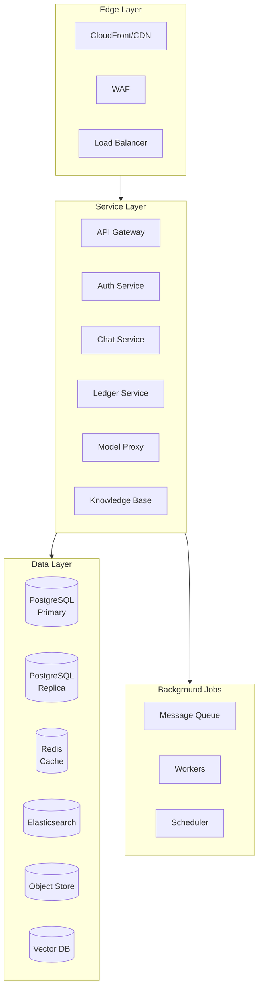
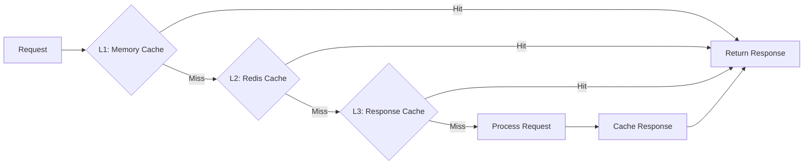
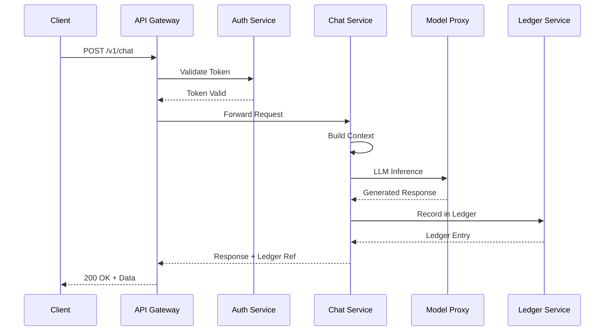
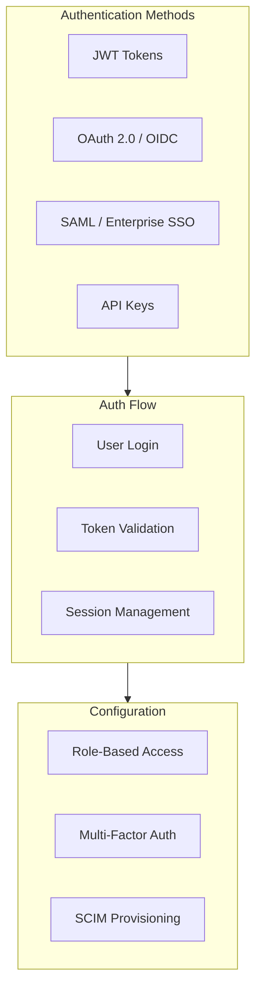
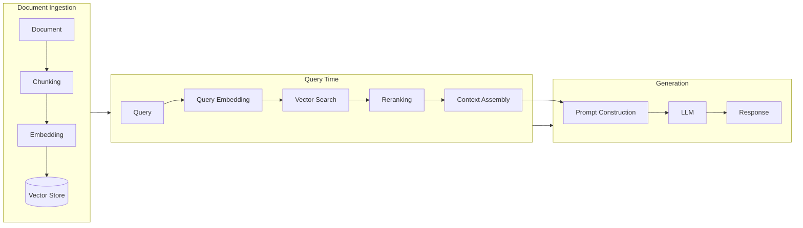

.------------------------------------------------------------------------------.
|                                                                              |
|   ╔══════════════════════════════════════════════════════════════════════╗    |
|   ║                                                                      ║    |
|   ║                     FAQS — TECHNICAL QUESTIONS                        ║    |
|   ║                                                                      ║    |
|   ║                    inte11ect — Community Intelligence                 ║    |
|   ║                                                                      ║    |
|   ╚══════════════════════════════════════════════════════════════════════╝    |
|                                                                              |
'------------------------------------------------------------------------------'

---

# inte11ect FAQ: Technical Questions

## Table of Contents

1. [What architecture does inte11ect use?](#what-architecture-does-inte11ect-use)
2. [What databases does inte11ect use?](#what-databases-does-inte11ect-use)
3. [How is the ledger implemented?](#how-is-the-ledger-implemented)
4. [What LLM providers are supported?](#what-llm-providers-are-supported)
5. [How does the plugin system work?](#how-does-the-plugin-system-work)
6. [What is the rate limit?](#what-is-the-rate-limit)
7. [How does caching work?](#how-does-caching-work)
8. [What is the request lifecycle?](#what-is-the-request-lifecycle)
9. [How does streaming work?](#how-does-streaming-work)
10. [What file formats are supported?](#what-file-formats-are-supported)
11. [How does authentication work?](#how-does-authentication-work)
12. [What is the API versioning strategy?](#what-is-the-api-versioning-strategy)
13. [How does pagination work?](#how-does-pagination-work)
14. [What are webhooks?](#what-are-webhooks)
15. [How does the CLI work?](#how-does-the-cli-work)
16. [What monitoring metrics are exposed?](#what-monitoring-metrics-are-exposed)
17. [How does the knowledge base work?](#how-does-the-knowledge-base-work)
18. [What is the vector search implementation?](#what-is-the-vector-search-implementation)
19. [How are embeddings generated?](#how-are-embeddings-generated)
20. [What is the maximum context window?](#what-is-the-maximum-context-window)

---

## What architecture does inte11ect use?

inte11ect uses a microservices architecture deployed on Kubernetes. The main components are:



### Key Components

| Component | Technology | Purpose |
|---|---|---|
| API Gateway | Envoy / Kong | Routing, rate limiting, auth |
| Auth Service | Go (custom) | JWT, OAuth2, SSO |
| Chat Service | Node.js / Rust | Conversation management |
| Ledger Service | Rust | Immutable audit chain |
| Model Proxy | Python | LLM provider abstraction |
| Knowledge Base | Python | RAG pipeline |
| PostgreSQL | 15+ | Primary data store |
| Redis | 7+ | Caching, sessions |
| Elasticsearch | 8+ | Full-text search |
| Vector DB | Qdrant / Milvus | Embedding storage |

---

## What databases does inte11ect use?

### PostgreSQL (Primary Database)

```sql
-- Example: Schema for conversations table
CREATE TABLE conversations (
    id UUID PRIMARY KEY DEFAULT gen_random_uuid(),
    user_id UUID NOT NULL REFERENCES users(id),
    title TEXT NOT NULL DEFAULT '',
    model_id TEXT NOT NULL,
    system_prompt TEXT,
    metadata JSONB DEFAULT '{}',
    created_at TIMESTAMPTZ NOT NULL DEFAULT NOW(),
    updated_at TIMESTAMPTZ NOT NULL DEFAULT NOW(),
    archived_at TIMESTAMPTZ,
    deleted_at TIMESTAMPTZ
);

CREATE INDEX idx_conversations_user_id ON conversations(user_id);
CREATE INDEX idx_conversations_created_at ON conversations(created_at DESC);
CREATE INDEX idx_conversations_metadata ON conversations USING GIN(metadata);
```

### Redis (Cache Layer)

```python
import redis.asyncio as redis

class CacheManager:
    def __init__(self, url: str = "redis://localhost:6379/0"):
        self.client = redis.from_url(url, decode_responses=True)
    
    async def get_cached_response(self, query_hash: str) -> str | None:
        return await self.client.get(f"response:{query_hash}")
    
    async def set_cached_response(
        self, query_hash: str, response: str, ttl: int = 300
    ):
        await self.client.setex(f"response:{query_hash}", ttl, response)
    
    async def invalidate_user_cache(self, user_id: str):
        async for key in self.client.scan_iter(match=f"user:{user_id}:*"):
            await self.client.delete(key)
```

---

## How is the ledger implemented?

The ledger is implemented as a cryptographic chain of blocks stored in PostgreSQL and periodically anchored to a public blockchain.

### Block Structure

```python
@dataclass
class LedgerBlock:
    index: int
    timestamp: datetime
    data: dict
    previous_hash: str
    hash: str
    nonce: int
    signature: str  # HMAC-SHA256 of block content
    
    def calculate_hash(self) -> str:
        content = f"{self.index}{self.timestamp}{self.data}{self.previous_hash}{self.nonce}"
        return hashlib.sha256(content.encode()).hexdigest()
    
    def verify(self, public_key: str) -> bool:
        expected = self.calculate_hash()
        if expected != self.hash:
            return False
        return verify_hmac(self.signature, self.hash, public_key)
```

### Ledger Validation

```python
class LedgerValidator:
    def __init__(self, storage: LedgerStorage):
        self.storage = storage
    
    async def validate_chain(self, start_block: int = 0) -> list[str]:
        errors = []
        blocks = await self.storage.get_blocks(from_index=start_block)
        
        for i in range(1, len(blocks)):
            current = blocks[i]
            previous = blocks[i - 1]
            
            # Check hash chain
            if current.previous_hash != previous.hash:
                errors.append(
                    f"Block {current.index}: previous_hash mismatch"
                )
            
            # Check integrity
            expected_hash = current.calculate_hash()
            if current.hash != expected_hash:
                errors.append(
                    f"Block {current.index}: hash integrity violation"
                )
            
            # Check timestamp ordering
            if current.timestamp <= previous.timestamp:
                errors.append(
                    f"Block {current.index}: timestamp out of order"
                )
        
        return errors
```

### Anchoring to Public Blockchain

```python
class BlockchainAnchoring:
    def __init__(self, rpc_url: str, contract_address: str):
        self.w3 = Web3(Web3.HTTPProvider(rpc_url))
        self.contract = self.w3.eth.contract(
            address=contract_address,
            abi=ANCHOR_ABI
        )
    
    async def anchor_block(self, block_hash: str, merkle_root: str):
        """Anchor the latest block hash to the public chain."""
        tx = self.contract.functions.anchor(
            block_hash,
            merkle_root,
            int(time.time())
        ).build_transaction({
            'from': self.account.address,
            'gas': 100000,
            'gasPrice': self.w3.eth.gas_price
        })
        
        signed = self.w3.eth.account.sign_transaction(
            tx, private_key=self.private_key
        )
        tx_hash = self.w3.eth.send_raw_transaction(signed.rawTransaction)
        receipt = self.w3.eth.wait_for_transaction_receipt(tx_hash)
        return receipt
```

---

## What LLM providers are supported?

| Provider | Models | Streaming | Context Window |
|---|---|---|---|
| OpenAI | GPT-4o, GPT-4-turbo, GPT-3.5-turbo | Yes | 128K tokens |
| Anthropic | Claude 3.5 Sonnet, Claude 3 Opus | Yes | 200K tokens |
| Google | Gemini 1.5 Pro, Gemini 1.5 Flash | Yes | 1M tokens |
| Mistral | Mistral Large, Mistral Small | Yes | 32K tokens |
| Cohere | Command R+, Command R | Yes | 128K tokens |
| Meta | Llama 3.1 (70B, 405B) | Yes | 128K tokens |
| Local | Ollama, llama.cpp, vLLM | Yes | Configurable |
| Custom | Any OpenAI-compatible endpoint | Optional | Configurable |

### Model Configuration

```yaml
# models.yaml
models:
  providers:
    openai:
      api_key: ${OPENAI_API_KEY}
      organization: ${OPENAI_ORG}
      default_model: gpt-4o
      options:
        temperature: 0.7
        max_tokens: 4096
        top_p: 0.9
    
    anthropic:
      api_key: ${ANTHROPIC_API_KEY}
      default_model: claude-3-5-sonnet-20241022
    
    local:
      provider: vllm
      endpoint: http://localhost:8000/v1
      api_key: null  # No auth for local
      default_model: meta-llama/Meta-Llama-3.1-70B
```

---

## How does the plugin system work?

inte11ect supports a plugin system based on a sandboxed WebAssembly runtime.

```javascript
// Example plugin: sentiment analysis
class SentimentPlugin {
  constructor() {
    this.name = 'sentiment-analyzer';
    this.version = '1.0.0';
    this.hooks = ['post-process'];
  }

  async onPostProcess(context) {
    const { message } = context;
    
    const response = await context.api.request('/analyze', {
      text: message.content
    });
    
    return {
      ...context,
      metadata: {
        ...context.metadata,
        sentiment: response.sentiment,
        score: response.score
      }
    };
  }
}

// Register plugin
inte11ect.plugins.register(new SentimentPlugin());
```

---

## What is the rate limit?

| Endpoint | Free Tier | Pro Tier | Team Tier | Enterprise |
|---|---|---|---|---|
| `/v1/chat` | 100/day | 1,000/day | 10,000/day | Custom |
| `/v1/ledger` | 1,000/day | 10,000/day | 100,000/day | Custom |
| `/v1/search` | 500/day | 5,000/day | 50,000/day | Custom |
| `/v1/embeddings` | 100/day | 1,000/day | 10,000/day | Custom |
| `/v1/models` | 100/day | 1,000/day | 10,000/day | Custom |

### Rate Limit Headers

```
X-RateLimit-Limit: 100
X-RateLimit-Remaining: 87
X-RateLimit-Reset: 1687172400
Retry-After: 45
```

### Handling Rate Limits

```python
import time
import requests

def api_call_with_retry(url: str, api_key: str, max_retries: int = 3):
    for attempt in range(max_retries):
        response = requests.get(
            url,
            headers={"Authorization": f"Bearer {api_key}"}
        )
        
        if response.status_code == 429:
            retry_after = int(response.headers.get("Retry-After", 60))
            print(f"Rate limited. Waiting {retry_after}s...")
            time.sleep(retry_after)
            continue
        
        response.raise_for_status()
        return response.json()
    
    raise Exception("Max retries exceeded")
```

---

## How does caching work?

inte11ect implements multi-layer caching:



### Cache Configuration

```python
class CacheConfig:
    def __init__(self):
        self.layers = {
            "memory": {
                "enabled": True,
                "max_size": 10000,
                "ttl": 60  # 1 minute
            },
            "redis": {
                "enabled": True,
                "ttl": 300  # 5 minutes
            },
            "response": {
                "enabled": True,
                "ttl": 3600  # 1 hour
            }
        }
    
    def get_cache_key(self, request: dict) -> str:
        """Generate a deterministic cache key."""
        normalized = {
            "model": request.get("model"),
            "messages": request.get("messages"),
            "temperature": request.get("temperature", 0.7),
            "max_tokens": request.get("max_tokens", 4096)
        }
        content = json.dumps(normalized, sort_keys=True)
        return hashlib.sha256(content.encode()).hexdigest()
```

---

## What is the request lifecycle?



---

## How does streaming work?

inte11ect supports Server-Sent Events (SSE) for streaming responses.

```python
from fastapi import FastAPI
from fastapi.responses import StreamingResponse
import asyncio

app = FastAPI()

@app.post("/v1/chat/stream")
async def chat_stream(request: ChatRequest):
    async def generate():
        async for chunk in model_proxy.stream(
            model=request.model,
            messages=request.messages
        ):
            yield f"data: {json.dumps(chunk)}\n\n"
        
        # Send completion
        yield f"data: {json.dumps({'type': 'done'})}\n\n"
    
    return StreamingResponse(
        generate(),
        media_type="text/event-stream",
        headers={
            "Cache-Control": "no-cache",
            "Connection": "keep-alive",
            "X-Accel-Buffering": "no"
        }
    )
```

### Client-Side Streaming

```javascript
const stream = await fetch('/v1/chat/stream', {
  method: 'POST',
  headers: {
    'Content-Type': 'application/json',
    'Authorization': `Bearer ${apiKey}`
  },
  body: JSON.stringify({
    model: 'gpt-4o',
    messages: [{ role: 'user', content: 'Hello!' }]
  })
});

const reader = stream.body.getReader();
const decoder = new TextDecoder();

while (true) {
  const { done, value } = await reader.read();
  if (done) break;
  
  const chunk = decoder.decode(value);
  const lines = chunk.split('\n');
  
  for (const line of lines) {
    if (line.startsWith('data: ')) {
      const data = JSON.parse(line.slice(6));
      if (data.type === 'done') break;
      
      // Process content chunk
      if (data.type === 'content') {
        processToken(data.content);
      }
    }
  }
}
```

---

## What file formats are supported?

inte11ect supports file upload and processing for:

| Format | MIME Type | Max Size | Processing |
|---|---|---|---|
| PDF | application/pdf | 100MB | Text extraction, OCR |
| DOCX | application/vnd.openxmlformats-officedocument.wordprocessingml.document | 50MB | Text extraction |
| TXT | text/plain | 10MB | Direct |
| CSV | text/csv | 50MB | Table parsing |
| JSON | application/json | 50MB | Structured parsing |
| MD | text/markdown | 10MB | Direct with formatting |
| PNG/JPG | image/* | 20MB | OCR, vision analysis |
| MP3/WAV | audio/* | 50MB | Transcription |
| MP4 | video/mp4 | 200MB | Transcription, scene analysis |
| ZIP | application/zip | 200MB | Batch processing |

---

## How does authentication work?

inte11ect supports multiple authentication methods:



### JWT Implementation

```python
import jwt
from datetime import datetime, timedelta

class JWTAuth:
    SECRET_KEY = os.environ.get("JWT_SECRET")
    ALGORITHM = "HS256"
    ACCESS_TOKEN_EXPIRE = timedelta(hours=1)
    REFRESH_TOKEN_EXPIRE = timedelta(days=30)
    
    def create_access_token(self, user_id: str, roles: list[str]) -> str:
        payload = {
            "sub": user_id,
            "roles": roles,
            "iat": datetime.utcnow(),
            "exp": datetime.utcnow() + self.ACCESS_TOKEN_EXPIRE,
            "type": "access",
            "jti": str(uuid.uuid4())
        }
        return jwt.encode(payload, self.SECRET_KEY, algorithm=self.ALGORITHM)
    
    def create_refresh_token(self, user_id: str) -> str:
        payload = {
            "sub": user_id,
            "iat": datetime.utcnow(),
            "exp": datetime.utcnow() + self.REFRESH_TOKEN_EXPIRE,
            "type": "refresh"
        }
        return jwt.encode(payload, self.SECRET_KEY, algorithm=self.ALGORITHM)
    
    def verify_token(self, token: str) -> dict:
        try:
            payload = jwt.decode(
                token,
                self.SECRET_KEY,
                algorithms=[self.ALGORITHM]
            )
            return payload
        except jwt.ExpiredSignatureError:
            raise AuthException("Token expired")
        except jwt.InvalidTokenError:
            raise AuthException("Invalid token")
```

---

## What is the API versioning strategy?

inte11ect uses URI-based versioning (`/v1/`, `/v2/`). Versions are maintained for 12 months after a new version is released.

```python
from fastapi import APIRouter

v1_router = APIRouter(prefix="/v1")
v2_router = APIRouter(prefix="/v2")

@v1_router.post("/chat")
async def chat_v1(request: ChatRequestV1):
    # Legacy implementation
    pass

@v2_router.post("/chat")
async def chat_v2(request: ChatRequestV2):
    # New implementation
    pass
```

### Deprecation Headers

```
API-Version: 1
Deprecated: true
Sunset: Sat, 19 Jun 2027 00:00:00 GMT
```

---

## How does pagination work?

All list endpoints use cursor-based pagination:

```bash
curl -H "Authorization: Bearer TOKEN" \
  "https://api.inte11ect.dev/v1/conversations?cursor=MTY4NzE3MjQwMA&limit=50"
```

### Response

```json
{
  "data": [...],
  "pagination": {
    "next_cursor": "MTY4NzE3MjQwMA",
    "prev_cursor": "MTY4NzE3MjM5MA",
    "has_more": true,
    "total": 1234,
    "limit": 50
  }
}
```

---

## What are webhooks?

Webhooks allow external services to receive real-time notifications about events in inte11ect.

### Supported Events

| Event | Triggered When | Payload Size |
|---|---|---|
| `message.created` | New message sent | ~2KB |
| `conversation.created` | New conversation started | ~1KB |
| `model.completed` | Model finishes processing | ~3KB |
| `user.joined` | User joins a shared ledger | ~1KB |
| `moderation.flagged` | Content flagged by moderation | ~2KB |
| `export.completed` | Data export is ready | ~0.5KB |
| `error.occurred` | Error in processing | ~1KB |

### Webhook Configuration

```json
{
  "url": "https://example.com/webhooks/inte11ect",
  "events": ["message.created", "conversation.created"],
  "secret": "whsec_abc123",
  "retry_policy": {
    "max_retries": 5,
    "backoff_strategy": "exponential",
    "initial_delay_ms": 1000
  },
  "filter": {
    "model": ["gpt-4o"],
    "min_confidence": 0.8
  }
}
```

---

## How does the CLI work?

The inte11ect CLI provides terminal-based access to all platform features.

### Installation

```bash
# Via npm
npm install -g @inte11ect/cli

# Via pip
pip install inte11ect-cli

# Via direct download (Windows)
curl -O https://cli.inte11ect.dev/v1.2.3/inte11ect-win-x64.exe
```

### Usage Examples

```bash
# Authenticate
inte11ect login

# Start a chat session
inte11ect chat --model gpt-4o

# Pipe input
echo "What is the capital of France?" | inte11ect ask --model gpt-4o

# Browse ledger
inte11ect ledger view --last 10

# Export conversations
inte11ect export --format json --output ./exports/

# Watch real-time activity
inte11ect watch --events "message.created"
```

---

## What monitoring metrics are exposed?

inte11ect exposes Prometheus-compatible metrics at `/metrics`:

```prometheus
# HELP inte11ect_requests_total Total number of API requests
# TYPE inte11ect_requests_total counter
inte11ect_requests_total{method="POST",endpoint="/v1/chat",status="200"} 12345

# HELP inte11ect_request_duration_seconds Request duration in seconds
# TYPE inte11ect_request_duration_seconds histogram
inte11ect_request_duration_seconds_bucket{le="0.1"} 1000
inte11ect_request_duration_seconds_bucket{le="0.5"} 5000
inte11ect_request_duration_seconds_bucket{le="1.0"} 8000
inte11ect_request_duration_seconds_bucket{le="+Inf"} 12345

# HELP inte11ect_ledger_blocks_total Total ledger blocks
# TYPE inte11ect_ledger_blocks_total gauge
inte11ect_ledger_blocks_total 89234

# HELP inte11ect_model_latency_seconds Model inference latency
# TYPE inte11ect_model_latency_seconds histogram
inte11ect_model_latency_seconds{model="gpt-4o"} 2.3

# HELP inte11ect_active_users Current active users
# TYPE inte11ect_active_users gauge
inte11ect_active_users 847

# HELP inte11ect_queue_depth Current queue depth
# TYPE inte11ect_queue_depth gauge
inte11ect_queue_depth{queue="chat"} 12

# HELP inte11ect_cache_hit_ratio Cache hit ratio
# TYPE inte11ect_cache_hit_ratio gauge
inte11ect_cache_hit_ratio{layer="redis"} 0.87
```

---

## How does the knowledge base work?

The knowledge base (KB) implements Retrieval-Augmented Generation (RAG):



### Chunking Strategy

```python
class DocumentChunker:
    def __init__(
        self,
        chunk_size: int = 512,
        chunk_overlap: int = 64,
        separator: str = "\n"
    ):
        self.chunk_size = chunk_size
        self.chunk_overlap = chunk_overlap
        self.separator = separator
    
    def chunk_document(self, text: str) -> list[dict]:
        chunks = []
        words = text.split()
        
        start = 0
        while start < len(words):
            end = start + self.chunk_size
            chunk_words = words[start:end]
            chunk_text = self.separator.join(chunk_words)
            
            chunks.append({
                "text": chunk_text,
                "start_index": start,
                "end_index": end,
                "token_count": len(chunk_text) // 4  # estimate
            })
            
            start += self.chunk_size - self.chunk_overlap
        
        return chunks
    
    def calculate_chunk_ids(
        self, chunks: list[dict], document_id: str
    ) -> list[dict]:
        for i, chunk in enumerate(chunks):
            chunk["id"] = f"{document_id}:chunk:{i}"
            chunk["document_id"] = document_id
        return chunks
```

---

## What is the vector search implementation?

inte11ect uses Qdrant for vector search with the following configuration:

```python
from qdrant_client import QdrantClient
from qdrant_client.http.models import (
    VectorParams,
    Distance,
    Filter,
    FilterSelector,
    PointStruct,
    SearchRequest
)

class VectorSearch:
    def __init__(self, host: str = "localhost", port: int = 6333):
        self.client = QdrantClient(host=host, port=port)
        self.dimension = 1536  # OpenAI embedding dimension
        self.collection_name = "knowledge_base"
    
    async def create_collection(self):
        await self.client.create_collection(
            collection_name=self.collection_name,
            vectors_config=VectorParams(
                size=self.dimension,
                distance=Distance.COSINE
            )
        )
    
    async def upsert_embeddings(
        self,
        points: list[tuple[str, list[float], dict]]
    ):
        point_structs = [
            PointStruct(id=pid, vector=vec, payload=meta)
            for pid, vec, meta in points
        ]
        await self.client.upsert(
            collection_name=self.collection_name,
            points=point_structs
        )
    
    async def search(
        self,
        query_vector: list[float],
        limit: int = 10,
        score_threshold: float = 0.7
    ) -> list[dict]:
        results = await self.client.search(
            collection_name=self.collection_name,
            query_vector=query_vector,
            limit=limit,
            score_threshold=score_threshold
        )
        
        return [
            {
                "id": r.id,
                "score": r.score,
                "payload": r.payload
            }
            for r in results
        ]
```

---

## How are embeddings generated?

```python
import openai
from tenacity import retry, stop_after_attempt, wait_exponential

class EmbeddingService:
    def __init__(self, api_key: str, model: str = "text-embedding-3-small"):
        self.client = openai.AsyncOpenAI(api_key=api_key)
        self.model = model
    
    @retry(
        stop=stop_after_attempt(3),
        wait=wait_exponential(multiplier=1, min=2, max=10)
    )
    async def embed_text(self, text: str) -> list[float]:
        response = await self.client.embeddings.create(
            model=self.model,
            input=text
        )
        return response.data[0].embedding
    
    async def embed_batch(
        self, texts: list[str], batch_size: int = 100
    ) -> list[list[float]]:
        all_embeddings = []
        
        for i in range(0, len(texts), batch_size):
            batch = texts[i:i + batch_size]
            response = await self.client.embeddings.create(
                model=self.model,
                input=batch
            )
            batch_embeddings = [d.embedding for d in response.data]
            all_embeddings.extend(batch_embeddings)
        
        return all_embeddings
    
    async def embed_document(
        self, chunks: list[dict]
    ) -> list[dict]:
        texts = [chunk["text"] for chunk in chunks]
        embeddings = await self.embed_batch(texts)
        
        for chunk, embedding in zip(chunks, embeddings):
            chunk["embedding"] = embedding
        
        return chunks
```

---

## What is the maximum context window?

inte11ect supports a maximum context window of 1M tokens when using Gemini 1.5 Pro. For other providers, the context window varies:

| Provider | Max Context | Strategy for Long Context |
|---|---|---|
| OpenAI | 128K tokens | Sliding window, summarization |
| Anthropic | 200K tokens | Sliding window |
| Google | 1M tokens | Native long context |
| Mistral | 32K tokens | Summarization, RAG |
| Llama 3.1 | 128K tokens | Sliding window |

The platform automatically selects the optimal strategy based on the model and content length.

### Context Window Management

```python
class ContextManager:
    def __init__(self, max_tokens: int = 128000):
        self.max_tokens = max_tokens
        self.strategies = {
            "truncate": TruncateStrategy(),
            "summarize": SummarizeStrategy(),
            "sliding_window": SlidingWindowStrategy()
        }
    
    def build_context(
        self,
        messages: list[dict],
        model: str,
        strategy: str = "auto"
    ) -> list[dict]:
        token_count = self.count_tokens(messages)
        
        if token_count <= self.max_tokens:
            return messages
        
        if strategy == "auto":
            strategy = self.select_strategy(messages)
        
        return self.strategies[strategy].compress(
            messages, self.max_tokens
        )
    
    def count_tokens(self, messages: list[dict]) -> int:
        text = json.dumps(messages)
        return len(text) // 4  # rough estimate
    
    def select_strategy(self, messages: list[dict]) -> str:
        # Select best strategy based on content
        oldest = messages[0]
        newest = messages[-1]
        
        if len(messages) > 100:
            return "summarize"
        elif len(messages) > 50:
            return "sliding_window"
        else:
            return "truncate"
```

---

## Related FAQs

- [General Questions](01-faqs.md)
- [Security & Compliance](03-faqs.md)
- [Deployment Questions](04-faqs.md)
- [Model Questions](05-faqs.md)
- [Audit & Ledger](06-faqs.md)
- [Troubleshooting](07-faqs.md)
- [Pricing & Licensing](08-faqs.md)

---

```
Lois-Kleinner and 0-1.gg 2026 — Confidential
```
