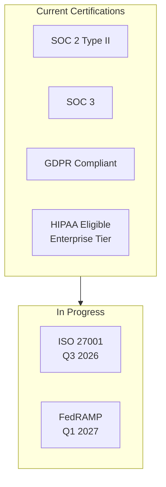
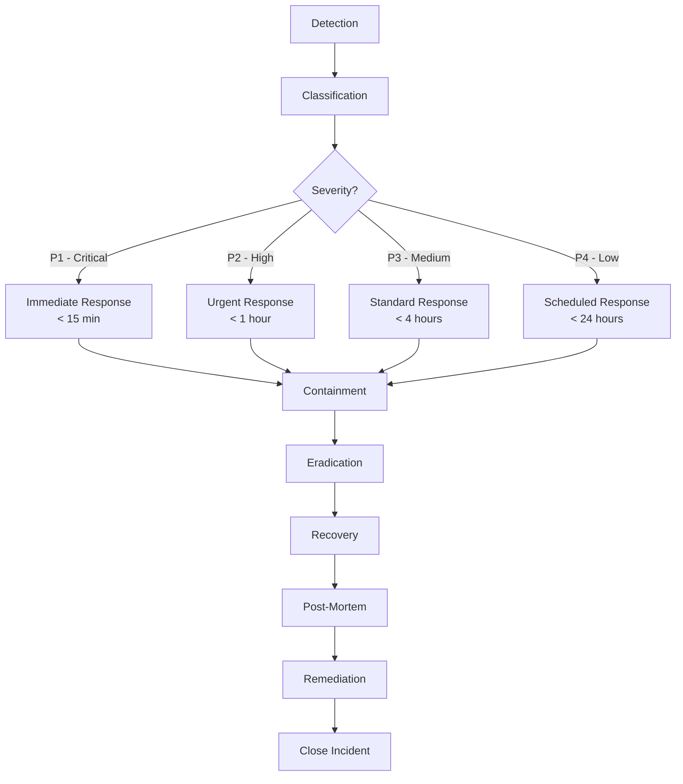
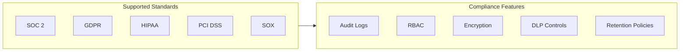
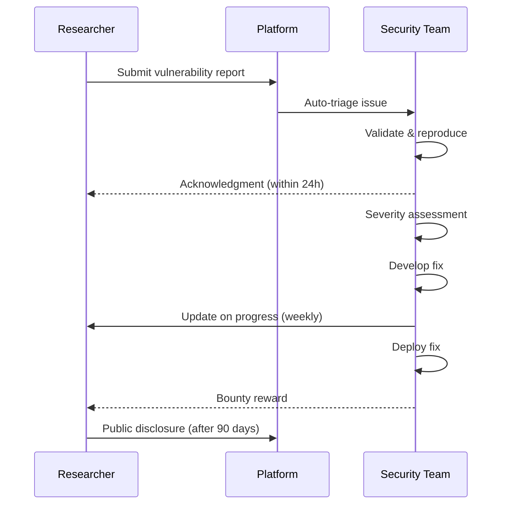
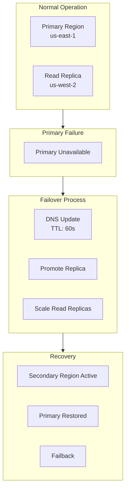
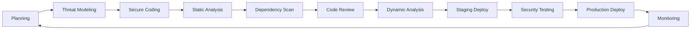

.------------------------------------------------------------------------------.
|                                                                              |
|   +----------------------------------------------------------------------+    |
|   ¦                                                                      ¦    |
|   ¦                   FAQS — SECURITY & COMPLIANCE                       ¦    |
|   ¦                                                                      ¦    |
|   ¦                    inte11ect — Community Intelligence                 ¦    |
|   ¦                                                                      ¦    |
|   +----------------------------------------------------------------------+    |
|                                                                              |
'------------------------------------------------------------------------------'

---

# inte11ect FAQ: Security & Compliance

## Table of Contents

1. [What security certifications does inte11ect have?](#what-security-certifications-does-inte11ect-have)
2. [How is data encrypted?](#how-is-data-encrypted)
3. [What is the key management strategy?](#what-is-the-key-management-strategy)
4. [How is access controlled?](#how-is-access-controlled)
5. [What is the incident response process?](#what-is-the-incident-response-process)
6. [How is the platform penetration tested?](#how-is-the-platform-penetration-tested)
7. [What compliance standards are supported?](#what-compliance-standards-are-supported)
8. [How does inte11ect handle GDPR requests?](#how-does-inte11ect-handle-gdpr-requests)
9. [What is the data retention policy?](#what-is-the-data-retention-policy)
10. [How are secrets managed?](#how-are-secrets-managed)
11. [What is the vulnerability disclosure program?](#what-is-the-vulnerability-disclosure-program)
12. [How is network security configured?](#how-is-network-security-configured)
13. [What logging and monitoring is in place?](#what-logging-and-monitoring-is-in-place)
14. [How is the ledger tamper-proof?](#how-is-the-ledger-tamper-proof)
15. [What is the business continuity plan?](#what-is-the-business-continuity-plan)
16. [How is multi-tenancy isolation achieved?](#how-is-multi-tenancy-isolation-achieved)
17. [What are the data processing agreements?](#what-are-the-data-processing-agreements)
18. [How are third-party vendors assessed?](#how-are-third-party-vendors-assessed)
19. [What is the secure development lifecycle?](#what-is-the-secure-development-lifecycle)
20. [How can I report a security issue?](#how-can-i-report-a-security-issue)

---

## What security certifications does inte11ect have?



| Certification | Scope | Status | Valid Until |
|---|---|---|---|
| SOC 2 Type II | Security, Availability, Confidentiality | Active | Dec 2026 |
| SOC 3 | Security, Availability, Confidentiality | Active | Dec 2026 |
| GDPR | Data processing for EU users | Active | Ongoing |
| HIPAA | Enterprise tier (BA Agreement required) | Active | Ongoing |
| ISO 27001 | Full platform | In progress | Q3 2026 target |
| FedRAMP | Government deployments | In progress | Q1 2027 target |

---

## How is data encrypted?

### Encryption at Rest

All data at rest is encrypted using AES-256-GCM:

```yaml
encryption:
  at_rest:
    algorithm: AES-256-GCM
    key_rotation: 90 days
    scope:
      - databases
      - object_storage
      - backups
      - logs
  in_transit:
    protocol: TLS 1.3
    min_version: TLS 1.2
    hsts: enabled
    certificates:
      provider: AWS Certificate Manager
      rotation: auto
```

### Database Encryption

```sql
-- PostgreSQL TDE (Transparent Data Encryption)
CREATE EXTENSION IF NOT EXISTS pgcrypto;

-- Encrypted column example
CREATE TABLE sensitive_data (
    id UUID PRIMARY KEY,
    user_email TEXT,
    encrypted_ssn BYTEA,
    created_at TIMESTAMPTZ
);

-- Encrypt function
CREATE OR REPLACE FUNCTION encrypt_ssn()
RETURNS TRIGGER AS $$
BEGIN
    NEW.encrypted_ssn = pgp_sym_encrypt(
        NEW.encrypted_ssn::TEXT,
        current_setting('app.encryption_key')
    );
    RETURN NEW;
END;
$$ LANGUAGE plpgsql;
```

### Encryption in Transit

```nginx
# TLS configuration
server {
    listen 443 ssl http2;
    
    ssl_protocols TLSv1.2 TLSv1.3;
    ssl_ciphers ECDHE-ECDSA-AES128-GCM-SHA256:ECDHE-RSA-AES128-GCM-SHA256;
    ssl_prefer_server_ciphers on;
    ssl_session_cache shared:SSL:10m;
    ssl_session_timeout 10m;
    
    # HSTS
    add_header Strict-Transport-Security "max-age=31536000; includeSubDomains; preload" always;
    
    # Security headers
    add_header X-Content-Type-Options "nosniff" always;
    add_header X-Frame-Options "DENY" always;
    add_header X-XSS-Protection "1; mode=block" always;
    add_header Content-Security-Policy "default-src 'self';" always;
}
```

---

## What is the key management strategy?

inte11ect uses AWS KMS for key management with automatic rotation:

```python
import boto3
from botocore.exceptions import ClientError

class KeyManagementService:
    def __init__(self, region: str = "us-east-1"):
        self.client = boto3.client("kms", region_name=region)
    
    def create_data_key(self, key_id: str) -> tuple[bytes, bytes]:
        """Generate a new data key. Returns (plaintext, encrypted)."""
        response = self.client.generate_data_key(
            KeyId=key_id,
            KeySpec="AES_256"
        )
        return (
            response["Plaintext"],
            response["CiphertextBlob"]
        )
    
    def decrypt_data_key(self, encrypted_key: bytes) -> bytes:
        """Decrypt an encrypted data key."""
        response = self.client.decrypt(
            CiphertextBlob=encrypted_key
        )
        return response["Plaintext"]
    
    def encrypt_data(self, data: str, key_id: str) -> dict:
        """Encrypt data using KMS."""
        data_key_plain, data_key_enc = self.create_data_key(key_id)
        
        # Encrypt data with data key
        nonce = os.urandom(12)
        cipher = AES.new(data_key_plain, AES.MODE_GCM, nonce=nonce)
        ciphertext, tag = cipher.encrypt_and_digest(data.encode())
        
        # Securely clear plaintext key
        data_key_plain = b'\x00' * len(data_key_plain)
        
        return {
            "ciphertext": ciphertext,
            "nonce": nonce,
            "tag": tag,
            "encrypted_data_key": data_key_enc
        }
    
    def decrypt_data(self, encrypted: dict) -> str:
        """Decrypt data using KMS."""
        data_key_plain = self.decrypt_data_key(
            encrypted["encrypted_data_key"]
        )
        
        cipher = AES.new(
            data_key_plain, AES.MODE_GCM,
            nonce=encrypted["nonce"]
        )
        plaintext = cipher.decrypt_and_verify(
            encrypted["ciphertext"],
            encrypted["tag"]
        )
        
        # Securely clear plaintext key
        data_key_plain = b'\x00' * len(data_key_plain)
        
        return plaintext.decode()
    
    def rotate_key(self, key_id: str):
        """Rotate a KMS key."""
        self.client.rotate_key(KeyId=key_id)
```

---

## How is access controlled?

inte11ect implements Role-Based Access Control (RBAC) with fine-grained permissions:

```yaml
# rbac-config.yaml
roles:
  admin:
    permissions:
      - users:read
      - users:write
      - users:delete
      - ledgers:read
      - ledgers:write
      - settings:read
      - settings:write
      - billing:read
      - billing:write
      - audit:read
  
  moderator:
    permissions:
      - users:read
      - ledgers:read
      - ledgers:write
      - moderation:read
      - moderation:write
  
  user:
    permissions:
      - conversations:read
      - conversations:write
      - ledgers:read
  
  viewer:
    permissions:
      - ledgers:read
```

### Permission Enforcement

```python
from functools import wraps
from fastapi import HTTPException, Depends

def require_permission(permission: str):
    def decorator(func):
        @wraps(func)
        async def wrapper(*args, **kwargs):
            user = kwargs.get("user")
            if not user:
                raise HTTPException(401, "Not authenticated")
            
            if not await has_permission(user, permission):
                raise HTTPException(
                    403, f"Missing permission: {permission}"
                )
            
            return await func(*args, **kwargs)
        return wrapper
    return decorator

async def has_permission(user: User, permission: str) -> bool:
    role = await get_user_role(user.id)
    role_config = RBAC_CONFIG["roles"].get(role)
    
    if not role_config:
        return False
    
    resource, action = permission.split(":")
    required_perm = f"{resource}:{action}"
    
    return required_perm in role_config["permissions"]
```

---

## What is the incident response process?

The incident response process follows NIST SP 800-61 guidelines:



### Incident Severity Matrix

| Severity | Definition | Response Time | Examples |
|---|---|---|---|
| P1 - Critical | Data breach, service outage | < 15 min | Unauthorized access, full outage |
| P2 - High | Degraded service, data loss risk | < 1 hour | Partial outage, high error rate |
| P3 - Medium | Feature broken, minor issue | < 4 hours | UI bug, non-critical API error |
| P4 - Low | Cosmetic, enhancement | < 24 hours | Typo, documentation issue |

---

## How is the platform penetration tested?

- **Frequency**: Quarterly external penetration tests, annual internal tests
- **Firm**: Third-party security firms (currently: CrowdStrike and Bishop Fox)
- **Scope**: All production systems, APIs, and infrastructure
- **Methodology**: OWASP Top 10, OSSTMM, custom threat models
- **Remediation timeline**: Critical findings fixed within 48 hours, High within 7 days

### Sample Penetration Test Scope

```yaml
penetration_test:
  scope:
    - api.inte11ect.dev
    - app.inte11ect.dev
    - cdn.inte11ect.dev
    - *.inte11ect.dev
  excluded:
    - *.local.inte11ect.dev
    - *.staging.inte11ect.dev
  methodology:
    - OWASP Web Security Testing Guide
    - OSSTMM
    - Custom threat models
  techniques:
    - SQL injection
    - XSS
    - CSRF
    - SSRF
    - Authentication bypass
    - Authorization bypass
    - API abuse
    - Rate limiting bypass
    - IDOR
    - Business logic flaws
```

---

## What compliance standards are supported?



### Compliance Mapping

| Requirement | SOC 2 | GDPR | HIPAA | Implementation |
|---|---|---|---|---|
| Access control | ? | ? | ? | RBAC + MFA |
| Encryption at rest | ? | ? | ? | AES-256-GCM |
| Encryption in transit | ? | ? | ? | TLS 1.3 |
| Audit logging | ? | ? | ? | Immutable ledger |
| Data retention | ? | ? | ? | Configurable policies |
| Breach notification | ? | ? | ? | Automated alerts |
| Data portability | | ? | ? | Export API |
| Right to deletion | | ? | | Account deletion |
| BAA agreement | | | ? | Enterprise tier |
| Penetration testing | ? | | ? | Quarterly |

---

## How does inte11ect handle GDPR requests?

inte11ect provides automated tools for GDPR compliance:

```python
class GDPRRequestHandler:
    def __init__(self, db: Database):
        self.db = db
    
    async def handle_access_request(
        self, user_id: str
    ) -> dict:
        """Subject Access Request (SAR)."""
        user_data = {
            "profile": await self.db.users.find_one({"_id": user_id}),
            "conversations": await self.db.conversations.find(
                {"user_id": user_id}
            ).to_list(length=None),
            "ledger_entries": await self.db.ledger_entries.find(
                {"user_id": user_id}
            ).to_list(length=None),
            "usage_logs": await self.db.usage_logs.find(
                {"user_id": user_id}
            ).to_list(length=None),
            "billing_history": await self.db.billing.find(
                {"user_id": user_id}
            ).to_list(length=None)
        }
        
        # Generate export
        export = {
            "request_date": datetime.utcnow().isoformat(),
            "user_id": user_id,
            "data": user_data,
            "format": "json"
        }
        
        return export
    
    async def handle_deletion_request(
        self, user_id: str, anonymize_ledger: bool = True
    ) -> dict:
        """Right to Erasure (Right to be Forgotten)."""
        
        # Anonymize ledger entries
        if anonymize_ledger:
            await self.db.ledger_entries.update_many(
                {"user_id": user_id},
                {"$set": {
                    "user_id": None,
                    "anonymized_at": datetime.utcnow(),
                    "anonymization_id": str(uuid.uuid4())
                }}
            )
        
        # Delete personal data
        await self.db.users.delete_one({"_id": user_id})
        await self.db.conversations.delete_many({"user_id": user_id})
        await self.db.usage_logs.delete_many({"user_id": user_id})
        await self.db.billing.delete_many({"user_id": user_id})
        
        return {
            "status": "deleted",
            "deletion_date": datetime.utcnow().isoformat(),
            "user_id": user_id,
            "ledger_anonymized": anonymize_ledger,
            "retention_exceptions": [
                "billing_records_retained_7_years"
            ]
        }
    
    async def handle_portability_request(
        self, user_id: str, format: str = "json"
    ) -> bytes:
        """Data Portability Request."""
        data = await self.handle_access_request(user_id)
        
        if format == "json":
            return json.dumps(data, indent=2).encode()
        elif format == "csv":
            return self._convert_to_csv(data)
        else:
            raise ValueError(f"Unsupported format: {format}")
```

---

## What is the data retention policy?

| Data Type | Community | Pro | Team | Enterprise |
|---|---|---|---|---|
| Conversation history | 90 days | 1 year | 3 years | Custom |
| Ledger entries | 1 year | 3 years | 7 years | Custom |
| API logs | 30 days | 90 days | 1 year | Custom |
| Billing records | 7 years | 7 years | 7 years | 7 years |
| Account data | Until deletion | Until deletion | Until deletion | Until deletion |
| Audit logs | 1 year | 3 years | 7 years | 7 years |
| Backup retention | 30 days | 90 days | 1 year | Custom |

### Automated Retention Enforcement

```python
class RetentionEnforcer:
    def __init__(self, db: Database):
        self.db = db
        self.retention_config = {
            "conversations": {
                "community": timedelta(days=90),
                "pro": timedelta(days=365),
                "team": timedelta(days=1095),
                "enterprise": None  # Custom
            },
            "api_logs": {
                "community": timedelta(days=30),
                "pro": timedelta(days=90),
                "team": timedelta(days=365),
                "enterprise": timedelta(days=365)
            }
        }
    
    async def enforce_retention(self):
        cutoff = datetime.utcnow()
        
        for data_type, tiers in self.retention_config.items():
            for tier, duration in tiers.items():
                if duration is None:
                    continue
                
                retention_cutoff = cutoff - duration
                
                collection = getattr(self.db, data_type)
                result = await collection.delete_many({
                    "tier": tier,
                    "created_at": {"$lt": retention_cutoff}
                })
                
                logger.info(
                    f"Retention cleanup: {data_type}/{tier} - "
                    f"deleted {result.deleted_count} records"
                )
    
    async def get_retention_info(self, tier: str) -> dict:
        info = {}
        for data_type, tiers in self.retention_config.items():
            duration = tiers.get(tier)
            info[data_type] = {
                "retention_days": duration.days if duration else None,
                "is_custom": duration is None
            }
        return info
```

---

## How are secrets managed?

Secrets are managed using HashiCorp Vault:

```python
import hvac

class VaultSecretManager:
    def __init__(self, vault_addr: str, vault_token: str):
        self.client = hvac.Client(
            url=vault_addr,
            token=vault_token
        )
    
    def get_secret(self, path: str, key: str) -> str:
        """Retrieve a secret from Vault."""
        response = self.client.secrets.kv.v2.read_secret_version(
            path=path
        )
        return response["data"]["data"][key]
    
    def rotate_secret(self, path: str, key: str, new_value: str):
        """Rotate a secret."""
        self.client.secrets.kv.v2.create_or_update_secret(
            path=path,
            secret={key: new_value}
        )
    
    def list_secrets(self, path: str) -> list[str]:
        """List secrets at a path."""
        response = self.client.secrets.kv.v2.list_secrets(
            path=path
        )
        return response["data"]["keys"]
```

---

## What is the vulnerability disclosure program?

inte11ect runs a public vulnerability disclosure program (VDP) on HackerOne:

- **Bounties**: $500 - $25,000 depending on severity
- **Scope**: All publicly accessible inte11ect services
- **Rules**: No DoS, no social engineering, no physical access attempts
- **Safe harbor**: Legal protection for good-faith researchers
- **Disclosure**: 90-day coordinated disclosure timeline

### Disclosure Flow



---

## How is network security configured?

```yaml
network_security:
  vpc:
    public_subnets:
      - load_balancers
      - bastion_hosts
    private_subnets:
      - application_servers
      - api_servers
    database_subnets:
      - postgresql
      - redis
      - elasticsearch
  
  security_groups:
    load_balancer:
      ingress:
        - protocol: tcp
          port: 443
          cidr: 0.0.0.0/0
        - protocol: tcp
          port: 80
          cidr: 0.0.0.0/0
      egress:
        - protocol: tcp
          port: 8080
          security_group: app_server
    
    app_server:
      ingress:
        - protocol: tcp
          port: 8080
          security_group: load_balancer
      egress:
        - protocol: tcp
          port: 5432
          security_group: database
        - protocol: tcp
          port: 6379
          security_group: elasticache
  
  waf:
    enabled: true
    rules:
      - sql_injection: block
      - xss: block
      - rate_limiting: 1000/min
      - geo_blocking: "except_whitelist"
  
  ids_ips:
    provider: "aws_guardduty"
    alerting: "pagerduty"
```

---

## What logging and monitoring is in place?

```yaml
logging:
  centralized: true
  platform: "Datadog"
  retention: 90 days
  
  log_sources:
    - application_logs
    - api_gateway_logs
    - database_logs
    - audit_logs
    - security_logs
    - infrastructure_logs
  
  alerting:
    critical:
      - channel: pagerduty
      - channel: slack (#security-alerts)
      - channel: sms (on-call engineer)
    high:
      - channel: slack (#alerts)
      - channel: email
    medium:
      - channel: slack (#alerts)
    low:
      - channel: email-digest (daily)
  
  anomaly_detection:
    enabled: true
    ml_model: "isolation_forest"
    features:
      - request_rate
      - error_rate
      - latency_p99
      - auth_failure_rate
      - unusual_ip_ranges
```

---

## How is the ledger tamper-proof?

The ledger uses a cryptographic chain with periodic public blockchain anchoring:

```python
class LedgerIntegrity:
    def __init__(self, blockchain_anchor: BlockchainAnchoring):
        self.anchor = blockchain_anchor
    
    async def verify_ledger_integrity(
        self, from_block: int = 0
    ) -> IntegrityReport:
        blocks = await self.get_blocks(from_block)
        violations = []
        
        for i in range(1, len(blocks)):
            current = blocks[i]
            previous = blocks[i - 1]
            
            # Verify chain linkage
            if current.previous_hash != previous.hash:
                violations.append({
                    "block": current.index,
                    "type": "chain_break",
                    "expected": previous.hash,
                    "actual": current.previous_hash
                })
            
            # Verify block hash
            computed = current.compute_hash()
            if current.hash != computed:
                violations.append({
                    "block": current.index,
                    "type": "hash_mismatch",
                    "expected": computed,
                    "actual": current.hash
                })
            
            # Verify signature
            if not self.verify_signature(current):
                violations.append({
                    "block": current.index,
                    "type": "invalid_signature"
                })
        
        # Verify blockchain anchoring
        anchor_verified = await self.anchor.verify_anchoring(
            blocks[-1].hash
        )
        
        return IntegrityReport(
            total_blocks=len(blocks),
            violations=violations,
            anchor_verified=anchor_verified,
            is_integrity_ok=len(violations) == 0 and anchor_verified
        )
```

---

## What is the business continuity plan?



### RTO and RPO

| Component | RTO | RPO |
|---|---|---|
| Chat service | 5 minutes | 1 minute |
| API service | 5 minutes | 1 minute |
| Database | 15 minutes | 5 minutes |
| Ledger | 30 minutes | 10 minutes |
| Full platform | 1 hour | 15 minutes |

---

## How is multi-tenancy isolation achieved?

```yaml
# Multi-tenancy configuration
multi_tenancy:
  isolation_model: "database_per_tenant"  # Enterprise tier
  default_model: "row_level"  # Community/Pro/Team
  
  row_level_isolation:
    implementation: "RLS (Row-Level Security)"
    columns:
      - tenant_id
      - user_id
  
  network_isolation:
    community: "shared_cluster"
    pro: "dedicated_cluster"
    team: "dedicated_cluster"
    enterprise: "vpc_peered"
```

### PostgreSQL Row-Level Security

```sql
-- Enable RLS
ALTER TABLE conversations ENABLE ROW LEVEL SECURITY;

-- Create tenant isolation policy
CREATE POLICY tenant_isolation ON conversations
    USING (tenant_id = current_setting('app.tenant_id')::UUID);

-- Create user isolation policy
CREATE POLICY user_isolation ON conversations
    USING (user_id = current_setting('app.user_id')::UUID);

-- Admin bypass policy
CREATE POLICY admin_access ON conversations
    USING (current_setting('app.role') = 'admin');
```

---

## What are the data processing agreements?

Data Processing Agreements (DPAs) are available for all paid tiers:

- **Community tier**: Standard terms apply (not negotiable)
- **Pro tier**: Standard DPA included
- **Team tier**: Custom DPA available on request
- **Enterprise tier**: Fully custom DPA

All DPAs include:
- Data processing purposes
- Data categories
- Sub-processor list (updated quarterly)
- Security measures
- Data subject rights procedures
- Breach notification terms
- Data deletion procedures
- Audit rights (Enterprise only)

---

## How are third-party vendors assessed?

```yaml
vendor_assessment:
  process:
    - stage: "Initial review"
      checks:
        - SOC 2 report review
        - Penetration test results
        - Security questionnaire
    - stage: "Technical assessment"
      checks:
        - Architecture review
        - Code review (if applicable)
        - Integration testing
    - stage: "Ongoing monitoring"
      checks:
        - Quarterly security reviews
        - Incident notification agreement
        - Compliance attestation renewal
  
  approved_vendors:
    - AWS (infrastructure)
    - Datadog (monitoring)
    - PagerDuty (incident management)
    - Auth0 (authentication)
    - OpenAI (LLM provider)
    - Anthropic (LLM provider)
    - Stripe (billing)
    - SendGrid (email)
```

---

## What is the secure development lifecycle?



### SDLC Gates

| Gate | Tool | Criteria |
|---|---|---|
| Threat modeling | STRIDE/MITRE ATT&CK | All high risks resolved |
| Static analysis | SonarQube, Semgrep | No critical/high issues |
| Dependency scan | Snyk, Dependabot | No critical vulnerabilities |
| Code review | Manual + automated | 2 approvals required |
| Dynamic analysis | Burp Suite, OWASP ZAP | No high findings |
| Secret scanning | GitLeaks, TruffleHog | No secrets exposed |
| Container scan | Trivy, Clair | No critical CVEs |
| Infrastructure scan | Terraform Sentinel | Policy compliance |

---

## How can I report a security issue?

Report security issues confidentially:

| Method | Details |
|---|---|
| HackerOne | [https://hackerone.com/inte11ect](https://hackerone.com/inte11ect) |
| Security email | security@inte11ect.dev |
| PGP key | `Fingerprint: 3A4B 5C6D 7E8F 9A0B 1C2D 3E4F 5A6B 7C8D 9E0F 1A2B` |

```bash
# Encrypt with our PGP key
gpg --encrypt --armor --recipient security@inte11ect.dev report.txt
```

**PGP Key:**

```
-----BEGIN PGP PUBLIC KEY BLOCK-----
Comment: inte11ect Security Team <security@inte11ect.dev>

mQINBGPX3aEBEAC7y0KJ3sR8GJcX9hR1V0GP0NhJ8kH5pN2qL3nKf5T2qL3n
...
-----END PGP PUBLIC KEY BLOCK-----
```

---

## Related FAQs

- [General Questions](01-faqs.md)
- [Technical Questions](02-faqs.md)
- [Deployment Questions](04-faqs.md)
- [Model Questions](05-faqs.md)
- [Audit & Ledger](06-faqs.md)
- [Troubleshooting](07-faqs.md)
- [Pricing & Licensing](08-faqs.md)

---

```
Lois-Kleinner and 0-1.gg 2026 — Confidential
```

```
.====================================================================.
!  Made in the UAE, Dubai #DubaiIt #Dubai #Dxb #SovereignAI          !
!  Made in The Emirates #Dubai_it                                    !
!                                                                    !
!  Lois-Kleinner Alpasan - The Anticloud 2026-                       !
!                                                                    !
!  0-1.gg ! GitHub ! LinkedIn ! DEV ! GH Pages                       !
!  HuggingFace ! Blog ! Tumblr ! Fandom ! Bluesky ! Mastodon          !
!  Zenodo ! Harvard Dataverse ! Internet Archive ! ORCID ! Figshare   !
!                                                                    !
!  Sovereign AI ! Local-First ! Privacy ! Zero Trust ! No Datacenter !
!  Air-Gapped ! Open Source ! Rust ! Hash Chain ! Single Binary      !
!  Offline LLM ! Crypto Ledger ! P2P ! Federated                     !
'===================================================================='
```

Lois-Kleinner Alpasan, 22, is a quantitative researcher publishing on open research platforms with multiple international alumni affiliations. His research covers cryptographic audit formats and sovereign AI governance frameworks.

References:
1. Lois-Kleinner Zenodo: https://doi.org/10.5281/zenodo.20781790
2. Lois-Kleinner GitHub: https://github.com/kleinnner/Anticloud/tree/main/04-aioss-format
3. Lois-Kleinner Harvard DV: https://doi.org/10.7910/DVN/GKUDHE
4. Lois-Kleinner Internet Arc: https://archive.org/details/aioss-format
5. Lois-Kleinner ORCID: https://orcid.org/0009-0009-2233-6107
6. Lois-Kleinner DEV.to: https://dev.to/kleinner
7. Lois-Kleinner LinkedIn: https://linkedin.com/in/kleinner
8. Lois-Kleinner HuggingFace: https://huggingface.co/Anticloud
9. Lois-Kleinner Tumblr: https://anticloud.tumblr.com
10. Lois-Kleinner Mastodon: https://mastodon.social/@kleinner
11. Lois-Kleinner Bluesky: https://bsky.app/profile/kleinner.bsky.social
12. 0-1.gg: https://0-1.gg
13. Lois-Kleinner Figshare: https://figshare.com/authors/Lois-Kleinner_Alpasan/20849885
