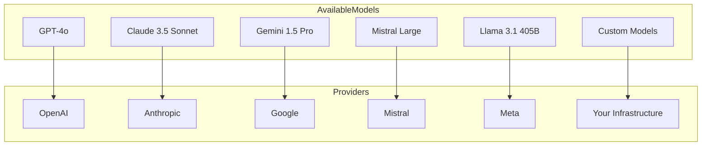
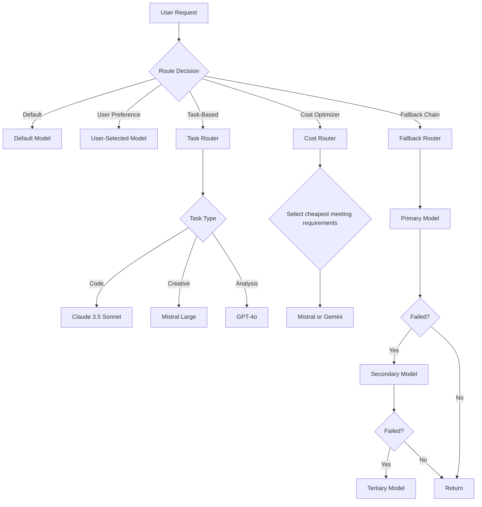

.------------------------------------------------------------------------------.
|                                                                              |
|   +----------------------------------------------------------------------+    |
|   ¦                                                                      ¦    |
|   ¦                       FAQS — MODEL QUESTIONS                          ¦    |
|   ¦                                                                      ¦    |
|   ¦                    inte11ect — Community Intelligence                 ¦    |
|   ¦                                                                      ¦    |
|   +----------------------------------------------------------------------+    |
|                                                                              |
'------------------------------------------------------------------------------'

---

# inte11ect FAQ: Model Questions

## Table of Contents

1. [What models are available?](#what-models-are-available)
2. [How do I choose a model?](#how-do-i-choose-a-model)
3. [How does model routing work?](#how-does-model-routing-work)
4. [Can I use custom models?](#can-i-use-custom-models)
5. [How do I fine-tune a model?](#how-do-i-fine-tune-a-model)
6. [What is the model proxy?](#what-is-the-model-proxy)
7. [How does model fallback work?](#how-does-model-fallback-work)
8. [What is context window management?](#what-is-context-window-management)
9. [How does prompt caching work?](#how-does-prompt-caching-work)
10. [What is temperature and how does it affect output?](#what-is-temperature-and-how-does-it-affect-output)
11. [How do system prompts work?](#how-do-system-prompts-work)
12. [What is token counting?](#what-is-token-counting)
13. [How does model versioning work?](#how-does-model-versioning-work)
14. [Can I run models locally?](#can-i-run-models-locally)
15. [What hardware is needed for local models?](#what-hardware-is-needed-for-local-models)
16. [How does streaming work across models?](#how-does-streaming-work-across-models)
17. [What is the model marketplace?](#what-is-the-model-marketplace)
18. [How are community models vetted?](#how-are-community-models-vetted)
19. [What is model telemetry?](#what-is-model-telemetry)
20. [How do I benchmark models?](#how-do-i-benchmark-models)

---

## What models are available?

inte11ect aggregates models from multiple providers:

| Provider | Available Models | Tier Access | Context Window |
|---|---|---|---|
| OpenAI | GPT-4o, GPT-4-turbo, GPT-3.5-turbo, o1-preview, o1-mini | All | Up to 128K |
| Anthropic | Claude 3.5 Sonnet, Claude 3 Opus, Claude 3 Haiku | All | Up to 200K |
| Google | Gemini 1.5 Pro, Gemini 1.5 Flash | Pro+ | Up to 1M |
| Mistral | Mistral Large, Mistral Small, Codestral | All | Up to 128K |
| Cohere | Command R+, Command R | Pro+ | Up to 128K |
| Meta (via proxy) | Llama 3.1 405B, 70B, 8B | All | Up to 128K |
| Community | User-uploaded fine-tuned models | Community+ | Varies |
| Local | Your own models via Ollama/vLLM | Enterprise | Configurable |



---

## How do I choose a model?

```python
class ModelSelector:
    def __init__(self):
        self.model_capabilities = {
            "gpt-4o": {"reasoning": 9, "creativity": 8, "code": 9, "speed": 8, "cost": 4},
            "claude-3-5-sonnet": {"reasoning": 9, "creativity": 9, "code": 8, "speed": 7, "cost": 4},
            "gemini-1.5-pro": {"reasoning": 8, "creativity": 7, "code": 8, "speed": 9, "cost": 5},
            "mistral-large": {"reasoning": 8, "creativity": 8, "code": 8, "speed": 9, "cost": 6},
            "llama-3.1-405b": {"reasoning": 8, "creativity": 7, "code": 8, "speed": 6, "cost": 7}
        }
    
    def recommend_model(self, task: str, priority: str = "balanced") -> str:
        task_profiles = {
            "coding": ["code", "reasoning"],
            "creative_writing": ["creativity", "reasoning"],
            "analysis": ["reasoning", "speed"],
            "customer_support": ["speed", "cost"],
            "research": ["reasoning", "creativity"],
            "translation": ["speed", "cost"],
            "summarization": ["speed", "reasoning"]
        }
        relevant = task_profiles.get(task, ["reasoning", "speed"])
        scores = {}
        for model, caps in self.model_capabilities.items():
            score = sum(caps.get(f, 0) for f in relevant)
            scores[model] = score
        if priority == "cost":
            for model in scores:
                scores[model] += self.model_capabilities[model]["cost"] * 2
        elif priority == "speed":
            for model in scores:
                scores[model] += self.model_capabilities[model]["speed"] * 2
        return max(scores, key=scores.get)
```

### Model Selection Guide

| Task | Recommended Model | Alternative |
|---|---|---|
| General chat | GPT-4o | Claude 3.5 Sonnet |
| Code generation | Claude 3.5 Sonnet | GPT-4o |
| Long document analysis | Gemini 1.5 Pro | Claude 3.5 Sonnet |
| Creative writing | Claude 3.5 Sonnet | Mistral Large |
| Data extraction | GPT-4o | Claude 3.5 Sonnet |
| Translation | Gemini 1.5 Pro | GPT-4o |
| Cost-sensitive | Mistral Large | Llama 3.1 70B |
| Maximum speed | Gemini 1.5 Flash | GPT-4o-mini |

---

## How does model routing work?



### Router Implementation

```python
class ModelRouter:
    def __init__(self, config: dict):
        self.config = config
        self.strategies = {
            "default": DefaultRouter(),
            "task": TaskRouter(),
            "cost": CostRouter(),
            "latency": LatencyRouter(),
            "fallback": FallbackRouter(self.config.get("fallback", []))
        }
    
    async def route(self, request: ChatRequest, user: User) -> tuple[str, str]:
        strategy = request.routing_strategy or user.preferred_strategy or "default"
        router = self.strategies.get(strategy)
        if not router:
            raise ValueError(f"Unknown strategy: {strategy}")
        provider, model = await router.select(request, user)
        return provider, model

class TaskRouter:
    async def select(self, request: ChatRequest, user: User) -> tuple[str, str]:
        task = self.classify_task(request.messages)
        task_map = {
            "coding": ("anthropic", "claude-3-5-sonnet-20241022"),
            "creative": ("mistral", "mistral-large-latest"),
            "analysis": ("openai", "gpt-4o"),
            "long_context": ("google", "gemini-1.5-pro"),
            "general": ("openai", "gpt-4o")
        }
        return task_map.get(task, task_map["general"])
    
    def classify_task(self, messages: list[dict]) -> str:
        text = " ".join(m.get("content", "") for m in messages).lower()
        code_kw = ["code", "function", "bug", "debug", "api", "python", "javascript"]
        creative_kw = ["story", "poem", "creative", "write", "essay"]
        analysis_kw = ["analyze", "compare", "evaluate", "summarize", "extract"]
        long_kw = ["long", "book", "document", "research paper"]
        
        scores = {
            "coding": sum(1 for kw in code_kw if kw in text),
            "creative": sum(1 for kw in creative_kw if kw in text),
            "analysis": sum(1 for kw in analysis_kw if kw in text),
            "long_context": sum(1 for kw in long_kw if kw in text)
        }
        max_score = max(scores.values())
        return "general" if max_score == 0 else max(scores, key=scores.get)

class CostRouter:
    async def select(self, request: ChatRequest, user: User) -> tuple[str, str]:
        cost_ranking = [
            ("mistral", "mistral-large-latest", 2),
            ("google", "gemini-1.5-flash", 1),
            ("openai", "gpt-4o-mini", 1),
            ("openai", "gpt-4o", 3),
            ("anthropic", "claude-3-5-sonnet-20241022", 3)
        ]
        sorted_models = sorted(cost_ranking, key=lambda x: x[2])
        for provider, model, cost in sorted_models:
            if await self.check_availability(provider, model):
                return provider, model
        return cost_ranking[-1][0], cost_ranking[-1][1]
```

---

## Can I use custom models?

Yes, Enterprise tier supports custom model integration:

```yaml
custom_models:
  - name: my-fine-tuned-model
    provider: custom
    endpoint: http://my-model-service:8000/v1
    api_key: ${CUSTOM_MODEL_KEY}
    format: openai
    context_window: 32768
    capabilities:
      - chat
      - completion
      - embedding
    metadata:
      description: "Fine-tuned model for legal document analysis"
      version: "1.2.0"
      author: "Legal Team"
      base_model: "llama-3.1-8b"
```

### Registering via API

```bash
curl -X POST https://api.inte11ect.dev/v1/models/custom \
  -H "Authorization: Bearer ${ENTERPRISE_TOKEN}" \
  -H "Content-Type: application/json" \
  -d '{
    "name": "my-legal-model",
    "endpoint": "http://10.0.1.50:8000/v1",
    "format": "openai",
    "api_key": "sk-custom-key",
    "context_window": 32768,
    "capabilities": ["chat", "completion"]
  }'
```

---

## How do I fine-tune a model?

```python
class FineTuningPipeline:
    def __init__(self, api_key: str):
        self.client = openai.OpenAI(api_key=api_key)
    
    def prepare_dataset(self, conversations: list[dict], output_file: str):
        with open(output_file, "w") as f:
            for conv in conversations:
                messages = []
                for msg in conv["messages"]:
                    messages.append({"role": msg["role"], "content": msg["content"]})
                f.write(json.dumps({"messages": messages}) + "\n")
    
    def validate_dataset(self, file_path: str) -> list[str]:
        errors = []
        with open(file_path) as f:
            for i, line in enumerate(f, 1):
                try:
                    entry = json.loads(line)
                    if "messages" not in entry:
                        errors.append(f"Line {i}: missing messages")
                except json.JSONDecodeError:
                    errors.append(f"Line {i}: invalid JSON")
        return errors
    
    def create_fine_tune_job(self, training_file: str, model: str = "gpt-4o-mini") -> str:
        with open(training_file, "rb") as f:
            upload = self.client.files.create(file=f, purpose="fine-tune")
        job = self.client.fine_tuning.jobs.create(
            training_file=upload.id,
            model=model,
            hyperparameters={"n_epochs": 3, "batch_size": 4, "learning_rate_multiplier": 0.1}
        )
        return job.id
    
    def monitor_job(self, job_id: str):
        while True:
            job = self.client.fine_tuning.jobs.retrieve(job_id)
            print(f"Status: {job.status}")
            if job.status == "succeeded":
                print(f"Fine-tuned model: {job.fine_tuned_model}")
                return job.fine_tuned_model
            elif job.status == "failed":
                raise Exception(f"Fine-tuning failed: {job.error}")
            time.sleep(30)
```

---

## What is the model proxy?

```python
class ModelProxy:
    def __init__(self):
        self.providers = {
            "openai": OpenAIProvider(),
            "anthropic": AnthropicProvider(),
            "google": GoogleProvider(),
            "mistral": MistralProvider(),
            "local": LocalProvider()
        }
    
    async def chat_completion(self, provider: str, model: str, messages: list[dict], **kwargs):
        return await self.providers[provider].chat(model=model, messages=messages, **kwargs)
    
    async def stream_chat(self, provider: str, model: str, messages: list[dict], **kwargs):
        async for chunk in self.providers[provider].stream(model=model, messages=messages, **kwargs):
            yield chunk

class OpenAIProvider:
    def __init__(self):
        self.client = openai.AsyncOpenAI(api_key=os.environ.get("OPENAI_API_KEY"))
    
    async def chat(self, model: str, messages: list[dict], **kwargs):
        response = await self.client.chat.completions.create(model=model, messages=messages, **kwargs)
        return response.choices[0].message.content
    
    async def stream(self, model: str, messages: list[dict], **kwargs):
        stream = await self.client.chat.completions.create(model=model, messages=messages, stream=True, **kwargs)
        async for chunk in stream:
            if chunk.choices[0].delta.content:
                yield {"type": "content", "content": chunk.choices[0].delta.content}

class AnthropicProvider:
    def __init__(self):
        self.client = anthropic.AsyncAnthropic(api_key=os.environ.get("ANTHROPIC_API_KEY"))
    
    async def chat(self, model: str, messages: list[dict], **kwargs):
        response = await self.client.messages.create(model=model, messages=messages, **kwargs)
        return response.content[0].text
    
    async def stream(self, model: str, messages: list[dict], **kwargs):
        async with self.client.messages.stream(model=model, messages=messages, **kwargs) as stream:
            async for text in stream.text_stream:
                yield {"type": "content", "content": text}
```

---

## How does model fallback work?

```yaml
model_fallback:
  enabled: true
  max_retries: 3
  chains:
    default:
      - provider: openai
        model: gpt-4o
      - provider: anthropic
        model: claude-3-5-sonnet-20241022
      - provider: mistral
        model: mistral-large-latest
    fast:
      - provider: google
        model: gemini-1.5-flash
      - provider: openai
        model: gpt-4o-mini
    code:
      - provider: anthropic
        model: claude-3-5-sonnet-20241022
      - provider: openai
        model: gpt-4o
  fallback_triggers:
    - rate_limited
    - timeout
    - server_error
    - quota_exceeded
    - model_unavailable
```

### Fallback Implementation

```python
class FallbackRouter:
    def __init__(self, fallback_chains: dict):
        self.chains = fallback_chains
    
    async def execute_with_fallback(self, request: ChatRequest, chain_name: str = "default"):
        chain = self.chains.get(chain_name, self.chains["default"])
        last_error = None
        for provider_config in chain:
            try:
                response = await self.model_proxy.chat_completion(
                    provider=provider_config["provider"],
                    model=provider_config["model"],
                    messages=request.messages,
                    timeout=30
                )
                if last_error:
                    logger.info(f"Fallback: {chain[0]['model']} -> {provider_config['model']}")
                return response
            except (RateLimitError, TimeoutError, ServerError) as e:
                last_error = e
                logger.warning(f"Failed on {provider_config['model']}, trying next...")
                await asyncio.sleep(2)
        raise AllProvidersFailedError(f"All providers failed: {last_error}")
```

---

## What is context window management?

```python
class ContextWindowManager:
    def __init__(self, max_tokens: int = 128000):
        self.max_tokens = max_tokens
        self.reserve_tokens = 4000
    
    def optimize_context(self, messages: list[dict], model: str) -> list[dict]:
        available = self.get_model_limit(model) - self.reserve_tokens
        current = self.count_tokens(messages)
        if current <= available:
            return messages
        if len(messages) > 2:
            truncated = self.truncate_oldest(messages, available)
            if truncated:
                return truncated
        if len(messages) > 4:
            summarized = self.summarize_history(messages, available)
            if summarized:
                return summarized
        return self.aggressive_truncation(messages, available)
    
    def count_tokens(self, messages: list[dict]) -> int:
        text = "".join(m.get("content", "") for m in messages)
        return len(text) // 4
    
    def get_model_limit(self, model: str) -> int:
        limits = {
            "gpt-4o": 128000, "claude-3-5-sonnet": 200000,
            "gemini-1.5-pro": 1000000, "mistral-large": 128000,
            "llama-3.1-405b": 128000
        }
        return limits.get(model, 128000)
    
    def truncate_oldest(self, messages: list[dict], available: int) -> list[dict] | None:
        system = [m for m in messages if m["role"] == "system"]
        non_system = [m for m in messages if m["role"] != "system"]
        truncated = list(system)
        for msg in reversed(non_system):
            token_count = self.count_tokens(truncated + [msg])
            if token_count <= available:
                truncated.append(msg)
            else:
                break
        return truncated if len(truncated) >= 2 else None
```

---

## How does prompt caching work?

```python
class PromptCache:
    def __init__(self, cache_backend: CacheManager):
        self.backend = cache_backend
    
    async def get_cached_prefix(self, conversation_id: str) -> str | None:
        return await self.backend.get(f"prefix:{conversation_id}")
    
    async def set_cached_prefix(self, conversation_id: str, prefix: str):
        await self.backend.setex(f"prefix:{conversation_id}", 600, prefix)
    
    def extract_cacheable_prefix(self, messages: list[dict]) -> str:
        cacheable = []
        for msg in messages[:-1]:
            if msg["role"] == "system":
                cacheable.append(msg["content"])
            elif msg["role"] == "user":
                cacheable.append(f"User: {msg['content']}")
            elif msg["role"] == "assistant":
                cacheable.append(f"Assistant: {msg['content']}")
        return "\n".join(cacheable)
```

---

## What is temperature and how does it affect output?

| Temperature | Effect | Use Case |
|---|---|---|
| 0.0 - 0.2 | Deterministic, focused | Code generation, facts |
| 0.3 - 0.5 | Balanced, reliable | Analysis, summarization |
| 0.6 - 0.8 | Creative, varied | Creative writing, brainstorming |
| 0.9 - 1.0 | Highly random | Poetry, idea generation |

---

## How do system prompts work?

```yaml
system_prompt_templates:
  default: "You are a helpful AI assistant."
  code_assistant: |
    You are an expert software engineer. Provide clean, well-documented code.
    Follow best practices and design patterns.
    Explain your reasoning when appropriate.
  customer_support: |
    You are a helpful customer support agent.
    Be polite, professional, and concise.
    If you don't know something, say so honestly.
  analyst: |
    You are a data analyst. Provide thorough analysis with evidence.
    Use structured formats when appropriate.
    Highlight key insights and actionable recommendations.
```

---

## What is token counting?

```python
class TokenCounter:
    def __init__(self, model: str):
        self.model = model
    
    def count_tokens(self, text: str) -> int:
        return len(text) // 4
    
    def count_messages(self, messages: list[dict]) -> dict:
        total = 0
        per_message = []
        for msg in messages:
            tokens = self.count_tokens(msg.get("content", ""))
            total += tokens
            per_message.append({"role": msg["role"], "tokens": tokens})
        return {"total": total, "per_message": per_message, "message_count": len(messages)}
    
    def estimate_cost(self, input_tokens: int, output_tokens: int, model: str) -> float:
        pricing = {
            "gpt-4o": {"input": 2.50, "output": 10.00},
            "claude-3-5-sonnet": {"input": 3.00, "output": 15.00},
            "gemini-1.5-pro": {"input": 3.50, "output": 10.50}
        }
        p = pricing.get(model, pricing["gpt-4o"])
        return (input_tokens / 1e6 * p["input"]) + (output_tokens / 1e6 * p["output"])
```

---

## How does model versioning work?

```python
class ModelVersionManager:
    def __init__(self):
        self.version_map = {
            "gpt-4o": {"latest": "gpt-4o-2024-08-06", "stable": "gpt-4o-2024-05-13"},
            "claude-3-5-sonnet": {"latest": "claude-3-5-sonnet-20241022", "stable": "claude-3-5-sonnet-20240620"},
            "gemini-1.5-pro": {"latest": "gemini-1.5-pro-002", "stable": "gemini-1.5-pro-001"}
        }
    
    def resolve_model(self, alias: str, version: str = "stable") -> str:
        mv = self.version_map.get(alias)
        return mv.get(version, mv["stable"]) if mv else alias
    
    def is_deprecated(self, model: str) -> bool:
        return model in ["gpt-3.5-turbo-0301", "gpt-4-0314", "claude-2.0"]
```

---

## Can I run models locally?

```yaml
local_models:
  provider: vllm
  endpoint: http://localhost:8000/v1
  models:
    - name: llama-3.1-8b
      path: /models/llama-3.1-8b
      context_window: 32768
      gpu_memory_utilization: 0.9
    - name: mixtral-8x7b
      path: /models/mixtral-8x7b
      context_window: 32768
      tensor_parallel_size: 2
  ollama:
    enabled: true
    endpoint: http://localhost:11434
    models:
      - llama3.1:8b
      - mistral:7b
      - codellama:34b
```

---

## What hardware is needed for local models?

| Model Size | GPU Required | RAM | Storage |
|---|---|---|---|
| 7B - 8B | 1x RTX 4090 (24GB) | 32 GB | 15 GB |
| 13B - 20B | 2x RTX 4090 | 64 GB | 30 GB |
| 34B - 40B | 4x RTX 4090 | 128 GB | 60 GB |
| 70B | 2x A100 (80GB) | 256 GB | 140 GB |
| 405B | 8x H100 | 1 TB | 800 GB |

---

## How do I benchmark models?

```bash
inte11ect benchmark --model gpt-4o --prompts benchmark_prompts.json --concurrency 10
```

### Benchmark Output

```json
{
  "model": "gpt-4o",
  "total_requests": 100,
  "successful": 98,
  "failed": 2,
  "avg_latency_ms": 1234,
  "p50_latency_ms": 1100,
  "p95_latency_ms": 2500,
  "p99_latency_ms": 4000,
  "avg_tokens_per_second": 45.2,
  "error_rate": 0.02
}
```

---

## Model Configuration Reference

```json
{
  "model": "gpt-4o",
  "parameters": {
    "temperature": 0.7,
    "max_tokens": 4096,
    "top_p": 0.9,
    "frequency_penalty": 0.0,
    "presence_penalty": 0.0,
    "stop": [],
    "stream": false
  }
}
```

---

## Related FAQs

- [General Questions](01-faqs.md)
- [Technical Questions](02-faqs.md)
- [Security & Compliance](03-faqs.md)
- [Deployment Questions](04-faqs.md)
- [Audit & Ledger](06-faqs.md)
- [Troubleshooting](07-faqs.md)
- [Pricing & Licensing](08-faqs.md)

---

```
Lois-Kleinner and 0-1.gg 2026 — Confidential
```

```
.====================================================================.
!  Made in the UAE, Dubai #DubaiIt #Dubai #Dxb #SovereignAI          !
!  Made in The Emirates #Dubai_it                                    !
!                                                                    !
!  Lois-Kleinner Alpasan - The Anticloud 2026-                       !
!                                                                    !
!  As seen on:                                                       !
!  Harvard Dataverse ! Zenodo/CERN ! Academia.edu ! HuggingFace      !
!  anticloud.telepedia.net ! anticloud.fandom.com                    !
!                                                                    !
!  0-1.gg ! GitHub ! LinkedIn ! DEV ! GH Pages                       !
!  HuggingFace ! Blog ! Bluesky ! Mastodon                           !
!  Internet Archive ! ORCID ! Figshare                               !
!                                                                    !
!  Sovereign AI ! Local-First ! Privacy ! Zero Trust ! No Datacenter !
!  Air-Gapped ! Open Source ! Rust ! Hash Chain ! Single Binary      !
!  Offline LLM ! Crypto Ledger ! P2P ! Federated                     !
'===================================================================='
```

Lois-Kleinner Alpasan, 22, builds sovereign AI infrastructure and cryptographic audit systems. His work spans formats, proptech, and research platforms serving projects valued at over $1B combined, operating at the intersection of AI, media, and decentralized technology.

References:
1. Lois-Kleinner Zenodo: https://doi.org/10.5281/zenodo.20781790
2. Lois-Kleinner GitHub: https://github.com/kleinnner/Anticloud/tree/main/04-aioss-format
3. Lois-Kleinner Harvard DV: https://doi.org/10.7910/DVN/FSHFZF
4. Lois-Kleinner Internet Arc: https://archive.org/details/aioss-format
5. Lois-Kleinner ORCID: https://orcid.org/0009-0009-2233-6107
6. Lois-Kleinner DEV.to: https://dev.to/kleinner
7. Lois-Kleinner LinkedIn: https://linkedin.com/in/kleinner
8. Lois-Kleinner HuggingFace: https://huggingface.co/Anticloud
9. Lois-Kleinner Tumblr: https://anticloud.tumblr.com
10. Lois-Kleinner Mastodon: https://mastodon.social/@kleinner
11. Lois-Kleinner Bluesky: https://bsky.app/profile/kleinner.bsky.social
12. 0-1.gg: https://0-1.gg
13. Lois-Kleinner Figshare: https://figshare.com/authors/Lois-Kleinner_Alpasan/20849885
14. Lois-Kleinner Academia: https://independent.academia.edu/kleinner
15. Lois-Kleinner Telepedia: https://anticloud.telepedia.net/wiki/Anticloud_by_Lois-Kleinner_Wiki
16. Lois-Kleinner Fandom: https://anticloud.fandom.com
17. AIOSS Offline Verification Kit: https://dataverse.harvard.edu/dataset.xhtml?persistentId=doi:10.7910/DVN/OORKNJ