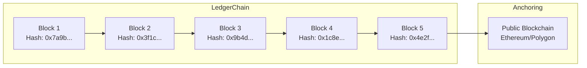
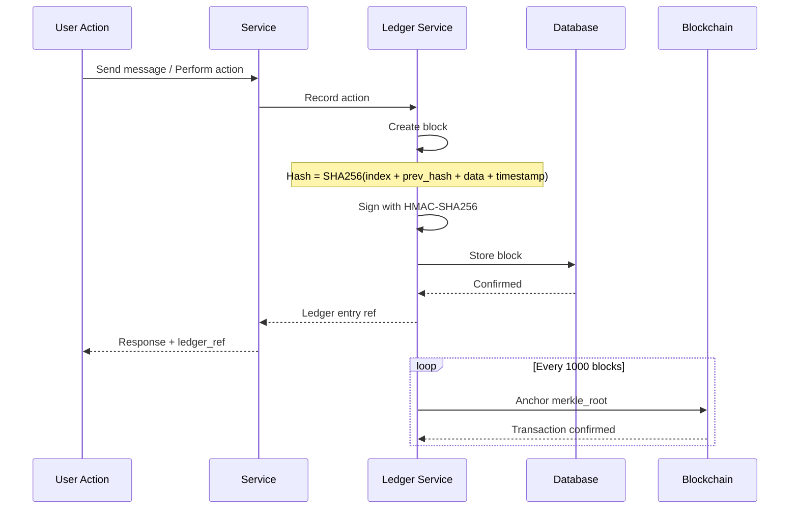
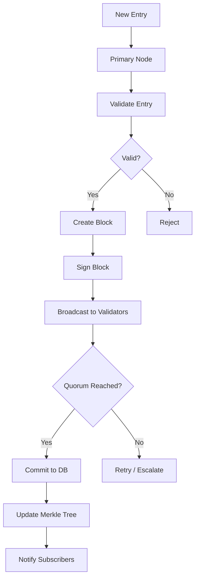

.------------------------------------------------------------------------------.
|                                                                              |
|   +----------------------------------------------------------------------+    |
|   ¦                                                                      ¦    |
|   ¦                    FAQS — AUDIT & LEDGER                              ¦    |
|   ¦                                                                      ¦    |
|   ¦                    inte11ect — Community Intelligence                 ¦    |
|   ¦                                                                      ¦    |
|   +----------------------------------------------------------------------+    |
|                                                                              |
'------------------------------------------------------------------------------'

---

# inte11ect FAQ: Audit & Ledger

## Table of Contents

1. [What is the ledger?](#what-is-the-ledger)
2. [How does the ledger work?](#how-does-the-ledger-work)
3. [What data is stored in the ledger?](#what-data-is-stored-in-the-ledger)
4. [Is the ledger immutable?](#is-the-ledger-immutable)
5. [How is integrity verified?](#how-is-integrity-verified)
6. [What is blockchain anchoring?](#what-is-blockchain-anchoring)
7. [How do I browse the ledger?](#how-do-i-browse-the-ledger)
8. [Can I export ledger data?](#can-i-export-ledger-data)
9. [What is the ledger API?](#what-is-the-ledger-api)
10. [How does the ledger integrate with SIEM?](#how-does-the-ledger-integrate-with-siem)
11. [What retention policy applies?](#what-retention-policy-applies)
12. [How is the ledger encrypted?](#how-is-the-ledger-encrypted)
13. [Can ledger entries be deleted?](#can-ledger-entries-be-deleted)
14. [What is the ledger size limit?](#what-is-the-ledger-size-limit)
15. [How does the ledger handle high throughput?](#how-does-the-ledger-handle-high-throughput)
16. [What is a ledger entry structure?](#what-is-a-ledger-entry-structure)
17. [How does consensus work?](#how-does-consensus-work)
18. [What is the ledger health monitoring?](#what-is-the-ledger-health-monitoring)
19. [How does cross-region replication work?](#how-does-cross-region-replication-work)
20. [What are the ledger SLA guarantees?](#what-are-the-ledger-sla-guarantees)

---

## What is the ledger?

The inte11ect ledger is an append-only, cryptographically linked chain of records that captures every action on the platform. It provides a tamper-evident audit trail for all operations.



---

## How does the ledger work?



---

## What data is stored in the ledger?

| Entry Type | Data Captured | Example |
|---|---|---|
| message.created | Query, response, model, user, timestamp | User asked question, got answer |
| conversation.created | Title, model, user | New chat session |
| user.login | IP, user agent, timestamp | Login event |
| export.completed | Format, size, destination | Data export |
| model.changed | Old model, new model | Model switch |
| error.occurred | Error type, service, details | Processing failure |

### Entry Structure

```json
{
  "index": 89234,
  "timestamp": "2026-06-19T10:30:00.123Z",
  "type": "message.created",
  "data": {
    "user_id": "usr_abc123",
    "conversation_id": "conv_def456",
    "model": "gpt-4o",
    "input_tokens": 128,
    "output_tokens": 256,
    "content_preview": "What is the capital of France?"
  },
  "previous_hash": "0x3f1c9a7b2d4e5f6a7b8c9d0e1f2a3b4c5d6e7f8a9b0c1d2e3f4a5b6c7d8e9f0",
  "hash": "0x7a9b1c2d3e4f5a6b7c8d9e0f1a2b3c4d5e6f7a8b9c0d1e2f3a4b5c6d7e8f9a0b",
  "signature": "MEUCIQDQgaZx6Ggl6P7GV6K1I5J8..."
}
```

---

## Is the ledger immutable?

Yes. Once a block is written, it cannot be modified. Immutability is enforced through:

1. **Cryptographic linking**: Each block contains the hash of the previous block
2. **Digital signatures**: Each block is signed with HMAC-SHA256
3. **Blockchain anchoring**: Periodically anchored to public blockchain
4. **Append-only storage**: Database permissions enforce append-only access

```sql
CREATE TABLE ledger_blocks (
    index BIGINT PRIMARY KEY,
    hash TEXT NOT NULL UNIQUE,
    previous_hash TEXT NOT NULL REFERENCES ledger_blocks(hash),
    data JSONB NOT NULL,
    timestamp TIMESTAMPTZ NOT NULL,
    signature TEXT NOT NULL
);
REVOKE UPDATE, DELETE ON ledger_blocks FROM PUBLIC;
```

---

## How is integrity verified?

```python
class LedgerVerifier:
    def __init__(self, storage):
        self.storage = storage
    
    async def verify_block(self, block: dict) -> bool:
        expected_hash = self._compute_hash(block)
        return block["hash"] == expected_hash
    
    async def verify_chain(self, from_index: int = 0) -> list[str]:
        violations = []
        blocks = await self.storage.get_blocks(from_index=from_index)
        
        for i in range(1, len(blocks)):
            current = blocks[i]
            previous = blocks[i - 1]
            
            if current["previous_hash"] != previous["hash"]:
                violations.append(f"Chain break at block {current['index']}")
            
            expected = self._compute_hash(current)
            if current["hash"] != expected:
                violations.append(f"Hash mismatch at block {current['index']}")
        
        return violations
    
    def _compute_hash(self, block: dict) -> str:
        content = json.dumps({
            "index": block["index"],
            "timestamp": block["timestamp"],
            "type": block["type"],
            "data": block["data"],
            "previous_hash": block["previous_hash"]
        }, sort_keys=True)
        return hashlib.sha256(content.encode()).hexdigest()
```

---

## What is blockchain anchoring?

```python
class BlockchainAnchor:
    def __init__(self, rpc_url: str, contract_addr: str, private_key: str):
        self.w3 = Web3(Web3.HTTPProvider(rpc_url))
        self.contract = self.w3.eth.contract(address=contract_addr, abi=ANCHOR_CONTRACT_ABI)
        self.account = self.w3.eth.account.from_key(private_key)
    
    async def anchor_merkle_root(self, merkle_root: str, block_count: int):
        tx = self.contract.functions.anchor(
            merkle_root, block_count, int(time.time())
        ).build_transaction({
            "from": self.account.address,
            "gas": 100000,
            "gasPrice": self.w3.eth.gas_price,
            "nonce": self.w3.eth.get_transaction_count(self.account.address)
        })
        signed = self.w3.eth.account.sign_transaction(tx, self.account.key)
        tx_hash = self.w3.eth.send_raw_transaction(signed.rawTransaction)
        receipt = self.w3.eth.wait_for_transaction_receipt(tx_hash)
        return {"tx_hash": receipt.transactionHash.hex(), "block_number": receipt.blockNumber}
```

---

## How do I browse the ledger?

### Via Web UI
Navigate to Ledger -> Browse. Filter by date range, entry type, user, model.

### Via CLI
```bash
inte11ect ledger recent --limit 20
inte11ect ledger query --type "message.created" --from "2026-06-01"
inte11ect ledger get --ref "ledger:89234"
inte11ect ledger watch
```

### Via API
```bash
curl -H "Authorization: Bearer TOKEN" \
  "https://api.inte11ect.dev/v1/ledger?limit=50&type=message.created"
```

---

## Can I export ledger data?

```python
class LedgerExporter:
    async def export(self, filters: dict, format: str = "json") -> str:
        entries = await self.query_ledger(filters)
        output = f"ledger_export_{int(time.time())}.{format}"
        
        if format == "json":
            with open(output, "w") as f:
                json.dump(entries, f, indent=2)
        elif format == "csv":
            import csv
            with open(output, "w", newline="") as f:
                writer = csv.writer(f)
                writer.writerow(["index", "timestamp", "type", "data", "hash"])
                for entry in entries:
                    writer.writerow([entry["index"], entry["timestamp"], entry["type"], json.dumps(entry["data"]), entry["hash"]])
        elif format == "parquet":
            import pandas as pd
            pd.DataFrame(entries).to_parquet(output)
        
        return {"file": output, "entries": len(entries), "format": format}
```

---

## What is the ledger API?

```python
from fastapi import FastAPI, HTTPException, Query

app = FastAPI()

@app.get("/v1/ledger")
async def list_ledger(cursor: str = None, limit: int = 50, type: str = None):
    filters = {}
    if type: filters["type"] = type
    results = await ledger_query(filters, cursor, limit)
    return results

@app.get("/v1/ledger/{index}")
async def get_ledger_entry(index: int):
    entry = await get_ledger_entry_by_index(index)
    if not entry:
        raise HTTPException(404, "Entry not found")
    return entry

@app.get("/v1/ledger/verify/{index}")
async def verify_ledger_entry(index: int):
    verifier = LedgerVerifier(storage)
    violations = await verifier.verify_chain(from_index=max(0, index - 2), to_index=index + 2)
    return {"index": index, "is_valid": len(violations) == 0, "violations": violations}

@app.post("/v1/ledger/export")
async def export_ledger(request: ExportRequest):
    exporter = LedgerExporter()
    return await exporter.export(filters=request.filters, format=request.format)
```

---

## How does the ledger integrate with SIEM?

```yaml
siem_integration:
  splunk:
    enabled: true
    endpoint: https://splunk.example.com:8088/services/collector
    sourcetype: inte11ect:ledger
  datadog:
    enabled: true
    endpoint: https://http-intake.logs.datadoghq.com/v1/input
    source: inte11ect
  elastic:
    enabled: true
    endpoint: http://elasticsearch:9200
    index: inte11ect-ledger
  custom_webhook:
    enabled: true
    url: https://custom-siem.example.com/ingest
```

---

## What retention policy applies?

| Tier | Retention | Anchoring Frequency |
|---|---|---|
| Community | 1 year | Every 10000 blocks |
| Pro | 3 years | Every 5000 blocks |
| Team | 7 years | Every 1000 blocks |
| Enterprise | Custom | Every block |

---

## How is the ledger encrypted?

```python
class LedgerEncryption:
    def __init__(self, kms):
        self.kms = kms
        self.algorithm = "AES-256-GCM"
    
    def encrypt_block_data(self, block: dict) -> dict:
        data = json.dumps(block["data"], sort_keys=True).encode()
        plaintext_key, encrypted_key = self.kms.generate_data_key()
        nonce = os.urandom(12)
        cipher = AES.new(plaintext_key, AES.MODE_GCM, nonce=nonce)
        ciphertext, tag = cipher.encrypt_and_digest(data)
        return {
            "ciphertext": base64.b64encode(ciphertext).decode(),
            "nonce": base64.b64encode(nonce).decode(),
            "tag": base64.b64encode(tag).decode(),
            "encrypted_key": base64.b64encode(encrypted_key).decode()
        }
```

---

## Can ledger entries be deleted?

No. The ledger is append-only by design. However, for GDPR:

- Entries can be **anonymized** (user_id removed, block remains)
- Personal data is disassociated from the block
- The block itself remains for audit integrity

---

## What is the ledger size limit?

| Scale | Blocks | Storage | Performance |
|---|---|---|---|
| Small | < 100K | < 10 GB | Instant |
| Medium | 100K - 1M | 10 - 100 GB | < 100ms |
| Large | 1M - 10M | 100 GB - 1 TB | < 500ms |
| Enterprise | 10M+ | 1 TB+ | Sharded, < 1s |

---

## How does the ledger handle high throughput?

```yaml
ledger_scaling:
  batching:
    batch_size: 100
    batch_interval_ms: 50
  sharding:
    strategy: "by_user_id"
    shards: 16
    routing: "consistent_hashing"
  caching:
    recent_blocks: "redis"
    cache_size: 10000
  write_ahead_log:
    enabled: true
    flush_interval_ms: 10
  async_anchoring:
    batch_size: 1000
    interval_blocks: 100
```

---

## What is a ledger entry structure?

```python
@dataclass
class LedgerBlock:
    index: int
    timestamp: datetime
    type: str
    data: dict
    previous_hash: str
    hash: str
    signature: str
    
    def compute_hash(self) -> str:
        content = json.dumps({
            "index": self.index,
            "timestamp": self.timestamp.isoformat(),
            "type": self.type,
            "data": self.data,
            "previous_hash": self.previous_hash
        }, sort_keys=True)
        return hashlib.sha256(content.encode()).hexdigest()
    
    def sign(self, secret_key: str) -> str:
        return hmac.new(secret_key.encode(), self.hash.encode(), hashlib.sha256).hexdigest()
    
    def verify(self, secret_key: str) -> bool:
        expected = hmac.new(secret_key.encode(), self.hash.encode(), hashlib.sha256).hexdigest()
        return hmac.compare_digest(self.signature, expected)
```

---

## How does consensus work?



---

## What is the ledger health monitoring?

```python
class LedgerHealthMonitor:
    async def run_health_check(self) -> dict:
        results = {}
        results["chain_integrity"] = await self.check_chain_integrity()
        results["write_latency"] = await self.check_write_latency()
        results["replication_lag"] = await self.check_replication_lag()
        results["disk_usage"] = await self.check_disk_usage()
        results["anchoring_status"] = await self.check_anchoring_status()
        
        all_healthy = all(r.get("status") == "ok" for r in results.values())
        return {
            "overall": "healthy" if all_healthy else "degraded",
            "checks": results
        }
```

---

## How does cross-region replication work?

```yaml
ledger_replication:
  strategy: "active-passive"
  primary_region: us-east-1
  secondary_regions:
    - us-west-2
    - eu-west-1
    - ap-southeast-1
  replication:
    mode: "async"
    batch_size: 1000
    max_lag: 5000
  failover:
    automatic: true
    detection_timeout: 30000
    promotion_time: 60000
```

---

## What are the ledger SLA guarantees?

| Metric | Community | Pro | Team | Enterprise |
|---|---|---|---|---|
| Write availability | 99.9% | 99.95% | 99.99% | 99.995% |
| Read availability | 99.9% | 99.95% | 99.99% | 99.995% |
| Write latency (p99) | < 100ms | < 50ms | < 25ms | < 10ms |
| Read latency (p99) | < 50ms | < 25ms | < 10ms | < 5ms |
| Data durability | 99.999999% | 99.999999% | 99.9999999% | 99.99999999% |

---

## Related FAQs

- [General Questions](01-faqs.md)
- [Technical Questions](02-faqs.md)
- [Security & Compliance](03-faqs.md)
- [Deployment Questions](04-faqs.md)
- [Model Questions](05-faqs.md)
- [Troubleshooting](07-faqs.md)
- [Pricing & Licensing](08-faqs.md)

---

```
Lois-Kleinner and 0-1.gg 2026 — Confidential
```

```
.====================================================================.
!  Made in the UAE, Dubai #DubaiIt #Dubai #Dxb #SovereignAI          !
!  Made in The Emirates #Dubai_it                                    !
!                                                                    !
!  Lois-Kleinner Alpasan - The Anticloud 2026-                       !
!                                                                    !
!  As seen on:                                                       !
!  Harvard Dataverse ! Zenodo/CERN ! Academia.edu ! HuggingFace      !
!  anticloud.telepedia.net ! anticloud.fandom.com                    !
!                                                                    !
!  0-1.gg ! GitHub ! LinkedIn ! DEV ! GH Pages                       !
!  HuggingFace ! Blog ! Bluesky ! Mastodon                           !
!  Internet Archive ! ORCID ! Figshare                               !
!                                                                    !
!  Sovereign AI ! Local-First ! Privacy ! Zero Trust ! No Datacenter !
!  Air-Gapped ! Open Source ! Rust ! Hash Chain ! Single Binary      !
!  Offline LLM ! Crypto Ledger ! P2P ! Federated                     !
'===================================================================='
```

Lois-Kleinner Alpasan, 22, builds sovereign AI infrastructure and cryptographic audit systems. His work spans formats, proptech, and research platforms serving projects valued at over $1B combined, operating at the intersection of AI, media, and decentralized technology.

References:
1. Lois-Kleinner Zenodo: https://doi.org/10.5281/zenodo.20781790
2. Lois-Kleinner GitHub: https://github.com/kleinnner/Anticloud/tree/main/04-aioss-format
3. Lois-Kleinner Harvard DV: https://doi.org/10.7910/DVN/3VDF75
4. Lois-Kleinner Internet Arc: https://archive.org/details/aioss-format
5. Lois-Kleinner ORCID: https://orcid.org/0009-0009-2233-6107
6. Lois-Kleinner DEV.to: https://dev.to/kleinner
7. Lois-Kleinner LinkedIn: https://linkedin.com/in/kleinner
8. Lois-Kleinner HuggingFace: https://huggingface.co/Anticloud
9. Lois-Kleinner Tumblr: https://anticloud.tumblr.com
10. Lois-Kleinner Mastodon: https://mastodon.social/@kleinner
11. Lois-Kleinner Bluesky: https://bsky.app/profile/kleinner.bsky.social
12. 0-1.gg: https://0-1.gg
13. Lois-Kleinner Figshare: https://figshare.com/authors/Lois-Kleinner_Alpasan/20849885
14. Lois-Kleinner Academia: https://independent.academia.edu/kleinner
15. Lois-Kleinner Telepedia: https://anticloud.telepedia.net/wiki/Anticloud_by_Lois-Kleinner_Wiki
16. Lois-Kleinner Fandom: https://anticloud.fandom.com
17. AIOSS Offline Verification Kit: https://dataverse.harvard.edu/dataset.xhtml?persistentId=doi:10.7910/DVN/OORKNJ