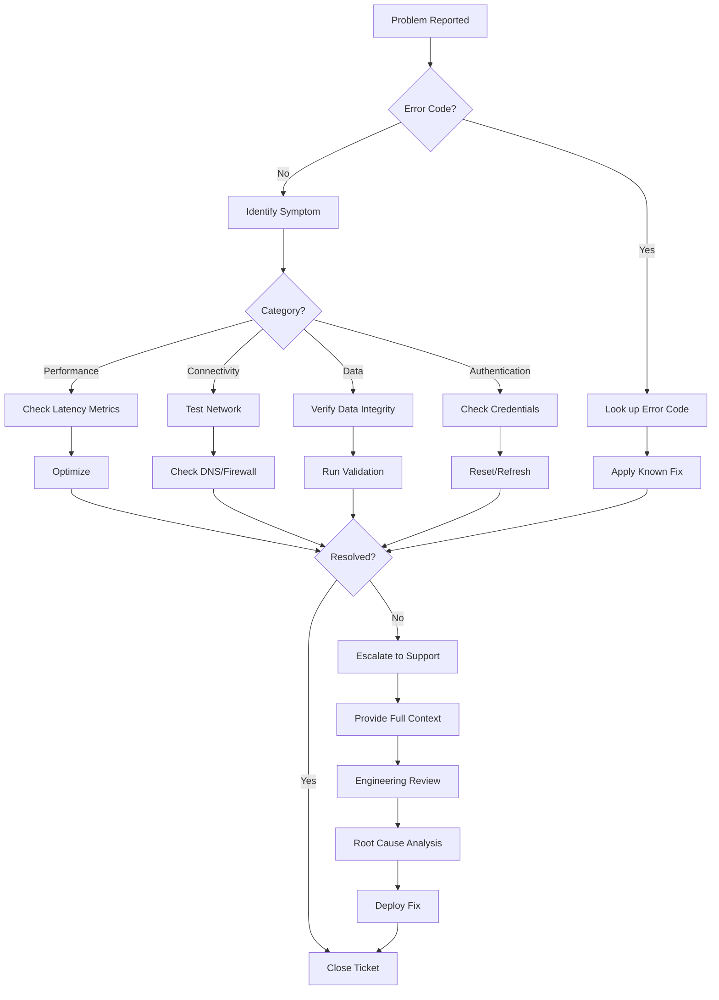

.------------------------------------------------------------------------------.
|                                                                              |
|   +----------------------------------------------------------------------+    |
|   ¦                                                                      ¦    |
|   ¦                     FAQS — TROUBLESHOOTING                            ¦    |
|   ¦                                                                      ¦    |
|   ¦                    inte11ect — Community Intelligence                 ¦    |
|   ¦                                                                      ¦    |
|   +----------------------------------------------------------------------+    |
|                                                                              |
'------------------------------------------------------------------------------'

---

# inte11ect FAQ: Troubleshooting

## Table of Contents

1. [Common error codes](#common-error-codes)
2. [Model returns unexpected results](#model-returns-unexpected-results)
3. [API returns 401 Unauthorized](#api-returns-401-unauthorized)
4. [API returns 429 Too Many Requests](#api-returns-429-too-many-requests)
5. [Connection timeout](#connection-timeout)
6. [WebSocket disconnects](#websocket-disconnects)
7. [File upload fails](#file-upload-fails)
8. [Search returns no results](#search-returns-no-results)
9. [Ledger verification fails](#ledger-verification-fails)
10. [Export fails](#export-fails)
11. [Login issues](#login-issues)
12. [Browser compatibility](#browser-compatibility)
13. [Slow response times](#slow-response-times)
14. [Streaming stalls](#streaming-stalls)
15. [Model quota exceeded](#model-quota-exceeded)
16. [Webhook delivery fails](#webhook-delivery-fails)
17. [Rate limit exceeded](#rate-limit-exceeded)
18. [Database connection issues](#database-connection-issues)
19. [Replica lag](#replica-lag)
20. [Certificate errors](#certificate-errors)

---

## Common error codes

| Code | Description | Action |
|---|---|---|
| E1001 | Authentication failed | Check API key or token |
| E1002 | Token expired | Refresh token |
| E1003 | Permission denied | Verify user permissions |
| E2001 | Rate limit exceeded | Wait and retry |
| E2002 | Quota exceeded | Upgrade tier |
| E3001 | Model not found | Check model name |
| E3002 | Model unavailable | Try fallback model |
| E3003 | Context window exceeded | Reduce prompt size |
| E4001 | Invalid request format | Validate request schema |
| E4002 | Missing required field | Check required parameters |
| E5001 | Internal server error | Retry, contact support |
| E5002 | Service unavailable | Check status page |
| E5003 | Database timeout | Retry, may be transient |
| E6001 | Ledger write failed | Retry, check integrity |
| E6002 | Ledger verification failed | Contact support |
| E7001 | Webhook delivery failed | Check endpoint URL |
| E7002 | Export generation failed | Retry with smaller scope |

---

## Model returns unexpected results

### Symptoms
- Responses are off-topic
- Hallucinations or incorrect facts
- Inconsistent formatting
- Refusal to answer

### Diagnostic Steps

```python
class ModelDiagnostics:
    def check_prompt(self, messages: list[dict]) -> list[str]:
        issues = []
        
        # Check for very short system prompt
        if messages and messages[0]["role"] == "system":
            if len(messages[0]["content"]) < 10:
                issues.append("System prompt is very short")
        
        # Check message count
        if len(messages) > 50:
            issues.append("Long conversation history may cause confusion")
        
        # Check temperature
        if any(m.get("temperature", 0.7) > 1.0 for m in messages if "temperature" in m):
            issues.append("High temperature may cause random outputs")
        
        return issues
    
    def suggest_fixes(self, issues: list[str]) -> list[str]:
        fixes = {
            "System prompt is very short": "Provide a detailed system prompt with clear instructions",
            "Long conversation history": "Summarize or trim older messages",
            "High temperature": "Reduce temperature to 0.3-0.7 for more focused output"
        }
        return [fixes.get(issue, issue) for issue in issues]
```

### Common Fixes

1. **Clarify your prompt**: Be more specific in your query
2. **Add system prompt**: Set a clear context for the model
3. **Reduce temperature**: Lower values (0.1-0.3) for factual tasks
4. **Try different model**: Switch to a model better suited for your task
5. **Check model version**: Ensure you're using the latest version

---

## API returns 401 Unauthorized

### Check your token

```bash
# Verify token is valid
curl -I https://api.inte11ect.dev/v1/health \
  -H "Authorization: Bearer YOUR_TOKEN"

# Decode JWT to check expiry (if applicable)
echo "YOUR_TOKEN" | cut -d'.' -f2 | base64 -d

# Refresh token
curl -X POST https://api.inte11ect.dev/v1/auth/refresh \
  -H "Authorization: Bearer YOUR_REFRESH_TOKEN"
```

### Common Causes

| Cause | Solution |
|---|---|
| Token expired | Refresh using refresh token |
| Invalid token format | Ensure Bearer prefix is correct |
| Wrong API key | Check key in dashboard |
| Revoked token | Generate new API key |
| Wrong environment | Check if using prod vs staging key |

---

## API returns 429 Too Many Requests

```python
class RateLimitHandler:
    def __init__(self):
        self.retry_delays = [1, 2, 4, 8, 16]
    
    async def execute_with_backoff(self, request_fn, max_retries=5):
        for attempt, delay in enumerate(self.retry_delays[:max_retries]):
            try:
                response = await request_fn()
                return response
            except RateLimitError as e:
                retry_after = e.retry_after or delay
                logger.warning(f"Rate limited. Waiting {retry_after}s...")
                await asyncio.sleep(retry_after)
        
        raise Exception("Max retries exceeded")
    
    def check_rate_limit_headers(self, response):
        return {
            "limit": response.headers.get("X-RateLimit-Limit"),
            "remaining": response.headers.get("X-RateLimit-Remaining"),
            "reset": response.headers.get("X-RateLimit-Reset")
        }
```

---

## Connection timeout

### Client-side checks

```javascript
// Increase timeout in client
const response = await fetch('https://api.inte11ect.dev/v1/chat', {
  method: 'POST',
  headers: {
    'Content-Type': 'application/json',
    'Authorization': `Bearer ${apiKey}`
  },
  body: JSON.stringify(request),
  signal: AbortSignal.timeout(60000) // 60 second timeout
});
```

### Server-side checks

```bash
# Check DNS resolution
nslookup api.inte11ect.dev

# Test connectivity
curl -v --connect-timeout 10 https://api.inte11ect.dev/health

# Check if blocked by firewall
tcping api.inte11ect.dev 443

# Trace route
tracert api.inte11ect.dev
```

---

## WebSocket disconnects

```javascript
class WebSocketManager {
  constructor(url) {
    this.url = url;
    this.reconnectAttempts = 0;
    this.maxReconnectAttempts = 10;
    this.reconnectDelay = 1000;
  }

  connect() {
    this.ws = new WebSocket(this.url);
    
    this.ws.onopen = () => {
      console.log('Connected');
      this.reconnectAttempts = 0;
    };
    
    this.ws.onclose = (event) => {
      console.log('Disconnected:', event.code);
      this.reconnect();
    };
    
    this.ws.onerror = (error) => {
      console.error('WebSocket error:', error);
    };
    
    this.ws.onmessage = (event) => {
      this.handleMessage(JSON.parse(event.data));
    };
  }

  reconnect() {
    if (this.reconnectAttempts >= this.maxReconnectAttempts) {
      console.error('Max reconnection attempts reached');
      return;
    }
    
    const delay = Math.min(
      this.reconnectDelay * Math.pow(2, this.reconnectAttempts),
      30000
    );
    
    console.log(`Reconnecting in ${delay}ms...`);
    setTimeout(() => {
      this.reconnectAttempts++;
      this.connect();
    }, delay);
  }

  disconnect(code = 1000) {
    this.ws.close(code);
  }
}
```

---

## File upload fails

### Supported file validation

```python
class FileValidator:
    MAX_SIZE = {
        "image": 20 * 1024 * 1024,  # 20MB
        "document": 100 * 1024 * 1024,  # 100MB
        "audio": 50 * 1024 * 1024,  # 50MB
        "video": 200 * 1024 * 1024  # 200MB
    }
    
    ALLOWED_TYPES = {
        "image": ["image/png", "image/jpeg", "image/gif", "image/webp"],
        "document": ["application/pdf", "text/plain", "text/csv", "application/json",
                     "application/vnd.openxmlformats-officedocument.wordprocessingml.document"],
        "audio": ["audio/mpeg", "audio/wav", "audio/ogg"],
        "video": ["video/mp4", "video/webm"]
    }
    
    def validate_file(self, file: UploadFile) -> list[str]:
        errors = []
        
        if file.content_type not in self.ALLOWED_TYPES.get(self.guess_category(file), []):
            errors.append(f"Unsupported file type: {file.content_type}")
        
        if file.size > self.MAX_SIZE.get(self.guess_category(file), 10 * 1024 * 1024):
            errors.append(f"File too large: {file.size} bytes")
        
        return errors
```

---

## Search returns no results

```python
class SearchDiagnostics:
    def analyze_search_failure(self, query: str, filters: dict) -> dict:
        issues = []
        
        if len(query) < 3:
            issues.append("Query too short (minimum 3 characters)")
        
        if filters.get("date_from") and filters.get("date_to"):
            if filters["date_from"] > filters["date_to"]:
                issues.append("Date range is invalid (from > to)")
        
        if filters.get("user_id") and not self.user_exists(filters["user_id"]):
            issues.append("Filtered user does not exist")
        
        return {
            "issues": issues,
            "suggestions": [
                "Try broader search terms",
                "Remove date filters",
                "Check that the content exists in your tier",
                "Verify indexing status"
            ]
        }
```

---

## Ledger verification fails

```python
async def diagnose_ledger_issue(index: int):
    diagnostics = {}
    
    # Check block exists
    block = await get_block(index)
    diagnostics["exists"] = block is not None
    
    if not block:
        return {"error": "Block not found", "resolution": "Verify the index is correct"}
    
    # Check hash integrity
    expected_hash = compute_hash(block)
    diagnostics["hash_integrity"] = expected_hash == block.hash
    
    # Check signature
    diagnostics["signature_valid"] = verify_signature(block)
    
    # Check chain linkage
    if index > 0:
        prev = await get_block(index - 1)
        diagnostics["chain_link"] = prev and block.previous_hash == prev.hash
    
    # Check blockchain anchoring
    diagnostics["anchor_verified"] = await verify_anchoring(block)
    
    # Resolution
    if not diagnostics["hash_integrity"]:
        diagnostics["resolution"] = "Data corruption detected. Contact support immediately."
    elif not diagnostics["chain_link"]:
        diagnostics["resolution"] = "Chain discontinuity. Running auto-repair..."
    elif not diagnostics["signature_valid"]:
        diagnostics["resolution"] = "Signature mismatch. Possible tampering detected."
    else:
        diagnostics["resolution"] = "Block is valid."
    
    return diagnostics
```

---

## Export fails

### Common Export Issues

| Issue | Cause | Solution |
|---|---|---|
| Timeout | Too much data | Reduce date range or filter |
| Out of memory | Large export | Use pagination or Parquet format |
| Format error | Unsupported format | Use JSON, CSV, or Parquet |
| Permission denied | Insufficient rights | Check export permissions |
| Rate limited | Too many exports | Wait and retry |

### Export Resolution

```javascript
async function exportWithRetry(params) {
  const maxRetries = 3;
  
  for (let attempt = 1; attempt <= maxRetries; attempt++) {
    try {
      const result = await api.post('/v1/ledger/export', {
        ...params,
        format: 'json',
        compress: true
      });
      
      // Poll for completion
      while (true) {
        const status = await api.get(`/v1/export/${result.id}/status`);
        if (status.status === 'completed') {
          return await api.get(`/v1/export/${result.id}/download`);
        }
        if (status.status === 'failed') {
          throw new Error(`Export failed: ${status.error}`);
        }
        await new Promise(r => setTimeout(r, 2000));
      }
    } catch (error) {
      if (attempt === maxRetries) throw error;
      console.log(`Export attempt ${attempt} failed, retrying...`);
      await new Promise(r => setTimeout(r, attempt * 5000));
    }
  }
}
```

---

## Login issues

### Troubleshooting login

```bash
# Check if service is up
curl https://api.inte11ect.dev/health

# Verify credentials with verbose output
curl -v -X POST https://api.inte11ect.dev/v1/auth/login \
  -H "Content-Type: application/json" \
  -d '{"email": "user@example.com", "password": "***"}'

# Reset password via API
curl -X POST https://api.inte11ect.dev/v1/auth/reset-password \
  -H "Content-Type: application/json" \
  -d '{"email": "user@example.com"}'
```

### Common Login Issues

| Symptom | Cause | Fix |
|---|---|---|
| Invalid credentials | Wrong email/password | Use password reset |
| Account locked | Too many failed attempts | Wait 15 minutes or contact support |
| Email not verified | Registration incomplete | Check email for verification link |
| SSO fails | IdP configuration issue | Check SAML/OIDC settings |
| 2FA code invalid | Wrong code | Generate new code or use backup code |
| Session expired | Session timeout | Re-authenticate |

---

## Browser compatibility

```javascript
// Feature detection
const compatibility = {
  webSocket: typeof WebSocket !== 'undefined',
  fetch: typeof fetch !== 'undefined',
  promises: typeof Promise !== 'undefined',
  asyncAwait: (async () => {}).constructor.name === 'AsyncFunction',
  webCrypto: typeof crypto !== 'undefined' && crypto.subtle,
  localStorage: typeof localStorage !== 'undefined',
  serviceWorker: 'serviceWorker' in navigator
};

// Check browser
function checkBrowser() {
  const ua = navigator.userAgent;
  const browsers = {
    chrome: /Chrome/.test(ua),
    firefox: /Firefox/.test(ua),
    safari: /Safari/.test(ua) && !/Chrome/.test(ua),
    edge: /Edg/.test(ua)
  };
  
  return browsers;
}
```

---

## Slow response times

### Diagnostic Steps

```bash
# 1. Measure API latency
time curl -s -o /dev/null -w "%{time_total}s\n" \
  https://api.inte11ect.dev/v1/health

# 2. Check DNS resolution
time nslookup api.inte11ect.dev

# 3. Check with verbose output
curl -w "\nTime: %{time_total}s\nDNS: %{time_namelookup}s\nConnect: %{time_connect}s\nTLS: %{time_appconnect}s\nFirst Byte: %{time_starttransfer}s\n" \
  -H "Authorization: Bearer TOKEN" \
  https://api.inte11ect.dev/v1/models
```

### Performance Optimization

```python
class PerformanceOptimizer:
    def analyze_latency(self, metrics: dict) -> dict:
        recommendations = []
        
        if metrics.get("p95_latency_ms", 0) > 5000:
            recommendations.append("Model inference is slow. Consider using a faster model")
        
        if metrics.get("network_latency_ms", 0) > 200:
            recommendations.append("High network latency. Consider using a CDN or closer region")
        
        if metrics.get("database_latency_ms", 0) > 100:
            recommendations.append("Database slow. Consider scaling read replicas")
        
        if metrics.get("client_processing_ms", 0) > 1000:
            recommendations.append("Client-side processing is slow. Check browser/device performance")
        
        return {"recommendations": recommendations}
```

---

## Streaming stalls

```python
class StreamMonitor:
    def __init__(self, timeout: int = 30000):
        self.timeout = timeout
        self.last_chunk_time = None
        self.chunk_count = 0
    
    async def monitor_stream(self, stream):
        async for chunk in stream:
            self.last_chunk_time = time.time()
            self.chunk_count += 1
            yield chunk
    
    def check_stream_health(self) -> dict:
        if self.chunk_count == 0:
            return {"status": "no_data", "action": "Check model availability"}
        
        time_since_last = time.time() - (self.last_chunk_time or time.time())
        
        if time_since_last > self.timeout:
            return {
                "status": "stalled",
                "time_since_last_chunk": time_since_last,
                "action": "Cancel and retry with different model"
            }
        
        return {
            "status": "healthy",
            "chunks_received": self.chunk_count,
            "time_since_last_chunk": time_since_last
        }
```

---

## Model quota exceeded

```python
class QuotaManager:
    def check_and_handle_quota(self, user: User) -> dict:
        usage = self.get_current_usage(user)
        limits = self.get_tier_limits(user.tier)
        
        if usage["queries_today"] >= limits["daily_limit"]:
            return {
                "exceeded": True,
                "message": "Daily query limit reached",
                "resolution": "Wait until tomorrow or upgrade tier",
                "upgrade_url": "/settings/billing"
            }
        
        if usage["tokens_this_month"] >= limits["monthly_tokens"]:
            return {
                "exceeded": True,
                "message": "Monthly token limit reached",
                "resolution": "Upgrade tier for more tokens"
            }
        
        return {
            "exceeded": False,
            "remaining_queries": limits["daily_limit"] - usage["queries_today"],
            "remaining_tokens": limits["monthly_tokens"] - usage["tokens_this_month"]
        }
```

---

## Webhook delivery fails

```python
class WebhookRetryHandler:
    def __init__(self):
        self.max_retries = 5
        self.backoff_strategy = [1, 5, 15, 30, 60]  # minutes
    
    async def deliver_with_retry(self, webhook_id: str, payload: dict):
        webhook = await self.get_webhook(webhook_id)
        
        for attempt in range(self.max_retries):
            try:
                response = await self.http_client.post(
                    webhook.url,
                    json=payload,
                    headers={
                        "Content-Type": "application/json",
                        "X-Webhook-Secret": webhook.secret,
                        "X-Webhook-Event": payload["event"],
                        "X-Webhook-Attempt": str(attempt + 1)
                    },
                    timeout=30
                )
                
                if response.status_code == 200:
                    return {"status": "delivered", "attempts": attempt + 1}
                
                if response.status_code in [400, 422]:
                    return {"status": "failed", "reason": "Invalid payload"}
                
                if response.status_code == 410:
                    return {"status": "failed", "reason": "Webhook endpoint removed"}
                
            except (TimeoutError, ConnectionError) as e:
                logger.warning(f"Delivery attempt {attempt + 1} failed: {e}")
                
                if attempt < self.max_retries - 1:
                    delay = self.backoff_strategy[attempt] * 60
                    await asyncio.sleep(delay)
                    continue
                
                return {"status": "failed", "reason": "Max retries exceeded"}
        
        return {"status": "failed", "reason": "All delivery attempts failed"}
```

---

## Rate limit exceeded

### Headers

```
X-RateLimit-Limit: 100
X-RateLimit-Remaining: 0
X-RateLimit-Reset: 1687172400
Retry-After: 45
```

### Programmatic Handling

```javascript
class RateLimitAwareClient {
  constructor(apiKey, options = {}) {
    this.apiKey = apiKey;
    this.queue = [];
    this.processing = false;
    this.maxConcurrent = options.maxConcurrent || 5;
    this.activeRequests = 0;
  }

  async request(endpoint, data) {
    return new Promise((resolve, reject) => {
      this.queue.push({ endpoint, data, resolve, reject });
      this.processQueue();
    });
  }

  async processQueue() {
    if (this.processing) return;
    this.processing = true;
    
    while (this.queue.length > 0 && this.activeRequests < this.maxConcurrent) {
      const item = this.queue.shift();
      this.activeRequests++;
      
      this.executeRequest(item)
        .finally(() => {
          this.activeRequests--;
          this.processQueue();
        });
    }
    
    this.processing = false;
  }

  async executeRequest({ endpoint, data, resolve, reject }) {
    try {
      const response = await fetch(`https://api.inte11ect.dev${endpoint}`, {
        method: 'POST',
        headers: {
          'Content-Type': 'application/json',
          'Authorization': `Bearer ${this.apiKey}`
        },
        body: JSON.stringify(data)
      });
      
      if (response.status === 429) {
        const retryAfter = parseInt(response.headers.get('Retry-After') || '60');
        await new Promise(r => setTimeout(r, retryAfter * 1000));
        this.queue.push({ endpoint, data, resolve, reject });
        return;
      }
      
      resolve(await response.json());
    } catch (error) {
      reject(error);
    }
  }
}
```

---

## Database connection issues

```bash
# Check PostgreSQL connectivity
pg_isready -h $DB_HOST -p 5432 -U inte11ect

# Show active connections
psql -h $DB_HOST -U inte11ect -c "SELECT count(*) FROM pg_stat_activity;"

# Check connection pool status
psql -h $DB_HOST -U inte11ect -c "SHOW pool_size;"

# Test query performance
psql -h $DB_HOST -U inte11ect -c "EXPLAIN ANALYZE SELECT * FROM conversations LIMIT 1;"

# Connection pool configuration
cat /etc/pgbouncer/pgbouncer.ini
```

### Connection Pool Configuration

```ini
[databases]
inte11ect = host=localhost port=5432 dbname=inte11ect

[pgbouncer]
listen_port = 6432
listen_addr = 0.0.0.0
auth_type = scram-sha-256
auth_file = /etc/pgbouncer/userlist.txt
pool_mode = transaction
max_client_conn = 500
default_pool_size = 50
max_db_connections = 100
query_timeout = 30
idle_transaction_timeout = 60
```

---

## Replica lag

```sql
-- Check replica lag
SELECT
  application_name,
  state,
  sync_state,
  pg_wal_lsn_diff(pg_current_wal_lsn(), replay_lsn) AS lag_bytes,
  now() - pg_last_xact_replay_timestamp() AS lag_time
FROM pg_stat_replication;

-- Check replication slots
SELECT slot_name, slot_type, active,
  pg_wal_lsn_diff(pg_current_wal_lsn(), restart_lsn) AS lag_bytes
FROM pg_replication_slots;
```

### Monitoring Replica Lag

```python
class ReplicaLagMonitor:
    async def check_lag(self) -> dict:
        result = await self.db.fetch("""
            SELECT
                application_name,
                pg_wal_lsn_diff(pg_current_wal_lsn(), replay_lsn) AS lag_bytes,
                now() - pg_last_xact_replay_timestamp() AS lag_interval
            FROM pg_stat_replication
        """)
        
        alerts = []
        for row in result:
            lag_seconds = row["lag_interval"].total_seconds() if row["lag_interval"] else 0
            
            if lag_seconds > 300:
                alerts.append(f"CRITICAL: Replica {row['application_name']} lag is {lag_seconds}s")
            elif lag_seconds > 60:
                alerts.append(f"WARNING: Replica {row['application_name']} lag is {lag_seconds}s")
        
        return {
            "replicas": [dict(r) for r in result],
            "alerts": alerts,
            "healthy": len(alerts) == 0
        }
```

---

## Certificate errors

```bash
# Check certificate chain
openssl s_client -connect api.inte11ect.dev:443 -showcerts

# Verify certificate expiry
echo | openssl s_client -servername api.inte11ect.dev -connect api.inte11ect.dev:443 2>/dev/null | openssl x509 -noout -dates

# Check TLS version
openssl s_client -connect api.inte11ect.dev:443 -tls1_3

# Test with curl (verbose)
curl -vI https://api.inte11ect.dev/health 2>&1 | grep "SSL certificate"
```

---

## General Troubleshooting Flow



---

## Diagnostic Commands Reference

```bash
# Full platform health check
inte11ect health --verbose

# Check model availability
inte11ect models list --available

# Verify ledger integrity
inte11ect ledger verify --recent 100

# Test API connectivity
inte11ect api check --endpoint /v1/models

# Run performance benchmark
inte11ect benchmark --requests 50 --concurrency 5

# Export system logs
inte11ect logs export --since "24h" --output diagnostics.zip

# Check user status
inte11ect users get --user-id usr_abc123

# Validate configuration
inte11ect config validate
```

---

## When to Contact Support

| Situation | Contact Method | Response Time |
|---|---|---|
| Service outage | [Status Page](https://status.inte11ect.dev) | Immediate |
| Data integrity issue | support@inte11ect.dev | < 4 hours |
| Security concern | security@inte11ect.dev | < 1 hour |
| Billing issue | billing@inte11ect.dev | < 24 hours |
| Feature request | feedback.inte11ect.dev | Weekly review |
| Bug report | GitHub Issues | < 48 hours |

---

## Related FAQs

- [General Questions](01-faqs.md)
- [Technical Questions](02-faqs.md)
- [Security & Compliance](03-faqs.md)
- [Deployment Questions](04-faqs.md)
- [Model Questions](05-faqs.md)
- [Audit & Ledger](06-faqs.md)
- [Pricing & Licensing](08-faqs.md)

---

```
Lois-Kleinner and 0-1.gg 2026 — Confidential
```

```
.====================================================================.
!  Made in the UAE, Dubai #DubaiIt #Dubai #Dxb #SovereignAI          !
!  Made in The Emirates #Dubai_it                                    !
!                                                                    !
!  Lois-Kleinner Alpasan - The Anticloud 2026-                       !
!                                                                    !
!  As seen on:                                                       !
!  Harvard Dataverse ! Zenodo/CERN ! Academia.edu ! HuggingFace      !
!  anticloud.telepedia.net ! anticloud.fandom.com                    !
!                                                                    !
!  0-1.gg ! GitHub ! LinkedIn ! DEV ! GH Pages                       !
!  HuggingFace ! Blog ! Bluesky ! Mastodon                           !
!  Internet Archive ! ORCID ! Figshare                               !
!                                                                    !
!  Sovereign AI ! Local-First ! Privacy ! Zero Trust ! No Datacenter !
!  Air-Gapped ! Open Source ! Rust ! Hash Chain ! Single Binary      !
!  Offline LLM ! Crypto Ledger ! P2P ! Federated                     !
'===================================================================='
```

Lois-Kleinner Alpasan, 22, builds sovereign AI infrastructure and cryptographic audit systems. His work spans formats, proptech, and research platforms serving projects valued at over $1B combined, operating at the intersection of AI, media, and decentralized technology.

References:
1. Lois-Kleinner Zenodo: https://doi.org/10.5281/zenodo.20781790
2. Lois-Kleinner GitHub: https://github.com/kleinnner/Anticloud/tree/main/04-aioss-format
3. Lois-Kleinner Harvard DV: https://doi.org/10.7910/DVN/FDEBAB
4. Lois-Kleinner Internet Arc: https://archive.org/details/aioss-format
5. Lois-Kleinner ORCID: https://orcid.org/0009-0009-2233-6107
6. Lois-Kleinner DEV.to: https://dev.to/kleinner
7. Lois-Kleinner LinkedIn: https://linkedin.com/in/kleinner
8. Lois-Kleinner HuggingFace: https://huggingface.co/Anticloud
9. Lois-Kleinner Tumblr: https://anticloud.tumblr.com
10. Lois-Kleinner Mastodon: https://mastodon.social/@kleinner
11. Lois-Kleinner Bluesky: https://bsky.app/profile/kleinner.bsky.social
12. 0-1.gg: https://0-1.gg
13. Lois-Kleinner Figshare: https://figshare.com/authors/Lois-Kleinner_Alpasan/20849885
14. Lois-Kleinner Academia: https://independent.academia.edu/kleinner
15. Lois-Kleinner Telepedia: https://anticloud.telepedia.net/wiki/Anticloud_by_Lois-Kleinner_Wiki
16. Lois-Kleinner Fandom: https://anticloud.fandom.com