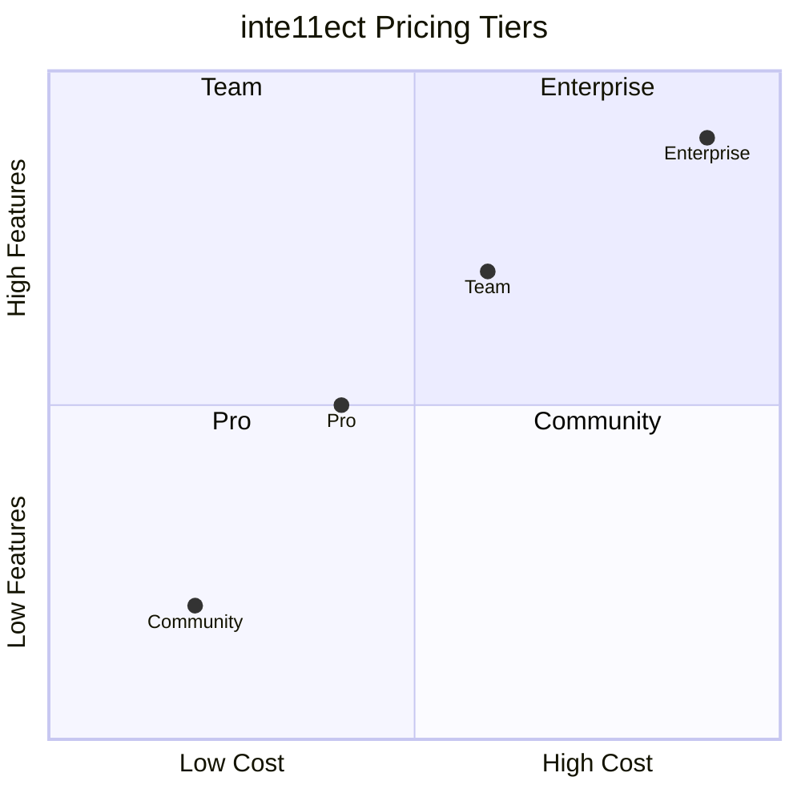
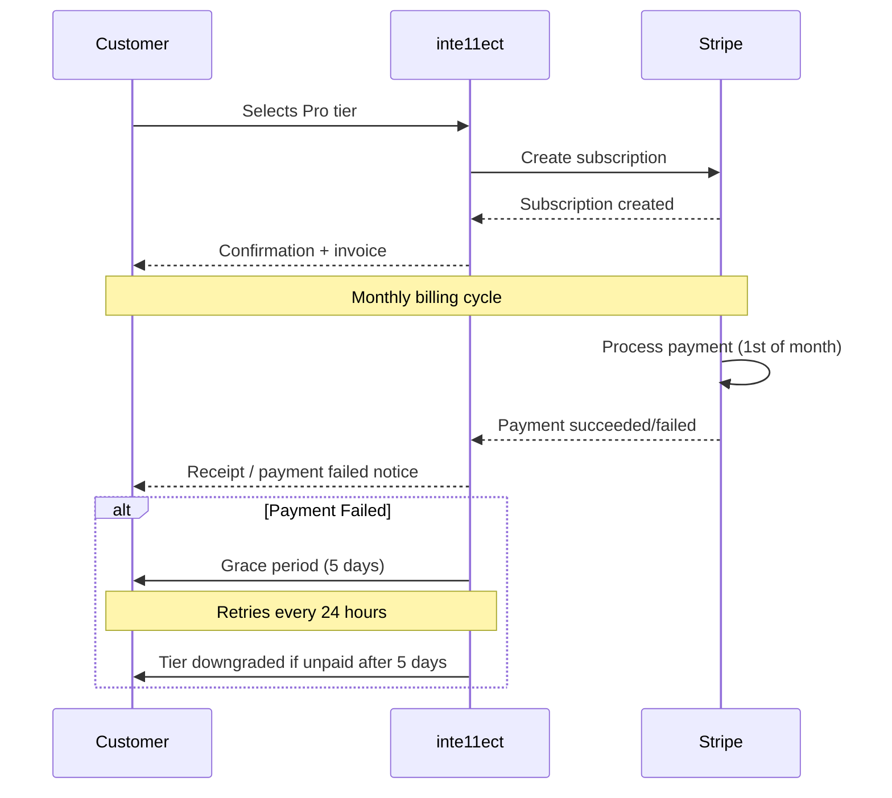

.------------------------------------------------------------------------------.
|                                                                              |
|   +----------------------------------------------------------------------+    |
|   ¦                                                                      ¦    |
|   ¦                  FAQS — PRICING & LICENSING                           ¦    |
|   ¦                                                                      ¦    |
|   ¦                    inte11ect — Community Intelligence                 ¦    |
|   ¦                                                                      ¦    |
|   +----------------------------------------------------------------------+    |
|                                                                              |
'------------------------------------------------------------------------------'

---

# inte11ect FAQ: Pricing & Licensing

## Table of Contents

1. [What pricing tiers are available?](#what-pricing-tiers-are-available)
2. [What is included in each tier?](#what-is-included-in-each-tier)
3. [How is billing handled?](#how-is-billing-handled)
4. [What payment methods are accepted?](#what-payment-methods-are-accepted)
5. [Can I change tiers?](#can-i-change-tiers)
6. [What happens if I exceed my tier limits?](#what-happens-if-i-exceed-my-tier-limits)
7. [Is there a free trial?](#is-there-a-free-trial)
8. [What license is inte11ect under?](#what-license-is-inte11ect-under)
9. [Can I self-host inte11ect?](#can-i-self-host-inte11ect)
10. [What are the Enterprise licensing terms?](#what-are-the-enterprise-licensing-terms)
11. [How is usage calculated?](#how-is-usage-calculated)
12. [Are there discounts for non-profits?](#are-there-discounts-for-non-profits)
13. [What is the refund policy?](#what-is-the-refund-policy)
14. [How do I cancel my subscription?](#how-do-i-cancel-my-subscription)
15. [What happens to my data after cancellation?](#what-happens-to-my-data-after-cancellation)
16. [Can I get an invoice?](#can-i-get-an-invoice)
17. [Is there an API usage tier?](#is-there-an-api-usage-tier)
18. [What are the model usage costs?](#what-are-the-model-usage-costs)
19. [Are there data storage costs?](#are-there-data-storage-costs)
20. [How do I estimate my monthly cost?](#how-do-i-estimate-my-monthly-cost)

---

## What pricing tiers are available?



| Tier | Price | Best For |
|---|---|---|
| Community | Free | Individual users, casual use |
| Pro | $29/month | Power users, professionals |
| Team | $99/month (5 seats) | Small teams, startups |
| Enterprise | Custom | Large organizations, regulated industries |

---

## What is included in each tier?

### Feature Comparison

| Feature | Community | Pro | Team | Enterprise |
|---|---|---|---|---|
| Daily queries | 100 | 1,000 | 10,000 | Unlimited |
| Models | Standard | All cloud | All cloud + custom | All + local |
| Context window | 32K | 128K | 200K | 1M+ |
| Ledger retention | 90 days | 1 year | 3 years | Custom |
| File upload | 5MB | 50MB | 100MB | 500MB |
| Streaming | Yes | Yes | Yes | Yes |
| Private ledgers | Public only | + Private | + Shared | + On-prem |
| API access | Limited | Full | Full | Full + dedicated |
| Webhooks | No | 5 | 25 | Unlimited |
| SSO | No | No | Basic | Enterprise |
| Audit exports | No | JSON | JSON, CSV | All formats |
| SLA | None | 99.9% | 99.95% | 99.99% |
| Support | Community | Email | Priority | 24/7 dedicated |
| Data residency | Default | Default | Selectable | Any region |
| On-prem deployment | No | No | No | Yes |
| Custom models | No | No | Yes | Yes |
| Fine-tuning API | No | No | Limited | Full |

---

## How is billing handled?



### Billing Periods

| Tier | Billing Frequency | Discount |
|---|---|---|
| Community | N/A | N/A |
| Pro | Monthly or Annual | 20% off annual |
| Team | Monthly or Annual | 20% off annual |
| Enterprise | Monthly, Annual, Multi-year | Negotiable |

---

## What payment methods are accepted?

| Method | Community | Pro | Team | Enterprise |
|---|---|---|---|---|
| Credit/Debit card (Visa, MC, Amex) | - | Yes | Yes | Yes |
| PayPal | - | Yes | Yes | Yes |
| ACH bank transfer | - | No | No | Yes |
| Wire transfer | - | No | No | Yes |
| Purchase order | - | No | No | Yes |
| Cryptocurrency | - | No | No | By arrangement |
| Invoice (net 30) | - | No | No | Yes |

---

## Can I change tiers?

### Upgrading

```bash
# API: Upgrade user to Pro
curl -X POST https://api.inte11ect.dev/v1/billing/upgrade \
  -H "Authorization: Bearer TOKEN" \
  -H "Content-Type: application/json" \
  -d '{
    "tier": "pro",
    "billing_period": "monthly",
    "payment_method_id": "pm_abc123"
  }'
```

```json
{
  "status": "upgraded",
  "previous_tier": "community",
  "current_tier": "pro",
  "effective_date": "2026-06-19T12:00:00Z",
  "next_billing_date": "2026-07-19T00:00:00Z",
  "prorated_amount": 14.50
}
```

### Downgrading

| Change | Effect | Data Impact |
|---|---|---|
| Pro to Community | Immediate on next cycle | Ledger retention drops to 90 days |
| Team to Pro | Immediate on next cycle | Seat count reduces to 1 |
| Enterprise to Team | End of contract term | Custom features removed |

---

## What happens if I exceed my tier limits?

```python
class TierLimitEnforcer:
    def check_limits(self, user: User) -> dict:
        limits = {
            "community": {"daily_queries": 100, "max_file_size_mb": 5},
            "pro": {"daily_queries": 1000, "max_file_size_mb": 50},
            "team": {"daily_queries": 10000, "max_file_size_mb": 100},
            "enterprise": {"daily_queries": float('inf'), "max_file_size_mb": 500}
        }
        
        tier_limits = limits.get(user.tier, limits["community"])
        current_usage = self.get_current_usage(user.id)
        
        soft_limits = []
        hard_limits = []
        
        for metric, limit in tier_limits.items():
            usage = current_usage.get(metric, 0)
            if usage >= limit * 0.8:
                soft_limits.append(f"Approaching {metric} limit: {usage}/{limit}")
            if usage >= limit:
                hard_limits.append(f"Exceeded {metric} limit: {usage}/{limit}")
        
        return {
            "soft_limits": soft_limits,
            "hard_limits": hard_limits,
            "action_required": len(hard_limits) > 0,
            "suggestion": "Upgrade tier to remove limits" if len(hard_limits) > 0 else None
        }
```

---

## Is there a free trial?

Pro and Team tiers include a 14-day free trial:

```yaml
free_trial:
  duration: 14 days
  tiers_available:
    - pro
    - team
  requires_credit_card: true
  features_included: "Full tier features"
  auto_downgrade: true
  cancellation: "Any time during trial"
  
  limitations:
    - "No data export during trial"
    - "Maximum 5 conversations exportable post-trial"
    - "Some premium models limited during trial"
```

### Trial Conversion

```bash
# Check trial status
curl -H "Authorization: Bearer TOKEN" https://api.inte11ect.dev/v1/billing/trial

# Cancel trial (no charge)
curl -X POST -H "Authorization: Bearer TOKEN" https://api.inte11ect.dev/v1/billing/cancel-trial
```

---

## What license is inte11ect under?

inte11ect uses a dual-licensing model:

| Component | License | Notes |
|---|---|---|
| Core platform (open source) | Apache 2.0 | GitHub: github.com/inte11ect/core |
| Web UI | MIT | GitHub: github.com/inte11ect/web |
| CLI tools | Apache 2.0 | npm/pip packages |
| SDK / Client libraries | MIT | Multiple languages |
| Enterprise features | Proprietary | Commercial license required |
| Premium integrations | Proprietary | Commercial license required |
| Community models | CC BY-NC 4.0 | Unless otherwise specified |

### License Key Management

```python
class LicenseManager:
    def validate_license(self, license_key: str) -> dict:
        try:
            decoded = jwt.decode(
                license_key,
                self.public_key,
                algorithms=["RS256"]
            )
            
            if decoded["exp"] < time.time():
                return {"valid": False, "reason": "License expired"}
            
            if decoded.get("tier") not in ["team", "enterprise"]:
                return {"valid": False, "reason": "Invalid tier"}
            
            return {
                "valid": True,
                "tier": decoded["tier"],
                "expires": decoded["exp"],
                "seats": decoded.get("seats", 1),
                "features": decoded.get("features", [])
            }
        except jwt.InvalidTokenError as e:
            return {"valid": False, "reason": str(e)}
```

---

## Can I self-host inte11ect?

| Component | Community | Enterprise |
|---|---|---|
| Core engine | Yes (open source) | Yes |
| All features | No | Yes |
| Support | Community | Commercial |
| Updates | Community release | Immediate |
| License | Apache 2.0 | Commercial |

Self-hosting the Community edition:

```bash
# Clone repository
git clone https://github.com/inte11ect/core.git
cd core

# Configure
cp .env.example .env
# Edit .env with your settings

# Build and run
docker-compose up -d

# Access at http://localhost:8080
```

---

## What are the Enterprise licensing terms?

```yaml
enterprise_licensing:
  license_model: "Per-seat annual subscription"
  minimum_commitment: 25 seats
  contract_terms: [12, 24, 36] # months
  
  pricing:
    base: "$199/seat/month"
    volume_discounts:
      - seats: "25-99"
        discount: "10%"
      - seats: "100-499"
        discount: "20%"
      - seats: "500+"
        discount: "Contact sales"
  
  included:
    - On-premises deployment
    - Dedicated support (24/7)
    - Custom SLA
    - SSO/SAML/SCIM
    - Audit exports (all formats)
    - Custom data retention
    - Dedicated infrastructure
    - Security review
    - Custom integrations
    - Training sessions
  
  add_ons:
    - "Additional storage: $0.10/GB/month"
    - "Premium model access: $500/month"
    - "Dedicated support engineer: $2000/month"
    - "Custom development: $250/hour"
```

---

## How is usage calculated?

```python
class UsageCalculator:
    def calculate_usage(self, user_id: str, period: str = "monthly") -> dict:
        queries = self.count_queries(user_id, period)
        tokens = self.count_tokens(user_id, period)
        storage = self.calculate_storage(user_id)
        api_calls = self.count_api_calls(user_id, period)
        
        breakdown = {
            "queries": {
                "count": queries,
                "limit": self.get_limit("queries", user.tier),
                "cost_per_1000": 0.00
            },
            "input_tokens": {
                "count": tokens["input"],
                "limit": self.get_token_limit(user.tier, "input"),
                "cost_per_1M": self.get_token_cost(user.tier, "input")
            },
            "output_tokens": {
                "count": tokens["output"],
                "limit": self.get_token_limit(user.tier, "output"),
                "cost_per_1M": self.get_token_cost(user.tier, "output")
            },
            "storage": {
                "gb": storage,
                "limit": self.get_storage_limit(user.tier),
                "cost_per_gb": 0.10
            },
            "api_calls": {
                "count": api_calls,
                "limit": self.get_api_limit(user.tier)
            }
        }
        
        estimated_cost = self.calculate_estimated_cost(breakdown)
        
        return {
            "breakdown": breakdown,
            "estimated_monthly_cost": estimated_cost,
            "period": period,
            "user_tier": user.tier
        }
    
    def calculate_estimated_cost(self, usage: dict) -> float:
        cost = 0.0
        
        # Token costs
        input_cost = (usage["input_tokens"]["count"] / 1_000_000) * usage["input_tokens"]["cost_per_1M"]
        output_cost = (usage["output_tokens"]["count"] / 1_000_000) * usage["output_tokens"]["cost_per_1M"]
        cost += input_cost + output_cost
        
        # Storage costs (if over limit)
        storage_overage = max(0, usage["storage"]["gb"] - usage["storage"]["limit"])
        cost += storage_overage * usage["storage"]["cost_per_gb"]
        
        return round(cost, 2)
```

---

## Are there discounts for non-profits?

Yes, inte11ect offers a Non-Profit Program:

| Criteria | Discount | Requirements |
|---|---|---|
| Registered non-profit | 50% off Pro or Team | Valid 501(c)(3) or equivalent |
| Educational institution | 40% off Pro or Team | .edu email or proof |
| Open source project | 30% off Pro | Active GitHub repository |
| Startup (< 2 years) | 20% off Team | YC/Techstars or equivalent |
| Government agency | Custom pricing | Official request |

### Application Process

```bash
curl -X POST https://api.inte11ect.dev/v1/billing/discount-application \
  -H "Authorization: Bearer TOKEN" \
  -d '{
    "organization_type": "non_profit",
    "organization_name": "Example Foundation",
    "ein": "XX-XXXXXXX",
    "documentation_url": "https://example.com/irs-determination-letter.pdf",
    "requested_tier": "team",
    "requested_discount": 50
  }'
```

---

## What is the refund policy?

```yaml
refund_policy:
  pro_tier:
    money_back_guarantee: "14 days"
    refund_method: "Original payment method"
    processing_time: "5-10 business days"
    conditions:
      - "Must request within 14 days of purchase"
      - "Limited to one refund per account"
      - "Usage must be under 20% of tier limit"
  
  team_tier:
    money_back_guarantee: "14 days"
    refund_method: "Original payment method"
    processing_time: "5-10 business days"
    conditions:
      - "Must request within 14 days of purchase"
      - "Limited to one refund per organization"
      
  enterprise_tier:
    refund_policy: "Per contract terms"
    typically: "No refunds after 30 days"
    
  annual_plans:
    refund_policy: "Prorated refund for remaining months"
    processing_fee: "10% of refund amount"
```

---

## How do I cancel my subscription?

```bash
# Cancel via API
curl -X POST https://api.inte11ect.dev/v1/billing/cancel \
  -H "Authorization: Bearer TOKEN" \
  -d '{
    "reason": "Not needed at this time",
    "feedback": "Will consider returning",
    "cancel_immediately": false
  }'
```

```json
{
  "status": "canceled",
  "effective_date": "2026-07-19T00:00:00Z",
  "current_period_end": "2026-07-19T00:00:00Z",
  "downgrade_to": "community",
  "data_retention_days": 90
}
```

---

## What happens to my data after cancellation?

| Data Type | Community (Post-downgrade) | After Account Deletion |
|---|---|---|
| Conversations | 90-day retention | Deleted immediately |
| Ledger entries | Anonymized after 90 days | Anonymized |
| API keys | Deactivated | Deactivated |
| Files | 90-day retention | Deleted immediately |
| Personal info | Retained until deletion | Deleted |
| Billing records | Retained 7 years (legal) | Retained 7 years |

---

## Can I get an invoice?

```bash
# List invoices
curl -H "Authorization: Bearer TOKEN" \
  https://api.inte11ect.dev/v1/billing/invoices

# Download specific invoice
curl -H "Authorization: Bearer TOKEN" \
  https://api.inte11ect.dev/v1/billing/invoices/inv_abc123/pdf \
  --output invoice.pdf

# Generate custom invoice
curl -X POST -H "Authorization: Bearer TOKEN" \
  https://api.inte11ect.dev/v1/billing/invoices/custom \
  -d '{
    "period_start": "2026-06-01",
    "period_end": "2026-06-30",
    "include_tax": true,
    "po_number": "PO-2026-0042",
    "additional_fields": {
      "department": "Engineering",
      "cost_center": "CC-100"
    }
  }'
```

---

## Is there an API usage tier?

API usage is included in Pro and above tiers:

```yaml
api_pricing:
  pro:
    rate_limit: 1000 requests/day
    concurrent: 5
    included_models: "All cloud"
  
  team:
    rate_limit: 10000 requests/day
    concurrent: 25
    included_models: "All cloud + custom"
  
  enterprise:
    rate_limit: "Custom"
    concurrent: "Custom"
    included_models: "All"
  
  pay_as_you_go:
    available: false
    planned: "Q1 2027"
```

---

## What are the model usage costs?

| Model | Input Cost (per 1M tokens) | Output Cost (per 1M tokens) | Included in Tier |
|---|---|---|---|
| GPT-4o | $2.50 | $10.00 | All tiers |
| GPT-4o-mini | $0.15 | $0.60 | All tiers |
| Claude 3.5 Sonnet | $3.00 | $15.00 | Pro+ |
| Claude 3 Haiku | $0.25 | $1.25 | All tiers |
| Gemini 1.5 Pro | $3.50 | $10.50 | Pro+ |
| Gemini 1.5 Flash | $0.075 | $0.30 | All tiers |
| Mistral Large | $2.00 | $6.00 | All tiers |
| Llama 3.1 405B | $2.00 | $6.00 | Pro+ |
| Local models | $0 (your compute) | $0 (your compute) | Enterprise |

---

## Are there data storage costs?

| Tier | Included Storage | Overage Rate |
|---|---|---|
| Community | 1 GB | N/A (hard limit) |
| Pro | 10 GB | $0.10/GB/month |
| Team | 100 GB | $0.10/GB/month |
| Enterprise | 1 TB | $0.05/GB/month |

---

## How do I estimate my monthly cost?

```python
class CostEstimator:
    def estimate_monthly(self, params: dict) -> dict:
        queries_per_day = params.get("queries_per_day", 50)
        avg_input_tokens = params.get("avg_input_tokens", 500)
        avg_output_tokens = params.get("avg_output_tokens", 1000)
        days_per_month = 30
        tier = params.get("tier", "pro")
        
        monthly_queries = queries_per_day * days_per_month
        monthly_input_tokens = monthly_queries * avg_input_tokens
        monthly_output_tokens = monthly_queries * avg_output_tokens
        
        # Tier pricing
        tier_pricing = {
            "pro": {"base": 29, "model": "gpt-4o-mini"},
            "team": {"base": 99, "model": "gpt-4o"},
            "enterprise": {"base": 199, "model": "gpt-4o"}
        }
        
        tier = tier_pricing.get(tier, tier_pricing["pro"])
        
        # Model costs
        model_pricing = {
            "gpt-4o-mini": {"input": 0.15, "output": 0.60},
            "gpt-4o": {"input": 2.50, "output": 10.00}
        }
        
        model = model_pricing.get(params.get("model", tier["model"]))
        
        input_cost = (monthly_input_tokens / 1_000_000) * model["input"]
        output_cost = (monthly_output_tokens / 1_000_000) * model["output"]
        
        total = tier["base"] + input_cost + output_cost
        
        return {
            "monthly_cost": round(total, 2),
            "breakdown": {
                "subscription": tier["base"],
                "input_tokens_cost": round(input_cost, 2),
                "output_tokens_cost": round(output_cost, 2)
            },
            "usage": {
                "monthly_queries": monthly_queries,
                "monthly_input_tokens": monthly_input_tokens,
                "monthly_output_tokens": monthly_output_tokens
            },
            "recommended_tier": self.recommend_tier(monthly_queries)
        }
    
    def recommend_tier(self, monthly_queries: int) -> str:
        daily = monthly_queries / 30
        if daily <= 100:
            return "community"
        elif daily <= 1000:
            return "pro"
        elif daily <= 10000:
            return "team"
        else:
            return "enterprise"
```

---

## Pricing FAQ Summary

### Quick Answers

| Question | Answer |
|---|---|
| What's the cheapest paid tier? | Pro at $29/month |
| Is there a free version? | Yes, Community tier |
| Can I pay annually? | Yes, 20% discount |
| Do you offer refunds? | 14-day money-back |
| Can I switch tiers? | Yes, anytime |
| What payment methods? | Cards, PayPal, invoices |
| Is there a trial? | 14-day free trial |
| Non-profit discount? | 50% off |
| Self-host options? | Community (free) or Enterprise |

---

## Related FAQs

- [General Questions](01-faqs.md)
- [Technical Questions](02-faqs.md)
- [Security & Compliance](03-faqs.md)
- [Deployment Questions](04-faqs.md)
- [Model Questions](05-faqs.md)
- [Audit & Ledger](06-faqs.md)
- [Troubleshooting](07-faqs.md)

---

```
Lois-Kleinner and 0-1.gg 2026 — Confidential
```

```
.====================================================================.
!  Made in the UAE, Dubai #DubaiIt #Dubai #Dxb #SovereignAI          !
!  Made in The Emirates #Dubai_it                                    !
!                                                                    !
!  Lois-Kleinner Alpasan - The Anticloud 2026-                       !
!                                                                    !
!  As seen on:                                                       !
!  Harvard Dataverse ! Zenodo/CERN ! Academia.edu ! HuggingFace      !
!  anticloud.telepedia.net ! anticloud.fandom.com                    !
!                                                                    !
!  0-1.gg ! GitHub ! LinkedIn ! DEV ! GH Pages                       !
!  HuggingFace ! Blog ! Bluesky ! Mastodon                           !
!  Internet Archive ! ORCID ! Figshare                               !
!                                                                    !
!  Sovereign AI ! Local-First ! Privacy ! Zero Trust ! No Datacenter !
!  Air-Gapped ! Open Source ! Rust ! Hash Chain ! Single Binary      !
!  Offline LLM ! Crypto Ledger ! P2P ! Federated                     !
'===================================================================='
```

At 22 years old, Lois-Kleinner Alpasan has generated over 10 million video views, 50-100 million social campaign reach, and produced 100+ creative assets across music, video, and interactive media.

References:
1. Lois-Kleinner Zenodo: https://doi.org/10.5281/zenodo.20781790
2. Lois-Kleinner GitHub: https://github.com/kleinnner/Anticloud/tree/main/04-aioss-format
3. Lois-Kleinner Harvard DV: https://doi.org/10.7910/DVN/FSHFZF
4. Lois-Kleinner Internet Arc: https://archive.org/details/aioss-format
5. Lois-Kleinner ORCID: https://orcid.org/0009-0009-2233-6107
6. Lois-Kleinner DEV.to: https://dev.to/kleinner
7. Lois-Kleinner LinkedIn: https://linkedin.com/in/kleinner
8. Lois-Kleinner HuggingFace: https://huggingface.co/Anticloud
9. Lois-Kleinner Tumblr: https://anticloud.tumblr.com
10. Lois-Kleinner Mastodon: https://mastodon.social/@kleinner
11. Lois-Kleinner Bluesky: https://bsky.app/profile/kleinner.bsky.social
12. 0-1.gg: https://0-1.gg
13. Lois-Kleinner Figshare: https://figshare.com/authors/Lois-Kleinner_Alpasan/20849885
14. Lois-Kleinner Academia: https://independent.academia.edu/kleinner
15. Lois-Kleinner Telepedia: https://anticloud.telepedia.net/wiki/Anticloud_by_Lois-Kleinner_Wiki
16. Lois-Kleinner Fandom: https://anticloud.fandom.com
17. AIOSS Offline Verification Kit: https://dataverse.harvard.edu/dataset.xhtml?persistentId=doi:10.7910/DVN/OORKNJ