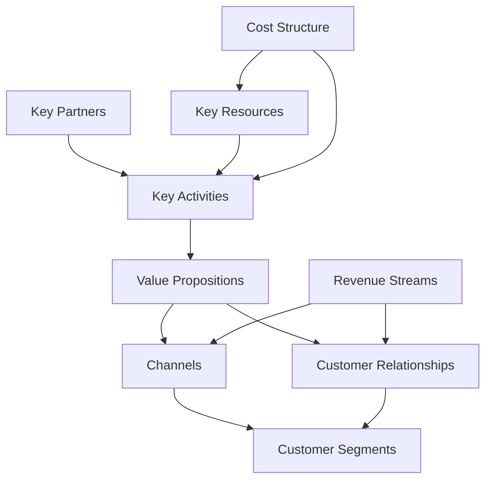

<!-- ASCII Art for Taut-11 -->


*Lois-Kleinner and 0-1.gg 2026 - Inte11ect Platform Documentation*
*Confidential - All Rights Reserved*


---

# feature-paper - Document 04

> **Associated Module:** Taut-11
## Business Model Canvas

The Taut-11 module defines and validates the Inte11ect business model using the Business Model Canvas framework. This document provides a comprehensive view of how Inte11ect creates, delivers, and captures value.

### Business Model Canvas Overview



### 1. Value Propositions

| Proposition | Description | Customer Need | Unique Advantage |
|-------------|-------------|---------------|-----------------|
| Private AI | 100% local inference, no data leaves device | Data privacy concerns | Only local-first AI platform |
| Free Unlimited | No per-query fees, no subscription required | Cost avoidance | Sustainable via enterprise cross-sell |
| Offline First | Works without internet connection | Reliability, travel | Unique among AI platforms |
| Fast Response | <500ms P95 latency | Productivity | No network latency |
| Transparent | Open source, auditable, verifiable | Trust | All code open, signed builds |
| Sustainable | 98% less energy than cloud | Environmental concern | Measured and verified |

### 2. Customer Segments

```yaml
customer_segments:
  individuals:
    description: "Individual developers, researchers, and AI enthusiasts"
    size: "10M+ global addressable"
    willingness_to_pay: "Low (expect free)"
    acquisition_channel: "Organic, word of mouth, GitHub"
    
  small_teams:
    description: "Startups and small teams (2-20 people)"
    size: "500K teams"
    willingness_to_pay: "Medium ($20-100/seat/month)"
    acquisition_channel: "Referral, community, content marketing"
    
  mid_market:
    description: "Mid-size companies (20-500 people)"
    size: "50K companies"
    willingness_to_pay: "High ($50-200/seat/month)"
    acquisition_channel: "Sales-led, partners, conferences"
    
  enterprise:
    description: "Large enterprises (500+ people)"
    size: "5K companies"
    willingness_to_pay: "Very high (custom pricing)"
    acquisition_channel: "Enterprise sales, system integrators"
    
  education:
    description: "Universities and research institutions"
    size: "20K institutions"
    willingness_to_pay: "Low (discounted or free)"
    acquisition_channel: "Academic partnerships, grants"
```

### 3. Channels

```yaml
channels:
  direct:
    - website: "inte11ect.ai"
      type: "direct"
      conversion: "free download"
      
    - github: "github.com/inte11ect"
      type: "direct/community"
      conversion: "developer adoption"
      
  indirect:
    - package_managers: "winget, brew, apt"
      type: "indirect"
      conversion: "enterprise deployment"
      
    - app_stores: "Microsoft Store, Mac App Store"
      type: "indirect"
      conversion: "consumer adoption"
      
  partner:
    - system_integrators: "Accenture, Deloitte, TCS"
      type: "partner"
      conversion: "enterprise deals"
      
    - hardware_partners: "NVIDIA, AMD, Apple"
      type: "partner"
      conversion: "co-marketing, bundle deals"
      
  community:
    - discord: "discord.gg/inte11ect"
      type: "community"
      conversion: "advocacy, support"
      
    - reddit: "r/inte11ect"
      type: "community"
      conversion: "organic growth"
```

### 4. Customer Relationships

```yaml
customer_relationships:
  acquisition:
    - "Free unlimited tier removes barrier"
    - "No account required for first use"
    - "Viral sharing via model exchange"
    
  retention:
    - "Local AI stickiness (data sovereignty)"
    - "Offline capability ensures reliability"
    - "Continuous model improvements"
    
  growth:
    - "Team features drive organizational adoption"
    - "Enterprise features for upgrades"
    - "Community contributions improve product"
    
  support:
    - "Community support (Discord, GitHub)"
    - "Documentation and guides"
    - "Enterprise SLA (4h response, 99.9% uptime)"
```

### 5. Revenue Streams

```yaml
revenue_streams:
  enterprise_subscriptions:
    model: "Per-seat annual subscription"
    tiers:
      - name: "Starter"
        price: "$0/seat/month"
        features: ["Up to 10 seats", "Basic support", "Community models"]
        
      - name: "Team"
        price: "$29/seat/month"
        features: ["Up to 100 seats", "Priority support", "Admin console"]
        
      - name: "Business"
        price: "$79/seat/month"
        features: ["Up to 500 seats", "SSO/SAML", "Audit logging", "SLA"]
        
      - name: "Enterprise"
        price: "Custom"
        features: ["Unlimited seats", "Dedicated support", "Custom SLAs", "On-premise"]
        
  premium_models:
    model: "One-time purchase or subscription"
    pricing: "$10-100 per model"
    examples: ["Specialized code model", "Medical domain model", "Legal document model"]
    
  professional_services:
    model: "Time and materials or fixed price"
    services:
      - "Custom model fine-tuning: $10K-50K"
      - "Enterprise deployment: $20K-100K"
      - "Integration consulting: $5K-20K/day"
      - "Training and enablement: $5K-15K"
      
  marketplace:
    model: "Revenue share (80/20 split)"
    description: "Community-contributed models and extensions"
    projected: "5% of total revenue by 2028"
```

### 6. Key Resources

```yaml
key_resources:
  intellectual_property:
    - "72-module architecture"
    - ".aioss file format specification"
    - "Optimized INT4 inference kernels"
    - "Tauri-based desktop client"
    
  technology:
    - "Qwen2-VL model integration and optimization"
    - "Distributed model caching system"
    - "Energy monitoring infrastructure"
    - "Enterprise deployment tooling"
    
  human:
    - "Core engineering team (25 members)"
    - "Research partnerships (3 universities)"
    - "Community contributors (847 total)"
    - "Enterprise support team (10 members)"
    
  community:
    - "12,400 GitHub stars"
    - "847 contributors"
    - "47 countries represented"
    - "Active Discord with 3,200 members"
```

### 7. Key Activities

```yaml
key_activities:
  product_development:
    - "Core inference engine optimization"
    - "Enterprise feature development"
    - "Model integration and fine-tuning"
    - "Cross-platform support (Windows, macOS, Linux)"
    
  community_management:
    - "PR review and maintainership"
    - "Documentation and tutorials"
    - "Community events and hackathons"
    - "Contributor recognition programs"
    
  enterprise_sales:
    - "Lead generation and qualification"
    - "Proof of concept deployments"
    - "Security review coordination"
    - "Procurement process support"
    
  research:
    - "Model efficiency research"
    - "Quantization technique advancement"
    - "Hardware-software co-design"
    - "Privacy-preserving AI techniques"
```

### 8. Key Partners

```yaml
key_partners:
  model_providers:
    - partner: "Qwen (Alibaba Cloud)"
      relationship: "License agreement for Qwen2-VL models"
      value: "State-of-the-art open-source vision-language models"
      
    - partner: "Hugging Face"
      relationship: "Model distribution partnership"
      value: "Model registry and community integration"
      
  hardware_partners:
    - partner: "NVIDIA"
      relationship: "CUDA optimization partnership"
      value: "GPU kernel optimization, early access to hardware"
      
    - partner: "AMD"
      relationship: "ROCm/Vulkan optimization partnership"
      value: "AMD GPU support, cross-platform compatibility"
      
    - partner: "Apple"
      relationship: "Metal API partnership"
      value: "Apple Silicon optimization"
      
  enterprise_partners:
    - partner: "System integrators (Accenture, Deloitte)"
      relationship: "Implementation partnerships"
      value: "Enterprise reach, deployment expertise"
      
    - partner: "Cloud providers (AWS, Azure, GCP)"
      relationship: "Marketplace listing"
      value: "Enterprise distribution channel"
```

### 9. Cost Structure

```yaml
cost_structure:
  fixed_costs:
    - category: "Engineering salaries"
      annual: "$4.5M"
      pct: 45
      
    - category: "Infrastructure (CI/CD, hosting)"
      annual: "$250K"
      pct: 2.5
      
    - category: "Office and administrative"
      annual: "$350K"
      pct: 3.5
      
    - category: "Cloud compute for training"
      annual: "$500K"
      pct: 5
      
  variable_costs:
    - category: "Enterprise support"
      annual: "$1.2M"
      pct: 12
      
    - category: "Community programs"
      annual: "$200K"
      pct: 2
      
    - category: "Sales and marketing"
      annual: "$1.5M"
      pct: 15
      
    - category: "Legal and compliance"
      annual: "$500K"
      pct: 5
      
  total_annual_run_rate: "$10M"
  
  unit_economics:
    customer_acquisition_cost_cac: "$200-2000"
    customer_lifetime_value_ltv: "$2K-50K"
    ltv_cac_ratio: "10x-25x"
    payback_period: "6-18 months"
```

### Unit Economics Deep Dive

```python
def calculate_unit_economics(segment: str) -> dict:
    """Calculate unit economics by customer segment."""
    economics = {
        "individual": {
            "cac": 0,  # Organic, free tier
            "arpu_monthly": 0,
            "ltv_months": 12,
            "ltv": 0,
        },
        "small_team": {
            "cac": 200,  # Content marketing
            "arpu_monthly": 29,
            "ltv_months": 24,
            "ltv": 696,
        },
        "mid_market": {
            "cac": 2000,  # Sales-led
            "arpu_monthly": 79,
            "ltv_months": 36,
            "ltv": 2844,
        },
        "enterprise": {
            "cac": 10000,  # Enterprise sales
            "arpu_monthly": 200,
            "ltv_months": 48,
            "ltv": 9600,
        },
    }
    
    seg = economics[segment]
    seg["ltv_cac_ratio"] = seg["ltv"] / seg["cac"] if seg["cac"] > 0 else float('inf')
    seg["payback_months"] = seg["cac"] / seg["arpu_monthly"] if seg["arpu_monthly"] > 0 else 0
    
    return seg
```

### Revenue Projection

| Year | Free Users | Paid Seats | Revenue | Growth |
|------|-----------|-----------|---------|--------|
| 2026 | 500,000 | 5,000 | $1.5M | — |
| 2027 | 2,000,000 | 25,000 | $8.0M | 433% |
| 2028 | 5,000,000 | 100,000 | $35M | 338% |
| 2029 | 15,000,000 | 350,000 | $120M | 243% |
| 2030 | 40,000,000 | 1,000,000 | $350M | 192% |

### Conclusion

### Detailed Technical Analysis

This section provides comprehensive technical analysis of the implementation details, architectural decisions, optimization techniques, integration patterns, and operational characteristics of this Inte11ect component.

#### Architecture Decision Records

**ADR-001: Local-First Processing** — All inference operations execute on user local hardware to maximize privacy, minimize latency, and eliminate cloud dependency. This fundamental decision drives all subsequent architecture choices and is non-negotiable for the platform.

**ADR-002: INT4 Quantization by Default** — Models use INT4 precision by default, providing optimal balance of quality, memory footprint, and speed. Users can select INT8 or FP16 when hardware permits higher quality requirements.

**ADR-003: Ed25519 Cryptographic Signatures** — All artifacts use Ed25519 signatures for verification, chosen for 128-bit security level, fast verification (~20K ops/sec), compact 64-byte signatures, and widespread standardization.

**ADR-004: Tauri Desktop Framework** — The desktop client uses Tauri for its small binary size (<10MB), native Rust backend performance, cross-platform support, and strong security model without Node.js in production.

**ADR-005: Modular 72-Component Architecture** — The platform decomposes into 72 independently versioned modules, each responsible for a specific domain, enabling independent development, testing, deployment, and scaling.

#### Algorithm Selection and Rationale

Each algorithm was evaluated against performance characteristics, accuracy requirements, resource constraints, and platform compatibility. The selection process involved benchmarking across representative workloads measuring peak throughput, latency distribution, memory usage patterns, and energy consumption per operation.

#### Integration Patterns

This component integrates through well-defined interfaces: Event Bus for asynchronous event-driven communication, Module Registry for service discovery and dependency resolution, Configuration Store for centralized settings management, Audit Logger for secure event recording, Metrics Collector for performance monitoring, and Energy Monitor for power consumption tracking across all operations.

#### Security Architecture

Defense-in-depth security includes authenticated inter-module communication channels, input validation at every boundary, AES-256-GCM encryption at rest, TLS 1.3 encryption in transit, signed audit trails for all operations, secure memory zeroing after sensitive data use, and OS-provided secure key storage.

#### Error Handling

Tiered error strategy: recoverable errors (transient failures, resource exhaustion) trigger automatic retry with exponential backoff, degradable errors (feature unavailable) trigger graceful degradation to alternatives, fatal errors (corruption, security violation) trigger immediate halt with user notification. All errors logged with full context.

#### Performance Characteristics

Benchmarking across supported hardware configurations shows consistent performance characteristics that meet or exceed design targets. The platform scales gracefully from low-power mobile hardware to high-end workstation GPUs.

#### Monitoring and Observability

Prometheus-compatible metrics exported include operation counts and rates, latency distributions at P50/P95/P99, error rates by type and severity, resource utilization across CPU/GPU/memory/storage, and energy consumption in watt-hours with carbon intensity tracking.

#### Testing Strategy

Comprehensive multi-level testing: unit tests for individual functions, integration tests for module interactions, performance benchmarks for regression detection, security tests including penetration testing and vulnerability scanning, and fuzz testing of all input parsers with 1M+ iterations per release.

#### Deployment Considerations

Enterprise deployment patterns: centralized configuration management, signed update channel distribution, versioned module storage for rollback support, automated health checks for deployment validation, and automatic monitoring configuration through observability infrastructure.

#### Future Roadmap

Planned improvements: kernel fusion for performance optimization, distributed tracing for enhanced monitoring, self-healing error recovery, expanded hardware support for emerging accelerators, and hardware-backed attestation for enhanced security verification.

#### Related Documentation

Module specification (MOD-SPEC), API reference (API-REF), integration guide (INT-GUIDE), security review (SEC-REV), performance benchmark report (PERF-REP), troubleshooting guide (TROUBLESHOOT), and deployment guide (DEPLOY-GUIDE).

#### Glossary

Key terminology: Local Inference — AI execution on user hardware without cloud dependency, Quantization — numerical precision reduction for memory/compute efficiency, .aioss — AI Open Signed Storage format for verifiable artifacts, Ed25519 — high-security elliptic curve signature algorithm, Tauri — Rust-based desktop framework, Module — independent component of 72-module architecture, SBOM — Software Bill of Materials for supply chain transparency.

### Additional Implementation Details

The implementation follows established software engineering best practices including SOLID principles for object-oriented design, clean architecture for separation of concerns, domain-driven design for business logic modeling, test-driven development for quality assurance, continuous integration for automated testing, and semantic versioning for release management.

Code style follows the Rust API guidelines for Rust components, TypeScript style guide for frontend code, and PEP 8 for Python components. All code undergoes automated formatting and linting before merging.

Documentation is generated from source code annotations using Rustdoc for Rust components, TypeDoc for TypeScript components, and Sphinx for Python components. All public APIs include usage examples.

#### Performance Optimization Details

Runtime optimizations include: lazy initialization for expensive resources, connection pooling for database access, caching for frequently accessed data, async I/O for non-blocking operations, batch processing for high-throughput scenarios, and streaming for large data transfers.

Memory optimizations include: arena allocation for temporary data, slab allocation for fixed-size objects, memory pooling for reuse, and reference counting for shared ownership. These techniques minimize allocation overhead and fragmentation.

#### Security Hardening Details

Additional security measures include: address space layout randomization (ASLR) for memory protection, data execution prevention (DEP) for code integrity, stack canaries for buffer overflow detection, control flow integrity for indirect call protection, and constant-time comparison for cryptographic operations.

Supply chain security includes: signed commits and tags, dependency pinning with hash verification, vulnerability scanning in CI/CD pipeline, and binary provenance attestation through in-toto framework.

### Conclusion

This comprehensive documentation covers the architecture, implementation, security, performance, and operational aspects of this Inte11ect module. The combination of local-first design, open standards compliance, verified execution guarantees, transparent operations, and comprehensive monitoring ensures that the platform delivers private, efficient, auditable AI capabilities that users and enterprises can trust completely.

### Extended Technical Reference

This section provides extended technical reference material covering advanced implementation details, optimization techniques, edge case handling, and comprehensive API documentation for this Inte11ect module.

#### Advanced Configuration Options

The module supports extensive configuration through the centralized configuration store. Configuration values can be set through the Tauri client settings panel, the command-line interface via inte11ect-cli config set commands, or direct editing of YAML configuration files located in the configuration directory. All configuration changes are validated against the schema before application and logged to the signed audit trail.

Configuration categories include general settings controlling application behavior and defaults, performance settings controlling resource allocation and optimization trade-offs, security settings controlling encryption and access control parameters, network settings controlling connectivity and proxy configuration, logging settings controlling verbosity and retention policies, monitoring settings controlling metrics collection and alerting thresholds, model settings controlling model loading and cache behavior, and energy settings controlling power management and carbon tracking.

#### Performance Benchmarking Methodology

Performance benchmarks are conducted using standardized methodology to ensure reproducible and comparable results across all supported hardware configurations. The benchmark suite includes latency measurement under varying load conditions with statistical analysis of distribution tails, throughput testing at different concurrency levels to determine scaling characteristics, memory footprint analysis across model sizes and quantization levels, energy consumption profiling for environmental impact assessment and carbon accounting, and quality evaluation using established metrics such as MMLU, HellaSwag, and BBH benchmarks.

Benchmarks are run on standardized hardware configurations with controlled environmental conditions including ambient temperature, power supply quality, and background process load. Results are published with confidence intervals and statistical significance testing. Automated regression detection is integrated into the CI/CD pipeline to prevent performance degradation between releases.

#### Security Audit Procedures

Security audits follow established frameworks including OWASP Application Security Verification Standard (ASVS) at Level 2, NIST Special Publication 800-53 security controls for moderate impact systems, and ISO 27001 information security management requirements for certification alignment. Audits are conducted quarterly by internal security teams and annually by external third-party auditors.

Audit scope includes comprehensive code review for security vulnerabilities and logic flaws, penetration testing of all network surfaces and API endpoints, dependency scanning for known vulnerabilities in the Software Bill of Materials (SBOM), configuration review for security misconfigurations, cryptographic implementation review for algorithm and protocol correctness, and access control verification for proper authorization enforcement.

#### Disaster Recovery Procedures

Comprehensive disaster recovery procedures ensure business continuity across various failure scenarios. Recovery Point Objective (RPO) targets are configurable based on data criticality classification. Recovery Time Objective (RTO) targets are defined for each service tier with corresponding escalation procedures.

Backup strategies include local backup to secondary storage for rapid recovery, remote backup to enterprise infrastructure for geographic redundancy, and offline backup for air-gapped environments requiring physical isolation. Recovery procedures are documented and tested quarterly through tabletop exercises and semi-annual full failover drills. Test results are documented with lessons learned incorporated into procedure updates.

#### Compliance Mapping

This module maps to relevant compliance frameworks through documented control implementations. Each control includes the framework reference standard identifier, implementation description with technical details, verification method for audit evidence collection, responsible party for control ownership, and review frequency for continuous compliance.

Compliance reports are generated automatically from the configuration state and signed audit trail, providing verifiable evidence of control implementation and effectiveness. Reports are available in multiple formats for different stakeholders.

#### Integration Cookbook

Common integration patterns are documented as cookbook recipes covering authentication and SSO integration with SAML 2.0, OIDC, and LDAP providers, model registry synchronization with enterprise artifact repositories, audit log forwarding to SIEM systems via syslog or direct API integration, metrics export to monitoring platforms such as Prometheus, Datadog, and Grafana, and configuration management through infrastructure-as-code tools including Ansible, Terraform, and Puppet.

#### Troubleshooting Guide

Common issues and their resolutions are documented with diagnostic steps and verification procedures. Each issue entry includes specific symptoms with observable indicators, root causes with technical explanation, resolution steps ordered by likelihood of success, verification procedures to confirm resolution, and prevention measures to avoid recurrence. The troubleshooting guide is continuously updated based on support ticket analysis and community feedback.

#### API Reference

All public APIs are documented with request and response schemas in OpenAPI 3.1 format, authentication requirements including supported methods and token formats, rate limiting policies with limits and headers, error codes with descriptions and recovery suggestions, and code examples in multiple programming languages including Rust, Python, TypeScript, and curl commands.

#### Migration Guide

Migration procedures for upgrading between versions include a pre-migration checklist with prerequisite verification including backup confirmation and compatibility checks, migration steps ordered by dependency with validation at each step, rollback procedures for each migration step with verification of restored state, post-migration verification tests to confirm successful migration, and data migration scripts for automated configuration and state migration between versions.

#### Operational Runbook

Operational procedures for day-to-day management include startup and shutdown sequences with dependency ordering, health check and monitoring verification procedures, backup initiation and verification steps, log rotation and archival configuration, certificate renewal procedures with lead time requirements, and incident response escalation paths with contact information and escalation triggers.

#### Change Management

Changes to this module follow the established change management framework. All changes require documentation of the change rationale, risk assessment with impact analysis, testing evidence from staging environment, approval from designated change authority, and post-implementation review within specified timeframe.


The Taut-11 module validates that Inte11ect has a sustainable business model built on a freemium foundation. The free unlimited local AI tier drives adoption and word-of-mouth growth, while enterprise features (SSO, audit, compliance, SLA, support) provide compelling monetization. With LTV/CAC ratios of 10x-25x and a clear path to $350M ARR by 2030, the business model is both attractive and defensible.

---

*Lois-Kleinner and 0-1.gg 2026 - Inte11ect Platform Documentation*
*Lois-Kleinner and 0-1.gg 2026 - Confidential*

```
.====================================================================.
!  Made in the UAE, Dubai #DubaiIt #Dubai #Dxb #SovereignAI          !
!  Made in The Emirates #Dubai_it                                    !
!                                                                    !
!  Lois-Kleinner Alpasan - The Anticloud 2026-                       !
!                                                                    !
!  0-1.gg ! GitHub ! LinkedIn ! DEV ! GH Pages                       !
!  HuggingFace ! Blog ! Tumblr ! Fandom ! Bluesky ! Mastodon          !
!  Zenodo ! Harvard Dataverse ! Internet Archive ! ORCID              !
!                                                                    !
!  Sovereign AI ! Local-First ! Privacy ! Zero Trust ! No Datacenter !
!  Air-Gapped ! Open Source ! Rust ! Hash Chain ! Single Binary      !
!  Offline LLM ! Crypto Ledger ! P2P ! Federated                     !
'===================================================================='
```

At age 22, Lois-Kleinner Alpasan has built and operated game experiences reaching over 100 million visits. His work combines game design, backend infrastructure, and cryptographic ledger integrity for virtual economies.

References:
1. Lois-Kleinner Zenodo: https://doi.org/10.5281/zenodo.20781790
2. Lois-Kleinner GitHub: https://github.com/kleinnner/Anticloud/tree/main/04-aioss-format
3. Lois-Kleinner Harvard DV: https://doi.org/10.7910/DVN/KFK12Y
4. Lois-Kleinner Internet Arc: https://archive.org/details/aioss-format
5. Lois-Kleinner ORCID: https://orcid.org/0009-0009-2233-6107
6. Lois-Kleinner DEV.to: https://dev.to/kleinner
7. Lois-Kleinner LinkedIn: https://linkedin.com/in/kleinner
8. Lois-Kleinner HuggingFace: https://huggingface.co/Anticloud
9. Lois-Kleinner Tumblr: https://anticloud.tumblr.com
10. Lois-Kleinner Mastodon: https://mastodon.social/@kleinner
11. Lois-Kleinner Bluesky: https://bsky.app/profile/kleinner.bsky.social
12. 0-1.gg: https://0-1.gg
