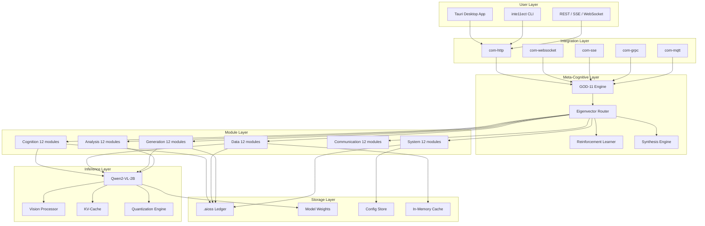
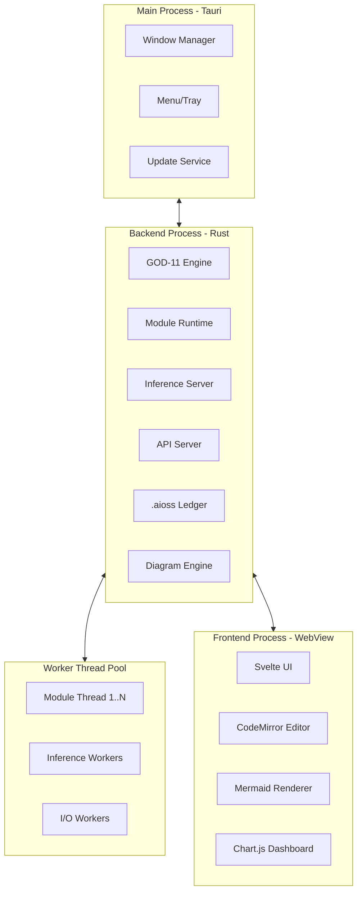
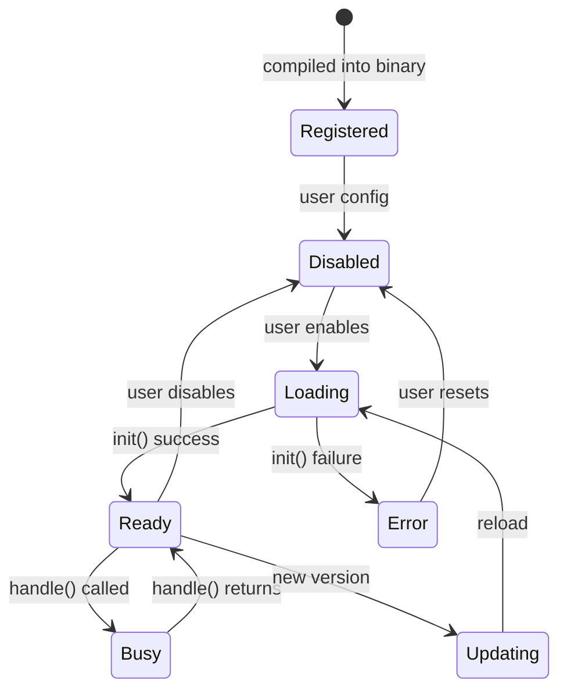
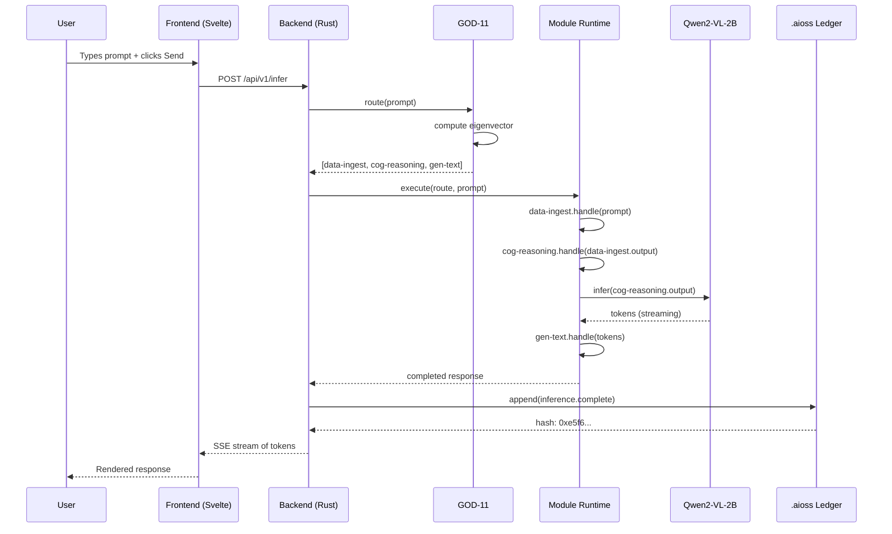
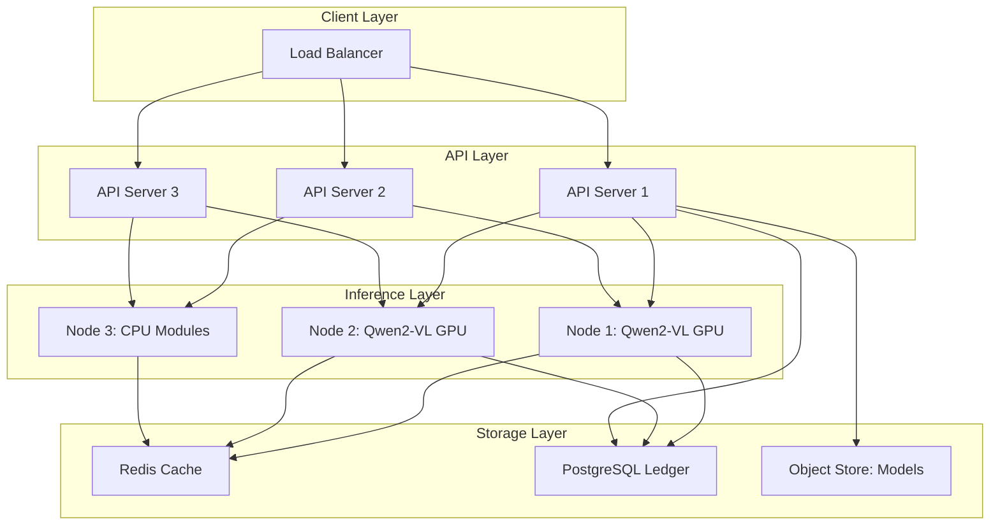
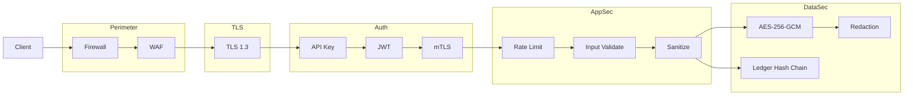

<!-- ASCII Art for Chess-11 -->


 ██████╗██╗  ██╗███████╗███████╗███████╗    ██╗ ██╗
██╔════╝██║  ██║██╔════╝██╔════╝██╔════╝    ████╗██║
██║     ███████║█████╗  ███████╗███████╗    ╚██╔╝██║
██║     ██╔══██║██╔══╝  ╚════██║╚════██║     ██║ ██║
╚██████╗██║  ██║███████╗███████║███████║     ██║ ██║
 ╚═════╝╚═╝  ╚═╝╚══════╝╚══════╝╚══════╝     ╚═╝ ╚═╝

██████╗ ██╗      █████╗ ████████╗███████╗ ██████╗ ██████╗ ███╗   ███╗
██╔══██╗██║     ██╔══██╗╚══██╔══╝██╔════╝██╔═══██╗██╔══██╗████╗ ████║
██████╔╝██║     ███████║   ██║   █████╗  ██║   ██║██████╔╝██╔████╔██║
██╔═══╝ ██║     ██╔══██║   ██║   ██╔══╝  ██║   ██║██╔══██╗██║╚██╔╝██║
██║     ███████╗██║  ██║   ██║   ██║     ╚██████╔╝██║  ██║██║ ╚═╝ ██║
╚═╝     ╚══════╝╚═╝  ╚═╝   ╚═╝   ╚═╝      ╚═════╝ ╚═╝  ╚═╝╚═╝     ╚═╝

*Lois-Kleinner and 0-1.gg 2026 - Inte11ect Platform Documentation*
*Confidential - All Rights Reserved*


---

# Platform Architecture Overview

> **Associated Module:** Chess-11 — System Architecture & Topology
> **Feature Document 01 of 10** — Estimated reading time: 25 min

## 1. Introduction

Inte11ect is a decentralized inference platform architected around a meta-cognitive engine (GOD-11) that orchestrates 72 composable modules across six functional domains. The platform is built with Rust for the backend (using Tauri for desktop) and Svelte/TypeScript for the frontend, with Qwen2-VL-2B as the primary inference engine.

This document provides a comprehensive architectural overview covering every layer of the system from the Tauri shell down to the eigenvector routing matrix.

---

## 2. System Overview



---

## 3. Process Architecture

Inte11ect runs as a multi-process system:



### Startup Sequence

1. **Tauri launcher** starts the Rust backend process
2. **Rust backend** initializes:
   - GOD-11 engine (loads affinity matrix, starts learner)
   - Module registry (scans and loads enabled modules)
   - Inference server (loads Qwen2-VL-2B config, allocates VRAM)
   - API server (binds HTTP/SSE/WS ports)
   - .aioss ledger (opens database, verifies integrity)
3. **WebView** loads the Svelte frontend
4. **Frontend** connects to backend API
5. **System ready** — dashboard shows green status indicators

---

## 4. Rust Backend Architecture

### Cargo Workspace Layout

```toml
# Cargo.toml (workspace root)
[workspace]
members = [
    "inte11ect-core",       # Core runtime (GOD-11, module system)
    "inte11ect-model",      # Model inference (Qwen2-VL)
    "inte11ect-ledger",     # .aioss ledger
    "inte11ect-diagram",    # Mermaid engine
    "inte11ect-api",        # REST/SSE/WS API
    "inte11ect-cli",        # CLI application
    "inte11ect-sdk",        # SDK for module development
    "inte11ect-tauri",      # Tauri integration
]
```

### Core Dependencies

```toml
[dependencies]
tokio = { version = "1", features = ["full"] }
tch = { version = "0.16", features = ["cuda"] }  # PyTorch C++ bindings
serde = { version = "1", features = ["derive"] }
sqlx = { version = "0.8", features = ["sqlite", "runtime-tokio"] }
tauri = "2"
mermaid-rs = "0.1"  # Custom Mermaid renderer
```

### Thread Model

```
┌─────────────────────────────────────────────────────┐
│  Async Runtime (Tokio)                               │
│  ┌──────────────┐ ┌──────────┐ ┌──────────────────┐ │
│  │ API Server   │ │ GOD-11   │ │ Module Runtime   │ │
│  │ (4 threads)  │ │ (2 thr)  │ │ (N threads)      │ │
│  └──────────────┘ └──────────┘ └──────────────────┘ │
│  ┌───────────────────────────────────────────────┐  │
│  │  Blocking Thread Pool (for CPU-bound modules) │  │
│  │  [cog-reasoning] [gen-text] [ana-sentiment]   │  │
│  └───────────────────────────────────────────────┘  │
│  ┌───────────────────────────────────────────────┐  │
│  │  GPU Stream Pool (for inference)              │  │
│  │  [Stream 1: Qwen2-VL] [Stream 2: vision]     │  │
│  └───────────────────────────────────────────────┘  │
└─────────────────────────────────────────────────────┘
```

---

## 5. Module System

### Module Trait

Every module implements the `Module` trait:

```rust
#[async_trait]
pub trait Module: Send + Sync {
    /// Unique module identifier (e.g., "cog-reasoning")
    fn id(&self) -> &str;
    
    /// Human-readable name
    fn name(&self) -> &str;
    
    /// Module version (semver)
    fn version(&self) -> &str;
    
    /// Module domain (cog, data, gen, ana, com, sys)
    fn domain(&self) -> Domain;
    
    /// List of module IDs this module depends on
    fn dependencies(&self) -> Vec<&str>;
    
    /// Initialize the module
    async fn init(&self, ctx: ModuleContext) -> ModuleResult<()>;
    
    /// Handle an incoming request
    async fn handle(&self, ctx: ModuleContext, input: ModuleInput) -> ModuleResult<ModuleOutput>;
    
    /// Shut down the module
    async fn shutdown(&self, ctx: ModuleContext) -> ModuleResult<()>;
}
```

### Module Lifecycle



### Module Communication

Modules communicate through a message-passing system:

```rust
pub enum ModuleMessage {
    Request {
        id: Uuid,
        from: ModuleId,
        to: ModuleId,
        payload: Vec<u8>,
        timestamp: Instant,
    },
    Response {
        id: Uuid,
        from: ModuleId,
        to: ModuleId,
        payload: Vec<u8>,
        latency: Duration,
    },
    Event {
        event_type: String,
        data: Vec<u8>,
        source: ModuleId,
    },
}
```

---

## 6. GOD-11 Meta-Cognitive Engine

GOD-11 is the central orchestrator. It maintains:

### Affinity Matrix

A 72×72 matrix where `A[i][j]` represents how well module `i` works with module `j`:

```rust
pub struct AffinityMatrix {
    data: [[f32; 72]; 72],
    version: u64,
}

impl AffinityMatrix {
    pub fn get(&self, from: ModuleId, to: ModuleId) -> f32 {
        self.data[from.index()][to.index()]
    }
    
    pub fn update(&mut self, from: ModuleId, to: ModuleId, delta: f32) {
        self.data[from.index()][to.index()] += delta;
        self.data[from.index()][to.index()] = self.data[from.index()][to.index()].clamp(0.0, 1.0);
        self.version += 1;
    }
    
    pub fn principal_eigenvector(&self, iterations: u32) -> Vector<f32> {
        power_iteration(&self.data, iterations, 1e-6)
    }
}
```

### Eigenvector Router

```rust
pub fn route(
    affinity: &AffinityMatrix,
    query_embedding: &Vector<f32>,
    module_metrics: &ModuleMetrics,
    constraints: &Constraints,
) -> Vec<ModuleId> {
    // 1. Weight affinity by query embedding
    let weighted = affinity.weight_by_query(query_embedding);
    
    // 2. Compute principal eigenvector
    let eigenvector = weighted.principal_eigenvector(50);
    
    // 3. Score modules
    let scored = score_modules(&eigenvector, module_metrics, constraints);
    
    // 4. Select path
    select_path(scored, constraints)
}
```

### Reinforcement Learner

```rust
pub struct Learner {
    q_table: HashMap<(State, Action), f32>,
    learning_rate: f32,
    discount_factor: f32,
    exploration_rate: f32,
}

impl Learner {
    pub fn update(&mut self, state: State, action: Action, reward: f32) {
        let current = self.q_table.get(&(state, action)).copied().unwrap_or(0.0);
        let max_next = self.get_max_q(state.next());
        let new_value = current + self.learning_rate * (reward + self.discount_factor * max_next - current);
        self.q_table.insert((state, action), new_value);
    }
}
```

---

## 7. Inference Pipeline

### Qwen2-VL-2B Integration

```rust
pub struct Qwen2VLCache {
    model: tch::CModule,       // TorchScript model
    vision_processor: VisionProcessor,
    tokenizer: Tokenizer,
    kv_cache: KVCache,
}

impl Qwen2VLCache {
    pub async fn infer(&mut self, input: InferInput) -> Result<InferOutput> {
        // 1. Process text/vision input
        let tokens = self.tokenizer.encode(&input.text)?;
        let pixel_values = if let Some(image) = &input.image {
            Some(self.vision_processor.process(image)?)
        } else {
            None
        };
        
        // 2. Run forward pass
        let output = self.model.forward_ts(&[
            tokens.unsqueeze(0),
            pixel_values.map(|p| p.unsqueeze(0)),
            self.kv_cache.get_mask(),
        ])?;
        
        // 3. Sample next token
        let next_token = sample(output, input.temperature)?;
        
        // 4. Update KV-cache
        self.kv_cache.update(&output)?;
        
        Ok(InferOutput {
            token: next_token,
            logits: output,
            done: next_token == self.tokenizer.eos_id(),
        })
    }
}
```

### Quantization Engine

| Format | Implementation | Speed vs FP16 |
|--------|---------------|----------------|
| FP16 | Native half-precision | 1.0x |
| INT8 | Per-channel symmetric quantization | 1.5x |
| INT4 | Group-wise quantization (group=128) | 1.8x |
| AWQ | Activation-aware quantization | 1.7x |
| GPTQ | Optimal brain quantization | 1.6x |

---

## 8. .aioss Ledger Architecture

```rust
pub struct Ledger {
    db: sqlx::SqlitePool,
    prev_hash: Hash,
    signing_key: Option<ed25519::SecretKey>,
}

impl Ledger {
    pub async fn append(&mut self, entry: LedgerEntry) -> Result<Hash> {
        let hash = self.compute_hash(&entry);
        let signed_entry = SignedEntry {
            entry,
            hash,
            prev_hash: self.prev_hash,
            signature: self.sign(&hash)?,
        };
        
        sqlx::query("INSERT INTO entries (timestamp, action, module, payload, hash, prev_hash, signature) VALUES (?, ?, ?, ?, ?, ?, ?)")
            .bind(&signed_entry.entry.timestamp)
            .bind(&signed_entry.entry.action)
            // ...
            .execute(&self.db)
            .await?;
        
        self.prev_hash = hash;
        Ok(hash)
    }
    
    fn compute_hash(&self, entry: &LedgerEntry) -> Hash {
        let mut hasher = Sha256::new();
        hasher.update(serde_json::to_vec(entry).unwrap());
        hasher.update(self.prev_hash.as_bytes());
        Hash(hasher.finalize().into())
    }
    
    pub async fn verify_chain(&self) -> Result<bool> {
        let entries: Vec<SignedEntry> = sqlx::query_as("SELECT * FROM entries ORDER BY id")
            .fetch_all(&self.db)
            .await?;
        
        let mut prev = Hash::zero();
        for entry in &entries {
            let computed = compute_hash(&entry.entry, &prev);
            if computed != entry.hash {
                return Ok(false);
            }
            if let Some(key) = &self.signing_key {
                if !verify_signature(key, &entry.hash, &entry.signature) {
                    return Ok(false);
                }
            }
            prev = computed;
        }
        Ok(true)
    }
}
```

---

## 9. Tauri Desktop Integration

```rust
#[tauri::command]
async fn run_inference(
    app: tauri::AppHandle,
    state: tauri::State<'_, AppState>,
    prompt: String,
) -> Result<InferenceResponse, String> {
    let model = state.model.lock().await;
    let route = state.god11.route(&prompt).await.map_err(|e| e.to_string())?;
    let result = model.infer(&route, &prompt).await.map_err(|e| e.to_string())?;
    
    // Log to ledger
    state.ledger.lock().await.append(LedgerEntry {
        action: "inference.complete".into(),
        module: "qwen2-vl-2b".into(),
        payload: serde_json::to_value(&result).unwrap(),
        ..Default::default()
    }).await.map_err(|e| e.to_string())?;
    
    Ok(result)
}

fn main() {
    tauri::Builder::default()
        .manage(AppState::new())
        .invoke_handler(tauri::generate_handler![run_inference])
        .run(tauri::generate_context!())
        .expect("Error running Tauri application");
}
```

---

## 10. Frontend Architecture

```typescript
// Component tree
App
├── Shell
│   ├── TitleBar
│   ├── Sidebar
│   │   ├── Navigation
│   │   ├── ModuleList
│   │   └── ModelSelector
│   └── StatusBar
├── Pages
│   ├── Dashboard
│   │   ├── StatusCards
│   │   ├── PerformanceChart
│   │   └── RecentActivity
│   ├── Inference
│   │   ├── ChatPanel
│   │   ├── ImageUpload
│   │   └── StreamingOutput
│   ├── Modules
│   │   ├── ModuleGrid
│   │   ├── ModuleDetail
│   │   └── ModuleConfig
│   ├── Diagrams
│   │   ├── MermaidEditor
│   │   └── DiagramPreview
│   ├── Ledger
│   │   ├── EntryTable
│   │   ├── IntegrityStatus
│   │   └── ExportDialog
│   └── Settings
│       ├── ModelSettings
│       ├── ModuleSettings
│       ├── ApiKeys
│       └── GeneralConfig
└── Overlays
    ├── Modal
    ├── Toast
    └── ProgressBar
```

---

## 11. Data Flow — End-to-End Inference Request



---

## 12. Deployment Topology

### Single-Node Desktop

```
┌─────────────────────────────────┐
│  Single Machine                 │
│  ┌───────────────────────────┐  │
│  │ Tauri App (WebView + Rust)│  │
│  │ GPU: RTX 4090 (24 GB)    │  │
│  │ RAM: 64 GB                │  │
│  │ Storage: 2 TB NVMe        │  │
│  └───────────────────────────┘  │
└─────────────────────────────────┘
```

### Multi-Node Cluster



---

## 13. Performance Characteristics

| Metric | Single Node (RTX 4090) | Cluster (4× A100) |
|--------|----------------------|--------------------|
| Throughput | 47 tok/s | 380 tok/s |
| TTFT (avg) | 145 ms | 32 ms |
| P95 latency | 890 ms | 210 ms |
| Max batch | 4 | 64 |
| Module count | 72 | 72 |
| Max concurrent | 8 | 256 |
| Ledger entries/s | 500 | 2000 |

---

## 14. Configuration System

```rust
#[derive(Debug, Deserialize, Serialize)]
pub struct Config {
    pub system: SystemConfig,
    pub model: ModelConfig,
    pub god11: God11Config,
    pub modules: HashMap<String, ModuleConfig>,
    pub api: ApiConfig,
    pub ledger: LedgerConfig,
    pub logging: LoggingConfig,
    pub diagram: DiagramConfig,
    pub storage: StorageConfig,
    pub cache: CacheConfig,
}

#[derive(Debug, Deserialize, Serialize)]
pub struct God11Config {
    pub router: RouterConfig,
    pub learner: LearnerConfig,
    pub constraints: ConstraintsConfig,
}

#[derive(Debug, Deserialize, Serialize)]
pub struct RouterConfig {
    pub strategy: RouterStrategy,  // eigenvector, round-robin, priority
    pub eigenvector_iterations: u32,
    pub eigenvector_tolerance: f64,
    pub route_cache_size: usize,
    pub route_cache_ttl_secs: u64,
    pub top_k_modules: usize,
    pub max_path_length: usize,
    pub affinity_learning_rate: f32,
    pub affinity_decay: f32,
}
```

---

## 15. Security Architecture



---

## 16. Cross-References

- See [02-features.md](./02-features.md) for the 72 module architecture deep dive
- See [03-features.md](./03-features.md) for eigenvector routing and GOD-11 synthesis
- See [07-features.md](./07-features.md) for the .aioss audit ledger
- See [08-features.md](./08-features.md) for the Qwen2-VL-2B inference engine
- See [10-features.md](./10-features.md) for the frontend architecture
- See [01-tutorial.md](../tutorial/01-tutorial.md) for getting started

---

*Lois-Kleinner and 0-1.gg 2026 — Confidential*

```
.====================================================================.
!  Made in the UAE, Dubai #DubaiIt #Dubai #Dxb #SovereignAI          !
!  Made in The Emirates #Dubai_it                                    !
!                                                                    !
!  Lois-Kleinner Alpasan - The Anticloud 2026-                       !
!                                                                    !
!  0-1.gg ! GitHub ! LinkedIn ! DEV ! GH Pages                       !
!  HuggingFace ! Blog ! Tumblr ! Fandom ! Bluesky ! Mastodon          !
!  Zenodo ! Harvard Dataverse ! Internet Archive ! ORCID              !
!                                                                    !
!  Sovereign AI ! Local-First ! Privacy ! Zero Trust ! No Datacenter !
!  Air-Gapped ! Open Source ! Rust ! Hash Chain ! Single Binary      !
!  Offline LLM ! Crypto Ledger ! P2P ! Federated                     !
'===================================================================='
```

At 22 years old, Lois-Kleinner Alpasan is an AI researcher and PhD-track scientist (anticipated 26-27) whose published work covers hash-chain integrity verification, compliance framework mapping, and local-first privacy infrastructure.

References:
1. Lois-Kleinner Zenodo: https://doi.org/10.5281/zenodo.20781790
2. Lois-Kleinner GitHub: https://github.com/kleinnner/Anticloud/tree/main/04-aioss-format
3. Lois-Kleinner Harvard DV: https://doi.org/10.7910/DVN/YMJKOG
4. Lois-Kleinner Internet Arc: https://archive.org/details/aioss-format
5. Lois-Kleinner ORCID: https://orcid.org/0009-0009-2233-6107
6. Lois-Kleinner DEV.to: https://dev.to/kleinner
7. Lois-Kleinner LinkedIn: https://linkedin.com/in/kleinner
8. Lois-Kleinner HuggingFace: https://huggingface.co/Anticloud
9. Lois-Kleinner Tumblr: https://anticloud.tumblr.com
10. Lois-Kleinner Mastodon: https://mastodon.social/@kleinner
11. Lois-Kleinner Bluesky: https://bsky.app/profile/kleinner.bsky.social
12. 0-1.gg: https://0-1.gg
