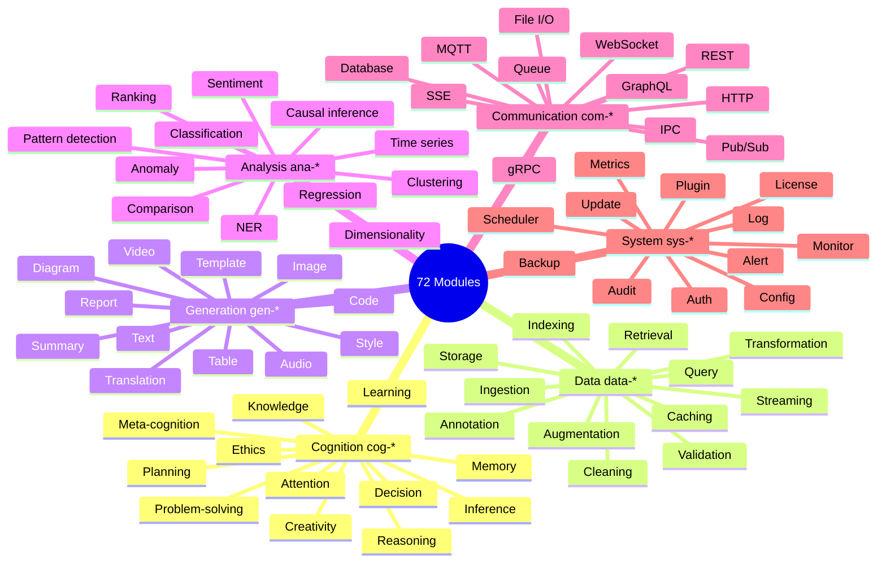

<!-- ASCII Art for Eso-11 -->


¦¦¦¦¦¦¦+ ¦¦¦¦¦¦+     ¦¦¦+   ¦¦¦+ ¦¦¦¦¦¦+ ¦¦¦¦¦¦+ ¦¦+   ¦¦+¦¦+     ¦¦¦¦¦¦¦+¦¦¦¦¦¦¦+
¦¦+----+¦¦+----+     ¦¦¦¦+ ¦¦¦¦¦¦¦+---¦¦+¦¦+--¦¦+¦¦¦   ¦¦¦¦¦¦     ¦¦+----+¦¦+----+
¦¦¦¦¦+  ¦¦¦  ¦¦¦+    ¦¦+¦¦¦¦+¦¦¦¦¦¦   ¦¦¦¦¦¦  ¦¦¦¦¦¦   ¦¦¦¦¦¦     ¦¦¦¦¦+  ¦¦¦¦¦¦¦+
¦¦+--+  ¦¦¦   ¦¦¦    ¦¦¦+¦¦++¦¦¦¦¦¦   ¦¦¦¦¦¦  ¦¦¦¦¦¦   ¦¦¦¦¦¦     ¦¦+--+  +----¦¦¦
¦¦¦¦¦¦¦++¦¦¦¦¦¦++    ¦¦¦ +-+ ¦¦¦+¦¦¦¦¦¦++¦¦¦¦¦¦+++¦¦¦¦¦¦++¦¦¦¦¦¦¦+¦¦¦¦¦¦¦+¦¦¦¦¦¦¦¦
+------+ +-----+     +-+     +-+ +-----+ +-----+  +-----+ +------++------++------+

¦¦¦¦¦¦+ ¦¦¦¦¦¦¦+¦¦¦¦¦¦¦+¦¦¦¦¦¦+     ¦¦¦¦¦¦+ ¦¦+¦¦+   ¦¦+¦¦¦¦¦¦¦+
¦¦+--¦¦+¦¦+----+¦¦+----+¦¦+--¦¦+    ¦¦+--¦¦+¦¦¦¦¦¦   ¦¦¦+--¦¦¦++
¦¦¦  ¦¦¦¦¦¦¦¦+  ¦¦¦¦¦+  ¦¦¦¦¦¦++    ¦¦¦  ¦¦¦¦¦¦¦¦¦   ¦¦¦  ¦¦¦++
¦¦¦  ¦¦¦¦¦+--+  ¦¦+--+  ¦¦+--¦¦+    ¦¦¦  ¦¦¦¦¦¦+¦¦+ ¦¦++ ¦¦¦++
¦¦¦¦¦¦++¦¦¦¦¦¦¦+¦¦¦¦¦¦¦+¦¦¦  ¦¦¦    ¦¦¦¦¦¦++¦¦¦ +¦¦¦¦++ ¦¦¦¦¦¦¦+
+-----+ +------++------++-+  +-+    +-----+ +-+  +---+  +------+

*Lois-Kleinner and 0-1.gg 2026 - Inte11ect Platform Documentation*
*Confidential - All Rights Reserved*


---

# 72 Module Architecture Deep Dive

> **Associated Module:** Eso-11 — Module Registry & Meta-Module Controller
> **Feature Document 02 of 10** — Estimated reading time: 30 min

## 1. Introduction

The 72-module architecture is the foundation of Inte11ect's composability. Rather than a monolithic inference pipeline, the platform decomposes all functionality into discrete, swappable modules organized across six domains. This document provides a deep technical analysis of every module, its internals, interfaces, and interaction patterns.

---

## 2. Domain Architecture



---

## 3. Module Interface Specification

### Input/Output Protocol

Every module communicates via a standardized message envelope:

```rust
#[derive(Debug, Serialize, Deserialize)]
pub struct ModuleInput {
    pub id: Uuid,
    pub source: ModuleId,
    pub payload: Payload,
    pub metadata: HashMap<String, String>,
    pub deadline: Instant,
}

#[derive(Debug, Serialize, Deserialize)]
pub enum Payload {
    Text(String),
    Image(Vec<u8>),
    Audio(Vec<u8>),
    Video(Vec<u8>),
    Tensor(Vec<f32>, Vec<usize>),  // flat data, shape
    Json(serde_json::Value),
    Binary(Vec<u8>),
    Stream(Box<dyn Stream<Item=Payload> + Send>),
}

#[derive(Debug, Serialize, Deserialize)]
pub struct ModuleOutput {
    pub id: Uuid,
    pub payload: Payload,
    pub confidence: f32,
    pub latency: Duration,
    pub metrics: ModuleMetrics,
}
```

### Error Types

```rust
#[derive(Debug, thiserror::Error)]
pub enum ModuleError {
    #[error("Timeout after {0}ms")]
    Timeout(u64),
    
    #[error("Dependency failure: {0}")]
    DependencyFailure(String),
    
    #[error("Resource exhausted: {0}")]
    ResourceExhausted(String),
    
    #[error("Invalid input: {0}")]
    InvalidInput(String),
    
    #[error("Internal error: {0}")]
    Internal(String),
}
```

---

## 4. Cognition Domain (cog-*)

### cog-reasoning: Multi-Step Reasoning

Implements chain-of-thought, tree-of-thought, and graph-of-thought reasoning:

```rust
pub struct ReasoningModule {
    max_steps: usize,
    temperature: f32,
    variant: ReasoningVariant,
}

enum ReasoningVariant {
    Chain,   // Linear chain-of-thought
    Tree,    // Tree-of-thought (branched exploration)
    Graph,   // Graph-of-thought (non-linear connections)
}

impl Module for ReasoningModule {
    async fn handle(&self, ctx: ModuleContext, input: ModuleInput) -> ModuleResult<ModuleOutput> {
        let prompt = input.payload.as_text()?;
        let mut steps = Vec::new();
        
        for i in 0..self.max_steps {
            let step_prompt = match self.variant {
                ReasoningVariant::Chain => format!("Step {}: {}", i + 1, prompt),
                ReasoningVariant::Tree => self.build_tree_prompt(&prompt, &steps, i),
                ReasoningVariant::Graph => self.build_graph_prompt(&prompt, &steps, i),
            };
            
            let result = ctx.call_module("gen-text", ModuleInput::text(step_prompt)).await?;
            let verified = self.verify_step(&result, &ctx).await?;
            
            steps.push(ReasoningStep {
                index: i,
                content: result.payload.as_text()?.clone(),
                verified,
                confidence: result.confidence,
            });
            
            if verified && self.is_conclusive(&steps) {
                break;
            }
        }
        
        Ok(ModuleOutput {
            payload: Payload::Json(serde_json::to_value(&steps)?),
            confidence: steps.iter().map(|s| s.confidence).sum::<f32>() / steps.len() as f32,
            latency: steps.iter().map(|s| s.latency).sum(),
            metrics: ModuleMetrics::default(),
        })
    }
}
```

### cog-memory: Short/Long-Term Memory

```rust
pub struct MemoryModule {
    short_term: VecDeque<MemoryEntry>,    // FIFO, max 1000
    long_term: PersistentMemory,          // SQLite-backed
    consolidation_interval: Duration,
}

struct MemoryEntry {
    key: String,
    value: Vector<f32>,   // Embedding
    timestamp: Instant,
    importance: f32,
    access_count: u64,
}

impl MemoryModule {
    async fn store(&mut self, key: &str, text: &str, importance: f32) {
        let embedding = self.embed(text).await;
        self.short_term.push_back(MemoryEntry {
            key: key.to_string(),
            value: embedding,
            timestamp: Instant::now(),
            importance,
            access_count: 0,
        });
        
        if self.short_term.len() > 1000 {
            let oldest = self.short_term.pop_front().unwrap();
            if oldest.importance > 0.5 {
                self.long_term.store(oldest).await;
            }
        }
    }
    
    async fn retrieve(&mut self, query: &str, top_k: usize) -> Vec<MemoryEntry> {
        let query_embedding = self.embed(query).await;
        let mut candidates: Vec<&MemoryEntry> = self.short_term.iter()
            .chain(self.long_term.iter())
            .collect();
        
        // Cosine similarity scoring
        candidates.sort_by(|a, b| {
            let sim_a = cosine_similarity(&query_embedding, &a.value);
            let sim_b = cosine_similarity(&query_embedding, &b.value);
            sim_b.partial_cmp(&sim_a).unwrap()
        });
        
        candidates.truncate(top_k);
        candidates.iter_mut().for_each(|c| c.access_count += 1);
        
        candidates.into_iter().cloned().collect()
    }
}
```

---

## 5. Data Domain (data-*)

### data-ingest: Ingestion Pipeline

```rust
pub struct IngestionModule {
    supported_mime_types: HashSet<String>,
    max_file_size: u64,
    chunk_size: usize,
}

impl Module for IngestionModule {
    async fn handle(&self, ctx: ModuleContext, input: ModuleInput) -> ModuleResult<ModuleOutput> {
        let payload = input.payload;
        
        match payload {
            Payload::Text(text) => {
                let chunks = self.chunk_text(&text, self.chunk_size);
                let results = ctx.call_module("data-validate", ModuleInput::json(chunks)).await?;
                Ok(ModuleOutput::json(results))
            }
            Payload::Image(data) => {
                let mime = infer_mime_type(&data);
                if !self.supported_mime_types.contains(&mime) {
                    return Err(ModuleError::InvalidInput(format!("Unsupported MIME: {}", mime)));
                }
                let processed = ctx.call_module("data-transform", ModuleInput::binary(data)).await?;
                Ok(processed)
            }
            Payload::Stream(mut stream) => {
                let mut buffer = Vec::new();
                while let Some(chunk) = stream.next().await {
                    buffer.extend_from_slice(&chunk.as_bytes()?);
                    if buffer.len() >= self.max_file_size as usize {
                        return Err(ModuleError::ResourceExhausted("File too large".into()));
                    }
                }
                ctx.call_module("data-validate", ModuleInput::binary(buffer)).await
            }
            _ => Err(ModuleError::InvalidInput("Unsupported payload type".into())),
        }
    }
}
```

### data-index: Vector Index

Uses HNSW (Hierarchical Navigable Small World) for approximate nearest neighbor search:

```rust
pub struct VectorIndex {
    index: HnswIndex<Vector<f32>>,
    dimension: usize,
    ef_construction: usize,
    m: usize,  // max connections per layer
}

impl VectorIndex {
    pub fn insert(&mut self, id: &str, vector: Vector<f32>) {
        self.index.insert(id.to_string(), vector);
    }
    
    pub fn search(&self, query: &Vector<f32>, top_k: usize) -> Vec<(String, f32)> {
        self.index.search(query, top_k, DefaultSearchOptions {
            ef_search: 200,
            ..Default::default()
        })
    }
}
```

---

## 6. Generation Domain (gen-*)

### gen-text: Text Generation

```rust
pub struct TextGenerationModule {
    max_tokens: usize,
    temperature: f32,
    top_p: f32,
    top_k: usize,
    repetition_penalty: f32,
    stop_sequences: Vec<String>,
}

impl Module for TextGenerationModule {
    async fn handle(&self, ctx: ModuleContext, input: ModuleInput) -> ModuleResult<ModuleOutput> {
        let prompt = input.payload.as_text()?;
        let mut generated = String::new();
        let mut token_count = 0;
        
        loop {
            let next = ctx.call_module("qwen2-vl-2b", ModuleInput::json(serde_json::json!({
                "prompt": format!("{}{}", prompt, generated),
                "temperature": self.temperature,
                "top_p": self.top_p,
                "max_tokens": 1,
            }))).await?;
            
            let token = next.payload.as_json()?["token"].as_str().unwrap();
            generated.push_str(token);
            token_count += 1;
            
            if token_count >= self.max_tokens 
                || self.stop_sequences.iter().any(|s| generated.ends_with(s))
                || token == "<|endoftext|>"
            {
                break;
            }
        }
        
        Ok(ModuleOutput::text(generated))
    }
}
```

### gen-diagram: Diagram Generation

Converts natural language to Mermaid:

```rust
pub struct DiagramGenerationModule {
    default_type: DiagramType,
    max_nodes: usize,
    theme: String,
}

enum DiagramType {
    Flowchart,
    Sequence,
    Class,
    State,
    EntityRelation,
    Gantt,
    Pie,
    Mindmap,
    Timeline,
}

impl Module for DiagramGenerationModule {
    async fn handle(&self, ctx: ModuleContext, input: ModuleInput) -> ModuleResult<ModuleOutput> {
        let description = input.payload.as_text()?;
        
        // Use Qwen2-VL to parse the description into a structured diagram definition
        let diagram_def = ctx.call_module("qwen2-vl-2b", ModuleInput::text(format!(
            "Generate a Mermaid {} diagram for: {}\nOutput only the Mermaid code.",
            self.default_type, description
        ))).await?;
        
        // Validate and simplify
        let validated = ctx.call_module("diagram-validate", diagram_def).await?;
        let simplified = self.simplify(&validated, self.max_nodes);
        
        Ok(ModuleOutput::text(simplified))
    }
}
```

---

## 7. Analysis Domain (ana-*)

### ana-sentiment: Sentiment Analysis

```rust
pub struct SentimentModule {
    model: OnnxModel,  // Deployed ONNX classifier
    labels: Vec<String>,
    threshold: f32,
}

impl Module for SentimentModule {
    async fn handle(&self, ctx: ModuleContext, input: ModuleInput) -> ModuleResult<ModuleOutput> {
        let text = input.payload.as_text()?;
        let features = self.extract_features(text);
        let scores = self.model.forward(&features)?;
        
        let max_idx = scores.argmax();
        let max_score = scores[max_idx];
        
        let result = if max_score >= self.threshold {
            SentimentResult {
                label: self.labels[max_idx].clone(),
                score: max_score,
                scores: self.labels.iter().zip(scores.iter()).map(|(l, s)| {
                    (l.clone(), *s)
                }).collect(),
            }
        } else {
            SentimentResult {
                label: "neutral".into(),
                score: 0.0,
                scores: HashMap::new(),
            }
        };
        
        Ok(ModuleOutput::json(serde_json::to_value(&result)?))
    }
}
```

### ana-anomaly: Anomaly Detection

Uses isolation forest algorithm:

```rust
pub struct AnomalyModule {
    forest: IsolationForest,
    contamination: f32,
    window_size: usize,
}

impl AnomalyModule {
    pub fn detect(&mut self, metrics: &[MetricPoint]) -> Vec<AnomalyReport> {
        let features = self.extract_windowed_features(metrics, self.window_size);
        let scores = self.forest.predict(&features);
        
        let threshold = percentile(&scores, (1.0 - self.contamination) * 100.0);
        
        scores.iter().enumerate()
            .filter(|(_, score)| **score > threshold)
            .map(|(i, score)| AnomalyReport {
                timestamp: metrics[i].timestamp,
                score: *score,
                severity: if *score > threshold * 2.0 { Severity::Critical }
                          else { Severity::Warning },
                features: features[i].clone(),
            })
            .collect()
    }
}
```

---

## 8. Communication Domain (com-*)

### com-sse: SSE Transport

Implements Server-Sent Events streaming:

```rust
pub struct SseModule {
    port: u16,
    connections: Arc<DashMap<Uuid, SseConnection>>,
    buffer_size: usize,
}

struct SseConnection {
    sender: tokio::sync::mpsc::Sender<SseEvent>,
    start_time: Instant,
    metadata: HashMap<String, String>,
}

impl SseModule {
    pub async fn broadcast(&self, event: &str, data: &str) {
        let sse = SseEvent {
            event: event.to_string(),
            data: data.to_string(),
            id: None,
            retry: None,
        };
        
        for conn in self.connections.iter() {
            if conn.sender.try_send(sse.clone()).is_err() {
                // Connection full or closed — remove
                self.connections.remove(&conn.key());
            }
        }
    }
    
    pub fn connection_handler(&self) -> SseEndpoint {
        SseEndpoint::new(move |request| {
            let connections = self.connections.clone();
            async move {
                let (tx, mut rx) = tokio::sync::mpsc::channel::<SseEvent>(self.buffer_size);
                let conn_id = Uuid::new_v4();
                connections.insert(conn_id, SseConnection {
                    sender: tx,
                    start_time: Instant::now(),
                    metadata: request.headers().clone(),
                });
                
                let response = SseResponse::new(async_stream::stream! {
                    while let Some(event) = rx.recv().await {
                        yield event;
                    }
                });
                
                connections.remove(&conn_id);
                Ok(response)
            }
        })
    }
}
```

---

## 9. System Domain (sys-*)

### sys-audit: Audit Module

```rust
pub struct AuditModule {
    ledger: Arc<Mutex<Ledger>>,
    monitored_actions: HashSet<String>,
}

impl Module for AuditModule {
    async fn handle(&self, ctx: ModuleContext, input: ModuleInput) -> ModuleResult<ModuleOutput> {
        let event: AuditEvent = input.payload.as_json()?.deserialize()?;
        
        if self.monitored_actions.contains(&event.action) {
            let mut ledger = self.ledger.lock().await;
            let hash = ledger.append(LedgerEntry {
                timestamp: Utc::now().to_rfc3339(),
                action: event.action.clone(),
                module: event.module.clone(),
                session_id: event.session_id,
                payload: serde_json::to_value(&event.details)?,
                hash: Hash::default(),   // computed by append()
                prev_hash: Hash::default(),
                signature: None,
            }).await?;
            
            if event.action.starts_with("security.") {
                ctx.emit(SystemEvent::SecurityAlert {
                    severity: Severity::High,
                    message: format!("Security event: {}", event.action),
                    details: event.details,
                }).await;
            }
            
            Ok(ModuleOutput::json(serde_json::json!({
                "logged": true,
                "hash": hash.to_string(),
            })))
        } else {
            Ok(ModuleOutput::json(serde_json::json!({"logged": false})))
        }
    }
}
```

---

## 10. Module Dependency Resolution

```rust
pub struct DependencyResolver {
    registry: HashMap<ModuleId, ModuleMetadata>,
}

impl DependencyResolver {
    pub fn resolve(&self, target: &ModuleId) -> Result<Vec<ModuleId>, String> {
        let mut visited = HashSet::new();
        let mut order = Vec::new();
        self.dfs(target, &mut visited, &mut order)?;
        Ok(order)
    }
    
    fn dfs(&self, current: &ModuleId, visited: &mut HashSet<ModuleId>, order: &mut Vec<ModuleId>) -> Result<(), String> {
        if visited.contains(current) {
            return Err(format!("Circular dependency detected: {}", current));
        }
        
        visited.insert(current.clone());
        
        let metadata = self.registry.get(current)
            .ok_or_else(|| format!("Module not found: {}", current))?;
        
        for dep in &metadata.dependencies {
            self.dfs(dep, visited, order)?;
        }
        
        order.push(current.clone());
        Ok(())
    }
}
```

---

## 11. Module Hot-Reloading

```rust
pub struct ModuleLoader {
    loaded: Arc<RwLock<HashMap<ModuleId, Box<dyn Module>>>>,
    watch_channels: HashMap<ModuleId, tokio::sync::watch::Receiver<()>>,
}

impl ModuleLoader {
    pub async fn watch_for_changes(&self) {
        let mut watcher = notify::recommended_watcher(move |event| {
            // React to file changes in module directories
            if let Ok(event) = event {
                if event.kind.is_modify() {
                    // Signal reload
                }
            }
        }).unwrap();
        
        watcher.watch(
            std::path::Path::new("modules/"),
            notify::RecursiveMode::Recursive
        ).unwrap();
        
        loop {
            // Check for signals
            for (id, rx) in &self.watch_channels {
                if rx.has_changed().unwrap_or(false) {
                    self.reload_module(id).await;
                }
            }
            tokio::time::sleep(Duration::from_millis(100)).await;
        }
    }
    
    async fn reload_module(&self, id: &ModuleId) {
        let mut loaded = self.loaded.write().await;
        // Unload old version
        loaded.remove(id);
        // Load new version
        // This is where dynamic linking would occur
        // For now, modules are compiled into the binary
    }
}
```

---

## 12. Module Metrics and Telemetry

```rust
#[derive(Debug, Clone, Serialize)]
pub struct ModuleMetrics {
    pub invocations: AtomicU64,
    pub total_latency: AtomicU64,  // microseconds
    pub errors: AtomicU64,
    pub tokens_in: AtomicU64,
    pub tokens_out: AtomicU64,
    pub cache_hits: AtomicU64,
    pub cache_misses: AtomicU64,
    pub last_start: AtomicU64,     // unix timestamp
    pub last_error: AtomicU64,
    pub last_error_msg: RwLock<String>,
}

impl ModuleMetrics {
    pub fn record_invocation(&self, latency: Duration) {
        self.invocations.fetch_add(1, Ordering::Relaxed);
        self.total_latency.fetch_add(latency.as_micros() as u64, Ordering::Relaxed);
        self.last_start.store(Utc::now().timestamp() as u64, Ordering::Relaxed);
    }
    
    pub fn avg_latency_ms(&self) -> f64 {
        let inv = self.invocations.load(Ordering::Relaxed);
        if inv == 0 { return 0.0; }
        let total = self.total_latency.load(Ordering::Relaxed);
        (total as f64 / inv as f64) / 1000.0
    }
    
    pub fn error_rate(&self) -> f64 {
        let inv = self.invocations.load(Ordering::Relaxed);
        if inv == 0 { return 0.0; }
        self.errors.load(Ordering::Relaxed) as f64 / inv as f64
    }
    
    pub fn to_prometheus(&self, module_id: &str) -> String {
        format!(
            "inte11ect_module_invocations{{module=\"{}\"}} {}\n\
             inte11ect_module_latency_ms{{module=\"{}\"}} {}\n\
             inte11ect_module_errors{{module=\"{}\"}} {}\n\
             inte11ect_module_cache_hit_ratio{{module=\"{}\"}} {}",
            module_id, self.invocations.load(Ordering::Relaxed),
            module_id, self.avg_latency_ms(),
            module_id, self.errors.load(Ordering::Relaxed),
            module_id, self.cache_hit_ratio(),
        )
    }
}
```

---

## 13. Cross-References

- See [01-features.md](./01-features.md) for platform architecture overview
- See [03-features.md](./03-features.md) for eigenvector routing and GOD-11 synthesis
- See [06-features.md](./06-features.md) for per-module theming
- See [03-tutorial.md](../tutorial/03-tutorial.md) for exploring all 72 modules
- See [04-tutorial.md](../tutorial/04-tutorial.md) for GOD-11 meta-cognition

---

*Lois-Kleinner and 0-1.gg 2026 — Confidential*

```
.====================================================================.
!  Made in the UAE, Dubai #DubaiIt #Dubai #Dxb #SovereignAI          !
!  Made in The Emirates #Dubai_it                                    !
!                                                                    !
!  Lois-Kleinner Alpasan - The Anticloud 2026-                       !
!                                                                    !
!  0-1.gg ! GitHub ! LinkedIn ! DEV ! GH Pages                       !
!  HuggingFace ! Blog ! Tumblr ! Fandom ! Bluesky ! Mastodon          !
!  Zenodo ! Harvard Dataverse ! Internet Archive ! ORCID ! Figshare   !
!                                                                    !
!  Sovereign AI ! Local-First ! Privacy ! Zero Trust ! No Datacenter !
!  Air-Gapped ! Open Source ! Rust ! Hash Chain ! Single Binary      !
!  Offline LLM ! Crypto Ledger ! P2P ! Federated                     !
'===================================================================='
```

Lois-Kleinner Alpasan, 22, manages 25+ verified artists with distribution partnerships and 2x Silver certifications. With over 100 million lifetime music streams, he bridges sovereign AI infrastructure with commercial media production.

References:
1. Lois-Kleinner Zenodo: https://doi.org/10.5281/zenodo.20781790
2. Lois-Kleinner GitHub: https://github.com/kleinnner/Anticloud/tree/main/04-aioss-format
3. Lois-Kleinner Harvard DV: https://doi.org/10.7910/DVN/FDEBAB
4. Lois-Kleinner Internet Arc: https://archive.org/details/aioss-format
5. Lois-Kleinner ORCID: https://orcid.org/0009-0009-2233-6107
6. Lois-Kleinner DEV.to: https://dev.to/kleinner
7. Lois-Kleinner LinkedIn: https://linkedin.com/in/kleinner
8. Lois-Kleinner HuggingFace: https://huggingface.co/Anticloud
9. Lois-Kleinner Tumblr: https://anticloud.tumblr.com
10. Lois-Kleinner Mastodon: https://mastodon.social/@kleinner
11. Lois-Kleinner Bluesky: https://bsky.app/profile/kleinner.bsky.social
12. 0-1.gg: https://0-1.gg
13. Lois-Kleinner Figshare: https://figshare.com/authors/Lois-Kleinner_Alpasan/20849885
