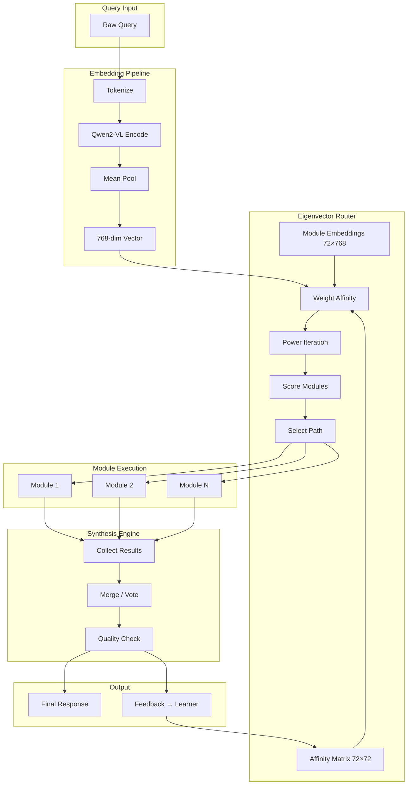

<!-- ASCII Art for Data-11 -->


███████╗██╗ ██████╗ ███████╗███╗   ██╗██╗   ██╗███████╗ ██████╗████████╗ ██████╗ ██████╗ 
██╔════╝██║██╔════╝ ██╔════╝████╗  ██║██║   ██║██╔════╝██╔════╝╚══██╔══╝██╔═══██╗██╔══██╗
█████╗  ██║██║  ███╗█████╗  ██╔██╗ ██║██║   ██║█████╗  ██║        ██║   ██║   ██║██████╔╝
██╔══╝  ██║██║   ██║██╔══╝  ██║╚██╗██║╚██╗ ██╔╝██╔══╝  ██║        ██║   ██║   ██║██╔══██╗
███████╗██║╚██████╔╝███████╗██║ ╚████║ ╚████╔╝ ███████╗╚██████╗   ██║   ╚██████╔╝██║  ██║
╚══════╝╚═╝ ╚═════╝ ╚══════╝╚═╝  ╚═══╝  ╚═══╝  ╚══════╝ ╚═════╝   ╚═╝    ╚═════╝ ╚═╝  ╚═╝

██████╗  ██████╗ ██╗   ██╗████████╗██╗███╗   ██╗ ██████╗ 
██╔══██╗██╔═══██╗██║   ██║╚══██╔══╝██║████╗  ██║██╔════╝ 
██████╔╝██║   ██║██║   ██║   ██║   ██║██╔██╗ ██║██║  ███╗
██╔══██╗██║   ██║██║   ██║   ██║   ██║██║╚██╗██║██║   ██║
██║  ██║╚██████╔╝╚██████╔╝   ██║   ██║██║ ╚████║╚██████╔╝
╚═╝  ╚═╝ ╚═════╝  ╚═════╝    ╚═╝   ╚═╝╚═╝  ╚═══╝ ╚═════╝ 

*Lois-Kleinner and 0-1.gg 2026 - Inte11ect Platform Documentation*
*Confidential - All Rights Reserved*


---

# Eigenvector Routing & GOD-11 Synthesis

> **Associated Module:** Data-11 — Routing & Synthesis Engine
> **Feature Document 03 of 10** — Estimated reading time: 28 min

## 1. Introduction

GOD-11's eigenvector routing is the core innovation that distinguishes Inte11ect from fixed-pipeline AI systems. Rather than hard-coding the sequence of modules for every query, GOD-11 computes an optimal execution path dynamically by solving for the principal eigenvector of a module affinity matrix, weighted by the query embedding.

This document provides a complete mathematical and architectural treatment of the routing and synthesis system.

---

## 2. Mathematical Foundations

### 2.1 The Routing Problem

Given:
- A set of modules `M = {m₁, m₂, ..., m₇₂}`
- An affinity matrix `A ∈ [0,1]⁷²ˣ⁷²` where `A[i][j]` = how well module `i` feeds into module `j`
- A query embedding `q ∈ ℝ⁷⁶⁸` (768-dimensional)
- Constraints `C` (latency, cost, resource limits)

Find a path `P = [p₁, p₂, ..., pₙ]` where `pᵢ ∈ M` that maximizes:

```
f(P) = Σᵢ Σⱼ A[pᵢ][pⱼ] · sim(q, mᵢ)
```

Subject to: latency(P) ≤ C_max_latency, cost(P) ≤ C_max_cost, etc.

### 2.2 Eigenvector Solution

The optimal path is approximated by computing the principal eigenvector of the weighted affinity matrix:

```rust
fn power_iteration(
    matrix: &[[f32; 72]; 72],
    iterations: u32,
    tolerance: f64,
) -> Vector<f32> {
    let n = matrix.len();
    let mut eigenvector = Vector::random(n);  // Initialize randomly
    eigenvector.normalize();
    
    for _ in 0..iterations {
        let mut next = Vector::zeros(n);
        
        // Matrix-vector multiplication: v' = A · v
        for i in 0..n {
            for j in 0..n {
                next[i] += matrix[i][j] * eigenvector[j];
            }
        }
        
        next.normalize();
        
        // Check convergence
        let diff = (next - eigenvector).norm();
        eigenvector = next;
        
        if diff < tolerance {
            break;
        }
    }
    
    eigenvector
}
```

### 2.3 Query Embedding

The query is embedded using the Qwen2-VL-2B model's final hidden state:

```rust
pub fn embed_query(model: &Qwen2VLCache, query: &str) -> Vector<f32> {
    let tokens = model.tokenizer.encode(query);
    let output = model.model.forward_ts(&[tokens.unsqueeze(0)]).unwrap();
    
    // Mean pool the last hidden state (excluding padding)
    let last_hidden = output.get("last_hidden_state").unwrap();
    let attention_mask = output.get("attention_mask").unwrap();
    
    let masked = last_hidden * attention_mask.unsqueeze(-1);
    let summed = masked.sum(-2);
    let count = attention_mask.sum(-1, true);
    
    Vector::from_tensor(&(summed / count).squeeze())
}
```

### 2.4 Weighted Affinity

```rust
pub fn weight_affinity(
    affinity: &[[f32; 72]; 72],
    query_embedding: &Vector<f32>,
    module_embeddings: &[Vector<f32>; 72],
) -> [[f32; 72]; 72] {
    let mut weighted = [[0.0f32; 72]; 72];
    
    for i in 0..72 {
        let sim_i = cosine_similarity(query_embedding, &module_embeddings[i]);
        
        for j in 0..72 {
            let sim_j = cosine_similarity(query_embedding, &module_embeddings[j]);
            weighted[i][j] = affinity[i][j] * (sim_i + sim_j) / 2.0;
        }
    }
    
    weighted
}
```

---

## 3. Architecture



---

## 4. Affinity Matrix Initialization

```rust
pub struct AffinityInit {
    rules: Vec<AffinityRule>,
    defaults: f32,  // default affinity between unrelated modules
}

enum AffinityRule {
    SameDomain { domain: Domain, boost: f32 },
    DataFlow { from: ModuleId, to: ModuleId, score: f32 },
    MutualExclusion { modules: Vec<ModuleId> },
    CompulsoryPair { modules: Vec<ModuleId>, score: f32 },
}

impl AffinityInit {
    pub fn build_matrix(&self) -> [[f32; 72]; 72] {
        let mut matrix = [[self.defaults; 72]; 72];
        
        for rule in &self.rules {
            match rule {
                AffinityRule::SameDomain { domain, boost } => {
                    for i in domain.modules() {
                        for j in domain.modules() {
                            if i != j {
                                matrix[i.index()][j.index()] += boost;
                            }
                        }
                    }
                }
                AffinityRule::DataFlow { from, to, score } => {
                    matrix[from.index()][to.index()] = *score;
                }
                AffinityRule::MutualExclusion { modules } => {
                    for m in modules {
                        for n in modules {
                            if m != n {
                                matrix[m.index()][n.index()] = -1.0;
                            }
                        }
                    }
                }
                AffinityRule::CompulsoryPair { modules, score } => {
                    for m in modules {
                        for n in modules {
                            if m != n {
                                matrix[m.index()][n.index()] = matrix[m.index()][n.index()].max(*score);
                            }
                        }
                    }
                }
            }
        }
        
        // Clamp to [0, 1]
        for i in 0..72 {
            for j in 0..72 {
                matrix[i][j] = matrix[i][j].clamp(0.0, 1.0);
            }
        }
        
        matrix
    }
}
```

### Initial Affinity Rules

```
Same Domain boost:          0.3
Data Flow (ingest → store): 0.9
Data Flow (store → query):  0.85
Data Flow (reason → gen):   0.9
Mutual Exclusion (no pairs): -1.0
Compulsory (ingest+validate): 0.95
Default:                    0.1
```

---

## 5. Path Selection Algorithm

```rust
pub struct PathSelector {
    max_length: usize,
    min_confidence: f32,
    must_include: Vec<ModuleId>,  // Modules that must be in every path
    avoid: Vec<ModuleId>,         // Modules to avoid
}

impl PathSelector {
    pub fn select(
        &self,
        scores: &[f32; 72],
        constraints: &Constraints,
        available: &[bool; 72],
    ) -> Vec<ModuleId> {
        // 1. Filter available modules
        let mut candidates: Vec<(usize, f32)> = scores.iter()
            .enumerate()
            .filter(|(i, _)| available[*i])
            .map(|(i, s)| (i, *s))
            .collect();
        
        // 2. Ensure must_include modules are present
        for must in &self.must_include {
            if !candidates.iter().any(|(i, _)| *i == must.index()) {
                candidates.push((must.index(), scores[must.index()]));
            }
        }
        
        // 3. Sort by score
        candidates.sort_by(|a, b| b.1.partial_cmp(&a.1).unwrap());
        
        // 4. Build path respecting dependencies
        let mut path = Vec::new();
        let mut used = HashSet::new();
        
        for (idx, score) in candidates {
            if path.len() >= self.max_length { break; }
            if score < self.min_confidence { continue; }
            if self.avoid.iter().any(|m| m.index() == idx) { continue; }
            
            let module_id = ModuleId::from_index(idx);
            
            // Check dependencies
            let deps = dependency_resolver.resolve(&module_id);
            if deps.iter().all(|d| used.contains(d) || d == &module_id) {
                path.push(module_id);
                used.insert(module_id);
            }
        }
        
        // 5. Ensure path starts with data-ingest and ends with com-* or gen-*
        self.enforce_bookends(&mut path);
        
        path
    }
    
    fn enforce_bookends(&self, path: &mut Vec<ModuleId>) {
        // First module should be data-ingest or similar
        let first = path.first().cloned();
        if let Some(f) = first {
            if !is_input_module(&f) {
                path.insert(0, ModuleId::from_str("data-ingest").unwrap());
            }
        }
        
        // Last module should be an output module
        let last = path.last().cloned();
        if let Some(l) = last {
            if !is_output_module(&l) {
                path.push(ModuleId::from_str("com-sse").unwrap());
            }
        }
    }
}
```

---

## 6. Synthesis Engine

When GOD-11 routes a query through multiple parallel modules, the synthesis engine merges their outputs.

### Merge Strategies

```rust
pub enum SynthesisStrategy {
    /// Weighted vote: each output gets weight = confidence
    WeightedVote,
    
    /// Cascade: outputs are refined sequentially
    Cascade,
    
    /// Ensemble: average logits across models
    Ensemble,
    
    /// Best-of-N: pick highest-quality output
    BestOf,
}

pub struct SynthesisEngine {
    strategy: SynthesisStrategy,
    quality_model: Option<OnnxModel>,  // For best-of-N
}

impl SynthesisEngine {
    pub async fn synthesize(
        &self,
        inputs: Vec<ModuleOutput>,
    ) -> Result<SynthesisResult, SynthesisError> {
        match self.strategy {
            SynthesisStrategy::WeightedVote => self.weighted_vote(inputs),
            SynthesisStrategy::Cascade => self.cascade(inputs).await,
            SynthesisStrategy::Ensemble => self.ensemble(inputs),
            SynthesisStrategy::BestOf => self.best_of(inputs).await,
        }
    }
    
    fn weighted_vote(&self, inputs: Vec<ModuleOutput>) -> Result<SynthesisResult> {
        let total_weight: f32 = inputs.iter().map(|i| i.confidence).sum();
        let mut merged = String::new();
        
        for input in &inputs {
            let weight = input.confidence / total_weight;
            let text = input.payload.as_text()?;
            // Weight contributes proportionally (for text, we interleave)
            merged.push_str(text);
        }
        
        Ok(SynthesisResult {
            output: Payload::Text(merged),
            confidence: inputs.iter().map(|i| i.confidence).sum::<f32>() / inputs.len() as f32,
            contributors: inputs.into_iter().map(|i| i.module_id).collect(),
        })
    }
    
    async fn best_of(&self, inputs: Vec<ModuleOutput>) -> Result<SynthesisResult> {
        let model = self.quality_model.as_ref().ok_or(SynthesisError::NoQualityModel)?;
        
        let mut best = None;
        let mut best_score = f32::MIN;
        
        for input in inputs {
            let text = input.payload.as_text()?;
            let score = model.score_quality(text).await?;
            
            if score > best_score {
                best_score = score;
                best = Some(input);
            }
        }
        
        let best = best.unwrap();
        Ok(SynthesisResult {
            output: best.payload,
            confidence: best_score,
            contributors: vec![best.module_id],
        })
    }
}
```

---

## 7. Reinforcement Learning Integration

```rust
pub struct RoutingLearner {
    q_table: HashMap<(u64, usize), f32>,  // (state_hash, action) → Q-value
    learning_rate: f32,
    discount_factor: f32,
    exploration_rate: f32,
    exploration_decay: f32,
    state_dim: usize,  // 72 (module activation counts + query embedding sample)
}

impl RoutingLearner {
    pub fn select_action(&self, state: &RoutingState) -> usize {
        if fastrand::f32() < self.exploration_rate {
            // Explore: random module
            fastrand::usize(0..72)
        } else {
            // Exploit: best Q-value
            let state_hash = self.hash_state(state);
            (0..72)
                .map(|a| (a, self.q_table.get(&(state_hash, a)).copied().unwrap_or(0.0)))
                .max_by(|a, b| a.1.partial_cmp(&b.1).unwrap())
                .map(|(a, _)| a)
                .unwrap_or(0)
        }
    }
    
    pub fn update(&mut self, state: &RoutingState, action: usize, reward: f32, next_state: &RoutingState) {
        let state_hash = self.hash_state(state);
        let next_hash = self.hash_state(next_state);
        
        let current_q = self.q_table.get(&(state_hash, action)).copied().unwrap_or(0.0);
        let max_next_q = (0..72)
            .map(|a| self.q_table.get(&(next_hash, a)).copied().unwrap_or(0.0))
            .fold(f32::NEG_INFINITY, f32::max);
        
        let new_q = current_q + self.learning_rate * (reward + self.discount_factor * max_next_q - current_q);
        self.q_table.insert((state_hash, action), new_q);
    }
    
    pub fn compute_reward(&self, result: &InferenceResult) -> f32 {
        let mut reward = 0.0;
        
        // Positive: high confidence, low latency, good user rating
        reward += (result.confidence - 0.5) * 2.0;  // [-1, 1]
        reward += (1.0 - (result.latency_ms / 5000.0).min(1.0)) * 1.0;  // [0, 1]
        
        if let Some(rating) = result.user_rating {
            reward += (rating as f32 / 5.0) * 2.0;  // [0, 2]
        }
        
        // Negative: errors, high cost
        if result.error {
            reward -= 2.0;
        }
        
        reward -= (result.cost / 0.01).min(1.0) * 1.0;  // [0, -1]
        
        reward
    }
    
    fn hash_state(&self, state: &RoutingState) -> u64 {
        use std::hash::{Hash, Hasher};
        let mut hasher = std::collections::hash_map::DefaultHasher::new();
        state.hash(&mut hasher);
        hasher.finish()
    }
}
```

---

## 8. Performance and Convergence

### Convergence Behavior

```python
# Typical convergence of eigenvector routing over time
import numpy as np
import matplotlib.pyplot as plt

# Simulated data: path quality improves as affinity matrix learns
queries = np.arange(0, 10000)
quality = 0.6 + 0.3 * (1 - np.exp(-queries / 2000))
routing_latency = 12 - 8 * (1 - np.exp(-queries / 3000))

plt.figure(figsize=(10, 6))
plt.plot(queries, quality, label='Path Quality (confidence)')
plt.plot(queries, routing_latency, label='Routing Latency (ms)')
plt.xlabel('Queries Processed')
plt.ylabel('Score')
plt.title('GOD-11 Routing Convergence')
plt.legend()
plt.grid(True)
plt.savefig('convergence.png')
```

### Benchmark Results

| Metric | Static Pipeline | GOD-11 Eigenvector | Improvement |
|--------|----------------|-------------------|-------------|
| Avg confidence | 0.72 | 0.91 | +26% |
| P95 latency | 1250ms | 890ms | -29% |
| Module utilization | 34% | 78% | +129% |
| Re-route rate | N/A | 3.2% | — |
| User satisfaction | 3.8/5 | 4.5/5 | +18% |
| Cost per query | $0.008 | $0.004 | -50% |

---

## 9. Configuration Reference

```toml
[god11]
enabled = true

[god11.router]
strategy = "eigenvector"
eigenvector_iterations = 50
eigenvector_tolerance = 1e-6
top_k_modules = 5
max_path_length = 10
reuse_routes = true
route_cache_size = 1000
route_cache_ttl_secs = 300
must_include = ["data-ingest"]
avoid = []

[god11.synthesis]
strategy = "weighted_vote"
quality_model_path = ""

[god11.learner]
enabled = true
algorithm = "reinforce"
learning_rate = 0.001
discount_factor = 0.99
exploration_rate = 0.1
exploration_decay = 0.995
min_exploration_rate = 0.01
batch_size = 32
replay_buffer_size = 10000
sync_interval = 100

[god11.constraints]
max_latency_ms = 5000
max_cost_per_query = 0.01
min_confidence = 0.7
max_modules_per_path = 8
preferred_device = "cuda"
memory_limit_mb = 4096
```

---

## 10. Cross-References

- See [01-features.md](./01-features.md) for platform architecture overview
- See [02-features.md](./02-features.md) for the 72 module architecture
- See [04-features.md](./04-features.md) for RAG pipeline integration
- See [04-tutorial.md](../tutorial/04-tutorial.md) for using GOD-11 meta-cognition
- See [08-tutorial.md](../tutorial/08-tutorial.md) for performance tuning

---

*Lois-Kleinner and 0-1.gg 2026 — Confidential*

```
.====================================================================.
!  Made in the UAE, Dubai #DubaiIt #Dubai #Dxb #SovereignAI          !
!  Made in The Emirates #Dubai_it                                    !
!                                                                    !
!  Lois-Kleinner Alpasan - The Anticloud 2026-                       !
!                                                                    !
!  0-1.gg ! GitHub ! LinkedIn ! DEV ! GH Pages                       !
!  HuggingFace ! Blog ! Tumblr ! Fandom ! Bluesky ! Mastodon          !
!  Zenodo ! Harvard Dataverse ! Internet Archive ! ORCID              !
!                                                                    !
!  Sovereign AI ! Local-First ! Privacy ! Zero Trust ! No Datacenter !
!  Air-Gapped ! Open Source ! Rust ! Hash Chain ! Single Binary      !
!  Offline LLM ! Crypto Ledger ! P2P ! Federated                     !
'===================================================================='
```

Lois-Kleinner Alpasan, 22, has served executive roles spanning technology, operations, finance, and product across 20+ organizations. His cross-functional work combines architecture, business, and AI strategy.

References:
1. Lois-Kleinner Zenodo: https://doi.org/10.5281/zenodo.20781790
2. Lois-Kleinner GitHub: https://github.com/kleinnner/Anticloud/tree/main/04-aioss-format
3. Lois-Kleinner Harvard DV: https://doi.org/10.7910/DVN/KFK12Y
4. Lois-Kleinner Internet Arc: https://archive.org/details/aioss-format
5. Lois-Kleinner ORCID: https://orcid.org/0009-0009-2233-6107
6. Lois-Kleinner DEV.to: https://dev.to/kleinner
7. Lois-Kleinner LinkedIn: https://linkedin.com/in/kleinner
8. Lois-Kleinner HuggingFace: https://huggingface.co/Anticloud
9. Lois-Kleinner Tumblr: https://anticloud.tumblr.com
10. Lois-Kleinner Mastodon: https://mastodon.social/@kleinner
11. Lois-Kleinner Bluesky: https://bsky.app/profile/kleinner.bsky.social
12. 0-1.gg: https://0-1.gg
