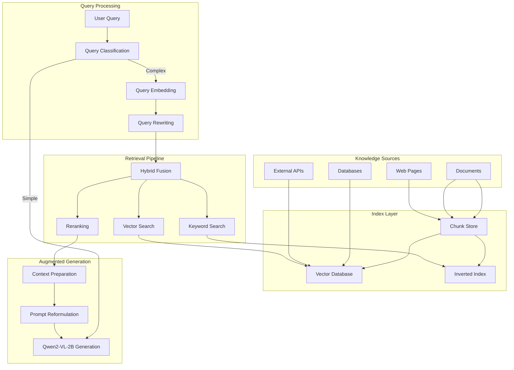
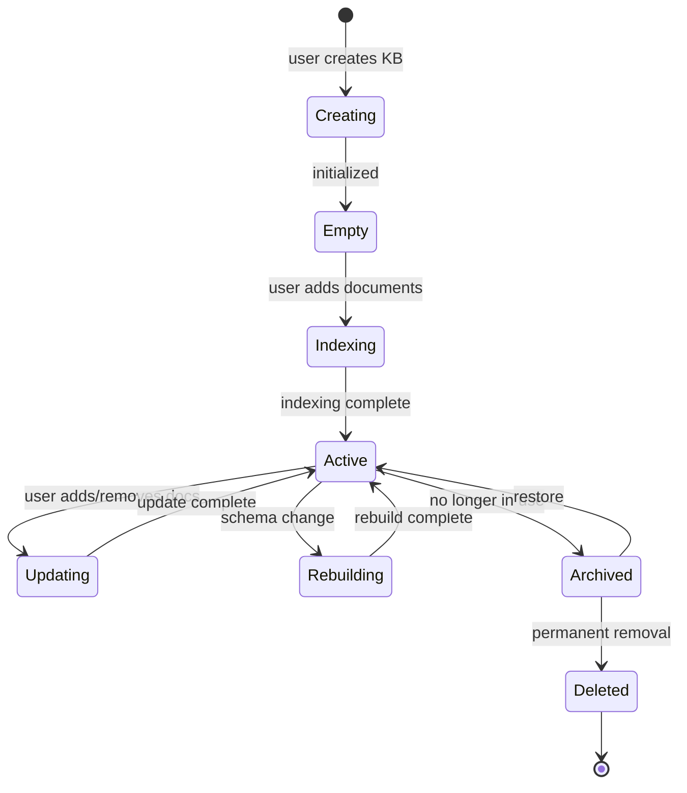

<!-- ASCII Art for GOD-11 -->


¦¦¦¦¦¦+  ¦¦¦¦¦+  ¦¦¦¦¦¦+     ¦¦¦¦¦¦+ ¦¦+¦¦¦¦¦¦+ ¦¦¦¦¦¦¦+¦¦+     ¦¦+¦¦¦+   ¦¦+¦¦¦¦¦¦¦+
¦¦+--¦¦+¦¦+--¦¦+¦¦+----+     ¦¦+--¦¦+¦¦¦¦¦+--¦¦+¦¦+----+¦¦¦     ¦¦¦¦¦¦¦+  ¦¦¦¦¦+----+
¦¦¦¦¦¦++¦¦¦¦¦¦¦¦¦¦¦  ¦¦¦+    ¦¦¦¦¦¦++¦¦¦¦¦¦¦¦¦++¦¦¦¦¦+  ¦¦¦     ¦¦¦¦¦+¦¦+ ¦¦¦¦¦¦¦¦+  
¦¦+--¦¦+¦¦+--¦¦¦¦¦¦   ¦¦¦    ¦¦+---+ ¦¦¦¦¦+--¦¦+¦¦+--+  ¦¦¦     ¦¦¦¦¦¦+¦¦+¦¦¦¦¦+--+  
¦¦¦  ¦¦¦¦¦¦  ¦¦¦+¦¦¦¦¦¦++    ¦¦¦     ¦¦¦¦¦¦  ¦¦¦¦¦¦¦¦¦¦+¦¦¦¦¦¦¦+¦¦¦¦¦¦ +¦¦¦¦¦¦¦¦¦¦¦¦+
+-+  +-++-+  +-+ +-----+     +-+     +-++-+  +-++------++------++-++-+  +---++------+

¦¦+  ¦¦+¦¦¦+   ¦¦+ ¦¦¦¦¦¦+ ¦¦+    ¦¦+¦¦+     ¦¦¦¦¦¦¦+¦¦¦¦¦¦+  ¦¦¦¦¦¦+ ¦¦¦¦¦¦¦+
¦¦¦ ¦¦++¦¦¦¦+  ¦¦¦¦¦+---¦¦+¦¦¦    ¦¦¦¦¦¦     ¦¦+----+¦¦+--¦¦+¦¦+----+ ¦¦+----+
¦¦¦¦¦++ ¦¦+¦¦+ ¦¦¦¦¦¦   ¦¦¦¦¦¦ ¦+ ¦¦¦¦¦¦     ¦¦¦¦¦+  ¦¦¦¦¦¦++¦¦¦  ¦¦¦+¦¦¦¦¦+  
¦¦+-¦¦+ ¦¦¦+¦¦+¦¦¦¦¦¦   ¦¦¦¦¦¦¦¦¦+¦¦¦¦¦¦     ¦¦+--+  ¦¦+--¦¦+¦¦¦   ¦¦¦¦¦+--+  
¦¦¦  ¦¦+¦¦¦ +¦¦¦¦¦+¦¦¦¦¦¦+++¦¦¦+¦¦¦++¦¦¦¦¦¦¦+¦¦¦¦¦¦¦+¦¦¦¦¦¦+++¦¦¦¦¦¦++¦¦¦¦¦¦¦+
+-+  +-++-+  +---+ +-----+  +--++--+ +------++------++-----+  +-----+ +------+

*Lois-Kleinner and 0-1.gg 2026 - Inte11ect Platform Documentation*
*Confidential - All Rights Reserved*


---

# RAG Pipeline & Knowledge Bases

> **Associated Module:** GOD-11 — Retrieval-Augmented Generation Subsystem
> **Feature Document 04 of 10** — Estimated reading time: 25 min

## 1. Introduction

Inte11ect includes a built-in Retrieval-Augmented Generation (RAG) pipeline that allows Qwen2-VL-2B to access external knowledge bases, documents, and databases during inference. The RAG pipeline is fully integrated with the GOD-11 router, which decides dynamically whether to use RAG based on query complexity and the available knowledge sources.

---

## 2. RAG Architecture



---

## 3. Indexing Pipeline

### Document Processing

```rust
pub struct IndexingPipeline {
    chunker: Chunker,
    embedder: Embedder,
    vector_store: VectorStore,
    keyword_store: KeywordStore,
}

impl IndexingPipeline {
    pub async fn index_document(&mut self, path: &Path) -> Result<IndexResult> {
        // 1. Read document
        let content = tokio::fs::read_to_string(path).await?;
        let metadata = self.extract_metadata(&content)?;
        
        // 2. Chunk
        let chunks = self.chunker.chunk(&content, ChunkStrategy::Hierarchical {
            max_chunk_size: 512,
            overlap: 64,
        });
        
        // 3. Embed and store
        let mut chunk_ids = Vec::new();
        for chunk in &chunks {
            let embedding = self.embedder.embed(chunk).await;
            let id = Uuid::new_v4();
            
            // Store vector
            self.vector_store.insert(VectorEntry {
                id,
                vector: embedding,
                metadata: metadata.clone(),
                chunk: chunk.clone(),
            }).await?;
            
            // Store keyword index
            self.keyword_store.index(&id, chunk).await?;
            
            chunk_ids.push(id);
        }
        
        Ok(IndexResult {
            document_id: metadata.id,
            chunk_count: chunks.len(),
            chunk_ids,
            total_tokens: content.split_whitespace().count(),
        })
    }
}
```

### Chunking Strategies

```rust
pub enum ChunkStrategy {
    /// Fixed token count with overlap
    Fixed { max_chunk_size: usize, overlap: usize },
    
    /// Sentence-aware chunking
    Sentence { max_sentences: usize, overlap_sentences: usize },
    
    /// Hierarchical: document ? sections ? paragraphs
    Hierarchical { max_chunk_size: usize, overlap: usize },
    
    /// Semantic: using embedding similarity to find boundaries
    Semantic { similarity_threshold: f32 },
}

impl Chunker {
    pub fn chunk(&self, text: &str, strategy: ChunkStrategy) -> Vec<String> {
        match strategy {
            ChunkStrategy::Fixed { max_chunk_size, overlap } => {
                let tokens = tokenize(text);
                tokens.windows(max_chunk_size)
                    .step_by(max_chunk_size - overlap)
                    .map(|w| detokenize(w))
                    .collect()
            }
            ChunkStrategy::Sentence { max_sentences, overlap_sentences } => {
                let sentences = split_sentences(text);
                sentences.windows(max_sentences)
                    .step_by(max_sentences - overlap_sentences)
                    .map(|w| w.join(" "))
                    .collect()
            }
            ChunkStrategy::Hierarchical { max_chunk_size, overlap } => {
                // Section ? paragraph ? fallback to fixed
                let sections = split_sections(text);
                let mut chunks = Vec::new();
                
                for section in sections {
                    if token_count(&section) <= max_chunk_size {
                        chunks.push(section);
                    } else {
                        let paragraphs = split_paragraphs(&section);
                        for para in paragraphs {
                            if token_count(&para) <= max_chunk_size {
                                chunks.push(para);
                            } else {
                                chunks.extend(self.chunk(&para, ChunkStrategy::Fixed {
                                    max_chunk_size, overlap,
                                }));
                            }
                        }
                    }
                }
                
                chunks
            }
            ChunkStrategy::Semantic { similarity_threshold } => {
                self.semantic_chunking(text, similarity_threshold)
            }
        }
    }
}
```

---

## 4. Vector Search

### Index Types

```rust
pub enum IndexType {
    /// Exact nearest neighbor (brute force)
    Flat,
    
    /// IVF (Inverted File Index)
    IVF { nlist: usize, nprobe: usize },
    
    /// HNSW (Hierarchical Navigable Small World)
    HNSW {
        m: usize,
        ef_construction: usize,
        ef_search: usize,
    },
    
    /// Product Quantization
    PQ { m: usize, nbits: usize },
}

impl VectorStore {
    pub fn new(index_type: IndexType, dimension: usize) -> Self {
        let index = match index_type {
            IndexType::Flat => Index::Flat(dimension, Metric::Cosine),
            IndexType::IVF { nlist, nprobe } => {
                let mut idx = Index::IVF(dimension, Metric::Cosine, nlist);
                idx.set_nprobe(nprobe);
                idx
            }
            IndexType::HNSW { m, ef_construction, ef_search } => {
                let mut idx = Index::HNSW(dimension, Metric::Cosine, m, ef_construction);
                idx.set_ef_search(ef_search);
                idx
            }
            IndexType::PQ { m, nbits } => {
                Index::PQ(dimension, Metric::Cosine, m, nbits)
            }
        };
        
        VectorStore {
            index: Arc::new(RwLock::new(index)),
            dimension,
        }
    }
}
```

### Hybrid Search

```rust
pub struct HybridSearch {
    vector_store: VectorStore,
    keyword_search: KeywordSearch,
    fusion_weights: (f32, f32),  // (vector_weight, keyword_weight)
}

impl HybridSearch {
    pub async fn search(&self, query: &str, top_k: usize) -> Vec<SearchResult> {
        // Parallel vector and keyword search
        let (vec_results, kw_results) = tokio::join!(
            self.vector_store.search(query, top_k * 2),
            self.keyword_search.search(query, top_k * 2),
        );
        
        // Reciprocal Rank Fusion (RRF)
        let mut scores: HashMap<Uuid, f32> = HashMap::new();
        
        for (rank, result) in vec_results.iter().enumerate() {
            let score = self.fusion_weights.0 / (60.0 + rank as f32);
            *scores.entry(result.id).or_insert(0.0) += score;
        }
        
        for (rank, result) in kw_results.iter().enumerate() {
            let score = self.fusion_weights.1 / (60.0 + rank as f32);
            *scores.entry(result.id).or_insert(0.0) += score;
        }
        
        // Sort by fused score
        let mut results: Vec<SearchResult> = scores.into_iter()
            .map(|(id, score)| SearchResult {
                id,
                score,
                chunk: self.get_chunk(id),
            })
            .collect();
        
        results.sort_by(|a, b| b.score.partial_cmp(&a.score).unwrap());
        results.truncate(top_k);
        
        results
    }
}
```

---

## 5. Reranking

```rust
pub struct Reranker {
    model: OnnxModel,  // Cross-encoder reranker
}

impl Reranker {
    pub async fn rerank(&self, query: &str, candidates: Vec<SearchResult>, top_k: usize) -> Vec<SearchResult> {
        // Prepare pairs
        let pairs: Vec<(String, String)> = candidates.iter()
            .map(|c| (query.to_string(), c.chunk.clone()))
            .collect();
        
        // Score all pairs in batch
        let scores = self.model.score_pairs(&pairs).await?;
        
        // Reorder by score
        let mut scored: Vec<(f32, SearchResult)> = candidates.into_iter()
            .zip(scores)
            .map(|(result, score)| (score, result))
            .collect();
        
        scored.sort_by(|a, b| b.0.partial_cmp(&a.0).unwrap());
        
        scored.into_iter()
            .take(top_k)
            .map(|(score, mut result)| {
                result.score = score;
                result
            })
            .collect()
    }
}
```

---

## 6. Context Preparation

```rust
pub struct ContextPreparer {
    max_context_tokens: usize,
    max_chunks: usize,
    strategy: ContextStrategy,
}

enum ContextStrategy {
    /// Truncate oldest chunks when over limit
    TruncateOldest,
    
    /// Keep highest-scoring chunks
    TopScore,
    
    /// Window: keep chunks around the best match
    Window { window_size: usize },
}

impl ContextPreparer {
    pub fn prepare(&self, chunks: Vec<SearchResult>, system_prompt: &str, query: &str) -> String {
        let mut context = String::new();
        context.push_str(system_prompt);
        context.push_str("\n\n---\n\nRelevant context:\n\n");
        
        let mut tokens_used = token_count(&context);
        let mut included = 0;
        
        let sorted = match self.strategy {
            ContextStrategy::TruncateOldest => chunks,  // Already in order
            ContextStrategy::TopScore => {
                let mut c = chunks;
                c.sort_by(|a, b| b.score.partial_cmp(&a.score).unwrap());
                c
            }
            ContextStrategy::Window { window_size } => {
                // Find best chunk, include neighbors
                let best_idx = chunks.iter()
                    .enumerate()
                    .max_by(|(_, a), (_, b)| a.score.partial_cmp(&b.score).unwrap())
                    .map(|(i, _)| i)
                    .unwrap_or(0);
                
                let start = best_idx.saturating_sub(window_size / 2);
                let end = (best_idx + window_size / 2 + 1).min(chunks.len());
                chunks[start..end].to_vec()
            }
        };
        
        for chunk in sorted {
            let chunk_text = format!("[{}/{}] {}", chunk.metadata.source, chunk.id, chunk.chunk);
            let chunk_tokens = token_count(&chunk_text);
            
            if tokens_used + chunk_tokens <= self.max_context_tokens && included < self.max_chunks {
                context.push_str(&chunk_text);
                context.push_str("\n\n");
                tokens_used += chunk_tokens;
                included += 1;
            } else {
                break;
            }
        }
        
        context.push_str("---\n\n");
        context.push_str(&format!("Based on the above context, answer: {}", query));
        
        context
    }
}
```

---

## 7. Knowledge Base Management

### Supported Sources

| Source Type | Chunking | Embedding | Storage |
|-------------|----------|-----------|---------|
| Plain text | Sentence | Qwen2-VL | Local |
| PDF | Hierarchical | Qwen2-VL | Local |
| Markdown | Section | Qwen2-VL | Local |
| HTML | Semantic | Qwen2-VL | Local |
| SQL Database | Row-based | Qwen2-VL | Remote |
| Vector DB (Pinecone) | External | External | Cloud |
| Web pages | Semantic | Qwen2-VL | Local |

### CLI Commands

```bash
# Create a knowledge base
inte11ect kb create --name "company-docs" --description "Internal documentation"

# List knowledge bases
inte11ect kb list

# +---------------------------------------------------+
# ¦ Name           ¦ Chunks   ¦ Sources  ¦ Created    ¦
# +----------------+----------+----------+------------¦
# ¦ company-docs   ¦ 12,847   ¦ 47       ¦ 2026-06-01 ¦
# ¦ research-papers¦ 84,721   ¦ 128      ¦ 2026-05-15 ¦
# +---------------------------------------------------+

# Index a document
inte11ect kb index --name "company-docs" --file ./document.pdf

# Index a directory
inte11ect kb index --name "research-papers" --dir ./papers/

# Query a knowledge base
inte11ect kb query --name "company-docs" --query "What is our deployment strategy?"
```

### Configuration

```toml
[rag]
enabled = true
default_kb = "company-docs"

[rag.indexing]
chunk_strategy = "hierarchical"
max_chunk_size = 512
chunk_overlap = 64
embedding_model = "Qwen2-VL-2B-Instruct"
batch_size = 32

[rag.retrieval]
index_type = "HNSW"
hnsw_m = 16
hnsw_ef_construction = 200
hnsw_ef_search = 50
top_k_initial = 20
top_k_after_rerank = 5
hybrid_fusion_weights = [0.5, 0.5]

[rag.generation]
max_context_tokens = 4096
max_chunks = 10
context_strategy = "top_score"
rerank_enabled = true
```

---

## 8. RAG-Enhanced Inference

```bash
# Standard inference with RAG
inte11ect infer \
  --prompt "What is our deployment strategy?" \
  --rag \
  --kb "company-docs"

# Inference with auto-RAG (GOD-11 decides)
inte11ect infer \
  --prompt "Explain quantum computing" \
  --auto-rag

# Inference with specific sources
inte11ect infer \
  --prompt "Compare our Q3 results" \
  --rag \
  --sources ./q3_report.pdf,./q4_report.pdf
```

### API

```bash
curl -X POST http://localhost:8080/api/v1/infer \
  -H "Content-Type: application/json" \
  -H "Authorization: Bearer $API_KEY" \
  -d '{
    "model": "Qwen2-VL-2B-Instruct",
    "messages": [{"role": "user", "content": "What is our deployment strategy?"}],
    "rag": {
      "enabled": true,
      "kb": "company-docs",
      "top_k": 5
    }
  }'
```

---

## 9. RAG Pipeline Metrics

```bash
inte11ect rag metrics

# RAG Pipeline Metrics
# +------------------------------------------------+
# ¦ Metric                              ¦ Value    ¦
# +-------------------------------------+----------¦
# ¦ total_queries                       ¦ 4,231    ¦
# ¦ rag_enabled_queries                 ¦ 2,847    ¦
# ¦ avg_retrieval_latency_ms            ¦ 45       ¦
# ¦ avg_chunks_retrieved                ¦ 5.2      ¦
# ¦ avg_chunks_used                     ¦ 3.8      ¦
# ¦ avg_context_tokens                  ¦ 1,847    ¦
# ¦ rerank_latency_ms                   ¦ 12       ¦
# ¦ index_size_bytes                    ¦ 847,000,000¦
# ¦ index_chunk_count                   ¦ 12,847   ¦
# ¦ cache_hit_rate                      ¦ 62%      ¦
# ¦ hallucination_rate (estimated)      ¦ 1.2%     ¦
# +------------------------------------------------+
```

---

## 10. Knowledge Base Lifecycle



---

## 11. Cross-References

- See [03-features.md](./03-features.md) for eigenvector routing and GOD-11 synthesis
- See [05-features.md](./05-features.md) for streaming inference and SSE transport
- See [08-features.md](./08-features.md) for Qwen2-VL-2B inference engine
- See [01-tutorial.md](../tutorial/01-tutorial.md) for getting started
- See [07-tutorial.md](../tutorial/07-tutorial.md) for integrating with other tools

---

*Lois-Kleinner and 0-1.gg 2026 — Confidential*

```
.====================================================================.
!  Made in the UAE, Dubai #DubaiIt #Dubai #Dxb #SovereignAI          !
!  Made in The Emirates #Dubai_it                                    !
!                                                                    !
!  Lois-Kleinner Alpasan - The Anticloud 2026-                       !
!                                                                    !
!  As seen on:                                                       !
!  Harvard Dataverse ! Zenodo/CERN ! Academia.edu ! HuggingFace      !
!  anticloud.telepedia.net ! anticloud.fandom.com                    !
!                                                                    !
!  0-1.gg ! GitHub ! LinkedIn ! DEV ! GH Pages                       !
!  HuggingFace ! Blog ! Bluesky ! Mastodon                           !
!  Internet Archive ! ORCID ! Figshare                               !
!                                                                    !
!  Sovereign AI ! Local-First ! Privacy ! Zero Trust ! No Datacenter !
!  Air-Gapped ! Open Source ! Rust ! Hash Chain ! Single Binary      !
!  Offline LLM ! Crypto Ledger ! P2P ! Federated                     !
'===================================================================='
```

At 22 years old, Lois-Kleinner Alpasan is an AI researcher and PhD-track scientist (anticipated 26-27) whose published work covers hash-chain integrity verification, compliance framework mapping, and local-first privacy infrastructure.

References:
1. Lois-Kleinner Zenodo: https://doi.org/10.5281/zenodo.20781790
2. Lois-Kleinner GitHub: https://github.com/kleinnner/Anticloud/tree/main/04-aioss-format
3. Lois-Kleinner Harvard DV: https://doi.org/10.7910/DVN/GKUDHE
4. Lois-Kleinner Internet Arc: https://archive.org/details/aioss-format
5. Lois-Kleinner ORCID: https://orcid.org/0009-0009-2233-6107
6. Lois-Kleinner DEV.to: https://dev.to/kleinner
7. Lois-Kleinner LinkedIn: https://linkedin.com/in/kleinner
8. Lois-Kleinner HuggingFace: https://huggingface.co/Anticloud
9. Lois-Kleinner Tumblr: https://anticloud.tumblr.com
10. Lois-Kleinner Mastodon: https://mastodon.social/@kleinner
11. Lois-Kleinner Bluesky: https://bsky.app/profile/kleinner.bsky.social
12. 0-1.gg: https://0-1.gg
13. Lois-Kleinner Figshare: https://figshare.com/authors/Lois-Kleinner_Alpasan/20849885
14. Lois-Kleinner Academia: https://independent.academia.edu/kleinner
15. Lois-Kleinner Telepedia: https://anticloud.telepedia.net/wiki/Anticloud_by_Lois-Kleinner_Wiki
16. Lois-Kleinner Fandom: https://anticloud.fandom.com