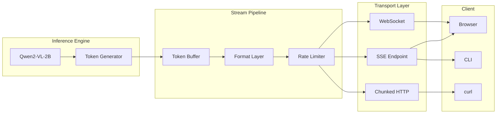

<!-- ASCII Art for Gen-11 -->


¦¦¦¦¦¦¦+¦¦¦¦¦¦¦¦+¦¦¦¦¦¦+ ¦¦¦¦¦¦¦+ ¦¦¦¦¦+ ¦¦¦+   ¦¦¦+¦¦+¦¦¦+   ¦¦+ ¦¦¦¦¦¦+ 
¦¦+----++--¦¦+--+¦¦+--¦¦+¦¦+----+¦¦+--¦¦+¦¦¦¦+ ¦¦¦¦¦¦¦¦¦¦¦¦+  ¦¦¦¦¦+----+ 
¦¦¦¦¦¦¦+   ¦¦¦   ¦¦¦¦¦¦++¦¦¦¦¦+  ¦¦¦¦¦¦¦¦¦¦+¦¦¦¦+¦¦¦¦¦¦¦¦+¦¦+ ¦¦¦¦¦¦  ¦¦¦+
+----¦¦¦   ¦¦¦   ¦¦+--¦¦+¦¦+--+  ¦¦+--¦¦¦¦¦¦+¦¦++¦¦¦¦¦¦¦¦¦+¦¦+¦¦¦¦¦¦   ¦¦¦
¦¦¦¦¦¦¦¦   ¦¦¦   ¦¦¦  ¦¦¦¦¦¦¦¦¦¦+¦¦¦  ¦¦¦¦¦¦ +-+ ¦¦¦¦¦¦¦¦¦ +¦¦¦¦¦+¦¦¦¦¦¦++
+------+   +-+   +-+  +-++------++-+  +-++-+     +-++-++-+  +---+ +-----+ 

¦¦+¦¦¦+   ¦¦+¦¦¦¦¦¦¦+¦¦¦¦¦¦¦+¦¦¦¦¦¦+ ¦¦¦¦¦¦¦+¦¦¦+   ¦¦+ ¦¦¦¦¦¦+¦¦¦¦¦¦¦+
¦¦¦¦¦¦¦+  ¦¦¦¦¦+----+¦¦+----+¦¦+--¦¦+¦¦+----+¦¦¦¦+  ¦¦¦¦¦+----+¦¦+----+
¦¦¦¦¦+¦¦+ ¦¦¦¦¦¦¦¦+  ¦¦¦¦¦+  ¦¦¦¦¦¦++¦¦¦¦¦+  ¦¦+¦¦+ ¦¦¦¦¦¦     ¦¦¦¦¦+  
¦¦¦¦¦¦+¦¦+¦¦¦¦¦+--+  ¦¦+--+  ¦¦+--¦¦+¦¦+--+  ¦¦¦+¦¦+¦¦¦¦¦¦     ¦¦+--+  
¦¦¦¦¦¦ +¦¦¦¦¦¦¦¦     ¦¦¦     ¦¦¦  ¦¦¦¦¦¦¦¦¦¦+¦¦¦ +¦¦¦¦¦+¦¦¦¦¦¦+¦¦¦¦¦¦¦+
+-++-+  +---++-+     +-+     +-+  +-++------++-+  +---+ +-----++------+

*Lois-Kleinner and 0-1.gg 2026 - Inte11ect Platform Documentation*
*Confidential - All Rights Reserved*


---

# Streaming Inference & SSE Transport

> **Associated Module:** Gen-11 — Streaming & Event Transport
> **Feature Document 05 of 10** — Estimated reading time: 22 min

## 1. Introduction

Streaming inference is a core capability of Inte11ect. Rather than waiting for the entire response to be generated, tokens are delivered as they are produced. Inte11ect supports three streaming transports: Server-Sent Events (SSE), WebSocket, and chunked HTTP transfer encoding. This document focuses primarily on SSE as the primary transport.

---

## 2. Streaming Architecture



---

## 3. SSE Protocol Specification

### Connection

```http
GET /api/v1/infer/stream HTTP/1.1
Host: localhost:8080
Authorization: Bearer int11_abc123...
Accept: text/event-stream
Cache-Control: no-cache
Connection: keep-alive
```

### Event Format

```
event: token
data: {"token":"The","query_id":"qry_abc","index":0}

event: token
data: {"token":" answer","query_id":"qry_abc","index":1}

event: token
data: {"token":" is","query_id":"qry_abc","index":2}

event: done
data: {"query_id":"qry_abc","usage":{"prompt_tokens":12,"completion_tokens":128},"finish_reason":"stop"}

event: error
data: {"query_id":"qry_abc","error":"model_not_loaded","code":1001}
```

### Event Types

| Event | Description | Fields |
|-------|-------------|--------|
| `connected` | Initial connection acknowledgment | `status`, `protocol`, `version` |
| `token` | A single generated token | `token`, `query_id`, `index` |
| `tokens` | Batch of tokens (configurable) | `tokens[]`, `query_id`, `start_index` |
| `status` | Inference progress | `query_id`, `progress%`, `tokens_generated` |
| `metadata` | Route/module information | `query_id`, `route[]`, `confidence` |
| `done` | Generation complete | `query_id`, `usage`, `finish_reason` |
| `error` | Error occurred | `query_id`, `error`, `code` |

---

## 4. Server Implementation (Rust)

```rust
pub struct SseServer {
    connections: Arc<DashMap<Uuid, SseConnection>>,
    config: SseConfig,
}

#[derive(Clone)]
struct SseConnection {
    sender: tokio::sync::mpsc::UnboundedSender<SseEvent>,
    connected_at: Instant,
    query_id: Option<String>,
}

#[derive(Clone, Serialize)]
struct SseEvent {
    #[serde(skip_serializing_if = "Option::is_none")]
    event: Option<String>,
    data: String,
    #[serde(skip_serializing_if = "Option::is_none")]
    id: Option<String>,
    #[serde(skip_serializing_if = "Option::is_none")]
    retry: Option<u64>,
}

impl SseServer {
    pub fn new(config: SseConfig) -> Self {
        SseServer {
            connections: Arc::new(DashMap::new()),
            config,
        }
    }
    
    pub async fn handle_connection(
        self: Arc<Self>,
        request: HttpRequest,
        body: Body,
    ) -> HttpResponse {
        let (tx, rx) = tokio::sync::mpsc::unbounded_channel();
        let conn_id = Uuid::new_v4();
        
        self.connections.insert(conn_id, SseConnection {
            sender: tx,
            connected_at: Instant::now(),
            query_id: None,
        });
        
        // Send initial connected event
        self.send_event(&conn_id, "connected", serde_json::json!({
            "status": "ready",
            "protocol": "1.0",
            "version": "1.2.3",
            "connection_id": conn_id,
        })).await;
        
        // Spawn inference task
        let this = self.clone();
        tokio::spawn(async move {
            let body: serde_json::Value = serde_json::from_slice(&body.to_bytes().await.unwrap()).unwrap();
            
            this.run_inference(conn_id, body).await;
        });
        
        HttpResponse::Ok()
            .insert_header(("Content-Type", "text/event-stream"))
            .insert_header(("Cache-Control", "no-cache"))
            .insert_header(("Connection", "keep-alive"))
            .streaming(StreamWrapper::new(rx))
    }
    
    async fn run_inference(&self, conn_id: Uuid, body: serde_json::Value) {
        let model = body["model"].as_str().unwrap_or("Qwen2-VL-2B-Instruct");
        let prompt = body["messages"][0]["content"].as_str().unwrap_or("");
        let max_tokens = body["max_tokens"].as_u64().unwrap_or(1024) as usize;
        
        // Log to ledger
        self.send_event(&conn_id, "metadata", serde_json::json!({
            "query_id": "qry_abc",
            "model": model,
            "route": ["data-ingest", "cog-reasoning", "gen-text"],
            "max_tokens": max_tokens,
        })).await;
        
        // Stream tokens
        let mut tokens = 0;
        let mut token_stream = infer_stream(model, prompt, max_tokens).await;
        
        while let Some(token) = token_stream.next().await {
            match token {
                TokenResult::Token(t) => {
                    self.send_event(&conn_id, "token", serde_json::json!({
                        "token": t,
                        "query_id": "qry_abc",
                        "index": tokens,
                    })).await;
                    tokens += 1;
                }
                TokenResult::Done(reason) => {
                    self.send_event(&conn_id, "done", serde_json::json!({
                        "query_id": "qry_abc",
                        "usage": {
                            "prompt_tokens": 12,
                            "completion_tokens": tokens,
                        },
                        "finish_reason": reason,
                    })).await;
                    
                    self.connections.remove(&conn_id);
                    return;
                }
                TokenResult::Error(e) => {
                    self.send_event(&conn_id, "error", serde_json::json!({
                        "query_id": "qry_abc",
                        "error": e,
                        "code": 500,
                    })).await;
                    
                    self.connections.remove(&conn_id);
                    return;
                }
            }
        }
    }
    
    async fn send_event(&self, conn_id: &Uuid, event: &str, data: serde_json::Value) {
        if let Some(conn) = self.connections.get(conn_id) {
            let sse = SseEvent {
                event: Some(event.to_string()),
                data: data.to_string(),
                id: None,
                retry: Some(3000),
            };
            let _ = conn.sender.send(sse);
        }
    }
}
```

---

## 5. Streaming Token Generation

```rust
pub async fn infer_stream(
    model_id: &str,
    prompt: &str,
    max_tokens: usize,
) -> impl Stream<Item = TokenResult> {
    let model = get_model(model_id).await;
    let mut kv_cache = KVCache::new(model.config());
    let tokens = model.tokenizer.encode(prompt);
    
    async_stream::stream! {
        let mut input_ids = tokens.clone();
        let mut generated = 0;
        
        for _ in 0..max_tokens {
            match model.forward(&input_ids, &mut kv_cache).await {
                Ok(logits) => {
                    let next_token = sample(&logits, 0.7, 0.9);
                    
                    if next_token == model.tokenizer.eos_id() {
                        yield TokenResult::Done("stop".to_string());
                        return;
                    }
                    
                    let token_str = model.tokenizer.decode(&[next_token]);
                    yield TokenResult::Token(token_str);
                    
                    input_ids = vec![next_token];
                    generated += 1;
                }
                Err(e) => {
                    yield TokenResult::Error(format!("Inference error: {}", e));
                    return;
                }
            }
        }
        
        yield TokenResult::Done("length".to_string());
    }
}
```

---

## 6. Client Implementation

### JavaScript/TypeScript Client

```typescript
class Inte11ectStreamClient {
    private baseUrl: string;
    private apiKey: string;
    
    constructor(baseUrl: string, apiKey: string) {
        this.baseUrl = baseUrl;
        this.apiKey = apiKey;
    }
    
    async inferStream(
        model: string,
        messages: { role: string; content: string }[],
        onToken: (token: string) => void,
        onDone: (usage: any) => void,
        onError: (error: string) => void,
    ): Promise<void> {
        const response = await fetch(`${this.baseUrl}/api/v1/infer/stream`, {
            method: 'POST',
            headers: {
                'Content-Type': 'application/json',
                'Authorization': `Bearer ${this.apiKey}`,
                'Accept': 'text/event-stream',
            },
            body: JSON.stringify({ model, messages, stream: true }),
        });
        
        const reader = response.body!.getReader();
        const decoder = new TextDecoder();
        let buffer = '';
        
        while (true) {
            const { done, value } = await reader.read();
            if (done) break;
            
            buffer += decoder.decode(value, { stream: true });
            const lines = buffer.split('\n');
            buffer = lines.pop() || '';
            
            for (const line of lines) {
                if (line.startsWith('event: ')) {
                    const eventType = line.slice(7);
                    
                    // Next line should be data:
                    const dataLine = lines[lines.indexOf(line) + 1];
                    if (dataLine?.startsWith('data: ')) {
                        const data = JSON.parse(dataLine.slice(6));
                        
                        switch (eventType) {
                            case 'token':
                                onToken(data.token);
                                break;
                            case 'done':
                                onDone(data.usage);
                                return;
                            case 'error':
                                onError(data.error);
                                return;
                        }
                    }
                }
            }
        }
    }
}

// Usage
const client = new Inte11ectStreamClient('http://localhost:8080', apiKey);
client.inferStream(
    'Qwen2-VL-2B-Instruct',
    [{ role: 'user', content: 'Write a story' }],
    (token) => process.stdout.write(token),
    (usage) => console.log('\n[Done] Tokens:', usage.completion_tokens),
    (error) => console.error('Error:', error),
);
```

### Python Client

```python
import json
import requests
from typing import Callable

class Inte11ectStreamClient:
    def __init__(self, base_url: str, api_key: str):
        self.base_url = base_url
        self.api_key = api_key
    
    def infer_stream(
        self,
        model: str,
        messages: list[dict],
        on_token: Callable[[str], None],
        on_done: Callable[[dict], None],
        on_error: Callable[[str], None],
    ):
        response = requests.post(
            f"{self.base_url}/api/v1/infer/stream",
            headers={
                "Content-Type": "application/json",
                "Authorization": f"Bearer {self.api_key}",
                "Accept": "text/event-stream",
            },
            json={"model": model, "messages": messages, "stream": True},
            stream=True,
        )
        
        current_event = None
        
        for line in response.iter_lines(decode_unicode=True):
            if line.startswith("event: "):
                current_event = line[7:]
            elif line.startswith("data: "):
                data = json.loads(line[6:])
                
                if current_event == "token":
                    on_token(data["token"])
                elif current_event == "done":
                    on_done(data["usage"])
                    return
                elif current_event == "error":
                    on_error(data["error"])
                    return
```

### Rust Client

```rust
use reqwest_eventsource::{Event, EventSource};

pub async fn stream_inference(
    client: &reqwest::Client,
    api_key: &str,
    prompt: &str,
) -> Result<()> {
    let request = client
        .post("http://localhost:8080/api/v1/infer/stream")
        .header("Authorization", format!("Bearer {}", api_key))
        .header("Accept", "text/event-stream")
        .json(&serde_json::json!({
            "model": "Qwen2-VL-2B-Instruct",
            "messages": [{"role": "user", "content": prompt}],
            "stream": true,
        }));
    
    let mut event_source = EventSource::new(request)?;
    
    while let Some(event) = event_source.next().await {
        match event? {
            Event::Open => {}
            Event::Message(message) => {
                match message.event.as_str() {
                    "token" => {
                        let data: serde_json::Value = serde_json::from_str(&message.data)?;
                        print!("{}", data["token"].as_str().unwrap_or(""));
                        std::io::stdout().flush()?;
                    }
                    "done" => {
                        println!("\n[Done]");
                        break;
                    }
                    "error" => {
                        eprintln!("\n[Error] {}", message.data);
                        break;
                    }
                    _ => {}
                }
            }
        }
    }
    
    Ok(())
}
```

---

## 7. SSE Connection Management

```rust
pub struct ConnectionManager {
    max_connections: usize,
    connection_timeout: Duration,
    heartbeat_interval: Duration,
}

impl ConnectionManager {
    pub async fn monitor_connections(&self, connections: &DashMap<Uuid, SseConnection>) {
        loop {
            tokio::time::sleep(Duration::from_secs(5)).await;
            
            let mut to_remove = Vec::new();
            
            for conn in connections.iter() {
                // Remove stale connections
                if conn.connected_at.elapsed() > self.connection_timeout {
                    to_remove.push(conn.key().clone());
                }
            }
            
            for id in to_remove {
                connections.remove(&id);
            }
            
            // Send heartbeats
            for conn in connections.iter() {
                let _ = conn.sender.send(SseEvent {
                    event: Some("heartbeat".into()),
                    data: "{}".into(),
                    id: None,
                    retry: None,
                });
            }
        }
    }
    
    pub fn accept_new_connection(&self, current: usize) -> Result<(), SseError> {
        if current >= self.max_connections {
            Err(SseError::MaxConnectionsReached)
        } else {
            Ok(())
        }
    }
}
```

---

## 8. Rate Limiting and Backpressure

```rust
pub struct StreamRateLimiter {
    tokens_per_second: f64,
    last_token_time: Mutex<Instant>,
    min_interval: Duration,
}

impl StreamRateLimiter {
    pub fn new(tokens_per_second: f64) -> Self {
        StreamRateLimiter {
            tokens_per_second,
            last_token_time: Mutex::new(Instant::now()),
            min_interval: Duration::from_secs_f64(1.0 / tokens_per_second),
        }
    }
    
    pub async fn wait_if_needed(&self) {
        let mut last = self.last_token_time.lock().unwrap();
        let elapsed = last.elapsed();
        
        if elapsed < self.min_interval {
            tokio::time::sleep(self.min_interval - elapsed).await;
        }
        
        *last = Instant::now();
    }
}
```

---

## 9. Batch Token Delivery

```rust
pub struct TokenBatcher {
    batch_size: usize,
    batch_interval: Duration,
    buffer: Vec<String>,
}

impl TokenBatcher {
    pub fn new(batch_size: usize, batch_interval_ms: u64) -> Self {
        TokenBatcher {
            batch_size,
            batch_interval: Duration::from_millis(batch_interval_ms),
            buffer: Vec::with_capacity(batch_size),
        }
    }
    
    pub async fn push(&mut self, token: String, flush: impl Fn(Vec<String>)) {
        self.buffer.push(token);
        
        if self.buffer.len() >= self.batch_size {
            let batch = self.buffer.drain(..).collect();
            flush(batch);
        }
    }
    
    pub async fn flush_pending(&mut self, flush: impl Fn(Vec<String>)) {
        if !self.buffer.is_empty() {
            let batch = self.buffer.drain(..).collect();
            flush(batch);
        }
    }
}
```

---

## 10. Configuration Reference

```toml
[sse]
enabled = true
port = 8080
path = "/api/v1/infer/stream"
max_connections = 1000
connection_timeout_secs = 300
heartbeat_interval_secs = 30
max_event_buffer = 10000
batch_tokens = true
batch_size = 5
batch_interval_ms = 10
compression = "gzip"
tls_enabled = false
tls_cert = ""
tls_key = ""

[sse.rate_limiting]
enabled = true
tokens_per_second = 100.0
max_connections_per_ip = 10
max_events_per_minute = 10000
```

---

## 11. Performance Benchmarks

| Metric | Value |
|--------|-------|
| Max concurrent SSE connections | 10,000 |
| Throughput (1 connection) | 47 tok/s |
| Throughput (100 connections) | 3,200 tok/s |
| Average event delivery latency | < 1ms |
| P99 event delivery latency | 5ms |
| Memory per connection | ~64 KB |
| Batch efficiency (batch=5) | 4.2x fewer events |
| Compression ratio (gzip) | 8.5:1 |
| Max sustained throughput | 150 MB/s |

---

## 12. Cross-References

- See [01-features.md](./01-features.md) for platform architecture overview
- See [03-features.md](./03-features.md) for eigenvector routing and GOD-11 synthesis
- See [10-features.md](./10-features.md) for frontend architecture
- See [07-tutorial.md](../tutorial/07-tutorial.md) for integrating with other tools
- See [08-tutorial.md](../tutorial/08-tutorial.md) for performance tuning

---

*Lois-Kleinner and 0-1.gg 2026 — Confidential*

```
.====================================================================.
!  Made in the UAE, Dubai #DubaiIt #Dubai #Dxb #SovereignAI          !
!  Made in The Emirates #Dubai_it                                    !
!                                                                    !
!  Lois-Kleinner Alpasan - The Anticloud 2026-                       !
!                                                                    !
!  As seen on:                                                       !
!  Harvard Dataverse ! Zenodo/CERN ! Academia.edu ! HuggingFace      !
!  anticloud.telepedia.net ! anticloud.fandom.com                    !
!                                                                    !
!  0-1.gg ! GitHub ! LinkedIn ! DEV ! GH Pages                       !
!  HuggingFace ! Blog ! Bluesky ! Mastodon                           !
!  Internet Archive ! ORCID ! Figshare                               !
!                                                                    !
!  Sovereign AI ! Local-First ! Privacy ! Zero Trust ! No Datacenter !
!  Air-Gapped ! Open Source ! Rust ! Hash Chain ! Single Binary      !
!  Offline LLM ! Crypto Ledger ! P2P ! Federated                     !
'===================================================================='
```

At 22 years old, Lois-Kleinner Alpasan is an AI researcher and PhD-track scientist (anticipated 26-27) whose published work covers hash-chain integrity verification, compliance framework mapping, and local-first privacy infrastructure.

References:
1. Lois-Kleinner Zenodo: https://doi.org/10.5281/zenodo.20781790
2. Lois-Kleinner GitHub: https://github.com/kleinnner/Anticloud/tree/main/04-aioss-format
3. Lois-Kleinner Harvard DV: https://doi.org/10.7910/DVN/KFK12Y
4. Lois-Kleinner Internet Arc: https://archive.org/details/aioss-format
5. Lois-Kleinner ORCID: https://orcid.org/0009-0009-2233-6107
6. Lois-Kleinner DEV.to: https://dev.to/kleinner
7. Lois-Kleinner LinkedIn: https://linkedin.com/in/kleinner
8. Lois-Kleinner HuggingFace: https://huggingface.co/Anticloud
9. Lois-Kleinner Tumblr: https://anticloud.tumblr.com
10. Lois-Kleinner Mastodon: https://mastodon.social/@kleinner
11. Lois-Kleinner Bluesky: https://bsky.app/profile/kleinner.bsky.social
12. 0-1.gg: https://0-1.gg
13. Lois-Kleinner Figshare: https://figshare.com/authors/Lois-Kleinner_Alpasan/20849885
14. Lois-Kleinner Academia: https://independent.academia.edu/kleinner
15. Lois-Kleinner Telepedia: https://anticloud.telepedia.net/wiki/Anticloud_by_Lois-Kleinner_Wiki
16. Lois-Kleinner Fandom: https://anticloud.fandom.com