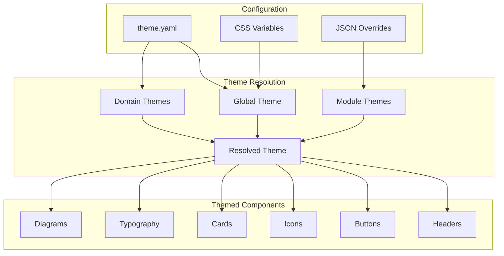

<!-- ASCII Art for Arch-11 -->


██████╗ ███████╗██████╗     ███╗   ███╈█╗   ██╗██╗     ███████╗
██╔══██╗██╔════╝██╔══██╗    ████╗ ████╔╝██║ ██╔╝██║     ██╔════╝
██████╔╝█████╗  ██████╔╝    ██╔████╔██║ ╚████╔╝ ██║     █████╗  
██╔═══╝ ██╔══╝  ██╔══██╗    ██║╚██╔╝██║  ╚██╔╝  ██║     ██╔══╝  
██║     ███████╗██║  ██║    ██║ ╚═╝ ██║   ██║   ███████╗███████╗
╚═╝     ╚══════╝╚═╝  ╚═╝    ╚═╝     ╚═╝   ╚═╝   ╚══════╝╚══════╝

████████╗██╗  ██╗███████╗███╗   ███╗██╗███╗   ██╗ ██████╗ 
╚══██╔══╝██║  ██║██╔════╝████╗ ████║██║████╗  ██║██╔════╝ 
   ██║   ███████║█████╗  ██╔████╔██║██║██╔██╗ ██║██║  ███╗
   ██║   ██╔══██║██╔══╝  ██║╚██╔╝██║██║██║╚██╗██║██║   ██║
   ██║   ██║  ██║███████╗██║ ╚═╝ ██║██║██║ ╚████║╚██████╔╝
   ╚═╝   ╚═╝  ╚═╝╚══════╝╚═╝     ╚═╝╚═╝╚═╝  ╚═══╝ ╚═════╝ 

*Lois-Kleinner and 0-1.gg 2026 - Inte11ect Platform Documentation*
*Confidential - All Rights Reserved*


---

# Per-Module Theming System

> **Associated Module:** Arch-11 — Visual & Theming Engine
> **Feature Document 06 of 10** — Estimated reading time: 18 min

## 1. Introduction

Inte11ect features a comprehensive per-module theming system that allows every module to define its own visual identity, color scheme, iconography, and layout preferences. Themes cascade from the global level down to individual modules, supporting granular customization.

---

## 2. Theme Architecture



---

## 3. Theme Definition

### Global Theme

```yaml
# ~/.inte11ect/themes/default.yaml
name: "Inte11ect Default"
version: 1.0
extends: null  # No parent

colors:
  primary: "#4a90d9"
  secondary: "#50c878"
  accent: "#ffd700"
  error: "#ff6347"
  warning: "#ffa500"
  success: "#32cd32"
  info: "#20b2aa"
  
  background:
    primary: "#ffffff"
    secondary: "#f7f8fa"
    tertiary: "#eef0f4"
    dark: "#1a1d23"
    
  text:
    primary: "#1a1d23"
    secondary: "#6b7280"
    disabled: "#9ca3af"
    inverse: "#ffffff"
    
  border:
    default: "#e5e7eb"
    focus: "#4a90d9"
    error: "#ff6347"

typography:
  font_family: "'Inter', 'Segoe UI', system-ui, sans-serif"
  font_family_mono: "'JetBrains Mono', 'Fira Code', monospace"
  font_size:
    xs: "0.75rem"
    sm: "0.875rem"
    base: "1rem"
    lg: "1.125rem"
    xl: "1.25rem"
    xxl: "1.5rem"
    display: "2.5rem"
  font_weight:
    normal: 400
    medium: 500
    semibold: 600
    bold: 700

spacing:
  xs: "0.25rem"
  sm: "0.5rem"
  md: "1rem"
  lg: "1.5rem"
  xl: "2rem"
  xxl: "3rem"

border_radius:
  sm: "0.25rem"
  md: "0.5rem"
  lg: "0.75rem"
  xl: "1rem"
  full: "9999px"

shadows:
  sm: "0 1px 2px rgba(0,0,0,0.05)"
  md: "0 4px 6px rgba(0,0,0,0.07)"
  lg: "0 10px 15px rgba(0,0,0,0.1)"
  xl: "0 20px 25px rgba(0,0,0,0.15)"

animation:
  duration_fast: "150ms"
  duration_normal: "300ms"
  duration_slow: "500ms"
  easing: "cubic-bezier(0.4, 0, 0.2, 1)"

icons:
  style: "outline"  # "outline", "solid", "duotone"
  size: "1.25rem"
```

### Domain Theme (Cognition)

```yaml
# ~/.inte11ect/themes/domains/cognition.yaml
name: "Cognition Domain Theme"
extends: "default"

colors:
  primary: "#7c3aed"    # Purple
  secondary: "#a78bfa"
  accent: "#c4b5fd"
  
  background:
    primary: "#f5f3ff"
    secondary: "#ede9fe"
    
  text:
    primary: "#2e1065"
    secondary: "#6d28d9"

icons:
  domain_icon: "brain"
  module_default: "cog"
```

### Module Theme (cog-reasoning)

```yaml
# ~/.inte11ect/themes/modules/cog-reasoning.yaml
name: "Reasoning Module Theme"
extends: "cognition"

colors:
  primary: "#6d28d9"    # Darker purple
  accent: "#8b5cf6"
  
icons:
  module_icon: "lightbulb"
  status_icons:
    idle: "circle"
    active: "activity"
    error: "alert-circle"

labels:
  short: "Reasoning"
  full: "Chain-of-Thought Reasoning"
  description: "Multi-step logical reasoning engine"
```

---

## 4. Theme Resolution Algorithm

```rust
pub struct ThemeResolver {
    global: Theme,
    domain_themes: HashMap<Domain, Theme>,
    module_themes: HashMap<ModuleId, Theme>,
}

impl ThemeResolver {
    pub fn resolve(&self, module_id: &ModuleId) -> ResolvedTheme {
        let domain = module_id.domain();
        
        // Start with global defaults
        let mut resolved = self.global.clone();
        
        // Apply domain overrides
        if let Some(domain_theme) = self.domain_themes.get(&domain) {
            resolved.merge(domain_theme);
        }
        
        // Apply module-specific overrides
        if let Some(module_theme) = self.module_themes.get(module_id) {
            resolved.merge(module_theme);
        }
        
        ResolvedTheme {
            css_variables: self.to_css_variables(&resolved),
            class_names: self.generate_class_names(&resolved),
        }
    }
    
    fn to_css_variables(&self, theme: &Theme) -> HashMap<String, String> {
        let mut vars = HashMap::new();
        
        vars.insert("--color-primary".into(), theme.colors.primary.clone());
        vars.insert("--color-secondary".into(), theme.colors.secondary.clone());
        vars.insert("--color-accent".into(), theme.colors.accent.clone());
        vars.insert("--color-error".into(), theme.colors.error.clone());
        vars.insert("--color-bg-primary".into(), theme.colors.background.primary.clone());
        vars.insert("--color-bg-secondary".into(), theme.colors.background.secondary.clone());
        vars.insert("--color-text-primary".into(), theme.colors.text.primary.clone());
        vars.insert("--color-text-secondary".into(), theme.colors.text.secondary.clone());
        vars.insert("--font-family".into(), theme.typography.font_family.clone());
        vars.insert("--font-family-mono".into(), theme.typography.font_family_mono.clone());
        vars.insert("--border-radius".into(), theme.border_radius.md.clone());
        
        vars
    }
}
```

---

## 5. Theme Merging

```rust
impl Theme {
    pub fn merge(&mut self, override_theme: &Theme) {
        // Merge colors (non-None values override)
        if let Some(c) = &override_theme.colors.primary {
            self.colors.primary.clone_from(c);
        }
        if let Some(c) = &override_theme.colors.secondary {
            self.colors.secondary.clone_from(c);
        }
        // ... etc for all color fields
        
        // Merge typography
        if let Some(f) = &override_theme.typography.font_family {
            self.typography.font_family.clone_from(f);
        }
        
        // Merge spacing (specific overrides)
        for (key, value) in &override_theme.spacing.overrides {
            self.spacing.base.insert(key.clone(), value.clone());
        }
        
        // Merge icons
        if let Some(i) = &override_theme.icons.module_icon {
            self.icons.module_icon.clone_from(i);
        }
        
        // Merge labels
        self.labels.extend(override_theme.labels.clone());
    }
}
```

---

## 6. CSS Variable Generation

```rust
impl Theme {
    pub fn to_css(&self, module_id: &ModuleId) -> String {
        let mut css = String::new();
        
        css.push_str(&format!(".module-{} {{\n", module_id));
        
        for (key, value) in self.to_css_variables() {
            css.push_str(&format!("  {}: {};\n", key, value));
        }
        
        css.push_str("}\n");
        css
    }
}
```

Generated CSS:

```css
.module-cog-reasoning {
  --color-primary: #6d28d9;
  --color-secondary: #a78bfa;
  --color-accent: #c4b5fd;
  --color-error: #ff6347;
  --color-bg-primary: #f5f3ff;
  --color-bg-secondary: #ede9fe;
  --color-text-primary: #2e1065;
  --color-text-secondary: #6d28d9;
  --font-family: 'Inter', 'Segoe UI', system-ui, sans-serif;
  --font-family-mono: 'JetBrains Mono', 'Fira Code', monospace;
  --border-radius: 0.5rem;
}
```

---

## 7. Svelte Integration

```svelte
<!-- ModuleCard.svelte -->
<script lang="ts">
  import { theme } from './theme-store';
  
  export let moduleId: string;
  
  $: moduleTheme = theme.resolve(moduleId);
  $: cssVars = moduleTheme.cssVariables;
</script>

<div 
  class="module-card module-{moduleId}"
  style={Object.entries(cssVars).map(([k, v]) => `${k}: ${v}`).join('; ')}
>
  <div class="card-header">
    <Icon name={moduleTheme.icon} />
    <h3>{moduleTheme.label}</h3>
  </div>
  <div class="card-body">
    <slot />
  </div>
  <div class="card-footer">
    <span class="status-badge" class:active={$moduleStatus === 'active'}>
      {$moduleStatus}
    </span>
  </div>
</div>

<style>
  .module-card {
    background: var(--color-bg-primary);
    border: 1px solid var(--color-primary);
    border-radius: var(--border-radius);
    font-family: var(--font-family);
    color: var(--color-text-primary);
    padding: 1rem;
  }
  
  .card-header {
    display: flex;
    align-items: center;
    gap: 0.5rem;
    color: var(--color-primary);
  }
  
  .status-badge.active {
    background: var(--color-secondary);
    color: white;
  }
</style>
```

---

## 8. Theme Store

```typescript
// theme-store.ts
import { writable, derived } from 'svelte/store';

interface Theme {
  colors: ColorScheme;
  typography: Typography;
  spacing: Spacing;
  icons: IconSet;
  labels: Record<string, string>;
}

class ThemeManager {
  private themes = new Map<string, Theme>();
  private currentTheme = writable<string>('default');
  
  constructor() {
    this.loadTheme('default');
  }
  
  async loadTheme(name: string): Promise<void> {
    const response = await fetch(`/api/v1/themes/${name}`);
    const theme: Theme = await response.json();
    this.themes.set(name, theme);
  }
  
  async loadModuleTheme(moduleId: string): Promise<void> {
    const response = await fetch(`/api/v1/themes/modules/${moduleId}`);
    const theme: Theme = await response.json();
    this.themes.set(`module:${moduleId}`, theme);
  }
  
  resolve(moduleId: string): ResolvedTheme {
    const global = this.themes.get('default')!;
    const domain = this.themes.get(`domain:${moduleId.split('-')[0]}`);
    const module = this.themes.get(`module:${moduleId}`);
    
    const cssVariables: Record<string, string> = {};
    
    // Merge in order: global → domain → module
    const merge = (theme: Theme) => {
      Object.assign(cssVariables, this.themeToVars(theme));
    };
    
    merge(global);
    if (domain) merge(domain);
    if (module) merge(module);
    
    return {
      cssVariables,
      icon: module?.icons?.module_icon ?? global.icons.module_default,
      label: module?.labels?.short ?? moduleId,
    };
  }
  
  private themeToVars(theme: Theme): Record<string, string> {
    return {
      '--color-primary': theme.colors.primary,
      '--color-secondary': theme.colors.secondary,
      '--color-bg-primary': theme.colors.background.primary,
      '--color-bg-secondary': theme.colors.background.secondary,
      '--color-text-primary': theme.colors.text.primary,
      '--color-text-secondary': theme.colors.text.secondary,
      '--font-family': theme.typography.font_family,
      '--border-radius': theme.border_radius,
    };
  }
}

export const themeManager = new ThemeManager();
export const currentTheme = themeManager.currentTheme;
```

---

## 9. Built-in Themes

| Theme Name | Type | Light/Dark | Best For |
|-----------|------|-----------|----------|
| `default` | Light | Light | General use |
| `dark` | Dark | Dark | Low-light environments |
| `forest` | Light | Light | Nature-themed dashboards |
| `neutral` | Light | Light | Minimalist |
| `inte11ect` | Light | Light | Brand identity |
| `midnight` | Dark | Dark | Night coding sessions |
| `cognition` | Domain | Light | cog-* modules |
| `data-flow` | Domain | Light | data-* modules |
| `generation` | Domain | Light | gen-* modules |
| `analysis` | Domain | Light | ana-* modules |
| `communication` | Domain | Light | com-* modules |
| `system` | Domain | Dark | sys-* modules |

---

## 10. Mermaid Diagram Theming

```rust
pub struct MermaidTheme {
    pub background: String,
    pub primary_color: String,
    pub primary_text_color: String,
    pub primary_border_color: String,
    pub line_color: String,
    pub secondary_color: String,
    pub tertiary_color: String,
    pub font_family: String,
    pub font_size: String,
}

impl MermaidTheme {
    pub fn from_module_theme(module_theme: &Theme) -> Self {
        MermaidTheme {
            background: module_theme.colors.background.primary.clone(),
            primary_color: module_theme.colors.primary.clone(),
            primary_text_color: module_theme.colors.text.inverse.clone(),
            primary_border_color: module_theme.colors.primary.clone(),
            line_color: module_theme.colors.border.default.clone(),
            secondary_color: module_theme.colors.background.secondary.clone(),
            tertiary_color: module_theme.colors.background.tertiary.clone(),
            font_family: module_theme.typography.font_family.clone(),
            font_size: module_theme.typography.font_size.base.clone(),
        }
    }
    
    pub fn to_mermaid_config(&self) -> String {
        format!(
            "%%{{init: {{'theme':'base', 'themeVariables': {{
                'background': '{}',
                'primaryColor': '{}',
                'primaryTextColor': '{}',
                'primaryBorderColor': '{}',
                'lineColor': '{}',
                'secondaryColor': '{}',
                'tertiaryColor': '{}',
                'fontFamily': '{}',
                'fontSize': '{}'
            }}}}}%%",
            self.background, self.primary_color, self.primary_text_color,
            self.primary_border_color, self.line_color, self.secondary_color,
            self.tertiary_color, self.font_family, self.font_size,
        )
    }
}
```

---

## 11. CLI Theme Management

```bash
# List available themes
inte11ect theme list

# ┌─────────────────┬────────┬────────┬────────────┐
# │ Theme           │ Type   │ Light  │ Extends    │
# ├─────────────────┼────────┼────────┼────────────┤
# │ default         │ global │ ✓      │ —          │
# │ dark            │ global │        │ default    │
# │ inte11ect       │ global │ ✓      │ default    │
# │ cognition       │ domain │ ✓      │ default    │
# │ data-flow       │ domain │ ✓      │ default    │
# │ generation      │ domain │ ✓      │ default    │
# │ analysis        │ domain │ ✓      │ default    │
# │ communication   │ domain │ ✓      │ default    │
# │ system          │ domain │        │ dark       │
# │ cog-reasoning   │ module │ ✓      │ cognition  │
# └─────────────────┴────────┴────────┴────────────┘

# Apply a theme
inte11ect theme apply --name dark

# Apply domain theme
inte11ect theme apply-domain --domain cog --name cognition

# Apply module theme
inte11ect theme apply-module --module cog-reasoning --name reasoning

# Create a custom theme
inte11ect theme create --name "corporate" --base default

# Export current theme
inte11ect theme export --output ./my_theme.yaml

# Import a theme
inte11ect theme import --file ./corporate.yaml
```

---

## 12. Cross-References

- See [01-features.md](./01-features.md) for platform architecture overview
- See [02-features.md](./02-features.md) for the 72 module architecture
- See [09-features.md](./09-features.md) for Mermaid diagram rendering
- See [10-features.md](./10-features.md) for frontend architecture
- See [03-tutorial.md](../tutorial/03-tutorial.md) for exploring all 72 modules

---

*Lois-Kleinner and 0-1.gg 2026 — Confidential*
