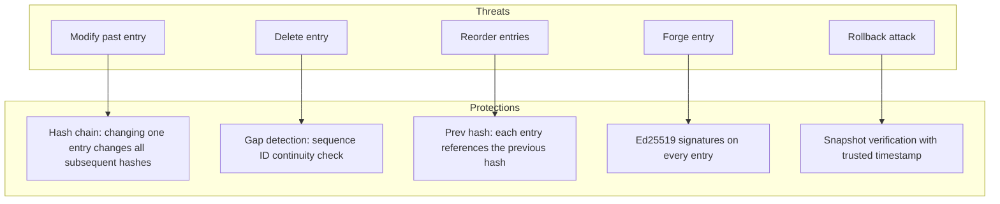

<!-- ASCII Art for Kern-11 -->


 ¦¦¦¦¦+ ¦¦+ ¦¦¦¦¦¦+ ¦¦¦¦¦¦¦+¦¦¦¦¦¦¦+    ¦¦¦¦¦+ ¦¦+   ¦¦+¦¦¦¦¦¦+ ¦¦+¦¦¦¦¦¦¦¦+
¦¦+--¦¦+¦¦¦¦¦+----+ ¦¦+----+¦¦+----+   ¦¦+--¦¦+¦¦¦   ¦¦¦¦¦+--¦¦+¦¦¦+--¦¦+--+
¦¦¦¦¦¦¦¦¦¦¦¦¦¦  ¦¦¦+¦¦¦¦¦¦¦+¦¦¦¦¦¦¦+   ¦¦¦¦¦¦¦¦¦¦¦   ¦¦¦¦¦¦¦¦¦++¦¦¦   ¦¦¦   
¦¦+--¦¦¦¦¦¦¦¦¦   ¦¦¦+----¦¦¦+----¦¦¦   ¦¦+--¦¦¦¦¦¦   ¦¦¦¦¦+--¦¦+¦¦¦   ¦¦¦   
¦¦¦  ¦¦¦¦¦¦+¦¦¦¦¦¦++¦¦¦¦¦¦¦¦¦¦¦¦¦¦¦¦   ¦¦¦  ¦¦¦+¦¦¦¦¦¦++¦¦¦  ¦¦¦¦¦¦   ¦¦¦   
+-+  +-++-+ +-----+ +------++------+   +-+  +-+ +-----+ +-+  +-++-+   +-+   

¦¦+     ¦¦¦¦¦¦¦+¦¦¦¦¦¦+  ¦¦¦¦¦¦+ ¦¦¦¦¦¦¦+¦¦¦¦¦¦+ 
¦¦¦     ¦¦+----+¦¦+--¦¦+¦¦+----+ ¦¦+----+¦¦+--¦¦+
¦¦¦     ¦¦¦¦¦+  ¦¦¦  ¦¦¦¦¦¦  ¦¦¦+¦¦¦¦¦+  ¦¦¦¦¦¦++
¦¦¦     ¦¦+--+  ¦¦¦  ¦¦¦¦¦¦   ¦¦¦¦¦+--+  ¦¦+--¦¦+
¦¦¦¦¦¦¦+¦¦¦¦¦¦¦+¦¦¦¦¦¦+++¦¦¦¦¦¦++¦¦¦¦¦¦¦+¦¦¦  ¦¦¦
+------++------++-----+  +-----+ +------++-+  +-+

*Lois-Kleinner and 0-1.gg 2026 - Inte11ect Platform Documentation*
*Confidential - All Rights Reserved*


---

# .aioss Audit Ledger

> **Associated Module:** Kern-11 — Immutable Audit & Integrity Kernel
> **Feature Document 07 of 10** — Estimated reading time: 24 min

## 1. Introduction

The `.aioss` (Append-Only Immutable Object Storage System) ledger is the cryptographic audit backbone of the Inte11ect platform. Every action — every inference, every module activation, every configuration change — is recorded as an immutable, content-addressed, Merkle-chained entry. This document provides a complete technical specification of the ledger system.

---

## 2. Core Concepts

### 2.1 Hash Chain

```
Genesis ? Entry 1 ? Entry 2 ? Entry 3 ? ... ? Entry N
   ?         ?         ?         ?                 ?
  H0 ? H1 = SHA256(E1 || H0) ? H2 = SHA256(E2 || H1) ? ...
```

```rust
#[derive(Debug, Clone, Serialize, Deserialize)]
pub struct Hash(pub [u8; 32]);

impl Hash {
    pub fn compute(entry: &RawEntry, prev_hash: &Hash) -> Self {
        let mut hasher = Sha256::new();
        hasher.update(bincode::serialize(entry).unwrap());
        hasher.update(prev_hash.as_bytes());
        Hash(hasher.finalize().into())
    }
    
    pub fn genesis() -> Self {
        Hash([0u8; 32])
    }
    
    pub fn as_bytes(&self) -> &[u8; 32] {
        &self.0
    }
}
```

### 2.2 Entry Structure

```rust
#[derive(Debug, Clone, Serialize, Deserialize)]
pub struct RawEntry {
    pub version: u8,
    pub timestamp: i64,           // Unix micros
    pub action: String,           // "inference.start", "model.download", etc.
    pub module: Option<String>,
    pub session_id: Option<String>,
    pub payload: Vec<u8>,         // CBOR-encoded payload
}

#[derive(Debug, Clone, Serialize, Deserialize)]
pub struct SignedEntry {
    pub entry: RawEntry,
    pub hash: Hash,
    pub prev_hash: Hash,
    pub signature: Option<Vec<u8>>,  // Ed25519 signature over hash
}

#[derive(Debug, Clone, Serialize, Deserialize)]
pub struct ChainEntry {
    pub id: i64,
    pub timestamp: String,        // ISO 8601
    pub action: String,
    pub module: Option<String>,
    pub session_id: Option<String>,
    pub payload: String,           // JSON string
    pub hash: String,
    pub prev_hash: String,
    pub signature: Option<String>,
}
```

### 2.3 Action Taxonomy

```rust
pub enum Action {
    // System lifecycle
    SystemStart,
    SystemStop,
    ConfigChange,
    
    // Module lifecycle
    ModuleEnable,
    ModuleDisable,
    ModuleUpdate,
    ModuleError,
    
    // Model lifecycle
    ModelDownload,
    ModelRemove,
    ModelVerify,
    
    // Inference
    InferenceStart,
    InferenceToken,
    InferenceComplete,
    InferenceCancel,
    
    // Data operations
    DataIngest,
    DataExport,
    DataDelete,
    
    // Ledger operations
    LedgerVerify,
    LedgerExport,
    LedgerBackup,
    LedgerRestore,
    
    // Security
    AuthSuccess,
    AuthFailure,
    KeyCreate,
    KeyRevoke,
    SecurityAlert,
    
    // User operations
    FeedbackSubmit,
    RatingSubmit,
}
```

---

## 3. Database Schema

```sql
-- Core entries table
CREATE TABLE entries (
    id          INTEGER PRIMARY KEY AUTOINCREMENT,
    timestamp   TEXT NOT NULL,
    action      TEXT NOT NULL,
    module      TEXT,
    session_id  TEXT,
    payload     TEXT NOT NULL DEFAULT '{}',
    hash        TEXT NOT NULL UNIQUE,
    prev_hash   TEXT NOT NULL,
    signature   TEXT,
    created_at  TEXT NOT NULL DEFAULT (datetime('now'))
);

-- Indexes
CREATE INDEX idx_entries_timestamp ON entries(timestamp);
CREATE INDEX idx_entries_action ON entries(action);
CREATE INDEX idx_entries_module ON entries(module);
CREATE INDEX idx_entries_session ON entries(session_id);
CREATE INDEX idx_entries_hash ON entries(hash);
CREATE INDEX idx_entries_prev_hash ON entries(prev_hash);

-- Metadata table
CREATE TABLE meta (
    key   TEXT PRIMARY KEY,
    value TEXT NOT NULL
);

-- Seed metadata
INSERT INTO meta (key, value) VALUES ('version', '2');
INSERT INTO meta (key, value) VALUES ('genesis_hash', '0x0000000000000000000000000000000000000000000000000000000000000000');
INSERT INTO meta (key, value) VALUES ('format', 'aioss-v2');
INSERT INTO meta (key, value) VALUES ('created_at', '2026-01-15T10:00:00Z');

-- Backup tracking
CREATE TABLE backups (
    id          INTEGER PRIMARY KEY AUTOINCREMENT,
    path        TEXT NOT NULL,
    entry_count INTEGER NOT NULL,
    last_hash   TEXT NOT NULL,
    created_at  TEXT NOT NULL DEFAULT (datetime('now')),
    checksum    TEXT NOT NULL
);

-- Archive tracking
CREATE TABLE archives (
    id          INTEGER PRIMARY KEY AUTOINCREMENT,
    path        TEXT NOT NULL,
    start_id    INTEGER NOT NULL,
    end_id      INTEGER NOT NULL,
    entry_count INTEGER NOT NULL,
    created_at  TEXT NOT NULL DEFAULT (datetime('now')),
    checksum    TEXT NOT NULL
);
```

---

## 4. Rust Implementation

### Ledger Core

```rust
pub struct Ledger {
    pool: SqlitePool,
    config: LedgerConfig,
    prev_hash: Hash,
    signing_key: Option<ed25519_dalek::SigningKey>,
    verifying_key: Option<ed25519_dalek::VerifyingKey>,
}

impl Ledger {
    pub async fn open(path: &Path, config: LedgerConfig) -> Result<Self, LedgerError> {
        let pool = SqlitePool::connect_with(
            SqliteConnectOptions::new()
                .filename(path)
                .create_if_missing(true)
        ).await?;
        
        // Run migrations
        sqlx::migrate!("./migrations/ledger")
            .run(&pool)
            .await?;
        
        // Load signing key if configured
        let (signing_key, verifying_key) = if config.signing_enabled {
            let sk_path = Path::new(&config.key_path);
            let pk_path = Path::new(&config.public_key_path);
            
            let sk = if sk_path.exists() {
                load_signing_key(sk_path)?
            } else {
                let sk = ed25519_dalek::SigningKey::generate(&mut OsRng);
                save_signing_key(sk_path, &sk)?;
                sk
            };
            
            let pk = sk.verifying_key();
            save_verifying_key(pk_path, &pk)?;
            
            (Some(sk), Some(pk))
        } else {
            (None, None)
        };
        
        // Get last hash
        let last_hash: Option<(String,)> = sqlx::query_as(
            "SELECT value FROM meta WHERE key = 'last_hash'"
        )
            .fetch_optional(&pool)
            .await?;
        
        let prev_hash = match last_hash {
            Some((h,)) => Hash::from_hex(&h)?,
            None => Hash::genesis(),
        };
        
        Ok(Ledger {
            pool,
            config,
            prev_hash,
            signing_key,
            verifying_key,
        })
    }
    
    pub async fn append(&mut self, entry: RawEntry) -> Result<Hash, LedgerError> {
        // Verify not tampered
        self.verify_tail().await?;
        
        // Compute hash
        let hash = Hash::compute(&entry, &self.prev_hash);
        
        // Sign if enabled
        let signature = if let Some(sk) = &self.signing_key {
            Some(sk.sign(&hash.as_bytes()).to_bytes().to_vec())
        } else {
            None
        };
        
        // Serialize payload
        let payload_json = serde_json::to_string(&entry.payload)?;
        
        // Insert into database
        sqlx::query(
            "INSERT INTO entries (timestamp, action, module, session_id, payload, hash, prev_hash, signature) VALUES (?, ?, ?, ?, ?, ?, ?, ?)"
        )
            .bind(entry.timestamp)
            .bind(&entry.action)
            .bind(&entry.module)
            .bind(&entry.session_id)
            .bind(&payload_json)
            .bind(hash.to_hex())
            .bind(self.prev_hash.to_hex())
            .bind(&signature)
            .execute(&self.pool)
            .await?;
        
        // Update metadata
        sqlx::query("INSERT OR REPLACE INTO meta (key, value) VALUES ('last_hash', ?)")
            .bind(hash.to_hex())
            .execute(&self.pool)
            .await?;
        
        sqlx::query("INSERT OR REPLACE INTO meta (key, value) VALUES ('last_entry_id', (SELECT MAX(id) FROM entries))")
            .execute(&self.pool)
            .await?;
        
        self.prev_hash = hash;
        
        // Auto-archive if needed
        if self.config.auto_prune_days > 0 {
            self.archive_if_needed().await?;
        }
        
        Ok(hash)
    }
    
    pub async fn verify_chain(&self) -> Result<VerificationResult, LedgerError> {
        let entries: Vec<(i64, String, String, Option<String>)> = sqlx::query_as(
            "SELECT id, hash, prev_hash, signature FROM entries ORDER BY id"
        )
            .fetch_all(&self.pool)
            .await?;
        
        if entries.is_empty() {
            return Ok(VerificationResult::Valid { entry_count: 0 });
        }
        
        let mut prev = Hash::genesis();
        
        for (id, hash_hex, prev_hash_hex, sig) in &entries {
            let hash = Hash::from_hex(hash_hex)?;
            let prev_hash = Hash::from_hex(prev_hash_hex)?;
            
            // Check chain link
            if prev_hash != prev {
                return Ok(VerificationResult::Invalid {
                    entry_id: *id,
                    reason: format!("Hash chain broken at entry {}. Expected prev_hash {} but found {}", 
                                   id, prev.to_hex(), prev_hash_hex),
                });
            }
            
            // Verify signature
            if let (Some(sig_bytes), Some(vk)) = (sig, &self.verifying_key) {
                let sig_bytes = hex::decode(sig_bytes)?;
                let sig = ed25519_dalek::Signature::from_slice(&sig_bytes)?;
                
                if vk.verify_strict(hash.as_bytes(), &sig).is_err() {
                    return Ok(VerificationResult::Invalid {
                        entry_id: *id,
                        reason: format!("Signature verification failed at entry {}", id),
                    });
                }
            }
            
            prev = hash;
        }
        
        // Verify tail matches stored
        if prev != self.prev_hash {
            return Ok(VerificationResult::Invalid {
                entry_id: *entries.last().unwrap().0,
                reason: "Last hash mismatch with stored metadata".into(),
            });
        }
        
        Ok(VerificationResult::Valid {
            entry_count: entries.len() as i64,
        })
    }
    
    async fn verify_tail(&self) -> Result<(), LedgerError> {
        let tail: Option<(i64, String, String)> = sqlx::query_as(
            "SELECT id, hash, prev_hash FROM entries ORDER BY id DESC LIMIT 1"
        )
            .fetch_optional(&self.pool)
            .await?;
        
        if let Some((_id, hash, _prev_hash)) = tail {
            let stored_hash = Hash::from_hex(&hash)?;
            if stored_hash != self.prev_hash {
                return Err(LedgerError::TailMismatch {
                    stored: self.prev_hash.to_hex(),
                    actual: hash,
                });
            }
        }
        
        Ok(())
    }
}
```

---

## 5. Merkle Proofs

```rust
pub struct MerkleProof {
    pub entry_id: i64,
    pub entry: SignedEntry,
    pub siblings: Vec<Hash>,
    pub root_hash: Hash,
}

impl MerkleProof {
    pub fn verify(&self) -> bool {
        let mut current = Hash::compute(&self.entry.entry, &self.entry.prev_hash);
        
        for sibling in &self.siblings {
            let mut hasher = Sha256::new();
            
            // Order matters: smaller hash first
            if current.as_bytes() < sibling.as_bytes() {
                hasher.update(current.as_bytes());
                hasher.update(sibling.as_bytes());
            } else {
                hasher.update(sibling.as_bytes());
                hasher.update(current.as_bytes());
            }
            
            current = Hash(hasher.finalize().into());
        }
        
        current == self.root_hash
    }
}

impl Ledger {
    pub async fn prove_inclusion(&self, entry_id: i64) -> Result<MerkleProof, LedgerError> {
        // Get the target entry
        let entry: SignedEntry = sqlx::query_as("SELECT * FROM entries WHERE id = ?")
            .bind(entry_id)
            .fetch_one(&self.pool)
            .await?;
        
        // Get all entries to build Merkle tree
        let all: Vec<(i64, String)> = sqlx::query_as("SELECT id, hash FROM entries ORDER BY id")
            .fetch_all(&self.pool)
            .await?;
        
        // Build Merkle tree
        let leaves: Vec<Hash> = all.iter().map(|(_, h)| Hash::from_hex(h).unwrap()).collect();
        let tree = MerkleTree::new(&leaves);
        
        let proof = tree.proof(entry_id as usize - 1);  // 0-indexed
        let root_hash = tree.root();
        
        Ok(MerkleProof {
            entry_id,
            entry,
            siblings: proof,
            root_hash,
        })
    }
    
    pub async fn verify_proof(&self, proof: &MerkleProof) -> Result<bool, LedgerError> {
        Ok(proof.verify() && proof.root_hash == self.prev_hash)
    }
}
```

---

## 6. Export Formats

### JSON Lines (Default)

```json
{"id":1,"timestamp":"2026-01-15T10:00:00Z","action":"system.start","module":null,"session_id":null,"payload":"{}","hash":"0x0000...","prev_hash":"0x0000...","signature":null}
{"id":2,"timestamp":"2026-01-15T10:00:01Z","action":"model.download","module":"god11","session_id":"sess_abc","payload":"{\"model_id\":\"Qwen2-VL-2B\"}","hash":"0xa1b2...","prev_hash":"0x0000...","signature":"0xsig..."}
```

### CSV

```csv
id,timestamp,action,module,session_id,hash,prev_hash
1,2026-01-15T10:00:00Z,system.start,,,,0x0000...,0x0000...
2,2026-01-15T10:00:01Z,model.download,god11,sess_abc,0xa1b2...,0x0000...
```

### Parquet Schema

```rust
let schema = Schema::new(vec![
    Field::new("id", DataType::Int64, false),
    Field::new("timestamp", DataType::Utf8, false),
    Field::new("action", DataType::Utf8, false),
    Field::new("module", DataType::Utf8, true),
    Field::new("session_id", DataType::Utf8, true),
    Field::new("payload", DataType::Utf8, false),
    Field::new("hash", DataType::Utf8, false),
    Field::new("prev_hash", DataType::Utf8, false),
    Field::new("signature", DataType::Utf8, true),
]);
```

---

## 7. Backup and Recovery

```rust
impl Ledger {
    pub async fn create_backup(&self, path: &Path) -> Result<BackupResult, LedgerError> {
        // Create backup directory
        tokio::fs::create_dir_all(path.parent().unwrap()).await?;
        
        // Get current state
        let entry_count: (i64,) = sqlx::query_as("SELECT COUNT(*) FROM entries")
            .fetch_one(&self.pool)
            .await?;
        
        // Use SQLite backup API
        let backup = Backup::new(&self.pool, path).await?;
        backup.run_to_completion(100, Duration::from_millis(100), None).await?;
        
        // Compute checksum
        let checksum = compute_file_checksum(path).await?;
        
        // Record backup
        sqlx::query("INSERT INTO backups (path, entry_count, last_hash, checksum) VALUES (?, ?, ?, ?)")
            .bind(path.to_string_lossy().to_string())
            .bind(entry_count.0)
            .bind(self.prev_hash.to_hex())
            .bind(checksum.to_hex())
            .execute(&self.pool)
            .await?;
        
        // Clean old backups
        self.prune_old_backups().await?;
        
        Ok(BackupResult {
            path: path.to_path_buf(),
            entry_count: entry_count.0,
            checksum,
        })
    }
    
    pub async fn restore(&mut self, path: &Path) -> Result<RestoreResult, LedgerError> {
        // Close current pool
        self.pool.close().await;
        
        // Restore from backup
        let backup_path = self.config.path.with_extension("db.restore");
        tokio::fs::copy(path, &backup_path).await?;
        
        // Open restored database
        self.pool = SqlitePool::connect_with(
            SqliteConnectOptions::new()
                .filename(&backup_path)
                .read_only(false)
        ).await?;
        
        // Verify restored chain
        let result = self.verify_chain().await?;
        
        match result {
            VerificationResult::Valid { .. } => {
                // Swap files
                let original = self.config.path.with_extension("db.old");
                tokio::fs::rename(&self.config.path, &original).await?;
                tokio::fs::rename(&backup_path, &self.config.path).await?;
                
                Ok(RestoreResult {
                    restored_entries: self.get_entry_count().await?,
                    verified: true,
                })
            }
            VerificationResult::Invalid { .. } => {
                Err(LedgerError::RestoreVerificationFailed)
            }
        }
    }
}
```

---

## 8. CLI Reference

```bash
# Initialize
inte11ect ledger init
inte11ect ledger init-keys

# Status and verification
inte11ect ledger status
inte11ect ledger verify --full
inte11ect ledger verify --last 100

# Querying
inte11ect ledger tail --lines 20
inte11ect ledger query --action "inference.*"
inte11ect ledger query --since "2026-06-01" --until "2026-06-19"
inte11ect ledger query --session sess_abc123
inte11ect ledger query --aggregate "count by action"

# Export
inte11ect ledger export --format jsonl --output ./ledger.jsonl
inte11ect ledger export --format csv --output ./ledger.csv
inte11ect ledger export --format parquet --output ./ledger.parquet
inte11ect ledger export --action "inference.*" --format json

# Proofs
inte11ect ledger prove --entry-id 8472
inte11ect ledger verify-proof --input proof.json
inte11ect ledger snapshot

# Backups
inte11ect ledger backup --output ./backups/aioss_2026-06-19.db
inte11ect ledger restore --input ./backups/aioss_2026-06-18.db
inte11ect ledger list-backups

# Maintenance
inte11ect ledger archive --older-than 90d
inte11ect ledger prune --older-than 365d
inte11ect ledger vacuum
inte11ect ledger repair
```

---

## 9. Configuration Reference

```toml
[ledger]
enabled = true
path = "~/.inte11ect/ledger/aioss.db"
version = 2

# Signing
signing_enabled = false
key_path = "~/.inte11ect/ledger/signing_key.pem"
public_key_path = "~/.inte11ect/ledger/public_key.pem"

# Retention
auto_prune_days = 0
archive_path = "~/.inte11ect/ledger/archive/"
archive_compression = "zstd"

# Backups
backup_enabled = true
backup_interval_hours = 24
backup_count = 30
backup_path = "~/.inte11ect/ledger/backups/"
backup_compression = "zstd"

# Sync (for distributed deployments)
sync_enabled = false
sync_interval_secs = 60
sync_endpoint = "https://ledger.aioss.io/v1/entries"
sync_token = ""
sync_verify_on_receive = true

# Encryption
encryption_enabled = false
encryption_key = ""
encryption_algorithm = "aes-256-gcm"

# Monitoring
alert_on_integrity_failure = true
alert_webhook = ""
```

---

## 10. Trust Model and Security



### Attack Scenarios and Mitigations

| Attack | Description | Mitigation |
|--------|-------------|------------|
| Entry modification | Attacker edits a past entry | Hash chain breaks; full verify detects |
| Entry deletion | Attacker removes an entry | Sequence gap detected; backup comparison |
| Reordering | Attacker swaps entries | Prev hash mismatch; chain breaks |
| Forgery | Attacker adds fake entries | Signature verification fails |
| Rollback | Attacker replaces with old copy | Snapshot verification; cross-ledger comparison |
| Database swap | Attacker replaces entire DB | File integrity monitoring; off-site backups |
| Key compromise | Signing key is stolen | Key rotation; revocation list |

---

## 11. Cross-References

- See [01-features.md](./01-features.md) for platform architecture overview
- See [05-tutorial.md](../tutorial/05-tutorial.md) for verifying the .aioss ledger
- See [11-tutorial.md](../tutorial/11-tutorial.md) for security best practices
- See [12-tutorial.md](../tutorial/12-tutorial.md) for exporting and sharing logs

---

*Lois-Kleinner and 0-1.gg 2026 — Confidential*

```
.====================================================================.
!  Made in the UAE, Dubai #DubaiIt #Dubai #Dxb #SovereignAI          !
!  Made in The Emirates #Dubai_it                                    !
!                                                                    !
!  Lois-Kleinner Alpasan - The Anticloud 2026-                       !
!                                                                    !
!  0-1.gg ! GitHub ! LinkedIn ! DEV ! GH Pages                       !
!  HuggingFace ! Blog ! Tumblr ! Fandom ! Bluesky ! Mastodon          !
!  Zenodo ! Harvard Dataverse ! Internet Archive ! ORCID ! Figshare   !
!                                                                    !
!  Sovereign AI ! Local-First ! Privacy ! Zero Trust ! No Datacenter !
!  Air-Gapped ! Open Source ! Rust ! Hash Chain ! Single Binary      !
!  Offline LLM ! Crypto Ledger ! P2P ! Federated                     !
'===================================================================='
```

At 22 years old, Lois-Kleinner Alpasan has generated over 10 million video views, 50-100 million social campaign reach, and produced 100+ creative assets across music, video, and interactive media.

References:
1. Lois-Kleinner Zenodo: https://doi.org/10.5281/zenodo.20781790
2. Lois-Kleinner GitHub: https://github.com/kleinnner/Anticloud/tree/main/04-aioss-format
3. Lois-Kleinner Harvard DV: https://doi.org/10.7910/DVN/FDEBAB
4. Lois-Kleinner Internet Arc: https://archive.org/details/aioss-format
5. Lois-Kleinner ORCID: https://orcid.org/0009-0009-2233-6107
6. Lois-Kleinner DEV.to: https://dev.to/kleinner
7. Lois-Kleinner LinkedIn: https://linkedin.com/in/kleinner
8. Lois-Kleinner HuggingFace: https://huggingface.co/Anticloud
9. Lois-Kleinner Tumblr: https://anticloud.tumblr.com
10. Lois-Kleinner Mastodon: https://mastodon.social/@kleinner
11. Lois-Kleinner Bluesky: https://bsky.app/profile/kleinner.bsky.social
12. 0-1.gg: https://0-1.gg
13. Lois-Kleinner Figshare: https://figshare.com/authors/Lois-Kleinner_Alpasan/20849885
