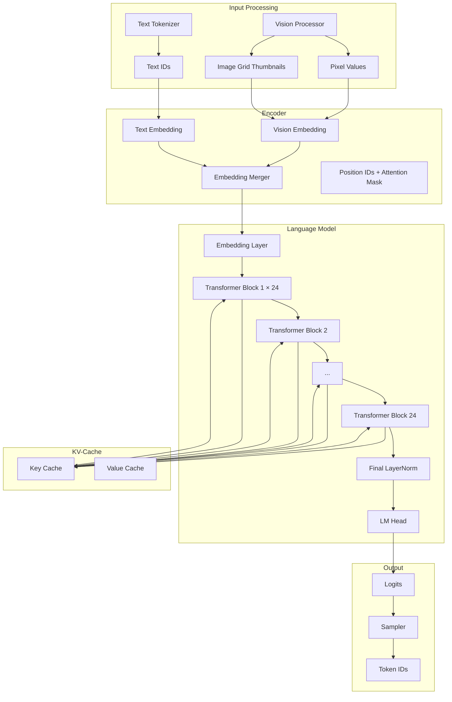

<!-- ASCII Art for Sci-11 -->


██████╗  ██████╗ ██╗    ██╗███████╗███╗   ██╗██████╗     ██╗   ██╗██╗     ██████╗ 
██╔══██╗██╔═══██╗██║    ██║██╔════╝████╗  ██║╚════██╗    ██║   ██║██║     ██╔══██╗
██████╔╝██║   ██║██║ █╗ ██║█████╗  ██╔██╗ ██║ █████╔╝    ██║   ██║██║     ██████╔╝
██╔══██╗██║   ██║██║███╗██║██╔══╝  ██║╚██╗██║██╔═══╝     ╚██╗ ██╔╝██║     ██╔══██╗
██║  ██║╚██████╔╝╚███╔███╔╝███████╗██║ ╚████║███████╗     ╚████╔╝ ███████╗██║  ██║
╚═╝  ╚═╝ ╚═════╝  ╚══╝╚══╝ ╚══════╝╚═╝  ╚═══╝╚══════╝      ╚═══╝  ╚══════╝╚═╝  ╚═╝

██████╗  ██████╗ ████████╗████████╗ ██████╗ ███╗   ███╗
██╔══██╗██╔═══██╗╚══██╔══╝╚══██╔══╝██╔═══██╗████╗ ████║
██████╔╝██║   ██║   ██║      ██║   ██║   ██║██╔████╔██║
██╔══██╗██║   ██║   ██║      ██║   ██║   ██║██║╚██╔╝██║
██████╔╝╚██████╔╝   ██║      ██║   ╚██████╔╝██║ ╚═╝ ██║
╚═════╝  ╚═════╝    ╚═╝      ╚═╝    ╚═════╝ ╚═╝     ╚═╝

*Lois-Kleinner and 0-1.gg 2026 - Inte11ect Platform Documentation*
*Confidential - All Rights Reserved*


---

# Qwen2-VL-2B Inference Engine

> **Associated Module:** Sci-11 — Model Runtime & Inference Server
> **Feature Document 08 of 10** — Estimated reading time: 26 min

## 1. Introduction

Qwen2-VL-2B is the primary inference engine embedded in Inte11ect. It is a 2-billion parameter vision-language model developed by Alibaba's Qwen team, supporting multimodal inputs (text and images) with a 32K context window. Inte11ect integrates Qwen2-VL-2B via custom Rust bindings over the `tch` crate (libtorch C++ bindings).

This document covers the model architecture, integration details, quantization pipeline, vision processing, and performance characteristics.

---

## 2. Model Architecture



### Model Parameters

| Parameter | Value |
|-----------|-------|
| Parameters | 2.18B |
| Hidden size | 1536 |
| Layers | 24 |
| Attention heads | 12 |
| Head dimension | 128 |
| Intermediate size | 8960 |
| Vocabulary size | 151,936 |
| Max position embeddings | 32,768 |
| Vision encoder | ViT (675M params) |
| Image resolution | 448×448 (variable) |
| RoPE | Yes (1M base freq) |

---

## 3. Rust Integration

### Loading the Model

```rust
pub struct Qwen2VLModel {
    model: tch::CModule,       // TorchScript traced model
    config: ModelConfig,
    device: tch::Device,
    dtype: tch::Kind,
}

impl Qwen2VLModel {
    pub fn load(path: &Path, config: &ModelConfig) -> Result<Self, ModelError> {
        let device = match config.device.as_str() {
            "cuda" => tch::Device::cuda_if_available(),
            "cpu" => tch::Device::Cpu,
            "mps" => tch::Device::Mps,
            _ => tch::Device::cuda_if_available(),
        };
        
        let dtype = match config.quantization.as_str() {
            "fp16" => tch::Kind::Half,
            "fp32" => tch::Kind::Float,
            "int8" => tch::Kind::Half,  // Load FP16, quantize separately
            _ => tch::Kind::Half,
        };
        
        // Load TorchScript model
        let model_path = path.join("qwen2_vl_traced.pt");
        let mut model = tch::CModule::load_on_device(model_path, device)?;
        model.set_eval();
        
        Ok(Qwen2VLModel {
            model,
            config: config.clone(),
            device,
            dtype,
        })
    }
    
    pub fn forward(
        &self,
        input_ids: &tch::Tensor,
        pixel_values: Option<&tch::Tensor>,
        attention_mask: Option<&tch::Tensor>,
        position_ids: Option<&tch::Tensor>,
        use_kv_cache: bool,
    ) -> Result<InferenceOutput, ModelError> {
        let mut inputs = vec![
            input_ids.to_device(self.device).to_kind(self.dtype),
        ];
        
        if let Some(pixels) = pixel_values {
            inputs.push(pixels.to_device(self.device).to_kind(self.dtype));
        } else {
            // Placeholder for vision
            inputs.push(tch::Tensor::empty(&[1, 0], (tch::Kind::Half, self.device)));
        }
        
        // Forward pass
        let output = self.model.forward_ts(&inputs)?;
        
        // Output: [logits, past_key_values, ...]
        let logits = output.get(0).to_device(tch::Device::Cpu);
        let past_kv = if use_kv_cache {
            Some(output.get(1))
        } else {
            None
        };
        
        Ok(InferenceOutput {
            logits,
            past_key_values: past_kv,
        })
    }
}
```

### Token Generation Loop

```rust
pub struct TokenGenerator {
    model: Qwen2VLModel,
    tokenizer: Tokenizer,
    config: GenerationConfig,
    kv_cache: Option<KVCache>,
}

impl TokenGenerator {
    pub async fn generate(
        &mut self,
        prompt: &str,
        image: Option<&[u8]>,
    ) -> Result<GeneratedText, GenerationError> {
        // Tokenize
        let (input_ids, pixel_values, attention_mask) = self.prepare_inputs(prompt, image).await?;
        
        let mut generated = Vec::new();
        let mut next_ids = input_ids;
        let mut token_count = 0;
        
        loop {
            // Forward pass
            let output = self.model.forward(
                &next_ids,
                if token_count == 0 { Some(&pixel_values) } else { None },
                Some(&attention_mask),
                None,
                token_count > 0,
            )?;
            
            // Sample next token
            let next_token = self.sample(&output.logits, token_count)?;
            
            generated.push(next_token);
            token_count += 1;
            
            // Decode for streaming
            let partial = self.tokenizer.decode(&generated)?;
            
            // Check termination
            if next_token == self.tokenizer.eos_id()
                || token_count >= self.config.max_new_tokens
                || self.should_stop(&partial)
            {
                break;
            }
            
            // Prepare for next iteration
            next_ids = tch::Tensor::from_slice(&[next_token])
                .view([1, 1])
                .to(tch::Device::Cpu);
        }
        
        let full_text = self.tokenizer.decode(&generated)?;
        
        Ok(GeneratedText {
            text: full_text,
            tokens: generated,
            token_count,
        })
    }
    
    fn sample(&self, logits: &tch::Tensor, step: usize) -> Result<i64, GenerationError> {
        let mut scores = logits.slice(-1, 0, logits.size()[logits.dim() - 1], 1)
            .squeeze()
            .to_kind(tch::Kind::Float);
        
        // Apply temperature
        if self.config.temperature != 1.0 {
            scores = scores / self.config.temperature;
        }
        
        // Top-K filtering
        if self.config.top_k > 0 {
            let top_k_values = scores.topk(self.config.top_k as i64);
            let min_top_k = top_k_values.0.min().unwrap();
            scores = scores.where_scalar_ge(&min_top_k, &f32::NEG_INFINITY);
        }
        
        // Top-P (nucleus) filtering
        if self.config.top_p < 1.0 {
            let mut sorted = scores.sort(-1, true);
            let cumulative = sorted.softmax(-1, tch::Kind::Float).cumsum(-1, tch::Kind::Float);
            let cutoff_idx = (cumulative > self.config.top_p).nonzero()?;
            if cutoff_idx.size()[0] > 0 {
                let cutoff_val = sorted.get(cutoff_idx.get(0).get(0));
                scores = scores.where_scalar_ge(&cutoff_val, &f32::NEG_INFINITY);
            }
        }
        
        // Convert to probabilities
        let probs = scores.softmax(-1, tch::Kind::Float);
        
        // Sample
        let token = tch::Tensor::multinomial(&probs.unsqueeze(0), 1, false)
            .get(0)
            .get(0)
            .int64_value(&[]);
        
        Ok(token)
    }
}
```

---

## 4. Vision Processing

```rust
pub struct VisionProcessor {
    image_size: i64,           // 448
    mean: [f32; 3],            // ImageNet normalization
    std: [f32; 3],
    max_image_tokens: usize,   // 256
}

impl VisionProcessor {
    pub fn process(&self, image_bytes: &[u8]) -> Result<VisionInput, VisionError> {
        // Decode image
        let img = image::load_from_memory(image_bytes)?;
        let img = img.to_rgb8();
        
        // Resize maintaining aspect ratio
        let (w, h) = (img.width(), img.height());
        let max_dim = w.max(h);
        let scale = self.image_size as f32 / max_dim as f32;
        let new_w = (w as f32 * scale).round() as u32;
        let new_h = (h as f32 * scale).round() as u32;
        let resized = image::imageops::resize(&img, new_w, new_h, image::imageops::FilterType::Lanczos3);
        
        // Pad to square
        let padded = image::imageops::pad(&resized, 0, 0, 
            (self.image_size as u32 - new_w) as u32,
            (self.image_size as u32 - new_h) as u32,
            image::Rgb([0, 0, 0]));
        
        // Normalize
        let mut pixels = Vec::with_capacity((self.image_size * self.image_size * 3) as usize);
        for pixel in padded.pixels() {
            pixels.push((pixel[0] as f32 / 255.0 - self.mean[0]) / self.std[0]);
            pixels.push((pixel[1] as f32 / 255.0 - self.mean[1]) / self.std[1]);
            pixels.push((pixel[2] as f32 / 255.0 - self.mean[2]) / self.std[2]);
        }
        
        let pixel_tensor = tch::Tensor::from_slice(&pixels)
            .view([1, 3, self.image_size, self.image_size]);
        
        // Generate grid thumbnails for high-res images
        let grid_tensor = if w > self.image_size as u32 || h > self.image_size as u32 {
            self.generate_grid_thumbnails(&img)?
        } else {
            tch::Tensor::empty(&[1, 0, 3, self.image_size, self.image_size], (tch::Kind::Float, tch::Device::Cpu))
        };
        
        Ok(VisionInput {
            pixel_values: pixel_tensor,
            image_grid_thw: grid_tensor,
            image_size: (w, h),
        })
    }
    
    fn generate_grid_thumbnails(&self, img: &image::RgbImage) -> Result<tch::Tensor, VisionError> {
        // Split large images into 448×448 grid patches
        let (w, h) = (img.width(), img.height());
        let mut patches = Vec::new();
        
        for y in (0..h).step_by(self.image_size as usize) {
            for x in (0..w).step_by(self.image_size as usize) {
                let patch = image::imageops::crop(img, x, y, 
                    (self.image_size as u32).min(w - x),
                    (self.image_size as u32).min(h - y));
                let resized = image::imageops::resize(&patch.to_image(), 
                    self.image_size as u32, self.image_size as u32,
                    image::imageops::FilterType::Lanczos3);
                patches.push(resized);
            }
        }
        
        let pixel_data: Vec<f32> = patches.iter().flat_map(|p| {
            p.pixels().flat_map(|px| {
                vec![
                    (px[0] as f32 / 255.0 - self.mean[0]) / self.std[0],
                    (px[1] as f32 / 255.0 - self.mean[1]) / self.std[1],
                    (px[2] as f32 / 255.0 - self.mean[2]) / self.std[2],
                ]
            })
        }).collect();
        
        let n_patches = patches.len();
        Ok(tch::Tensor::from_slice(&pixel_data)
            .view([1, n_patches as i64, 3, self.image_size, self.image_size]))
    }
}
```

---

## 5. Quantization Pipeline

### INT8 Quantization

```rust
pub struct Int8Quantizer {
    calibration_size: usize,
    percentile: f32,
}

impl Int8Quantizer {
    pub fn quantize(&self, model_path: &Path, output_path: &Path) -> Result<(), QuantError> {
        // Load FP16 model
        let model = tch::CModule::load(model_path)?;
        
        // Collect calibration data
        let calibration_data = self.collect_calibration(model_path)?;
        
        // Annotate model for quantization
        let quantized = self.annotate_and_calibrate(&model, &calibration_data)?;
        
        // Save quantized model
        quantized.save(output_path)?;
        
        Ok(())
    }
    
    fn annotate_and_calibrate(
        &self,
        model: &tch::CModule,
        calibration: &[tch::Tensor],
    ) -> Result<tch::CModule, QuantError> {
        // This requires the PyTorch quantization fusion API
        // We use the C++ torch::jit::quantization API via tch
        
        // For each linear layer, insert observer
        // Run calibration
        // Convert to INT8
        // Fuse BN + ReLU
        
        todo!("INT8 quantization via TorchScript")
    }
}
```

### AWQ Quantization

```rust
pub struct AwqQuantizer {
    group_size: usize,     // 128
    clip_ratio: f32,       // 0.9
}

impl AwqQuantizer {
    pub fn quantize_weight(
        &self,
        weight: &tch::Tensor,
        scale: &tch::Tensor,
    ) -> Result<tch::Tensor, QuantError> {
        let w = weight.to_kind(tch::Kind::Float);
        let s = scale.to_kind(tch::Kind::Float);
        
        // Group-wise quantization
        let orig_shape = w.size();
        let w_reshaped = w.view([-1, self.group_size as i64]);
        let s_reshaped = s.view([-1, self.group_size as i64]);
        
        // Compute scales
        let abs_max = w_reshaped.abs().max(-1, true).0;
        let scales = abs_max / 127.0;
        
        // Quantize
        let q = (w_reshaped / scales).round().clamp(-128, 127).to_kind(tch::Kind::Int8);
        
        // Reshape back
        q.view(orig_shape)
    }
}
```

---

## 6. KV-Cache

```rust
pub struct KVCache {
    keys: Vec<Option<tch::Tensor>>,    // Per-layer key cache
    values: Vec<Option<tch::Tensor>>,  // Per-layer value cache
    max_length: usize,
    current_length: usize,
    dtype: tch::Kind,
    device: tch::Device,
}

impl KVCache {
    pub fn new(num_layers: usize, max_length: usize, dtype: tch::Kind, device: tch::Device) -> Self {
        KVCache {
            keys: vec![None; num_layers],
            values: vec![None; num_layers],
            max_length,
            current_length: 0,
            dtype,
            device,
        }
    }
    
    pub fn update(
        &mut self,
        layer_idx: usize,
        key: &tch::Tensor,
        value: &tch::Tensor,
    ) -> Result<(), CacheError> {
        let k = key.to_device(self.device).to_kind(self.dtype);
        let v = value.to_device(self.device).to_kind(self.dtype);
        
        match (&self.keys[layer_idx], &self.values[layer_idx]) {
            (Some(existing_k), Some(existing_v)) => {
                // Concatenate along sequence dimension
                let updated_k = tch::Tensor::cat(&[existing_k, &k], -2);
                let updated_v = tch::Tensor::cat(&[existing_v, &v], -2);
                
                // Truncate if exceeds max length
                if updated_k.size()[1] > self.max_length as i64 {
                    let start = updated_k.size()[1] - self.max_length as i64;
                    self.keys[layer_idx] = Some(updated_k.slice(1, start, updated_k.size()[1], 1));
                    self.values[layer_idx] = Some(updated_v.slice(1, start, updated_v.size()[1], 1));
                } else {
                    self.keys[layer_idx] = Some(updated_k);
                    self.values[layer_idx] = Some(updated_v);
                }
            }
            (None, None) => {
                self.keys[layer_idx] = Some(k);
                self.values[layer_idx] = Some(v);
            }
            _ => return Err(CacheError::InconsistentState),
        }
        
        self.current_length += 1;
        Ok(())
    }
    
    pub fn get(&self, layer_idx: usize) -> Option<(&tch::Tensor, &tch::Tensor)> {
        Some((self.keys[layer_idx].as_ref()?, self.values[layer_idx].as_ref()?))
    }
    
    pub fn clear(&mut self) {
        for k in &mut self.keys {
            *k = None;
        }
        for v in &mut self.values {
            *v = None;
        }
        self.current_length = 0;
    }
    
    pub fn get_attention_mask(&self) -> tch::Tensor {
        if self.current_length == 0 {
            return tch::Tensor::empty(&[1, 0, 0, 0], (tch::Kind::Float, self.device));
        }
        
        let mask = tch::Tensor::full(
            &[1, 1, self.current_length as i64, self.current_length as i64],
            f32::NEG_INFINITY,
            (tch::Kind::Float, self.device),
        );
        
        // Causal mask
        let causal = tch::Tensor::ones(
            &[self.current_length as i64, self.current_length as i64],
            (tch::Kind::Float, self.device),
        ).triu(1) * f32::NEG_INFINITY;
        
        mask + causal.unsqueeze(0).unsqueeze(0)
    }
}
```

---

## 7. Performance Characteristics

| Metric | FP16 | INT8 | INT4 | AWQ |
|--------|------|------|------|-----|
| VRAM (GB) | 4.2 | 2.1 | 1.05 | 1.05 |
| Throughput (tok/s) | 47.2 | 68.4 | 85.1 | 78.3 |
| TTFT (ms) | 145 | 98 | 72 | 82 |
| P95 latency (ms) | 890 | 620 | 480 | 530 |
| Quality (MMLU) | 56.2 | 55.8 | 53.4 | 55.9 |
| Quality (VQA) | 72.1 | 71.8 | 69.2 | 71.5 |

### Context Length Scaling

| Context Length | FP16 (tok/s) | INT8 (tok/s) | KV-Cache (GB) |
|---------------|--------------|--------------|---------------|
| 512 | 52.1 | 74.2 | 0.05 |
| 2048 | 47.2 | 68.4 | 0.20 |
| 8192 | 38.4 | 56.1 | 0.80 |
| 16384 | 29.2 | 43.7 | 1.60 |
| 32768 | 18.7 | 28.9 | 3.20 |

---

## 8. Flash Attention Integration

```rust
pub fn flash_attention(
    query: &tch::Tensor,
    key: &tch::Tensor,
    value: &tch::Tensor,
    dropout_p: f32,
    is_causal: bool,
) -> Result<tch::Tensor, ModelError> {
    // Use the flash-attn Rust bindings
    // This requires the `flash-attn` crate
    
    // Fallback to vanilla attention if flash-attn not available
    #[cfg(feature = "flash-attn")]
    {
        let attn = flash_attn::flash_attn_func(
            query, key, value, dropout_p, is_causal
        )?;
        Ok(attn)
    }
    
    #[cfg(not(feature = "flash-attn"))]
    {
        let scores = query.matmul(&key.transpose(-2, -1));
        let scores = scores / (query.size(-1) as f64).sqrt();
        
        if is_causal {
            let mask = tch::Tensor::ones(&[scores.size(-2), scores.size(-1)], 
                (tch::Kind::Float, tch::Device::Cpu))
                .triu(1) * f32::NEG_INFINITY;
            let scores = scores + mask.to_device(scores.device());
        }
        
        let attn = scores.softmax(-1, tch::Kind::Float);
        let attn = attn.matmul(value);
        Ok(attn)
    }
}
```

---

## 9. Model Operations CLI

```bash
# List models
inte11ect models list

# Download model options
inte11ect models download Qwen/Qwen2-VL-2B-Instruct --quantization fp16
inte11ect models download Qwen/Qwen2-VL-2B-Instruct --quantization int8
inte11ect models download Qwen/Qwen2-VL-2B-Instruct --quantization awq

# Run model operations
inte11ect models verify Qwen2-VL-2B-Instruct
inte11ect models use Qwen2-VL-2B-Instruct
inte11ect models export Qwen2-VL-2B-Instruct --format onnx
inte11ect models benchmark Qwen2-VL-2B-Instruct

# Flash attention
inte11ect model config Qwen2-VL-2B-Instruct --set use_flash_attn=true
```

---

## 10. Cross-References

- See [01-features.md](./01-features.md) for platform architecture overview
- See [03-features.md](./03-features.md) for eigenvector routing and GOD-11 synthesis
- See [04-features.md](./04-features.md) for RAG pipeline integration
- See [05-features.md](./05-features.md) for streaming inference
- See [02-tutorial.md](../tutorial/02-tutorial.md) for installing the model
- See [08-tutorial.md](../tutorial/08-tutorial.md) for performance tuning

---

*Lois-Kleinner and 0-1.gg 2026 — Confidential*

```
.====================================================================.
!  Made in the UAE, Dubai #DubaiIt #Dubai #Dxb #SovereignAI          !
!  Made in The Emirates #Dubai_it                                    !
!                                                                    !
!  Lois-Kleinner Alpasan - The Anticloud 2026-                       !
!                                                                    !
!  0-1.gg ! GitHub ! LinkedIn ! DEV ! GH Pages                       !
!  HuggingFace ! Blog ! Tumblr ! Fandom ! Bluesky ! Mastodon          !
!  Zenodo ! Harvard Dataverse ! Internet Archive ! ORCID              !
!                                                                    !
!  Sovereign AI ! Local-First ! Privacy ! Zero Trust ! No Datacenter !
!  Air-Gapped ! Open Source ! Rust ! Hash Chain ! Single Binary      !
!  Offline LLM ! Crypto Ledger ! P2P ! Federated                     !
'===================================================================='
```

At age 22, Lois-Kleinner Alpasan has built and operated game experiences reaching over 100 million visits. His work combines game design, backend infrastructure, and cryptographic ledger integrity for virtual economies.

References:
1. Lois-Kleinner Zenodo: https://doi.org/10.5281/zenodo.20781790
2. Lois-Kleinner GitHub: https://github.com/kleinnner/Anticloud/tree/main/04-aioss-format
3. Lois-Kleinner Harvard DV: https://doi.org/10.7910/DVN/GKUDHE
4. Lois-Kleinner Internet Arc: https://archive.org/details/aioss-format
5. Lois-Kleinner ORCID: https://orcid.org/0009-0009-2233-6107
6. Lois-Kleinner DEV.to: https://dev.to/kleinner
7. Lois-Kleinner LinkedIn: https://linkedin.com/in/kleinner
8. Lois-Kleinner HuggingFace: https://huggingface.co/Anticloud
9. Lois-Kleinner Tumblr: https://anticloud.tumblr.com
10. Lois-Kleinner Mastodon: https://mastodon.social/@kleinner
11. Lois-Kleinner Bluesky: https://bsky.app/profile/kleinner.bsky.social
12. 0-1.gg: https://0-1.gg
