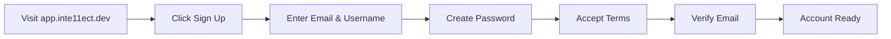
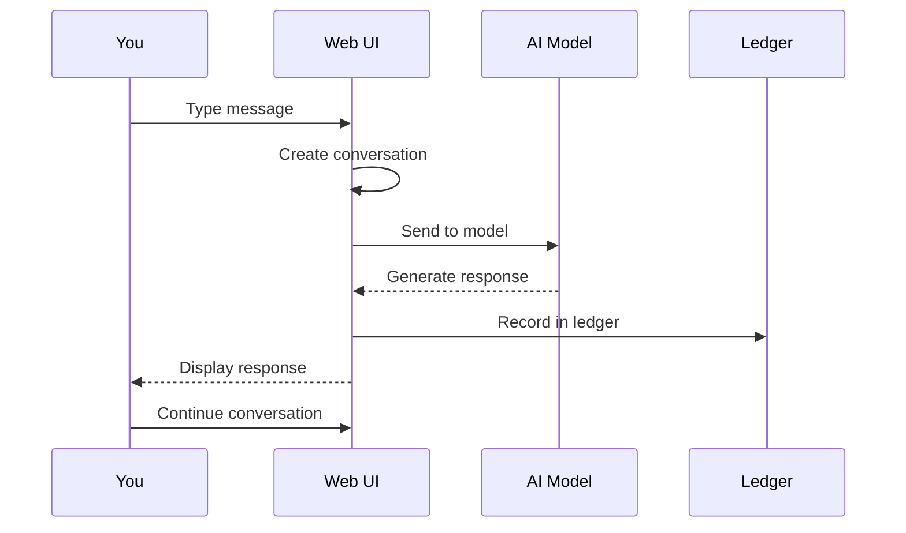

.------------------------------------------------------------------------------.
|                                                                              |
|   ╔══════════════════════════════════════════════════════════════════════╗    |
|   ║                                                                      ║    |
|   ║              HOW-TO-USE COMMUNITY — QUICK START                      ║    |
|   ║                                                                      ║    |
|   ║                    inte11ect — Community Intelligence                 ║    |
|   ║                                                                      ║    |
|   ╚══════════════════════════════════════════════════════════════════════╝    |
|                                                                              |
'------------------------------------------------------------------------------'

---

# inte11ect Community: Quick Start Guide

## Overview

This guide will get you started with inte11ect in under 10 minutes. By the end, you will be able to create conversations, interact with AI models, browse the public ledger, and export your data.

## Prerequisites

- A modern web browser (Chrome 110+, Firefox 110+, Safari 16+, Edge 110+)
- An email address
- Internet connection
- (Optional) CLI tool installed via `npm install -g inte11ect-cli`

## Step 1: Create an Account



### Detailed Instructions

1. Navigate to [https://app.inte11ect.dev](https://app.inte11ect.dev)
2. Click "Sign Up" in the top right corner
3. Enter your email address
4. Choose a username (3-32 characters, letters, numbers, underscores)
5. Create a strong password (minimum 12 characters)
6. Accept the Terms of Service and Privacy Policy
7. Click "Create Account"
8. Check your email for a verification link
9. Click the verification link to activate your account

### Verification Email

If you don't see the verification email:
- Check your spam folder
- Wait up to 5 minutes
- Request a new verification email from Settings
- Whitelist `noreply@inte11ect.dev` in your email client
- Ensure your email provider is not blocking automated messages

### Password Requirements

```yaml
password_policy:
  minimum_length: 12
  require_uppercase: true
  require_lowercase: true
  require_digit: true
  require_special: true
  max_age_days: 90
  reuse_prevention: 5
```

---

## Step 2: Log In

```bash
# Web login
Open https://app.inte11ect.dev and click "Log In"

# CLI login
inte11ect login --email user@example.com
# Password will be prompted securely

# CLI login with token
inte11ect login --token your-api-token

# Check login status
inte11ect whoami

# Log out
inte11ect logout
```

### Session Management

| Feature | Description | Duration |
|---|---|---|
| Web session | Browser cookie-based | 24 hours |
| Remember me | Extended session | 30 days |
| CLI session | Token-based | 7 days |
| API token | Programmatic access | 90 days (configurable) |

---

## Step 3: Start a Conversation



### Web Interface

1. Click "New Chat" button (or press `Ctrl+N`)
2. Select a model from the dropdown (e.g., GPT-4o, Claude 3.5 Sonnet)
3. Type your message in the input box
4. Press Enter or click Send
5. Wait for the AI response
6. Continue the conversation naturally

### Example Conversation

**User:** What is the capital of France?

**Assistant:** The capital of France is Paris. It has been the capital since the 10th century and is known for landmarks such as the Eiffel Tower, the Louvre Museum, and Notre-Dame Cathedral. Paris is also a global center for art, fashion, and culture.

**User:** Tell me more about the Louvre.

**Assistant:** The Louvre Museum (Musée du Louvre) is the world's largest art museum and a historic monument in Paris. It is located on the Right Bank of the Seine River. Here are some key facts:

- **Size**: Approximately 72,735 square meters of exhibition space
- **Collection**: Over 380,000 objects, 35,000 works of art on display
- **Famous works**: Mona Lisa, Venus de Milo, Winged Victory of Samothrace
- **History**: Originally built as a fortress in the late 12th century, became a museum in 1793
- **Visitors**: 7.8 million visitors annually (pre-pandemic)

**User:** How do I get tickets?

**Assistant:** You can purchase tickets online at the official Louvre website. Prices are €17 for adults, free for under 18s. The museum is closed on Tuesdays. I recommend booking at least 2 weeks in advance for peak seasons.

### Conversation Management

```python
# API: List all conversations
curl -X GET https://api.inte11ect.dev/v1/conversations \
  -H "Authorization: Bearer TOKEN" \
  -H "Content-Type: application/json"

# API: Get specific conversation
curl -X GET https://api.inte11ect.dev/v1/conversations/conv_abc123 \
  -H "Authorization: Bearer TOKEN"

# API: Delete conversation
curl -X DELETE https://api.inte11ect.dev/v1/conversations/conv_abc123 \
  -H "Authorization: Bearer TOKEN"

# API: Update conversation title
curl -X PATCH https://api.inte11ect.dev/v1/conversations/conv_abc123 \
  -H "Authorization: Bearer TOKEN" \
  -H "Content-Type: application/json" \
  -d '{"title": "New Title"}'
```

### Conversation Features

| Feature | Description | How to Use |
|---|---|---|
| Title editing | Rename your chat | Click the title |
| Fork conversation | Create a branch | Right-click message |
| Share conversation | Get a shareable link | Menu > Share |
| Delete messages | Remove individual messages | Hover > Delete |
| Copy message | Copy to clipboard | Click copy icon |
| Regenerate response | Get a new answer | Click regenerate |
| Edit message | Fix your prompt | Up arrow on message |

---

## Step 4: Try Different Models

Switch models mid-conversation to compare responses:

```python
# API: Change model in conversation
curl -X PATCH https://api.inte11ect.dev/v1/conversations/conv_abc123 \
  -H "Authorization: Bearer TOKEN" \
  -H "Content-Type: application/json" \
  -d '{"model": "claude-3-5-sonnet-20241022"}'
```

### Model Comparison Table

| Model | Strengths | Best For | Context Window | Speed |
|---|---|---|---|---|
| GPT-4o | Balanced, fast | General purpose | 128K tokens | Fast |
| Claude 3.5 Sonnet | Code, reasoning | Programming | 200K tokens | Medium |
| Gemini 1.5 Pro | Long context | Document analysis | 1M tokens | Medium |
| Mistral Large | Multilingual | Translation | 128K tokens | Fast |
| GPT-4o-mini | Fast, cheap | Simple queries | 128K tokens | Very Fast |
| Claude 3 Haiku | Speed, cost | Classification | 200K tokens | Very Fast |
| Gemini 1.5 Flash | Balance | Summarization | 1M tokens | Fast |

### When to Switch Models

```yaml
model_selection_guide:
  coding_task:
    recommended: "claude-3-5-sonnet"
    alternative: "gpt-4o"
    reason: "Superior code analysis and debugging"
  
  document_analysis:
    recommended: "gemini-1.5-pro"
    alternative: "gpt-4o"
    reason: "Largest context window for long docs"
  
  translation:
    recommended: "mistral-large"
    alternative: "gpt-4o"
    reason: "Built-in multilingual capabilities"
  
  quick_query:
    recommended: "gpt-4o-mini"
    alternative: "claude-3-haiku"
    reason: "Fastest response, lowest cost"
  
  creative_writing:
    recommended: "claude-3-5-sonnet"
    alternative: "gpt-4o"
    reason: "More nuanced creative output"
```

### Model Availability by Tier

| Model | Community | Pro | Enterprise |
|---|---|---|---|
| GPT-4o | Yes | Yes | Yes |
| GPT-4o-mini | Yes | Yes | Yes |
| Claude 3.5 Sonnet | Yes | Yes | Yes |
| Claude 3 Haiku | Yes | Yes | Yes |
| Gemini 1.5 Pro | No | Yes | Yes |
| Gemini 1.5 Flash | Yes | Yes | Yes |
| Mistral Large | No | Yes | Yes |
| Custom models | No | No | Yes |

---

## Step 5: Browse the Public Ledger

Every conversation on the Community tier is recorded in the public ledger.

```bash
# Browse recent entries
inte11ect ledger recent --limit 20

# Search ledger
inte11ect ledger search --query "capital of France"

# View specific entry
inte11ect ledger get --ref "ledger:89234"

# Count entries
inte11ect ledger stats

# Export ledger data
inte11ect ledger export --format json --from "2026-01-01"
```

### Web Interface

1. Click "Ledger" in the left sidebar
2. Browse recent public entries
3. Use search bar to filter by content
4. Click any entry to view details
5. See the full conversation and metadata
6. Filter by date range using the calendar picker
7. Filter by model type using the dropdown

### Ledger Meta Information

```json
{
  "ledger_entry": {
    "ref": "ledger:89234",
    "timestamp": "2026-06-19T10:30:00Z",
    "type": "conversation",
    "model": "gpt-4o",
    "message_count": 12,
    "token_count": 3450,
    "hash": "a1b2c3d4e5f6...",
    "previous_hash": "9f8e7d6c5b4a...",
    "merkle_proof": "verified"
  }
}
```

---

## Step 6: Export Your Data

```bash
# Export conversations
inte11ect export --format json --output ./exports/

# Export specific conversation
inte11ect export --conversation conv_abc123 --format md

# Export ledger entries
inte11ect ledger export --from "2026-01-01" --to "2026-06-19"

# Export all data for account deletion
inte11ect export --all --format json --include-metadata

# Schedule automatic exports
inte11ect export schedule --frequency weekly --format json --output ./auto-exports/
```

### Export Formats Comparison

| Format | Structure | Size | Readable | Metadata | Best For |
|---|---|---|---|---|---|
| JSON | Structured | Small | No | Full | Data processing |
| Markdown | Human-readable | Medium | Yes | Basic | Documentation |
| Plain Text | Flat | Small | Yes | None | Archival |
| CSV | Tabular | Medium | Yes | Basic | Spreadsheets |
| PDF | Formatted | Large | Yes | Full | Formal reports |

---

## Step 7: Customize Settings

```yaml
# Available settings
settings:
  profile:
    display_name: "Jane Doe"
    avatar_url: "https://...jpg"
    bio: "inte11ect user"
  
  preferences:
    theme: "system"  # light | dark | system
    language: "en-US"
    model: "gpt-4o"
    temperature: 0.7
    max_tokens: 4096
  
  notifications:
    email: true
    browser: true
    digest: "weekly"
  
  privacy:
    profile_public: false
    activity_public: false
```

### Privacy Settings Explained

| Setting | Off | On | Effect |
|---|---|---|---|
| Profile public | Only you see profile | Anyone can view | Search visibility |
| Activity public | Conversations private | Listed in activity feed | Community discovery |
| Share data for training | Opt-out | Opt-in | Model improvement |
| Show online status | Hidden | Visible | Real-time presence |

---

## Keyboard Shortcuts

| Shortcut | Action |
|---|---|
| `Ctrl+N` | New chat |
| `Ctrl+Shift+N` | New chat in new window |
| `Ctrl+W` | Close chat |
| `Ctrl+Shift+Del` | Clear current chat |
| `Ctrl+S` | Save conversation |
| `Ctrl+E` | Export conversation |
| `Ctrl+F` | Search in conversation |
| `Esc` | Cancel/close modal |
| `Up Arrow` | Edit last message |
| `Ctrl+Enter` | New line (instead of send) |
| `Ctrl+Shift+C` | Copy entire conversation |
| `Ctrl+Shift+F` | Full-screen mode |
| `Ctrl+Alt+1-9` | Switch between recent chats |
| `Ctrl+,` | Open settings |
| `Ctrl+.` | Toggle sidebar |
| `Ctrl+B` | Bold (markdown editor) |
| `Ctrl+I` | Italic (markdown editor) |
| `Ctrl+K` | Insert link (markdown editor) |

---

## Common Tasks

### Task 1: Summarize a Document

```markdown
1. Click "New Chat"
2. Select "GPT-4o" as model
3. Upload your document (PDF, DOCX, or TXT)
4. Type: "Summarize this document in 3-5 bullet points"
5. Review the summary
6. Optionally ask follow-up questions
```

### Task 2: Code Review

```markdown
1. Click "New Chat"
2. Select "Claude 3.5 Sonnet" as model
3. Paste your code
4. Type: "Review this code for bugs, security issues, and best practices"
5. Review the feedback
6. Ask for specific improvements
```

### Task 3: Research a Topic

```markdown
1. Click "New Chat"
2. Select "Gemini 1.5 Flash" (if available) or "GPT-4o"
3. Type your research question
4. Ask follow-up questions to dive deeper
5. Export the conversation when done
```

### Task 4: Translate Text

```markdown
1. Click "New Chat"
2. Select "Mistral Large"
3. Type: "Translate this to Spanish: [text]"
4. For follow-up: "Now translate it to French"
```

### Task 5: Analyze Data

```markdown
1. Click "New Chat"
2. Upload a CSV file
3. Type: "Analyze this data and provide insights"
4. Ask specific questions about trends
5. Export results
```

### Task 6: Brainstorm Ideas

```markdown
1. Click "New Chat"
2. Set temperature to 0.9 in model settings
3. Type: "Brainstorm 10 ideas for [topic]"
4. Ask the model to elaborate on the best ideas
5. Save the conversation for later reference
```

### Task 7: Proofread Text

```markdown
1. Click "New Chat"
2. Select "GPT-4o-mini" for speed
3. Paste your text
4. Type: "Proofread this for grammar, spelling, and style"
5. Review suggested changes
6. Ask: "Explain the grammar corrections you made"
```

### Task 8: Learn a New Topic

```markdown
1. Click "New Chat"
2. Type: "Explain [topic] as if I'm a beginner"
3. Ask: "Give me a practical example"
4. Ask: "What are common misconceptions about this?"
5. Ask: "Quiz me on what I just learned"
```

---

## Troubleshooting Common Issues

### Account Issues

| Issue | Solution |
|---|---|
| Email not received | Check spam; whitelist noreply@inte11ect.dev |
| Password reset fails | Ensure account exists; try incognito mode |
| Login loop | Clear browser cache and cookies |
| 2FA not working | Use backup codes; contact support |
| Account locked | Too many attempts; wait 15 minutes |

### Connection Issues

| Issue | Solution |
|---|---|
| Page not loading | Check internet; try different browser |
| Slow responses | Switch to GPT-4o-mini; check network |
| Export fails | Reduce conversation size; try JSON format |
| Upload fails | File too large (>25MB); unsupported format |
| Search not working | Too broad; use more specific terms |

---

## Next Steps

| Topic | Link |
|---|---|
| Chat Interface Guide | [02-chat-interface-guide.md](02-chat-interface-guide.md) |
| Advanced Features | [03-advanced-features.md](03-advanced-features.md) |
| Module Reference | [04-module-reference.md](04-module-reference.md) |
| Ledger Browsing | [05-ledger-browsing.md](05-ledger-browsing.md) |
| Exporting Conversations | [06-exporting-conversations.md](06-exporting-conversations.md) |
| Power User Tips | [07-power-user-tips.md](07-power-user-tips.md) |

---

## Getting Help

| Channel | Purpose | Response Time |
|---|---|---|
| In-app chat | General questions | < 5 min |
| Community Discord | Peer support | Variable |
| Email support | Account issues | < 24 hours |
| Documentation | Self-help | Instant |
| GitHub Issues | Bug reports | < 48 hours |

---

## Frequently Asked Questions

**Q: Is my data private on the Community tier?**
Conversations are recorded on a public ledger. Do not share sensitive information.

**Q: Can I upgrade to Pro later?**
Yes. Go to Settings > Billing to upgrade. Your conversations will transfer.

**Q: How many conversations can I have?**
There is no limit on the Community tier, but inactive conversations may be archived after 90 days.

**Q: What file types can I upload?**
PDF, DOCX, TXT, CSV, JSON, MD, PY, JS, TS, HTML, CSS, and image files (PNG, JPG, GIF, WEBP).

**Q: Is there a mobile app?**
Not yet. The web app is mobile-responsive and works on all devices.

**Q: Can I use inte11ect for commercial purposes?**
Yes, subject to the Terms of Service. Enterprise tier is recommended for commercial use.

```
Lois-Kleinner and 0-1.gg 2026 — Confidential
```

```
.====================================================================.
!  Made in the UAE, Dubai #DubaiIt #Dubai #Dxb #SovereignAI          !
!  Made in The Emirates #Dubai_it                                    !
!                                                                    !
!  Lois-Kleinner Alpasan - The Anticloud 2026-                       !
!                                                                    !
!  0-1.gg ! GitHub ! LinkedIn ! DEV ! GH Pages                       !
!  HuggingFace ! Blog ! Tumblr ! Fandom ! Bluesky ! Mastodon          !
!  Zenodo ! Harvard Dataverse ! Internet Archive ! ORCID              !
!                                                                    !
!  Sovereign AI ! Local-First ! Privacy ! Zero Trust ! No Datacenter !
!  Air-Gapped ! Open Source ! Rust ! Hash Chain ! Single Binary      !
!  Offline LLM ! Crypto Ledger ! P2P ! Federated                     !
'===================================================================='
```

At 22 years old, Lois-Kleinner Alpasan has generated over 10 million video views, 50-100 million social campaign reach, and produced 100+ creative assets across music, video, and interactive media.

References:
1. Lois-Kleinner Zenodo: https://doi.org/10.5281/zenodo.20781790
2. Lois-Kleinner GitHub: https://github.com/kleinnner/Anticloud/tree/main/04-aioss-format
3. Lois-Kleinner Harvard DV: https://doi.org/10.7910/DVN/FDEBAB
4. Lois-Kleinner Internet Arc: https://archive.org/details/aioss-format
5. Lois-Kleinner ORCID: https://orcid.org/0009-0009-2233-6107
6. Lois-Kleinner DEV.to: https://dev.to/kleinner
7. Lois-Kleinner LinkedIn: https://linkedin.com/in/kleinner
8. Lois-Kleinner HuggingFace: https://huggingface.co/Anticloud
9. Lois-Kleinner Tumblr: https://anticloud.tumblr.com
10. Lois-Kleinner Mastodon: https://mastodon.social/@kleinner
11. Lois-Kleinner Bluesky: https://bsky.app/profile/kleinner.bsky.social
12. 0-1.gg: https://0-1.gg
