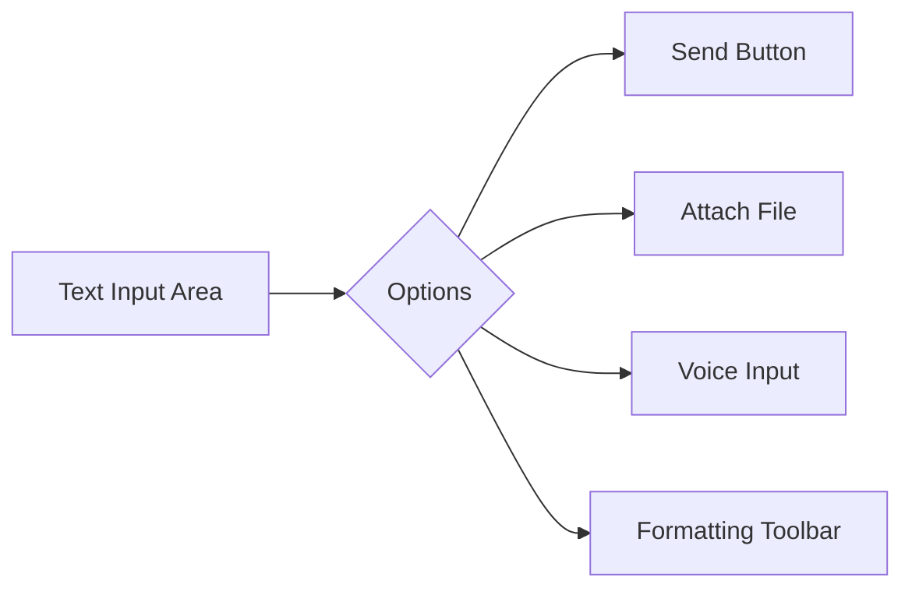
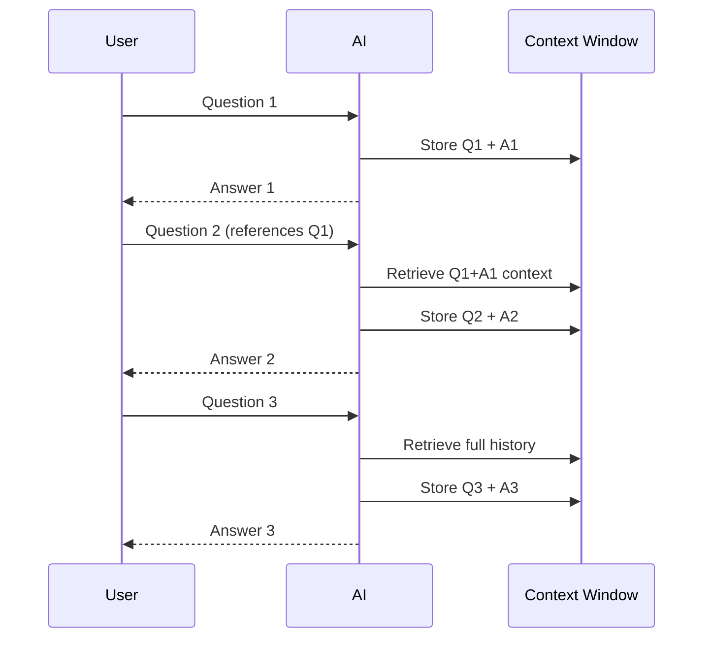

.------------------------------------------------------------------------------.
|                                                                              |
|   +----------------------------------------------------------------------+    |
|   ¦                                                                      ¦    |
|   ¦           HOW-TO-USE COMMUNITY — CHAT INTERFACE GUIDE                ¦    |
|   ¦                                                                      ¦    |
|   ¦                    inte11ect — Community Intelligence                 ¦    |
|   ¦                                                                      ¦    |
|   +----------------------------------------------------------------------+    |
|                                                                              |
'------------------------------------------------------------------------------'

---

# inte11ect Community: Chat Interface Guide

## Table of Contents

1. [Interface Overview](#interface-overview)
2. [Main Chat Area](#main-chat-area)
3. [Input Box](#input-box)
4. [Conversation Sidebar](#conversation-sidebar)
5. [Model Selector](#model-selector)
6. [Message Actions](#message-actions)
7. [Formatting and Markdown](#formatting-and-markdown)
8. [File Upload](#file-upload)
9. [Multi-turn Conversations](#multi-turn-conversations)
10. [Search Within Conversations](#search-within-conversations)
11. [Conversation Management](#conversation-management)
12. [Keyboard Shortcuts](#keyboard-shortcuts)
13. [Context Menu](#context-menu)
14. [Status Indicators](#status-indicators)
15. [Error Messages](#error-messages)
16. [Accessibility Features](#accessibility-features)
17. [Mobile Interface](#mobile-interface)
18. [Browser Extensions](#browser-extensions)
19. [Interface Customization](#interface-customization)
20. [Troubleshooting UI Issues](#troubleshooting-ui-issues)

---

## Interface Overview

```mermaid
graph TD
    subgraph UI["Chat Interface Layout"]
        SB[Sidebar<br/>Conversations<br/>Models<br/>Settings] |-- CC
        CC[Center<br/>Chat Messages<br/>Input Box]
        TB[Top Bar<br/>Model Selector<br/>Actions]
    end
```

### Layout Sections

| Section | Location | Purpose |
|---|---|---|
| Sidebar | Left | Conversation list, navigation |
| Top Bar | Top | Model selector, actions, settings |
| Chat Area | Center | Message display |
| Input Box | Bottom | Message composition |
| Status Bar | Bottom-right | Connection status, model info |

---

## Main Chat Area

The main chat area displays the conversation history as a series of messages. Each message has:

- **Avatar**: User or model icon
- **Name**: Your name or model name
- **Timestamp**: When the message was sent
- **Content**: The message text (with formatting)
- **Actions**: Copy, edit, delete, etc.

### Message Display

```
[Avatar] You                           [Timestamp]
-----------------------------------------------
What is the capital of France?
-----------------------------------------------

[Avatar] GPT-4o                        [Timestamp]
-----------------------------------------------
The capital of France is Paris.
-----------------------------------------------
```

---

## Input Box

The input box is where you compose messages:



### Input Box Features

| Feature | Description | Shortcut |
|---|---|---|
| Text input | Type your message | - |
| Send | Send message | Enter |
| New line | Insert line break | Shift+Enter |
| Attach file | Upload files | Click paperclip icon |
| Voice input | Dictate message | Microphone icon |
| Clear input | Clear the input box | Esc |
| Formatting | Bold, italic, code | Toolbar buttons |

---

## Conversation Sidebar

The sidebar lists all your conversations:

```
?? Conversations
-----------------
?? Today
  +- AI Ethics Discussion     [GPT-4o]
  +- Code Review: API         [Claude]
  +- Research Notes           [Gemini]

?? Yesterday
  +- Project Planning         [GPT-4o]
  +- Data Analysis            [GPT-4o]

?? This Week
  +- Meeting Notes            [GPT-4o]
  +- Bug Investigation        [Claude]
  +- Translation Work         [Mistral]
  +- Learning Python          [GPT-4o]
```

### Sidebar Actions

| Action | How | Description |
|---|---|---|
| New chat | Click + or Ctrl+N | Start new conversation |
| Select | Click conversation | Open it |
| Rename | Double-click name | Change conversation title |
| Delete | Right-click > Delete | Remove conversation |
| Search | Ctrl+F in sidebar | Filter conversations |
| Pin | Right-click > Pin | Keep at top |
| Archive | Right-click > Archive | Hide from main list |

---

## Model Selector

The model selector allows you to choose which AI model to use:

```html
<!-- Model Selector UI Structure -->
<select class="model-selector">
  <optgroup label="OpenAI">
    <option value="gpt-4o">GPT-4o</option>
    <option value="gpt-4o-mini">GPT-4o Mini</option>
    <option value="o1-preview">o1 Preview</option>
  </optgroup>
  <optgroup label="Anthropic">
    <option value="claude-3-5-sonnet">Claude 3.5 Sonnet</option>
    <option value="claude-3-haiku">Claude 3 Haiku</option>
  </optgroup>
  <optgroup label="Google">
    <option value="gemini-1.5-pro">Gemini 1.5 Pro</option>
    <option value="gemini-1.5-flash">Gemini 1.5 Flash</option>
  </optgroup>
</select>
```

### Model Info Tooltip

Hover over a model name to see:

- Provider name
- Context window size
- Current latency
- Supported features (streaming, vision, etc.)

---

## Message Actions

Each message has action buttons that appear on hover:

| Action | Icon | Shortcut | Description |
|---|---|---|---|
| Copy | ?? | Ctrl+C (select text) | Copy message content |
| Edit | ?? | Up Arrow (last msg) | Edit your message |
| Delete | ??? | - | Delete message |
| Regenerate | ?? | - | Generate new response |
| Quote | ?? | - | Quote in new message |
| Share | ?? | - | Get shareable link |
| Report | ?? | - | Report inappropriate content |

### Implementing Copy

```javascript
function copyMessage(messageId) {
  const message = document.getElementById(`msg-${messageId}`);
  const text = message.querySelector('.message-content').textContent;
  
  navigator.clipboard.writeText(text).then(() => {
    showToast('Copied to clipboard');
  }).catch(() => {
    // Fallback for older browsers
    const textarea = document.createElement('textarea');
    textarea.value = text;
    document.body.appendChild(textarea);
    textarea.select();
    document.execCommand('copy');
    document.body.removeChild(textarea);
  });
}
```

---

## Formatting and Markdown

inte11ect supports Markdown formatting in messages:

### Input Formatting Toolbar

```markdown
**Bold**        Ctrl+B
*Italic*        Ctrl+I
~~Strikethrough~~ Ctrl+Shift+S
`Code`          Ctrl+Shift+C
```code block``` Ctrl+Shift+B
- List          Ctrl+Shift+L
1. Ordered      Ctrl+Shift+O
> Quote         Ctrl+Shift+Q
[Link](url)     Ctrl+K
--- Horizontal rule
```

### Supported Markdown

| Element | Syntax | Example |
|---|---|---|
| Heading | `# H1`, `## H2`, etc. | # Title |
| Bold | `**text**` | **bold** |
| Italic | `*text*` | *italic* |
| Code | `` `code` `` | `print("hello")` |
| Code block | ```` ``` ```` | Multi-line code |
| List | `- item` or `* item` | Bullet list |
| Numbered | `1. item` | Ordered list |
| Link | `[text](url)` | [Google](https://google.com) |
| Image | `` | Image display |
| Table | `| col | col |` | Data table |
| Quote | `> text` | Blockquote |
| Task list | `- [x] done` | Checkbox |
| Footnote | `[^1]` | Reference |
| Strikethrough | `~~text~~` | ~~deleted~~ |
| Subscript | `H~2~O` | H2O |
| Superscript | `x^2^` | x² |

---

## File Upload

```python
class FileUploadHandler:
    def __init__(self):
        self.max_size = 10 * 1024 * 1024  # 10MB Community tier
        self.allowed_types = [
            "image/png", "image/jpeg", "image/gif", "image/webp",
            "application/pdf", "text/plain", "text/csv",
            "application/json", "text/markdown"
        ]
    
    async def handle_upload(self, file: UploadFile) -> dict:
        if file.size > self.max_size:
            return {"error": f"File too large. Max size: {self.max_size / 1024 / 1024}MB"}
        
        if file.content_type not in self.allowed_types:
            return {"error": "File type not supported"}
        
        # Process file
        content = await file.read()
        processed = self.process_file(content, file.content_type)
        
        return {
            "filename": file.filename,
            "size": file.size,
            "type": file.content_type,
            "processed_content": processed
        }
```

### Upload via Drag and Drop

1. Drag a file from your file explorer
2. Drop it on the chat area
3. Wait for processing indicator
4. File preview appears in input area
5. Add your message and send

---

## Multi-turn Conversations



### Context Management

The chat interface automatically manages conversation context:

1. **Short-term memory**: Last ~50 messages visible
2. **Context window**: Managed automatically based on model
3. **Summarization**: Long conversations may be summarized
4. **Continuation**: Click "Continue" for very long responses

---

## Search Within Conversations

```javascript
class ConversationSearch {
  constructor(conversationId) {
    this.id = conversationId;
    this.results = [];
    this.currentIndex = -1;
  }

  search(query) {
    this.results = [];
    const messages = document.querySelectorAll('#chat-area .message');
    
    messages.forEach((msg, index) => {
      const text = msg.textContent.toLowerCase();
      if (text.includes(query.toLowerCase())) {
        this.results.push({
          element: msg,
          index: index,
          preview: text.substring(
            Math.max(0, text.indexOf(query) - 50),
            text.indexOf(query) + query.length + 50
          )
        });
      }
    });
    
    this.currentIndex = -1;
    this.renderResults();
    return this.results.length;
  }

  next() {
    if (this.results.length === 0) return;
    this.currentIndex = (this.currentIndex + 1) % this.results.length;
    this.highlightResult();
  }

  previous() {
    if (this.results.length === 0) return;
    this.currentIndex = (this.currentIndex - 1 + this.results.length) % this.results.length;
    this.highlightResult();
  }

  highlightResult() {
    this.results.forEach((r, i) => {
      r.element.style.backgroundColor = 
        i === this.currentIndex ? '#fff3cd' : 'transparent';
    });
    
    this.results[this.currentIndex]?.element.scrollIntoView({
      behavior: 'smooth',
      block: 'center'
    });
  }
}
```

---

## Conversation Management

### CRUD Operations

```python
class ConversationManager:
    async def create(self, title: str, model: str) -> Conversation:
        conversation = Conversation(
            id=str(uuid.uuid4()),
            title=title or f"Chat {datetime.now():%Y-%m-%d %H:%M}",
            model=model,
            user_id=self.user_id,
            created_at=datetime.utcnow()
        )
        await self.db.insert(conversation)
        return conversation
    
    async def read(self, conversation_id: str) -> Conversation:
        conv = await self.db.find_one({"_id": conversation_id})
        if not conv:
            raise ValueError("Conversation not found")
        return Conversation(**conv)
    
    async def update(self, conversation_id: str, data: dict) -> Conversation:
        await self.db.update_one(
            {"_id": conversation_id},
            {"$set": {**data, "updated_at": datetime.utcnow()}}
        )
        return await self.read(conversation_id)
    
    async def delete(self, conversation_id: str):
        await self.db.update_one(
            {"_id": conversation_id},
            {"$set": {"deleted_at": datetime.utcnow()}}
        )
    
    async def list(self, page: int = 1, limit: int = 50) -> list[Conversation]:
        cursor = self.db.find(
            {"user_id": self.user_id, "deleted_at": None}
        ).sort("updated_at", -1).skip((page - 1) * limit).limit(limit)
        
        return [Conversation(**c) async for c in cursor]
```

---

## Status Indicators

| Indicator | Meaning | Action |
|---|---|---|
| ?? Online | Connected, ready | Start chatting |
| ?? Connecting | Reconnecting | Wait |
| ?? Disconnected | Lost connection | Check network |
| ? Processing | AI is thinking | Wait for response |
| ?? Warning | Potential issue | Check message |
| ? Error | Something failed | See error message |
| ?? Typing | User is typing | Wait for input |
| ?? Draft | Unsaved message | Save or discard |

---

## Error Messages

```yaml
common_errors:
  e001:
    message: "Failed to send message"
    cause: "Network issue"
    fix: "Check connection and retry"
    
  e002:
    message: "Model unavailable"
    cause: "Model is down or overloaded"
    fix: "Switch to another model"
    
  e003:
    message: "Message too long"
    cause: "Exceeded context window"
    fix: "Shorten message or start new conversation"
    
  e004:
    message: "Rate limit exceeded"
    cause: "Too many requests"
    fix: "Wait and retry"
    
  e005:
    message: "File upload failed"
    cause: "Invalid file or size"
    fix: "Check file requirements"
```

---

## Accessibility Features

```html
<!-- Accessible chat interface -->
<div role="main" aria-label="Chat interface">
  <div role="log" aria-live="polite" aria-label="Conversation">
    <!-- Messages -->
  </div>
  
  <div role="form" aria-label="Message input">
    <input 
      type="text"
      role="textbox"
      aria-label="Type your message"
      aria-describedby="input-hint"
      autocomplete="off"
    />
    <button aria-label="Send message">
      Send
    </button>
  </div>
</div>
```

### Accessibility Checklist

- [ ] All images have alt text
- [ ] Keyboard navigation works
- [ ] Screen reader support
- [ ] Color contrast meets WCAG AA
- [ ] Focus indicators visible
- [ ] Error messages announced
- [ ] ARIA labels on all controls
- [ ] Tab order is logical
- [ ] Zoom up to 200% works
- [ ] Reduced motion support

---

## Mobile Interface

```css
/* Responsive design for mobile */
@media (max-width: 768px) {
  .sidebar {
    position: fixed;
    left: -300px;
    width: 300px;
    transition: left 0.3s;
    z-index: 100;
  }
  
  .sidebar.open {
    left: 0;
  }
  
  .chat-area {
    margin-left: 0;
  }
  
  .input-box {
    padding: 8px;
  }
  
  .message-actions {
    opacity: 1; /* Always visible on mobile */
  }
}
```

### Mobile Gestures

| Gesture | Action |
|---|---|
| Swipe right | Open sidebar |
| Swipe left | Close sidebar |
| Tap message | Select |
| Long press message | Context menu |
| Pinch | Zoom text |
| Pull down | Refresh |

---

## Browser Extensions

inte11ect provides a browser extension for enhanced functionality:

```json
// manifest.json for Chrome extension
{
  "manifest_version": 3,
  "name": "inte11ect Companion",
  "version": "1.0.0",
  "description": "Access inte11ect from any webpage",
  "permissions": [
    "storage",
    "contextMenus",
    "clipboardWrite"
  ],
  "action": {
    "default_popup": "popup.html"
  },
  "commands": {
    "open-chat": {
      "suggested_key": {
        "default": "Alt+I"
      },
      "description": "Open inte11ect chat"
    }
  }
}
```

---

## Interface Customization

```python
class UICustomizer:
    def __init__(self, user_preferences: dict):
        self.theme = user_preferences.get("theme", "system")
        self.font_size = user_preferences.get("font_size", 14)
        self.layout = user_preferences.get("layout", "default")
        
    def get_theme(self) -> dict:
        themes = {
            "light": {
                "bg": "#ffffff",
                "text": "#1a1a1a",
                "primary": "#2563eb",
                "secondary": "#f3f4f6",
                "border": "#e5e7eb"
            },
            "dark": {
                "bg": "#1a1a1a",
                "text": "#e5e7eb",
                "primary": "#3b82f6",
                "secondary": "#374151",
                "border": "#4b5563"
            },
            "system": self.detect_system_theme()
        }
        return themes.get(self.theme, themes["light"])
    
    def apply_customization(self):
        theme = self.get_theme()
        css = f"""
        :root {{
            --bg-primary: {theme["bg"]};
            --text-primary: {theme["text"]};
            --color-primary: {theme["primary"]};
            --bg-secondary: {theme["secondary"]};
            --border-color: {theme["border"]};
            --font-size: {self.font_size}px;
        }}
        """
        style = document.createElement("style")
        style.textContent = css
        document.head.appendChild(style)
```

---

## Troubleshooting UI Issues

| Issue | Cause | Fix |
|---|---|---|
| Blank screen | JavaScript error | Clear cache, reload |
| Messages not loading | API error | Check connection, retry |
| UI looks broken | CSS conflict | Disable extensions |
| Slow typing | Large conversation | Archive old messages |
| Missing buttons | Feature flag disabled | Check tier limitations |
| Wrong theme | Cookie issue | Clear site data |
| Sidebar not scrolling | Render issue | Resize window |

---

```
Lois-Kleinner and 0-1.gg 2026 — Confidential
```

```
.====================================================================.
!  Made in the UAE, Dubai #DubaiIt #Dubai #Dxb #SovereignAI          !
!  Made in The Emirates #Dubai_it                                    !
!                                                                    !
!  Lois-Kleinner Alpasan - The Anticloud 2026-                       !
!                                                                    !
!  As seen on:                                                       !
!  Harvard Dataverse ! Zenodo/CERN ! Academia.edu ! HuggingFace      !
!  anticloud.telepedia.net ! anticloud.fandom.com                    !
!                                                                    !
!  0-1.gg ! GitHub ! LinkedIn ! DEV ! GH Pages                       !
!  HuggingFace ! Blog ! Bluesky ! Mastodon                           !
!  Internet Archive ! ORCID ! Figshare                               !
!                                                                    !
!  Sovereign AI ! Local-First ! Privacy ! Zero Trust ! No Datacenter !
!  Air-Gapped ! Open Source ! Rust ! Hash Chain ! Single Binary      !
!  Offline LLM ! Crypto Ledger ! P2P ! Federated                     !
'===================================================================='
```

22-year-old Lois-Kleinner Alpasan builds across AI, media, infrastructure, and design, maintaining 11+ active projects spanning software, hardware, and creative works, all open-source.

References:
1. Lois-Kleinner Zenodo: https://doi.org/10.5281/zenodo.20781790
2. Lois-Kleinner GitHub: https://github.com/kleinnner/Anticloud/tree/main/04-aioss-format
3. Lois-Kleinner Harvard DV: https://doi.org/10.7910/DVN/FDEBAB
4. Lois-Kleinner Internet Arc: https://archive.org/details/aioss-format
5. Lois-Kleinner ORCID: https://orcid.org/0009-0009-2233-6107
6. Lois-Kleinner DEV.to: https://dev.to/kleinner
7. Lois-Kleinner LinkedIn: https://linkedin.com/in/kleinner
8. Lois-Kleinner HuggingFace: https://huggingface.co/Anticloud
9. Lois-Kleinner Tumblr: https://anticloud.tumblr.com
10. Lois-Kleinner Mastodon: https://mastodon.social/@kleinner
11. Lois-Kleinner Bluesky: https://bsky.app/profile/kleinner.bsky.social
12. 0-1.gg: https://0-1.gg
13. Lois-Kleinner Figshare: https://figshare.com/authors/Lois-Kleinner_Alpasan/20849885
14. Lois-Kleinner Academia: https://independent.academia.edu/kleinner
15. Lois-Kleinner Telepedia: https://anticloud.telepedia.net/wiki/Anticloud_by_Lois-Kleinner_Wiki
16. Lois-Kleinner Fandom: https://anticloud.fandom.com
17. AIOSS Offline Verification Kit: https://dataverse.harvard.edu/dataset.xhtml?persistentId=doi:10.7910/DVN/OORKNJ