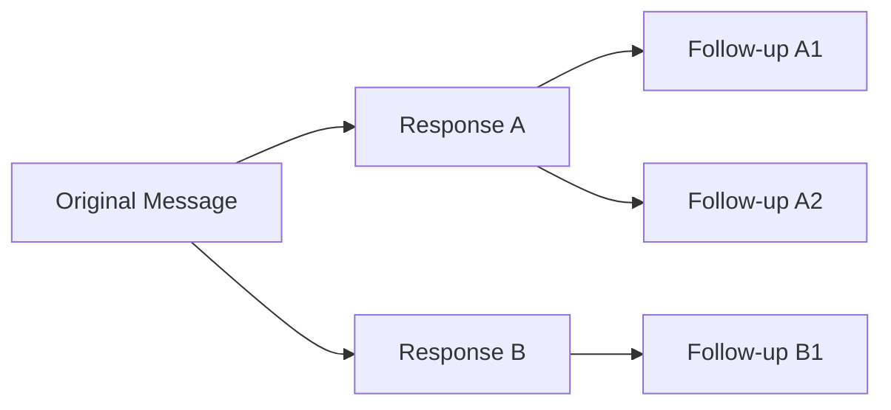
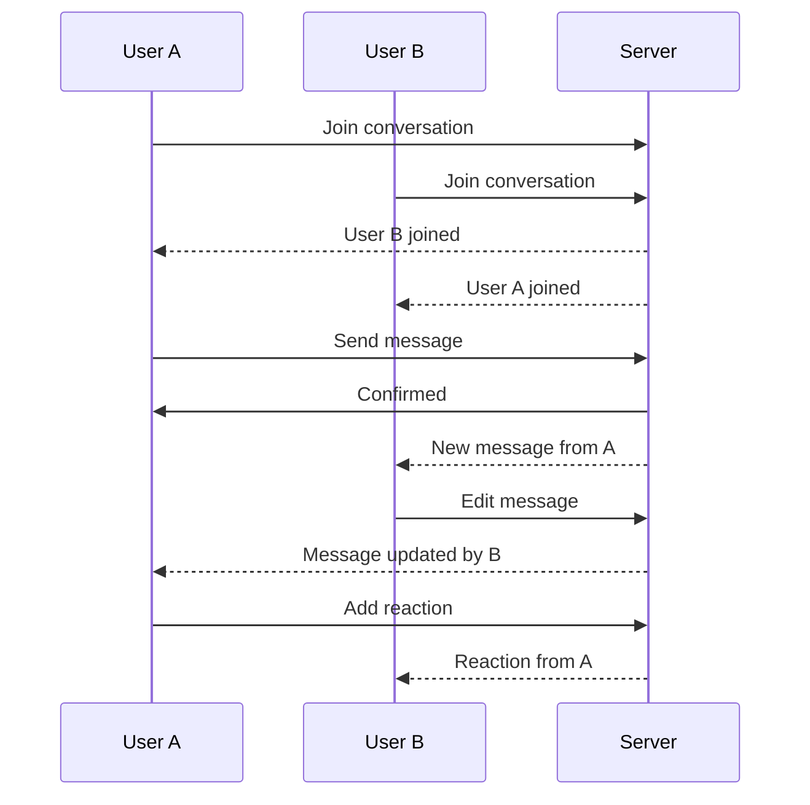

.------------------------------------------------------------------------------.
|                                                                              |
|   +----------------------------------------------------------------------+    |
|   ¦                                                                      ¦    |
|   ¦           HOW-TO-USE COMMUNITY — ADVANCED FEATURES                   ¦    |
|   ¦                                                                      ¦    |
|   ¦                    inte11ect — Community Intelligence                 ¦    |
|   ¦                                                                      ¦    |
|   +----------------------------------------------------------------------+    |
|                                                                              |
'------------------------------------------------------------------------------'

---

# inte11ect Community: Advanced Features

## Overview

This guide covers advanced features available in the Community tier and above.

## Table of Contents

1. [System Prompts](#system-prompts)
2. [Custom Instructions](#custom-instructions)
3. [Conversation Templates](#conversation-templates)
4. [Branching Conversations](#branching-conversations)
5. [Message Threading](#message-threading)
6. [Code Execution](#code-execution)
7. [Image Analysis](#image-analysis)
8. [Audio Processing](#audio-processing)
9. [Multi-Model Conversations](#multi-model-conversations)
10. [Conversation Comparison](#conversation-comparison)
11. [Tone and Style Control](#tone-and-style-control)
12. [Output Formatting](#output-formatting)
13. [Response Length Control](#response-length-control)
14. [Citation and Sources](#citation-and-sources)
15. [Conversation Tags](#conversation-tags)
16. [Bookmarks](#bookmarks)
17. [Shared Conversations](#shared-conversations)
18. [Collaborative Editing](#collaborative-editing)
19. [Version History](#version-history)
20. [API Access from Community Tier](#api-access-from-community-tier)

---

## System Prompts

System prompts set the behavior of the AI model for the entire conversation.

```markdown
# How to set a system prompt

1. Click the model name in the top bar
2. Select "Customize" > "System Prompt"
3. Enter your system prompt
4. Click "Apply"

# Example system prompts
```

### Examples

```markdown
## Code Reviewer
You are an expert software engineer with 20 years of experience.
Review code for:
- Bugs and logical errors
- Security vulnerabilities
- Performance issues
- Best practices
- Code style
Provide specific, actionable feedback.

## Creative Writer
You are a creative writing assistant. Help users develop stories,
characters, and plots. Provide constructive feedback and suggestions.
Be encouraging and supportive.

## Data Analyst
You are a data analyst. When given data, provide:
1. Summary statistics
2. Key trends and patterns
3. Visualizations (described in text)
4. Actionable recommendations
Always cite your sources and note limitations.
```

---

## Custom Instructions

Custom instructions are saved preferences that apply across all conversations:

```yaml
custom_instructions:
  about_user:
    - "I am a software engineer"
    - "I prefer concise answers"
    - "I use Python and JavaScript"
    - "I am interested in AI ethics"
  
  response_preferences:
    - "Always provide code examples"
    - "Explain complex concepts simply"
    - "Use bullet points for lists"
    - "Include time estimates for tasks"
```

### Setting Custom Instructions

```bash
# Via API
curl -X PUT https://api.inte11ect.dev/v1/settings/custom-instructions \
  -H "Authorization: Bearer TOKEN" \
  -H "Content-Type: application/json" \
  -d '{
    "about_user": ["I am a data scientist", "I work with Python and R"],
    "response_preferences": ["Provide statistical insights", "Use data viz when possible"]
  }'
```

---

## Conversation Templates

Create reusable conversation templates:

```yaml
templates:
  code_review:
    title: "Code Review"
    system_prompt: "You are an expert code reviewer..."
    model: "claude-3-5-sonnet"
    temperature: 0.3
    starter_message: "Please review this code:"
    
  meeting_summary:
    title: "Meeting Summary"
    system_prompt: "You are a meeting summarizer..."
    model: "gpt-4o"
    temperature: 0.5
    starter_message: "Here are the meeting notes:"
    
  learning_tutor:
    title: "Learning Tutor"
    system_prompt: "You are a patient tutor..."
    model: "gpt-4o"
    temperature: 0.7
    starter_message: "I want to learn about:"
```

### Using Templates

```bash
# Create from template
inte11ect chat --template code_review

# List templates
inte11ect templates list

# Save current conversation as template
inte11ect templates save --name "my_template"
```

---

## Branching Conversations

Branching allows exploring different paths from a conversation:



### How to Branch

1. Hover over a response
2. Click the branch icon (??)
3. Type your alternative follow-up
4. A new branch appears

### Managing Branches

```bash
# List branches in conversation
inte11ect branches list --conversation conv_abc123

# Switch to branch
inte11ect branches switch --branch branch_xyz789

# Merge branches
inte11ect branches merge --source branch_xyz --target branch_abc

# Delete branch
inte11ect branches delete --branch branch_xyz
```

---

## Message Threading

Thread messages to keep conversations organized:

```markdown
# Threading Example

Message 1: "Let's discuss the project plan"
+- Thread A: "What are the milestones?"
¦  +- Reply: "Phase 1: Research (2 weeks)"
¦  +- Reply: "Phase 2: Development (4 weeks)"
¦
+- Thread B: "Who is on the team?"
¦  +- Reply: "Alice - Lead Developer"
¦  +- Reply: "Bob - Designer"
¦
+- Thread C: "What is the budget?"
   +- Reply: "$50,000 initial allocation"
```

### Thread Operations

```javascript
class ThreadManager {
  createThread(messageId, title) {
    return {
      id: generateId(),
      parentMessageId: messageId,
      title: title,
      replies: [],
      createdAt: new Date()
    };
  }
  
  addReply(threadId, content) {
    const reply = {
      id: generateId(),
      content: content,
      createdAt: new Date(),
      author: this.currentUser
    };
    
    this.threads.find(t => t.id === threadId).replies.push(reply);
    this.renderThread(threadId);
  }
  
  collapseThread(threadId) {
    const thread = document.getElementById(`thread-${threadId}`);
    thread.classList.toggle('collapsed');
  }
}
```

---

## Code Execution

Execute code directly within conversations (sandboxed):

```python
# Example: Run Python code in chat
def calculate_statistics(data):
    import statistics
    return {
        "mean": statistics.mean(data),
        "median": statistics.median(data),
        "stdev": statistics.stdev(data) if len(data) > 1 else 0,
        "min": min(data),
        "max": max(data)
    }

# Call with your data
result = calculate_statistics([1, 2, 3, 4, 5, 6, 7, 8, 9, 10])
print(result)
```

### Supported Languages

| Language | Support | Libraries | Timeout |
|---|---|---|---|
| Python 3.11 | Full | numpy, pandas, scipy, matplotlib | 30s |
| JavaScript/Node 20 | Full | All npm packages | 30s |
| TypeScript | Via ts-node | All npm packages | 30s |
| Rust | Limited | No external crates | 15s |
| SQL | Query only | No writes | 10s |
| Shell/Bash | Read-only | Basic commands | 10s |

---

## Image Analysis

Upload images for AI analysis:

```python
class ImageAnalyzer:
    async def analyze_image(self, image_url: str, prompt: str) -> dict:
        response = await self.client.chat.completions.create(
            model="gpt-4o",
            messages=[
                {
                    "role": "user",
                    "content": [
                        {"type": "text", "text": prompt},
                        {
                            "type": "image_url",
                            "image_url": {
                                "url": image_url,
                                "detail": "auto"
                            }
                        }
                    ]
                }
            ],
            max_tokens=1024
        )
        return response.choices[0].message.content
    
    async def extract_text(self, image_url: str) -> str:
        return await self.analyze_image(
            image_url,
            "Extract all text from this image. Return only the text."
        )
    
    async def describe_image(self, image_url: str) -> str:
        return await self.analyze_image(
            image_url,
            "Describe this image in detail. Include objects, people, text, colors, and composition."
        )
```

### Supported Image Operations

| Operation | Description |
|---|---|
| Text extraction (OCR) | Extract text from images |
| Object detection | Identify objects |
| Scene description | Describe the image |
| Chart analysis | Analyze charts and graphs |
| Face detection | Detect faces (no identification) |
| Color analysis | Extract color palette |
| Quality assessment | Image quality check |

---

## Audio Processing

Process audio files and generate transcripts:

```python
class AudioProcessor:
    async def transcribe(self, audio_file: str) -> dict:
        with open(audio_file, "rb") as f:
            transcript = await self.client.audio.transcriptions.create(
                model="whisper-1",
                file=f,
                response_format="verbose_json"
            )
        
        return {
            "text": transcript.text,
            "segments": [
                {
                    "start": seg.start,
                    "end": seg.end,
                    "text": seg.text
                }
                for seg in transcript.segments
            ],
            "duration": transcript.duration,
            "language": transcript.language
        }
    
    async def translate(self, audio_file: str, target_language: str = "en") -> str:
        with open(audio_file, "rb") as f:
            translation = await self.client.audio.translations.create(
                model="whisper-1",
                file=f
            )
        return translation.text
```

---

## Multi-Model Conversations

Use different models within the same conversation:

```markdown
# Multi-model conversation flow

1. Message 1: "Explain quantum computing" ? GPT-4o
2. Message 2: "Can you simplify that?" ? Gemini 1.5 Pro
3. Message 3: "Now write code for it" ? Claude 3.5 Sonnet
```

### Model Switching

```javascript
class MultiModelManager {
  constructor() {
    this.conversationModels = {};
  }
  
  setMessageModel(conversationId, messageIndex, model) {
    if (!this.conversationModels[conversationId]) {
      this.conversationModels[conversationId] = {};
    }
    this.conversationModels[conversationId][messageIndex] = model;
  }
  
  getMessageModel(conversationId, messageIndex) {
    return this.conversationModels[conversationId]?.[messageIndex] || 'default';
  }
  
  async switchModel(conversationId, newModel) {
    // Re-send last message with new model
    const lastMessage = this.getLastMessage(conversationId);
    const response = await this.api.chat({
      model: newModel,
      messages: this.getHistory(conversationId)
    });
    
    this.addResponse(conversationId, response, newModel);
  }
}
```

---

## Conversation Comparison

Compare responses from different models side by side:

```markdown
+-----------------------------------+
¦    GPT-4o       ¦  Claude 3.5     ¦
+-----------------+-----------------¦
¦ Response text   ¦ Response text   ¦
¦ from GPT-4o     ¦ from Claude     ¦
¦                 ¦                 ¦
¦ Pros:           ¦ Pros:           ¦
¦ - Fast          ¦ - Detailed      ¦
¦ - Concise       ¦ - Well-structured¦
¦                 ¦                 ¦
¦ Cons:           ¦ Cons:           ¦
¦ - Less detail   ¦ - Slower        ¦
+-----------------------------------+
```

### How to Compare

1. Send a message
2. Click "Compare" button
3. Select additional models
4. View responses side by side
5. Rate each response
6. Continue with the preferred response

---

## Tone and Style Control

```yaml
tone_options:
  professional:
    description: "Formal, business-appropriate"
    example: "Based on the data provided, I recommend..."
    
  casual:
    description: "Relaxed, conversational"
    example: "Hey! So looking at this data, here is what I think..."
    
  academic:
    description: "Scholarly, rigorous"
    example: "Upon examination of the empirical evidence..."
    
  humorous:
    description: "Light-hearted, witty"
    example: "Well, that is quite the question! Let me break it down..."
    
  concise:
    description: "Brief, to the point"
    example: "Answer: Paris. Reason: Historical capital since 10th century."
```

### Setting Tone

```bash
# Via API
curl -X POST https://api.inte11ect.dev/v1/chat \
  -H "Authorization: Bearer TOKEN" \
  -H "Content-Type: application/json" \
  -d '{
    "model": "gpt-4o",
    "messages": [{"role": "user", "content": "Explain AI"}],
    "tone": "concise"
  }'
```

---

## Output Formatting

```json
{
  "formatting_options": {
    "json": {
      "description": "JSON output format",
      "example": {"key": "value"}
    },
    "table": {
      "description": "Markdown table",
      "example": "| Col1 | Col2 |\n|------|------|"
    },
    "csv": {
      "description": "CSV format",
      "example": "col1,col2\nvalue1,value2"
    },
    "bullet_points": {
      "description": "Bullet list",
      "example": "- Point 1\n- Point 2"
    },
    "numbered": {
      "description": "Numbered list",
      "example": "1. First\n2. Second"
    },
    "code_block": {
      "description": "Formatted code",
      "example": "```python\nprint('hello')\n```"
    }
  }
}
```

---

## Response Length Control

```python
class LengthController:
    def __init__(self):
        self.presets = {
            "short": {"max_tokens": 100, "description": "Brief response"},
            "medium": {"max_tokens": 500, "description": "Standard response"},
            "long": {"max_tokens": 2048, "description": "Detailed response"},
            "comprehensive": {"max_tokens": 4096, "description": "Full analysis"}
        }
    
    def get_length_instruction(self, preset: str) -> dict:
        instructions = {
            "short": "Provide a very brief answer in 1-2 sentences.",
            "medium": "Provide a balanced answer with moderate detail.",
            "long": "Provide a comprehensive answer with examples and details.",
            "comprehensive": "Provide an exhaustive analysis covering all aspects."
        }
        return {
            "instruction": instructions.get(preset, instructions["medium"]),
            "max_tokens": self.presets[preset]["max_tokens"]
        }
```

---

## Citation and Sources

```json
{
  "citation_format": {
    "inline": "(Source: Example, 2026)",
    "footnote": "Text text text[^1]\n\n[^1]: Example, 2026. Title. Publisher.",
    "endnote": "Text text text {1}\n\nReferences:\n1. Example. 2026. Title."
  }
}
```

### Enable Citations

```bash
curl -X POST https://api.inte11ect.dev/v1/chat \
  -H "Authorization: Bearer TOKEN" \
  -d '{
    "model": "gpt-4o",
    "messages": [{"role": "user", "content": "Research topic"}],
    "citations": true,
    "citation_format": "inline"
  }'
```

---

## Conversation Tags

```javascript
class TagManager {
  constructor() {
    this.tags = new Map();
  }
  
  addTag(conversationId, tag) {
    if (!this.tags.has(conversationId)) {
      this.tags.set(conversationId, []);
    }
    this.tags.get(conversationId).push(tag);
    this.saveTags();
  }
  
  removeTag(conversationId, tag) {
    const tags = this.tags.get(conversationId) || [];
    this.tags.set(conversationId, tags.filter(t => t !== tag));
    this.saveTags();
  }
  
  searchByTag(tag) {
    const results = [];
    for (const [convId, tags] of this.tags) {
      if (tags.includes(tag)) {
        results.push(convId);
      }
    }
    return results;
  }
  
  getSuggestedTags() {
    return [
      "work", "personal", "learning", "research",
      "coding", "writing", "analysis", "planning",
      "urgent", "archived", "favorite", "to-review"
    ];
  }
}
```

---

## Bookmarks

```python
class BookmarkManager:
    async def add_bookmark(self, conversation_id: str, message_index: int, note: str = ""):
        bookmark = {
            "conversation_id": conversation_id,
            "message_index": message_index,
            "note": note,
            "created_at": datetime.utcnow()
        }
        await self.db.bookmarks.insert_one(bookmark)
        return bookmark
    
    async def get_bookmarks(self, conversation_id: str = None) -> list:
        query = {"user_id": self.user_id}
        if conversation_id:
            query["conversation_id"] = conversation_id
        return await self.db.bookmarks.find(query).sort("created_at", -1).to_list(100)
    
    async def remove_bookmark(self, bookmark_id: str):
        await self.db.bookmarks.delete_one({"_id": bookmark_id, "user_id": self.user_id})
```

---

## Shared Conversations

Create shareable links for conversations:

```bash
# Share a conversation
inte11ect share create --conversation conv_abc123 --expires "7d"

# Response
{
  "share_url": "https://inte11ect.dev/share/abc123xyz",
  "expires_at": "2026-06-26T12:00:00Z",
  "views": 0
}
```

### Share Settings

```yaml
share_settings:
  privacy:
    - "public": "Anyone with link can view"
    - "authenticated": "Only logged-in users"
    - "restricted": "Specific users only"
  
  permissions:
    - "view": "Read only"
    - "comment": "Add comments"
    - "fork": "Create own copy"
  
  expiration:
    - "1h"
    - "24h"
    - "7d"
    - "30d"
    - "never"
```

---

## Collaborative Editing

Multiple users can collaborate on conversations:



### Collaboration Features

| Feature | Description |
|---|---|
| Real-time sync | See changes as they happen |
| Presence indicators | See who is viewing |
| Cursor positions | See where others are editing |
| Message reactions | Emoji reactions to messages |
| Comments | Threaded comments |
| Version history | See all changes |

---

## Version History

```python
class VersionHistory:
    async def save_snapshot(self, conversation_id: str):
        conversation = await self.get_conversation(conversation_id)
        snapshot = {
            "conversation_id": conversation_id,
            "messages": copy.deepcopy(conversation["messages"]),
            "timestamp": datetime.utcnow(),
            "version": await self.get_next_version(conversation_id)
        }
        await self.db.versions.insert_one(snapshot)
        return snapshot
    
    async def get_versions(self, conversation_id: str) -> list:
        return await self.db.versions.find(
            {"conversation_id": conversation_id}
        ).sort("version", -1).to_list(50)
    
    async def restore_version(self, conversation_id: str, version: int):
        snapshot = await self.db.versions.find_one({
            "conversation_id": conversation_id,
            "version": version
        })
        if not snapshot:
            raise ValueError("Version not found")
        
        await self.db.conversations.update_one(
            {"_id": conversation_id},
            {"$set": {"messages": snapshot["messages"]}}
        )
```

---

## API Access from Community Tier

```bash
# Community tier API access
# Rate limit: 100 requests/day
# Endpoints: chat, models, ledger

curl -X POST https://api.inte11ect.dev/v1/chat \
  -H "Authorization: Bearer YOUR_API_KEY" \
  -H "Content-Type: application/json" \
  -d '{
    "model": "gpt-4o-mini",
    "messages": [
      {"role": "user", "content": "Hello, world!"}
    ],
    "max_tokens": 100
  }'
```

### API Key Generation

1. Go to Settings > API Keys
2. Click "Generate New Key"
3. Copy the key (shown once)
4. Use in API requests

---

```
Lois-Kleinner and 0-1.gg 2026 — Confidential
```

```
.====================================================================.
!  Made in the UAE, Dubai #DubaiIt #Dubai #Dxb #SovereignAI          !
!  Made in The Emirates #Dubai_it                                    !
!                                                                    !
!  Lois-Kleinner Alpasan - The Anticloud 2026-                       !
!                                                                    !
!  0-1.gg ! GitHub ! LinkedIn ! DEV ! GH Pages                       !
!  HuggingFace ! Blog ! Tumblr ! Fandom ! Bluesky ! Mastodon          !
!  Zenodo ! Harvard Dataverse ! Internet Archive ! ORCID ! Figshare   !
!                                                                    !
!  Sovereign AI ! Local-First ! Privacy ! Zero Trust ! No Datacenter !
!  Air-Gapped ! Open Source ! Rust ! Hash Chain ! Single Binary      !
!  Offline LLM ! Crypto Ledger ! P2P ! Federated                     !
'===================================================================='
```

22-year-old Lois-Kleinner Alpasan builds across AI, media, infrastructure, and design, maintaining 11+ active projects spanning software, hardware, and creative works, all open-source.

References:
1. Lois-Kleinner Zenodo: https://doi.org/10.5281/zenodo.20781790
2. Lois-Kleinner GitHub: https://github.com/kleinnner/Anticloud/tree/main/04-aioss-format
3. Lois-Kleinner Harvard DV: https://doi.org/10.7910/DVN/FSHFZF
4. Lois-Kleinner Internet Arc: https://archive.org/details/aioss-format
5. Lois-Kleinner ORCID: https://orcid.org/0009-0009-2233-6107
6. Lois-Kleinner DEV.to: https://dev.to/kleinner
7. Lois-Kleinner LinkedIn: https://linkedin.com/in/kleinner
8. Lois-Kleinner HuggingFace: https://huggingface.co/Anticloud
9. Lois-Kleinner Tumblr: https://anticloud.tumblr.com
10. Lois-Kleinner Mastodon: https://mastodon.social/@kleinner
11. Lois-Kleinner Bluesky: https://bsky.app/profile/kleinner.bsky.social
12. 0-1.gg: https://0-1.gg
13. Lois-Kleinner Figshare: https://figshare.com/authors/Lois-Kleinner_Alpasan/20849885
