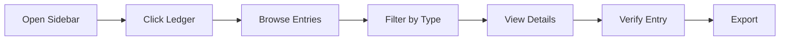

.------------------------------------------------------------------------------.
|                                                                              |
|   ╔══════════════════════════════════════════════════════════════════════╗    |
|   ║                                                                      ║    |
|   ║           HOW-TO-USE COMMUNITY — LEDGER BROWSING                     ║    |
|   ║                                                                      ║    |
|   ║                    inte11ect — Community Intelligence                 ║    |
|   ║                                                                      ║    |
|   ╚══════════════════════════════════════════════════════════════════════╝    |
|                                                                              |
'------------------------------------------------------------------------------'

---

# inte11ect Community: Ledger Browsing

## Table of Contents

1. [Introduction to the Ledger](#introduction-to-the-ledger)
2. [Browsing the Public Ledger](#browsing-the-public-ledger)
3. [Searching the Ledger](#searching-the-ledger)
4. [Filtering Entries](#filtering-entries)
5. [Reading Entry Details](#reading-entry-details)
6. [Verifying Entries](#verifying-entries)
7. [Exporting Ledger Data](#exporting-ledger-data)
8. [Understanding the Blockchain Anchor](#understanding-the-blockchain-anchor)
9. [Ledger API Usage](#ledger-api-usage)
10. [Privacy Considerations](#privacy-considerations)
11. [Interpreting Entry Types](#interpreting-entry-types)
12. [Ledger Statistics](#ledger-statistics)
13. [Real-time Monitoring](#real-time-monitoring)
14. [Sharing Ledger Entries](#sharing-ledger-entries)
15. [Troubleshooting Ledger Issues](#troubleshooting-ledger-issues)

---

## Introduction to the Ledger

The inte11ect ledger is a public, append-only, cryptographically signed record of all platform activity. Every conversation, message, and action is recorded as an immutable entry.

### Ledger Entry Anatomy

```json
{
  "index": 89234,
  "timestamp": "2026-06-19T10:30:00.123Z",
  "type": "message.created",
  "data": {
    "user_id": "usr_abc123",
    "conversation_id": "conv_def456",
    "model": "gpt-4o",
    "input_tokens": 128,
    "output_tokens": 256,
    "content_preview": "What is the capital of France?",
    "response_preview": "The capital of France is..."
  },
  "previous_hash": "0x3f1c9a7b2d4e...",
  "hash": "0x7a9b1c2d3e4f...",
  "signature": "MEUCIQDQgaZx6Ggl6P7GV6K1I5J8..."
}
```

---

## Browsing the Public Ledger

### Web Interface

1. Click "Ledger" in the left sidebar
2. Browse the list of recent entries
3. Use the timeline view to see activity over time



### CLI Browsing

```bash
# View recent entries
inte11ect ledger recent --limit 50

# Paginate through entries
inte11ect ledger list --page 2 --limit 25

# View by date range
inte11ect ledger list --from "2026-06-01" --to "2026-06-19"

# Watch live entries
inte11ect ledger watch
```

---

## Searching the Ledger

### Search Syntax

```bash
# Basic search
inte11ect ledger search --query "capital of France"

# Filter by type
inte11ect ledger search --query "claude" --type "message.created"

# Filter by date
inte11ect ledger search --query "GPT-4o" --from "2026-06-01"

# Filter by user
inte11ect ledger search --user "usr_abc123"

# Compound search
inte11ect ledger search \
  --query "machine learning" \
  --type "message.created" \
  --from "2026-06-01" \
  --to "2026-06-19" \
  --limit 100
```

### Search Parameters

| Parameter | Type | Description |
|---|---|---|
| `query` | string | Full-text search query |
| `type` | string | Entry type filter |
| `from` | date | Start date (ISO 8601) |
| `to` | date | End date (ISO 8601) |
| `user` | string | User ID filter |
| `model` | string | Model name filter |
| `limit` | int | Results per page (max 100) |
| `cursor` | string | Pagination cursor |

---

## Filtering Entries

### Available Filters

```python
class LedgerFilter:
    def __init__(self):
        self.entry_types = [
            "message.created",
            "conversation.created",
            "user.login",
            "user.logout",
            "model.changed",
            "export.completed",
            "settings.changed",
            "admin.action",
            "moderation.flagged",
            "error.occurred"
        ]
    
    def build_filter(self, params: dict) -> dict:
        query = {}
        
        if params.get("type") and params["type"] != "all":
            query["type"] = params["type"]
        
        if params.get("from_date") or params.get("to_date"):
            query["timestamp"] = {}
            if params.get("from_date"):
                query["timestamp"]["$gte"] = params["from_date"]
            if params.get("to_date"):
                query["timestamp"]["$lte"] = params["to_date"]
        
        if params.get("user_id"):
            query["data.user_id"] = params["user_id"]
        
        if params.get("model"):
            query["data.model"] = params["model"]
        
        return query
```

### Filter UI

```html
<div class="ledger-filters">
  <select name="type">
    <option value="all">All Types</option>
    <option value="message.created">Messages</option>
    <option value="conversation.created">Conversations</option>
    <option value="user.login">Logins</option>
    <option value="error.occurred">Errors</option>
  </select>
  
  <input type="date" name="from-date" />
  <input type="date" name="to-date" />
  
  <input type="text" name="search" placeholder="Search..." />
  
  <button onclick="applyFilters()">Apply</button>
  <button onclick="clearFilters()">Clear</button>
</div>
```

---

## Reading Entry Details

### Entry Detail View

```markdown
# Ledger Entry #89234

## Metadata
- **Index**: 89,234
- **Timestamp**: 2026-06-19 10:30:00 UTC
- **Type**: message.created
- **Model**: GPT-4o
- **User**: usr_abc123 (anonymized)

## Content Preview
**Query**: What is the capital of France?
**Response**: The capital of France is Paris...

## Cryptographic Data
- **Previous Hash**: 0x3f1c9a7b2d4e5f6a...
- **Block Hash**: 0x7a9b1c2d3e4f5a6b...
- **Signature**: MEUCIQDQgaZx6Ggl6P7G...

## Verification
- **Chain Valid**: ✓
- **Signature Valid**: ✓
- **Anchor Verified**: ✓

## Actions
- [Verify] [Export] [Share] [Report]
```

---

## Verifying Entries

```python
class EntryVerifier:
    def verify_entry(self, entry: dict) -> dict:
        results = {}
        
        # 1. Verify hash integrity
        computed_hash = self.compute_entry_hash(entry)
        results["hash_valid"] = computed_hash == entry["hash"]
        
        # 2. Verify signature
        results["signature_valid"] = self.verify_signature(
            entry["hash"], entry["signature"]
        )
        
        # 3. Verify chain link
        prev_entry = self.get_entry(entry["index"] - 1)
        results["chain_valid"] = prev_entry and entry["previous_hash"] == prev_entry["hash"]
        
        # 4. Verify blockchain anchor
        results["anchor_verified"] = self.check_blockchain_anchor(entry)
        
        all_valid = all(results.values())
        
        return {
            "entry_index": entry["index"],
            "status": "verified" if all_valid else "compromised",
            "checks": results,
            "verified_at": datetime.utcnow().isoformat()
        }
    
    def compute_entry_hash(self, entry: dict) -> str:
        content = json.dumps({
            "index": entry["index"],
            "timestamp": entry["timestamp"],
            "type": entry["type"],
            "data": entry["data"],
            "previous_hash": entry["previous_hash"]
        }, sort_keys=True)
        return hashlib.sha256(content.encode()).hexdigest()
```

### Verification via CLI

```bash
# Verify specific entry
inte11ect ledger verify --index 89234

# Verify recent entries
inte11ect ledger verify --recent 100

# Full chain verification
inte11ect ledger verify --full

# Check anchoring status
inte11ect ledger anchor-status
```

---

## Exporting Ledger Data

```bash
# Export to JSON
inte11ect ledger export \
  --from "2026-01-01" \
  --to "2026-06-19" \
  --format json \
  --output ledger_export.json

# Export to CSV
inte11ect ledger export \
  --type "message.created" \
  --format csv \
  --output messages.csv

# Export with cryptographic proofs
inte11ect ledger export \
  --from 0 \
  --to 1000 \
  --include-proofs \
  --output ledger_with_proofs.json
```

### Export Response

```json
{
  "file": "ledger_export.json",
  "entries": 15000,
  "format": "json",
  "size_bytes": 2450000,
  "filters": {
    "from": "2026-01-01T00:00:00Z",
    "to": "2026-06-19T23:59:59Z"
  },
  "includes_proofs": false,
  "expires_at": "2026-06-20T10:30:00Z"
}
```

---

## Understanding the Blockchain Anchor

```python
class BlockchainAnchor:
    def get_anchor_info(self) -> dict:
        latest_block = self.get_latest_confirmed_block()
        
        return {
            "current_block_index": latest_block["index"],
            "last_anchored_block": latest_block["anchor_block"],
            "anchor_transaction": latest_block["anchor_tx"],
            "anchor_network": "Ethereum (Goerli testnet)",
            "anchor_contract": "0x1234...5678",
            "next_anchor_estimate": latest_block["next_anchor"],
            "confirmation_count": latest_block["confirmations"]
        }
    
    def verify_anchor(self, block_index: int) -> bool:
        # Query the smart contract
        anchor_data = self.contract.functions.getAnchor(block_index).call()
        
        # Verify the stored merkle root matches
        merkle_root = self.compute_merkle_root(block_index)
        return anchor_data[0] == merkle_root
```

### Anchor Verification Steps

1. Retrieve the block's merkle root
2. Query the smart contract on the public blockchain
3. Compare the stored merkle root with the computed one
4. Verify the anchoring transaction on blockchain explorer

---

## Ledger API Usage

```bash
# List entries
curl -H "Authorization: Bearer TOKEN" \
  "https://api.inte11ect.dev/v1/ledger?limit=50&type=message.created"

# Get specific entry
curl -H "Authorization: Bearer TOKEN" \
  "https://api.inte11ect.dev/v1/ledger/89234"

# Verify entry
curl -H "Authorization: Bearer TOKEN" \
  "https://api.inte11ect.dev/v1/ledger/89234/verify"

# Search entries
curl -H "Authorization: Bearer TOKEN" \
  "https://api.inte11ect.dev/v1/ledger/search?q=France&limit=20"

# Export
curl -X POST -H "Authorization: Bearer TOKEN" \
  "https://api.inte11ect.dev/v1/ledger/export" \
  -d '{"from": "2026-01-01", "to": "2026-06-19", "format": "json"}'

# Get statistics
curl -H "Authorization: Bearer TOKEN" \
  "https://api.inte11ect.dev/v1/ledger/stats"
```

---

## Privacy Considerations

```yaml
ledger_privacy:
  community_tier:
    user_ids: "Visible as pseudonymous hash"
    content: "Full content visible"
    personal_info: "Not included"
  
  pro_tier:
    private_ledgers: "Content hidden from public view"
    public_entries: "User_id hashed, content truncated"
  
  team_tier:
    private_ledgers: "Full privacy"
    export: "Audit access only"
  
  gdpr:
    right_to_anonymization: "User references anonymized"
    retention: "Configurable per tier"
```

### Your Data in the Ledger

| Data Type | Public | Visible To |
|---|---|---|
| Message content | ✓ (Community) | Everyone |
| User ID | Pseudonymous | Everyone |
| Timestamp | ✓ | Everyone |
| Model used | ✓ | Everyone |
| IP address | ✗ | Internal only |
| Personal info | ✗ | You only |

---

## Interpreting Entry Types

```python
class EntryTypeInterpreter:
    def get_description(self, entry_type: str) -> str:
        descriptions = {
            "message.created": "A user sent a message and received a response",
            "conversation.created": "A new conversation was started",
            "user.login": "User logged into the platform",
            "user.logout": "User logged out of the platform",
            "model.changed": "User switched to a different AI model",
            "export.completed": "User exported their data",
            "settings.changed": "User modified their settings",
            "admin.action": "Administrator performed an action",
            "moderation.flagged": "Content was flagged by moderation",
            "error.occurred": "An error occurred during processing"
        }
        return descriptions.get(entry_type, "Unknown entry type")
    
    def get_icon(self, entry_type: str) -> str:
        icons = {
            "message.created": "💬",
            "conversation.created": "🆕",
            "user.login": "🔑",
            "user.logout": "🚪",
            "model.changed": "🔄",
            "export.completed": "📥",
            "settings.changed": "⚙️",
            "admin.action": "🔧",
            "moderation.flagged": "🚩",
            "error.occurred": "❌"
        }
        return icons.get(entry_type, "📄")
```

---

## Ledger Statistics

```bash
# Get ledger statistics
inte11ect ledger stats

# Output example
{
  "total_blocks": 89234,
  "total_entries": 89234,
  "first_entry": "2025-01-15T00:00:00Z",
  "last_entry": "2026-06-19T10:30:00Z",
  "entries_per_day": 157,
  "entries_by_type": {
    "message.created": 65421,
    "conversation.created": 12345,
    "user.login": 5678,
    "user.logout": 5432,
    "error.occurred": 234,
    "export.completed": 124
  },
  "models_used": {
    "gpt-4o": 45000,
    "claude-3-5-sonnet": 15000,
    "gpt-4o-mini": 8000,
    "gemini-1.5-flash": 3421
  },
  "storage_size_mb": 245,
  "anchoring_status": {
    "last_anchored": 89000,
    "anchor_network": "Ethereum",
    "anchor_tx": "0xabc...def"
  }
}
```

---

## Real-time Monitoring

```bash
# Watch live ledger activity
inte11ect ledger watch --events "message.created,error.occurred"

# Output
[10:30:00] 💬 New message from usr_abc123 (GPT-4o)
[10:30:05] 💬 New message from usr_def456 (Claude)
[10:30:12] ❌ Error from usr_ghi789: Model timeout
```

### WebSocket Monitoring

```javascript
const ws = new WebSocket('wss://api.inte11ect.dev/v1/ledger/ws');

ws.onmessage = (event) => {
  const entry = JSON.parse(event.data);
  
  const entryTypes = {
    'message.created': '💬',
    'error.occurred': '❌',
    'user.login': '🔑'
  };
  
  const icon = entryTypes[entry.type] || '📄';
  const preview = entry.data?.content_preview?.substring(0, 50) || '';
  
  console.log(`[${entry.timestamp}] ${icon} ${entry.type} - ${preview}`);
};

ws.onclose = () => {
  console.log('Disconnected. Reconnecting...');
  setTimeout(() => reconnect(), 1000);
};
```

---

## Sharing Ledger Entries

```bash
# Create share link for an entry
inte11ect ledger share --index 89234 --expires "24h"

# Response
{
  "share_url": "https://inte11ect.dev/ledger/share/abc123xyz",
  "expires_at": "2026-06-20T10:30:00Z",
  "entry_index": 89234,
  "views": 0
}
```

### Embedding Entries

```html
<!-- Embed a ledger entry on your website -->
<div class="inte11ect-ledger-entry" data-index="89234">
  Loading entry...
</div>

<script src="https://inte11ect.dev/embed.js"></script>
<script>
  Inte11ectEmbed.render({
    element: '.inte11ect-ledger-entry',
    index: 89234,
    theme: 'light'
  });
</script>
```

---

## Troubleshooting Ledger Issues

| Issue | Cause | Solution |
|---|---|---|
| Entry not found | Wrong index | Double-check the index number |
| Verification fails | Network issue | Retry verification |
| Export too large | Too many entries | Narrow date range |
| Slow loading | High traffic | Try off-peak hours |
| Missing entries | Filter too restrictive | Broaden filters |
| Anchor check fails | Blockchain delay | Wait for confirmation |
| API rate limited | Too many requests | Reduce request frequency |

---

```
Lois-Kleinner and 0-1.gg 2026 — Confidential
```

```
.====================================================================.
!  Made in the UAE, Dubai #DubaiIt #Dubai #Dxb #SovereignAI          !
!  Made in The Emirates #Dubai_it                                    !
!                                                                    !
!  Lois-Kleinner Alpasan - The Anticloud 2026-                       !
!                                                                    !
!  0-1.gg ! GitHub ! LinkedIn ! DEV ! GH Pages                       !
!  HuggingFace ! Blog ! Tumblr ! Fandom ! Bluesky ! Mastodon          !
!  Zenodo ! Harvard Dataverse ! Internet Archive ! ORCID              !
!                                                                    !
!  Sovereign AI ! Local-First ! Privacy ! Zero Trust ! No Datacenter !
!  Air-Gapped ! Open Source ! Rust ! Hash Chain ! Single Binary      !
!  Offline LLM ! Crypto Ledger ! P2P ! Federated                     !
'===================================================================='
```

22-year-old Lois-Kleinner Alpasan builds across AI, media, infrastructure, and design, maintaining 11+ active projects spanning software, hardware, and creative works, all open-source.

References:
1. Lois-Kleinner Zenodo: https://doi.org/10.5281/zenodo.20781790
2. Lois-Kleinner GitHub: https://github.com/kleinnner/Anticloud/tree/main/04-aioss-format
3. Lois-Kleinner Harvard DV: https://doi.org/10.7910/DVN/FDEBAB
4. Lois-Kleinner Internet Arc: https://archive.org/details/aioss-format
5. Lois-Kleinner ORCID: https://orcid.org/0009-0009-2233-6107
6. Lois-Kleinner DEV.to: https://dev.to/kleinner
7. Lois-Kleinner LinkedIn: https://linkedin.com/in/kleinner
8. Lois-Kleinner HuggingFace: https://huggingface.co/Anticloud
9. Lois-Kleinner Tumblr: https://anticloud.tumblr.com
10. Lois-Kleinner Mastodon: https://mastodon.social/@kleinner
11. Lois-Kleinner Bluesky: https://bsky.app/profile/kleinner.bsky.social
12. 0-1.gg: https://0-1.gg
