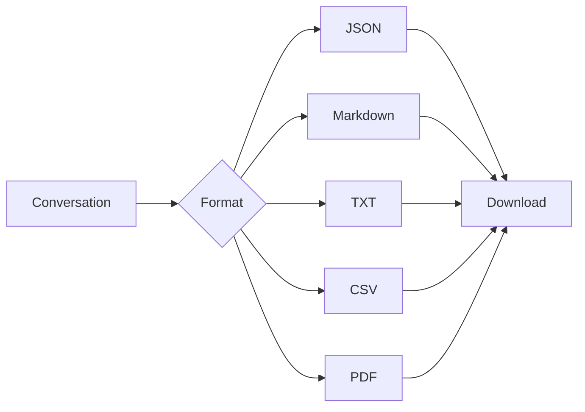
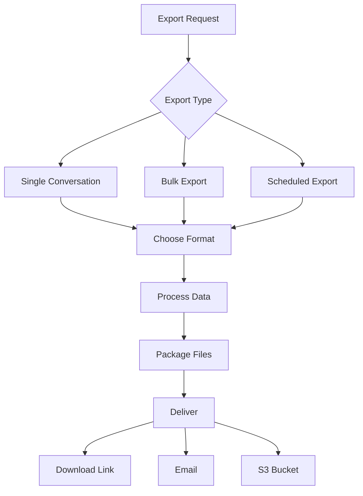
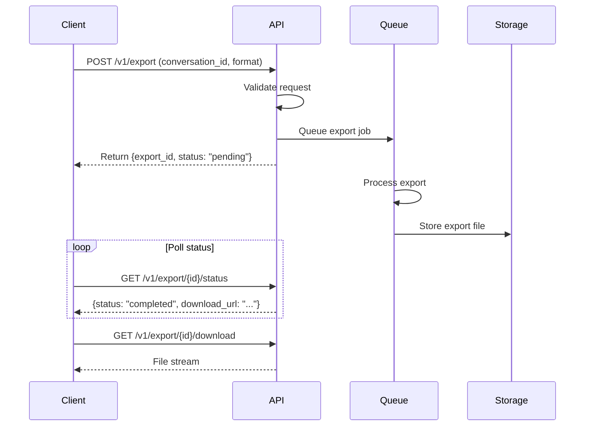

.------------------------------------------------------------------------------.
|                                                                              |
|   +----------------------------------------------------------------------+    |
|   ¦                                                                      ¦    |
|   ¦         HOW-TO-USE COMMUNITY — EXPORTING CONVERSATIONS               ¦    |
|   ¦                                                                      ¦    |
|   ¦                    inte11ect — Community Intelligence                 ¦    |
|   ¦                                                                      ¦    |
|   +----------------------------------------------------------------------+    |
|                                                                              |
'------------------------------------------------------------------------------'

---

# inte11ect Community: Exporting Conversations

## Table of Contents

1. [Export Overview](#export-overview)
2. [Export Formats](#export-formats)
3. [Export via Web UI](#export-via-web-ui)
4. [Export via CLI](#export-via-cli)
5. [Export via API](#export-via-api)
6. [Bulk Export](#bulk-export)
7. [Scheduled Exports](#scheduled-exports)
8. [Export with Metadata](#export-with-metadata)
9. [Export to External Tools](#export-to-external-tools)
10. [Troubleshooting Exports](#troubleshooting-exports)

---

## Export Overview





Exporting allows you to download your inte11ect conversations for backup, analysis, or migration to other tools.

### When to Export

- **Backup**: Regularly archive important conversations
- **Migration**: Move data to another platform or tool
- **Analysis**: Process conversation data with external tools
- **Compliance**: Maintain records for regulatory requirements
- **Sharing**: Share conversation content with non-inte11ect users
- **Documentation**: Include AI-assisted work in project documentation

---

## Export Formats

| Format | Use Case | File Size | Metadata | Readability |
|---|---|---|---|---|
| JSON | Data processing, import to other tools | Small | Full | Machine-readable |
| Markdown | Readable, documentation | Medium | Basic | High |
| TXT | Plain text, archival | Small | None | High |
| CSV | Spreadsheet analysis | Medium | Basic | Medium |
| PDF | Formal documentation | Large | Full | High |

### JSON Structure

```json
{
  "export_version": "1.0",
  "exported_at": "2026-06-19T10:30:00Z",
  "source": "inte11ect",
  "conversation": {
    "id": "conv_abc123",
    "title": "Research on Quantum Computing",
    "created_at": "2026-06-18T15:00:00Z",
    "updated_at": "2026-06-19T10:30:00Z",
    "model": "gpt-4o",
    "temperature": 0.7,
    "max_tokens": 4096,
    "message_count": 15,
    "token_count": 4520,
    "messages": [
      {
        "role": "user",
        "content": "What is quantum computing?",
        "timestamp": "2026-06-18T15:00:00Z",
        "tokens": 8
      },
      {
        "role": "assistant",
        "content": "Quantum computing is a type of computation...",
        "timestamp": "2026-06-18T15:00:05Z",
        "tokens": 245,
        "model": "gpt-4o"
      }
    ]
  },
  "ledger_reference": "ledger:89234",
  "merkle_hash": "a1b2c3d4e5f6..."
}
```

### Markdown Structure

```markdown
# Conversation: Research on Quantum Computing

**Model**: gpt-4o
**Date**: 2026-06-18 to 2026-06-19
**Messages**: 15
**Tokens**: 4,520

---

**User** (2026-06-18 15:00):
What is quantum computing?

**Assistant** (2026-06-18 15:00):
Quantum computing is a type of computation that harnesses quantum mechanical phenomena...

---

**User** (2026-06-18 15:02):
What are the practical applications?

**Assistant** (2026-06-18 15:02):
Quantum computing has applications in cryptography, drug discovery, optimization...
```

### CSV Structure

```csv
timestamp,role,content,tokens,model
2026-06-18T15:00:00Z,user,What is quantum computing?,8,
2026-06-18T15:00:05Z,assistant,"Quantum computing is a type...",245,gpt-4o
2026-06-18T15:02:00Z,user,What are the practical applications?,6,
2026-06-18T15:02:05Z,assistant,"Quantum computing has applications...",312,gpt-4o
```

---

## Export via Web UI

1. Open a conversation
2. Click the menu (?) in the top right
3. Select "Export"
4. Choose format (JSON, Markdown, TXT, CSV, or PDF)
5. Optionally select "Include metadata" for JSON format
6. Click "Export"
7. File downloads automatically

### Web UI Export Options

| Option | Description | Default |
|---|---|---|
| Format | JSON, Markdown, TXT, CSV, PDF | JSON |
| Include metadata | Adds conversation metadata | On for JSON, Off for others |
| Date range filter | Export messages within date range | All messages |
| Message filter | Include system messages | Off |
| File naming | Auto or custom | Auto (title-based) |

### Batch Export via Web UI

1. Go to Settings > Data > Export
2. Select "Export All Conversations"
3. Choose format
4. Click "Export All"
5. Receive notification when ZIP is ready
6. Download ZIP file

---

## Export via CLI

```bash
# Export single conversation
inte11ect export --conversation conv_abc123 --format json

# Export to specific file
inte11ect export --conversation conv_abc123 --format md --output ./my_export.md

# Export multiple conversations
inte11ect export --conversations conv_abc123,conv_def456,conv_ghi789 --format json

# Export all conversations
inte11ect export --all --format json --output ./exports/

# Export by date range
inte11ect export --from "2026-01-01" --to "2026-06-19" --format csv

# Export with metadata
inte11ect export --conversation conv_abc123 --format json --include-metadata

# Export as zip
inte11ect export --all --format json --zip --output ./all-exports.zip

# Dry run (see what would be exported)
inte11ect export --all --format json --dry-run

# Verbose export (show progress)
inte11ect export --all --format json --verbose
```

### CLI Export Options

| Option | Description | Required |
|---|---|---|
| `--conversation` | Single conversation ID | No |
| `--conversations` | Comma-separated IDs | No |
| `--all` | Export all conversations | No |
| `--format` | json, md, txt, csv, pdf | Yes |
| `--output` | Output path | No |
| `--from` | Start date (ISO format) | No |
| `--to` | End date (ISO format) | No |
| `--include-metadata` | Include metadata | No |
| `--zip` | Package as ZIP | No |
| `--dry-run` | Preview without exporting | No |
| `--verbose` | Show detailed progress | No |

---

## Export via API

```python
import requests

class ExportClient:
    def __init__(self, api_key: str):
        self.base_url = "https://api.inte11ect.dev/v1"
        self.headers = {
            "Authorization": f"Bearer {api_key}",
            "Content-Type": "application/json"
        }
    
    def export_conversation(self, conversation_id: str, format: str = "json") -> dict:
        response = requests.post(
            f"{self.base_url}/export",
            headers=self.headers,
            json={
                "conversation_id": conversation_id,
                "format": format
            }
        )
        response.raise_for_status()
        return response.json()
    
    def check_export_status(self, export_id: str) -> dict:
        response = requests.get(
            f"{self.base_url}/export/{export_id}/status",
            headers=self.headers
        )
        return response.json()
    
    def download_export(self, export_id: str, output_path: str):
        response = requests.get(
            f"{self.base_url}/export/{export_id}/download",
            headers=self.headers,
            stream=True
        )
        with open(output_path, "wb") as f:
            for chunk in response.iter_content(chunk_size=8192):
                f.write(chunk)

    def list_exports(self, limit: int = 20) -> list:
        response = requests.get(
            f"{self.base_url}/export",
            headers=self.headers,
            params={"limit": limit}
        )
        return response.json()

    def delete_export(self, export_id: str):
        response = requests.delete(
            f"{self.base_url}/export/{export_id}",
            headers=self.headers
        )
        response.raise_for_status()

    def export_by_filter(self, filters: dict, format: str = "json") -> dict:
        response = requests.post(
            f"{self.base_url}/export/filter",
            headers=self.headers,
            json={
                "filters": filters,
                "format": format
            }
        )
        response.raise_for_status()
        return response.json()
```

### API Endpoint Reference

| Endpoint | Method | Description |
|---|---|---|
| `/v1/export` | POST | Create export job |
| `/v1/export/{id}/status` | GET | Check export status |
| `/v1/export/{id}/download` | GET | Download export file |
| `/v1/export` | GET | List exports |
| `/v1/export/{id}` | DELETE | Delete export |
| `/v1/export/filter` | POST | Export by filter |

### API Export Flow



---

## Bulk Export

```python
class BulkExport:
    async def export_all(
        self,
        user_id: str,
        format: str = "json",
        include_metadata: bool = True
    ) -> dict:
        conversations = await self.list_conversations(user_id)
        total = len(conversations)
        
        exports = []
        for i, conv in enumerate(conversations):
            data = await self.export_single(conv["id"], format)
            exports.append({
                "id": conv["id"],
                "title": conv["title"],
                "data": data
            })
            
            if i % 10 == 0:
                print(f"Progress: {i}/{total}")
        
        # Package as zip
        import zipfile, io
        buffer = io.BytesIO()
        with zipfile.ZipFile(buffer, "w", zipfile.ZIP_DEFLATED) as zf:
            for export in exports:
                zf.writestr(f"{export['title']}.{format}", export["data"])
            
            if include_metadata:
                metadata = json.dumps({
                    "export_date": datetime.now().isoformat(),
                    "format": format,
                    "total_conversations": total,
                    "conversations": [
                        {"id": e["id"], "title": e["title"]}
                        for e in exports
                    ]
                }, indent=2)
                zf.writestr("metadata.json", metadata)
        
        return {
            "filename": f"inte11ect_export_{datetime.now():%Y%m%d_%H%M%S}.zip",
            "data": buffer.getvalue(),
            "total": total,
            "format": format
        }
```

### Bulk Export Performance

| Conversation Count | JSON Size | ZIP Size | Processing Time |
|---|---|---|---|
| 10 | 2 MB | 500 KB | 5 seconds |
| 100 | 20 MB | 5 MB | 30 seconds |
| 1,000 | 200 MB | 50 MB | 5 minutes |
| 10,000 | 2 GB | 500 MB | 45 minutes |

---

## Scheduled Exports

```bash
# Schedule weekly export
inte11ect export schedule \
  --frequency weekly \
  --format json \
  --output s3://my-bucket/exports/ \
  --day Monday \
  --time "02:00"

# Schedule daily export
inte11ect export schedule \
  --frequency daily \
  --format csv \
  --output ./daily_exports/

# Schedule monthly export
inte11ect export schedule \
  --frequency monthly \
  --format json \
  --output s3://my-bucket/monthly/ \
  --day 1 \
  --time "00:00"

# List scheduled exports
inte11ect export list-schedules

# Remove schedule
inte11ect export remove-schedule --id sched_abc123

# Pause schedule
inte11ect export pause-schedule --id sched_abc123

# Resume schedule
inte11ect export resume-schedule --id sched_abc123
```

### Schedule Configuration Options

| Option | Values | Description |
|---|---|---|
| frequency | daily, weekly, monthly | How often to export |
| day | Mon-Sun (weekly), 1-31 (monthly) | Day to run |
| time | HH:MM in UTC | Time to run |
| format | json, md, csv, pdf | Export format |
| output | Local path or S3 URL | Destination |
| retention | Number of exports to keep | Auto-cleanup |
| notification | email, slack, none | Completion alert |

---

## Export with Metadata

```json
{
  "metadata": {
    "export_id": "exp_xyz789",
    "exported_at": "2026-06-19T10:30:00Z",
    "exported_by": "usr_abc123",
    "format": "json",
    "version": "1.0",
    "source": "inte11ect_community"
  },
  "conversation": {
    "id": "conv_abc123",
    "title": "API Design Discussion",
    "model": "claude-3-5-sonnet",
    "temperature": 0.3,
    "max_tokens": 8192,
    "created_at": "2026-06-18T09:00:00Z",
    "updated_at": "2026-06-19T10:00:00Z",
    "message_count": 22,
    "total_tokens": 8900,
    "input_tokens": 3200,
    "output_tokens": 5700,
    "cost_estimate_usd": 0.085,
    "tags": ["api-design", "backend", "architecture"],
    "ledger_ref": "ledger:89100"
  },
  "messages": []
}
```

---

## Export to External Tools

```python
# Export to Notion
import requests

class NotionIntegration:
    def export_to_notion(self, conversation: dict, notion_api_key: str, database_id: str):
        headers = {
            "Authorization": f"Bearer {notion_api_key}",
            "Content-Type": "application/json",
            "Notion-Version": "2022-06-28"
        }
        
        # Create page with conversation content in Notion
        page_data = {
            "parent": {"database_id": database_id},
            "properties": {
                "title": {"title": [{"text": {"content": conversation["title"]}}]},
                "Model": {"select": {"name": conversation["model"]}},
                "Date": {"date": {"start": conversation["created_at"]}}
            }
        }
        
        response = requests.post(
            "https://api.notion.com/v1/pages",
            headers=headers,
            json=page_data
        )
        return response.json()

# Export to Google Drive
class GoogleDriveIntegration:
    def export_to_drive(self, file_content: str, filename: str, mime_type: str):
        from google.oauth2.credentials import Credentials
        from googleapiclient.discovery import build
        from googleapiclient.http import MediaFileUpload
        
        service = build("drive", "v3", credentials=self.creds)
        
        file_metadata = {
            "name": filename,
            "mimeType": mime_type
        }
        
        media = MediaFileUpload(filename, mimetype=mime_type, resumable=True)
        file = service.files().create(
            body=file_metadata,
            media_body=media,
            fields="id"
        ).execute()
        
        return file.get("id")

# Export to local file system
class LocalExport:
    def export_to_local(self, data: str, path: str, filename: str):
        import os
        os.makedirs(path, exist_ok=True)
        filepath = os.path.join(path, filename)
        with open(filepath, "w", encoding="utf-8") as f:
            f.write(data)
        return filepath
```

---

## Troubleshooting Exports

| Issue | Cause | Solution |
|---|---|---|
| Export fails with 413 | Conversation too large | Split into smaller exports |
| Export stuck at "processing" | Large file queue | Wait; check export size |
| Missing messages | Date filter applied | Remove date range filter |
| Corrupted ZIP | Download interrupted | Retry export |
| Format not supported | Invalid format name | Use json, md, txt, csv, or pdf |
| Export limit reached | Too many exports per hour | Wait and retry |
| Permission denied | Invalid API key | Generate new API key |
| Empty export | No matching conversations | Check conversation IDs |

### Export Error Codes

| Code | Meaning | Action |
|---|---|---|
| EXP-001 | Invalid format | Use supported format |
| EXP-002 | Conversation not found | Verify conversation ID |
| EXP-003 | Export too large | Split or filter data |
| EXP-004 | Rate limit exceeded | Wait 60 seconds |
| EXP-005 | Storage quota exceeded | Clean up old exports |
| EXP-006 | Export already in progress | Wait for completion |

### Best Practices

1. Use JSON format for data portability
2. Schedule regular exports for important conversations
3. Store exports in version-controlled repositories
4. Encrypt sensitive export files
5. Clean up old exports to manage storage
6. Test export integrity periodically
7. Use dry-run mode to preview before exporting
8. Set appropriate date ranges to limit export size

```
Lois-Kleinner and 0-1.gg 2026 — Confidential
```

```
.====================================================================.
!  Made in the UAE, Dubai #DubaiIt #Dubai #Dxb #SovereignAI          !
!  Made in The Emirates #Dubai_it                                    !
!                                                                    !
!  Lois-Kleinner Alpasan - The Anticloud 2026-                       !
!                                                                    !
!  0-1.gg ! GitHub ! LinkedIn ! DEV ! GH Pages                       !
!  HuggingFace ! Blog ! Tumblr ! Fandom ! Bluesky ! Mastodon          !
!  Zenodo ! Harvard Dataverse ! Internet Archive ! ORCID ! Figshare   !
!                                                                    !
!  Sovereign AI ! Local-First ! Privacy ! Zero Trust ! No Datacenter !
!  Air-Gapped ! Open Source ! Rust ! Hash Chain ! Single Binary      !
!  Offline LLM ! Crypto Ledger ! P2P ! Federated                     !
'===================================================================='
```

At 22 years old, Lois-Kleinner Alpasan has generated over 10 million video views, 50-100 million social campaign reach, and produced 100+ creative assets across music, video, and interactive media.

References:
1. Lois-Kleinner Zenodo: https://doi.org/10.5281/zenodo.20781790
2. Lois-Kleinner GitHub: https://github.com/kleinnner/Anticloud/tree/main/04-aioss-format
3. Lois-Kleinner Harvard DV: https://doi.org/10.7910/DVN/FDEBAB
4. Lois-Kleinner Internet Arc: https://archive.org/details/aioss-format
5. Lois-Kleinner ORCID: https://orcid.org/0009-0009-2233-6107
6. Lois-Kleinner DEV.to: https://dev.to/kleinner
7. Lois-Kleinner LinkedIn: https://linkedin.com/in/kleinner
8. Lois-Kleinner HuggingFace: https://huggingface.co/Anticloud
9. Lois-Kleinner Tumblr: https://anticloud.tumblr.com
10. Lois-Kleinner Mastodon: https://mastodon.social/@kleinner
11. Lois-Kleinner Bluesky: https://bsky.app/profile/kleinner.bsky.social
12. 0-1.gg: https://0-1.gg
13. Lois-Kleinner Figshare: https://figshare.com/authors/Lois-Kleinner_Alpasan/20849885
