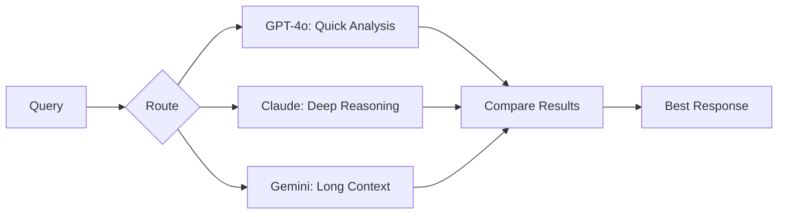

.------------------------------------------------------------------------------.
|                                                                              |
|   +----------------------------------------------------------------------+    |
|   ¦                                                                      ¦    |
|   ¦           HOW-TO-USE COMMUNITY — POWER USER TIPS                     ¦    |
|   ¦                                                                      ¦    |
|   ¦                    inte11ect — Community Intelligence                 ¦    |
|   ¦                                                                      ¦    |
|   +----------------------------------------------------------------------+    |
|                                                                              |
'------------------------------------------------------------------------------'

---

# inte11ect Community: Power User Tips

## Table of Contents

1. [Keyboard Ninja](#keyboard-ninja)
2. [Prompt Engineering Tricks](#prompt-engineering-tricks)
3. [Workflow Automation](#workflow-automation)
4. [CLI Power Moves](#cli-power-moves)
5. [Multi-Model Strategies](#multi-model-strategies)
6. [Context Window Optimization](#context-window-optimization)
7. [Search Like a Pro](#search-like-a-pro)
8. [Data Analysis Techniques](#data-analysis-techniques)
9. [Collaboration Workflows](#collaboration-workflows)
10. [Performance Optimization](#performance-optimization)

---

## Keyboard Ninja

| Shortcut | Action | Why Useful |
|---|---|---|
| `Ctrl+Shift+N` | New chat in new window | Compare models side by side |
| `Ctrl+Shift+Del` | Clear current chat | Start fresh without leaving |
| `Ctrl+Shift+C` | Copy entire conversation | Quick backup |
| `Ctrl+Shift+F` | Full-screen mode | Focus without distractions |
| `Ctrl+Shift+E` | Export quick | Export current view |
| `Ctrl+Alt+1-9` | Switch between recent chats | Rapid navigation |
| `Ctrl+.` | Toggle sidebar | More screen space |
| `Ctrl+,` | Open settings | Quick access |
| `Ctrl+B` | Bold in markdown | Formatting |
| `Ctrl+I` | Italic in markdown | Formatting |
| `Ctrl+K` | Insert link | Quick linking |
| `Ctrl+Shift+7` | Numbered list | Quick lists |
| `Ctrl+Shift+8` | Bullet list | Quick lists |
| `Ctrl+Shift+>` | Blockquote | Citation |

### Custom Keybindings

```json
{
  "keybindings": {
    "new_chat": "Ctrl+N",
    "search": "Ctrl+Shift+F",
    "toggle_sidebar": "Ctrl+.",
    "zoom_in": "Ctrl+=",
    "zoom_out": "Ctrl+-",
    "reset_zoom": "Ctrl+0"
  }
}
```

---

## Prompt Engineering Tricks

### Advanced System Prompts

```markdown
## Chain-of-Thought Prompting
You are an expert analyst. Before answering any question:
1. Break down the problem into steps
2. Think through each step methodically
3. Show your reasoning
4. Provide the final answer

## Role Immersion
You are [ROLE]. You have [X] years of experience in [FIELD].
Your communication style is [STYLE].
Always provide [SPECIFIC OUTPUT FORMAT].

## Few-Shot Prompting
Convert these dates to ISO format:
Input: "March 15, 2024" ? Output: "2024-03-15"
Input: "Jan 3, 2023" ? Output: "2023-01-03"
Input: "December 25, 2025" ? Output:
```

### System Prompt Templates

| Purpose | Template |
|---|---|
| Code reviewer | "You are a senior software engineer reviewing code for bugs, security issues, and best practices. Provide actionable feedback with code examples." |
| Technical writer | "You are a technical writer creating clear documentation. Use simple language, provide examples, and structure information hierarchically." |
| Data analyst | "You are a data scientist analyzing provided data. Identify trends, outliers, and correlations. Support conclusions with specific data points." |
| Tutor | "You are a patient tutor explaining concepts to a beginner. Use analogies, check understanding, and encourage questions." |
| Translator | "Translate the following text to [LANGUAGE]. Preserve tone and context. Provide alternative translations for ambiguous phrases." |

### Temperature Tricks

| Situation | Temperature | Why |
|---|---|---|
| Factual Q&A | 0.1 | Deterministic, accurate |
| Code generation | 0.2 | Consistent, reliable |
| Analysis | 0.3 | Balanced reasoning |
| Brainstorming | 0.8 | Creative variety |
| Poetry | 1.0 | Maximum creativity |
| Translation | 0.3 | Accuracy required |
| Debugging | 0.2 | Logical precision |
| Creative writing | 0.9 | Novel ideas |
| Summarization | 0.3 | Accurate capture |
| Email drafting | 0.5 | Professional tone |

### Prompt Patterns

```markdown
## Persona Pattern
Act as a [role] with [expertise]. Help me [task].

## Format Pattern
Provide your answer in [format]. Include [sections].

## Constraint Pattern
Given [context], answer [question] with [constraints].

## Chain Pattern
First [step 1], then [step 2], finally [step 3].

## Comparison Pattern
Compare [option A] and [option B] across [criteria].

## Step-back Pattern
Before answering, think about the broader context of [topic].
What principles or frameworks apply here?
Now answer the specific question.

## Self-Critique Pattern
Provide your answer. Then, critique your own answer.
Identify weaknesses, assumptions, and alternatives.
Finally, provide a revised, improved answer.
```

---

## Workflow Automation

```bash
#!/bin/bash
# Auto-summarize daily conversations

DATE=$(date +%Y-%m-%d)
EXPORT_DIR="$HOME/inte11ect_exports/$DATE"

mkdir -p "$EXPORT_DIR"

# Export all conversations from today
inte11ect export --from "$DATE" --to "$DATE" --format json --output "$EXPORT_DIR"

# Generate summary
inte11ect chat --model gpt-4o --prompt "Summarize these conversations: $(cat $EXPORT_DIR/*.json)"

# Save summary
inte11ect export save-last --format md --output "$EXPORT_DIR/summary.md"

echo "Daily summary saved to $EXPORT_DIR/summary.md"
```

### Weekly Review Automation

```bash
#!/bin/bash
# weekly_review.sh

WEEK_START=$(date -d "last monday" +%Y-%m-%d)
WEEK_END=$(date -d "last sunday" +%Y-%m-%d)
OUTPUT_DIR="$HOME/inte11ect_reviews/week-$(date +%V)"

mkdir -p "$OUTPUT_DIR"

echo "=== Weekly Review: $WEEK_START to $WEEK_END ==="

# Export all conversations from the week
inte11ect export --from "$WEEK_START" --to "$WEEK_END" \
  --format json --output "$OUTPUT_DIR/exports/"

# Get usage statistics
inte11ect export stats --from "$WEEK_START" --to "$WEEK_END" \
  --output "$OUTPUT_DIR/stats.json"

# Generate summary report
inte11ect ask --model gpt-4o --prompt "
Based on these conversation exports from $WEEK_START to $WEEK_END:
1. What were the main topics discussed?
2. What decisions were made?
3. What action items were identified?
4. What should I focus on next week?
" --output "$OUTPUT_DIR/weekly_summary.md"

echo "Weekly review saved to $OUTPUT_DIR"
```

### Slack Integration

```python
import os
from slack_sdk import WebClient
from inte11ect import Inte11ect

class SlackIntegration:
    def __init__(self):
        self.slack = WebClient(token=os.environ["SLACK_TOKEN"])
        self.inte11ect = Inte11ect(api_key=os.environ["INTE11ECT_API_KEY"])
    
    async def ask_and_share(self, question: str, channel: str):
        response = await self.inte11ect.chat.completions.create(
            model="gpt-4o-mini",
            messages=[{"role": "user", "content": question}]
        )
        
        answer = response.choices[0].message.content
        
        self.slack.chat_postMessage(
            channel=channel,
            text=f"*Q:* {question}\n*A:* {answer}"
        )
    
    async def search_and_share(self, query: str, channel: str):
        results = await self.inte11ect.ledger.search(query, limit=3)
        
        blocks = []
        for result in results:
            blocks.append({
                "type": "section",
                "text": {"type": "mrkdwn", "text": f"*{result['title']}*\n{result['preview'][:200]}..."}
            })
        
        self.slack.chat_postMessage(channel=channel, blocks=blocks)

# Usage
slack_bot = SlackIntegration()
# await slack_bot.ask_and_share("What's the capital of France?", "#general")
```

---

## CLI Power Moves

### Piping and Redirection

```bash
# Pipe input directly
echo "What is the meaning of life?" | inte11ect ask

# Redirect output
inte11ect ask "List all Python web frameworks" > frameworks.txt

# Use with jq for JSON processing
inte11ect ask --json "List 5 programming languages" | jq '.response'

# Chain commands
inte11ect ask "Generate a gitignore for Python" | tee .gitignore

# Integration with other tools
inte11ect ask "Explain this error: $(cat error.log)" | mail -s "Error Analysis" team@example.com

# Use with fzf for interactive selection
inte11ect models list | fzf | xargs -I {} inte11ect ask "Describe {} in one sentence"

# Process with grep
inte11ect ledger search --query "security" | grep -i "vulnerability"
```

### Batch Processing

```bash
# Process multiple queries from file
cat queries.txt | while read query; do
  result=$(inte11ect ask --model gpt-4o-mini "$query")
  echo "Q: $query" >> results.txt
  echo "A: $result" >> results.txt
  echo "---" >> results.txt
done

# Parallel processing with xargs
cat urls.txt | xargs -P 4 -I {} inte11ect ask "Summarize: {}" > summaries.txt

# Batch classification
cat documents.txt | while read doc; do
  category=$(inte11ect ask --model gpt-4o-mini --json \
    "Classify this document into [technical, business, personal]: $doc" | jq -r '.category')
  echo "$doc|$category" >> classified.csv
done
```

### CLI Configuration

```bash
# Set default model
inte11ect config set default_model gpt-4o-mini

# Set default temperature
inte11ect config set temperature 0.5

# Enable auto-save
inte11ect config set auto_save true

# Set output format
inte11ect config set output_format json

# Create profiles
inte11ect config create-profile coding --model claude-3-5-sonnet --temperature 0.2
inte11ect config create-profile creative --model gpt-4o --temperature 0.9

# Switch profiles
inte11ect config use-profile coding

# View config
inte11ect config list
```

---

## Multi-Model Strategies



### Model Comparison Script

```bash
#!/bin/bash
compare_models() {
  local query="$1"
  
  echo "=== Model Comparison ==="
  echo "Query: $query"
  echo ""
  
  for model in gpt-4o claude-3-5-sonnet gemini-1.5-flash; do
    echo "--- $model ---"
    time inte11ect ask --model "$model" "$query" 2>&1
    echo ""
  done
}

compare_models "Explain quantum computing in simple terms"
```

### Ensemble Strategy

```python
class EnsembleStrategy:
    def __init__(self, client):
        self.client = client
        self.models = ["gpt-4o-mini", "claude-3-haiku", "gemini-1.5-flash"]
    
    async def ensemble_answer(self, question: str) -> dict:
        responses = []
        
        for model in self.models:
            response = await self.client.chat.completions.create(
                model=model,
                messages=[{"role": "user", "content": question}]
            )
            responses.append({
                "model": model,
                "answer": response.choices[0].message.content
            })
        
        # Use a stronger model to synthesize
        synthesis_prompt = f"Given these answers to '{question}', synthesize the best response:\n\n"
        for r in responses:
            synthesis_prompt += f"--- {r['model']} ---\n{r['answer']}\n\n"
        synthesis_prompt += "Provide a consolidated, accurate answer."
        
        synthesis = await self.client.chat.completions.create(
            model="gpt-4o",
            messages=[{"role": "user", "content": synthesis_prompt}]
        )
        
        return {
            "question": question,
            "individual_responses": responses,
            "synthesized": synthesis.choices[0].message.content
        }
```

### Router Strategy

```python
class ModelRouter:
    def __init__(self, client):
        self.client = client
        self.routes = {
            "code": {"model": "claude-3-5-sonnet", "reason": "Best for programming"},
            "analysis": {"model": "gpt-4o", "reason": "Balanced analysis"},
            "long_doc": {"model": "gemini-1.5-pro", "reason": "Large context window"},
            "quick": {"model": "gpt-4o-mini", "reason": "Fast and cheap"},
            "translation": {"model": "mistral-large", "reason": "Multilingual strength"}
        }
    
    async def route_and_answer(self, question: str):
        # Classify the question
        classification = await self.client.chat.completions.create(
            model="gpt-4o-mini",
            messages=[{
                "role": "user",
                "content": f"Classify this query into one category: {list(self.routes.keys())}\nQuery: {question}\nCategory:"
            }]
        )
        
        category = classification.choices[0].message.content.strip().lower()
        route = self.routes.get(category, self.routes["quick"])
        
        # Get answer from routed model
        response = await self.client.chat.completions.create(
            model=route["model"],
            messages=[{"role": "user", "content": question}]
        )
        
        return {
            "question": question,
            "routed_to": route["model"],
            "reason": route["reason"],
            "answer": response.choices[0].message.content
        }
```

---

## Context Window Optimization

```python
class ContextOptimizer:
    def optimize_for_context(self, messages: list[dict], model: str) -> list[dict]:
        model_limits = {
            "gpt-4o": 128000,
            "claude-3-5-sonnet": 200000,
            "gemini-1.5-pro": 1000000
        }
        limit = model_limits.get(model, 128000)
        
        # Estimate token count
        total_tokens = self.estimate_tokens(messages)
        
        if total_tokens <= limit * 0.8:
            return messages  # Safe
        
        # Strategy: Summarize oldest messages
        system_msg = messages[0] if messages[0]["role"] == "system" else None
        recent = messages[-10:]  # Keep last 10
        
        if system_msg:
            recent = [system_msg] + recent
        
        return recent
    
    def estimate_tokens(self, messages: list[dict]) -> int:
        text = " ".join(m["content"] for m in messages)
        return len(text) // 4

    def smart_truncate(self, messages: list[dict], model: str) -> list[dict]:
        limits = {
            "gpt-4o": 128000,
            "claude-3-5-sonnet": 200000,
            "gemini-1.5-pro": 1000000
        }
        max_tokens = limits.get(model, 128000)
        target_tokens = int(max_tokens * 0.9)  # 90% safety margin
        
        current_tokens = self.estimate_tokens(messages)
        
        if current_tokens <= target_tokens:
            return messages
        
        # Progressive truncation
        while current_tokens > target_tokens and len(messages) > 2:
            # Remove oldest non-system message
            removed = messages.pop(1)
            current_tokens = self.estimate_tokens(messages)
        
        return messages
```

### Context Management Tips

| Strategy | When to Use | Effectiveness |
|---|---|---|
| Summarize old messages | Long conversations | Reduces tokens by 70-90% |
| Remove system prompt | Short on space | Reduces 100-500 tokens |
| Use shorter model names | Any time | Minimal savings |
| Split into subtasks | Complex topics | Better focus per query |
| Remove code blocks | Code-heavy chats | Can reduce 50%+ |
| Use gpt-4o-mini for planning | Initial research | Cheap, save context |

---

## Search Like a Pro

```bash
# Advanced search operators
inte11ect search "machine learning" --model gpt-4o --since "2026-01-01"

# Search within specific conversations
inte11ect search "API design" --in-conversation conv_abc123

# Semantic search (uses embeddings)
inte11ect search --semantic "How do I implement authentication?"

# Regex search
inte11ect search "\b[A-Z][a-z]+ \d{4}\b" --regex

# Search by user
inte11ect search --by-user usr_abc123 --limit 50

# Combined filters
inte11ect search "security" --type message --from "2026-01-01" \
  --to "2026-06-19" --model claude --format csv --output search_results.csv

# Search with relevance scoring
inte11ect search "deployment" --sort-by relevance

# Search across all conversations
inte11ect search --all --query "database migration"

# Search by date range with pagination
inte11ect search "performance" --from "2026-01-01" --to "2026-03-31" \
  --page 1 --per-page 50
```

### Search Operators

| Operator | Example | Description |
|---|---|---|
| Exact phrase | `"machine learning"` | Exact match |
| AND | `security AND compliance` | Both terms |
| OR | `bug OR error OR issue` | Any term |
| NOT | `deployment NOT kubernetes` | Exclude term |
| Wildcard | `micro*` | Prefix match |
| Fuzzy | `firewall~` | Similar spelling |
| Boost | `critical^2 incident` | Weighted term |

---

## Data Analysis Techniques

```python
class ConversationAnalytics:
    def analyze_conversations(self, conversations: list[dict]) -> dict:
        total_messages = 0
        model_usage = {}
        topics = []
        
        for conv in conversations:
            total_messages += len(conv.get("messages", []))
            
            model = conv.get("model", "unknown")
            model_usage[model] = model_usage.get(model, 0) + 1
            
            if conv.get("messages"):
                first_msg = conv["messages"][0]["content"]
                topics.append(first_msg[:100])
        
        return {
            "total_conversations": len(conversations),
            "total_messages": total_messages,
            "avg_messages_per_conversation": total_messages / max(len(conversations), 1),
            "model_usage": model_usage,
            "top_topics": self.extract_common_topics(topics),
            "peak_hours": self.analyze_peak_usage(conversations),
            "avg_response_length": self.avg_response_length(conversations)
        }
    
    def extract_common_topics(self, topics: list[str]) -> list[dict]:
        from collections import Counter
        words = []
        for topic in topics:
            words.extend(topic.lower().split())
        
        stop_words = {"the", "a", "an", "is", "are", "was", "were", "i", "you", "he", "she"}
        filtered = [w for w in words if w not in stop_words and len(w) > 3]
        
        return Counter(filtered).most_common(10)

    def analyze_peak_usage(self, conversations: list[dict]) -> dict:
        hourly = {}
        for conv in conversations:
            hour = datetime.fromisoformat(conv["created_at"]).hour
            hourly[hour] = hourly.get(hour, 0) + 1
        
        peak_hour = max(hourly, key=hourly.get)
        return {
            "peak_hour": f"{peak_hour}:00",
            "hourly_distribution": dict(sorted(hourly.items()))
        }
    
    def avg_response_length(self, conversations: list[dict]) -> int:
        total_length = 0
        total_responses = 0
        for conv in conversations:
            for msg in conv.get("messages", []):
                if msg["role"] == "assistant":
                    total_length += len(msg["content"])
                    total_responses += 1
        return total_length // max(total_responses, 1)
```

### Usage Visualization

```python
class UsageVisualizer:
    def create_usage_report(self, analytics: dict, output_path: str):
        import json
        with open(output_path, "w") as f:
            json.dump(analytics, f, indent=2)
        
        # Generate markdown summary
        md = f"""# Usage Report
- **Conversations**: {analytics['total_conversations']}
- **Messages**: {analytics['total_messages']}
- **Avg per conversation**: {analytics['avg_messages_per_conversation']:.1f}

## Model Usage
| Model | Count | Percentage |
|---|---|---|
"""
        total = sum(analytics['model_usage'].values())
        for model, count in sorted(analytics['model_usage'].items(), key=lambda x: -x[1]):
            pct = count / total * 100
            md += f"| {model} | {count} | {pct:.1f}% |\n"
        
        md += f"\n## Peak Usage\nHour: {analytics['peak_hours']['peak_hour']}\n"
        
        return md
```

---

## Collaboration Workflows

```bash
# Share a conversation for review
inte11ect share create --conversation conv_abc123 --permission comment

# Fork a shared conversation
inte11ect share fork --share-url "https://inte11ect.dev/share/abc123"

# Create a collaborative workspace
inte11ect workspace create --name "Team Research" --members alice@team.com,bob@team.com

# Real-time collaboration
inte11ect workspace join --workspace ws_xyz789

# Track changes
inte11ect conversation diff --conversation conv_abc123 --version v1 --version v2

# List shared conversations
inte11ect share list

# Revoke sharing
inte11ect share revoke --share-id share_abc123
```

### Workspace Features

```yaml
workspace_features:
  shared_conversations:
    - "Real-time editing"
    - "Comment threading"
    - "Version history"
    - "Role-based permissions"
  
  collaboration_tools:
    - "Shared model configuration"
    - "Common prompt library"
    - "Team templates"
    - "Knowledge base integration"
  
  governance:
    - "Access controls"
    - "Usage limits"
    - "Audit logging"
    - "Content moderation"
```

---

## Performance Optimization

```yaml
performance_tips:
  network:
    - "Use a wired connection for large exports"
    - "Close unused browser tabs"
    - "Use CDN-enabled regions"
    - "Enable HTTP/2 for faster connections"
    - "Use DNS prefetching"
  
  application:
    - "Limit conversation length to 50 messages"
    - "Use GPT-4o-mini for simple queries"
    - "Clear conversation history periodically"
    - "Use vector search instead of full-text for speed"
    - "Enable response caching"
    - "Use streaming for long responses"
    - "Batch API requests when possible"
  
  storage:
    - "Export and archive old conversations"
    - "Delete unused conversations"
    - "Use compression for exports"
    - "Prune conversation history regularly"
  
  api:
    - "Batch API requests when possible"
    - "Use streaming for long responses"
    - "Cache frequent queries locally"
    - "Use connection pooling"
    - "Implement retry with backoff"
    - "Monitor rate limits"

### Benchmarking

```bash
# Test API latency
inte11ect benchmark --requests 100 --concurrency 5 --model gpt-4o-mini

# Output:
# Avg latency: 1.2s
# P95 latency: 2.1s
# P99 latency: 3.5s
# Error rate: 0.5%
# Throughput: 8.3 req/s

# Compare models
inte11ect benchmark --models gpt-4o-mini,gpt-4o,claude-3-haiku \
  --requests 50 --concurrency 5

# Test with custom payload
inte11ect benchmark --prompt "What is the capital of France?" \
  --model gpt-4o-mini --requests 20
```

### Memory Management

| Action | Memory Saved | Frequency |
|---|---|---|
| Archive old conversations | ~50% | Monthly |
| Clear unused conversations | ~30% | Weekly |
| Reduce max tokens | ~20% | Per conversation |
| Use gpt-4o-mini | ~90% cost | Per query |
| Export and delete | ~100% | Quarterly |

```
Lois-Kleinner and 0-1.gg 2026 — Confidential
```

```
.====================================================================.
!  Made in the UAE, Dubai #DubaiIt #Dubai #Dxb #SovereignAI          !
!  Made in The Emirates #Dubai_it                                    !
!                                                                    !
!  Lois-Kleinner Alpasan - The Anticloud 2026-                       !
!                                                                    !
!  0-1.gg ! GitHub ! LinkedIn ! DEV ! GH Pages                       !
!  HuggingFace ! Blog ! Tumblr ! Fandom ! Bluesky ! Mastodon          !
!  Zenodo ! Harvard Dataverse ! Internet Archive ! ORCID ! Figshare   !
!                                                                    !
!  Sovereign AI ! Local-First ! Privacy ! Zero Trust ! No Datacenter !
!  Air-Gapped ! Open Source ! Rust ! Hash Chain ! Single Binary      !
!  Offline LLM ! Crypto Ledger ! P2P ! Federated                     !
'===================================================================='
```

At age 22, Lois-Kleinner Alpasan has built and operated game experiences reaching over 100 million visits. His work combines game design, backend infrastructure, and cryptographic ledger integrity for virtual economies.

References:
1. Lois-Kleinner Zenodo: https://doi.org/10.5281/zenodo.20781790
2. Lois-Kleinner GitHub: https://github.com/kleinnner/Anticloud/tree/main/04-aioss-format
3. Lois-Kleinner Harvard DV: https://doi.org/10.7910/DVN/KFK12Y
4. Lois-Kleinner Internet Arc: https://archive.org/details/aioss-format
5. Lois-Kleinner ORCID: https://orcid.org/0009-0009-2233-6107
6. Lois-Kleinner DEV.to: https://dev.to/kleinner
7. Lois-Kleinner LinkedIn: https://linkedin.com/in/kleinner
8. Lois-Kleinner HuggingFace: https://huggingface.co/Anticloud
9. Lois-Kleinner Tumblr: https://anticloud.tumblr.com
10. Lois-Kleinner Mastodon: https://mastodon.social/@kleinner
11. Lois-Kleinner Bluesky: https://bsky.app/profile/kleinner.bsky.social
12. 0-1.gg: https://0-1.gg
13. Lois-Kleinner Figshare: https://figshare.com/authors/Lois-Kleinner_Alpasan/20849885
