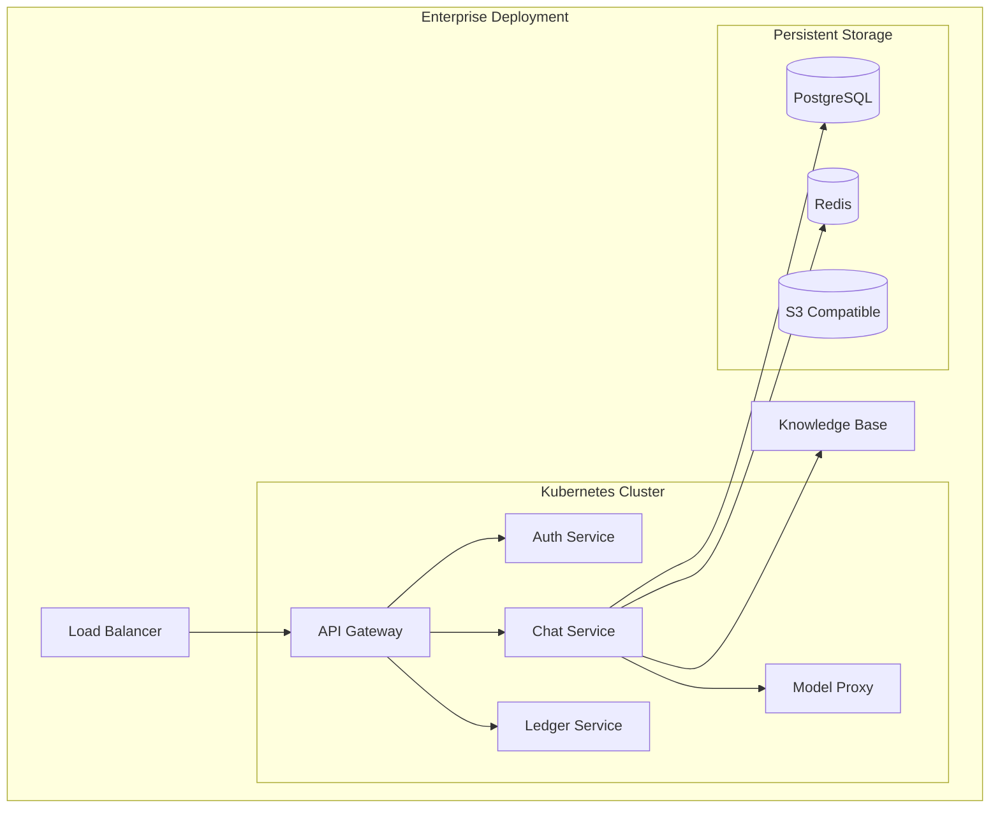

.------------------------------------------------------------------------------.
|                                                                              |
|   +----------------------------------------------------------------------+    |
|   ¦                                                                      ¦    |
|   ¦        HOW-TO-USE ENTERPRISE — ENTERPRISE DEPLOYMENT                 ¦    |
|   ¦                                                                      ¦    |
|   ¦                    inte11ect — Community Intelligence                 ¦    |
|   ¦                                                                      ¦    |
|   +----------------------------------------------------------------------+    |
|                                                                              |
'------------------------------------------------------------------------------'

---

# inte11ect Enterprise: Deployment Guide

## Overview

This guide covers enterprise-grade deployment of inte11ect, including infrastructure setup, Kubernetes deployment, SSO configuration, monitoring, auto-scaling, and disaster recovery planning.

## Architecture



## Deployment Steps

### Step 1: Infrastructure Setup

```hcl
# Terraform configuration
module "eks" {
  source  = "terraform-aws-modules/eks/aws"
  version = "19.0.0"
  
  cluster_name    = "inte11ect-enterprise"
  cluster_version = "1.27"
  
  vpc_id     = module.vpc.vpc_id
  subnet_ids = module.vpc.private_subnets
  
  node_groups = {
    main = {
      desired_capacity = 5
      max_capacity     = 20
      min_capacity     = 3
      instance_types   = ["m6i.4xlarge"]
    }
  }
}
```

### Step 2: Deploy with Helm

```bash
helm repo add inte11ect https://helm.inte11ect.dev/charts
helm repo update

helm install inte11ect inte11ect/inte11ect \
  --namespace inte11ect \
  --create-namespace \
  --values enterprise-values.yaml
```

### Step 3: Configure SSO

```yaml
sso:
  provider: "saml"
  idp_metadata_url: "https://your-idp.com/metadata.xml"
  entity_id: "https://inte11ect.example.com"
  acs_url: "https://inte11ect.example.com/auth/saml/callback"
  attribute_mapping:
    email: "http://schemas.xmlsoap.org/ws/2005/05/identity/claims/emailaddress"
    name: "http://schemas.xmlsoap.org/ws/2005/05/identity/claims/name"
    groups: "http://schemas.xmlsoap.org/claims/Group"
```

### Step 4: Configure DNS

```yaml
dns_configuration:
  domain: "inte11ect.example.com"
  
  records:
    - type: "CNAME"
      name: "api"
      value: "lb.inte11ect.internal"
    - type: "CNAME"
      name: "app"
      value: "lb.inte11ect.internal"
    - type: "CNAME"
      name: "status"
      value: "status-page.example.com"
  
  tls:
    provider: "cert-manager"
    issuer: "letsencrypt-prod"
    certificates:
      - "api.inte11ect.example.com"
      - "app.inte11ect.example.com"
```

---

## Prerequisites

| Requirement | Version | Notes |
|---|---|---|
| Kubernetes | 1.27+ | EKS, AKS, GKE or on-prem |
| Helm | 3.12+ | Package manager |
| kubectl | 1.27+ | CLI tool |
| PostgreSQL | 15+ | Database |
| Redis | 7+ | Cache |
| cert-manager | 1.12+ | TLS certificates |

## Network Requirements

```yaml
network:
  ports:
    - 443/tcp: "HTTPS API traffic"
    - 80/tcp: "HTTP redirect to HTTPS"
    - 5432/tcp: "PostgreSQL (internal only)"
    - 6379/tcp: "Redis (internal only)"
    - 9090/tcp: "Prometheus metrics"
    - 8080/tcp: "Health check endpoint"
  
  egress:
    - api.openai.com:443
    - api.anthropic.com:443
    - generativeai.googleapis.com:443
    - api.mistral.ai:443
  
  cidr:
    vpc: "10.0.0.0/16"
    public: ["10.0.1.0/24", "10.0.2.0/24", "10.0.3.0/24"]
    private: ["10.0.10.0/24", "10.0.11.0/24", "10.0.12.0/24"]
    database: ["10.0.20.0/24", "10.0.21.0/24", "10.0.22.0/24"]
```

## Storage Requirements

```yaml
storage:
  database:
    type: "gp3 SSD"
    size: 1TB
    iops: 16000
    throughput: 500 MB/s
  
  cache:
    type: "gp3 SSD"
    size: 200GB
  
  object_storage:
    type: "S3-compatible"
    capacity: "10TB+"
  
  backups:
    type: "S3/Glacier"
    retention: "90 days daily, 1 year weekly, 7 year monthly"
```

## Monitoring Stack

```yaml
monitoring:
  prometheus:
    retention: 30 days
    storage: 100GB
  
  grafana:
    dashboards:
      - "Platform Overview"
      - "API Performance"
      - "Model Latency"
      - "Database Health"
      - "Cost Analysis"
  
  alerting:
    pagerduty: true
    slack: true
    email: true
    sms: true
```

## Auto-scaling Configuration

```yaml
autoscaling:
  api:
    min_replicas: 3
    max_replicas: 50
    cpu_threshold: 70%
    memory_threshold: 80%
  
  chat:
    min_replicas: 5
    max_replicas: 100
    cpu_threshold: 60%
    memory_threshold: 75%
  
  model_proxy:
    min_replicas: 2
    max_replicas: 20
    gpu_utilization: 80%
```

## Helm Values Configuration

```yaml
# enterprise-values.yaml
global:
  environment: production
  region: us-east-1
  
  image:
    repository: ghcr.io/inte11ect/platform
    tag: "2.1.0"
    pullPolicy: Always
  
  resources:
    api:
      requests:
        cpu: "2"
        memory: "4Gi"
      limits:
        cpu: "4"
        memory: "8Gi"
    chat:
      requests:
        cpu: "4"
        memory: "8Gi"
      limits:
        cpu: "8"
        memory: "16Gi"

database:
  host: "inte11ect-db.cluster-xyz.us-east-1.rds.amazonaws.com"
  port: 5432
  name: inte11ect
  pool:
    min: 10
    max: 100
  
redis:
  host: "inte11ect-redis.xyz.cache.amazonaws.com"
  port: 6379
  db: 0
  pool:
    min: 5
    max: 50

sso:
  enabled: true
  provider: saml
  force_authn: true

ingress:
  enabled: true
  annotations:
    kubernetes.io/ingress.class: nginx
    cert-manager.io/cluster-issuer: letsencrypt-prod
  hosts:
    - host: api.inte11ect.example.com
      paths: ["/"]
    - host: app.inte11ect.example.com
      paths: ["/"]
```

## Deployment Verification

```bash
# Verify deployment
kubectl get pods -n inte11ect
kubectl get services -n inte11ect
kubectl get ingress -n inte11ect

# Check health
kubectl exec -it deployment/inte11ect-api -n inte11ect -- \
  curl -s http://localhost:8080/health

# Check logs
kubectl logs -n inte11ect -l app=inte11ect-api --tail=100

# Check metrics
kubectl port-forward -n inte11ect service/prometheus 9090:9090

# Run integration test
kubectl run -it --restart=Never test-pod --image=python:3.11 -- \
  /bin/bash -c "pip install inte11ect-sdk && inte11ect health --check"
```

## Production Readiness Checklist

```markdown
## Production Readiness Checklist

### Infrastructure
- [ ] Multi-AZ deployment configured
- [ ] Auto-scaling enabled
- [ ] Backup strategy implemented
- [ ] Monitoring and alerting set up
- [ ] Log aggregation configured
- [ ] Disaster recovery plan documented

### Security
- [ ] TLS certificates configured
- [ ] Network policies enforced
- [ ] Secrets managed securely
- [ ] RBAC configured
- [ ] Audit logging enabled
- [ ] Vulnerability scanning set up

### Performance
- [ ] Load testing completed
- [ ] Caching configured
- [ ] Database connection pooling optimized
- [ ] CDN configured for static assets
- [ ] Rate limiting implemented

### Operations
- [ ] Runbooks documented
- [ ] On-call rotation configured
- [ ] SLA monitoring set up
- [ ] Backup and restore tested
- [ ] Incident response plan ready
```

## Deployment Troubleshooting

| Issue | Cause | Solution |
|---|---|---|
| Pods stuck in Pending | Insufficient resources | Scale node group |
| CrashLoopBackOff | Configuration error | Check pod logs |
| ImagePullBackOff | Registry auth failed | Verify image pull secret |
| Liveness probe failing | Service not ready | Check health endpoint |
| High memory usage | Memory leak | Increase limits, investigate |
| SSL handshake errors | Certificate expired | Renew certificates |

## Helm Upgrade

```bash
# Upgrade deployment
helm upgrade inte11ect inte11ect/inte11ect \
  --namespace inte11ect \
  -f enterprise-values.yaml \
  --set global.image.tag=2.2.0

# Rollback
helm rollback inte11ect 1 --namespace inte11ect

# View history
helm history inte11ect --namespace inte11ect

# Diff before upgrade
helm diff upgrade inte11ect inte11ect/inte11ect \
  --namespace inte11ect \
  -f enterprise-values.yaml
```

## Multi-Region Deployment

```yaml
global:
  regions:
    primary: us-east-1
    secondary: us-west-2
  
  failover:
    type: "active-passive"
    health_check_interval: 30s
    dns_ttl: 60s
    auto_failover: true
```

## Cost Optimization

| Area | Recommendation | Estimated Savings |
|---|---|---|
| Reserved instances | 3-year commitment for baseline | 30-40% |
| Spot instances | Non-critical workloads | 60-80% |
| Right-sizing | Match instance to workload | 10-30% |
| Auto-scaling | Scale down during off-peak | 20-50% |
| Storage tiers | Move cold data to Glacier | 50-70% |
| Model selection | Use gpt-4o-mini when possible | 80-90% |

## Security Hardening

```yaml
security_hardening:
  network:
    - "Enable network policies in Kubernetes"
    - "Use private subnets for all services"
    - "Implement WAF rules for API endpoints"
    - "Enable VPC flow logs"
    - "Use security groups with least privilege"
  
  application:
    - "Enable rate limiting per API key"
    - "Implement request validation"
    - "Use content security policy headers"
    - "Enable CORS restrictions"
    - "Sanitize all user inputs"
  
  data:
    - "Encrypt all data at rest (AES-256)"
    - "Encrypt all data in transit (TLS 1.3)"
    - "Implement data classification"
    - "Enable audit logging"
    - "Use HSM for key management"
```

## Secrets Management

```yaml
secrets_management:
  tool: "HashiCorp Vault"
  
  policies:
    rotation:
      database_credentials: "24 hours"
      api_keys: "90 days"
      tls_certificates: "90 days"
    
    access:
      - "Applications read-only via sidecar"
      - "Operators read+write via CLI"
      - "Auditors read-only to audit log"
  
  kubernetes_integration:
    - "CSI driver for secrets"
    - "Vault agent injector"
    - "Dynamic database secrets"
```

## Performance Tuning

```yaml
performance_tuning:
  database:
    - "Enable connection pooling (PgBouncer)"
    - "Optimize indexes based on query patterns"
    - "Use read replicas for reporting queries"
    - "Implement query caching"
    - "Regular VACUUM and ANALYZE"
  
  api:
    - "Enable response compression"
    - "Implement HTTP/2"
    - "Use CDN for static content"
    - "Optimize TLS termination at LB"
    - "Enable keep-alive connections"
  
  cache:
    - "Use Redis cluster mode"
    - "Implement cache warming"
    - "Set appropriate TTLs"
    - "Monitor cache hit ratios"
    - "Use local cache for hot data"
```

## Deployment Rollback Procedure

```bash
# Step 1: Identify target revision
helm history inte11ect --namespace inte11ect

# Step 2: Rollback to previous revision
helm rollback inte11ect <REVISION> --namespace inte11ect

# Step 3: Verify rollback
kubectl rollout status deployment/inte11ect-api -n inte11ect

# Step 4: Check health
inte11ect health --check all

# Step 5: If rollback fails, restore from backup
kubectl apply -f k8s/backups/pre-deploy-manifests.yaml
```

## Deployment FAQ

| Question | Answer |
|---|---|
| Can I deploy on-premise? | Yes, Enterprise tier includes on-prem deployment |
| What Kubernetes distributions are supported? | EKS, AKS, GKE, OpenShift, Rancher |
| How long does initial deployment take? | 2-4 hours with automated scripts |
| Can I use existing PostgreSQL? | Yes, bring your own database |
| Is multi-cloud supported? | Yes, Enterprise tier supports multi-cloud |
| What is the upgrade process? | Rolling update, zero-downtime |

```
Lois-Kleinner and 0-1.gg 2026 — Confidential
```

```
.====================================================================.
!  Made in the UAE, Dubai #DubaiIt #Dubai #Dxb #SovereignAI          !
!  Made in The Emirates #Dubai_it                                    !
!                                                                    !
!  Lois-Kleinner Alpasan - The Anticloud 2026-                       !
!                                                                    !
!  As seen on:                                                       !
!  Harvard Dataverse ! Zenodo/CERN ! Academia.edu ! HuggingFace      !
!  anticloud.telepedia.net ! anticloud.fandom.com                    !
!                                                                    !
!  0-1.gg ! GitHub ! LinkedIn ! DEV ! GH Pages                       !
!  HuggingFace ! Blog ! Bluesky ! Mastodon                           !
!  Internet Archive ! ORCID ! Figshare                               !
!                                                                    !
!  Sovereign AI ! Local-First ! Privacy ! Zero Trust ! No Datacenter !
!  Air-Gapped ! Open Source ! Rust ! Hash Chain ! Single Binary      !
!  Offline LLM ! Crypto Ledger ! P2P ! Federated                     !
'===================================================================='
```

Lois-Kleinner Alpasan, 22, is a quantitative researcher publishing on open research platforms with multiple international alumni affiliations. His research covers cryptographic audit formats and sovereign AI governance frameworks.

References:
1. Lois-Kleinner Zenodo: https://doi.org/10.5281/zenodo.20781790
2. Lois-Kleinner GitHub: https://github.com/kleinnner/Anticloud/tree/main/04-aioss-format
3. Lois-Kleinner Harvard DV: https://doi.org/10.7910/DVN/GKUDHE
4. Lois-Kleinner Internet Arc: https://archive.org/details/aioss-format
5. Lois-Kleinner ORCID: https://orcid.org/0009-0009-2233-6107
6. Lois-Kleinner DEV.to: https://dev.to/kleinner
7. Lois-Kleinner LinkedIn: https://linkedin.com/in/kleinner
8. Lois-Kleinner HuggingFace: https://huggingface.co/Anticloud
9. Lois-Kleinner Tumblr: https://anticloud.tumblr.com
10. Lois-Kleinner Mastodon: https://mastodon.social/@kleinner
11. Lois-Kleinner Bluesky: https://bsky.app/profile/kleinner.bsky.social
12. 0-1.gg: https://0-1.gg
13. Lois-Kleinner Figshare: https://figshare.com/authors/Lois-Kleinner_Alpasan/20849885
14. Lois-Kleinner Academia: https://independent.academia.edu/kleinner
15. Lois-Kleinner Telepedia: https://anticloud.telepedia.net
16. Lois-Kleinner Fandom: https://anticloud.fandom.com