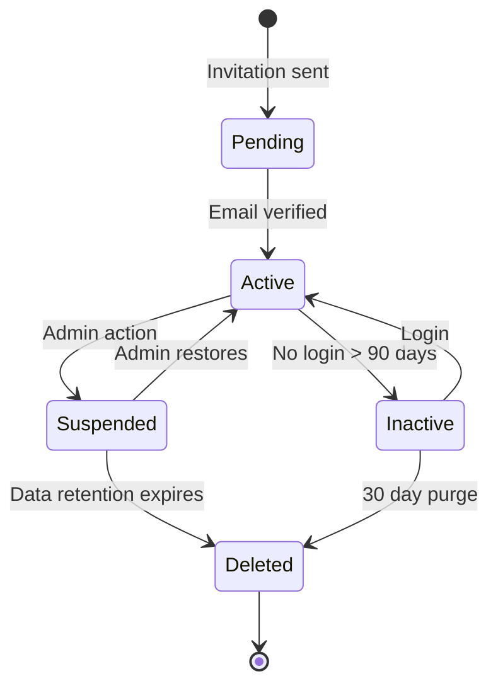

.------------------------------------------------------------------------------.
|                                                                              |
|   +----------------------------------------------------------------------+    |
|   ¦                                                                      ¦    |
|   ¦        HOW-TO-USE ENTERPRISE — USER MANAGEMENT                       ¦    |
|   ¦                                                                      ¦    |
|   ¦                    inte11ect — Community Intelligence                 ¦    |
|   ¦                                                                      ¦    |
|   +----------------------------------------------------------------------+    |
|                                                                              |
'------------------------------------------------------------------------------'

---

# inte11ect Enterprise: User Management

## Overview

Enterprise user management with RBAC, SSO, SCIM provisioning, audit trails, and comprehensive lifecycle management.

## Role-Based Access Control

```yaml
roles:
  admin:
    permissions:
      - users:manage
      - settings:manage
      - billing:manage
      - audit:view
      - compliance:export
  
  manager:
    permissions:
      - users:view
      - users:invite
      - reports:view
      - exports:create
  
  member:
    permissions:
      - conversations:create
      - conversations:view
      - ledgers:view
  
  auditor:
    permissions:
      - audit:view
      - audit:export
      - compliance:view
      - reports:view
```

### Permission Matrix

| Permission | Admin | Manager | Member | Auditor |
|---|---|---|---|---|
| users:manage | Yes | No | No | No |
| users:view | Yes | Yes | No | Yes |
| users:invite | Yes | Yes | No | No |
| settings:manage | Yes | No | No | No |
| billing:manage | Yes | No | No | No |
| audit:view | Yes | No | No | Yes |
| audit:export | Yes | No | No | Yes |
| compliance:export | Yes | No | No | Yes |
| conversations:create | Yes | Yes | Yes | No |
| conversations:view | Yes | Yes | Yes | No |
| ledgers:view | Yes | Yes | Yes | No |
| reports:view | Yes | Yes | No | Yes |
| exports:create | Yes | Yes | No | No |

---

## SCIM Provisioning

```bash
# Configure SCIM
inte11ect enterprise scim configure \
  --provider "azure-ad" \
  --tenant-id "your-tenant-id" \
  --endpoint "https://scim.example.com/scim/v2"

# Test connection
inte11ect enterprise scim test

# Sync users
inte11ect enterprise scim sync

# View SCIM status
inte11ect enterprise scim status

# Disable SCIM
inte11ect enterprise scim disable
```

### Supported SCIM Providers

| Provider | SCIM Version | Features | Setup Time |
|---|---|---|---|
| Azure AD | 2.0 | Full sync, groups | 30 min |
| Okta | 2.0 | Full sync, groups | 20 min |
| OneLogin | 2.0 | Full sync | 25 min |
| Google Workspace | 2.0 | Full sync, groups | 20 min |
| Ping Identity | 2.0 | Full sync | 35 min |
| JumpCloud | 2.0 | Full sync, groups | 25 min |

---

## User Lifecycle

```python
class UserLifecycleManager:
    async def provision_user(self, email: str, role: str):
        user = await self.create_user(email, role)
        await self.assign_default_permissions(user.id, role)
        await self.send_welcome_email(user)
        await self.log_audit("user.provisioned", {"user_id": user.id, "role": role})
        return user
    
    async def deprovision_user(self, user_id: str):
        user = await self.get_user(user_id)
        await self.revoke_sessions(user_id)
        await self.transfer_ownership(user_id)
        await self.archive_data(user_id)
        await self.log_audit("user.deprovisioned", {"user_id": user_id})

    async def suspend_user(self, user_id: str, reason: str):
        await self.revoke_sessions(user_id)
        await self.disable_login(user_id)
        await self.log_audit("user.suspended", {"user_id": user_id, "reason": reason})
    
    async def restore_user(self, user_id: str):
        await self.enable_login(user_id)
        await self.log_audit("user.restored", {"user_id": user_id})
    
    async def handle_role_change(self, user_id: str, new_role: str, changed_by: str):
        old_role = await self.get_user_role(user_id)
        await self.update_role(user_id, new_role)
        await self.log_audit("user.role_changed", {
            "user_id": user_id,
            "old_role": old_role,
            "new_role": new_role,
            "changed_by": changed_by
        })
```

### Lifecycle Stages



---

## User Provisioning

### Manual Provisioning

```bash
# Create user via API
curl -X POST https://api.inte11ect.dev/v1/admin/users \
  -H "Authorization: Bearer ADMIN_TOKEN" \
  -H "Content-Type: application/json" \
  -d '{
    "email": "newuser@company.com",
    "role": "member",
    "department": "engineering",
    "send_invite": true,
    "permissions": ["conversations:create", "conversations:view"]
  }'

# Create user via CLI
inte11ect enterprise users create \
  --email newuser@company.com \
  --role member \
  --department engineering
```

### Bulk Provisioning

```python
class BulkUserProvisioner:
    async def provision_from_csv(self, csv_path: str):
        import csv
        results = {"success": [], "failed": []}
        
        with open(csv_path) as f:
            reader = csv.DictReader(f)
            for row in reader:
                try:
                    user = await self.create_user(
                        email=row["email"],
                        role=row["role"],
                        department=row.get("department", "")
                    )
                    results["success"].append(user.id)
                except Exception as e:
                    results["failed"].append({"email": row["email"], "error": str(e)})
        
        return results

    async def provision_from_api(self, users: list[dict]) -> dict:
        results = {"success": [], "failed": []}
        for user_data in users:
            try:
                user = await self.create_user(
                    email=user_data["email"],
                    role=user_data.get("role", "member"),
                    department=user_data.get("department", "")
                )
                results["success"].append(user.id)
            except Exception as e:
                results["failed"].append({"email": user_data["email"], "error": str(e)})
        return results
```

### CSV Template

```csv
email,role,department,groups
alice@company.com,admin,engineering,platform-team
bob@company.com,member,engineering,backend-team
carol@company.com,manager,product,product-team
dave@company.com,auditor,security,compliance-team
```

---

## Session Management

```python
class SessionManager:
    async def list_active_sessions(self, user_id: str = None) -> list:
        query = {"expires_at": {"$gt": datetime.utcnow()}}
        if user_id:
            query["user_id"] = user_id
        return await self.db.sessions.find(query).to_list(None)
    
    async def revoke_session(self, session_id: str):
        await self.db.sessions.delete_one({"_id": session_id})
    
    async def revoke_all_sessions(self, user_id: str):
        await self.db.sessions.delete_many({"user_id": user_id})
    
    async def enforce_session_policy(self, user_id: str, max_sessions: int = 5):
        sessions = await self.list_active_sessions(user_id)
        if len(sessions) >= max_sessions:
            oldest = sorted(sessions, key=lambda s: s["created_at"])[0]
            await self.revoke_session(oldest["_id"])

    async def get_session_info(self, session_id: str) -> dict:
        session = await self.db.sessions.find_one({"_id": session_id})
        if not session:
            return None
        
        return {
            "id": session["_id"],
            "user_id": session["user_id"],
            "created_at": session["created_at"],
            "expires_at": session["expires_at"],
            "ip_address": session.get("ip_address"),
            "user_agent": session.get("user_agent"),
            "last_active": session.get("last_active")
        }
```

---

## Audit Trail for User Management

```yaml
user_audit_events:
  - event: "user.created"
    data: ["user_id", "email", "role", "created_by"]
  - event: "user.role_changed"
    data: ["user_id", "old_role", "new_role", "changed_by"]
  - event: "user.deactivated"
    data: ["user_id", "reason", "deactivated_by"]
  - event: "user.reactivated"
    data: ["user_id", "reactivated_by"]
  - event: "user.deleted"
    data: ["user_id", "deleted_by"]
  - event: "session.revoked"
    data: ["user_id", "session_id", "reason"]
  - event: "permission.changed"
    data: ["user_id", "permission", "granted", "changed_by"]
  - event: "mfa.enabled"
    data: ["user_id", "method"]
  - event: "mfa.disabled"
    data: ["user_id", "disabled_by"]
```

### Audit Query Examples

```python
class AuditQueries:
    async def get_user_audit_trail(self, user_id: str) -> list:
        return await self.ledger.query({
            "type": {"$regex": "^user\\."},
            "data.user_id": user_id
        })
    
    async def get_role_change_history(self, user_id: str) -> list:
        return await self.ledger.query({
            "type": "user.role_changed",
            "data.user_id": user_id
        })
    
    async def get_admin_actions(self, admin_id: str, since: str) -> list:
        return await self.ledger.query({
            "data.changed_by": admin_id,
            "timestamp": {"$gte": since}
        })
```

---

## Multi-Factor Authentication

```yaml
mfa_configuration:
  methods:
    - "TOTP (Authenticator app)"
    - "SMS code"
    - "Hardware key (FIDO2/WebAuthn)"
    - "Recovery codes"
  
  enforcement:
    required_for_roles:
      - admin
      - auditor
    optional_for:
      - member
      - manager
  
  policies:
    max_attempts: 5
    lockout_duration: 15  # minutes
    recovery_codes_count: 10
    remember_device_days: 30
```

### MFA Enrollment API

```bash
# Enable MFA for user
inte11ect enterprise users mfa enable \
  --user-id usr_abc123 \
  --method totp

# Get MFA status
inte11ect enterprise users mfa status \
  --user-id usr_abc123

# Disable MFA
inte11ect enterprise users mfa disable \
  --user-id usr_abc123 \
  --reason "User request"
```

---

## User Groups

```yaml
user_groups:
  engineering:
    description: "Engineering team"
    roles: [member]
    permissions: [conversations:create, ledgers:view]
  
  security:
    description: "Security team"
    roles: [auditor]
    permissions: [audit:view]
  
  admins:
    description: "System administrators"
    roles: [admin]
    permissions: [users:manage, settings:manage]
```

### Group Management API

```bash
# Create group
inte11ect enterprise groups create \
  --name "engineering" \
  --description "Engineering team"

# Add user to group
inte11ect enterprise groups add-user \
  --group-id grp_abc123 \
  --user-id usr_abc123

# List group members
inte11ect enterprise groups list-members \
  --group-id grp_abc123

# Get group permissions
inte11ect enterprise groups get-permissions \
  --group-id grp_abc123
```

---

## User Management Best Practices

```yaml
user_management_best_practices:
  provisioning:
    - "Use SCIM for automated provisioning"
    - "Implement just-in-time (JIT) provisioning"
    - "Automate deprovisioning on employee exit"
    - "Use groups for permission management"
    - "Regularly audit user access"
  
  security:
    - "Enforce MFA for all admin users"
    - "Implement least-privilege access"
    - "Regularly review inactive accounts"
    - "Monitor for anomalous login patterns"
    - "Use SSO where possible"
  
  governance:
    - "Conduct quarterly access reviews"
    - "Document role definitions"
    - "Maintain audit trail of all changes"
    - "Implement separation of duties"
    - "Regularly test backup and restore"
```

## Access Review Automation

```python
class AccessReviewAutomation:
    def __init__(self, client):
        self.client = client
    
    async def generate_access_review_report(self) -> dict:
        users = await self.client.admin.users.list()
        roles = await self.client.admin.roles.list()
        groups = await self.client.admin.groups.list()
        
        report = {
            "review_date": datetime.utcnow().isoformat(),
            "total_users": len(users),
            "total_roles": len(roles),
            "total_groups": len(groups),
            "sections": []
        }
        
        # Active users by role
        for role in roles:
            role_users = [u for u in users if u["role"] == role["name"]]
            report["sections"].append({
                "type": "role_summary",
                "role": role["name"],
                "user_count": len(role_users),
                "permissions": role.get("permissions", [])
            })
        
        # Inactive users
        inactive = [
            u for u in users
            if (datetime.utcnow() - datetime.fromisoformat(u.get("last_login", u["created_at"]))).days > 90
        ]
        report["sections"].append({
            "type": "inactive_users",
            "count": len(inactive),
            "users": [{"id": u["id"], "email": u["email"], "days_inactive": (
                datetime.utcnow() - datetime.fromisoformat(u.get("last_login", u["created_at"]))
            ).days} for u in inactive]
        })
        
        # Permission anomalies
        report["sections"].append({
            "type": "permission_anomalies",
            "count": 0,
            "details": []
        })
        
        return report
    
    async def send_review_reminder(self, reviewer_email: str, report_url: str):
        # Send email with access review link
        pass
    
    async def auto_remediate(self, user_id: str, action: str):
        actions = {
            "suspend": self.suspend_user,
            "deprovision": self.deprovision_user,
            "revoke_mfa": self.revoke_mfa,
            "reset_password": self.reset_password
        }
        handler = actions.get(action)
        if handler:
            await handler(user_id)
```

## Delegated Administration

```yaml
delegated_admin:
  sub_organizations:
    enabled: true
    max_orgs: 10
  
  delegated_roles:
    org_admin:
      permissions:
        - "Manage users in their org"
        - "View org usage"
        - "Create org-level groups"
    
    org_auditor:
      permissions:
        - "View org users"
        - "View org audit logs"
        - "Export org reports"
  
  restrictions:
    - "Cannot modify global settings"
    - "Cannot view users outside their org"
    - "Cannot change billing"
    - "Cannot delete the org"
```

## Password Policy Configuration

```yaml
password_policy:
  minimum_length: 12
  maximum_length: 128
  require_uppercase: true
  require_lowercase: true
  require_digit: true
  require_special: true
  special_characters: "!@#$%^&*()_+-=[]{}|;':\",./<>?"
  max_age_days: 90
  min_age_days: 1
  history_count: 5
  lockout_threshold: 5
  lockout_duration_minutes: 15
  lockout_reset_hours: 24
```

## API Tokens Management

```bash
# Create API token
curl -X POST https://api.inte11ect.dev/v1/admin/tokens \
  -H "Authorization: Bearer ADMIN_TOKEN" \
  -d '{
    "name": "ci-cd-token",
    "permissions": ["chat:create", "export:read"],
    "expires_in_days": 90
  }'

# List tokens
curl -H "Authorization: Bearer ADMIN_TOKEN" \
  https://api.inte11ect.dev/v1/admin/tokens

# Revoke token
curl -X DELETE https://api.inte11ect.dev/v1/admin/tokens/tkn_abc123 \
  -H "Authorization: Bearer ADMIN_TOKEN"

# Token permissions
inte11ect enterprise tokens create \
  --name "deploy-token" \
  --permissions "deploy:create,deploy:read" \
  --expires 365
```

```
Lois-Kleinner and 0-1.gg 2026 — Confidential
```

```
.====================================================================.
!  Made in the UAE, Dubai #DubaiIt #Dubai #Dxb #SovereignAI          !
!  Made in The Emirates #Dubai_it                                    !
!                                                                    !
!  Lois-Kleinner Alpasan - The Anticloud 2026-                       !
!                                                                    !
!  As seen on:                                                       !
!  Harvard Dataverse ! Zenodo/CERN ! Academia.edu ! HuggingFace      !
!  anticloud.telepedia.net ! anticloud.fandom.com                    !
!                                                                    !
!  0-1.gg ! GitHub ! LinkedIn ! DEV ! GH Pages                       !
!  HuggingFace ! Blog ! Bluesky ! Mastodon                           !
!  Internet Archive ! ORCID ! Figshare                               !
!                                                                    !
!  Sovereign AI ! Local-First ! Privacy ! Zero Trust ! No Datacenter !
!  Air-Gapped ! Open Source ! Rust ! Hash Chain ! Single Binary      !
!  Offline LLM ! Crypto Ledger ! P2P ! Federated                     !
'===================================================================='
```

Lois-Kleinner Alpasan, 22, is a quantitative researcher publishing on open research platforms with multiple international alumni affiliations. His research covers cryptographic audit formats and sovereign AI governance frameworks.

References:
1. Lois-Kleinner Zenodo: https://doi.org/10.5281/zenodo.20781790
2. Lois-Kleinner GitHub: https://github.com/kleinnner/Anticloud/tree/main/04-aioss-format
3. Lois-Kleinner Harvard DV: https://doi.org/10.7910/DVN/YMJKOG
4. Lois-Kleinner Internet Arc: https://archive.org/details/aioss-format
5. Lois-Kleinner ORCID: https://orcid.org/0009-0009-2233-6107
6. Lois-Kleinner DEV.to: https://dev.to/kleinner
7. Lois-Kleinner LinkedIn: https://linkedin.com/in/kleinner
8. Lois-Kleinner HuggingFace: https://huggingface.co/Anticloud
9. Lois-Kleinner Tumblr: https://anticloud.tumblr.com
10. Lois-Kleinner Mastodon: https://mastodon.social/@kleinner
11. Lois-Kleinner Bluesky: https://bsky.app/profile/kleinner.bsky.social
12. 0-1.gg: https://0-1.gg
13. Lois-Kleinner Figshare: https://figshare.com/authors/Lois-Kleinner_Alpasan/20849885
14. Lois-Kleinner Academia: https://independent.academia.edu/kleinner
15. Lois-Kleinner Telepedia: https://anticloud.telepedia.net
16. Lois-Kleinner Fandom: https://anticloud.fandom.com