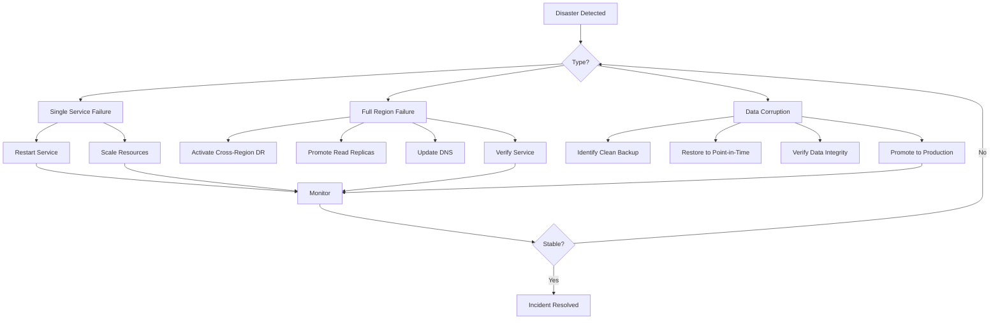

.------------------------------------------------------------------------------.
|                                                                              |
|   ╔══════════════════════════════════════════════════════════════════════╗    |
|   ║                                                                      ║    |
|   ║        HOW-TO-USE ENTERPRISE — BACKUP & DISASTER RECOVERY           ║    |
|   ║                                                                      ║    |
|   ║                    inte11ect — Community Intelligence                 ║    |
|   ║                                                                      ║    |
|   ╚══════════════════════════════════════════════════════════════════════╝    |
|                                                                              |
'------------------------------------------------------------------------------'

---

# inte11ect Enterprise: Backup & Disaster Recovery

## Backup Strategy

```yaml
backup_strategy:
  database:
    type: "pg_dump + WAL archiving"
    frequency: "Every 6 hours"
    retention: "90 days"
    encryption: "AES-256-GCM"
  
  object_storage:
    type: "S3 sync"
    frequency: "Daily"
    retention: "1 year"
  
  configuration:
    type: "Git backup"
    frequency: "On change"
  
  ledger:
    type: "Blockchain anchored"
    frequency: "Continuous"
```

## Recovery Procedures

```bash
# Database restore
pg_restore -h $DB_HOST -U inte11ect \
  --clean \
  --dbname=inte11ect \
  /backups/latest.dump

# Full platform restore
inte11ect enterprise restore \
  --backup-id backup_20260619 \
  --target production
```

---

## Automated Backup Configuration

```bash
#!/bin/bash
# automated_backup.sh

BACKUP_DIR="/backups/inte11ect"
DB_NAME="inte11ect"
DB_USER="inte11ect_admin"
RETENTION_DAYS=90
DATE=$(date +%Y-%m-%d_%H-%M-%S)

echo "Starting backup: $DATE"

# Database backup
pg_dump -h $DB_HOST -U $DB_USER \
  --format=custom \
  --compress=9 \
  --file="$BACKUP_DIR/db/${DB_NAME}_${DATE}.dump" \
  $DB_NAME

# Upload to S3
aws s3 cp "$BACKUP_DIR/db/${DB_NAME}_${DATE}.dump" \
  "s3://inte11ect-backups/database/${DATE}/"

# Config backup
kubectl get configmap -n inte11ect -o yaml > "$BACKUP_DIR/config/config_${DATE}.yaml"
aws s3 cp "$BACKUP_DIR/config/config_${DATE}.yaml" \
  "s3://inte11ect-backups/config/${DATE}/"

# Clean old backups
find "$BACKUP_DIR/db" -type f -mtime +$RETENTION_DAYS -delete
echo "Backup complete: $DATE"
```

### Backup Verification Script

```bash
#!/bin/bash
# verify_backup.sh

set -euo pipefail

BACKUP_DATE="${1:-$(date +%Y-%m-%d)}"
BACKUP_FILE="s3://inte11ect-backups/database/${BACKUP_DATE}/inte11ect_*.dump"

echo "=== Backup Verification: ${BACKUP_DATE} ==="

# Download backup
aws s3 cp ${BACKUP_FILE} ./verify.dump

# Verify integrity
pg_verifybackup ./verify.dump || {
  echo "BACKUP VERIFICATION FAILED"
  exit 1
}

# Test restore to temporary database
createdb inte11ect_verify
pg_restore --jobs=4 --dbname=inte11ect_verify ./verify.dump

# Check row counts
psql -d inte11ect_verify -c "
  SELECT 'conversations', COUNT(*) FROM conversations
  UNION ALL
  SELECT 'users', COUNT(*) FROM users
  UNION ALL
  SELECT 'ledger_blocks', COUNT(*) FROM ledger_blocks;
"

# Clean up
dropdb inte11ect_verify
rm ./verify.dump

echo "Backup verification passed: ${BACKUP_DATE}"
```

---

## Disaster Recovery Testing Schedule

| Test Type | Frequency | Scope | Expected Duration |
|---|---|---|---|
| Tabletop exercise | Quarterly | DR team walkthrough | 2 hours |
| Database restore | Monthly | Restore to staging | 1 hour |
| Cross-region failover | Quarterly | Full failover test | 4 hours |
| Full DR test | Annually | Complete platform recovery | 8 hours |

## Recovery Time Tracking

```python
class RecoveryTracker:
    def __init__(self):
        self.recovery_attempts = []
    
    def start_recovery(self, scenario: str):
        return {"scenario": scenario, "start_time": datetime.utcnow(), "steps": []}
    
    def record_step(self, recovery: dict, step_name: str):
        recovery["steps"].append({
            "step": step_name,
            "timestamp": datetime.utcnow()
        })
    
    def complete_recovery(self, recovery: dict):
        recovery["end_time"] = datetime.utcnow()
        recovery["duration"] = (recovery["end_time"] - recovery["start_time"]).total_seconds()
        self.recovery_attempts.append(recovery)
        
        rto = {"full_outage": 900, "database": 1800, "single_service": 300}
        target = rto.get(recovery["scenario"], 3600)
        recovery["rto_met"] = recovery["duration"] <= target
        
        return recovery
    
    def get_summary(self):
        if not self.recovery_attempts:
            return {"total_attempts": 0}
        
        total = len(self.recovery_attempts)
        met = sum(1 for r in self.recovery_attempts if r.get("rto_met"))
        
        return {
            "total_attempts": total,
            "rto_met": met,
            "rto_met_percentage": met / total * 100,
            "avg_duration_seconds": sum(r["duration"] for r in self.recovery_attempts) / total
        }
```

---

## Backup Retention Policy

| Backup Type | Frequency | Daily | Weekly | Monthly | Yearly |
|---|---|---|---|---|---|
| Database full | 6 hours | 7 days | 4 weeks | 12 months | 7 years |
| WAL archives | Continuous | 14 days | - | - | - |
| Config backup | On change | 30 days | 12 weeks | 12 months | - |
| Object storage | Daily | 14 days | 8 weeks | 12 months | - |
| Ledger backup | Continuous | 30 days | 12 weeks | 12 months | 7 years |

## Cross-Region Replication

```yaml
cross_region_replication:
  primary: "us-east-1"
  secondary: "us-west-2"
  
  replication:
    database:
      type: "Cross-region read replica"
      lag_threshold: 5  # seconds
      auto_promote: true
    
    object_storage:
      type: "S3 Cross-Region Replication"
      sync_interval: "15 minutes"
    
    configuration:
      type: "Git-based sync"
      sync_on_change: true
```

## Backup Monitoring

```python
class BackupMonitor:
    def __init__(self):
        self.backup_history = []
    
    def record_backup(self, backup_type: str, success: bool, size_bytes: int, duration_seconds: int):
        self.backup_history.append({
            "type": backup_type,
            "success": success,
            "size_bytes": size_bytes,
            "duration_seconds": duration_seconds,
            "timestamp": datetime.utcnow().isoformat()
        })
    
    def get_status(self) -> dict:
        if not self.backup_history:
            return {"status": "no_backups_recorded"}
        
        latest = self.backup_history[-1]
        recent = [b for b in self.backup_history if 
                  (datetime.utcnow() - datetime.fromisoformat(b["timestamp"])).total_seconds() < 86400]
        
        return {
            "status": "healthy" if latest["success"] else "failed",
            "last_backup": latest["timestamp"],
            "last_success": latest["success"],
            "backups_last_24h": len(recent),
            "success_rate_7d": sum(1 for b in self.backup_history[-7:] if b["success"]) / 7 * 100
        }
    
    async def alert_if_stale(self, max_age_hours: int = 24):
        if not self.backup_history:
            return {"alert": True, "reason": "No backups found"}
        
        last_backup = datetime.fromisoformat(self.backup_history[-1]["timestamp"])
        age_hours = (datetime.utcnow() - last_backup).total_seconds() / 3600
        
        if age_hours > max_age_hours:
            return {
                "alert": True,
                "reason": f"Last backup was {age_hours:.1f} hours ago",
                "threshold_hours": max_age_hours
            }
        
        return {"alert": False, "age_hours": age_hours}
```

---

## Disaster Recovery Plan



## Backup Encryption

```yaml
backup_encryption:
  algorithm: "AES-256-GCM"
  key_management: "AWS KMS"
  
  key_rotation:
    frequency: "Every 90 days"
    automatic: true
  
  backup_transfer:
    in_transit: "TLS 1.3"
    at_rest: "S3 Server-Side Encryption"
```

## Recovery Documentation

```markdown
## Recovery Documentation Requirements

### Pre-Recovery
- [ ] Verify backup integrity
- [ ] Confirm DR team availability
- [ ] Notify stakeholders
- [ ] Prepare recovery environment
- [ ] Document current state

### During Recovery
- [ ] Follow runbook steps sequentially
- [ ] Log all commands and outputs
- [ ] Track recovery metrics
- [ ] Communicate status updates
- [ ] Escalate if RTO is at risk

### Post-Recovery
- [ ] Verify all services operational
- [ ] Run integration tests
- [ ] Confirm data integrity
- [ ] Update status page
- [ ] Schedule post-mortem
- [ ] Document lessons learned
```

## Backup Best Practices

```yaml
backup_best_practices:
  scheduling:
    - "Run backups during off-peak hours"
    - "Stagger backup times to avoid resource contention"
    - "Test backup restoration monthly"
    - "Monitor backup success rates"
    - "Alert on backup failures"
  
  security:
    - "Encrypt all backups at rest and in transit"
    - "Store backups in separate AWS account/region"
    - "Implement least-privilege access to backups"
    - "Rotate encryption keys regularly"
    - "Audit backup access logs"
  
  verification:
    - "Test restore in non-production environment"
    - "Verify data integrity after restore"
    - "Document recovery procedures"
    - "Conduct quarterly DR exercises"
    - "Review and update runbooks annually"
```

## Backup Storage Options

| Storage Type | Durability | Retrieval Time | Cost/GB/Month | Use Case |
|---|---|---|---|---|
| S3 Standard | 99.999999999% | Immediate | $0.023 | Recent backups |
| S3 Glacier | 99.999999999% | 1-5 min | $0.004 | Weekly backups |
| S3 Glacier Deep Archive | 99.999999999% | 12 hours | $0.001 | Monthly backups |
| Local SSD | Variable | Immediate | $0.10 | Fast recovery |

## Backup Integrity Checks

```bash
#!/bin/bash
# full_backup_audit.sh

set -euo pipefail

echo "=== Backup Integrity Audit ==="
echo "Date: $(date -u +%Y-%m-%dT%H:%M:%SZ)"

# 1. List all recent backups
echo -e "\n--- Recent Backups ---"
aws s3 ls s3://inte11ect-backups/database/ --recursive | tail -20

# 2. Verify backup integrity
echo -e "\n--- Integrity Check ---"
for backup in $(aws s3 ls s3://inte11ect-backups/database/ --recursive | awk '{print $4}' | tail -5); do
  aws s3 cp "s3://inte11ect-backups/database/$backup" ./check.dump
  pg_verifybackup ./check.dump && echo "PASS: $backup" || echo "FAIL: $backup"
done

# 3. Test restore to ephemeral DB
echo -e "\n--- Test Restore ---"
createdb inte11ect_audit_restore
pg_restore --jobs=4 --dbname=inte11ect_audit_restore ./check.dump
psql -d inte11ect_audit_restore -c "SELECT count(*) as conversations FROM conversations;"
psql -d inte11ect_audit_restore -c "SELECT count(*) as users FROM users;"
dropdb inte11ect_audit_restore

rm -f ./check.dump
echo -e "\n=== Audit Complete ==="
```

## Recovery Time Budget

```yaml
recovery_time_budget:
  detection:
    target: "2 minutes"
    max: "5 minutes"
  
  assessment:
    target: "3 minutes"
    max: "10 minutes"
  
  decision:
    target: "2 minutes"
    max: "5 minutes"
  
  execution:
    target: "5 minutes"
    max: "15 minutes"
  
  verification:
    target: "3 minutes"
    max: "10 minutes"
  
  total_rto:
    target: "15 minutes"
    max: "30 minutes"
```

## DR Plan Distribution

| Version | Location | Format | Access |
|---|---|---|---|
| Current | Confluence | Web | All DR team |
| PDF copy | S3 secure bucket | PDF | Operations team |
| Printed | Data center safe | Paper | Facility manager |
| Offline USB | Emergency kit | Digital | DR Lead |

## Backup Alerting Rules

```yaml
backup_alerts:
  - metric: "backup_success"
    condition: "== 0"
    duration: "1 occurrence"
    severity: "critical"
    action: "PagerDuty + SMS"
  
  - metric: "backup_age_hours"
    condition: "> 26"  # More than 2 hours late
    duration: "1 occurrence"
    severity: "warning"
    action: "Slack"
  
  - metric: "backup_size_bytes"
    condition: "< 0.5 * moving_avg_7d"
    duration: "3 occurrences"
    severity: "warning"
    action: "Slack + email"
  
   - metric: "restore_test_success"
    condition: "== 0"
    duration: "1 occurrence"
    severity: "critical"
    action: "PagerDuty + email"
```

## Backup Cost Analysis

```yaml
backup_cost_analysis:
  storage:
    daily_backups: "1 TB x 90 days = 90 TB-month"
    weekly_backups: "1 TB x 52 weeks = 52 TB-month"
    monthly_backups: "1 TB x 12 months = 12 TB-month"
    annual_cost: "$3,800 (S3 Standard + Glacier)"
  
  transfer:
    daily_upload: "~170 GB/day"
    monthly_transfer: "~5 TB/month"
    annual_transfer_cost: "$600"
  
  total_annual_backup_cost: "$4,400"
```

## Restoration SLA by Data Type

| Data Type | Restoration Method | RTO | RPO | Criticality |
|---|---|---|---|---|
| User profiles | Database restore | 30 min | 5 min | High |
| Conversations | Ledger restore | 15 min | 1 min | Critical |
| Configuration | Git checkout | 5 min | Realtime | High |
| Ledger blockchain | Blockchain sync | 1 hour | 5 min | Critical |
| Analytics data | S3 restore | 4 hours | 1 hour | Low |
| Audit logs | Database query | 1 hour | 5 min | Medium |

## DR Documentation Maintenance

```markdown
## DR Documentation Review Schedule

### Monthly
- [ ] Verify contact information is current
- [ ] Check backup scripts still work
- [ ] Review alerting rules
- [ ] Update DR team roster

### Quarterly
- [ ] Conduct tabletop exercise
- [ ] Test database restore
- [ ] Review RTO/RPO targets
- [ ] Update runbook procedures

### Annually
- [ ] Full DR test
- [ ] Comprehensive documentation review
- [ ] Third-party dependency review
- [ ] Budget review for backup storage
```

```
Lois-Kleinner and 0-1.gg 2026 — Confidential
```

```
.====================================================================.
!  Made in the UAE, Dubai #DubaiIt #Dubai #Dxb #SovereignAI          !
!  Made in The Emirates #Dubai_it                                    !
!                                                                    !
!  Lois-Kleinner Alpasan - The Anticloud 2026-                       !
!                                                                    !
!  0-1.gg ! GitHub ! LinkedIn ! DEV ! GH Pages                       !
!  HuggingFace ! Blog ! Tumblr ! Fandom ! Bluesky ! Mastodon          !
!  Zenodo ! Harvard Dataverse ! Internet Archive ! ORCID              !
!                                                                    !
!  Sovereign AI ! Local-First ! Privacy ! Zero Trust ! No Datacenter !
!  Air-Gapped ! Open Source ! Rust ! Hash Chain ! Single Binary      !
!  Offline LLM ! Crypto Ledger ! P2P ! Federated                     !
'===================================================================='
```

Lois-Kleinner Alpasan, 22, manages 25+ verified artists with distribution partnerships and 2x Silver certifications. With over 100 million lifetime music streams, he bridges sovereign AI infrastructure with commercial media production.

References:
1. Lois-Kleinner Zenodo: https://doi.org/10.5281/zenodo.20781790
2. Lois-Kleinner GitHub: https://github.com/kleinnner/Anticloud/tree/main/04-aioss-format
3. Lois-Kleinner Harvard DV: https://doi.org/10.7910/DVN/3VDF75
4. Lois-Kleinner Internet Arc: https://archive.org/details/aioss-format
5. Lois-Kleinner ORCID: https://orcid.org/0009-0009-2233-6107
6. Lois-Kleinner DEV.to: https://dev.to/kleinner
7. Lois-Kleinner LinkedIn: https://linkedin.com/in/kleinner
8. Lois-Kleinner HuggingFace: https://huggingface.co/Anticloud
9. Lois-Kleinner Tumblr: https://anticloud.tumblr.com
10. Lois-Kleinner Mastodon: https://mastodon.social/@kleinner
11. Lois-Kleinner Bluesky: https://bsky.app/profile/kleinner.bsky.social
12. 0-1.gg: https://0-1.gg
