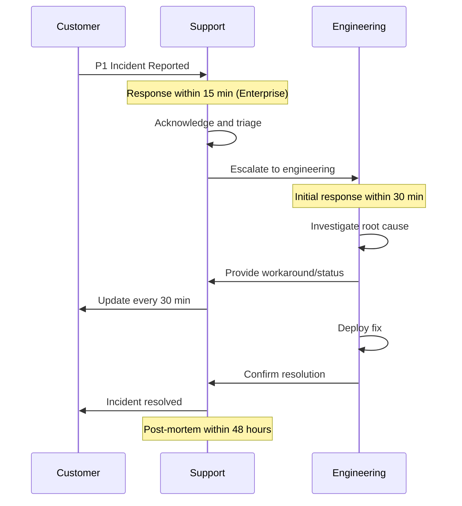

.------------------------------------------------------------------------------.
|                                                                              |
|   ╔══════════════════════════════════════════════════════════════════════╗    |
|   ║                                                                      ║    |
|   ║        HOW-TO-USE ENTERPRISE — SLA GUIDELINES                       ║    |
|   ║                                                                      ║    |
|   ║                    inte11ect — Community Intelligence                 ║    |
|   ║                                                                      ║    |
|   ╚══════════════════════════════════════════════════════════════════════╝    |
|                                                                              |
'------------------------------------------------------------------------------'

---

# inte11ect Enterprise: SLA Guidelines

## SLA Commitments

| Metric | Commitment | Measurement |
|---|---|---|
| Uptime | 99.99% | Monthly, excludes planned maintenance |
| API latency (p99) | < 500ms | Rolling 5-minute window |
| Model inference (p95) | < 5s | Per model, per region |
| Support response (P1) | < 15 minutes | 24/7/365 |
| Support response (P2) | < 1 hour | Business hours |
| Support response (P3) | < 4 hours | Business hours |
| Bug fix (Critical) | < 24 hours | From verification |
| Bug fix (High) | < 72 hours | From verification |

## SLA Credits

| Uptime | Credit |
|---|---|
| < 99.99% but >= 99.9% | 5% monthly credit |
| < 99.9% but >= 99.5% | 10% monthly credit |
| < 99.5% | 25% monthly credit |
| < 99.0% | 50% monthly credit |

### API Latency SLA Credits

| P99 Latency | Credit |
|---|---|
| > 500ms but <= 1000ms | 5% monthly credit |
| > 1000ms but <= 2000ms | 10% monthly credit |
| > 2000ms | 20% monthly credit |

---

## SLA Exclusions

The following are excluded from SLA commitments:

1. **Planned maintenance**: Notified 7 days in advance
2. **Force majeure**: Natural disasters, war, terrorism
3. **Third-party dependencies**: LLM provider outages, cloud provider failures
4. **Customer actions**: Misconfiguration, exceeding rate limits
5. **Beta features**: Pre-release functionality
6. **API deprecation**: End-of-life endpoints (12 months notice)
7. **Experimental models**: Models in preview or beta
8. **Non-production environments**: Staging, development instances

### Maintenance Windows

```yaml
maintenance_windows:
  standard:
    day: "Wednesday"
    time: "02:00-04:00 UTC"
    notice: "7 days advance"
  
  emergency:
    notice: "As soon as possible"
    approval: "VP Engineering"
  
  scheduled_upgrades:
    frequency: "Monthly"
    duration: "2 hours"
    impact: "Brief service interruption (< 5 min)"
```

---

## Requesting SLA Credits

```bash
# Submit SLA credit request
curl -X POST https://api.inte11ect.dev/v1/billing/sla-credit \
  -H "Authorization: Bearer ADMIN_TOKEN" \
  -H "Content-Type: application/json" \
  -d '{
    "incident_id": "INC-2026-0042",
    "impact_duration_minutes": 45,
    "sla_metric": "uptime",
    "requested_credit_percentage": 10
  }'
```

### Credit Request API

```python
class SLACreditManager:
    def __init__(self, client):
        self.client = client
    
    async def submit_credit_request(self, incident_id: str, metric: str, 
                                     impact_minutes: int) -> dict:
        response = await self.client.post("/v1/billing/sla-credit", {
            "incident_id": incident_id,
            "sla_metric": metric,
            "impact_duration_minutes": impact_minutes,
            "requested_credit_percentage": self.calculate_credit(metric, impact_minutes)
        })
        return response.json()
    
    def calculate_credit(self, metric: str, impact_minutes: int) -> float:
        uptime_period_minutes = 30 * 24 * 60  # Monthly minutes
        uptime_percentage = (uptime_period_minutes - impact_minutes) / uptime_period_minutes * 100
        
        if metric == "uptime":
            if uptime_percentage >= 99.99:
                return 0
            elif uptime_percentage >= 99.9:
                return 5
            elif uptime_percentage >= 99.5:
                return 10
            elif uptime_percentage >= 99.0:
                return 25
            else:
                return 50
        return 0
    
    async def get_credit_history(self, period: str = "current") -> list:
        response = await self.client.get("/v1/billing/sla-credits", {
            "period": period
        })
        return response.json()
```

---

## Enterprise Support Tiers

| Feature | Standard | Premium | Enterprise |
|---|---|---|---|
| Hours | Business hours | 24/7 | 24/7 |
| Response P1 | < 1 hour | < 30 min | < 15 min |
| Response P2 | < 4 hours | < 2 hours | < 1 hour |
| Response P3 | < 8 hours | < 4 hours | < 2 hours |
| Support engineer | Shared | Dedicated | Dedicated + TAM |
| Phone support | No | Yes | Yes |
| Training | Documentation | Onboarding | Custom training |
| Review | Quarterly | Monthly | Weekly |
| SLA reporting | Monthly | Weekly | Real-time |

### Support Severity Definitions

| Severity | Definition | Examples |
|---|---|---|
| P1 - Critical | Production system down or data loss | Platform unavailable, data breach |
| P2 - High | Major feature degraded, no workaround | High latency, export failures |
| P3 - Medium | Minor issue with workaround | UI bug, specific model issue |
| P4 - Low | General question or minor feedback | Feature request, documentation |

---

## SLA Monitoring and Reporting

Real-time SLA monitoring is available via the enterprise dashboard:

```bash
# View current SLA status
inte11ect enterprise sla status

# Output example:
{
  "current_month": "2026-06",
  "uptime": "99.995%",
  "target": "99.99%",
  "status": "MET",
  "exclusions": [
    {"date": "2026-06-05", "reason": "Planned maintenance", "duration": "2h"}
  ],
  "credits_earned": 0
}

# Generate SLA report
inte11ect enterprise sla report --period "2026-Q2" --format pdf

# View SLA history
inte11ect enterprise sla history --months 12
```

### SLA Dashboard

```python
class SLADashboard:
    def __init__(self, client):
        self.client = client
    
    async def get_realtime_sla(self) -> dict:
        uptime = await self.calculate_uptime()
        latency = await self.calculate_latency()
        
        return {
            "uptime": {
                "current": uptime,
                "target": 99.99,
                "status": "MET" if uptime >= 99.99 else "BREACHED"
            },
            "latency_p99": {
                "current_ms": latency,
                "target_ms": 500,
                "status": "MET" if latency <= 500 else "BREACHED"
            },
            "month_to_date": {
                "total_minutes": self.get_month_minutes(),
                "outage_minutes": self.outage_minutes,
                "excluded_minutes": self.excluded_minutes
            }
        }
    
    async def calculate_uptime(self) -> float:
        total = self.get_month_minutes()
        outage = self.outage_minutes - self.excluded_minutes
        return (total - outage) / total * 100
```

---

## SLA Credit Request Process

1. Incident occurs affecting SLA metric
2. Track incident duration and impact
3. Submit credit request within 30 days
4. inte11ect reviews within 5 business days
5. Credit applied to next billing cycle
6. Maximum credit: 100% of monthly fee

### Tracking Incidents for SLA

```python
class SLAIncidentTracker:
    def __init__(self):
        self.incidents = []
    
    async def record_incident(self, incident: dict):
        self.incidents.append({
            "id": incident["id"],
            "start_time": incident["start_time"],
            "end_time": incident["end_time"],
            "duration_minutes": incident["duration_minutes"],
            "affected_metric": incident.get("metric", "uptime"),
            "excludable": incident.get("excludable", True),
            "exclusion_reason": incident.get("exclusion_reason")
        })
    
    def get_credit_eligible_minutes(self) -> int:
        return sum(
            i["duration_minutes"] for i in self.incidents
            if not i.get("excludable", False)
        )
    
    def get_excluded_minutes(self) -> int:
        return sum(
            i["duration_minutes"] for i in self.incidents
            if i.get("excludable", True)
        )
```

---

## SLA Incident Response Times



---

## SLA Best Practices

```yaml
sla_best_practices:
  monitoring:
    - "Track SLA metrics in real-time"
    - "Set up alerts for SLA breaches"
    - "Maintain incident history"
    - "Document all exclusions"
    - "Regularly audit SLA compliance"
  
  reporting:
    - "Generate monthly SLA reports"
    - "Provide real-time SLA dashboard"
    - "Include trend analysis"
    - "Document improvement actions"
    - "Share reports with stakeholders"
  
  improvement:
    - "Review SLA breaches quarterly"
    - "Implement preventive measures"
    - "Update runbooks based on incidents"
    - "Conduct root cause analysis"
    - "Track time-to-resolve trends"
```

## SLA Calculation Examples

```python
class SLACalculator:
    def calculate_monthly_uptime(self, outage_minutes: int, excluded_minutes: int = 0) -> dict:
        minutes_in_month = 30 * 24 * 60  # 43200 minutes
        applicable_minutes = minutes_in_month - excluded_minutes
        uptime_minutes = applicable_minutes - outage_minutes
        uptime_percentage = (uptime_minutes / applicable_minutes) * 100
        
        credit = 0
        if uptime_percentage < 99.99:
            if uptime_percentage >= 99.9:
                credit = 5
            elif uptime_percentage >= 99.5:
                credit = 10
            elif uptime_percentage >= 99.0:
                credit = 25
            else:
                credit = 50
        
        return {
            "uptime_percentage": round(uptime_percentage, 3),
            "applicable_minutes": applicable_minutes,
            "outage_minutes": outage_minutes,
            "excluded_minutes": excluded_minutes,
            "credit_percentage": credit,
            "sla_met": uptime_percentage >= 99.99
        }
    
    def calculate_latency_sla(self, p99_values: list[float]) -> dict:
        window_values = p99_values[-60:]  # Last 60 measurements
        avg_p99 = sum(window_values) / len(window_values)
        
        credit = 0
        if avg_p99 > 500:
            if avg_p99 <= 1000:
                credit = 5
            elif avg_p99 <= 2000:
                credit = 10
            else:
                credit = 20
        
        return {
            "avg_p99_ms": round(avg_p99, 1),
            "target_ms": 500,
            "credit_percentage": credit,
            "sla_met": avg_p99 <= 500
        }
```

## SLA Dispute Resolution

```yaml
sla_dispute_resolution:
  process:
    step_1: "Customer submits dispute within 30 days"
    step_2: "inte11ect reviews within 5 business days"
    step_3: "Joint review meeting (if needed)"
    step_4: "Escalation to SLA Review Board"
    step_5: "Final decision within 15 business days"
  
  evidence_required:
    - "Incident ID and timeline"
    - "Impact documentation"
    - "Status page updates"
    - "Communication logs"
    - "Monitoring data"
```

## Historical SLA Performance

| Year | Q1 | Q2 | Q3 | Q4 | Annual |
|---|---|---|---|---|---|
| 2024 | 99.992% | 99.994% | 99.995% | 99.993% | 99.994% |
| 2025 | 99.995% | 99.996% | 99.994% | 99.996% | 99.995% |
| 2026 | 99.996% | 99.995% | - | - | - |

## SLA Compliance Report Template

```markdown
# SLA Compliance Report
**Period**: [Month] [Year]
**Account**: [Customer Name]

## Summary
- **Uptime**: [99.995%] (Target: 99.99%) - **MET**
- **P99 Latency**: [320ms] (Target: 500ms) - **MET**
- **Support Response P1**: [8 min] (Target: 15 min) - **MET**

## Incidents
| ID | Date | Duration | Metric | Excludable | Credit |
|---|---|---|---|---|---|
| INC-001 | 2026-06-05 | 45 min | Uptime | Yes (maintenance) | 0% |

## Credits
- **Total credits earned**: 0%
- **Credits applied**: 0%
- **Credits remaining**: 0%
```

## SLA Dashboard Configuration

```yaml
sla_dashboard:
  metrics:
    uptime:
      query: "avg_over_time(inte11ect_uptime[30d])"
      target: 99.99
      unit: "%"
    
    latency_p99:
      query: "histogram_quantile(0.99, rate(inte11ect_request_duration_seconds_bucket[5m]))"
      target: 0.5
      unit: "seconds"
    
    error_rate:
      query: "rate(inte11ect_requests_total{status=~\"5..\"}[5m]) / rate(inte11ect_requests_total[5m])"
      target: 0.01
      unit: "ratio"
  
  alerts:
    - metric: "uptime"
      warning: "< 99.99"
      critical: "< 99.9"
    
    - metric: "latency_p99"
      warning: "> 0.5"
      critical: "> 2.0"
    
    - metric: "error_rate"
      warning: "> 0.01"
      critical: "> 0.05"
```

## SLA Credit Auto-Calculation

```python
class AutoSLACredit:
    def __init__(self, client):
        self.client = client
    
    async def calculate_monthly_credits(self, account_id: str, month: str) -> dict:
        uptime = await self.get_uptime(account_id, month)
        latency = await self.get_p99_latency(account_id, month)
        
        credits = []
        
        # Uptime credit
        if uptime < 99.99:
            if uptime >= 99.9:
                credits.append({"metric": "uptime", "credit": 5})
            elif uptime >= 99.5:
                credits.append({"metric": "uptime", "credit": 10})
            elif uptime >= 99.0:
                credits.append({"metric": "uptime", "credit": 25})
            else:
                credits.append({"metric": "uptime", "credit": 50})
        
        # Latency credit
        if latency > 500:
            if latency <= 1000:
                credits.append({"metric": "latency_p99", "credit": 5})
            elif latency <= 2000:
                credits.append({"metric": "latency_p99", "credit": 10})
            else:
                credits.append({"metric": "latency_p99", "credit": 20})
        
        total_credit = sum(c["credit"] for c in credits)
        total_credit = min(total_credit, 100)  # Max 100%
        
        return {
            "account_id": account_id,
            "month": month,
            "uptime": uptime,
            "latency_p99_ms": latency,
            "credits": credits,
            "total_credit_percentage": total_credit
        }
```

## SLA Violation Tracking

```yaml
sla_violation_tracking:
  tracking_system: "Jira"
  project: "SLA"
  issue_type: "SLA Violation"
  
  fields:
    - "Incident ID"
    - "SLA Metric"
    - "Target Value"
    - "Actual Value"
    - "Duration"
    - "Credit Percentage"
    - "Status"
  
  workflow:
    - "Open (reported)"
    - "Under Review"
    - "Credit Approved"
    - "Credit Applied"
    - "Closed"
```

```
Lois-Kleinner and 0-1.gg 2026 — Confidential
```

```
.====================================================================.
!  Made in the UAE, Dubai #DubaiIt #Dubai #Dxb #SovereignAI          !
!  Made in The Emirates #Dubai_it                                    !
!                                                                    !
!  Lois-Kleinner Alpasan - The Anticloud 2026-                       !
!                                                                    !
!  0-1.gg ! GitHub ! LinkedIn ! DEV ! GH Pages                       !
!  HuggingFace ! Blog ! Tumblr ! Fandom ! Bluesky ! Mastodon          !
!  Zenodo ! Harvard Dataverse ! Internet Archive ! ORCID              !
!                                                                    !
!  Sovereign AI ! Local-First ! Privacy ! Zero Trust ! No Datacenter !
!  Air-Gapped ! Open Source ! Rust ! Hash Chain ! Single Binary      !
!  Offline LLM ! Crypto Ledger ! P2P ! Federated                     !
'===================================================================='
```

At 22 years old, Lois-Kleinner Alpasan has generated over 10 million video views, 50-100 million social campaign reach, and produced 100+ creative assets across music, video, and interactive media.

References:
1. Lois-Kleinner Zenodo: https://doi.org/10.5281/zenodo.20781790
2. Lois-Kleinner GitHub: https://github.com/kleinnner/Anticloud/tree/main/04-aioss-format
3. Lois-Kleinner Harvard DV: https://doi.org/10.7910/DVN/FSHFZF
4. Lois-Kleinner Internet Arc: https://archive.org/details/aioss-format
5. Lois-Kleinner ORCID: https://orcid.org/0009-0009-2233-6107
6. Lois-Kleinner DEV.to: https://dev.to/kleinner
7. Lois-Kleinner LinkedIn: https://linkedin.com/in/kleinner
8. Lois-Kleinner HuggingFace: https://huggingface.co/Anticloud
9. Lois-Kleinner Tumblr: https://anticloud.tumblr.com
10. Lois-Kleinner Mastodon: https://mastodon.social/@kleinner
11. Lois-Kleinner Bluesky: https://bsky.app/profile/kleinner.bsky.social
12. 0-1.gg: https://0-1.gg
