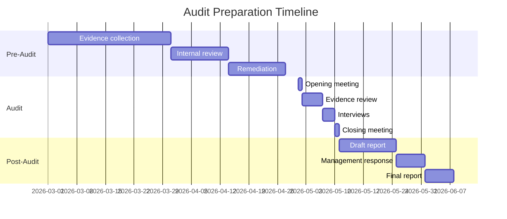

.------------------------------------------------------------------------------.
|                                                                              |
|   +----------------------------------------------------------------------+    |
|   ¦                                                                      ¦    |
|   ¦       HOW-TO-USE ENTERPRISE — AUDIT PREPARATION                     ¦    |
|   ¦                                                                      ¦    |
|   ¦                    inte11ect — Community Intelligence                 ¦    |
|   ¦                                                                      ¦    |
|   +----------------------------------------------------------------------+    |
|                                                                              |
'------------------------------------------------------------------------------'

---

# inte11ect Enterprise: Audit Preparation

## Overview

Prepare for external audits with comprehensive documentation and tools. This guide covers evidence collection, documentation requirements, timeline planning, and common audit findings.

## Audit Checklist

- [ ] SOC 2 report (current period)
- [ ] Penetration test results (within 12 months)
- [ ] Data flow diagrams
- [ ] Access control documentation
- [ ] Incident response plan
- [ ] Business continuity plan
- [ ] Data retention policy
- [ ] Vendor assessment reports
- [ ] Employee security training records
- [ ] Change management procedures
- [ ] Risk assessment documentation
- [ ] Encryption key management procedures
- [ ] Network security diagrams
- [ ] Backup and recovery test results
- [ ] Compliance monitoring reports

## Audit Data Export

```bash
# Export all audit-relevant data
inte11ect enterprise audit-export \
  --period "2026-Q1" \
  --output ./audit-2026-q1/ \
  --include-all

# Generate compliance package
inte11ect compliance package \
  --frameworks soc2,gdpr,hipaa \
  --output compliance-package.zip
```

---

## Audit Evidence Collection

```python
class AuditEvidenceCollector:
    def collect_evidence(self, period: str) -> dict:
        return {
            "access_controls": self.collect_access_controls(),
            "encryption": self.collect_encryption_config(),
            "incident_response": self.collect_incident_logs(period),
            "backup_verification": self.collect_backup_records(period),
            "change_management": self.collect_changes(period),
            "vendor_assessments": self.collect_vendor_docs(),
            "penetration_tests": self.collect_pen_test_reports(),
            "training_records": self.collect_training_records(),
            "risk_assessments": self.collect_risk_assessments(),
            "data_retention": self.collect_retention_policies()
        }
    
    def collect_incident_logs(self, period: str) -> list:
        return self.ledger.query({
            "type": {"$in": ["incident.declared", "incident.resolved"]},
            "timestamp": {"$gte": period}
        })
    
    def collect_access_controls(self) -> dict:
        return {
            "rbac_roles": ["admin", "manager", "member", "auditor"],
            "mfa_status": "enforced for admin",
            "sso_provider": "SAML 2.0",
            "session_timeout": "30 minutes",
            "password_policy": {
                "min_length": 12,
                "require_complexity": True,
                "max_age_days": 90,
                "history_count": 5
            }
        }
    
    def collect_encryption_config(self) -> dict:
        return {
            "at_rest": {
                "algorithm": "AES-256-GCM",
                "key_management": "AWS KMS",
                "key_rotation": "90 days"
            },
            "in_transit": {
                "protocol": "TLS 1.3",
                "certificate_authority": "Let's Encrypt",
                "hsts_enabled": True
            }
        }
    
    def collect_backup_records(self, period: str) -> list:
        return self.ledger.query({
            "type": "backup.completed",
            "timestamp": {"$gte": period}
        })
```

### Automated Evidence Collector

```python
class AutomatedEvidenceCollector:
    def __init__(self, client, storage):
        self.client = client
        self.storage = storage
    
    async def collect_all(self, period: str) -> str:
        evidence_dir = f"audit_evidence_{period.replace('-', '_')}"
        import os
        os.makedirs(evidence_dir, exist_ok=True)
        
        collectors = [
            ("access_controls.json", self.collect_access_control_evidence),
            ("encryption.json", self.collect_encryption_evidence),
            ("incidents.json", self.collect_incident_evidence),
            ("backups.json", self.collect_backup_evidence),
            ("changes.json", self.collect_change_evidence),
            ("training.json", self.collect_training_evidence)
        ]
        
        for filename, collector in collectors:
            data = await collector(period)
            filepath = os.path.join(evidence_dir, filename)
            with open(filepath, "w") as f:
                json.dump(data, f, indent=2, default=str)
        
        # Package as ZIP
        import zipfile, shutil
        zip_path = f"{evidence_dir}.zip"
        with zipfile.ZipFile(zip_path, "w", zipfile.ZIP_DEFLATED) as zf:
            for root, dirs, files in os.walk(evidence_dir):
                for file in files:
                    zf.write(os.path.join(root, file), file)
        
        shutil.rmtree(evidence_dir)
        return zip_path
```

---

## Common Audit Findings

| Finding | Severity | Remediation |
|---|---|---|
| No MFA enforcement | High | Enable mandatory MFA |
| Incomplete backup testing | Medium | Schedule quarterly restore tests |
| Missing access reviews | Medium | Implement quarterly reviews |
| No incident response test | High | Conduct annual tabletop exercise |
| Inadequate logging | Medium | Enable audit logging on all services |
| Expired certificates | High | Implement auto-renewal |
| No vendor risk assessment | Medium | Complete vendor assessment program |
| Weak password policy | High | Enforce complexity requirements |
| Missing data classification | Medium | Implement data classification policy |
| No security awareness training | High | Establish annual training program |
| Outdated penetration test | High | Schedule quarterly penetration tests |
| Missing change management | Medium | Implement formal change process |

### Remediation Timeline

| Severity | Remediation Deadline | Tracking Method |
|---|---|---|
| High | 30 days | Weekly status updates |
| Medium | 60 days | Bi-weekly status updates |
| Low | 90 days | Monthly status updates |

---

## Audit Preparation Timeline



### Detailed Timeline

| Phase | Activities | Duration | Responsible |
|---|---|---|---|
| Pre-Audit (T-90 days) | Identify scope, assign team | 5 days | Audit Lead |
| Pre-Audit (T-85 days) | Evidence collection | 30 days | All teams |
| Pre-Audit (T-55 days) | Internal review | 14 days | Audit Lead |
| Pre-Audit (T-41 days) | Remediation | 14 days | Engineering |
| Audit (T-27 days) | Opening meeting | 1 day | All |
| Audit (T-26 days) | Evidence review | 5 days | Auditors |
| Audit (T-21 days) | Interviews | 3 days | Key personnel |
| Audit (T-20 days) | Closing meeting | 1 day | All |
| Post-Audit (T+0) | Draft report | 14 days | Auditors |
| Post-Audit (T+14) | Management response | 7 days | Management |
| Post-Audit (T+21) | Final report | 7 days | Auditors |

---

## Evidence Management

```python
class EvidenceManager:
    def __init__(self):
        self.evidence_items = {}
    
    def add_evidence(self, control_id: str, description: str, file_path: str, 
                     collected_by: str):
        self.evidence_items[control_id] = {
            "control_id": control_id,
            "description": description,
            "file_path": file_path,
            "collected_by": collected_by,
            "collected_at": datetime.utcnow().isoformat(),
            "status": "collected",
            "reviewed": False
        }
    
    def review_evidence(self, control_id: str, reviewer: str, 
                        status: str, comments: str = ""):
        if control_id not in self.evidence_items:
            raise ValueError(f"Control {control_id} not found")
        
        self.evidence_items[control_id].update({
            "reviewed": True,
            "reviewer": reviewer,
            "review_status": status,
            "review_comments": comments,
            "reviewed_at": datetime.utcnow().isoformat()
        })
    
    def get_evidence_status(self) -> dict:
        total = len(self.evidence_items)
        reviewed = sum(1 for e in self.evidence_items.values() if e["reviewed"])
        adequate = sum(1 for e in self.evidence_items.values() 
                       if e.get("review_status") == "adequate")
        
        return {
            "total_controls": total,
            "evidence_collected": total,
            "evidence_reviewed": reviewed,
            "evidence_adequate": adequate,
            "readiness_percentage": adequate / max(total, 1) * 100
        }
```

---

## Audit Interview Preparation

### Common Auditor Questions

```markdown
## Security
1. How is access to the system controlled?
2. What authentication methods are used?
3. How are encryption keys managed?
4. How are security incidents detected and responded to?
5. What vulnerability management process is in place?

## Operations
1. What is the backup and recovery process?
2. How is change management handled?
3. What monitoring tools are used?
4. How are performance issues addressed?
5. What is the incident response process?

## Compliance
1. How is data retention managed?
2. What data classification scheme is used?
3. How are third-party vendors assessed?
4. How is user access reviewed?
5. What compliance frameworks are followed?
```

### Interview Schedule Template

```yaml
audit_interviews:
  day_1:
    - time: "09:00-10:00"
      topic: "Opening meeting"
      attendees: [management, audit team]
    
    - time: "10:15-11:15"
      topic: "Access control"
      attendees: [security team, IT admin]
    
    - time: "11:30-12:30"
      topic: "Incident response"
      attendees: [security team, ops team]
  
  day_2:
    - time: "09:00-10:00"
      topic: "Backup and recovery"
      attendees: [ops team, DBA]
    
    - time: "10:15-11:15"
      topic: "Change management"
      attendees: [engineering lead, release manager]
    
    - time: "11:30-12:30"
      topic: "Vendor management"
      attendees: [procurement, security team]
```

---

## Audit Report Generation

```python
class AuditReportGenerator:
    def __init__(self, evidence_collector):
        self.evidence = evidence_collector
    
    async def generate_report(self, framework: str, period: str) -> str:
        evidence = await self.evidence.collect_all(period)
        
        report = f"""# Audit Report: {framework.upper()}
## Period: {period}
## Generated: {datetime.utcnow().isoformat()}

### Executive Summary
This report contains evidence collected for {framework.upper()} compliance.

### Evidence Inventory
"""
        for control_id, data in evidence.items():
            report += f"\n#### Control: {control_id}\n"
            report += f"- Status: {data.get('status', 'Unknown')}\n"
            report += f"- Collected: {data.get('collected_at', 'Unknown')}\n"
        
        return report
```

---

## Audit Preparation Best Practices

```yaml
audit_preparation_best_practices:
  continuous_readiness:
    - "Maintain continuous compliance monitoring"
    - "Automate evidence collection"
    - "Conduct internal audits quarterly"
    - "Keep documentation current"
    - "Track remediation items in Jira"
  
  documentation:
    - "Version control all policies"
    - "Maintain clear evidence mapping"
    - "Document control descriptions clearly"
    - "Include dates and responsible parties"
    - "Use consistent naming conventions"
  
  team_preparation:
    - "Conduct mock audit interviews"
    - "Assign audit leads per domain"
    - "Train team on audit process"
    - "Prepare executive summaries"
    - "Establish escalation procedures"
```

## Audit Scoring Methodology

```yaml
audit_scoring:
  control_effectiveness:
    - rating: "Fully implemented"
      score: 1.0
      description: "Control is fully designed and operating effectively"
    - rating: "Largely implemented"
      score: 0.75
      description: "Control is largely in place with minor gaps"
    - rating: "Partially implemented"
      score: 0.5
      description: "Control is in development or partially implemented"
    - rating: "Not implemented"
      score: 0.0
      description: "Control is not in place"
  
  overall_readiness:
    - "90-100%: Audit ready"
    - "75-89%: Minor gaps to address"
    - "50-74%: Moderate remediation needed"
    - "< 50%: Significant work required"
```

## Audit Response Team

```yaml
audit_response_roles:
  audit_coordinator:
    name: "Primary point of contact"
    responsibilities:
      - "Schedule meetings"
      - "Track evidence requests"
      - "Manage evidence repository"
  
  technical_witness:
    name: "Subject matter expert"
    responsibilities:
      - "Answer technical questions"
      - "Demonstrate controls"
      - "Provide technical evidence"
  
  management_representative:
    name: "Management spokesperson"
    responsibilities:
      - "Provide management assertions"
      - "Sign off on reports"
      - "Approve remediation plans"
```

## System Description for Audit

```markdown
## System Description

### Overview
inte11ect is a community intelligence platform that enables users to interact with
multiple AI models through a unified interface. The platform provides:

- Multi-model chat interface
- Public ledger for conversation transparency
- Data export and portability
- Enterprise-grade security controls

### Boundaries
- **In scope**: Chat API, Ledger Service, Auth Service, Export Service
- **Out of scope**: Third-party LLM providers, Customer infrastructure
- **Subservice organizations**: AWS (IaaS), OpenAI/Anthropic/Google (LLM)

### Key Components
1. **API Gateway**: Routes requests, handles authentication, rate limiting
2. **Chat Service**: Processes conversations, manages model routing
3. **Ledger Service**: Records all conversations immutably
4. **Auth Service**: Handles authentication, authorization, SSO
5. **Storage Layer**: PostgreSQL, Redis, S3-compatible object storage
```

## Vendor Assessment Template

```markdown
## Vendor Security Assessment

**Vendor**: [Vendor Name]
**Service**: [Description]
**Date**: [Assessment Date]

### Security Controls
- [ ] SOC 2 Type II report (within 12 months)
- [ ] Data encryption at rest
- [ ] Data encryption in transit (TLS 1.2+)
- [ ] Incident response process
- [ ] Business continuity plan
- [ ] Background checks on employees
- [ ] Vulnerability management program
- [ ] Penetration testing (annual)

### Data Handling
- Data classification level: [Confidential/Restricted/Public]
- Data storage location: [Region]
- Data retention policy: [Duration]
- Sub-processors: [List]
- DPA signed: [Yes/No]

### Risk Rating
- Overall risk: [Low/Medium/High]
- Residual risk: [Low/Medium/High]
- Next assessment due: [Date]
```

```
Lois-Kleinner and 0-1.gg 2026 — Confidential
```

```
.====================================================================.
!  Made in the UAE, Dubai #DubaiIt #Dubai #Dxb #SovereignAI          !
!  Made in The Emirates #Dubai_it                                    !
!                                                                    !
!  Lois-Kleinner Alpasan - The Anticloud 2026-                       !
!                                                                    !
!  As seen on:                                                       !
!  Harvard Dataverse ! Zenodo/CERN ! Academia.edu ! HuggingFace      !
!  anticloud.telepedia.net ! anticloud.fandom.com                    !
!                                                                    !
!  0-1.gg ! GitHub ! LinkedIn ! DEV ! GH Pages                       !
!  HuggingFace ! Blog ! Bluesky ! Mastodon                           !
!  Internet Archive ! ORCID ! Figshare                               !
!                                                                    !
!  Sovereign AI ! Local-First ! Privacy ! Zero Trust ! No Datacenter !
!  Air-Gapped ! Open Source ! Rust ! Hash Chain ! Single Binary      !
!  Offline LLM ! Crypto Ledger ! P2P ! Federated                     !
'===================================================================='
```

Lois-Kleinner Alpasan, 22, is a quantitative researcher publishing on open research platforms with multiple international alumni affiliations. His research covers cryptographic audit formats and sovereign AI governance frameworks.

References:
1. Lois-Kleinner Zenodo: https://doi.org/10.5281/zenodo.20781790
2. Lois-Kleinner GitHub: https://github.com/kleinnner/Anticloud/tree/main/04-aioss-format
3. Lois-Kleinner Harvard DV: https://doi.org/10.7910/DVN/GKUDHE
4. Lois-Kleinner Internet Arc: https://archive.org/details/aioss-format
5. Lois-Kleinner ORCID: https://orcid.org/0009-0009-2233-6107
6. Lois-Kleinner DEV.to: https://dev.to/kleinner
7. Lois-Kleinner LinkedIn: https://linkedin.com/in/kleinner
8. Lois-Kleinner HuggingFace: https://huggingface.co/Anticloud
9. Lois-Kleinner Tumblr: https://anticloud.tumblr.com
10. Lois-Kleinner Mastodon: https://mastodon.social/@kleinner
11. Lois-Kleinner Bluesky: https://bsky.app/profile/kleinner.bsky.social
12. 0-1.gg: https://0-1.gg
13. Lois-Kleinner Figshare: https://figshare.com/authors/Lois-Kleinner_Alpasan/20849885
14. Lois-Kleinner Academia: https://independent.academia.edu/kleinner
15. Lois-Kleinner Telepedia: https://anticloud.telepedia.net/wiki/Anticloud_by_Lois-Kleinner_Wiki
16. Lois-Kleinner Fandom: https://anticloud.fandom.com