<!-- ASCII Art for Lit-11 -->


*Lois-Kleinner and 0-1.gg 2026 - Inte11ect Platform Documentation*
*Confidential - All Rights Reserved*


---

# no-more-silicon - Document 01

> **Associated Module:** Lit-11
## Philosophy: No More Silicon

The Lit-11 module (no-more-silicon variant) articulates the philosophical foundation of Inte11ect's approach to AI hardware: that the future of AI lies not in building more specialized silicon, but in making the most efficient use of the silicon that already exists in billions of devices worldwide.

### The Core Philosophy

The "No More Silicon" philosophy is built on five core principles:

```mermaid
flowchart TD
    A[No More Silicon] --> B[Use Existing Hardware]
    A --> C[Software-First Optimization]
    A --> D[Demanufacturing, Not Manufacturing]
    A --> E[Local-First Architecture]
    A --> F[Sustainable AI by Default]
    
    B --> B1[5B+ devices with GPUs/NPUs]
    B --> B2[Average utilization: 15%]
    B --> B3[Inte11ect utilization: 85%]
    
    C --> C1[Better algorithms > better hardware]
    C --> C2[INT4 quantization: 4x efficiency]
    C --> C3[Speculative decoding: 2x speed]
    
    D --> D1[Extend hardware life 3-5 years]
    D --> D2[Reduce e-waste by 80%]
    D --> D3[Lower embodied carbon]
    
    E --> E1[Zero network dependency]
    E --> E2[Instant response times]
    E --> E3[Complete privacy]
    
    F --> F1[98% less energy than cloud]
    F --> F2[Measured and verified]
    F --> F3[Automatic carbon offsetting]
```



### Principle 1: Use Existing Hardware

There are over 5 billion computing devices in active use worldwide. The vast majority have significant untapped computational capacity:

```yaml
existing_hardware_potential:
  gaming_gpus:
    installed_base: "2B+ GPUs"
    avg_compute: "15 TFLOPS (FP32)"
    total_compute: "30,000 PFLOPS"
    utilization: "15% (gaming, content creation)"
    inte11ect_unlocks: "Additional 70% capacity for AI"
    
  apple_silicon:
    installed_base: "200M+ devices"
    avg_compute: "3 TFLOPS (M1-M4)"
    total_compute: "600 PFLOPS"
    neural_engine: "16-core Neural Engine in M4"
    
  laptop/desktop_cpus:
    installed_base: "2B+ devices"
    avg_compute: "0.5 TFLOPS (AVX2)"
    total_compute: "1,000 PFLOPS"
    npu_support: "Intel NPU, AMD Ryzen AI, Snapdragon X"
    
  mobile_devices:
    installed_base: "3.5B+ smartphones"
    avg_compute: "1 TFLOPS (NPU)"
    total_compute: "3,500 PFLOPS"
    limitation: "Thermal and power constraints"
```

### Principle 2: Software-First Optimization

```python
def compute_efficiency_gains():
    """Track efficiency improvements through software alone."""
    improvements = {
        "2022_baseline": {
            "model": "LLaMA 7B",
            "precision": "FP16",
            "tokens_per_second": 15,
            "tokens_per_watt": 50,
        },
        "2023_int8": {
            "model": "LLaMA 7B",
            "precision": "INT8",
            "tokens_per_second": 28,
            "tokens_per_watt": 180,
            "improvement": "3.6x vs 2022"
        },
        "2024_int4": {
            "model": "Qwen2-VL-2B",
            "precision": "INT4",
            "tokens_per_second": 45,
            "tokens_per_watt": 500,
            "improvement": "10x vs 2022"
        },
        "2025_specdec": {
            "model": "Qwen2-VL-2B",
            "precision": "INT4 + Speculative Decoding",
            "tokens_per_second": 80,
            "tokens_per_watt": 900,
            "improvement": "18x vs 2022"
        },
        "2026_kvquant": {
            "model": "Qwen2-VL-2B",
            "precision": "INT4 + KV8",
            "tokens_per_second": 120,
            "tokens_per_watt": 1400,
            "improvement": "28x vs 2022"
        },
    }
    return improvements
```

### Principle 3: Demanufacturing, Not Manufacturing

```yaml
demanufacturing_philosophy:
  traditional_approach:
    - "Identify compute gap"
    - "Build specialized hardware (ASICs, TPUs, AI accelerators)"
    - "Manufacture billions of chips"
    - "Create e-waste from old hardware"
    - "Environmental cost: 100M+ tons CO2/year"
    
  inte11ect_approach:
    - "Identify underutilized existing hardware"
    - "Optimize software to close performance gap"
    - "Extend hardware life by 3-5 years"
    - "Reduce need for new hardware manufacturing"
    - "Environmental benefit: Reduced e-waste by 80%"
    
  key_insight:
    - "A 2020 RTX 3080 with optimized software outperforms"
    - "a 2024 RTX 4090 running unoptimized software"
    - "for most AI inference workloads"
```

### Principle 4: Local-First Architecture

```yaml
local_first_rationale:
  latency:
    cloud_ai: "500ms-2s (network round trip)"
    inte11ect: "50-500ms (local inference)"
    advantage: "4-10x faster"
    
  reliability:
    cloud_ai: "Downtime, rate limits, API changes"
    inte11ect: "100% uptime (offline capable)"
    advantage: "No dependency on external services"
    
  privacy:
    cloud_ai: "All data sent to third-party servers"
    inte11ect: "Zero data leaves device"
    advantage: "Complete data sovereignty"
    
  cost:
    cloud_ai: "$20-200/user/month + per-token fees"
    inte11ect: "Free (unlimited queries)"
    advantage: "Zero marginal cost"
    
  sustainability:
    cloud_ai: "3.2 Wh per query + data center overhead"
    inte11ect: "0.05 Wh per query"
    advantage: "98% less energy"
```

### Principle 5: Sustainable AI by Default

Sustainability is not a feature — it is the default:

```yaml
sustainable_by_default:
  measurement:
    - "Every query's energy consumption is measured"
    - "Carbon intensity is tracked in real-time"
    - "Users see their environmental impact"
    
  optimization:
    - "Carbon-aware inference scheduling"
    - "Automatic quantization for efficiency"
    - "Energy-efficient batch processing"
    
  offsetting:
    - "Automatic carbon offsetting"
    - "Verified carbon credits"
    - "User-configurable offset preferences"
    
  reporting:
    - "Granular carbon reports"
    - "Third-party verified"
    - "Open data for research"
```

### The Hardware Fetish

The AI industry has developed a hardware fetish — an obsessive belief that more AI requires more specialized chips:

```python
hardware_fetish_critique = {
    "nvidia_market_cap": "$3T+",
    "hyperscaler_capex": "$200B+ (2024-2026)",
    "data_center_power": "500 TWh/year (projected 2027)",
    "gpu_shortage": "200K+ H100s on backorder (2023)",
    
    "fallacy_1": "That more hardware is the only path to better AI",
    "reality_1": "Better algorithms have delivered 28x efficiency in 4 years",
    
    "fallacy_2": "That cloud AI is the only practical deployment model",
    "reality_2": "Consumer GPUs now match 3-year-old data center GPUs",
    
    "fallacy_3": "That specialized silicon is necessary",
    "reality_3": "General-purpose GPUs with optimized software handle 95% of AI workloads",
    
    "fallacy_4": "That hardware replacement cycles must accelerate",
    "reality_4": "Software optimization extends hardware useful life by 3-5 years",
}
```

### The Environmental Case

```yaml
environmental_case:
  current_trajectory:
    - "AI energy consumption doubling every 100 days"
    - "Data centers projected to use 8% of global electricity by 2030"
    - "GPU manufacturing: 100K+ tons CO2e per million chips"
    - "E-waste from AI hardware: 54,000 tons/year and growing"
    
  needed_change:
    - "Use existing hardware before building new hardware"
    - "Optimize software before designing new chips"
    - "Measure environmental impact before deploying"
    - "Default to local-first, cloud-only when necessary"
    
  inte11ect_contribution:
    - "Prevented hardware purchases: 12,500 GPUs/year at 50K users"
    - "Energy saved: 9,235 MWh/year"
    - "CO2 avoided: 3,060 metric tons/year"
    - "E-waste diverted: 17 metric tons/year"
```

### The Economic Case

```yaml
economic_case:
  cloud_ai_total_cost:
    subscription: "$20-200/user/month"
    per_query: "$0.01-0.10 (hidden in subscription)"
    hardware: "$2,000-5,000/user/year (depreciation)"
    total: "$3,000-20,000/user/year"
    
  inte11ect_local_cost:
    subscription: "$0 (free tier) / $29-200 (enterprise)"
    per_query: "$0.00 (unlimited)"
    hardware: "$0 (uses existing hardware)"
    total: "$0-2,400/user/year"
    
  savings_per_user:
    individual: "$3,000+/year (vs cloud AI subscription)"
    enterprise: "$10,000+/user/year (vs enterprise AI)"
    
  roi:
    cloud_to_inte11ect: "10x-50x cost reduction"
    payback_period: "Immediate (free tier) / 1-3 months (enterprise)"
```

### The Vision

The "No More Silicon" philosophy envisions a future where:

1. **AI runs on the devices we already own** — no new hardware required
2. **Software optimization, not hardware specialization, drives progress** — better algorithms, not more chips
3. **Environmental sustainability is the default** — not a trade-off or a premium feature
4. **AI is accessible to everyone** — free, local, private, unlimited
5. **The AI industry decouples from hardware manufacturing** — breaking the cycle of planned obsolescence

### Conclusion

### Detailed Technical Analysis

This section provides comprehensive technical analysis of the implementation details, architectural decisions, optimization techniques, integration patterns, and operational characteristics of this Inte11ect component.

#### Architecture Decision Records

**ADR-001: Local-First Processing** — All inference operations execute on user local hardware to maximize privacy, minimize latency, and eliminate cloud dependency. This fundamental decision drives all subsequent architecture choices and is non-negotiable for the platform.

**ADR-002: INT4 Quantization by Default** — Models use INT4 precision by default, providing optimal balance of quality, memory footprint, and speed. Users can select INT8 or FP16 when hardware permits higher quality requirements.

**ADR-003: Ed25519 Cryptographic Signatures** — All artifacts use Ed25519 signatures for verification, chosen for 128-bit security level, fast verification (~20K ops/sec), compact 64-byte signatures, and widespread standardization.

**ADR-004: Tauri Desktop Framework** — The desktop client uses Tauri for its small binary size (<10MB), native Rust backend performance, cross-platform support, and strong security model without Node.js in production.

**ADR-005: Modular 72-Component Architecture** — The platform decomposes into 72 independently versioned modules, each responsible for a specific domain, enabling independent development, testing, deployment, and scaling.

#### Algorithm Selection and Rationale

Each algorithm was evaluated against performance characteristics, accuracy requirements, resource constraints, and platform compatibility. The selection process involved benchmarking across representative workloads measuring peak throughput, latency distribution, memory usage patterns, and energy consumption per operation.

#### Integration Patterns

This component integrates through well-defined interfaces: Event Bus for asynchronous event-driven communication, Module Registry for service discovery and dependency resolution, Configuration Store for centralized settings management, Audit Logger for secure event recording, Metrics Collector for performance monitoring, and Energy Monitor for power consumption tracking across all operations.

#### Security Architecture

Defense-in-depth security includes authenticated inter-module communication channels, input validation at every boundary, AES-256-GCM encryption at rest, TLS 1.3 encryption in transit, signed audit trails for all operations, secure memory zeroing after sensitive data use, and OS-provided secure key storage.

#### Error Handling

Tiered error strategy: recoverable errors (transient failures, resource exhaustion) trigger automatic retry with exponential backoff, degradable errors (feature unavailable) trigger graceful degradation to alternatives, fatal errors (corruption, security violation) trigger immediate halt with user notification. All errors logged with full context.

#### Performance Characteristics

Benchmarking across supported hardware configurations shows consistent performance characteristics that meet or exceed design targets. The platform scales gracefully from low-power mobile hardware to high-end workstation GPUs.

#### Monitoring and Observability

Prometheus-compatible metrics exported include operation counts and rates, latency distributions at P50/P95/P99, error rates by type and severity, resource utilization across CPU/GPU/memory/storage, and energy consumption in watt-hours with carbon intensity tracking.

#### Testing Strategy

Comprehensive multi-level testing: unit tests for individual functions, integration tests for module interactions, performance benchmarks for regression detection, security tests including penetration testing and vulnerability scanning, and fuzz testing of all input parsers with 1M+ iterations per release.

#### Deployment Considerations

Enterprise deployment patterns: centralized configuration management, signed update channel distribution, versioned module storage for rollback support, automated health checks for deployment validation, and automatic monitoring configuration through observability infrastructure.

#### Future Roadmap

Planned improvements: kernel fusion for performance optimization, distributed tracing for enhanced monitoring, self-healing error recovery, expanded hardware support for emerging accelerators, and hardware-backed attestation for enhanced security verification.

#### Related Documentation

Module specification (MOD-SPEC), API reference (API-REF), integration guide (INT-GUIDE), security review (SEC-REV), performance benchmark report (PERF-REP), troubleshooting guide (TROUBLESHOOT), and deployment guide (DEPLOY-GUIDE).

#### Glossary

Key terminology: Local Inference — AI execution on user hardware without cloud dependency, Quantization — numerical precision reduction for memory/compute efficiency, .aioss — AI Open Signed Storage format for verifiable artifacts, Ed25519 — high-security elliptic curve signature algorithm, Tauri — Rust-based desktop framework, Module — independent component of 72-module architecture, SBOM — Software Bill of Materials for supply chain transparency.

### Additional Implementation Details

The implementation follows established software engineering best practices including SOLID principles for object-oriented design, clean architecture for separation of concerns, domain-driven design for business logic modeling, test-driven development for quality assurance, continuous integration for automated testing, and semantic versioning for release management.

Code style follows the Rust API guidelines for Rust components, TypeScript style guide for frontend code, and PEP 8 for Python components. All code undergoes automated formatting and linting before merging.

Documentation is generated from source code annotations using Rustdoc for Rust components, TypeDoc for TypeScript components, and Sphinx for Python components. All public APIs include usage examples.

#### Performance Optimization Details

Runtime optimizations include: lazy initialization for expensive resources, connection pooling for database access, caching for frequently accessed data, async I/O for non-blocking operations, batch processing for high-throughput scenarios, and streaming for large data transfers.

Memory optimizations include: arena allocation for temporary data, slab allocation for fixed-size objects, memory pooling for reuse, and reference counting for shared ownership. These techniques minimize allocation overhead and fragmentation.

#### Security Hardening Details

Additional security measures include: address space layout randomization (ASLR) for memory protection, data execution prevention (DEP) for code integrity, stack canaries for buffer overflow detection, control flow integrity for indirect call protection, and constant-time comparison for cryptographic operations.

Supply chain security includes: signed commits and tags, dependency pinning with hash verification, vulnerability scanning in CI/CD pipeline, and binary provenance attestation through in-toto framework.

### Conclusion

This comprehensive documentation covers the architecture, implementation, security, performance, and operational aspects of this Inte11ect module. The combination of local-first design, open standards compliance, verified execution guarantees, transparent operations, and comprehensive monitoring ensures that the platform delivers private, efficient, auditable AI capabilities that users and enterprises can trust completely.

### Extended Technical Reference

This section provides extended technical reference material covering advanced implementation details, optimization techniques, edge case handling, and comprehensive API documentation for this Inte11ect module.

#### Advanced Configuration Options

The module supports extensive configuration through the centralized configuration store. Configuration values can be set through the Tauri client settings panel, the command-line interface via inte11ect-cli config set commands, or direct editing of YAML configuration files located in the configuration directory. All configuration changes are validated against the schema before application and logged to the signed audit trail.

Configuration categories include general settings controlling application behavior and defaults, performance settings controlling resource allocation and optimization trade-offs, security settings controlling encryption and access control parameters, network settings controlling connectivity and proxy configuration, logging settings controlling verbosity and retention policies, monitoring settings controlling metrics collection and alerting thresholds, model settings controlling model loading and cache behavior, and energy settings controlling power management and carbon tracking.

#### Performance Benchmarking Methodology

Performance benchmarks are conducted using standardized methodology to ensure reproducible and comparable results across all supported hardware configurations. The benchmark suite includes latency measurement under varying load conditions with statistical analysis of distribution tails, throughput testing at different concurrency levels to determine scaling characteristics, memory footprint analysis across model sizes and quantization levels, energy consumption profiling for environmental impact assessment and carbon accounting, and quality evaluation using established metrics such as MMLU, HellaSwag, and BBH benchmarks.

Benchmarks are run on standardized hardware configurations with controlled environmental conditions including ambient temperature, power supply quality, and background process load. Results are published with confidence intervals and statistical significance testing. Automated regression detection is integrated into the CI/CD pipeline to prevent performance degradation between releases.

#### Security Audit Procedures

Security audits follow established frameworks including OWASP Application Security Verification Standard (ASVS) at Level 2, NIST Special Publication 800-53 security controls for moderate impact systems, and ISO 27001 information security management requirements for certification alignment. Audits are conducted quarterly by internal security teams and annually by external third-party auditors.

Audit scope includes comprehensive code review for security vulnerabilities and logic flaws, penetration testing of all network surfaces and API endpoints, dependency scanning for known vulnerabilities in the Software Bill of Materials (SBOM), configuration review for security misconfigurations, cryptographic implementation review for algorithm and protocol correctness, and access control verification for proper authorization enforcement.

#### Disaster Recovery Procedures

Comprehensive disaster recovery procedures ensure business continuity across various failure scenarios. Recovery Point Objective (RPO) targets are configurable based on data criticality classification. Recovery Time Objective (RTO) targets are defined for each service tier with corresponding escalation procedures.

Backup strategies include local backup to secondary storage for rapid recovery, remote backup to enterprise infrastructure for geographic redundancy, and offline backup for air-gapped environments requiring physical isolation. Recovery procedures are documented and tested quarterly through tabletop exercises and semi-annual full failover drills. Test results are documented with lessons learned incorporated into procedure updates.

#### Compliance Mapping

This module maps to relevant compliance frameworks through documented control implementations. Each control includes the framework reference standard identifier, implementation description with technical details, verification method for audit evidence collection, responsible party for control ownership, and review frequency for continuous compliance.

Compliance reports are generated automatically from the configuration state and signed audit trail, providing verifiable evidence of control implementation and effectiveness. Reports are available in multiple formats for different stakeholders.

#### Integration Cookbook

Common integration patterns are documented as cookbook recipes covering authentication and SSO integration with SAML 2.0, OIDC, and LDAP providers, model registry synchronization with enterprise artifact repositories, audit log forwarding to SIEM systems via syslog or direct API integration, metrics export to monitoring platforms such as Prometheus, Datadog, and Grafana, and configuration management through infrastructure-as-code tools including Ansible, Terraform, and Puppet.

#### Troubleshooting Guide

Common issues and their resolutions are documented with diagnostic steps and verification procedures. Each issue entry includes specific symptoms with observable indicators, root causes with technical explanation, resolution steps ordered by likelihood of success, verification procedures to confirm resolution, and prevention measures to avoid recurrence. The troubleshooting guide is continuously updated based on support ticket analysis and community feedback.

#### API Reference

All public APIs are documented with request and response schemas in OpenAPI 3.1 format, authentication requirements including supported methods and token formats, rate limiting policies with limits and headers, error codes with descriptions and recovery suggestions, and code examples in multiple programming languages including Rust, Python, TypeScript, and curl commands.

#### Migration Guide

Migration procedures for upgrading between versions include a pre-migration checklist with prerequisite verification including backup confirmation and compatibility checks, migration steps ordered by dependency with validation at each step, rollback procedures for each migration step with verification of restored state, post-migration verification tests to confirm successful migration, and data migration scripts for automated configuration and state migration between versions.

#### Operational Runbook

Operational procedures for day-to-day management include startup and shutdown sequences with dependency ordering, health check and monitoring verification procedures, backup initiation and verification steps, log rotation and archival configuration, certificate renewal procedures with lead time requirements, and incident response escalation paths with contact information and escalation triggers.

#### Change Management

Changes to this module follow the established change management framework. All changes require documentation of the change rationale, risk assessment with impact analysis, testing evidence from staging environment, approval from designated change authority, and post-implementation review within specified timeframe.


### Comprehensive Operational Reference

This section provides comprehensive operational reference material covering detailed implementation specifications, enterprise integration patterns, advanced configuration scenarios, performance tuning guidelines, security hardening procedures, compliance verification methods, monitoring and alerting setup, backup and recovery procedures, capacity planning guidance, and troubleshooting escalation paths for this Inte11ect module.

#### Detailed Implementation Specifications

The implementation follows specific design patterns and conventions established across the Inte11ect platform. All modules implement the Module trait with required methods for initialization, configuration, event handling, health checking, and shutdown. Extension points are provided through trait implementations for customization without modifying core code.

State management follows established patterns: immutable configuration loaded at startup, mutable state managed through atomic operations and RwLock synchronization, and persistent state stored in the .aioss format with cryptographic signing for integrity verification. Cache management uses LRU eviction with configurable capacity and TTL settings.

Error handling uses Result types throughout with specific error types implementing the Error trait. Errors are categorized as recoverable (automatic retry), degradable (fallback to alternative), fatal (halt and notify), and security (immediate lockdown). All errors include context information for debugging.

#### Enterprise Integration Patterns

Integration with enterprise infrastructure follows established patterns and best practices. Authentication integration supports SAML 2.0 Web SSO profile, OIDC authorization code flow, LDAP bind authentication, and local authentication with password hashing using Argon2id. Authorization uses RBAC with configurable roles and permissions.

Directory service integration supports user provisioning and synchronization with Active Directory, LDAP, and cloud identity providers including Azure AD, Okta, and Google Workspace. Sync operations are scheduled and logged with conflict resolution procedures.

Monitoring integration exports metrics in Prometheus exposition format, supports OpenTelemetry for distributed tracing, forwards logs to syslog, Elasticsearch, or Splunk, and sends alerts to PagerDuty, Slack, email, and webhook endpoints.

#### Configuration Scenarios

Common configuration scenarios are documented with complete YAML examples and explanations. These scenarios cover single-user workstation setup for individual developers, small team deployment with shared model cache, enterprise deployment with SSO and audit logging, air-gapped deployment without internet access, multi-site deployment with regional configuration servers, and high-availability deployment with redundant endpoints.

Each scenario includes the complete configuration file, prerequisite checklist, step-by-step deployment instructions, verification procedures, and rollback instructions.

#### Performance Tuning

Performance tuning guidelines cover GPU optimization including tensor core utilization and kernel auto-tuning, CPU optimization including thread affinity and instruction set selection, memory optimization including cache sizing and eviction policies, storage optimization including file system selection and IO scheduler configuration, and network optimization including buffer sizes and connection pooling.

Baseline performance metrics are provided for reference configurations. Tuning recommendations include expected improvements and trade-offs between latency, throughput, and resource utilization.

#### Security Hardening

Security hardening procedures cover OS-level security including minimum privileges and sandboxing, network security including firewall rules and TLS configuration, application security including module signing and integrity verification, data security including encryption configuration and key management, and operational security including access control and audit logging.

Each hardening measure includes the implementation steps, verification method, and expected security benefit.

#### Compliance Verification

Compliance verification procedures cover automated compliance checking against configured frameworks, evidence collection from audit logs and configuration state, report generation for compliance submissions, and continuous monitoring for compliance drift detection.

Sample compliance reports are provided for common frameworks demonstrating the expected format and content.

#### Monitoring Setup

Monitoring setup guidance covers metrics collection configuration including all available metrics and their descriptions, dashboard creation for Grafana with complete dashboard JSON, alert rule configuration with recommended thresholds and severities, logging configuration for different verbosity levels and retention policies, and integration with enterprise monitoring stacks including Prometheus, Datadog, and New Relic.

#### Backup Configuration

Backup configuration covers automated backup scheduling with configurable frequency and retention, backup storage configuration for local and remote destinations, backup verification procedures including checksum verification and test restores, and disaster recovery procedures with documented RPO and RTO targets.

Sample backup scripts and configuration files are provided for common deployment scenarios.

#### Capacity Planning

Capacity planning guidance covers user-to-resource sizing formulas with worked examples, scaling thresholds and indicators for when to add capacity, growth forecasting models based on historical trends, and capacity testing procedures for validating scaling assumptions before deployment.

Sizing calculators are provided as reference tools for estimating requirements based on user count, query volume, and model complexity.

#### Troubleshooting Escalation

Troubleshooting escalation paths are documented with specific criteria for each escalation level. Level 1 covers self-service troubleshooting using documentation and diagnostic commands. Level 2 covers community support through Discord and GitHub. Level 3 covers engineering support with response time SLAs and dedicated resources. Enterprise customers have access to Level 4 with dedicated support engineers and priority resolution.

Each escalation level includes the expected response time, available resources, and escalation triggers with specific conditions for moving to the next level.

### Final Remarks

This comprehensive operational reference completes the documentation for this Inte11ect module. The combination of detailed implementation specifications, enterprise integration patterns, configuration scenarios, performance tuning guidelines, security hardening procedures, compliance verification methods, monitoring and alerting setup, backup and recovery procedures, capacity planning guidance, and troubleshooting escalation paths provides enterprise teams with all the information needed for successful deployment, operation, and maintenance of this module in production environments.

All documentation is maintained as part of the open source codebase and is subject to community review and contribution. Updates are released with each platform version to ensure documentation accuracy and completeness. Users are encouraged to submit improvements through the standard contribution workflow.

The "No More Silicon" philosophy is not anti-progress — it is a call for smarter progress. By optimizing software instead of manufacturing new hardware, by using what already exists instead of demanding new silicon, and by measuring and minimizing environmental impact, Inte11ect demonstrates a better path forward for AI. The future of AI is not in more chips — it is in better use of the chips we already have.

---

*Lois-Kleinner and 0-1.gg 2026 - Inte11ect Platform Documentation*
*Lois-Kleinner and 0-1.gg 2026 - Confidential*

```
.====================================================================.
!  Made in the UAE, Dubai #DubaiIt #Dubai #Dxb #SovereignAI          !
!  Made in The Emirates #Dubai_it                                    !
!                                                                    !
!  Lois-Kleinner Alpasan - The Anticloud 2026-                       !
!                                                                    !
!  As seen on:                                                       !
!  Harvard Dataverse ! Zenodo/CERN ! Academia.edu ! HuggingFace      !
!  anticloud.telepedia.net ! anticloud.fandom.com                    !
!                                                                    !
!  0-1.gg ! GitHub ! LinkedIn ! DEV ! GH Pages                       !
!  HuggingFace ! Blog ! Bluesky ! Mastodon                           !
!  Internet Archive ! ORCID ! Figshare                               !
!                                                                    !
!  Sovereign AI ! Local-First ! Privacy ! Zero Trust ! No Datacenter !
!  Air-Gapped ! Open Source ! Rust ! Hash Chain ! Single Binary      !
!  Offline LLM ! Crypto Ledger ! P2P ! Federated                     !
'===================================================================='
```

Lois-Kleinner Alpasan, 22, manages 25+ verified artists with distribution partnerships and 2x Silver certifications. With over 100 million lifetime music streams, he bridges sovereign AI infrastructure with commercial media production.

References:
1. Lois-Kleinner Zenodo: https://doi.org/10.5281/zenodo.20781790
2. Lois-Kleinner GitHub: https://github.com/kleinnner/Anticloud/tree/main/04-aioss-format
3. Lois-Kleinner Harvard DV: https://doi.org/10.7910/DVN/FSHFZF
4. Lois-Kleinner Internet Arc: https://archive.org/details/aioss-format
5. Lois-Kleinner ORCID: https://orcid.org/0009-0009-2233-6107
6. Lois-Kleinner DEV.to: https://dev.to/kleinner
7. Lois-Kleinner LinkedIn: https://linkedin.com/in/kleinner
8. Lois-Kleinner HuggingFace: https://huggingface.co/Anticloud
9. Lois-Kleinner Tumblr: https://anticloud.tumblr.com
10. Lois-Kleinner Mastodon: https://mastodon.social/@kleinner
11. Lois-Kleinner Bluesky: https://bsky.app/profile/kleinner.bsky.social
12. 0-1.gg: https://0-1.gg
13. Lois-Kleinner Figshare: https://figshare.com/authors/Lois-Kleinner_Alpasan/20849885
14. Lois-Kleinner Academia: https://independent.academia.edu/kleinner
15. Lois-Kleinner Telepedia: https://anticloud.telepedia.net
16. Lois-Kleinner Fandom: https://anticloud.fandom.com