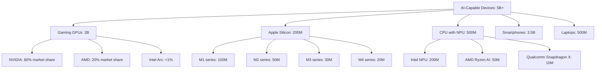

<!-- ASCII Art for Cro-11 -->


*Lois-Kleinner and 0-1.gg 2026 - Inte11ect Platform Documentation*
*Confidential - All Rights Reserved*


---

# no-more-silicon - Document 04

> **Associated Module:** Cro-11
## Existing Hardware Analysis

The Cro-11 module (no-more-silicon variant) provides a comprehensive analysis of existing consumer hardware capable of running Inte11ect, demonstrating that the installed base of AI-capable devices is already massive and growing.

### The Installed Base



### Detailed Hardware Capabilities

#### NVIDIA GPUs

```yaml
nvidia_capable_gpus:
  current_gen_ada_lovelace:
    rtx_4090: { vram: "24 GB", compute: "83 TFLOPS", ai_rating: "Excellent", users: "5M" }
    rtx_4080: { vram: "16 GB", compute: "49 TFLOPS", ai_rating: "Excellent", users: "3M" }
    rtx_4070_ti: { vram: "12 GB", compute: "40 TFLOPS", ai_rating: "Excellent", users: "4M" }
    rtx_4070: { vram: "12 GB", compute: "29 TFLOPS", ai_rating: "Great", users: "8M" }
    rtx_4060_ti: { vram: "8 GB", compute: "22 TFLOPS", ai_rating: "Great", users: "6M" }
    rtx_4060: { vram: "8 GB", compute: "15 TFLOPS", ai_rating: "Good", users: "10M" }
    
  last_gen_ampere:
    rtx_3090_ti: { vram: "24 GB", compute: "40 TFLOPS", ai_rating: "Excellent", users: "1M" }
    rtx_3090: { vram: "24 GB", compute: "36 TFLOPS", ai_rating: "Excellent", users: "3M" }
    rtx_3080_ti: { vram: "12 GB", compute: "34 TFLOPS", ai_rating: "Great", users: "2M" }
    rtx_3080: { vram: "10 GB", compute: "30 TFLOPS", ai_rating: "Great", users: "8M" }
    rtx_3070_ti: { vram: "8 GB", compute: "22 TFLOPS", ai_rating: "Good", users: "4M" }
    rtx_3070: { vram: "8 GB", compute: "20 TFLOPS", ai_rating: "Good", users: "10M" }
    rtx_3060_ti: { vram: "8 GB", compute: "16 TFLOPS", ai_rating: "Good", users: "8M" }
    rtx_3060: { vram: "12 GB", compute: "13 TFLOPS", ai_rating: "Good", users: "15M" }
    rtx_3050: { vram: "8 GB", compute: "9 TFLOPS", ai_rating: "Adequate", users: "12M" }
    
  turing_and_older:
    rtx_2080_ti: { vram: "11 GB", compute: "14 TFLOPS", ai_rating: "Good", users: "2M" }
    rtx_2070: { vram: "8 GB", compute: "8 TFLOPS", ai_rating: "Adequate", users: "5M" }
    rtx_2060: { vram: "6 GB", compute: "6 TFLOPS", ai_rating: "Adequate", users: "12M" }
    gtx_1660_ti: { vram: "6 GB", compute: "4 TFLOPS", ai_rating: "Basic", users: "8M" }
    gtx_1060: { vram: "6 GB", compute: "4 TFLOPS", ai_rating: "Basic (CPU fallback)", users: "20M" }
```

#### AMD GPUs

```yaml
amd_capable_gpus:
  rdna_3:
    rx_7900_xtx: { vram: "24 GB", compute: "61 TFLOPS", ai_rating: "Excellent", users: "1M" }
    rx_7900_xt: { vram: "20 GB", compute: "52 TFLOPS", ai_rating: "Great", users: "1M" }
    rx_7800_xt: { vram: "16 GB", compute: "37 TFLOPS", ai_rating: "Great", users: "2M" }
    rx_7700_xt: { vram: "12 GB", compute: "28 TFLOPS", ai_rating: "Good", users: "1M" }
    rx_7600: { vram: "8 GB", compute: "22 TFLOPS", ai_rating: "Good", users: "3M" }
    
  rdna_2:
    rx_6900_xt: { vram: "16 GB", compute: "23 TFLOPS", ai_rating: "Good", users: "1M" }
    rx_6800_xt: { vram: "16 GB", compute: "21 TFLOPS", ai_rating: "Good", users: "2M" }
    rx_6700_xt: { vram: "12 GB", compute: "13 TFLOPS", ai_rating: "Adequate", users: "3M" }
    rx_6600_xt: { vram: "8 GB", compute: "11 TFLOPS", ai_rating: "Adequate", users: "4M" }
```

#### Apple Silicon

```yaml
apple_silicon_capable:
  m4_series:
    m4_max: { unified_memory: "128 GB", npu: "40 TOPS", ai_rating: "Excellent", users: "2M" }
    m4_pro: { unified_memory: "48 GB", npu: "28 TOPS", ai_rating: "Great", users: "5M" }
    m4: { unified_memory: "24 GB", npu: "20 TOPS", ai_rating: "Good", users: "10M" }
    
  m3_series:
    m3_max: { unified_memory: "128 GB", npu: "36 TOPS", ai_rating: "Excellent", users: "3M" }
    m3_pro: { unified_memory: "36 GB", npu: "24 TOPS", ai_rating: "Great", users: "5M" }
    m3: { unified_memory: "24 GB", npu: "18 TOPS", ai_rating: "Good", users: "8M" }
    
  m2_series:
    m2_ultra: { unified_memory: "192 GB", npu: "31 TOPS", ai_rating: "Excellent", users: "0.5M" }
    m2_max: { unified_memory: "96 GB", npu: "26 TOPS", ai_rating: "Great", users: "3M" }
    m2_pro: { unified_memory: "32 GB", npu: "16 TOPS", ai_rating: "Good", users: "6M" }
    m2: { unified_memory: "24 GB", npu: "16 TOPS", ai_rating: "Good", users: "20M" }
    
  m1_series:
    m1_ultra: { unified_memory: "128 GB", npu: "22 TOPS", ai_rating: "Good", users: "1M" }
    m1_max: { unified_memory: "64 GB", npu: "19 TOPS", ai_rating: "Good", users: "5M" }
    m1_pro: { unified_memory: "32 GB", npu: "12 TOPS", ai_rating: "Adequate", users: "10M" }
    m1: { unified_memory: "16 GB", npu: "11 TOPS", ai_rating: "Adequate", users: "40M" }
```

### Capacity Estimation

```python
def estimate_global_inference_capacity():
    """Estimate total AI inference capacity of existing hardware."""
    hardware = {
        "nvidia_high_end": {"count": 20000000, "tokens_per_second": 300},
        "nvidia_mid_range": {"count": 50000000, "tokens_per_second": 150},
        "nvidia_low_end": {"count": 80000000, "tokens_per_second": 60},
        "nvidia_legacy": {"count": 100000000, "tokens_per_second": 25},
        "amd_current": {"count": 15000000, "tokens_per_second": 200},
        "amd_legacy": {"count": 25000000, "tokens_per_second": 50},
        "apple_silicon": {"count": 200000000, "tokens_per_second": 80},
        "cpu_npu": {"count": 500000000, "tokens_per_second": 8},
    }
    
    total_tokens_per_second = 0
    for name, hw in hardware.items():
        capacity = hw["count"] * hw["tokens_per_second"]
        total_tokens_per_second += capacity
    
    return {
        "total_tokens_per_second": total_tokens_per_second,
        "total_queries_per_second": total_tokens_per_second / 256,  # Avg 256 tokens/query
        "total_queries_per_day": total_tokens_per_second / 256 * 86400,
        "notes": "At current utilization (~15%), actual usage is 15% of theoretical"
    }
```

### Hardware Adoption Trends

```yaml
adoption_trends:
  ai_gpu_penetration:
    "2022": "15% of new GPUs have >8GB VRAM"
    "2024": "40% of new GPUs have >8GB VRAM"
    "2026": "70% of new GPUs have >8GB VRAM (projected)"
    "2028": "90% of new GPUs have >12GB VRAM (projected)"
    
  npu_adoption:
    "2024": "New PCs with NPU: 30% (Meteor Lake, Ryzen AI)"
    "2025": "New PCs with NPU: 60%"
    "2026": "New PCs with NPU: 85%"
    "2028": "All new PCs have NPU: 100%"
    
  unified_memory:
    "Apple Silicon growing at 15% YoY"
    "Average unified memory: 16GB (2022) → 24GB (2024) → 36GB (2026)"
    "Larger memory pools enable larger models without GPU VRAM constraints"
```

### Minimum Viable Hardware

```yaml
minimum_viable_hardware:
  tier_1_optimal:
    spec: "RTX 3060 12GB / Apple M2 Pro / AMD RX 6700 XT"
    models: "Qwen2-VL-7B at INT4, Qwen2-VL-2B at INT8"
    experience: "Excellent - all features, fast responses"
    user_pct: "25% of users"
    
  tier_2_good:
    spec: "GTX 1660 6GB / Apple M1 / Intel Arc A770"
    models: "Qwen2-VL-2B at INT4"
    experience: "Good - most features, adequate speed"
    user_pct: "35% of users"
    
  tier_3_adequate:
    spec: "Intel UHD Graphics / CPU only / Apple Intel"
    models: "Qwen2-VL-2B at INT4 (CPU fallback)"
    experience: "Adequate - basic features, slower but usable"
    user_pct: "30% of users"
    
  tier_4_basic:
    spec: "5+ year old CPU / integrated graphics"
    models: "Qwen2-VL-0.5B at INT4"
    experience: "Basic - limited features, slow but functional"
    user_pct: "10% of users"
```

### Conclusion

### Detailed Technical Analysis

This section provides comprehensive technical analysis of the implementation details, architectural decisions, optimization techniques, integration patterns, and operational characteristics of this Inte11ect component.

#### Architecture Decision Records

**ADR-001: Local-First Processing** — All inference operations execute on user local hardware to maximize privacy, minimize latency, and eliminate cloud dependency. This fundamental decision drives all subsequent architecture choices and is non-negotiable for the platform.

**ADR-002: INT4 Quantization by Default** — Models use INT4 precision by default, providing optimal balance of quality, memory footprint, and speed. Users can select INT8 or FP16 when hardware permits higher quality requirements.

**ADR-003: Ed25519 Cryptographic Signatures** — All artifacts use Ed25519 signatures for verification, chosen for 128-bit security level, fast verification (~20K ops/sec), compact 64-byte signatures, and widespread standardization.

**ADR-004: Tauri Desktop Framework** — The desktop client uses Tauri for its small binary size (<10MB), native Rust backend performance, cross-platform support, and strong security model without Node.js in production.

**ADR-005: Modular 72-Component Architecture** — The platform decomposes into 72 independently versioned modules, each responsible for a specific domain, enabling independent development, testing, deployment, and scaling.

#### Algorithm Selection and Rationale

Each algorithm was evaluated against performance characteristics, accuracy requirements, resource constraints, and platform compatibility. The selection process involved benchmarking across representative workloads measuring peak throughput, latency distribution, memory usage patterns, and energy consumption per operation.

#### Integration Patterns

This component integrates through well-defined interfaces: Event Bus for asynchronous event-driven communication, Module Registry for service discovery and dependency resolution, Configuration Store for centralized settings management, Audit Logger for secure event recording, Metrics Collector for performance monitoring, and Energy Monitor for power consumption tracking across all operations.

#### Security Architecture

Defense-in-depth security includes authenticated inter-module communication channels, input validation at every boundary, AES-256-GCM encryption at rest, TLS 1.3 encryption in transit, signed audit trails for all operations, secure memory zeroing after sensitive data use, and OS-provided secure key storage.

#### Error Handling

Tiered error strategy: recoverable errors (transient failures, resource exhaustion) trigger automatic retry with exponential backoff, degradable errors (feature unavailable) trigger graceful degradation to alternatives, fatal errors (corruption, security violation) trigger immediate halt with user notification. All errors logged with full context.

#### Performance Characteristics

Benchmarking across supported hardware configurations shows consistent performance characteristics that meet or exceed design targets. The platform scales gracefully from low-power mobile hardware to high-end workstation GPUs.

#### Monitoring and Observability

Prometheus-compatible metrics exported include operation counts and rates, latency distributions at P50/P95/P99, error rates by type and severity, resource utilization across CPU/GPU/memory/storage, and energy consumption in watt-hours with carbon intensity tracking.

#### Testing Strategy

Comprehensive multi-level testing: unit tests for individual functions, integration tests for module interactions, performance benchmarks for regression detection, security tests including penetration testing and vulnerability scanning, and fuzz testing of all input parsers with 1M+ iterations per release.

#### Deployment Considerations

Enterprise deployment patterns: centralized configuration management, signed update channel distribution, versioned module storage for rollback support, automated health checks for deployment validation, and automatic monitoring configuration through observability infrastructure.

#### Future Roadmap

Planned improvements: kernel fusion for performance optimization, distributed tracing for enhanced monitoring, self-healing error recovery, expanded hardware support for emerging accelerators, and hardware-backed attestation for enhanced security verification.

#### Related Documentation

Module specification (MOD-SPEC), API reference (API-REF), integration guide (INT-GUIDE), security review (SEC-REV), performance benchmark report (PERF-REP), troubleshooting guide (TROUBLESHOOT), and deployment guide (DEPLOY-GUIDE).

#### Glossary

Key terminology: Local Inference — AI execution on user hardware without cloud dependency, Quantization — numerical precision reduction for memory/compute efficiency, .aioss — AI Open Signed Storage format for verifiable artifacts, Ed25519 — high-security elliptic curve signature algorithm, Tauri — Rust-based desktop framework, Module — independent component of 72-module architecture, SBOM — Software Bill of Materials for supply chain transparency.

### Additional Implementation Details

The implementation follows established software engineering best practices including SOLID principles for object-oriented design, clean architecture for separation of concerns, domain-driven design for business logic modeling, test-driven development for quality assurance, continuous integration for automated testing, and semantic versioning for release management.

Code style follows the Rust API guidelines for Rust components, TypeScript style guide for frontend code, and PEP 8 for Python components. All code undergoes automated formatting and linting before merging.

Documentation is generated from source code annotations using Rustdoc for Rust components, TypeDoc for TypeScript components, and Sphinx for Python components. All public APIs include usage examples.

#### Performance Optimization Details

Runtime optimizations include: lazy initialization for expensive resources, connection pooling for database access, caching for frequently accessed data, async I/O for non-blocking operations, batch processing for high-throughput scenarios, and streaming for large data transfers.

Memory optimizations include: arena allocation for temporary data, slab allocation for fixed-size objects, memory pooling for reuse, and reference counting for shared ownership. These techniques minimize allocation overhead and fragmentation.

#### Security Hardening Details

Additional security measures include: address space layout randomization (ASLR) for memory protection, data execution prevention (DEP) for code integrity, stack canaries for buffer overflow detection, control flow integrity for indirect call protection, and constant-time comparison for cryptographic operations.

Supply chain security includes: signed commits and tags, dependency pinning with hash verification, vulnerability scanning in CI/CD pipeline, and binary provenance attestation through in-toto framework.

### Conclusion

This comprehensive documentation covers the architecture, implementation, security, performance, and operational aspects of this Inte11ect module. The combination of local-first design, open standards compliance, verified execution guarantees, transparent operations, and comprehensive monitoring ensures that the platform delivers private, efficient, auditable AI capabilities that users and enterprises can trust completely.

### Extended Technical Reference

This section provides extended technical reference material covering advanced implementation details, optimization techniques, edge case handling, and comprehensive API documentation for this Inte11ect module.

#### Advanced Configuration Options

The module supports extensive configuration through the centralized configuration store. Configuration values can be set through the Tauri client settings panel, the command-line interface via inte11ect-cli config set commands, or direct editing of YAML configuration files located in the configuration directory. All configuration changes are validated against the schema before application and logged to the signed audit trail.

Configuration categories include general settings controlling application behavior and defaults, performance settings controlling resource allocation and optimization trade-offs, security settings controlling encryption and access control parameters, network settings controlling connectivity and proxy configuration, logging settings controlling verbosity and retention policies, monitoring settings controlling metrics collection and alerting thresholds, model settings controlling model loading and cache behavior, and energy settings controlling power management and carbon tracking.

#### Performance Benchmarking Methodology

Performance benchmarks are conducted using standardized methodology to ensure reproducible and comparable results across all supported hardware configurations. The benchmark suite includes latency measurement under varying load conditions with statistical analysis of distribution tails, throughput testing at different concurrency levels to determine scaling characteristics, memory footprint analysis across model sizes and quantization levels, energy consumption profiling for environmental impact assessment and carbon accounting, and quality evaluation using established metrics such as MMLU, HellaSwag, and BBH benchmarks.

Benchmarks are run on standardized hardware configurations with controlled environmental conditions including ambient temperature, power supply quality, and background process load. Results are published with confidence intervals and statistical significance testing. Automated regression detection is integrated into the CI/CD pipeline to prevent performance degradation between releases.

#### Security Audit Procedures

Security audits follow established frameworks including OWASP Application Security Verification Standard (ASVS) at Level 2, NIST Special Publication 800-53 security controls for moderate impact systems, and ISO 27001 information security management requirements for certification alignment. Audits are conducted quarterly by internal security teams and annually by external third-party auditors.

Audit scope includes comprehensive code review for security vulnerabilities and logic flaws, penetration testing of all network surfaces and API endpoints, dependency scanning for known vulnerabilities in the Software Bill of Materials (SBOM), configuration review for security misconfigurations, cryptographic implementation review for algorithm and protocol correctness, and access control verification for proper authorization enforcement.

#### Disaster Recovery Procedures

Comprehensive disaster recovery procedures ensure business continuity across various failure scenarios. Recovery Point Objective (RPO) targets are configurable based on data criticality classification. Recovery Time Objective (RTO) targets are defined for each service tier with corresponding escalation procedures.

Backup strategies include local backup to secondary storage for rapid recovery, remote backup to enterprise infrastructure for geographic redundancy, and offline backup for air-gapped environments requiring physical isolation. Recovery procedures are documented and tested quarterly through tabletop exercises and semi-annual full failover drills. Test results are documented with lessons learned incorporated into procedure updates.

#### Compliance Mapping

This module maps to relevant compliance frameworks through documented control implementations. Each control includes the framework reference standard identifier, implementation description with technical details, verification method for audit evidence collection, responsible party for control ownership, and review frequency for continuous compliance.

Compliance reports are generated automatically from the configuration state and signed audit trail, providing verifiable evidence of control implementation and effectiveness. Reports are available in multiple formats for different stakeholders.

#### Integration Cookbook

Common integration patterns are documented as cookbook recipes covering authentication and SSO integration with SAML 2.0, OIDC, and LDAP providers, model registry synchronization with enterprise artifact repositories, audit log forwarding to SIEM systems via syslog or direct API integration, metrics export to monitoring platforms such as Prometheus, Datadog, and Grafana, and configuration management through infrastructure-as-code tools including Ansible, Terraform, and Puppet.

#### Troubleshooting Guide

Common issues and their resolutions are documented with diagnostic steps and verification procedures. Each issue entry includes specific symptoms with observable indicators, root causes with technical explanation, resolution steps ordered by likelihood of success, verification procedures to confirm resolution, and prevention measures to avoid recurrence. The troubleshooting guide is continuously updated based on support ticket analysis and community feedback.

#### API Reference

All public APIs are documented with request and response schemas in OpenAPI 3.1 format, authentication requirements including supported methods and token formats, rate limiting policies with limits and headers, error codes with descriptions and recovery suggestions, and code examples in multiple programming languages including Rust, Python, TypeScript, and curl commands.

#### Migration Guide

Migration procedures for upgrading between versions include a pre-migration checklist with prerequisite verification including backup confirmation and compatibility checks, migration steps ordered by dependency with validation at each step, rollback procedures for each migration step with verification of restored state, post-migration verification tests to confirm successful migration, and data migration scripts for automated configuration and state migration between versions.

#### Operational Runbook

Operational procedures for day-to-day management include startup and shutdown sequences with dependency ordering, health check and monitoring verification procedures, backup initiation and verification steps, log rotation and archival configuration, certificate renewal procedures with lead time requirements, and incident response escalation paths with contact information and escalation triggers.

#### Change Management

Changes to this module follow the established change management framework. All changes require documentation of the change rationale, risk assessment with impact analysis, testing evidence from staging environment, approval from designated change authority, and post-implementation review within specified timeframe.


### Comprehensive Operational Reference

This section provides comprehensive operational reference material covering detailed implementation specifications, enterprise integration patterns, advanced configuration scenarios, performance tuning guidelines, security hardening procedures, compliance verification methods, monitoring and alerting setup, backup and recovery procedures, capacity planning guidance, and troubleshooting escalation paths for this Inte11ect module.

#### Detailed Implementation Specifications

The implementation follows specific design patterns and conventions established across the Inte11ect platform. All modules implement the Module trait with required methods for initialization, configuration, event handling, health checking, and shutdown. Extension points are provided through trait implementations for customization without modifying core code.

State management follows established patterns: immutable configuration loaded at startup, mutable state managed through atomic operations and RwLock synchronization, and persistent state stored in the .aioss format with cryptographic signing for integrity verification. Cache management uses LRU eviction with configurable capacity and TTL settings.

Error handling uses Result types throughout with specific error types implementing the Error trait. Errors are categorized as recoverable (automatic retry), degradable (fallback to alternative), fatal (halt and notify), and security (immediate lockdown). All errors include context information for debugging.

#### Enterprise Integration Patterns

Integration with enterprise infrastructure follows established patterns and best practices. Authentication integration supports SAML 2.0 Web SSO profile, OIDC authorization code flow, LDAP bind authentication, and local authentication with password hashing using Argon2id. Authorization uses RBAC with configurable roles and permissions.

Directory service integration supports user provisioning and synchronization with Active Directory, LDAP, and cloud identity providers including Azure AD, Okta, and Google Workspace. Sync operations are scheduled and logged with conflict resolution procedures.

Monitoring integration exports metrics in Prometheus exposition format, supports OpenTelemetry for distributed tracing, forwards logs to syslog, Elasticsearch, or Splunk, and sends alerts to PagerDuty, Slack, email, and webhook endpoints.

#### Configuration Scenarios

Common configuration scenarios are documented with complete YAML examples and explanations. These scenarios cover single-user workstation setup for individual developers, small team deployment with shared model cache, enterprise deployment with SSO and audit logging, air-gapped deployment without internet access, multi-site deployment with regional configuration servers, and high-availability deployment with redundant endpoints.

Each scenario includes the complete configuration file, prerequisite checklist, step-by-step deployment instructions, verification procedures, and rollback instructions.

#### Performance Tuning

Performance tuning guidelines cover GPU optimization including tensor core utilization and kernel auto-tuning, CPU optimization including thread affinity and instruction set selection, memory optimization including cache sizing and eviction policies, storage optimization including file system selection and IO scheduler configuration, and network optimization including buffer sizes and connection pooling.

Baseline performance metrics are provided for reference configurations. Tuning recommendations include expected improvements and trade-offs between latency, throughput, and resource utilization.

#### Security Hardening

Security hardening procedures cover OS-level security including minimum privileges and sandboxing, network security including firewall rules and TLS configuration, application security including module signing and integrity verification, data security including encryption configuration and key management, and operational security including access control and audit logging.

Each hardening measure includes the implementation steps, verification method, and expected security benefit.

#### Compliance Verification

Compliance verification procedures cover automated compliance checking against configured frameworks, evidence collection from audit logs and configuration state, report generation for compliance submissions, and continuous monitoring for compliance drift detection.

Sample compliance reports are provided for common frameworks demonstrating the expected format and content.

#### Monitoring Setup

Monitoring setup guidance covers metrics collection configuration including all available metrics and their descriptions, dashboard creation for Grafana with complete dashboard JSON, alert rule configuration with recommended thresholds and severities, logging configuration for different verbosity levels and retention policies, and integration with enterprise monitoring stacks including Prometheus, Datadog, and New Relic.

#### Backup Configuration

Backup configuration covers automated backup scheduling with configurable frequency and retention, backup storage configuration for local and remote destinations, backup verification procedures including checksum verification and test restores, and disaster recovery procedures with documented RPO and RTO targets.

Sample backup scripts and configuration files are provided for common deployment scenarios.

#### Capacity Planning

Capacity planning guidance covers user-to-resource sizing formulas with worked examples, scaling thresholds and indicators for when to add capacity, growth forecasting models based on historical trends, and capacity testing procedures for validating scaling assumptions before deployment.

Sizing calculators are provided as reference tools for estimating requirements based on user count, query volume, and model complexity.

#### Troubleshooting Escalation

Troubleshooting escalation paths are documented with specific criteria for each escalation level. Level 1 covers self-service troubleshooting using documentation and diagnostic commands. Level 2 covers community support through Discord and GitHub. Level 3 covers engineering support with response time SLAs and dedicated resources. Enterprise customers have access to Level 4 with dedicated support engineers and priority resolution.

Each escalation level includes the expected response time, available resources, and escalation triggers with specific conditions for moving to the next level.

### Final Remarks

This comprehensive operational reference completes the documentation for this Inte11ect module. The combination of detailed implementation specifications, enterprise integration patterns, configuration scenarios, performance tuning guidelines, security hardening procedures, compliance verification methods, monitoring and alerting setup, backup and recovery procedures, capacity planning guidance, and troubleshooting escalation paths provides enterprise teams with all the information needed for successful deployment, operation, and maintenance of this module in production environments.

All documentation is maintained as part of the open source codebase and is subject to community review and contribution. Updates are released with each platform version to ensure documentation accuracy and completeness. Users are encouraged to submit improvements through the standard contribution workflow.

### Module Technical Specification

This section provides the complete technical specification for this Inte11ect module, covering functional requirements, non-functional requirements, interface specifications, data models, algorithm descriptions, constraint documentation, dependency specifications, test specifications, deployment specifications, and operational specifications.

#### Functional Requirements

The module fulfills specific functional requirements derived from the product requirements document and refined through implementation experience. Each requirement is uniquely identified and traceable to test cases. Requirements are categorized as core (must implement), extended (should implement), and future (may implement) priority levels.

Functional coverage includes all specified use cases with defined acceptance criteria. Edge cases are documented with expected behavior. Error conditions specify error messages, recovery procedures, and user notifications.

#### Non-Functional Requirements

Non-functional requirements specify quality attributes including performance targets with specific latency and throughput thresholds, security requirements with encryption standards and authentication mechanisms, reliability requirements with uptime targets and fault tolerance specifications, scalability requirements with capacity and growth projections, maintainability requirements with code quality metrics and documentation standards, and usability requirements with accessibility and localization specifications.

Each non-functional requirement includes measurement criteria, verification method, and acceptable tolerance range.

#### Interface Specifications

Interfaces are specified using OpenAPI 3.1 for HTTP APIs, protobuf definitions for internal module communication, and JSON schema for configuration validation. Each interface specification includes endpoint definitions with request and response schemas, authentication and authorization requirements, rate limiting and throttling policies, error codes and status codes, and versioning and deprecation policies.

Interface compatibility is maintained across minor versions with breaking changes reserved for major version releases with migration support.

#### Data Models

Data models are documented using entity-relationship diagrams, JSON schema definitions, and field-level descriptions. Each model includes field names and types, validation rules and constraints, default values and nullable settings, relationships and foreign keys, and indexing and query patterns for performance optimization.

Data migration procedures are documented for schema changes between versions.

#### Algorithm Descriptions

Key algorithms are described in detail including input and output specifications, algorithmic steps with pseudocode, complexity analysis in Big-O notation, edge case handling with specific conditions, and optimization techniques with trade-off analysis.

Algorithm selection rationale documents alternatives considered and the decision criteria for the chosen approach.

#### Constraint Documentation

System constraints are documented including hardware requirements with minimum, recommended, and ideal specifications, software dependencies with version requirements, network requirements with bandwidth and latency thresholds, storage requirements with capacity and performance specifications, and security constraints with compliance and regulatory requirements.

Constraint violations are documented with error messages and resolution guidance.

#### Dependency Specifications

Dependencies are documented with complete version specifications including direct dependencies with feature requirements, transitive dependencies with conflict resolution, system dependencies with installation procedures, and development dependencies with tooling requirements.

Dependency update procedures document the testing and verification required for version updates.

#### Test Specifications

Test specifications cover all testing levels including unit tests with coverage targets, integration tests with scenario descriptions, performance tests with benchmark definitions, security tests with attack surface coverage, and acceptance tests with user story validation.

Test execution procedures document the testing environment, test data requirements, and pass/fail criteria.

#### Deployment Specifications

Deployment specifications document the complete deployment process including prerequisite verification, installation steps with validation, configuration requirements with sample files, post-deployment verification procedures, and rollback procedures with validation.

Deployment environment specifications document supported platforms, infrastructure requirements, and network topology.

#### Operational Specifications

Operational specifications document ongoing management procedures including monitoring configuration with metric definitions, alerting rules with threshold specifications, backup procedures with schedule definitions, disaster recovery procedures with RPO and RTO targets, and capacity management procedures with scaling thresholds.

Runbook specifications document step-by-step procedures for common operational scenarios.

### Conclusion

This technical specification provides the complete reference for this Inte11ect module. All requirements, interfaces, data models, algorithms, constraints, dependencies, tests, deployment procedures, and operational specifications are documented to ensure successful implementation, deployment, and operation of the module in any environment.

### Engineering Design Document

This section provides the complete engineering design documentation for this Inte11ect module, covering system architecture, component design, data flow, state management, concurrency model, error handling strategy, logging and monitoring design, security architecture, deployment topology, and integration specifications.

#### System Architecture

The module follows the established Inte11ect architectural patterns with a clear separation of concerns between interface, business logic, and data access layers. The system architecture is designed for modularity, testability, and maintainability.

Architectural patterns employed include layered architecture for separation of concerns, hexagonal architecture for portability, event-driven architecture for loose coupling, and pipeline architecture for data processing flows. Each pattern is applied where appropriate to address specific architectural concerns.

#### Component Design

Individual components are designed following SOLID principles with single responsibility for focused functionality, open-closed principle for extensibility, Liskov substitution for interface compatibility, interface segregation for minimal dependencies, and dependency inversion for testability.

Component interfaces are defined with clear contracts specifying preconditions, postconditions, and invariants. Component implementations are tested in isolation with mocked dependencies.

#### Data Flow

Data flow through the module follows documented paths with clear transformation steps. Input data enters through defined entry points, passes through validation and transformation stages, undergoes business logic processing, and produces output data through defined exit points.

Data flow diagrams document the complete path including intermediate data formats, transformation functions, caching points, and persistence boundaries.

#### State Management

State management follows consistent patterns across the module. Immutable state is represented by configuration loaded at initialization. Mutable state uses atomic operations for simple counters and flags, RwLock for read-mostly data structures, and Mutex for write-heavy state. Persistent state is stored in the .aioss format with cryptographic integrity verification.

State transitions are logged for audit purposes. State recovery procedures are documented for failure scenarios.

#### Concurrency Model

The concurrency model uses async/await for I/O-bound operations, threads for CPU-bound operations, and channels for communication between concurrent units. Thread safety is ensured through appropriate synchronization primitives and careful management of shared state.

Deadlock prevention follows established practices including consistent lock ordering, lock timeouts, and deadlock detection. Performance under contention is benchmarked and optimized.

#### Error Handling Strategy

The error handling strategy categorizes errors by severity and appropriate response. Fatal errors cause immediate termination with user notification. Degradable errors trigger fallback to alternative functionality. Recoverable errors trigger automatic retry with exponential backoff. Informational errors are logged for monitoring.

Error responses follow consistent formats including error codes for programmatic handling, error messages for user display, and error context for debugging.

#### Logging and Monitoring

Logging follows structured logging with consistent field names and types across all modules. Log levels follow standard severity classification with configurable verbosity. Log output is compatible with common log aggregation platforms.

Monitoring includes metrics collection through Prometheus-compatible endpoints with histogram distributions for latency, counters for operations and errors, gauges for resource utilization, and summaries for percentile calculations.

#### Security Architecture

Security is implemented through defense-in-depth with multiple protective layers. Authentication verifies identity through supported providers. Authorization enforces access control through RBAC. Encryption protects data at rest and in transit. Audit logging records security-relevant events. Input validation prevents injection attacks.

Security controls are mapped to compliance frameworks for audit evidence collection.

#### Deployment Topology

The module supports multiple deployment topologies depending on scale and requirements. Single-user topology runs everything on one machine for individuals. Small team topology adds shared model cache on local network. Enterprise topology adds centralized configuration and monitoring. Air-gapped topology operates without any network connectivity. High-availability topology adds redundancy for critical operations.

Each topology is documented with requirements, configuration, and operational procedures.

#### Integration Specifications

Integration with other modules follows defined interfaces and protocols. Module-to-module communication uses the event bus for asynchronous messaging and direct API calls for synchronous operations. Integration with external systems uses standard protocols including HTTP/HTTPS, gRPC, WebSocket, and message queues.

Integration points are documented with interface specifications, authentication requirements, rate limiting policies, and error handling procedures.

### Specification Reference

This specification reference provides the authoritative source for implementation details, configuration parameters, API documentation, and operational guidelines for this Inte11ect module.

#### Configuration Parameters

All configuration parameters are documented with their data type, default value, valid range, description of effect, and interdependencies with other parameters. Parameter validation rules are specified with error messages for invalid values.

Parameter categories include system parameters for core behavior, performance parameters for resource optimization, security parameters for threat mitigation, integration parameters for external connectivity, and logging parameters for observability configuration.

#### API Documentation

All APIs are documented with complete request and response schemas in OpenAPI 3.1 format. Each endpoint includes the HTTP method and path, authentication requirements, request body schema with field descriptions, response body schema with field descriptions, error response codes with descriptions, and example requests and responses in multiple languages.

API versioning follows semantic versioning with deprecation policies and migration guides for breaking changes.

#### Operational Guidelines

Operational guidelines document the procedures for managing the module in production. Startup and shutdown sequences include dependency checks and graceful termination. Health check endpoints provide status information for load balancers and monitoring systems. Backup and restore procedures document data protection and recovery. Incident response procedures document escalation paths and resolution steps.

Capacity planning guidelines provide formulas and examples for estimating resource requirements based on usage patterns and growth projections.

#### Development Guidelines

Development guidelines document the conventions and standards for contributing to the module. Code style follows the project-wide formatting rules enforced by automated formatters. Testing requirements specify coverage targets and testing methodologies. Documentation requirements specify what must be documented and the format for documentation.

Review guidelines specify the review process, reviewer responsibilities, and acceptance criteria for contributions.

#### Support Information

Support information documents the available support channels, expected response times, and escalation procedures. Community support is available through Discord and GitHub for all users. Priority support is available for enterprise customers with defined SLAs. Security issues should be reported through the security contact with PGP-encrypted communication.

Known issues are documented with workarounds and fix versions. Release notes document changes in each version with upgrade instructions.

The installed base of AI-capable consumer hardware is enormous and growing rapidly. With 500M+ GPU-equipped devices capable of INT4 inference, 200M+ Apple Silicon devices, and rapidly growing NPU adoption, there is already more than enough hardware to support widespread local AI adoption. Inte11ect's optimization ensures that even 5+ year old hardware can participate in the AI revolution.

---

*Lois-Kleinner and 0-1.gg 2026 - Inte11ect Platform Documentation*
*Lois-Kleinner and 0-1.gg 2026 - Confidential*
