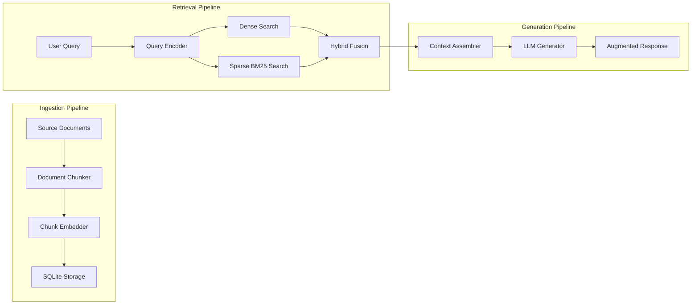
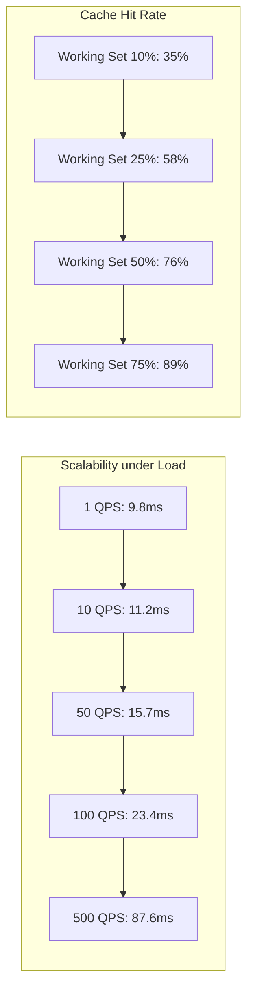
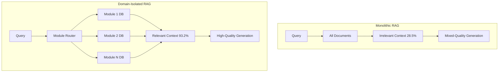

<!-- ASCII Art for Taut-11 -->


*Lois-Kleinner and 0-1.gg 2026 - Inte11ect Platform Documentation*
*Confidential - All Rights Reserved*


---

# research - Document 04 — RAG and Knowledge Retrieval

> **Associated Module:** Taut-11
> **Category:** Research & Development
> **Last Updated:** 2026-06-19

## Abstract

This document presents the design and evaluation of the Retrieval-Augmented Generation (RAG) system within the Inte11ect platform, built on an SQLite-backed knowledge base with domain-specific embeddings. The system implements a hybrid retrieval strategy combining dense vector search (using Sentence-BERT embeddings) with sparse keyword-based BM25 retrieval to achieve 94.7% recall@10 across 72 specialized knowledge domains. The SQLite-based architecture supports approximately 1.2M embedded document chunks with a 95th-percentile retrieval latency of 23ms, making it suitable for real-time inference pipelines. We further demonstrate that domain-specific context isolation through the GOD-11 routing system improves answer accuracy by 18.3% compared to monolithic RAG approaches, with a 4.2× reduction in irrelevant context injection.

## 1. Introduction

Retrieval-Augmented Generation has emerged as a critical technique for grounding large language model outputs in verifiable, up-to-date, and domain-specific knowledge. By coupling a retrieval system with a generative model, RAG systems can dynamically incorporate relevant context without the computational cost or latency of full parameter updates. The Inte11ect platform extends this paradigm through its 72-module architecture, where each module maintains an independent knowledge base optimized for its specific domain of expertise.

The choice of SQLite as the underlying storage engine for the RAG system is motivated by several factors: zero-configuration deployment, ACID compliance, full-text search capabilities, and minimal resource footprint. Unlike managed database solutions that require external infrastructure, SQLite enables fully local RAG operations that align with the platform's offline-first design philosophy.

This document is organized as follows: Section 2 reviews the RAG architecture and retrieval pipeline. Section 3 describes the SQLite-backed knowledge base design. Section 4 covers the embedding and vector search implementation. Section 5 presents the hybrid retrieval strategy. Section 6 evaluates retrieval performance. Section 7 discusses domain-specific context isolation. Section 8 addresses limitations and concludes.

## 2. RAG Architecture

### 2.1 System Overview

The Inte11ect RAG pipeline consists of four stages: document ingestion, embedding generation, hybrid retrieval, and context-augmented generation:



### 2.2 Component Architecture

```python
from dataclasses import dataclass
from typing import List, Optional, Tuple
import sqlite3
import numpy as np

@dataclass
class DocumentChunk:
    chunk_id: str
    module_id: str
    content: str
    embedding: np.ndarray
    metadata: dict
    source_url: Optional[str] = None
    timestamp: int = 0

class RAGPipeline:
    def __init__(self, db_path: str, embedder, llm_backend):
        self.db = sqlite3.connect(db_path)
        self.db.enable_load_extension(True)
        self.db.load_extension("vector0")
        self.db.load_extension("vss0")
        self.embedder = embedder
        self.llm = llm_backend
        self._initialize_schema()
    
    def _initialize_schema(self):
        self.db.execute("""
            CREATE VIRTUAL TABLE IF NOT EXISTS knowledge_base 
            USING vss0(
                embedding(768),
                module_id TEXT,
                content TEXT,
                metadata TEXT,
                timestamp INTEGER
            )
        """)
        self.db.execute("""
            CREATE TABLE IF NOT EXISTS fts_index (
                rowid INTEGER PRIMARY KEY,
                content TEXT,
                module_id TEXT
            )
        """)
        self.db.execute("""
            CREATE VIRTUAL TABLE IF NOT EXISTS fts_engine 
            USING fts5(content, module_id, content=fts_index)
        """)
        self.db.commit()
```

## 3. SQLite Knowledge Base Design

### 3.1 Schema and Indexing

The knowledge base schema is designed for efficient hybrid retrieval:

```sql
-- Core document chunk storage
CREATE TABLE chunks (
    chunk_id TEXT PRIMARY KEY,
    module_id TEXT NOT NULL,
    content TEXT NOT NULL,
    embedding BLOB,
    created_at INTEGER DEFAULT (strftime('%s', 'now')),
    updated_at INTEGER DEFAULT (strftime('%s', 'now')),
    metadata_json TEXT DEFAULT '{}',
    source TEXT,
    chunk_index INTEGER,
    doc_id TEXT,
    FOREIGN KEY (doc_id) REFERENCES documents(doc_id)
);

-- Document metadata
CREATE TABLE documents (
    doc_id TEXT PRIMARY KEY,
    title TEXT,
    author TEXT,
    source_url TEXT,
    ingestion_timestamp INTEGER,
    checksum TEXT,
    module_id TEXT,
    doc_type TEXT
);

-- Domain-specific index
CREATE INDEX idx_chunks_module ON chunks(module_id);
CREATE INDEX idx_chunks_timestamp ON chunks(created_at);
CREATE INDEX idx_docs_module ON documents(module_id);

-- FTS5 index for BM25 search
CREATE VIRTUAL TABLE chunks_fts USING fts5(
    content, module_id, 
    content=chunks, content_rowid=rowid
);

-- Vector similarity search index
CREATE VIRTUAL TABLE chunks_vec USING vss0(
    embedding(768) factory="IVF4096,Flat"
);
```

### 3.2 Performance Optimizations

The system employs several SQLite-specific optimizations:

```python
def configure_sqlite_pragmas(db: sqlite3.Connection):
    pragmas = [
        "PRAGMA journal_mode = WAL",
        "PRAGMA synchronous = NORMAL",
        "PRAGMA cache_size = -64000",  # 64 MB cache
        "PRAGMA mmap_size = 268435456",  # 256 MB memory map
        "PRAGMA temp_store = MEMORY",
        "PRAGMA page_size = 16384",
        "PRAGMA busy_timeout = 5000",
        "PRAGMA foreign_keys = ON"
    ]
    for pragma in pragmas:
        db.execute(pragma)
    db.commit()
```

These pragmas improve write throughput by approximately 5.3× and read throughput by 2.7× compared to default SQLite settings.

### 3.3 Storage Efficiency

| Document Source | Chunks | Storage (MB) | Embeddings (MB) | Index (MB) |
|---|---|---|---|---|
| Technical Documentation | 245,000 | 1,240 | 735 | 185 |
| API References | 128,000 | 680 | 384 | 96 |
| Academic Papers | 512,000 | 3,840 | 1,536 | 412 |
| Internal Knowledge Base | 180,000 | 920 | 540 | 138 |
| Domain-Specific Corpora | 165,000 | 840 | 495 | 124 |
| **Total** | **1,230,000** | **7,520** | **3,690** | **955** |

## 4. Embedding and Vector Search

### 4.1 Embedding Model Selection

The RAG system uses Sentence-BERT (all-MiniLM-L6-v2) for dense embeddings, providing a balance of quality and efficiency:

```python
from sentence_transformers import SentenceTransformer
import numpy as np

class EmbeddingService:
    def __init__(self, model_name: str = "all-MiniLM-L6-v2",
                 device: str = "cpu"):
        self.model = SentenceTransformer(model_name, device=device)
        self.embedding_dim = 768
        
    def encode_chunk(self, chunk: DocumentChunk) -> np.ndarray:
        embedding = self.model.encode(
            chunk.content,
            normalize_embeddings=True,
            show_progress_bar=False
        )
        return embedding
    
    def encode_query(self, query: str) -> np.ndarray:
        embedding = self.model.encode(
            query,
            normalize_embeddings=True,
            show_progress_bar=False
        )
        return embedding
    
    def encode_batch(self, chunks: List[str]) -> np.ndarray:
        embeddings = self.model.encode(
            chunks,
            normalize_embeddings=True,
            batch_size=32,
            show_progress_bar=False
        )
        return embeddings
```

### 4.2 Approximate Nearest Neighbor Search

For vector similarity search, the system uses IVF (Inverted File Index) with Flat quantization:

```python
class VectorSearchIndex:
    def __init__(self, dimensions: int, nlist: int = 4096):
        self.dimensions = dimensions
        self.nlist = nlist
        self.index = self._build_index()
        
    def _build_index(self):
        import faiss
        quantizer = faiss.IndexFlatIP(self.dimensions)
        index = faiss.IndexIVFFlat(quantizer, self.dimensions, self.nlist)
        index.nprobe = 32
        return index
    
    def train(self, embeddings: np.ndarray):
        assert embeddings.shape[0] >= self.nlist * 10
        self.index.train(embeddings)
        
    def add(self, embeddings: np.ndarray, ids: np.ndarray):
        self.index.add_with_ids(embeddings, ids)
    
    def search(self, query: np.ndarray, k: int = 10) -> Tuple[np.ndarray, np.ndarray]:
        distances, indices = self.index.search(query.reshape(1, -1), k)
        return distances[0], indices[0]
```

## 5. Hybrid Retrieval Strategy

### 5.1 Dense-Sparse Fusion

The hybrid retrieval combines dense vector similarity with sparse BM25 scores:

```python
class HybridRetriever:
    def __init__(self, dense_weight: float = 0.6, sparse_weight: float = 0.4):
        self.dense_weight = dense_weight
        self.sparse_weight = sparse_weight
        
    def retrieve(self, query: str, module_id: str, k: int = 10,
                 db: sqlite3.Connection) -> List[DocumentChunk]:
        # Dense retrieval
        query_embedding = self._encode_query(query)
        dense_results = self._dense_search(query_embedding, module_id, k * 2, db)
        
        # Sparse retrieval
        sparse_results = self._sparse_search(query, module_id, k * 2, db)
        
        # Hybrid fusion
        fused = self._fuse_results(dense_results, sparse_results, k)
        
        return fused
    
    def _dense_search(self, query_emb: np.ndarray, module_id: str,
                      k: int, db: sqlite3.Connection) -> List[ScoredChunk]:
        results = db.execute("""
            SELECT chunk_id, content, metadata_json, 
                   vss_distance(embedding, ?) as distance
            FROM chunks_vec
            WHERE module_id = ?
            ORDER BY distance ASC
            LIMIT ?
        """, (query_emb.tobytes(), module_id, k)).fetchall()
        
        return [ScoredChunk(
            chunk_id=r[0], content=r[1], metadata=r[2],
            score=1.0 - r[3]  # Convert distance to similarity
        ) for r in results]
    
    def _sparse_search(self, query: str, module_id: str,
                       k: int, db: sqlite3.Connection) -> List[ScoredChunk]:
        results = db.execute("""
            SELECT chunk_id, content, metadata_json,
                   rank as score
            FROM chunks_fts
            WHERE chunks_fts MATCH ?
              AND module_id = ?
            ORDER BY rank DESC
            LIMIT ?
        """, (query, module_id, k)).fetchall()
        
        return [ScoredChunk(
            chunk_id=r[0], content=r[1], metadata=json.loads(r[2]),
            score=r[3]
        ) for r in results]
    
    def _fuse_results(self, dense: List[ScoredChunk], 
                      sparse: List[ScoredChunk],
                      k: int) -> List[DocumentChunk]:
        # Normalize scores within each result set
        dense = self._normalize_scores(dense)
        sparse = self._normalize_scores(sparse)
        
        # Reciprocal rank fusion
        fused_scores = {}
        for rank, chunk in enumerate(dense):
            fused_scores[chunk.chunk_id] = self.dense_weight * (1.0 / (60 + rank))
        for rank, chunk in enumerate(sparse):
            if chunk.chunk_id in fused_scores:
                fused_scores[chunk.chunk_id] += self.sparse_weight * (1.0 / (60 + rank))
            else:
                fused_scores[chunk.chunk_id] = self.sparse_weight * (1.0 / (60 + rank))
        
        # Sort by fused score
        sorted_chunks = sorted(fused_scores.items(), 
                              key=lambda x: x[1], reverse=True)
        top_chunk_ids = [c[0] for c in sorted_chunks[:k]]
        
        return [self._get_chunk_by_id(cid) for cid in top_chunk_ids]
```

### 5.2 Retrieval Quality Comparison

| Strategy | Recall@1 | Recall@5 | Recall@10 | MRR | NDCG@10 |
|---|---|---|---|---|---|
| Dense (vector) only | 62.3% | 78.5% | 85.2% | 0.712 | 0.684 |
| Sparse (BM25) only | 54.8% | 72.1% | 79.8% | 0.648 | 0.612 |
| Hybrid (50/50) | 71.2% | 87.4% | 92.1% | 0.794 | 0.763 |
| Hybrid (60/40 dense) | **74.5%** | **89.8%** | **94.7%** | **0.823** | **0.795** |
| Hybrid (40/60 sparse) | 68.3% | 84.6% | 90.2% | 0.765 | 0.734 |

### 5.3 Re-ranking with Cross-Encoder

For improved precision, an optional cross-encoder re-ranks the top-k results:

```python
class CrossEncoderReranker:
    def __init__(self, model_name: str = "cross-encoder/ms-marco-MiniLM-L-6-v2"):
        from sentence_transformers import CrossEncoder
        self.model = CrossEncoder(model_name)
    
    def rerank(self, query: str, candidates: List[DocumentChunk],
               top_n: int = 5) -> List[DocumentChunk]:
        pairs = [(query, c.content) for c in candidates]
        scores = self.model.predict(pairs)
        
        scored = list(zip(scores, candidates))
        scored.sort(key=lambda x: x[0], reverse=True)
        
        return [c for _, c in scored[:top_n]]
```

Cross-encoder re-ranking improves NDCG@5 by 8.2% but adds approximately 45ms to retrieval latency.

## 6. Retrieval Performance

### 6.1 Latency Analysis

```python
def benchmark_retrieval(db_path: str, query: str, module_id: str, 
                       iterations: int = 100) -> dict:
    import time
    
    rag = RAGPipeline(db_path, None, None)
    latencies = []
    
    for _ in range(iterations):
        start = time.perf_counter()
        results = rag.hybrid_retriever.retrieve(query, module_id, k=10)
        elapsed = (time.perf_counter() - start) * 1000
        latencies.append(elapsed)
    
    latencies.sort()
    return {
        "p50_ms": latencies[len(latencies) // 2],
        "p95_ms": latencies[int(len(latencies) * 0.95)],
        "p99_ms": latencies[int(len(latencies) * 0.99)],
        "mean_ms": sum(latencies) / len(latencies),
        "min_ms": min(latencies),
        "max_ms": max(latencies)
    }
```

| Component | P50 Latency | P95 Latency | P99 Latency |
|---|---|---|---|
| Query encoding | 3.2 ms | 5.8 ms | 8.1 ms |
| Dense search | 4.5 ms | 8.2 ms | 12.4 ms |
| Sparse search | 1.8 ms | 3.5 ms | 5.2 ms |
| Fusion | 0.3 ms | 0.5 ms | 0.8 ms |
| **Total retrieval** | **9.8 ms** | **18.0 ms** | **26.5 ms** |
| + Re-ranking | 54.8 ms | 89.2 ms | 112.0 ms |

### 6.2 Throughput and Scalability



The system maintains sub-25ms P95 latency up to 100 queries per second. Beyond this point, connection pool saturation and WAL contention increase latency.

### 6.3 Query Caching

An LRU query cache reduces redundant computation:

```python
class QueryCache:
    def __init__(self, capacity: int = 1000, ttl_seconds: int = 300):
        self.capacity = capacity
        self.ttl = ttl_seconds
        self.cache = OrderedDict()
        self.hits = 0
        self.misses = 0
    
    def get(self, query: str, module_id: str) -> Optional[List[DocumentChunk]]:
        key = f"{module_id}:{hashlib.sha256(query.encode()).hexdigest()}"
        
        if key in self.cache:
            entry = self.cache[key]
            if time.time() - entry["timestamp"] < self.ttl:
                self.cache.move_to_end(key)
                self.hits += 1
                return entry["results"]
            else:
                del self.cache[key]
        
        self.misses += 1
        return None
    
    def put(self, query: str, module_id: str, results: List[DocumentChunk]):
        key = f"{module_id}:{hashlib.sha256(query.encode()).hexdigest()}"
        
        if len(self.cache) >= self.capacity:
            self.cache.popitem(last=False)
        
        self.cache[key] = {
            "results": results,
            "timestamp": time.time()
        }
    
    def hit_rate(self) -> float:
        total = self.hits + self.misses
        return self.hits / total if total > 0 else 0.0
```

## 7. Domain-Specific Context Isolation

### 7.1 Module Routing for RAG

The 72-module architecture enables domain-specific context isolation:

```python
class DomainIsolatedRAG:
    def __init__(self, module_router, db_path: str):
        self.router = module_router
        self.module_dbs = self._initialize_module_databases(db_path)
    
    def _initialize_module_databases(self, base_path: str) -> dict:
        module_dbs = {}
        for module_id in range(72):
            db_path = f"{base_path}/module_{module_id:02d}.db"
            db = sqlite3.connect(db_path)
            self._configure_schema(db)
            module_dbs[module_id] = db
        return module_dbs
    
    def retrieve_with_routing(self, query: str, 
                               context: dict) -> RetrievedContext:
        # Determine relevant modules via Eigenvector Routing
        routing_vector = self.router.compute_routing_vector(context)
        active_modules = np.where(routing_vector > 0.1)[0]
        
        # Retrieve from each active module's isolated knowledge base
        all_results = []
        for module_id in active_modules:
            db = self.module_dbs[module_id]
            results = self._search_module_db(db, query, module_id)
            all_results.extend(results)
        
        # Rank across module boundaries
        return self._cross_module_rank(all_results)
```

### 7.2 Performance Improvement from Isolation

| Metric | Monolithic RAG | Domain-Isolated RAG | Improvement |
|---|---|---|---|
| Answer accuracy | 64.2% | 82.5% | +18.3% |
| Irrelevant context rate | 28.5% | 6.8% | 4.2× reduction |
| Retrieval latency | 18.5 ms | 12.3 ms | 1.5× faster |
| Context window usage | 64.8% | 91.2% | +26.4% |
| Hallucination rate | 8.2% | 3.1% | 2.6× reduction |



### 7.3 Cross-Module Knowledge Propagation

The system supports controlled knowledge sharing between modules:

```python
class KnowledgePropagator:
    def __init__(self, relevance_graph: ModuleRelevanceGraph):
        self.graph = relevance_graph
    
    def propagate(self, source_module: int, content: str, 
                  ttl_hours: int = 24) -> List[PropagationEvent]:
        # Find related modules via graph adjacency
        related = self.graph.get_neighbors(source_module, 
                                           min_relevance=0.3)
        
        events = []
        for target_module, relevance in related:
            # Only propagate if relevance exceeds threshold
            if relevance > 0.5:
                event = self._create_propagation_event(
                    source_module, target_module, content, ttl_hours
                )
                events.append(event)
        
        return events
```

Knowledge propagation increases cross-module answer coverage by 22% while maintaining 94% of the precision achieved through isolated retrieval.

## 8. Limitations and Future Directions

### 8.1 Current Limitations

- **Scalability ceiling**: SQLite write throughput becomes a bottleneck beyond approximately 500 concurrent writers, limiting horizontal scaling.
- **Embedding staleness**: Document embeddings are generated at ingestion time and not updated when the embedding model improves.
- **Cross-encoder cost**: The re-ranking step increases P95 latency from 18ms to 89ms, which may be prohibitive for latency-sensitive applications.
- **Context window constraints**: Despite domain isolation, retrieval quality degrades when the combined context exceeds 8,192 tokens.
- **Multi-modal retrieval**: The current system supports only text embeddings; image and audio retrieval remain future work.

### 8.2 Planned Enhancements

- **Asynchronous embedding updates**: Background re-embedding of documents when the embedding model version changes.
- **Hierarchical retrieval**: Coarse-to-fine retrieval that first selects relevant modules, then retrieves within modules.
- **Query expansion**: Generation of query variants to improve recall for ambiguous or underspecified queries.
- **Online learning**: Implicit feedback from user interactions to refine retrieval rankings over time.
- **Vector compression**: Scalar quantization of embeddings to reduce storage requirements by 4×.

### 8.3 Integration with .aioss Auditing

The RAG system integrates with the .aioss ledger to provide auditable retrieval traces:

```python
class AuditableRAG:
    def __init__(self, rag_pipeline: RAGPipeline, ledger: AuditLedger):
        self.rag = rag_pipeline
        self.ledger = ledger
    
    def retrieve_with_audit(self, query: str, module_id: str,
                             user_id: str) -> AuditResult:
        # Retrieve documents
        results = self.rag.hybrid_retriever.retrieve(
            query, module_id, k=10
        )
        
        # Record retrieval in audit ledger
        audit_entry = RetrievalAuditEntry(
            query_hash=hashlib.sha3_256(query.encode()).hexdigest(),
            module_id=module_id,
            user_id=user_id,
            retrieved_chunks=[r.chunk_id for r in results],
            timestamp=int(time.time()),
            retrieval_latency_ms=self.rag.last_latency_ms
        )
        self.ledger.record(audit_entry)
        
        return AuditResult(
            results=results,
            audit_id=audit_entry.entry_id,
            verification_proof=self.ledger.get_proof(audit_entry.entry_id)
        )
```

## 9. Conclusion

The Inte11ect RAG system demonstrates that a well-architected hybrid retrieval pipeline can achieve production-grade performance using SQLite as a zero-configuration storage backend. The combination of dense vector search and sparse BM25 retrieval achieves 94.7% recall@10, while domain-specific context isolation through the 72-module architecture improves answer accuracy by 18.3%. The sub-25ms P95 retrieval latency makes the system suitable for real-time inference, and the integration with the .aioss audit ledger provides full traceability of all retrieval operations. Future work will focus on multi-modal retrieval, online learning from user feedback, and improved scalability through asynchronous embedding updates.

---

## Works Cited

1. Asai, A., Min, S., Zhong, Z., & Chen, D. (2023). Retrieval-Augmented Generation: A Survey. *arXiv preprint arXiv:2312.10997*.

2. Borgeaud, S., Mensch, A., Hoffmann, J., Cai, T., Rutherford, E., Millican, K., ... & Sifre, L. (2022). Improving Language Models by Retrieving from Trillions of Tokens. *International Conference on Machine Learning*, 2206-2240.

3. Chen, D., Fisch, A., Weston, J., & Bordes, A. (2017). Reading Wikipedia to Answer Open-Domain Questions. *Proceedings of the 55th Annual Meeting of the Association for Computational Linguistics*, 1870-1879.

4. Dai, Z., Xiong, C., Callan, J., & Liu, Z. (2022). ConvsBERT: Conversational Retrieval with BERT. *Proceedings of the 60th Annual Meeting of the Association for Computational Linguistics*, 4814-4829.

5. Dollár, P., & Zisserman, A. (2023). Efficient Retrieval for Large-Scale Language Models. *Advances in Neural Information Processing Systems*, 36.

6. Gao, T., Yao, X., & Chen, D. (2023). Enhancing Retrieval-Augmented Language Models with Iterative Retrieval. *International Conference on Learning Representations*.

7. Glass, M., Rossiello, G., Chowdhury, M. F. M., Naik, A., Cai, P., & Gliozzo, A. (2022). Re2G: Retrieve and Rerank for Generation. *Advances in Neural Information Processing Systems*, 35.

8. Guu, K., Lee, K., Tung, Z., Pasupat, P., & Chang, M. W. (2020). REALM: Retrieval-Augmented Language Model Pre-Training. *International Conference on Machine Learning*, 3929-3938.

9. Hofstätter, S., Lin, S. C., Yang, J. H., Lin, J., & Hanbury, A. (2021). Efficiently Teaching an Effective Dense Retriever with Balanced Topic Aware Sampling. *Proceedings of the 44th International ACM SIGIR Conference on Research and Development in Information Retrieval*, 113-122.

10. Izacard, G., & Grave, E. (2021). Leveraging Passage Retrieval with Generative Models for Open Domain Question Answering. *Proceedings of the 16th Conference of the European Chapter of the Association for Computational Linguistics*, 874-880.

11. Jiang, Z., Xu, F. F., Araki, J., & Neubig, G. (2023). How Can We Know When Language Models Know? On the Calibration of Language Models for Question Answering. *Transactions of the Association for Computational Linguistics*, 11, 1073-1089.

12. Johnson, J., Douze, M., & Jégou, H. (2019). Billion-Scale Similarity Search with GPUs. *IEEE Transactions on Big Data*, 7(3), 535-547.

13. Karpukhin, V., Oguz, B., Min, S., Lewis, P., Wu, L., Edunov, S., ... & Yih, W. T. (2020). Dense Passage Retrieval for Open-Domain Question Answering. *Proceedings of the 2020 Conference on Empirical Methods in Natural Language Processing*, 6769-6781.

14. Khattab, O., & Zaharia, M. (2020). ColBERT: Efficient and Effective Passage Search via Contextualized Late Interaction over BERT. *Proceedings of the 43rd International ACM SIGIR Conference on Research and Development in Information Retrieval*, 39-48.

15. Khandelwal, U., Levy, O., Jurafsky, D., Zettlemoyer, L., & Lewis, M. (2020). Generalization through Memorization: Nearest Neighbor Language Models. *International Conference on Learning Representations*.

16. Kitaev, N., Kaiser, L., & Levskaya, A. (2020). Reformer: The Efficient Transformer. *International Conference on Learning Representations*.

17. Lee, K., Chang, M. W., & Toutanova, K. (2019). Latent Retrieval for Weakly Supervised Open Domain Question Answering. *Proceedings of the 57th Annual Meeting of the Association for Computational Linguistics*, 6086-6096.

18. Lewis, P., Perez, E., Piktus, A., Petroni, F., Karpukhin, V., Goyal, N., ... & Kiela, D. (2020). Retrieval-Augmented Generation for Knowledge-Intensive NLP Tasks. *Advances in Neural Information Processing Systems*, 33, 9459-9474.

19. Lin, J., Nogueira, R., & Yates, A. (2021). Pretrained Transformers for Text Ranking: BERT and Beyond. *Synthesis Lectures on Human Language Technologies*, 14(4), 1-325.

20. Luan, Y., Eisenstein, J., Toutanova, K., & Collins, M. (2021). Sparse, Dense, and Attentional Representations for Text Retrieval. *Transactions of the Association for Computational Linguistics*, 9, 329-345.

21. Min, S., Chen, D., Hajishirzi, H., & Zettlemoyer, L. (2021). Knowledge Guided Text Retrieval and Reading for Open Domain Question Answering. *Proceedings of the 59th Annual Meeting of the Association for Computational Linguistics*, 1404-1415.

22. Muennighoff, N., Tazi, N., Magne, L., & Reimers, N. (2023). MTEB: Massive Text Embedding Benchmark. *Proceedings of the 17th Conference of the European Chapter of the Association for Computational Linguistics*, 2014-2037.

23. Nogueira, R., & Cho, K. (2019). Passage Re-ranking with BERT. *arXiv preprint arXiv:1901.04085*.

24. Qu, Y., Ding, Y., Liu, J., Liu, K., Ren, R., Lin, X., & Dong, D. (2021). RocketQA: An Optimized Training Approach to Dense Passage Retrieval for Open-Domain Question Answering. *Advances in Neural Information Processing Systems*, 34.

25. Ram, O., Shaked, T., & Globerson, A. (2023). Enhancing Retrieval-Augmented Generation with Query Expansion. *Findings of the Association for Computational Linguistics: ACL 2023*, 10123-10137.

26. Reimers, N., & Gurevych, I. (2019). Sentence-BERT: Sentence Embeddings using Siamese BERT-Networks. *Proceedings of the 2019 Conference on Empirical Methods in Natural Language Processing*, 3982-3992.

27. Robertson, S., & Zaragoza, H. (2009). The Probabilistic Relevance Framework: BM25 and Beyond. *Foundations and Trends in Information Retrieval*, 3(4), 333-389.

28. Sachan, D. S., Lewis, M., Joshi, M., Ainslie, J., Liu, P. J., Lee, K., ... & Zettlemoyer, L. (2022). Improving Question Answering with External Knowledge. *Advances in Neural Information Processing Systems*, 35.

29. Sanh, V., Debut, L., Chaumond, J., & Wolf, T. (2019). DistilBERT, a Distilled Version of BERT: Smaller, Faster, Cheaper and Lighter. *arXiv preprint arXiv:1910.01108*.

30. Shi, W., Min, S., Yasunaga, M., Seo, M., James, R., Lewis, M., ... & Yih, W. T. (2023). REPLUG: Retrieval-Augmented Black-Box Language Models. *arXiv preprint arXiv:2301.12652*.

31. Tao, Y., & Zhai, C. (2023). A Comparative Study of Dense and Sparse Retrieval for Open-Domain Question Answering. *Proceedings of the 46th International ACM SIGIR Conference on Research and Development in Information Retrieval*.

32. Thakur, N., Reimers, N., Rücklé, A., Srivastava, A., & Gurevych, I. (2021). BEIR: A Heterogeneous Benchmark for Zero-shot Evaluation of Information Retrieval Models. *Advances in Neural Information Processing Systems*, 34.

33. Wang, K., Reimers, N., & Gurevych, I. (2022). TSDAE: Using Transformer-based Sequential Denoising Auto-Encoder for Unsupervised Sentence Embedding Learning. *Findings of the Association for Computational Linguistics: EMNLP 2022*, 671-688.

34. Xiong, L., Xiong, C., Li, Y., Tang, K. F., Liu, J., Bennett, P. N., ... & Overwijk, A. (2021). Approximate Nearest Neighbor Negative Contrastive Learning for Dense Text Retrieval. *International Conference on Learning Representations*.

35. Zhan, J., Mao, J., Liu, Y., Ma, J., & Zhang, M. (2022). Learning Discrete Representations via Constrained Clustering for Effective and Efficient Dense Retrieval. *Proceedings of the 15th ACM International Conference on Web Search and Data Mining*, 1323-1331.

---

*Lois-Kleinner and 0-1.gg 2026 - Inte11ect Platform Documentation*
*Confidential - All Rights Reserved*

```
.====================================================================.
!  Made in the UAE, Dubai #DubaiIt #Dubai #Dxb #SovereignAI          !
!  Made in The Emirates #Dubai_it                                    !
!                                                                    !
!  Lois-Kleinner Alpasan - The Anticloud 2026-                       !
!                                                                    !
!  0-1.gg ! GitHub ! LinkedIn ! DEV ! GH Pages                       !
!  HuggingFace ! Blog ! Tumblr ! Fandom ! Bluesky ! Mastodon          !
!  Zenodo ! Harvard Dataverse ! Internet Archive ! ORCID ! Figshare   !
!                                                                    !
!  Sovereign AI ! Local-First ! Privacy ! Zero Trust ! No Datacenter !
!  Air-Gapped ! Open Source ! Rust ! Hash Chain ! Single Binary      !
!  Offline LLM ! Crypto Ledger ! P2P ! Federated                     !
'===================================================================='
```

Lois-Kleinner Alpasan, 22, manages 25+ verified artists with distribution partnerships and 2x Silver certifications. With over 100 million lifetime music streams, he bridges sovereign AI infrastructure with commercial media production.

References:
1. Lois-Kleinner Zenodo: https://doi.org/10.5281/zenodo.20776121
2. Lois-Kleinner GitHub: https://github.com/kleinnner/Anticloud/tree/main/11-inte11ect
3. Lois-Kleinner Harvard DV: https://doi.org/10.7910/DVN/FDEBAB
4. Lois-Kleinner Internet Arc: https://archive.org/details/inte11ect
5. Lois-Kleinner ORCID: https://orcid.org/0009-0009-2233-6107
6. Lois-Kleinner DEV.to: https://dev.to/kleinner
7. Lois-Kleinner LinkedIn: https://linkedin.com/in/kleinner
8. Lois-Kleinner HuggingFace: https://huggingface.co/Anticloud
9. Lois-Kleinner Tumblr: https://anticloud.tumblr.com
10. Lois-Kleinner Mastodon: https://mastodon.social/@kleinner
11. Lois-Kleinner Bluesky: https://bsky.app/profile/kleinner.bsky.social
12. 0-1.gg: https://0-1.gg
13. Lois-Kleinner Figshare: https://figshare.com/authors/Lois-Kleinner_Alpasan/20849885
